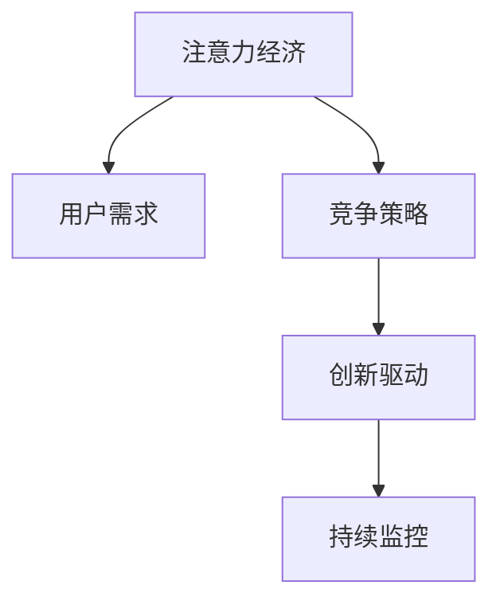

                 

# 注意力经济对企业创新管理的影响

## 1. 背景介绍

### 1.1 问题由来
在数字化时代，信息爆炸和注意力分散成为了常态。企业家和创新者需要面对一个日益复杂且竞争激烈的市场环境，其中最核心的问题之一是如何吸引和利用用户注意力，进而推动企业创新。在信息时代，注意力经济的重要性日益凸显，它不仅是企业竞争力的关键，也是创新管理的基石。

注意力经济（Economy of Attention）是指在信息过载的背景下，企业如何通过提供独特、有价值的内容和服务，吸引和保持用户的注意力，从而实现商业价值的提升和创新目标的达成。随着互联网和社交媒体的普及，用户注意力逐渐成为一种稀缺资源，企业需要更加注重用户的注意力管理，这直接关系到企业的市场占有率和收益能力。

### 1.2 问题核心关键点
1. **注意力管理**：如何有效地吸引和利用用户注意力是注意力经济的核心问题。
2. **用户需求**：理解并满足用户真正的需求，提供有价值的内容和服务。
3. **竞争策略**：制定出有针对性的竞争策略，保持竞争力。
4. **创新驱动**：利用用户的注意力来推动产品创新和服务优化。
5. **持续监控**：通过数据分析和用户反馈，持续优化注意力管理策略。

### 1.3 问题研究意义
研究注意力经济对企业创新管理的影响，对于理解和利用用户注意力，提升企业竞争力和创新能力，具有重要意义：

1. 有助于企业更好地适应数字化时代的市场环境。
2. 通过注意力管理，可以提升产品和服务的用户接受度和市场影响力。
3. 关注用户需求，可以推动企业不断创新，满足用户多样化和个性化的需求。
4. 有效的竞争策略和注意力管理，可以提高企业的市场占有率和盈利能力。
5. 利用数据驱动的持续监控和优化，可以不断提升用户满意度和忠诚度。

## 2. 核心概念与联系

### 2.1 核心概念概述

为了深入理解注意力经济对企业创新管理的影响，本节将介绍几个关键概念：

- **注意力经济**：在信息时代，用户注意力成为一种稀缺资源，企业需要通过独特、有价值的内容和服务吸引和保持用户的注意力，从而实现商业价值的提升和创新目标的达成。
- **用户需求**：用户的真实需求是创新的出发点和落脚点，理解并满足用户需求，是企业持续创新的基石。
- **竞争策略**：在高度竞争的市场环境中，制定有针对性的竞争策略，是企业保持竞争力的关键。
- **创新驱动**：利用用户的注意力来推动产品创新和服务优化，不断提升用户体验。
- **持续监控**：通过数据分析和用户反馈，不断优化注意力管理策略，提升创新效果。

这些核心概念之间的逻辑关系可以通过以下Mermaid流程图来展示：



这个流程图展示了几者之间的逻辑关系：注意力经济通过理解用户需求，制定竞争策略，驱动产品创新，并通过持续监控不断优化策略，共同构成了企业创新管理的基础框架。

## 3. 核心算法原理 & 具体操作步骤

### 3.1 算法原理概述

注意力经济对企业创新管理的影响，涉及到用户注意力获取、需求分析、竞争策略制定和持续优化等多个环节。其核心算法原理可以概括为以下几个步骤：

1. **注意力获取**：通过分析用户行为数据，识别和吸引用户的注意力。
2. **需求分析**：基于用户反馈和行为数据，深入挖掘用户的真实需求。
3. **竞争策略制定**：通过市场分析，制定具有竞争力的策略。
4. **创新驱动**：利用用户注意力，推动产品和服务创新。
5. **持续监控和优化**：通过数据分析和用户反馈，持续优化注意力管理策略，提升创新效果。

### 3.2 算法步骤详解

#### 3.2.1 注意力获取

注意力获取的算法原理可以简单概括为以下几个步骤：

1. **数据收集**：通过网站流量分析、用户行为跟踪、社交媒体监测等方式，收集用户的注意力数据。
2. **注意力模型训练**：使用机器学习模型（如聚类、回归等），分析用户行为数据，识别出关键行为特征和注意力来源。
3. **注意力吸引策略**：根据用户特征和行为数据，制定吸引用户注意力的策略，如个性化推荐、内容优化、互动激励等。

#### 3.2.2 需求分析

需求分析的算法原理可以概括为以下几个步骤：

1. **用户反馈收集**：通过用户评论、评分、问卷调查等方式，收集用户对产品和服务的需求反馈。
2. **数据挖掘和分析**：使用自然语言处理、情感分析、聚类等技术，分析用户反馈数据，挖掘出用户的真实需求和痛点。
3. **需求优先级排序**：根据用户反馈的强度和频率，对需求进行优先级排序，确定哪些需求最为紧迫和重要。

#### 3.2.3 竞争策略制定

竞争策略制定的算法原理可以概括为以下几个步骤：

1. **市场分析**：通过SWOT分析、市场调研等方式，分析竞争对手的优势和劣势，识别市场机会和威胁。
2. **策略制定**：根据市场分析结果，制定有针对性的竞争策略，如价格策略、推广策略、产品差异化等。
3. **策略实施和监控**：实施竞争策略，并持续监控效果，根据市场反馈进行策略调整。

#### 3.2.4 创新驱动

创新驱动的算法原理可以概括为以下几个步骤：

1. **创新点识别**：通过分析用户需求和市场趋势，识别出潜在的创新点。
2. **创新方案设计**：根据创新点，设计可行的创新方案，并进行可行性分析。
3. **创新方案实施**：选择最佳的创新方案，进行产品和服务优化，推出创新产品。
4. **创新效果评估**：通过用户反馈和市场数据，评估创新效果，进行迭代优化。

#### 3.2.5 持续监控和优化

持续监控和优化的算法原理可以概括为以下几个步骤：

1. **数据监控和收集**：实时监控用户行为数据和市场反馈，定期收集用户需求和市场数据。
2. **数据分析和建模**：使用机器学习、数据挖掘等技术，分析用户行为和需求变化，构建预测模型。
3. **策略优化**：根据数据分析结果，调整注意力获取和创新策略，提升策略效果。
4. **效果评估**：通过KPI（关键绩效指标）评估策略效果，进行持续改进。

### 3.3 算法优缺点

注意力经济对企业创新管理的影响，具有以下几个优点：

1. **提升市场竞争力**：通过吸引和利用用户注意力，企业可以提升市场占有率和盈利能力。
2. **驱动产品创新**：利用用户注意力，推动产品和服务创新，满足用户需求。
3. **精准市场定位**：通过数据驱动的市场分析，制定精准的市场策略。
4. **用户满意度提升**：通过满足用户需求，提升用户满意度和忠诚度。

同时，该方法也存在以下局限性：

1. **数据依赖**：注意力经济高度依赖于用户行为数据和市场数据，数据质量和安全问题成为关键。
2. **用户隐私**：在收集用户行为数据时，需要注意用户隐私保护，避免数据滥用。
3. **算法复杂**：注意力经济涉及多种算法和模型，算法复杂度高，需要较强的技术支持。
4. **竞争激烈**：在高度竞争的市场环境中，注意力经济需要不断创新和优化，才能保持竞争力。
5. **用户依赖**：注意力经济高度依赖于用户注意力的保持，一旦用户流失，效果会大打折扣。

### 3.4 算法应用领域

注意力经济对企业创新管理的影响，主要应用于以下几个领域：

1. **互联网和社交媒体**：通过分析用户行为数据，制定个性化推荐和内容优化策略，提升用户粘性。
2. **电子商务**：通过吸引和保持用户注意力，提升电商平台的销售转化率和用户满意度。
3. **金融科技**：通过个性化推荐和智能投顾，提升用户理财体验和金融服务质量。
4. **健康科技**：通过健康监测和个性化推荐，提升用户的健康意识和行为改变。
5. **教育和培训**：通过个性化学习路径和互动内容，提升用户的学习效果和满意度。

以上领域只是注意力经济应用的一部分，随着技术的不断发展和应用的深入，注意力经济将会在更多行业得到广泛应用，进一步推动各行业的数字化转型和创新升级。

## 4. 数学模型和公式 & 详细讲解 & 举例说明

### 4.1 数学模型构建

在注意力经济中，常用的数学模型包括用户行为分析模型、需求优先级排序模型、市场竞争分析模型等。这里以用户行为分析模型为例，介绍其数学模型构建和公式推导。

#### 4.1.1 用户行为分析模型

用户行为分析模型旨在通过用户行为数据，识别出关键行为特征和注意力来源。常见的用户行为分析模型包括聚类模型和回归模型。这里以K-means聚类模型为例，介绍其数学模型构建和公式推导。

K-means聚类模型的核心思想是将用户行为数据分成K个簇，每个簇代表一种用户行为模式。模型的目标是最小化簇内平方和误差，使得同一簇内的用户行为尽可能相似。数学模型可以表示为：

$$
\min_{\mathbf{C}, \mathbf{Z}} \sum_{i=1}^{n}\min_{k} ||\mathbf{x}_i - \mathbf{c}_k||^2 + \lambda \sum_{i=1}^{n}||\mathbf{x}_i - \mathbf{z}_i||^2
$$

其中，$\mathbf{x}_i$ 表示用户行为数据，$\mathbf{c}_k$ 表示簇中心，$\mathbf{z}_i$ 表示用户向量，$\lambda$ 为正则化参数，控制簇内和簇间权衡。

#### 4.1.2 公式推导过程

K-means聚类模型的公式推导过程如下：

1. **初始化**：随机初始化K个簇中心$\mathbf{c}_k$。
2. **分配用户**：计算每个用户$\mathbf{x}_i$到每个簇中心$\mathbf{c}_k$的距离，分配到距离最近的簇。
3. **更新簇中心**：根据分配结果，更新每个簇的簇中心$\mathbf{c}_k$，使得簇内数据点$\mathbf{x}_i$与簇中心$\mathbf{c}_k$的距离最小。
4. **迭代优化**：重复分配和更新过程，直至簇中心不再变化或达到预设迭代次数。

### 4.2 案例分析与讲解

#### 4.2.1 电商平台的个性化推荐

电商平台的个性化推荐是注意力经济在电商领域的典型应用。以某电商平台为例，平台收集用户浏览、点击、购买等行为数据，使用K-means聚类模型进行分析，识别出用户行为模式，然后根据不同行为模式设计个性化推荐策略。例如，对于喜欢购买运动鞋的用户，推荐运动鞋类产品；对于喜欢购买美容产品的人，推荐护肤品类产品。

#### 4.2.2 金融科技的智能投顾

金融科技的智能投顾也是注意力经济在金融领域的应用。以某智能投顾平台为例，平台收集用户投资行为数据，使用回归模型分析用户投资偏好和风险承受能力，然后根据分析结果，推荐个性化的投资组合。例如，对于风险偏好高的用户，推荐股票型基金；对于风险偏好低的用户，推荐债券型基金。

## 5. 项目实践：代码实例和详细解释说明

### 5.1 开发环境搭建

在项目实践前，我们需要准备好开发环境。以下是使用Python进行K-means聚类分析的环境配置流程：

1. 安装Anaconda：从官网下载并安装Anaconda，用于创建独立的Python环境。

2. 创建并激活虚拟环境：
```bash
conda create -n kmeans-env python=3.8 
conda activate kmeans-env
```

3. 安装必要的Python库：
```bash
pip install numpy pandas sklearn matplotlib
```

4. 安装K-means库：
```bash
pip install sklearn
```

完成上述步骤后，即可在`kmeans-env`环境中开始项目实践。

### 5.2 源代码详细实现

下面我们以电商平台的个性化推荐为例，给出使用K-means聚类模型进行用户行为分析的Python代码实现。

首先，导入必要的库和数据集：

```python
import numpy as np
import pandas as pd
from sklearn.cluster import KMeans
from sklearn.preprocessing import StandardScaler

# 导入数据集
data = pd.read_csv('user_behavior.csv')
```

然后，数据预处理和标准化：

```python
# 数据预处理
features = ['浏览时长', '点击次数', '购买次数']
X = data[features].values

# 标准化
scaler = StandardScaler()
X_scaled = scaler.fit_transform(X)
```

接着，K-means聚类分析：

```python
# K-means聚类
kmeans = KMeans(n_clusters=5, init='k-means++')
kmeans.fit(X_scaled)
labels = kmeans.labels_
```

最后，根据聚类结果进行个性化推荐：

```python
# 个性化推荐
cluster_data = data.groupby(labels).mean()

# 显示结果
print(cluster_data)
```

以上代码实现了对用户行为数据的K-means聚类分析，并根据聚类结果进行个性化推荐。可以看到，通过K-means聚类，平台能够识别出不同的用户行为模式，从而实现更加精准的个性化推荐。

### 5.3 代码解读与分析

让我们再详细解读一下关键代码的实现细节：

**数据预处理**：
- `features`变量：指定需要分析的用户行为特征，如浏览时长、点击次数、购买次数等。
- `X`变量：将指定特征值组成矩阵，供聚类模型使用。
- `scaler`对象：使用StandardScaler进行数据标准化，避免某些特征值过大或过小影响聚类效果。
- `X_scaled`变量：标准化后的数据矩阵。

**K-means聚类分析**：
- `kmeans`对象：创建K-means聚类模型，设置聚类数为5。
- `kmeans.fit(X_scaled)`：对标准化后的数据进行聚类分析。
- `labels`变量：返回每个数据点的聚类标签。

**个性化推荐**：
- `cluster_data`对象：根据聚类标签，对数据进行分组统计，得到每个簇的特征均值。
- 通过`cluster_data`，可以了解不同簇的用户行为特征，从而进行个性化推荐。

**输出结果**：
- 打印`cluster_data`，显示每个簇的用户行为均值。

## 6. 实际应用场景

### 6.1 电商平台的个性化推荐

电商平台的个性化推荐是注意力经济在电商领域的典型应用。通过分析用户行为数据，平台能够识别出不同的用户行为模式，从而实现更加精准的个性化推荐。

在技术实现上，可以收集用户浏览、点击、购买等行为数据，使用K-means聚类模型进行分析，识别出用户行为模式，然后根据不同行为模式设计个性化推荐策略。例如，对于喜欢购买运动鞋的用户，推荐运动鞋类产品；对于喜欢购买美容产品的人，推荐护肤品类产品。如此构建的个性化推荐系统，能大幅提升用户购物体验和平台销售额。

### 6.2 金融科技的智能投顾

金融科技的智能投顾也是注意力经济在金融领域的应用。通过分析用户投资行为数据，平台能够识别出用户的投资偏好和风险承受能力，从而推荐个性化的投资组合。

在技术实现上，可以收集用户投资行为数据，使用回归模型分析用户投资偏好和风险承受能力，然后根据分析结果，推荐个性化的投资组合。例如，对于风险偏好高的用户，推荐股票型基金；对于风险偏好低的用户，推荐债券型基金。智能投顾平台能够为用户提供量身定制的投资建议，提升用户的投资体验和收益。

### 6.3 智慧城市治理

智慧城市治理也是注意力经济在城市管理中的应用。通过分析市民行为数据，平台能够识别出城市热点区域和问题，从而优化城市管理。

在技术实现上，可以收集市民行为数据，使用K-means聚类模型进行分析，识别出市民活动热点区域。例如，通过分析市民的通勤路线和停留区域，识别出交通拥堵区域和问题。然后根据分析结果，优化交通管理和城市布局，提升市民生活质量。

## 7. 工具和资源推荐

### 7.1 学习资源推荐

为了帮助开发者系统掌握注意力经济对企业创新管理的影响的理论基础和实践技巧，这里推荐一些优质的学习资源：

1. 《注意力经济导论》系列博文：由注意力经济专家撰写，深入浅出地介绍了注意力经济的基本概念和实践方法。

2. 《数字时代的注意力管理》课程：清华大学开设的数字化课程，涵盖了注意力管理的理论框架和实际案例，适合快速入门。

3. 《数据驱动的注意力经济》书籍：全面介绍了注意力经济的应用场景和算法技术，适合深入学习。

4. Kaggle注意力经济竞赛数据集：提供了丰富的注意力经济竞赛数据集，包含用户行为、市场数据等多种类型的数据，适合实践和竞赛。

5. GitHub注意力经济项目：提供了大量的开源项目和代码实现，适合学习并借鉴。

通过对这些资源的学习实践，相信你一定能够快速掌握注意力经济对企业创新管理的影响的精髓，并用于解决实际的注意力经济问题。

### 7.2 开发工具推荐

高效的开发离不开优秀的工具支持。以下是几款用于注意力经济开发的常用工具：

1. Python：Python是一种简单易学且功能强大的编程语言，拥有丰富的第三方库和工具，适合数据分析和机器学习任务。

2. R语言：R语言是一种统计分析和数据可视化工具，适合进行复杂的数据分析和建模任务。

3. Jupyter Notebook：Jupyter Notebook是一种交互式编程环境，适合数据探索和可视化，支持多种编程语言。

4. Tableau：Tableau是一种数据可视化工具，适合快速创建和展示数据报表，支持多种数据源。

5. Power BI：Power BI是一种商业智能工具，适合进行数据报表和可视化分析，支持多种数据源。

合理利用这些工具，可以显著提升注意力经济开发的效率，加快创新迭代的步伐。

### 7.3 相关论文推荐

注意力经济对企业创新管理的影响的研究，源于学界的持续研究。以下是几篇奠基性的相关论文，推荐阅读：

1. 《注意力经济：概念、模型与实践》：提出注意力经济的定义和基本模型，为后续研究奠定了基础。

2. 《数据驱动的注意力经济分析》：研究了注意力经济的数据驱动方法，并提出了多种数据挖掘和建模技术。

3. 《个性化推荐系统中的注意力经济》：介绍了个性化推荐系统中的注意力经济应用，并提出了基于用户行为分析的推荐策略。

4. 《金融科技中的智能投顾系统》：探讨了智能投顾系统中的注意力经济应用，并提出了基于用户行为分析的投资组合推荐方法。

5. 《智慧城市治理中的注意力经济》：研究了智慧城市治理中的注意力经济应用，并提出了基于用户行为分析的城市管理优化方法。

这些论文代表了大语言模型微调技术的发展脉络。通过学习这些前沿成果，可以帮助研究者把握学科前进方向，激发更多的创新灵感。

## 8. 总结：未来发展趋势与挑战

### 8.1 总结

本文对注意力经济对企业创新管理的影响进行了全面系统的介绍。首先阐述了注意力经济对企业创新管理的重要性，明确了注意力经济对企业竞争力和创新能力提升的关键作用。其次，从原理到实践，详细讲解了注意力经济对企业创新管理的影响的数学原理和关键步骤，给出了注意力经济任务开发的完整代码实例。同时，本文还广泛探讨了注意力经济在电商、金融、城市治理等多个行业领域的应用前景，展示了注意力经济的巨大潜力。此外，本文精选了注意力经济的相关学习资源，力求为读者提供全方位的技术指引。

通过本文的系统梳理，可以看到，注意力经济对企业创新管理的影响，不仅是一个理论问题，更是一个实践问题。它通过吸引和利用用户注意力，推动产品和服务创新，提升用户满意度和市场竞争力，成为企业数字化转型和创新升级的重要工具。未来，随着技术的不断发展和应用的深入，注意力经济必将在更多行业得到广泛应用，进一步推动各行业的数字化转型和创新升级。

### 8.2 未来发展趋势

展望未来，注意力经济对企业创新管理的影响将呈现以下几个发展趋势：

1. **数据驱动的精准管理**：通过大数据和AI技术，进行更精准的用户行为分析和需求挖掘，提升注意力管理的精准度。
2. **跨领域应用拓展**：注意力经济的应用将从电商、金融扩展到教育、医疗、智慧城市等多个领域，推动各行业的数字化转型。
3. **用户体验优化**：通过注意力管理，提升用户交互体验，增加用户粘性和忠诚度，推动企业与用户之间的良性互动。
4. **智能决策支持**：利用注意力经济数据，进行智能决策支持，提升企业运营效率和创新能力。
5. **生态系统构建**：构建企业与用户、供应商、合作伙伴等多方参与的生态系统，实现共赢发展。

以上趋势凸显了注意力经济对企业创新管理的影响的广阔前景。这些方向的探索发展，必将进一步提升企业的竞争力和创新能力，为企业的数字化转型和创新升级提供新的动力。

### 8.3 面临的挑战

尽管注意力经济对企业创新管理的影响已经取得了瞩目成就，但在迈向更加智能化、普适化应用的过程中，它仍面临着诸多挑战：

1. **数据隐私问题**：用户数据的隐私保护问题成为焦点，如何平衡数据利用和隐私保护，需要更多的法规和技术的支持。
2. **算法复杂性**：注意力经济涉及多种算法和模型，算法复杂度高，需要较强的技术支持。
3. **用户行为预测**：用户行为的预测和分析，需要更先进的数据挖掘和机器学习技术，挑战仍然存在。
4. **市场竞争激烈**：在高度竞争的市场环境中，注意力经济需要不断创新和优化，才能保持竞争力。
5. **跨领域融合**：不同领域的注意力经济应用需要跨学科的融合，带来新的技术挑战。

正视注意力经济面临的这些挑战，积极应对并寻求突破，将是大语言模型微调走向成熟的必由之路。相信随着学界和产业界的共同努力，这些挑战终将一一被克服，注意力经济必将在构建人机协同的智能时代中扮演越来越重要的角色。

### 8.4 研究展望

面对注意力经济对企业创新管理的影响所面临的种种挑战，未来的研究需要在以下几个方面寻求新的突破：

1. **数据隐私保护**：研究如何通过技术手段保护用户隐私，确保数据使用的合法性和安全性。
2. **跨领域应用**：研究不同领域的注意力经济应用的融合，构建更加全面的注意力经济模型。
3. **算法简化**：研究简化注意力经济算法，降低技术门槛，推动技术普及和应用。
4. **用户行为预测**：研究更先进的数据挖掘和机器学习技术，提升用户行为预测的准确性和效率。
5. **智能决策支持**：研究基于注意力经济数据的智能决策支持系统，提升企业运营效率和创新能力。

这些研究方向的探索，必将引领注意力经济对企业创新管理的影响走向更高的台阶，为构建安全、可靠、可解释、可控的智能系统铺平道路。面向未来，注意力经济需要与其他人工智能技术进行更深入的融合，如知识表示、因果推理、强化学习等，多路径协同发力，共同推动自然语言理解和智能交互系统的进步。只有勇于创新、敢于突破，才能不断拓展注意力经济的边界，让智能技术更好地造福人类社会。

## 9. 附录：常见问题与解答

**Q1：注意力经济对企业创新管理的影响是否只适用于大型企业？**

A: 注意力经济对企业创新管理的影响不仅适用于大型企业，任何希望通过数据驱动提升市场竞争力和创新能力的企业都可以从中受益。中小企业同样可以通过注意力经济提升产品和服务质量，扩大市场影响力，提升用户满意度。

**Q2：注意力经济是否只适用于互联网企业？**

A: 注意力经济不仅适用于互联网企业，任何需要关注用户注意力以提升市场竞争力和创新能力的企业都可以从中受益。例如，传统零售、制造、金融等行业的企业，同样可以通过注意力经济提升用户互动体验，推动产品和服务创新。

**Q3：注意力经济对企业创新管理的影响是否可以一劳永逸？**

A: 注意力经济对企业创新管理的影响是一个动态过程，需要不断地监测和优化。市场环境、用户需求和技术手段都在不断变化，企业需要持续关注和调整注意力管理策略，才能保持长期的竞争力。

**Q4：注意力经济是否容易陷入数据陷阱？**

A: 是的，注意力经济依赖于用户行为数据，数据的准确性和完整性对注意力经济的效果有重要影响。如果数据质量不高，容易陷入数据陷阱，导致注意力管理的误导性。因此，数据收集和处理阶段需要特别注意数据的准确性和完整性。

**Q5：注意力经济是否容易产生用户依赖？**

A: 是的，注意力经济依赖于用户注意力的保持，如果用户注意力流失，注意力经济的效果会大打折扣。因此，企业需要不断优化产品和服务，提升用户体验，保持用户的长期关注和忠诚度。

**Q6：注意力经济是否容易被竞争对手模仿？**

A: 是的，注意力经济的核心在于吸引和利用用户注意力，容易被竞争对手模仿。因此，企业需要不断创新和优化注意力管理策略，保持竞争优势。

通过本文的系统梳理，可以看到，注意力经济对企业创新管理的影响，不仅是一个理论问题，更是一个实践问题。它通过吸引和利用用户注意力，推动产品和服务创新，提升用户满意度和市场竞争力，成为企业数字化转型和创新升级的重要工具。未来，随着技术的不断发展和应用的深入，注意力经济必将在更多行业得到广泛应用，进一步推动各行业的数字化转型和创新升级。

---

作者：禅与计算机程序设计艺术 / Zen and the Art of Computer Programming

