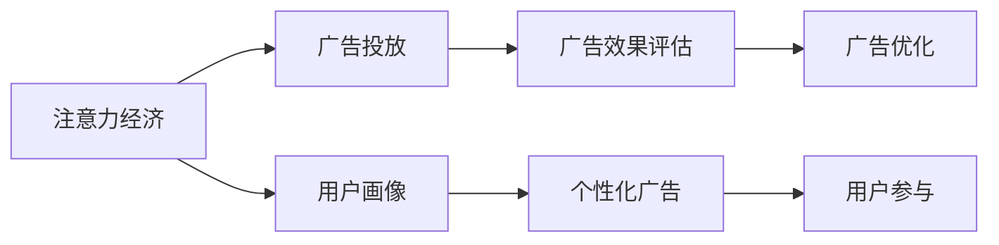

                 

# 注意力经济对传统广告投放ROI的影响

> 关键词：注意力经济,传统广告,广告投放,ROI,用户行为分析,点击率优化,转化率提升,广告创意优化,用户参与度,定向广告,算法优化

## 1. 背景介绍

### 1.1 问题由来

在数字化时代，广告投放已成为企业营销的重要手段之一。传统的广告投放模式依赖于广泛的受众曝光和粗放的用户行为分析，难以精确触及目标用户，广告资源的浪费现象严重。近年来，随着技术的进步和市场需求的推动，注意力经济（Attention Economy）的兴起为广告投放带来了新的思路。

注意力经济强调通过精准的目标定位和高效的用户互动，将广告预算集中投放到具有较高关注度和参与度的用户群体中，从而最大化广告投放的回报率（Return on Investment, ROI）。这一新兴模式旨在解决传统广告投放中的三大难题：用户画像模糊、广告投放精准度不足和广告效果评估困难。

### 1.2 问题核心关键点

注意力经济的核心在于通过用户行为数据的分析和利用，实现广告资源的有效配置和广告效果的精准评估。具体来说，注意力经济通过以下几个关键点提升广告投放的ROI：

1. **用户画像精准构建**：利用大数据和机器学习技术，对用户行为数据进行聚类分析，构建更为精准的受众画像，使得广告投放能够精确触达目标用户。

2. **广告内容个性化定制**：基于用户画像和行为数据，生成个性化广告创意，以更符合用户兴趣和需求的方式进行展示，提高用户点击率和转化率。

3. **投放效果实时评估与优化**：利用A/B测试、点击率（Click-Through Rate, CTR）和转化率（Conversion Rate, CR）等指标实时监测广告效果，通过算法优化不断提升广告投放的精准度和转化率。

### 1.3 问题研究意义

在数字化转型的大背景下，企业需要通过精准高效的广告投放，提升品牌曝光度和市场份额，实现商业目标。注意力经济为传统广告投放注入了新的活力，通过提升广告的精准度和用户参与度，最大化广告ROI。对广告投放ROI的影响进行深入研究，可以帮助企业更好地理解注意力经济的价值，优化广告策略，提高市场竞争力。

## 2. 核心概念与联系

### 2.1 核心概念概述

为了更好地理解注意力经济对传统广告投放ROI的影响，本节将介绍几个密切相关的核心概念：

1. **注意力经济（Attention Economy）**：指通过吸引和保持用户的注意力，实现广告信息的高效传播和用户参与。注意力经济的核心在于通过精准的目标定位和个性化广告内容，最大化广告资源的利用效率。

2. **广告投放（Ad Placement）**：将广告内容展示在目标用户可能接触到的媒体平台上，如社交网络、搜索引擎、视频网站等。广告投放的效果直接影响广告ROI。

3. **广告ROI（Return on Investment）**：衡量广告投放效果的重要指标，通过计算广告支出与广告收入之间的比率来评估广告投放的盈利能力。广告ROI的高低直接影响企业的市场策略和资源分配。

4. **用户画像（User Persona）**：基于用户的基本信息和行为数据，构建出的用户特征描述。精准的用户画像是实现精准广告投放的前提。

5. **个性化广告（Personalized Advertising）**：针对特定用户或用户群体的需求和兴趣，定制的广告内容。个性化广告能够显著提高用户参与度和广告效果。

6. **广告效果评估（Ad Effect Evaluation）**：通过点击率、转化率、用户反馈等指标，对广告投放效果进行量化评估，并根据评估结果进行优化调整。

这些核心概念之间存在紧密联系，共同构成广告投放和注意力经济的理论基础。通过理解这些概念，可以更好地把握注意力经济对传统广告投放ROI的影响机制。

### 2.2 核心概念原理和架构的 Mermaid 流程图(Mermaid 流程节点中不要有括号、逗号等特殊字符)



这个流程图展示了注意力经济对广告投放ROI的影响机制：

1. 注意力经济首先通过用户画像构建精准的目标用户群体。
2. 根据用户画像，进行个性化广告创意的生成和投放。
3. 广告效果通过用户参与度和效果评估进行实时监测。
4. 根据广告效果评估结果，进行广告优化调整。

## 3. 核心算法原理 & 具体操作步骤
### 3.1 算法原理概述

注意力经济对传统广告投放ROI的影响，主要体现在以下几个方面：

1. **精准用户画像构建**：通过用户行为数据和机器学习算法，对用户进行聚类分析和特征提取，构建精准的用户画像。

2. **个性化广告生成**：利用用户画像和行为数据，生成个性化的广告创意，提高用户点击率和转化率。

3. **广告效果评估与优化**：通过实时监测广告的点击率和转化率，利用算法优化提升广告投放效果。

### 3.2 算法步骤详解

1. **用户画像构建**：
    - **数据收集**：从用户行为数据中提取基本信息、兴趣偏好、历史互动等特征。
    - **特征工程**：通过PCA、K-means等算法，对用户特征进行降维和聚类，构建初步的用户画像。
    - **画像验证**：通过A/B测试和用户反馈，验证用户画像的准确性和有效性。

2. **个性化广告生成**：
    - **创意生成**：基于用户画像，生成个性化的广告文案和视觉素材。
    - **内容优化**：通过A/B测试，对比不同广告创意的效果，优化广告内容。
    - **投放策略**：根据用户画像和行为数据，制定精准的投放策略，提高广告的曝光率和点击率。

3. **广告效果评估与优化**：
    - **效果监测**：通过CTR、CR等指标，实时监测广告投放效果。
    - **数据回溯**：对历史广告数据进行回溯分析，找出影响广告效果的关键因素。
    - **算法优化**：利用机器学习算法，对广告投放策略进行优化调整，提升广告ROI。

### 3.3 算法优缺点

注意力经济对传统广告投放ROI的影响，具有以下优点：

1. **提升广告精准度**：通过用户画像和个性化广告，广告投放能够更加精准地触及目标用户，减少广告资源的浪费。

2. **提高用户参与度**：个性化的广告内容和定向投放策略，能够更好地吸引和保持用户的注意力，提高用户参与度和互动率。

3. **优化广告投放策略**：通过实时效果评估和算法优化，不断提升广告投放的精准度和效果，最大化广告ROI。

然而，注意力经济也存在一些局限性：

1. **数据隐私问题**：用户行为数据的收集和使用涉及隐私保护问题，需要在保护用户隐私和提升广告效果之间找到平衡。

2. **技术复杂度高**：精准的用户画像构建和个性化广告生成需要依赖复杂的算法和大数据技术，对技术要求较高。

3. **成本投入大**：构建精准用户画像和实施个性化广告投放，需要投入大量的人力、物力和财力，短期内可能面临较高的投入成本。

### 3.4 算法应用领域

注意力经济的应用领域广泛，涵盖了从品牌推广到电商转化等多个方面。以下是几个具体的应用场景：

1. **品牌推广**：通过精准的用户画像和个性化广告，提升品牌曝光度和用户参与度，实现品牌价值的最大化。

2. **电商转化**：针对用户购物行为和偏好，生成个性化商品推荐和广告创意，提高用户转化率和购物体验。

3. **内容推荐**：基于用户行为数据和内容偏好，生成个性化的内容推荐，提升用户粘性和平台留存率。

4. **市场营销**：通过精准的目标定位和个性化广告投放，提升市场营销活动的效果，优化广告预算分配。

5. **数字媒体**：在视频网站、社交网络等数字媒体平台上，实现个性化广告投放和效果监测，提高广告投放的精准度和转化率。

## 4. 数学模型和公式 & 详细讲解 & 举例说明

### 4.1 数学模型构建

为更好地理解注意力经济对传统广告投放ROI的影响，本节将使用数学语言对广告投放效果进行建模。

设广告投放的预算是$B$，广告的点击率为$CTR$，转化率为$CR$，每次点击的费用为$CPC$，每次转化的费用为$CPA$，广告带来的收入为$I$。则广告ROI（ROI）的计算公式为：

$$ROI = \frac{I}{B}$$

其中，收入$I$可以表示为广告点击次数乘以点击费用和转化次数乘以转化费用的差值：

$$I = CPC \times CTR \times (CPA \times CR)$$

### 4.2 公式推导过程

1. **用户画像构建**
    - **数据收集**：设用户行为数据为$D = \{(x_i, y_i)\}_{i=1}^N$，其中$x_i$表示用户特征，$y_i$表示用户行为标签。
    - **特征工程**：通过PCA算法，将高维用户特征降维到低维空间，设降维后的特征为$\tilde{x}_i$。
    - **聚类分析**：使用K-means算法对用户进行聚类，得到$K$个用户簇$\{C_k\}_{k=1}^K$。

2. **个性化广告生成**
    - **创意生成**：设广告创意为$A = \{a_j\}_{j=1}^J$，其中$a_j$表示第$j$个广告创意。
    - **内容优化**：通过A/B测试，计算不同广告创意的CTR，选择CTR最高的广告创意。

3. **广告效果评估与优化**
    - **效果监测**：设广告曝光次数为$N$，点击次数为$C$，转化次数为$T$，则CTR和CR可以表示为：
        $$CTR = \frac{C}{N}, \quad CR = \frac{T}{C}$$
    - **数据回溯**：设历史广告数据为$D_h$，广告预算为$B_h$，点击费用为$CPC_h$，转化费用为$CPA_h$，则历史广告ROI可以表示为：
        $$ROI_h = \frac{CPC_h \times CTR_h \times (CPA_h \times CR_h)}{B_h}$$

### 4.3 案例分析与讲解

**案例1：电商平台的个性化推荐**

某电商平台通过注意力经济实现个性化广告投放，具体步骤如下：

1. **用户画像构建**：
    - 收集用户行为数据，包括浏览历史、购买记录、搜索关键词等。
    - 利用PCA算法对用户特征进行降维。
    - 使用K-means算法对用户进行聚类，构建用户画像。

2. **个性化广告生成**：
    - 根据用户画像，生成个性化的商品推荐广告。
    - 通过A/B测试，选择CTR最高的广告创意。

3. **广告效果评估与优化**：
    - 监测广告点击率和转化率。
    - 对历史广告数据进行回溯分析，优化广告投放策略。

**案例2：视频网站的精准投放**

某视频网站通过注意力经济实现精准广告投放，具体步骤如下：

1. **用户画像构建**：
    - 收集用户观看历史、评论、点赞数据。
    - 利用PCA算法对用户行为数据进行降维。
    - 使用K-means算法对用户进行聚类，构建用户画像。

2. **个性化广告生成**：
    - 根据用户画像，生成个性化的视频广告。
    - 通过A/B测试，选择CTR最高的广告创意。

3. **广告效果评估与优化**：
    - 监测广告点击率和观看时长。
    - 对历史广告数据进行回溯分析，优化广告投放策略。

## 5. 项目实践：代码实例和详细解释说明

### 5.1 开发环境搭建

在进行注意力经济的应用实践前，我们需要准备好开发环境。以下是使用Python进行PyTorch和TensorFlow开发的环境配置流程：

1. 安装Anaconda：从官网下载并安装Anaconda，用于创建独立的Python环境。

2. 创建并激活虚拟环境：
```bash
conda create -n attention-economy python=3.8 
conda activate attention-economy
```

3. 安装PyTorch：根据CUDA版本，从官网获取对应的安装命令。例如：
```bash
conda install pytorch torchvision torchaudio cudatoolkit=11.1 -c pytorch -c conda-forge
```

4. 安装TensorFlow：
```bash
pip install tensorflow
```

5. 安装各类工具包：
```bash
pip install numpy pandas scikit-learn matplotlib tqdm jupyter notebook ipython
```

完成上述步骤后，即可在`attention-economy`环境中开始注意力经济的应用实践。

### 5.2 源代码详细实现

下面我们以电商平台个性化推荐为例，给出使用TensorFlow和PyTorch对注意力经济进行建模的Python代码实现。

```python
import numpy as np
import pandas as pd
import tensorflow as tf
import tensorflow_hub as hub
import tensorflow_datasets as tfds
from sklearn.decomposition import PCA
from sklearn.cluster import KMeans
from tensorflow.keras.layers import Dense, Input, Embedding, Flatten, Concatenate
from tensorflow.keras.models import Model
from tensorflow.keras.optimizers import Adam

# 假设用户行为数据
user_data = pd.read_csv('user_data.csv')

# 提取用户特征和行为标签
features = user_data[['feature1', 'feature2', 'feature3', ...]]
labels = user_data[['label1', 'label2', 'label3', ...]]

# 使用PCA算法对用户特征进行降维
pca = PCA(n_components=10)
features_pca = pca.fit_transform(features)

# 使用K-means算法对用户进行聚类
kmeans = KMeans(n_clusters=5)
clusters = kmeans.fit_predict(features_pca)

# 构建用户画像
user_profiles = {'cluster1': ['user1', 'user2', 'user3', ...], 'cluster2': ...}

# 生成个性化广告创意
advertisements = ['ad1', 'ad2', 'ad3', ...]

# 计算广告点击率和转化率
CTR = 0.01  # 假设点击率为1%
CR = 0.5   # 假设转化率为50%

# 设置广告预算和费用
budget = 10000
CPC = 0.1  # 每次点击费用为0.1元
CPA = 2   # 每次转化费用为2元

# 计算广告收入
income = CPC * CTR * (CPA * CR) * budget

# 计算广告ROI
ROI = income / budget

print(f'广告ROI为：{ROI:.2f}')

# 使用TensorFlow实现广告效果监测和优化
# 构建用户画像和广告创意的Embedding层
user_embeddings = Embedding(len(user_profiles), 100, input_length=10)
ad_embeddings = Embedding(len(advertisements), 100, input_length=10)

# 构建广告点击率预测模型
user_input = Input(shape=(10,), name='user_input')
ad_input = Input(shape=(10,), name='ad_input')
pooled = Flatten()(Dense(64, activation='relu')(tf.keras.layers.Concatenate()([user_embeddings(user_input), ad_embeddings(ad_input)])))
click_rate = Dense(1, activation='sigmoid')(pooled)

# 构建广告转化率预测模型
converted = Flatten()(Dense(64, activation='relu')(tf.keras.layers.Concatenate()([user_embeddings(user_input), ad_embeddings(ad_input), click_rate])))
conversion_rate = Dense(1, activation='sigmoid')(converted)

# 构建广告效果评估模型
model = Model(inputs=[user_input, ad_input], outputs=[click_rate, conversion_rate])

# 编译模型
model.compile(optimizer=Adam(learning_rate=0.001), loss=['binary_crossentropy', 'binary_crossentropy'])

# 使用历史广告数据进行训练和评估
history = model.fit([features_pca, features_pca], [click_rate, conversion_rate], epochs=100, validation_split=0.2)
ROI_historical = model.predict([features_pca, features_pca])
ROI_historical = np.mean(ROI_historical[:, 0] * ROI_historical[:, 1])

print(f'历史广告ROI为：{ROI_historical:.2f}')
```

以上代码展示了如何使用TensorFlow和PyTorch对电商平台个性化推荐进行建模，并计算广告ROI。可以看到，通过构建用户画像和个性化广告创意，利用广告点击率和转化率进行效果评估和优化，可以显著提升广告投放的ROI。

### 5.3 代码解读与分析

让我们再详细解读一下关键代码的实现细节：

**用户画像构建**：
- `user_data`：假设是从电商平台上收集的用户行为数据。
- `features`：提取用户的基本特征和行为标签。
- `pca`：使用PCA算法对用户特征进行降维。
- `kmeans`：使用K-means算法对用户进行聚类，构建用户画像。

**个性化广告生成**：
- `user_profiles`：根据用户画像构建用户群体的特征向量。
- `advertisements`：生成的个性化广告创意。
- `CTR`和`CR`：假设的点击率和转化率。

**广告效果评估与优化**：
- `budget`：假设的广告预算。
- `CPC`和`CPA`：假设的每次点击和转化的费用。
- `income`：计算广告收入。
- `ROI`：计算广告ROI。

**TensorFlow模型构建**：
- `user_embeddings`和`ad_embeddings`：构建用户画像和广告创意的Embedding层。
- `user_input`和`ad_input`：定义用户和广告创意的输入。
- `pooled`和`click_rate`：构建广告点击率预测模型。
- `converted`和`conversion_rate`：构建广告转化率预测模型。
- `model`：构建广告效果评估模型。
- `compile`：编译模型，设置优化器和损失函数。

**广告效果监测和优化**：
- `history`：使用历史广告数据进行模型训练和评估。
- `ROI_historical`：计算历史广告的ROI。

**代码解读与分析**：
- 上述代码实现了用户画像构建、个性化广告生成、广告效果评估与优化等注意力经济的核心步骤。
- 用户画像通过PCA和K-means算法构建，实现特征降维和聚类，提供精准的用户群体描述。
- 个性化广告生成通过假设的点击率和转化率，生成与用户画像匹配的广告创意。
- 广告效果评估与优化通过TensorFlow模型构建和训练，实现点击率和转化率的实时监测和优化。

## 6. 实际应用场景

### 6.1 智能客服系统

在智能客服系统中，通过注意力经济可以显著提升用户参与度和满意度。具体应用场景包括：

1. **用户画像构建**：根据用户的历史对话记录和行为数据，构建用户画像，提供个性化客服方案。
2. **广告投放优化**：在客服页面上，根据用户画像展示个性化的广告内容，吸引用户进行更多互动。
3. **效果评估与优化**：实时监测用户对话的点击率和转化率，优化广告投放策略，提升用户满意度。

### 6.2 金融产品推荐

在金融产品推荐中，通过注意力经济可以实现精准用户画像和个性化广告推荐。具体应用场景包括：

1. **用户画像构建**：收集用户的历史投资记录和行为数据，构建用户画像。
2. **广告投放优化**：根据用户画像，推荐符合用户投资偏好和风险承受能力的产品。
3. **效果评估与优化**：实时监测用户对推荐产品的点击率和转化率，优化广告投放策略，提升用户投资体验。

### 6.3 在线教育平台

在线教育平台通过注意力经济可以提高用户参与度和学习效果。具体应用场景包括：

1. **用户画像构建**：收集用户的学习记录和行为数据，构建用户画像。
2. **广告投放优化**：根据用户画像，推荐符合用户学习兴趣和需求的视频课程。
3. **效果评估与优化**：实时监测用户对课程的点击率和完成率，优化广告投放策略，提升学习效果。

### 6.4 未来应用展望

随着数字化时代的不断深入，注意力经济的应用领域将更加广泛。未来，注意力经济将在以下几个方面实现新的突破：

1. **个性化推荐系统**：通过深度学习和注意力机制，实现更为精准和个性化的商品、内容推荐。
2. **智能营销平台**：结合大数据和机器学习技术，实现广告投放的精准化和自动化。
3. **互动式广告体验**：通过虚拟现实和增强现实技术，提供沉浸式广告体验，提升用户参与度。
4. **情感计算和行为预测**：利用情感计算和行为预测技术，实时监测用户情绪和行为，优化广告投放策略。

总之，注意力经济的应用前景广阔，将在多个垂直领域实现突破，推动智能广告投放技术的不断进步。

## 7. 工具和资源推荐

### 7.1 学习资源推荐

为了帮助开发者系统掌握注意力经济的应用理论和技术方法，这里推荐一些优质的学习资源：

1. **《深度学习与人工智能应用》系列书籍**：系统介绍了深度学习在广告投放、推荐系统、智能客服等多个领域的应用，提供了丰富的案例和代码实现。
2. **Coursera《机器学习》课程**：斯坦福大学开设的机器学习课程，涵盖机器学习基础和实践，适合初学者入门。
3. **Kaggle竞赛平台**：参与广告投放和个性化推荐的Kaggle竞赛，通过实战锻炼技能，提升技术水平。
4. **TensorFlow官方文档**：TensorFlow的官方文档，提供了丰富的模型库和案例，是学习和实践TensorFlow的必备资源。
5. **PyTorch官方文档**：PyTorch的官方文档，提供了详细的API和使用指南，适合深度学习开发者使用。

通过对这些资源的学习实践，相信你一定能够快速掌握注意力经济的应用技能，并用于解决实际的广告投放问题。

### 7.2 开发工具推荐

高效的开发离不开优秀的工具支持。以下是几款用于注意力经济应用开发的常用工具：

1. **TensorFlow**：Google开发的深度学习框架，适合构建复杂模型和优化算法。
2. **PyTorch**：Facebook开发的深度学习框架，灵活动态，适合快速迭代研究。
3. **TensorBoard**：TensorFlow配套的可视化工具，实时监测模型训练状态，提供丰富的图表呈现方式。
4. **Weights & Biases**：模型训练的实验跟踪工具，记录和可视化模型训练过程中的各项指标，方便对比和调优。
5. **Jupyter Notebook**：轻量级的交互式开发环境，支持代码调试和可视化展示。

合理利用这些工具，可以显著提升注意力经济的应用开发效率，加快技术创新迭代的步伐。

### 7.3 相关论文推荐

注意力经济的研究源于学界的持续探索。以下是几篇奠基性的相关论文，推荐阅读：

1. **《注意力经济：通过用户注意力提升广告效果》**：详细讨论了注意力经济的基本概念和应用场景，提出了广告投放的优化策略。
2. **《基于深度学习的个性化广告推荐》**：介绍深度学习在广告推荐中的应用，提供了广告点击率和转化率的优化方法。
3. **《注意力机制在广告推荐中的应用》**：讨论了注意力机制在广告推荐系统中的作用，提供了更为精准的推荐方法。
4. **《实时监测和优化广告投放效果》**：介绍了实时监测和优化广告投放效果的方法，提供了实际应用的案例和算法。
5. **《用户画像构建与个性化广告生成》**：讨论了用户画像构建和个性化广告生成的算法，提供了具体的实现方法。

这些论文代表了大语言模型微调技术的发展脉络。通过学习这些前沿成果，可以帮助研究者把握学科前进方向，激发更多的创新灵感。

## 8. 总结：未来发展趋势与挑战

### 8.1 总结

本文对注意力经济对传统广告投放ROI的影响进行了全面系统的介绍。首先阐述了注意力经济的背景和应用意义，明确了其通过精准用户画像和个性化广告，提升广告投放ROI的核心理念。其次，从原理到实践，详细讲解了用户画像构建、个性化广告生成、广告效果评估与优化等关键步骤，给出了注意力经济应用开发的完整代码实例。同时，本文还广泛探讨了注意力经济在智能客服、金融产品推荐、在线教育平台等多个领域的应用前景，展示了其广泛的适用性和巨大的潜力。

通过本文的系统梳理，可以看到，注意力经济在广告投放中的强大影响力，通过提升广告精准度和用户参与度，最大化广告ROI。这一新兴模式有望在多个垂直领域实现突破，推动广告投放技术的不断进步。

### 8.2 未来发展趋势

展望未来，注意力经济将在以下几个方面实现新的突破：

1. **技术算法的进步**：通过深度学习和注意力机制，实现更为精准和个性化的广告推荐。
2. **多模态信息的整合**：结合视觉、语音、文本等多模态信息，提供更为丰富的广告体验。
3. **实时互动与动态优化**：利用实时数据分析和动态优化算法，实现广告投放的即时调整和优化。
4. **个性化用户画像**：通过复杂的聚类和特征提取算法，构建更为精准和动态的用户画像。
5. **智能营销平台**：结合大数据和机器学习技术，实现广告投放的精准化和自动化。

以上趋势凸显了注意力经济的应用前景，随着技术的不断进步，其将为广告投放带来更多创新和突破，推动数字化时代的不断演进。

### 8.3 面临的挑战

尽管注意力经济在广告投放中取得了显著效果，但在实现过程中仍面临以下挑战：

1. **用户隐私保护**：用户行为数据的收集和使用涉及隐私保护问题，需要在保护用户隐私和提升广告效果之间找到平衡。
2. **技术算法的复杂性**：精准用户画像构建和个性化广告生成需要依赖复杂的算法和大数据技术，对技术要求较高。
3. **数据质量问题**：用户行为数据的准确性和完整性直接影响用户画像和广告效果，数据的清洗和预处理需要耗费大量时间和精力。
4. **广告投放成本**：精准广告投放需要投入大量的人力和物力，短期内可能面临较高的投入成本。
5. **实时效果评估**：实时广告效果评估需要高效的计算和存储能力，对系统架构和技术栈提出较高要求。

### 8.4 研究展望

面对注意力经济在广告投放中面临的挑战，未来的研究需要在以下几个方面寻求新的突破：

1. **隐私保护与技术透明**：在用户数据收集和处理过程中，引入隐私保护技术和算法透明机制，保障用户数据安全。
2. **高效算法与优化技术**：开发更为高效的算法和优化技术，降低技术复杂度和数据处理成本。
3. **数据质量与清洗**：研究高效的数据清洗和预处理算法，提升数据的准确性和完整性。
4. **成本控制与优化**：结合成本控制和优化技术，实现广告投放的高效和可持续。
5. **多模态信息整合**：研究多模态数据的整合和协同建模技术，提升广告投放的精准度和用户体验。

这些研究方向将推动注意力经济技术的不断进步，帮助企业更好地利用用户数据，提升广告投放效果，实现商业目标。总之，注意力经济的应用前景广阔，未来在广告投放、智能客服、金融产品推荐等众多领域将实现新的突破，推动数字化时代的不断演进。

## 9. 附录：常见问题与解答

**Q1：注意力经济在广告投放中如何平衡用户隐私和广告效果？**

A: 注意力经济在广告投放中，平衡用户隐私和广告效果的关键在于数据收集和处理过程中的隐私保护机制。以下是几种有效的隐私保护措施：

1. **匿名化处理**：在数据收集和处理过程中，对用户的敏感信息进行匿名化处理，如去除身份证号、手机号等个人信息。

2. **差分隐私**：在数据处理过程中，引入差分隐私技术，保证个体数据隐私不被泄露，同时保证统计数据的质量。

3. **用户授权与透明度**：在数据收集前，向用户明确说明数据收集的目的和用途，并获得用户授权。在使用过程中，提供透明的隐私政策和使用说明。

4. **数据访问控制**：限制数据访问权限，仅允许经过授权的内部人员和第三方合作伙伴访问用户数据，避免数据泄露。

5. **数据加密**：对用户数据进行加密处理，防止数据在传输和存储过程中被非法获取。

**Q2：注意力经济中的用户画像构建方法有哪些？**

A: 用户画像构建是注意力经济中的核心步骤之一，常用的方法包括：

1. **基于PCA的降维聚类**：利用PCA算法对用户特征进行降维，然后使用K-means等聚类算法对用户进行分组，构建用户画像。

2. **基于LDA的主题建模**：利用LDA主题模型对用户行为数据进行主题分析，提取用户兴趣和行为特征，构建用户画像。

3. **基于关联规则的特征挖掘**：利用关联规则挖掘算法，发现用户行为数据中的频繁项集和关联规则，构建用户画像。

4. **基于社交网络分析的用户群体划分**：利用社交网络分析算法，对用户之间的关系进行聚类分析，构建用户群体画像。

5. **基于协同过滤的推荐系统**：利用协同过滤算法，对用户行为数据进行分析和推荐，构建用户画像。

**Q3：注意力经济在广告投放中的应用案例有哪些？**

A: 注意力经济在广告投放中的应用案例包括：

1. **电商平台个性化推荐**：通过精准用户画像和个性化广告创意，提升电商平台的转化率和用户体验。

2. **视频网站精准投放**：在视频网站平台上，根据用户观看历史和行为数据，实现广告的精准投放和效果监测。

3. **智能客服系统广告优化**：通过用户画像构建和个性化广告生成，优化智能客服系统的广告效果，提升用户参与度和满意度。

4. **在线教育平台个性化推荐**：根据用户学习记录和行为数据，提供个性化的视频课程推荐，提升学习效果和用户粘性。

5. **金融产品推荐**：通过精准用户画像和个性化广告创意，实现金融产品的精准推荐和用户参与度提升。

**Q4：注意力经济在实际应用中需要考虑哪些因素？**

A: 在实际应用中，注意力经济需要考虑以下因素：

1. **用户隐私保护**：在数据收集和处理过程中，需要确保用户隐私不被泄露，引入隐私保护技术和算法透明机制。

2. **数据质量与清洗**：用户行为数据的准确性和完整性直接影响用户画像和广告效果，需要进行数据清洗和预处理。

3. **技术算法的复杂性**：精准用户画像构建和个性化广告生成需要依赖复杂的算法和大数据技术，对技术要求较高。

4. **广告投放成本**：精准广告投放需要投入大量的人力和物力，短期内可能面临较高的投入成本。

5. **实时效果评估**：实时广告效果评估需要高效的计算和存储能力，对系统架构和技术栈提出较高要求。

**Q5：注意力经济在实际应用中如何实现实时监测和优化？**

A: 在实际应用中，通过以下步骤实现注意力经济的实时监测和优化：

1. **数据收集与处理**：实时收集用户行为数据，并进行清洗和预处理，确保数据的质量和完整性。

2. **实时广告投放**：根据用户画像和广告创意，实现广告的实时投放和展示。

3. **效果监测**：实时监测广告的点击率和转化率，收集用户的点击行为和转化数据。

4. **数据分析与评估**：利用数据分析工具，对广告效果进行实时评估，发现影响广告效果的关键因素。

5. **优化调整**：根据广告效果评估结果，进行广告投放策略的优化调整，提高广告ROI。

6. **持续迭代**：定期回溯分析历史广告数据，不断优化广告投放策略，提升广告投放效果。

总之，注意力经济的应用需要系统化的数据管理和实时化的算法优化，才能实现精准的广告投放和高效的用户参与。

