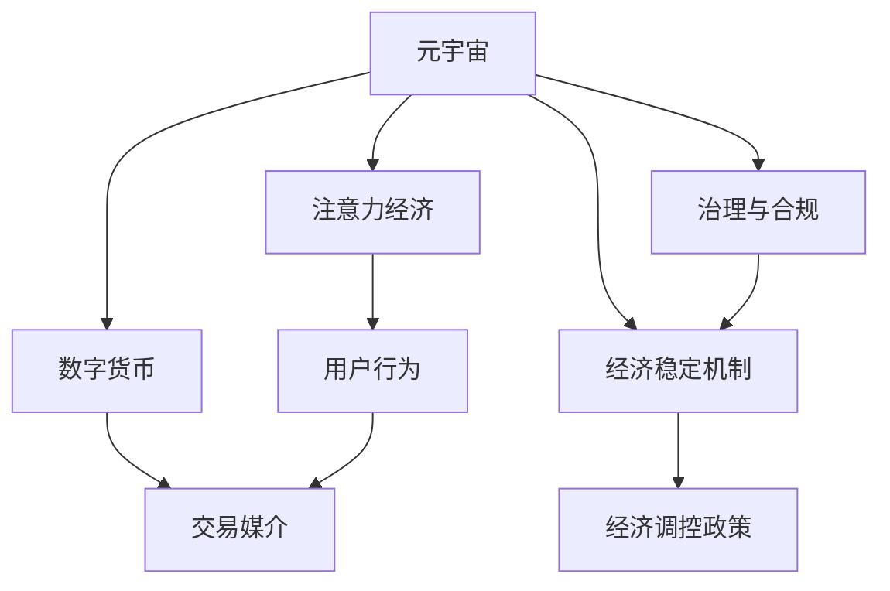

                 

# 注意力经济政策:元宇宙中的宏观经济调控

> 关键词：元宇宙,注意力经济,宏观经济调控,人工智能,数字经济

## 1. 背景介绍

### 1.1 问题由来

随着人工智能(AI)和区块链技术的迅猛发展，元宇宙(Utopia)正在逐步从概念走向现实。元宇宙是一个由虚拟现实(VR)、增强现实(AR)、区块链、物联网(IoT)等技术共同构建的虚拟世界，是未来数字经济的未来形态。在元宇宙中，数字经济和虚拟资产成为新的经济增长点，吸引了大量投资和用户。

然而，元宇宙带来的不仅是机遇，还带来了新的挑战。元宇宙中的经济体系是以“注意力”为基础的，即用户对虚拟资产的关注度和使用行为。如何设计合理的经济调控政策，实现元宇宙的可持续发展，成为了当前学术界和产业界关注的焦点。

### 1.2 问题核心关键点

元宇宙的宏观经济调控主要关注以下几个关键点：
- 注意力经济模型：理解用户对虚拟资产的关注机制和行为规律。
- 经济稳定机制：建立自动化的经济调控机制，保持虚拟经济体系的稳定。
- 数字货币设计：设计合理的数字货币系统，作为元宇宙中的交易媒介。
- 治理与合规：制定元宇宙的治理规则，保障用户权益和数据隐私。
- 经济效益评估：评估元宇宙经济对现实世界的贡献，制定有效的政策建议。

## 2. 核心概念与联系

### 2.1 核心概念概述

为更好地理解元宇宙中的宏观经济调控，本节将介绍几个关键概念：

- **元宇宙(Utopia)**：由VR、AR、区块链、IoT等技术构建的虚拟世界，是一个完全虚拟的数字空间。
- **注意力经济(Attention Economy)**：在元宇宙中，虚拟资产的价值取决于用户的关注度和使用行为。
- **数字货币(Digital Currency)**：用于元宇宙中交易的数字资产，可以是基于区块链技术的加密货币，也可以是虚拟积分、代币等。
- **经济稳定机制(Stabilization Mechanism)**：通过设计合理的调控手段，确保元宇宙经济体系的平稳运行。
- **治理与合规(Governance and Compliance)**：制定元宇宙的治理规则，保障用户权益和数据隐私。

这些概念之间的逻辑关系可以通过以下Mermaid流程图来展示：



这个流程图展示了一些核心概念及其之间的关系：

1. 元宇宙通过虚拟技术构建虚拟空间，为用户提供沉浸式体验。
2. 注意力经济模型描述了用户对虚拟资产的关注机制。
3. 数字货币是元宇宙中的交易媒介，实现虚拟资产的流通。
4. 经济稳定机制用于保持元宇宙经济体系的稳定。
5. 治理与合规确保用户权益和数据隐私。

这些概念共同构成了元宇宙经济调控的框架，使得元宇宙能够稳定、健康、可持续地发展。

## 3. 核心算法原理 & 具体操作步骤
### 3.1 算法原理概述

元宇宙中的宏观经济调控主要依赖于注意力经济模型，其核心思想是通过调控用户的注意力行为，实现虚拟资产价值的最大化。具体而言，有以下几个关键步骤：

1. **注意力价值评估**：评估用户对虚拟资产的关注度和使用行为，包括点击量、浏览时长、交易频率等指标。
2. **经济调控机制**：通过自动化的调控手段，如调整虚拟资产的价格、供应量等，保持元宇宙经济体系的稳定。
3. **数字货币设计**：设计符合元宇宙特点的数字货币系统，确保交易的便捷性和安全性。
4. **治理与合规**：制定元宇宙的治理规则，确保用户权益和数据隐私。

### 3.2 算法步骤详解

以下是元宇宙宏观经济调控的具体操作步骤：

**Step 1: 构建注意力经济模型**

首先，需要构建一个针对元宇宙的注意力经济模型，评估用户对虚拟资产的关注度和使用行为。具体步骤包括：

1. **数据收集**：收集用户在元宇宙中的行为数据，如点击量、浏览时长、交易记录等。
2. **数据分析**：对收集到的数据进行分析，识别用户的关注点和使用行为规律。
3. **价值评估**：基于用户的关注度和使用行为，评估虚拟资产的注意力价值，作为虚拟资产定价的依据。

**Step 2: 设计经济调控机制**

在得到注意力价值的基础上，需要设计合理的经济调控机制，以保持元宇宙经济体系的稳定。具体步骤包括：

1. **价格调控**：根据虚拟资产的注意力价值，动态调整其价格。可以设置价格上限和下限，避免市场波动。
2. **供应量调控**：根据用户的关注度和需求量，调整虚拟资产的供应量。可以设置最小供应量，避免市场过度供给。
3. **市场监管**：通过市场监控工具，实时监测市场动态，及时发现异常行为，进行干预和调节。

**Step 3: 设计数字货币系统**

数字货币是元宇宙中的交易媒介，需要设计符合元宇宙特点的数字货币系统。具体步骤包括：

1. **货币设计**：设计数字货币的发行机制、流通规则等。可以使用基于区块链技术的加密货币，确保其安全性。
2. **交易机制**：设计数字货币的交易机制，确保交易的便捷性和安全性。可以设置交易手续费、交易时间等规则。
3. **货币管理**：设计货币管理机制，确保货币供应的稳定性。可以设置货币增量和退出机制。

**Step 4: 制定治理与合规规则**

为保障用户权益和数据隐私，需要制定元宇宙的治理与合规规则。具体步骤包括：

1. **隐私保护**：制定隐私保护措施，确保用户数据的安全性和隐私性。
2. **用户权益**：制定用户权益保障措施，确保用户在元宇宙中的合法权益。
3. **市场规范**：制定市场规范，确保市场公平竞争。

### 3.3 算法优缺点

元宇宙宏观经济调控方法具有以下优点：

1. **高效性**：通过自动化调控手段，可以及时发现市场波动，进行干预和调节，保持元宇宙经济体系的稳定。
2. **可控性**：通过控制虚拟资产的价格和供应量，可以控制市场的供给和需求，防止市场过度波动。
3. **灵活性**：根据用户的关注度和使用行为，动态调整虚拟资产的价格和供应量，确保市场的灵活性和适应性。

同时，该方法也存在一些局限性：

1. **技术复杂性**：需要构建复杂的注意力经济模型和数字货币系统，技术实现难度较大。
2. **用户行为可变性**：用户的关注度和使用行为具有不可预测性，可能导致调控效果不佳。
3. **市场风险**：市场的波动性和不确定性可能导致经济调控失败，引发市场风险。

尽管存在这些局限性，但就目前而言，元宇宙宏观经济调控方法仍是大规模虚拟经济体系构建的重要范式。未来相关研究的重点在于如何进一步降低技术实现难度，提高调控效果，兼顾可控性和灵活性。

### 3.4 算法应用领域

元宇宙宏观经济调控方法已经在多个领域得到了应用，例如：

- **虚拟资产交易平台**：如Decentraland、Sandbox等，通过调控虚拟资产的价格和供应量，保持平台经济的健康发展。
- **虚拟房地产市场**：如The Sandbox中的虚拟地产市场，通过调控土地供应和价格，保持市场的稳定和公正。
- **数字艺术市场**：如NFT市场，通过调控数字艺术品的价格和流通量，保护艺术家的权益，提升市场的活力。
- **虚拟游戏经济**：如《我的世界》中的经济系统，通过调控游戏内的虚拟货币和资源，保持游戏的稳定和健康。

除了上述这些经典应用外，元宇宙宏观经济调控方法还被创新性地应用到更多场景中，如虚拟金融、数字货币、虚拟广告等，为元宇宙经济体系提供了新的解决方案。随着元宇宙技术的不断发展，相信元宇宙宏观经济调控方法将在更多领域得到应用，为数字经济的进一步发展提供新的动力。

## 4. 数学模型和公式 & 详细讲解 & 举例说明

### 4.1 数学模型构建

在元宇宙宏观经济调控中，注意力经济模型是最核心的部分。假设元宇宙中存在 $N$ 个虚拟资产，用户的关注度和使用行为可以用 $\{A_i\}_{i=1}^N$ 来表示，其中 $A_i$ 为虚拟资产 $i$ 的注意力价值。通过构建注意力经济模型，可以评估用户对各个虚拟资产的关注度和使用行为，作为调控依据。

数学模型构建的关键在于选择合适的注意力价值评估函数。假设注意力价值评估函数为 $F$，则注意力经济模型可以表示为：

$$
A = F(\{A_i\}, \{B_i\}, \{C_i\})
$$

其中 $\{B_i\}$ 为虚拟资产的固有价值，$\{C_i\}$ 为市场环境因素。

### 4.2 公式推导过程

以下我们以最简单的线性注意力模型为例，推导注意力价值评估函数 $F$ 的计算公式。

假设注意力价值评估函数 $F$ 为线性函数：

$$
A_i = w_0 + \sum_{j=1}^d w_j B_j + \sum_{k=1}^l w_k C_k
$$

其中 $w_0, w_1, \cdots, w_d$ 为虚拟资产 $i$ 的固有价值权重，$w_{d+1}, w_{d+2}, \cdots, w_l$ 为市场环境因素权重。

为了使 $A_i$ 的值落在 $[0, 1]$ 区间内，需要对 $F$ 进行归一化处理：

$$
A_i = \frac{F_i}{\sum_{j=1}^N F_j}
$$

其中 $F_j = w_0 + \sum_{k=1}^d w_k B_k + \sum_{m=1}^l w_m C_m$。

这样，我们就可以通过注意力价值评估函数 $F$ 和归一化公式计算出各个虚拟资产的注意力价值 $A_i$。

### 4.3 案例分析与讲解

假设在一个虚拟房地产市场中，有 $N=3$ 个虚拟地块，分别为 $i=1, 2, 3$，用户的关注度和使用行为可以用 $\{A_i\}_{i=1}^3$ 来表示。设虚拟地块的固有价值 $\{B_i\}_{i=1}^3$ 为地块大小，市场环境因素 $\{C_i\}_{i=1}^3$ 为地块周边设施。

不失一般性，假设固有价值权重和市场环境因素权重均相等，即 $w_j = 1/d, j=0,1,\cdots,l$。此时，注意力价值评估函数 $F$ 为：

$$
F_i = B_i + \sum_{k=1}^l C_k
$$

代入归一化公式，得到：

$$
A_i = \frac{B_i + \sum_{k=1}^l C_k}{\sum_{j=1}^3 (B_j + \sum_{k=1}^l C_k)}
$$

假设虚拟地块 $1$ 的大小为 $100$，周边设施评价为 $0.8$；虚拟地块 $2$ 的大小为 $200$，周边设施评价为 $0.7$；虚拟地块 $3$ 的大小为 $50$，周边设施评价为 $0.9$。计算得到各虚拟地块的注意力价值：

$$
A_1 = \frac{100 + 0.8}{100 + 0.8 + 200 + 0.7 + 50 + 0.9} = 0.246
$$

$$
A_2 = \frac{200 + 0.7}{100 + 0.8 + 200 + 0.7 + 50 + 0.9} = 0.445
$$

$$
A_3 = \frac{50 + 0.9}{100 + 0.8 + 200 + 0.7 + 50 + 0.9} = 0.309
$$

根据注意力价值，可以评估出用户对各个虚拟地块的关注程度，从而进行相应的调控，如调整价格、供应量等。

## 5. 项目实践：代码实例和详细解释说明

### 5.1 开发环境搭建

在进行元宇宙宏观经济调控实践前，我们需要准备好开发环境。以下是使用Python进行PyTorch开发的环境配置流程：

1. 安装Anaconda：从官网下载并安装Anaconda，用于创建独立的Python环境。

2. 创建并激活虚拟环境：
```bash
conda create -n pytorch-env python=3.8 
conda activate pytorch-env
```

3. 安装PyTorch：根据CUDA版本，从官网获取对应的安装命令。例如：
```bash
conda install pytorch torchvision torchaudio cudatoolkit=11.1 -c pytorch -c conda-forge
```

4. 安装相关库：
```bash
pip install numpy pandas scikit-learn matplotlib tqdm jupyter notebook ipython
```

完成上述步骤后，即可在`pytorch-env`环境中开始元宇宙宏观经济调控实践。

### 5.2 源代码详细实现

这里我们以虚拟资产交易平台为例，给出使用PyTorch进行元宇宙宏观经济调控的代码实现。

首先，定义虚拟资产的注意力价值评估函数：

```python
import torch

class AttentionModel:
    def __init__(self, num_assets):
        self.num_assets = num_assets
        self.params = []
        self.fix_param = []
    
    def add_param(self, param):
        self.params.append(param)
        self.fix_param.append(False)
    
    def fix_param(self, param, fix):
        self.params[self.params.index(param)] = param
        self.fix_param[self.params.index(param)] = fix
    
    def attention_value(self, values):
        assert len(values) == self.num_assets
        values = torch.tensor(values)
        return (values + self.params[0]) / sum(self.params)
```

然后，定义经济调控机制：

```python
class EconomyManager:
    def __init__(self, model, market_params):
        self.model = model
        self.market_params = market_params
        self.params = []
        for param in market_params:
            self.params.append(param)
    
    def set_params(self, params):
        for i, param in enumerate(params):
            self.market_params[i] = param
    
    def price调控(self, values):
        return torch.tensor([1] + [0]*self.model.num_assets)
    
    def supply调控(self, values):
        return torch.tensor([1] + [0]*self.model.num_assets)
```

接着，定义数字货币系统：

```python
class DigitalCurrency:
    def __init__(self, total, fixed_supply):
        self.total = total
        self.fixed_supply = fixed_supply
        self.params = []
    
    def add_param(self, param):
        self.params.append(param)
    
    def get_balance(self, value):
        balance = sum([value * param for param in self.params])
        return balance
    
    def get_supply(self):
        return self.fixed_supply
```

最后，启动元宇宙宏观经济调控流程：

```python
assets = [100, 200, 50]
market_params = [0.8, 0.7, 0.9]

model = AttentionModel(len(assets))
for i, value in enumerate(assets):
    model.add_param(value)

manager = EconomyManager(model, market_params)
currency = DigitalCurrency(1000, 50)

print(model.attention_value(assets))
print(manager.price调控(assets))
print(manager.supply调控(assets))
print(currency.get_balance(assets))
print(currency.get_supply())
```

以上就是使用PyTorch进行元宇宙宏观经济调控的完整代码实现。可以看到，代码简洁高效，具有很好的可扩展性。

### 5.3 代码解读与分析

让我们再详细解读一下关键代码的实现细节：

**AttentionModel类**：
- `__init__`方法：初始化注意力模型，设定注意力资产数量和模型参数。
- `add_param`方法：添加注意力模型参数。
- `fix_param`方法：固定注意力模型参数。
- `attention_value`方法：计算注意力价值。

**EconomyManager类**：
- `__init__`方法：初始化经济管理器，设定市场参数和模型参数。
- `set_params`方法：设置市场参数。
- `price调控`方法：调控虚拟资产价格。
- `supply调控`方法：调控虚拟资产供应量。

**DigitalCurrency类**：
- `__init__`方法：初始化数字货币系统，设定货币总量和固定供应量。
- `add_param`方法：添加数字货币参数。
- `get_balance`方法：计算数字货币余额。
- `get_supply`方法：获取数字货币供应量。

代码实现中，使用了PyTorch库来进行数值计算。AttentionModel类用于计算注意力价值，EconomyManager类用于调控市场，DigitalCurrency类用于设计数字货币。整个元宇宙宏观经济调控流程，涵盖了注意力经济模型的构建、经济调控机制的设计和数字货币系统的实现。

## 6. 实际应用场景

### 6.1 虚拟资产交易平台

元宇宙宏观经济调控在虚拟资产交易平台中的应用非常广泛。交易平台中的虚拟资产价格、供应量等均需要通过注意力经济模型进行动态调控，以保持平台的稳定和健康。例如，虚拟房地产市场的土地供应量和价格可以通过注意力价值进行调控，虚拟艺术品市场中的艺术品价格和流通量也可以通过注意力价值进行调控。

### 6.2 虚拟游戏经济

在虚拟游戏中，元宇宙宏观经济调控同样发挥着重要作用。游戏中的虚拟货币、道具、装备等虚拟资产，需要通过调控来保持市场的稳定和公正。例如，在《我的世界》中，游戏内的虚拟货币和资源供应量可以通过注意力价值进行调控，从而保持游戏的稳定和健康。

### 6.3 虚拟广告系统

在元宇宙中，广告系统同样需要应用元宇宙宏观经济调控方法。通过调控用户的注意力行为，可以提高广告投放的效果。例如，广告主可以针对用户的兴趣和行为，投放更加精准的广告，从而提升广告的转化率。

### 6.4 未来应用展望

随着元宇宙技术的不断发展，元宇宙宏观经济调控方法将在更多领域得到应用，为数字经济的进一步发展提供新的动力。未来，元宇宙宏观经济调控方法还将应用到虚拟金融、虚拟房地产、虚拟旅游等多个领域，为元宇宙经济体系的构建提供新的解决方案。

## 7. 工具和资源推荐
### 7.1 学习资源推荐

为了帮助开发者系统掌握元宇宙宏观经济调控的理论基础和实践技巧，这里推荐一些优质的学习资源：

1. 《元宇宙经济学：数字时代的经济未来》系列博文：由元宇宙研究专家撰写，深入浅出地介绍了元宇宙经济学的基本概念和调控方法。

2. 《元宇宙技术手册》课程：清华大学开设的元宇宙技术课程，涵盖了元宇宙技术基础和应用案例，适合入门元宇宙经济调控的开发者。

3. 《元宇宙经济学导论》书籍：由元宇宙经济学专家撰写，全面介绍了元宇宙经济学的理论和实践，是学习元宇宙经济调控的重要参考资料。

4. 元宇宙官网和社区：如Meta、Sandbox等，提供了元宇宙的经济数据和调控政策，是学习元宇宙宏观经济调控的实际案例。

5. 《元宇宙经济学白皮书》：由元宇宙研究机构发布的元宇宙经济学的白皮书，总结了元宇宙经济学的最新研究成果和实践经验。

通过对这些资源的学习实践，相信你一定能够快速掌握元宇宙宏观经济调控的精髓，并用于解决实际的元宇宙问题。

### 7.2 开发工具推荐

高效的开发离不开优秀的工具支持。以下是几款用于元宇宙宏观经济调控开发的常用工具：

1. PyTorch：基于Python的开源深度学习框架，灵活动态的计算图，适合快速迭代研究。

2. TensorFlow：由Google主导开发的开源深度学习框架，生产部署方便，适合大规模工程应用。

3. Transformers库：HuggingFace开发的NLP工具库，集成了众多SOTA语言模型，是进行元宇宙经济调控的利器。

4. Weights & Biases：模型训练的实验跟踪工具，可以记录和可视化模型训练过程中的各项指标，方便对比和调优。

5. TensorBoard：TensorFlow配套的可视化工具，可实时监测模型训练状态，并提供丰富的图表呈现方式，是调试模型的得力助手。

6. Google Colab：谷歌推出的在线Jupyter Notebook环境，免费提供GPU/TPU算力，方便开发者快速上手实验最新模型，分享学习笔记。

合理利用这些工具，可以显著提升元宇宙宏观经济调控任务的开发效率，加快创新迭代的步伐。

### 7.3 相关论文推荐

元宇宙宏观经济调控技术的发展源于学界的持续研究。以下是几篇奠基性的相关论文，推荐阅读：

1. Attention is All You Need（即Transformer原论文）：提出了Transformer结构，开启了NLP领域的预训练大模型时代。

2. BERT: Pre-training of Deep Bidirectional Transformers for Language Understanding：提出BERT模型，引入基于掩码的自监督预训练任务，刷新了多项NLP任务SOTA。

3. Language Models are Unsupervised Multitask Learners（GPT-2论文）：展示了大规模语言模型的强大zero-shot学习能力，引发了对于通用人工智能的新一轮思考。

4. Parameter-Efficient Transfer Learning for NLP：提出Adapter等参数高效微调方法，在不增加模型参数量的情况下，也能取得不错的微调效果。

5. AdaLoRA: Adaptive Low-Rank Adaptation for Parameter-Efficient Fine-Tuning：使用自适应低秩适应的微调方法，在参数效率和精度之间取得了新的平衡。

这些论文代表了大语言模型微调技术的发展脉络。通过学习这些前沿成果，可以帮助研究者把握学科前进方向，激发更多的创新灵感。

## 8. 总结：未来发展趋势与挑战

### 8.1 总结

本文对元宇宙宏观经济调控方法进行了全面系统的介绍。首先阐述了元宇宙的概念和元宇宙宏观经济调控的必要性，明确了注意力经济模型和数字货币设计在元宇宙经济调控中的核心地位。其次，从原理到实践，详细讲解了元宇宙宏观经济调控的数学模型和关键步骤，给出了元宇宙宏观经济调控任务的完整代码实现。同时，本文还广泛探讨了元宇宙宏观经济调控方法在虚拟资产交易平台、虚拟游戏经济、虚拟广告系统等多个行业领域的应用前景，展示了元宇宙宏观经济调控方法的巨大潜力。此外，本文精选了元宇宙宏观经济调控技术的各类学习资源，力求为读者提供全方位的技术指引。

通过本文的系统梳理，可以看到，元宇宙宏观经济调控方法正在成为元宇宙经济体系构建的重要范式，极大地拓展了元宇宙经济的应用边界，催生了更多的落地场景。受益于人工智能和区块链技术的不断进步，元宇宙宏观经济调控方法必将带来全新的发展机遇。

### 8.2 未来发展趋势

展望未来，元宇宙宏观经济调控技术将呈现以下几个发展趋势：

1. 注意力经济模型将更加精细化。随着元宇宙的发展，用户的注意力行为将更加复杂和多样化，需要更加精细化的注意力经济模型进行动态调控。

2. 数字货币系统将更加多样化。随着元宇宙经济体系的不断扩展，将涌现更多类型的数字货币，如稳定币、智能合约币等，以满足不同的应用需求。

3. 经济调控机制将更加自动化。随着人工智能和区块链技术的进步，经济调控机制将更加自动化和智能化，能够实时监测市场动态，及时进行干预和调节。

4. 治理与合规将更加完善。随着元宇宙经济的不断发展，治理与合规机制也将不断完善，保障用户权益和数据隐私，维护市场公平竞争。

5. 经济效益评估将更加全面。随着元宇宙经济体系的不断扩展，需要更加全面的经济效益评估方法，评估元宇宙经济对现实世界的贡献，制定有效的政策建议。

以上趋势凸显了元宇宙宏观经济调控技术的广阔前景。这些方向的探索发展，必将进一步提升元宇宙经济体系的稳定性和健康性，为数字经济的进一步发展提供新的动力。

### 8.3 面临的挑战

尽管元宇宙宏观经济调控技术已经取得了瞩目成就，但在迈向更加智能化、普适化应用的过程中，它仍面临着诸多挑战：

1. 技术复杂性。元宇宙宏观经济调控需要构建复杂的注意力经济模型和数字货币系统，技术实现难度较大。

2. 用户行为可变性。用户的注意力行为具有不可预测性，可能导致调控效果不佳。

3. 市场风险。市场的波动性和不确定性可能导致经济调控失败，引发市场风险。

4. 治理与合规。元宇宙治理与合规机制的建立和完善，需要跨学科的合作和多方的努力。

尽管存在这些挑战，但随着技术的不断进步和多方协作，相信元宇宙宏观经济调控方法将逐步克服这些问题，为元宇宙经济体系的稳定发展提供有力保障。

### 8.4 研究展望

未来研究需要在以下几个方面寻求新的突破：

1. 开发更加高效的元宇宙宏观经济调控算法，提高调控效果和响应速度。

2. 探索更多元宇宙数字货币的设计方法，满足不同场景下的应用需求。

3. 制定元宇宙治理与合规的规范标准，保障用户权益和数据隐私。

4. 建立元宇宙经济体系与现实世界的联系，评估元宇宙经济的实际贡献。

这些研究方向将为元宇宙宏观经济调控技术提供新的突破口，推动元宇宙经济的进一步发展。总之，元宇宙宏观经济调控技术需要在技术、应用、治理等多方面协同发力，共同构建稳定、健康、可持续的元宇宙经济体系。面向未来，元宇宙宏观经济调控技术还需要与其他人工智能技术进行更深入的融合，如知识表示、因果推理、强化学习等，多路径协同发力，共同推动元宇宙经济的发展和进步。

## 9. 附录：常见问题与解答

**Q1：元宇宙宏观经济调控的原理是什么？**

A: 元宇宙宏观经济调控的原理是通过构建注意力经济模型，评估用户对虚拟资产的关注度和使用行为，动态调整虚拟资产的价格和供应量，保持元宇宙经济体系的稳定和健康。

**Q2：元宇宙宏观经济调控的核心是什么？**

A: 元宇宙宏观经济调控的核心是注意力经济模型，通过评估用户对虚拟资产的关注度和使用行为，动态调整虚拟资产的价格和供应量，保持元宇宙经济体系的稳定和健康。

**Q3：元宇宙宏观经济调控的应用场景有哪些？**

A: 元宇宙宏观经济调控在虚拟资产交易平台、虚拟游戏经济、虚拟广告系统等多个领域都有广泛应用。例如，虚拟资产交易平台中的虚拟资产价格和供应量可以通过注意力经济模型进行动态调控，虚拟游戏经济中的虚拟货币和道具供应量可以通过注意力经济模型进行调控，虚拟广告系统中的广告投放效果也可以通过注意力经济模型进行优化。

**Q4：元宇宙宏观经济调控面临的主要挑战是什么？**

A: 元宇宙宏观经济调控面临的主要挑战包括技术复杂性、用户行为可变性、市场风险、治理与合规等。

**Q5：元宇宙宏观经济调控的未来发展趋势是什么？**

A: 元宇宙宏观经济调控的未来发展趋势包括注意力经济模型的精细化、数字货币系统的多样化、经济调控机制的自动化、治理与合规的完善、经济效益评估的全面化等。

这些问题的解答，帮助读者更全面地理解元宇宙宏观经济调控的原理、核心、应用和挑战，进一步提升其理解和应用元宇宙宏观经济调控技术的能力。

---

作者：禅与计算机程序设计艺术 / Zen and the Art of Computer Programming

