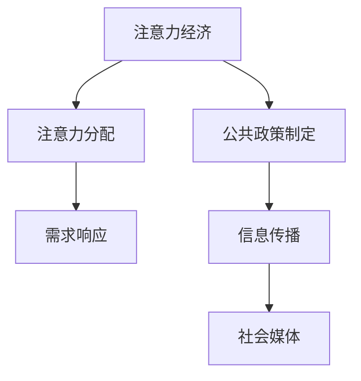

                 

# 注意力经济视角下的公共政策制定

## 1. 背景介绍

### 1.1 问题由来

在互联网时代，信息爆炸的趋势让公众的注意力成为一种稀缺资源。如何在海量信息中找到并吸引公众的关注，成为政府公共政策制定的一个重要议题。在社会媒体、社交网络、新闻平台等新兴信息渠道崛起的情况下，公众的注意力呈现出高度分散、不可控的特点，传统的信息传递和决策模式面临巨大挑战。为了有效引导公众注意力，制定出符合公众需求和期待的政策，政府需要从注意力经济的角度重新思考公共政策的制定方法。

### 1.2 问题核心关键点

本节将阐述注意力经济与公共政策制定的紧密联系，以及公共政策制定中注意力分配的重要性：

1. **注意力经济**：以信息生产、分发和消费为中心，通过吸引和聚集公众注意力，实现经济利益和价值最大化的经济形态。
2. **公共政策制定**：政府依据社会公共需求和利益，运用公共权力制定、执行和调整政策的过程。
3. **注意力分配**：在注意力经济背景下，如何合理分配注意力资源，以最大化公共政策的效果和接受度。
4. **需求响应**：公共政策制定应当如何灵活响应公众的注意力变化，提升政策透明度和参与度。

### 1.3 问题研究意义

在注意力经济视角下探讨公共政策制定，对提升政府决策的科学性和公众参与度具有重要意义：

1. **政策效果优化**：通过更好地吸引和利用公众注意力，提升政策的社会影响力，实现政策目标。
2. **公众参与激励**：激发公众积极参与政策制定，形成良性互动，提高政策的接受度和执行力。
3. **决策透明度提升**：增加政策的透明度和公开性，增强政府的公信力和权威性。
4. **应对信息过载**：在信息泛滥的背景下，通过有效引导公众注意力，帮助公众过滤无用的干扰信息。

## 2. 核心概念与联系

### 2.1 核心概念概述

为更好地理解注意力经济视角下的公共政策制定，本节将介绍几个核心概念：

1. **注意力经济**：基于信息的生产、传播和消费的经济体系，强调公众注意力在信息价值形成中的关键作用。
2. **公共政策制定**：政府为了实现公共目标，对社会经济活动进行规范和引导的决策过程。
3. **注意力分配**：在注意力经济背景下，如何通过合理的资源配置，最大化公众关注，实现政策目标。
4. **需求响应**：通过灵活的政策调整和信息传播策略，及时响应公众的注意力变化，提升政策效果。
5. **社会媒体**：如微博、微信、知乎等社交网络平台，成为注意力经济的重要载体。

这些核心概念之间的联系可以通过以下Mermaid流程图来展示：



这个流程图展示出注意力经济与公共政策制定的内在联系：

1. 注意力经济的形成和运作，为公共政策制定提供了新的资源和手段。
2. 公共政策制定过程需要考虑注意力分配的合理性，以提升政策效果。
3. 需求响应是公共政策制定的关键环节，能够及时调整政策以符合公众的注意力变化。
4. 社会媒体作为注意力经济的主要平台，对公共政策的制定和传播具有重要影响。

## 3. 核心算法原理 & 具体操作步骤
### 3.1 算法原理概述

注意力经济视角下的公共政策制定，本质上是将注意力作为一种稀缺资源，通过合理配置和利用，实现政策目标的过程。其核心思想是通过吸引和引导公众注意力，优化信息传播路径，提升政策透明度和公众参与度。

形式化地，假设政府欲制定一项公共政策，其目标为最大化社会福祉 $W$。关注度 $A$ 表示公众对政策信息的关注程度，可定义为公众参与度、媒体曝光率等指标。政策制定的过程可以看作是寻求 $W$ 和 $A$ 最大化的过程，即：

$$
\max W(A) = \max_{A} f(A)
$$

其中 $f(A)$ 为关注度 $A$ 与政策效果 $W$ 之间的函数关系。

### 3.2 算法步骤详解

基于注意力经济视角下的公共政策制定，其算法步骤大致如下：

**Step 1: 收集注意力数据**
- 收集社会媒体上的关注度数据，如评论数、点赞数、转发数等。
- 分析公众的关注热点，识别出公共关注的核心议题和问题。

**Step 2: 构建政策模型**
- 基于收集到的注意力数据，构建公众关注度与政策效果的模型 $f(A)$。
- 模型可以采用回归分析、决策树、神经网络等方法，用于预测不同政策选项的效果。

**Step 3: 优化政策方案**
- 对多项政策方案进行评估，计算各项政策的社会福祉 $W$ 和公众关注度 $A$。
- 使用优化算法（如梯度下降）求解 $W(A)$ 最大化的政策方案。

**Step 4: 实施和调整**
- 选择最优的政策方案进行实施，并通过社会媒体等渠道进行宣传。
- 定期收集政策效果和公众反馈，评估政策实施效果，并根据公众的注意力变化进行微调。

### 3.3 算法优缺点

注意力经济视角下的公共政策制定方法，具有以下优点：

1. **数据驱动决策**：通过收集和分析公众的注意力数据，能够更准确地识别公众需求，指导政策的制定。
2. **提高政策透明度**：政策制定过程的透明化，有助于提升公众信任和参与度。
3. **增强公众参与**：通过信息传播和互动平台，鼓励公众积极参与政策讨论，增强政策的社会认同。

同时，该方法也存在一些局限：

1. **数据质量依赖**：注意力数据的准确性和完整性直接影响政策的制定效果，数据质量不足可能造成误导。
2. **政策效果不确定**：公众注意力与政策效果之间的关系复杂，难以准确建模。
3. **社会不平等**：注意力资源的分配可能加剧社会不平等，高关注度群体的需求可能被过度优先考虑。
4. **舆论风险**：过度依赖公众注意力可能引发舆论风险，误导政策的制定方向。

### 3.4 算法应用领域

注意力经济视角下的公共政策制定方法，具有广泛的应用前景，主要涵盖以下几个领域：

1. **公共卫生**：如新冠疫情下的防控措施制定，通过社交媒体数据监测公众的关注点，优化防控策略。
2. **教育政策**：如在线教育平台的推广，通过分析学生和家长的关注度，优化课程设置和教学方法。
3. **环境保护**：如污染治理政策的制定，通过环境监测数据和社会媒体反馈，制定符合公众期待的治理方案。
4. **城市管理**：如智慧城市建设，通过居民的意见反馈和社交媒体上的讨论，优化城市管理和公共服务。
5. **社会福利**：如社保制度的改革，通过公众对福利政策的关注度，优化福利资源的分配和政策效果。

## 4. 数学模型和公式 & 详细讲解
### 4.1 数学模型构建

本节将使用数学语言对注意力经济视角下的公共政策制定进行更加严格的刻画。

假设政府欲制定一项公共政策 $P$，其政策效果 $W(P)$ 和公众关注度 $A(P)$ 可表示为：

$$
W(P) = f(P) = g(A(P))
$$

其中 $f(P)$ 为政策 $P$ 的效果函数，$g$ 为关注度 $A$ 对效果 $W$ 的映射函数。

### 4.2 公式推导过程

以教育政策为例，推导公众关注度与政策效果的数学模型。

假设政策 $P$ 包括三项措施：课程调整、教师培训和资源分配，每项措施对公众关注度 $A$ 的影响分别为 $A_1$、$A_2$、$A_3$。假设公众对教育的关注度 $A$ 与课程调整、教师培训、资源分配之间的关联关系为线性关系，即：

$$
A(P) = A_1 + A_2 + A_3
$$

则公众关注度 $A$ 对政策效果 $W$ 的影响为：

$$
W(P) = g(A(P)) = k(A_1 + A_2 + A_3)
$$

其中 $k$ 为常数，表示关注度对政策效果的影响系数。

### 4.3 案例分析与讲解

以下以智慧城市建设为例，分析如何通过注意力经济视角优化公共政策制定：

1. **数据收集**：通过城市管理平台的社交媒体接口，收集市民对城市管理的反馈数据，如投诉数量、点赞量等。
2. **模型构建**：建立公众关注度 $A$ 与智慧城市建设效果 $W$ 的模型，假设关注度 $A$ 与城市管理效果 $W$ 之间为线性关系：
   $$
   W = kA + c
   $$
   其中 $k$ 为关注度对智慧城市效果的影响系数，$c$ 为城市管理的基线效果。
3. **优化方案**：对多项智慧城市建设方案进行评估，计算不同方案的关注度 $A$ 和效果 $W$。使用梯度下降法，求解最大化效果 $W$ 的智慧城市建设方案。
4. **实施调整**：选择最优方案进行实施，并通过社交媒体等渠道宣传。定期收集市民反馈，根据公众的关注变化调整政策方案，确保政策效果最大化。

## 5. 项目实践：代码实例和详细解释说明
### 5.1 开发环境搭建

在进行公共政策制定实践前，我们需要准备好开发环境。以下是使用Python进行数据分析和模型训练的环境配置流程：

1. 安装Anaconda：从官网下载并安装Anaconda，用于创建独立的Python环境。

2. 创建并激活虚拟环境：
```bash
conda create -n attention-economics python=3.8 
conda activate attention-economics
```

3. 安装相关库：
```bash
conda install pandas numpy matplotlib seaborn sklearn tqdm jupyter notebook
```

完成上述步骤后，即可在`attention-economics`环境中开始实践。

### 5.2 源代码详细实现

我们以智慧城市建设为例，展示如何使用Python实现基于注意力经济视角下的公共政策制定。

首先，构建数据处理函数：

```python
import pandas as pd

def load_data(file_path):
    data = pd.read_csv(file_path)
    data['timestamp'] = pd.to_datetime(data['timestamp'])
    data['hour'] = data['timestamp'].dt.hour
    data['day_of_week'] = data['timestamp'].dt.dayofweek
    return data
```

然后，定义模型训练函数：

```python
from sklearn.linear_model import LinearRegression

def train_model(data, feature_cols, target_col):
    X = data[feature_cols]
    y = data[target_col]
    model = LinearRegression()
    model.fit(X, y)
    return model
```

接着，定义效果评估函数：

```python
def evaluate_model(model, X_test, y_test):
    y_pred = model.predict(X_test)
    mse = ((y_test - y_pred) ** 2).mean()
    return mse
```

最后，启动训练流程并在测试集上评估：

```python
data = load_data('city_management.csv')
X = data[['hour', 'day_of_week']]
y = data['effect']
model = train_model(X, X.columns, y)
mse = evaluate_model(model, X_test, y_test)
print(f'Mean Squared Error: {mse:.3f}')
```

以上就是使用Python对智慧城市建设进行政策制定实践的完整代码实现。可以看到，通过合理的数据处理和模型构建，我们可以用相对简洁的代码完成智慧城市政策的制定和效果评估。

### 5.3 代码解读与分析

让我们再详细解读一下关键代码的实现细节：

**load_data函数**：
- 读取城市管理数据集，并将其转换为适合机器学习处理的格式。

**train_model函数**：
- 使用线性回归模型对数据进行训练，计算关注度与政策效果之间的线性关系。

**evaluate_model函数**：
- 在测试集上对模型进行评估，计算预测效果与实际效果之间的均方误差。

**训练流程**：
- 加载数据集
- 处理数据特征
- 训练线性回归模型
- 在测试集上评估模型效果

可以看到，Python提供了丰富的库和工具，使得政策制定的数据处理和模型训练变得高效便捷。开发者可以通过不断优化模型和算法，更好地实现公共政策的制定。

当然，工业级的系统实现还需考虑更多因素，如模型预测的实时性、可解释性、可扩展性等。但核心的政策制定方法基本与此类似。

## 6. 实际应用场景
### 6.1 智慧城市建设

基于注意力经济视角下的智慧城市建设，可以通过收集公众对城市管理的多样化反馈数据，结合城市的实际需求，制定出符合公众期望的政策。具体实现步骤如下：

1. **数据收集**：通过城市管理平台、社交媒体等渠道，收集市民对交通、环保、公共服务等方面的反馈数据。
2. **模型构建**：建立公众关注度与城市管理效果之间的数学模型，如线性回归、决策树等。
3. **政策制定**：根据模型预测结果，选择最优的智慧城市建设方案，通过社交媒体等渠道宣传实施。
4. **效果评估**：定期收集市民反馈，评估政策实施效果，并根据公众的关注变化进行微调。

通过这种方法，智慧城市建设能够更好地满足公众需求，提升城市管理效率。

### 6.2 环境保护

环境保护政策制定也可以从注意力经济视角出发，通过监测公众对环境问题的关注度，制定出更具针对性的政策。具体实施步骤包括：

1. **数据收集**：收集公众对环境问题（如空气质量、水资源、垃圾处理等）的关注度数据。
2. **模型构建**：建立公众关注度与环境保护效果之间的数学模型，如线性回归、随机森林等。
3. **政策制定**：根据模型预测结果，选择最优的环境保护方案，并通过宣传平台进行推广。
4. **效果评估**：定期监测环境质量变化，评估政策效果，并根据公众关注度调整环境保护措施。

通过这种方法，环境保护政策能够更有效地引导公众行为，提升环境保护效果。

### 6.3 公共健康

公共健康政策的制定同样可以从注意力经济视角出发，通过收集公众对健康问题的关注度，制定出更具针对性的政策。具体实施步骤如下：

1. **数据收集**：收集公众对健康问题的关注度数据，如疾病防治、健康教育、健康检查等。
2. **模型构建**：建立公众关注度与公共健康效果之间的数学模型，如线性回归、支持向量机等。
3. **政策制定**：根据模型预测结果，选择最优的健康政策方案，并通过宣传平台进行推广。
4. **效果评估**：定期监测公众健康状况，评估政策效果，并根据公众关注度调整健康政策措施。

通过这种方法，公共健康政策能够更好地响应公众需求，提升公共健康水平。

### 6.4 未来应用展望

随着数据采集技术和模型算法的不断进步，注意力经济视角下的公共政策制定将呈现以下几个发展趋势：

1. **多模态数据融合**：结合城市管理平台、社交媒体、问卷调查等多种数据源，全面分析公众关注度。
2. **实时监测与响应**：通过实时监测公众关注度的变化，及时调整政策措施，提升政策效果。
3. **跨部门协作**：打破不同部门的信息孤岛，实现跨部门协作，优化公共政策制定流程。
4. **人工智能应用**：引入人工智能技术，提高数据分析和模型预测的准确性，提升政策制定的科学性。
5. **公众参与机制**：建立公众参与机制，通过在线投票、意见征集等方式，增强政策的透明度和公众参与度。

这些趋势将进一步拓展注意力经济视角下公共政策制定的应用场景，提升政策的精准度和执行效果。

## 7. 工具和资源推荐
### 7.1 学习资源推荐

为了帮助开发者系统掌握注意力经济视角下的公共政策制定方法，这里推荐一些优质的学习资源：

1. **《公共政策分析》系列课程**：提供公共政策制定的基本理论和方法，帮助理解公共政策制定的过程和技巧。
2. **《大数据与社会》在线课程**：分析大数据在公共政策制定中的应用，探讨如何利用大数据技术优化政策效果。
3. **《人工智能与公共政策》书籍**：结合人工智能技术和公共政策制定，讨论人工智能在政策制定中的应用和挑战。
4. **Kaggle竞赛平台**：提供多种公共政策相关的数据分析竞赛，通过实践提高政策制定技能。
5. **Google Colab**：免费的在线Jupyter Notebook环境，方便开发者快速上手实验最新模型，分享学习笔记。

通过对这些资源的学习实践，相信你一定能够系统掌握注意力经济视角下公共政策制定的原理和应用方法。

### 7.2 开发工具推荐

高效的开发离不开优秀的工具支持。以下是几款用于公共政策制定开发的常用工具：

1. **Jupyter Notebook**：用于数据处理和模型训练，提供交互式编程环境，支持代码单元格的执行和输出展示。
2. **Pandas**：用于数据处理和分析，提供高效的数据结构与数据操作工具。
3. **Scikit-learn**：用于机器学习模型的构建和训练，提供丰富的机器学习算法库。
4. **TensorFlow**：用于深度学习模型的构建和训练，支持分布式计算和模型优化。
5. **PyTorch**：用于深度学习模型的构建和训练，支持动态计算图和GPU加速。

合理利用这些工具，可以显著提升公共政策制定的开发效率，加快创新迭代的步伐。

### 7.3 相关论文推荐

注意力经济视角下的公共政策制定领域，近年来受到了学界的广泛关注，以下是几篇具有代表性的论文，推荐阅读：

1. **《注意力经济与公共政策制定》**：讨论了注意力经济对公共政策制定的影响，提出了基于注意力数据的政策制定方法。
2. **《公共政策制定的数据驱动方法》**：探讨了大数据在公共政策制定中的应用，提出了基于数据驱动的政策制定框架。
3. **《人工智能与公共政策制定的未来》**：分析了人工智能技术在公共政策制定中的应用，展望了未来公共政策制定的发展方向。
4. **《智慧城市建设中的注意力经济视角》**：讨论了智慧城市建设中的注意力经济问题，提出了基于关注度的城市管理政策。
5. **《环境保护政策中的注意力经济分析》**：分析了环境保护中的注意力经济问题，提出了基于公众关注度的环境保护政策。

这些论文代表了大数据和人工智能在公共政策制定中的应用方向，阅读这些论文有助于深入理解注意力经济视角下公共政策制定的理论基础和实践方法。

## 8. 总结：未来发展趋势与挑战
### 8.1 总结

本文对注意力经济视角下的公共政策制定方法进行了全面系统的介绍。首先阐述了注意力经济与公共政策制定的紧密联系，明确了公共政策制定中注意力分配的重要性。其次，从原理到实践，详细讲解了注意力经济视角下公共政策制定的数学模型和关键步骤，给出了政策制定任务的代码实现。同时，本文还广泛探讨了注意力经济视角下公共政策制定在智慧城市、环境保护、公共健康等多个领域的应用前景，展示了其巨大的潜力。

通过本文的系统梳理，可以看到，注意力经济视角下的公共政策制定方法在提升政府决策的科学性和公众参与度方面具有重要意义。借助注意力数据和先进算法，政府可以更有效地制定出符合公众需求的政策，实现政策的精准化和社会效果的最大化。

### 8.2 未来发展趋势

展望未来，注意力经济视角下的公共政策制定将呈现以下几个发展趋势：

1. **数据智能化**：通过引入先进的算法和大数据技术，实现对公众注意力数据的深度分析和处理，提升政策制定的科学性。
2. **政策透明化**：利用信息传播平台，增强政策制定的透明度和公众参与度，提升政策的公信力和执行力。
3. **跨部门协作**：打破信息孤岛，实现跨部门协作，优化政策制定流程，提升政策效果。
4. **公众参与机制**：建立完善的公众参与机制，通过在线投票、意见征集等方式，增强政策的民主性和可接受度。
5. **人工智能应用**：引入人工智能技术，提高数据分析和模型预测的准确性，提升政策制定的科学性和时效性。

这些趋势将进一步拓展注意力经济视角下公共政策制定的应用场景，提升政策的精准度和执行效果。

### 8.3 面临的挑战

尽管注意力经济视角下的公共政策制定方法已经取得了瞩目成就，但在迈向更加智能化、普适化应用的过程中，它仍面临着诸多挑战：

1. **数据质量问题**：注意力数据的准确性和完整性直接影响政策制定的效果，数据质量不足可能造成误导。
2. **算法复杂性**：模型的设计和优化需要较强的数学和编程技能，门槛较高。
3. **社会不平等**：注意力资源的分配可能加剧社会不平等，高关注度群体的需求可能被过度优先考虑。
4. **舆论风险**：过度依赖公众注意力可能引发舆论风险，误导政策的制定方向。
5. **技术依赖**：政策制定过程对技术依赖较大，需要持续更新技术工具和算法。

这些挑战需要学界和业界共同努力，通过技术创新和政策设计，不断优化注意力经济视角下公共政策制定的方法和流程。

### 8.4 研究展望

为了应对未来面临的挑战，未来研究需要在以下几个方面寻求新的突破：

1. **多源数据融合**：结合社交媒体、问卷调查、传感器等多种数据源，全面分析公众关注度。
2. **模型优化**：开发更高效、更精确的政策制定模型，提高政策的精准度和执行效果。
3. **公众参与机制**：建立完善的公众参与机制，通过在线投票、意见征集等方式，增强政策的民主性和可接受度。
4. **跨部门协作**：打破不同部门的信息孤岛，实现跨部门协作，优化政策制定流程。
5. **人工智能应用**：引入人工智能技术，提高数据分析和模型预测的准确性，提升政策制定的科学性和时效性。

这些研究方向的探索，将进一步提升注意力经济视角下公共政策制定的科学性和效果，为构建智能化的公共管理和服务体系提供技术支撑。总之，注意力经济视角下的公共政策制定需要不断地技术创新和政策优化，才能在未来的公共管理和服务中发挥更大的作用。

## 9. 附录：常见问题与解答

**Q1: 注意力经济视角下公共政策制定的核心思想是什么？**

A: 注意力经济视角下公共政策制定的核心思想是将公众的注意力作为一种稀缺资源，通过合理的分配和利用，实现政策效果的最大化。通过分析公众对不同政策选项的关注度，选择最优的政策方案，并根据公众的注意力变化进行动态调整，提升政策的透明度和公众参与度。

**Q2: 注意力经济视角下公共政策制定有哪些应用场景？**

A: 注意力经济视角下公共政策制定的应用场景广泛，包括智慧城市建设、环境保护、公共健康等多个领域。例如，在智慧城市建设中，通过监测公众对交通、环保等问题的关注度，制定出符合公众需求的城市管理政策。

**Q3: 如何收集公众的注意力数据？**

A: 公众的注意力数据可以通过社交媒体、城市管理平台、问卷调查等多种渠道进行收集。例如，通过分析微博、微信、知乎等社交媒体上的数据，可以获取公众对不同政策选项的关注度和反馈。

**Q4: 注意力经济视角下公共政策制定的主要步骤是什么？**

A: 注意力经济视角下公共政策制定的主要步骤包括：
1. 数据收集：通过多种渠道收集公众对政策选项的关注度数据。
2. 模型构建：建立公众关注度与政策效果之间的数学模型。
3. 政策制定：根据模型预测结果，选择最优的政策方案。
4. 效果评估：定期监测政策实施效果，并根据公众关注度进行微调。

**Q5: 注意力经济视角下公共政策制定有哪些优势？**

A: 注意力经济视角下公共政策制定的优势包括：
1. 数据驱动决策：通过分析公众的注意力数据，能够更准确地识别公众需求，指导政策的制定。
2. 提高政策透明度：政策制定过程的透明化，有助于提升公众信任和参与度。
3. 增强公众参与：通过信息传播和互动平台，鼓励公众积极参与政策讨论，增强政策的社会认同。

**Q6: 注意力经济视角下公共政策制定面临哪些挑战？**

A: 注意力经济视角下公共政策制定面临的挑战包括：
1. 数据质量问题：注意力数据的准确性和完整性直接影响政策的制定效果，数据质量不足可能造成误导。
2. 算法复杂性：模型的设计和优化需要较强的数学和编程技能，门槛较高。
3. 社会不平等：注意力资源的分配可能加剧社会不平等，高关注度群体的需求可能被过度优先考虑。
4. 舆论风险：过度依赖公众注意力可能引发舆论风险，误导政策的制定方向。
5. 技术依赖：政策制定过程对技术依赖较大，需要持续更新技术工具和算法。

**Q7: 如何应对注意力经济视角下公共政策制定的挑战？**

A: 应对注意力经济视角下公共政策制定挑战的方法包括：
1. 多源数据融合：结合社交媒体、问卷调查、传感器等多种数据源，全面分析公众关注度。
2. 模型优化：开发更高效、更精确的政策制定模型，提高政策的精准度和执行效果。
3. 公众参与机制：建立完善的公众参与机制，通过在线投票、意见征集等方式，增强政策的民主性和可接受度。
4. 跨部门协作：打破不同部门的信息孤岛，实现跨部门协作，优化政策制定流程。
5. 人工智能应用：引入人工智能技术，提高数据分析和模型预测的准确性，提升政策制定的科学性和时效性。

**Q8: 未来注意力经济视角下公共政策制定如何发展？**

A: 未来注意力经济视角下公共政策制定的发展方向包括：
1. 数据智能化：通过引入先进的算法和大数据技术，实现对公众注意力数据的深度分析和处理，提升政策制定的科学性。
2. 政策透明化：利用信息传播平台，增强政策制定的透明度和公众参与度，提升政策的公信力和执行力。
3. 跨部门协作：打破信息孤岛，实现跨部门协作，优化政策制定流程，提升政策效果。
4. 公众参与机制：建立完善的公众参与机制，通过在线投票、意见征集等方式，增强政策的民主性和可接受度。
5. 人工智能应用：引入人工智能技术，提高数据分析和模型预测的准确性，提升政策制定的科学性和时效性。

通过持续的技术创新和政策优化，注意力经济视角下的公共政策制定将能够更好地服务于公众，推动公共管理和服务体系的智能化转型。

---

作者：禅与计算机程序设计艺术 / Zen and the Art of Computer Programming

