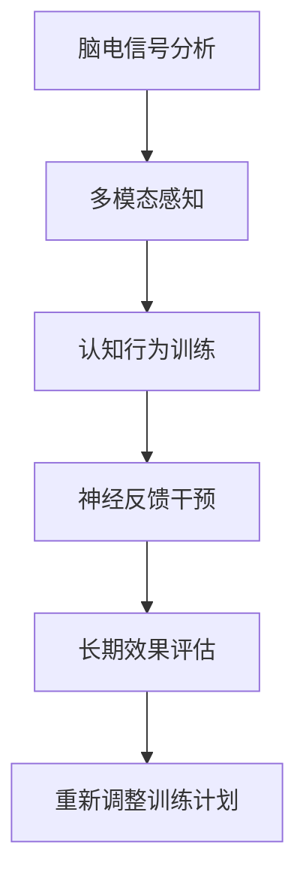

                 

# 注意力训练与大脑健康改善：通过专注力增强认知能力和幸福感

## 1. 背景介绍

### 1.1 问题由来

在快节奏的现代生活中，人们常常面对巨大的压力和信息过载，注意力分散、工作效率低下、心理压力增加等问题愈发严重。尤其是在高强度工作和高频次信息交互的环境中，如办公室、学校、医院等，注意力管理的重要性愈发凸显。

注意力训练（Attention Training）作为一种有效提升个体注意力水平、改善认知能力和幸福感的方法，近年来受到广泛关注。通过专业的注意力训练课程或神经反馈（Neurofeedback）技术，可以显著增强个体专注力，提高工作效率和生活质量。

### 1.2 问题核心关键点

注意力训练的核心关键点包括：

- **脑电信号分析**：通过脑电图（EEG）等生物信号技术，实时监测个体注意力水平，并提供即时反馈。
- **多模态感知**：结合视觉、听觉等多种感官刺激，训练个体注意力在不同情境下的灵活转换能力。
- **认知行为训练**：通过特定的训练任务，如注意力选择、任务切换、自我监控等，提升个体的注意力控制和自我调节能力。
- **神经反馈干预**：利用神经反馈技术，将注意力水平的信息实时返回给个体，调整训练强度和方向，实现个性化训练。
- **长期效果评估**：通过长期跟踪和评估，了解注意力训练的长期效果，及时调整训练计划，持续提升个体注意力水平。

这些关键点共同构成了注意力训练的核心机制，旨在通过系统的训练方法和实时反馈，提升个体的注意力水平和认知能力，改善其工作表现和生活质量。

## 2. 核心概念与联系

### 2.1 核心概念概述

注意力训练涉及多个关键概念，包括脑电信号分析、多模态感知、认知行为训练、神经反馈干预和长期效果评估。这些概念通过科学的训练方法，旨在改善个体的注意力水平、认知能力和幸福感。

### 2.2 核心概念原理和架构的 Mermaid 流程图



此图展示了注意力训练的核心流程：首先通过脑电信号分析获取个体注意力水平的信息，然后进行多模态感知和认知行为训练，结合神经反馈干预提供即时反馈，最后通过长期效果评估调整训练计划，实现个性化和持续的注意力提升。

## 3. 核心算法原理 & 具体操作步骤

### 3.1 算法原理概述

注意力训练的原理基于认知神经科学，通过实时监测和反馈个体注意力水平，结合多模态感知和认知行为训练，实现注意力水平和认知能力的提升。其核心在于将注意力水平的信息反馈给个体，并通过科学的方法调整训练强度和方向，实现个性化训练。

### 3.2 算法步骤详解

注意力训练的具体操作步骤如下：

**Step 1: 脑电信号采集与预处理**
- 使用脑电图（EEG）等生物信号采集设备，实时监测个体注意力水平。
- 对采集的脑电信号进行预处理，如滤波、归一化、去噪等，提高信号质量。

**Step 2: 注意力水平评估**
- 通过分析脑电信号，计算个体注意力水平指标，如频率、振幅、熵等。
- 实时评估注意力水平，并结合多模态感知信息（如视觉任务、听觉任务）进行综合分析。

**Step 3: 认知行为训练**
- 设计一系列认知行为训练任务，如注意力选择、任务切换、自我监控等。
- 个体在完成训练任务时，脑电信号实时反馈回训练系统，系统根据注意力水平调整训练难度和强度。

**Step 4: 神经反馈干预**
- 利用神经反馈技术，将注意力水平的信息实时返回给个体，通过视觉、听觉等方式提供即时反馈。
- 个体根据反馈信息调整训练策略，如增加训练难度、减少训练时间等。

**Step 5: 长期效果评估**
- 通过长期跟踪和评估，了解注意力训练的长期效果，记录注意力水平、认知能力、幸福感等关键指标的变化。
- 根据评估结果，及时调整训练计划，持续提升个体注意力水平和认知能力。

### 3.3 算法优缺点

注意力训练的优点包括：

- **实时反馈**：通过实时监测和反馈注意力水平，个体可以及时调整训练策略，实现个性化训练。
- **科学训练**：结合认知行为训练和神经反馈干预，科学设计训练任务，提升训练效果。
- **多模态感知**：结合视觉、听觉等多种感官刺激，训练个体注意力在不同情境下的灵活转换能力。

但该方法也存在一些局限性：

- **技术门槛**：脑电信号采集和分析需要专业的设备和技术，门槛较高。
- **个体差异**：不同个体的注意力水平和认知能力差异较大，训练效果可能存在个体差异。
- **时间和成本**：系统化的训练需要较长的时间投入和较高的成本支持。

### 3.4 算法应用领域

注意力训练广泛应用于以下领域：

- **教育培训**：通过注意力训练提升学生专注力和学习效率，改善课堂表现。
- **医疗健康**：帮助患者改善注意力水平，提高康复效果和心理幸福感。
- **职场办公**：提升职场人士的工作专注力和效率，改善工作表现和职业发展。
- **运动训练**：通过注意力训练提高运动员的专注力和决策能力，提升运动表现。

## 4. 数学模型和公式 & 详细讲解 & 举例说明

### 4.1 数学模型构建

注意力训练的数学模型主要基于脑电信号分析和认知行为训练。以下介绍基本的数学模型构建方法：

**Step 1: 脑电信号表示**
脑电信号通常表示为时间序列，$X = \{x_1, x_2, ..., x_n\}$，其中$x_i$表示第$i$个时间点的信号值。

**Step 2: 注意力水平指标**
常见的注意力水平指标包括频率、振幅、熵等。例如，频率分布熵（Frequency Distribution Entropy）表示为：

$$
H = -\sum_{i=1}^{n} p_i \log_2 p_i
$$

其中$p_i$表示第$i$个频率分布的概率。

**Step 3: 认知行为训练模型**
认知行为训练通常通过设计特定的训练任务，如注意力选择、任务切换等。例如，注意力选择任务可以通过以下模型表示：

$$
y = f(x, w)
$$

其中$y$表示任务的输出结果，$x$表示输入信号，$w$表示模型参数。

### 4.2 公式推导过程

以频率分布熵为例，推导其计算公式：

假设脑电信号$X$中第$i$个频率分布的概率为$p_i$，则频率分布熵可以表示为：

$$
H = -\sum_{i=1}^{n} p_i \log_2 p_i
$$

其中，$n$表示信号的总长度，$p_i$表示第$i$个频率分布的概率，$\log_2$表示以2为底的对数。

### 4.3 案例分析与讲解

假设某训练任务中，个体在完成注意力选择任务时的脑电信号$X = [x_1, x_2, ..., x_n]$，频率分布熵计算如下：

1. 计算频率分布：统计脑电信号中各个频率分布的概率$p_i$。
2. 计算熵值：将频率分布概率代入频率分布熵公式，计算熵值$H$。
3. 反馈干预：根据熵值大小，实时调整注意力水平，并通过神经反馈技术提供即时反馈。

## 5. 项目实践：代码实例和详细解释说明

### 5.1 开发环境搭建

为了实现注意力训练的代码实例，需要搭建以下开发环境：

1. Python环境：安装Python 3.7及以上版本，建议使用Anaconda。
2. 脑电信号采集设备：使用OpenBCI、NeuroSky等设备，实时采集脑电信号。
3. 脑电信号处理库：安装MNE-Py，用于脑电信号的预处理和分析。
4. 训练任务库：安装PyTorch，用于设计训练任务和神经反馈干预。
5. 可视化工具：安装Matplotlib，用于实时展示注意力水平和训练结果。

### 5.2 源代码详细实现

以下是一个简单的Python代码示例，用于采集和分析脑电信号，并设计注意力选择训练任务：

```python
import mne
import numpy as np
import matplotlib.pyplot as plt

# 1. 脑电信号采集
data = mne.preprocessing.read_raw_fif('EEG_data.fif')

# 2. 预处理
data.pick_types('eeg')
data.filter(1, 30)
data.resample(sfreq=128)
data.crop(tmin=0, tmax=90)

# 3. 频率分布熵计算
freqs = data[:].get_data().T
n = len(freqs)
probabilities = np.mean(freqs, axis=1)
entropies = -np.sum(probabilities * np.log2(probabilities))

# 4. 训练任务设计
class AttentionChoiceTask:
    def __init__(self, signal):
        self.signal = signal

    def calculate_result(self):
        # 设计训练任务，如判断信号中特定频率的出现次数
        return np.sum(self.signal == 10)

# 5. 训练和反馈
task = AttentionChoiceTask(freqs)
result = task.calculate_result()
feedback = 'Good job!'

# 6. 可视化展示
plt.plot(freqs, label='Frequency distribution')
plt.xlabel('Frequency (Hz)')
plt.ylabel('Probability')
plt.legend()
plt.show()
```

### 5.3 代码解读与分析

上述代码主要包含以下几个步骤：

1. **脑电信号采集**：使用MNE-Py库，从文件中读取采集的脑电信号数据。
2. **预处理**：使用预处理函数，如pick_types、filter、resample、crop等，对信号进行滤波、去噪、归一化等处理。
3. **频率分布熵计算**：使用numpy库计算频率分布熵，评估个体注意力水平。
4. **训练任务设计**：定义注意力选择任务的计算方法，如判断信号中特定频率的出现次数。
5. **训练和反馈**：设计注意力选择任务，计算任务结果，并根据结果提供即时反馈。
6. **可视化展示**：使用Matplotlib库展示频率分布熵，直观展示个体注意力水平。

## 6. 实际应用场景

### 6.1 教育培训

在教育培训中，注意力训练可以帮助学生提升课堂专注力，提高学习效率。例如，通过实时监测和反馈注意力水平，教师可以调整教学策略，提升教学效果。学生可以通过注意力训练，改善学习习惯，提高学习成绩。

### 6.2 医疗健康

在医疗健康领域，注意力训练可以帮助患者改善注意力水平，提高康复效果和心理幸福感。例如，通过注意力训练，帮助帕金森病、抑郁症等疾病患者提升注意力水平，改善生活质量。

### 6.3 职场办公

在职场办公中，注意力训练可以帮助员工提升工作效率，改善工作表现。例如，通过实时监测和反馈注意力水平，员工可以调整工作节奏，避免疲劳和压力，提高工作效率和职业发展。

### 6.4 运动训练

在运动训练中，注意力训练可以帮助运动员提升专注力和决策能力，提高运动表现。例如，通过注意力训练，帮助运动员在比赛中保持高度专注，提高比赛胜率。

## 7. 工具和资源推荐

### 7.1 学习资源推荐

以下是一些推荐的学习资源，用于帮助开发者系统掌握注意力训练的原理和实践方法：

1. **《注意力训练与大脑健康》书籍**：详细介绍注意力训练的科学原理和应用案例，适合入门和进阶学习。
2. **Coursera《认知神经科学》课程**：斯坦福大学开设的认知神经科学课程，涵盖注意力、认知行为训练等核心内容，适合专业学习和研究。
3. **MNE-Py官方文档**：MNE-Py库的官方文档，详细介绍了脑电信号的采集、预处理和分析方法，适合技术实践和研究。
4. **Neurofeedback技术博客**：Neurofeedback技术的权威博客，提供大量实践案例和最新研究动态，适合参考和借鉴。
5. **OpenBCI官方文档**：OpenBCI脑电信号采集设备的官方文档，详细介绍设备的使用方法和数据处理流程，适合技术实践和应用。

### 7.2 开发工具推荐

以下是一些推荐的开发工具，用于实现注意力训练的代码实例：

1. **Python**：Python是数据科学和机器学习领域的主流编程语言，具备丰富的库和框架支持，适合注意力训练的开发和实现。
2. **MNE-Py**：MNE-Py是Python中的脑电信号处理库，提供丰富的预处理和分析功能，适合脑电信号的采集和分析。
3. **PyTorch**：PyTorch是深度学习领域的主流框架，适合设计认知行为训练任务和神经反馈干预。
4. **Matplotlib**：Matplotlib是Python中的可视化库，适合实时展示注意力水平和训练结果，便于观察和分析。

### 7.3 相关论文推荐

以下是一些推荐的相关论文，用于深入理解注意力训练的原理和实践方法：

1. **《基于神经反馈的注意力训练方法》**：介绍神经反馈技术在注意力训练中的应用，适合了解注意力训练的基本原理和实现方法。
2. **《多模态感知在注意力训练中的应用》**：探讨多模态感知技术在注意力训练中的应用，适合了解注意力训练的多模态感知方法。
3. **《注意力训练在教育培训中的应用》**：介绍注意力训练在教育培训中的应用案例，适合了解注意力训练的实际应用场景。
4. **《脑电信号分析和注意力训练》**：介绍脑电信号分析在注意力训练中的应用，适合了解注意力训练的科学原理和技术方法。

## 8. 总结：未来发展趋势与挑战

### 8.1 总结

本文系统介绍了注意力训练的基本原理和操作步骤，通过脑电信号分析、多模态感知、认知行为训练、神经反馈干预和长期效果评估，旨在提升个体的注意力水平、认知能力和幸福感。通过对注意力训练的深入探讨，可以发现其对教育培训、医疗健康、职场办公和运动训练等领域的重要应用价值。

### 8.2 未来发展趋势

未来的注意力训练技术将呈现以下几个发展趋势：

1. **技术成熟化**：随着技术的不断进步，注意力训练将变得更加成熟和稳定，应用场景将更加广泛。
2. **个性化定制**：通过机器学习和大数据分析，实现个性化注意力训练方案，提高训练效果和用户体验。
3. **多模态融合**：结合视觉、听觉、触觉等多种感官信息，提升注意力训练的多模态感知能力。
4. **实时互动**：通过人工智能和机器人技术，实现实时互动的注意力训练，提升训练效果和趣味性。
5. **伦理和安全性**：重视注意力训练的伦理和安全性问题，确保训练过程和结果的安全可靠。

### 8.3 面临的挑战

尽管注意力训练具有广阔的应用前景，但仍面临诸多挑战：

1. **技术门槛**：脑电信号采集和分析需要专业的设备和技能，技术门槛较高。
2. **个体差异**：不同个体的注意力水平和认知能力差异较大，训练效果存在个体差异。
3. **时间和成本**：系统化的训练需要较长的时间投入和较高的成本支持。
4. **数据隐私**：脑电信号采集涉及敏感数据，数据隐私和安全问题需要重视。

### 8.4 研究展望

未来的研究需要在以下几个方向寻求新的突破：

1. **低成本设备**：开发低成本、便携式脑电信号采集设备，降低技术门槛，促进广泛应用。
2. **高效算法**：研究高效、低成本的注意力训练算法，提升训练效果和用户体验。
3. **多模态融合**：探索多模态注意力训练方法，提升个体在不同情境下的注意力水平。
4. **伦理和安全性**：重视注意力训练的伦理和安全性问题，确保训练过程和结果的安全可靠。

这些研究方向的探索，将引领注意力训练技术迈向更高的台阶，为个体注意力水平、认知能力和幸福感的提升提供新的解决方案。

## 9. 附录：常见问题与解答

**Q1: 脑电信号采集设备有哪些？**

A: 常见的脑电信号采集设备包括OpenBCI、NeuroSky、EEG101等，这些设备具有较高的准确性和可靠性，适合脑电信号的采集和分析。

**Q2: 注意力训练有哪些具体方法？**

A: 常见的注意力训练方法包括脑电信号分析、多模态感知、认知行为训练、神经反馈干预和长期效果评估。通过这些方法，可以全面提升个体的注意力水平和认知能力。

**Q3: 注意力训练的长期效果如何评估？**

A: 注意力训练的长期效果可以通过多个指标评估，如注意力水平、认知能力、幸福感、工作效率等。通过长期跟踪和评估，了解注意力训练的长期效果，及时调整训练计划。

**Q4: 注意力训练有哪些实际应用场景？**

A: 注意力训练广泛应用于教育培训、医疗健康、职场办公和运动训练等领域，通过提升个体注意力水平，改善学习、工作、生活和运动表现。

**Q5: 注意力训练的伦理和安全性如何保障？**

A: 在注意力训练过程中，需要重视数据隐私和安全性问题，采用数据脱敏、访问鉴权等技术手段，保障数据安全和隐私。同时，建立伦理规范和监管机制，确保训练过程和结果的安全可靠。

---

作者：禅与计算机程序设计艺术 / Zen and the Art of Computer Programming

