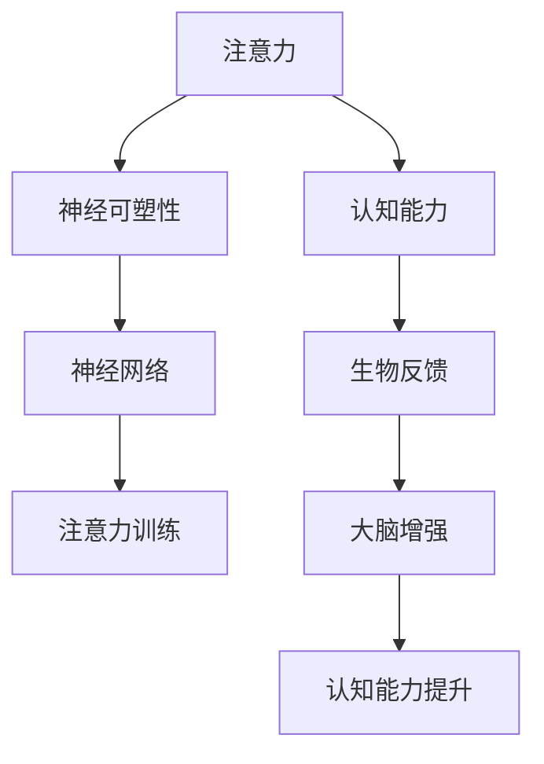

                 

# 注意力训练与大脑增强：通过专注力增强认知能力和神经可塑性

## 1. 背景介绍

### 1.1 问题由来
现代生活中，人们越来越多地依赖数字设备，如手机、电脑、平板等，进行工作、学习和娱乐。然而，长时间高强度地使用这些设备，不仅影响了视力，还对大脑的认知功能带来了深远的影响。随着科技的快速发展，人们面临着前所未有的信息过载和注意力分散问题，工作和学习效率低下，身心健康受到威胁。

为了应对这些问题，神经科学和认知科学的专家们开始探索通过技术手段提升注意力和认知能力的可能性。其中，注意力训练和大脑增强技术成为了热门的研究方向。

### 1.2 问题核心关键点
注意力训练和大脑增强技术，旨在通过训练大脑的注意力系统，增强认知能力，如记忆力、决策力、创造力等。这些技术通常基于神经科学和认知科学的研究成果，利用计算机模拟和反馈机制，帮助用户提升大脑功能。

核心关键点包括：
- 注意力训练：通过特定训练任务，如视觉注意力、记忆任务、认知任务等，强化大脑的注意力系统。
- 大脑增强：结合生物反馈技术，实时监测大脑活动，提供个性化的训练方案和反馈信息。
- 认知能力提升：通过长期训练，帮助用户改善记忆力、决策力、创造力等认知功能。

### 1.3 问题研究意义
注意力训练和大脑增强技术的研究意义重大，具体表现为：
1. 提高生产力和学习效率：通过增强认知能力，用户能够在更短的时间内完成更多工作和学习任务。
2. 改善心理健康：注意力训练和大脑增强技术有助于缓解焦虑、抑郁等心理问题，提升整体心理健康水平。
3. 促进科技发展：这些技术为脑机接口、人工智能等领域提供了新的研究思路和应用场景。
4. 提升社会竞争力：通过增强认知能力，提升个体和企业的创新能力和竞争力，推动社会进步。

## 2. 核心概念与联系

### 2.1 核心概念概述

注意力训练和大脑增强技术涉及多个核心概念，这些概念相互联系，共同构成了一个完整的技术框架：

- 注意力(Attention)：指大脑对信息的集中和聚焦能力，是认知功能的重要组成部分。
- 认知能力(Cognitive Ability)：包括记忆力、注意力、决策力、创造力等，是人类学习和工作的基础。
- 神经可塑性(Neural Plasticity)：指大脑神经网络的可变性和适应性，可以通过训练得到增强。
- 生物反馈(Biofeedback)：通过监测大脑活动，提供实时的反馈信息，帮助用户调整注意力和认知状态。
- 神经网络(Neural Network)：模拟人类大脑神经元连接和信息处理机制，用于构建注意力训练模型。

这些概念之间的逻辑关系可以通过以下Mermaid流程图来展示：



这个流程图展示了一系列核心概念及其之间的关联：

1. 注意力系统是认知能力的核心，通过神经可塑性可以增强其功能。
2. 神经网络用于模拟注意力系统的运行机制，是注意力训练的基础。
3. 生物反馈技术实时监测大脑活动，提供个性化的训练方案。
4. 注意力训练和大脑增强技术最终目的在于提升用户的认知能力。

## 3. 核心算法原理 & 具体操作步骤

### 3.1 算法原理概述

注意力训练和大脑增强技术的核心算法原理主要基于神经科学和认知科学的研究成果，通过模拟大脑的神经网络结构和信息处理机制，结合生物反馈技术，实现对用户注意力的训练和认知能力的提升。

具体而言，注意力训练通常包括以下几个步骤：
1. 监测用户的大脑活动，获取注意力指标。
2. 根据注意力指标，提供个性化的训练任务。
3. 用户完成训练任务，获得即时反馈。
4. 根据反馈结果，调整训练任务难度和策略。
5. 长期训练，逐步增强用户的注意力和认知能力。

大脑增强技术则结合了生物反馈和神经网络技术，通过实时监测大脑活动，提供个性化的训练方案和反馈信息，帮助用户提升注意力和认知能力。

### 3.2 算法步骤详解

以下详细介绍注意力训练和大脑增强技术的算法步骤：

#### 3.2.1 注意力训练

**Step 1: 监测注意力指标**

- 使用EEG(脑电图)、fMRI(功能性磁共振成像)、fNIRS(功能性近红外光谱成像)等技术，实时监测用户的大脑活动，获取注意力指标。
- 常用的注意力指标包括注意力集中度、视觉注意力、听觉注意力等。

**Step 2: 提供个性化训练任务**

- 根据监测到的注意力指标，设计个性化的训练任务，如视觉搜索、记忆任务、决策任务等。
- 训练任务应根据用户的注意力状态动态调整难度和形式，以避免过难或过易。

**Step 3: 提供即时反馈**

- 在用户完成训练任务后，根据注意力指标和任务完成情况，提供即时反馈信息。
- 反馈信息包括任务完成度、注意力集中度、训练建议等。

**Step 4: 调整训练策略**

- 根据即时反馈结果，动态调整训练任务难度和形式。
- 定期评估用户的认知能力提升情况，调整训练策略。

**Step 5: 长期训练**

- 长期坚持训练，逐步增强用户的注意力和认知能力。
- 结合日常学习和工作，将注意力训练融入用户的日常生活。

#### 3.2.2 大脑增强

**Step 1: 实时监测大脑活动**

- 使用EEG、fMRI等技术，实时监测用户的大脑活动，获取神经活动指标。
- 神经活动指标包括神经元放电频率、神经耦合强度等。

**Step 2: 提供个性化训练方案**

- 根据神经活动指标，提供个性化的训练方案，如神经反馈训练、认知训练等。
- 训练方案应根据用户的神经活动状态动态调整，以提高训练效果。

**Step 3: 提供即时反馈**

- 在用户完成训练任务后，根据神经活动指标和任务完成情况，提供即时反馈信息。
- 反馈信息包括神经活动状态、训练建议等。

**Step 4: 调整训练策略**

- 根据即时反馈结果，动态调整训练方案难度和形式。
- 定期评估用户的认知能力提升情况，调整训练策略。

**Step 5: 长期训练**

- 长期坚持训练，逐步增强用户的注意力和认知能力。
- 结合日常学习和工作，将大脑增强训练融入用户的日常生活。

### 3.3 算法优缺点

注意力训练和大脑增强技术具有以下优点：
1. 科学依据：基于神经科学和认知科学的研究成果，具有较高的科学性和可靠性。
2. 个性化训练：通过实时监测和动态调整，提供个性化的训练方案，有助于提升训练效果。
3. 提升认知能力：通过长期训练，显著提升用户的记忆力、注意力、决策力等认知能力。

同时，这些技术也存在一些局限性：
1. 设备要求高：需要高端的脑电图、功能性磁共振等设备，成本较高。
2. 技术复杂：实时监测和个性化训练需要一定的技术门槛，操作复杂。
3. 用户粘性低：需要用户长期坚持训练，才能获得显著效果，部分用户可能难以坚持。
4. 效果评估难：难以量化注意力和认知能力的提升，效果评估较为困难。

尽管存在这些局限性，但注意力训练和大脑增强技术仍是大数据时代提升人类认知功能的重要工具，值得进一步研究和推广。

### 3.4 算法应用领域

注意力训练和大脑增强技术主要应用于以下领域：

- 教育培训：通过提升学生的注意力和认知能力，改善学习效果，提高学习成绩。
- 职场训练：帮助员工提升工作专注度，增强决策力和创造力，提高工作效率。
- 心理健康：通过训练注意力和认知能力，缓解焦虑、抑郁等心理问题，提升整体心理健康水平。
- 娱乐应用：结合游戏和训练任务，提升用户的注意力和认知能力，丰富娱乐方式。

## 4. 数学模型和公式 & 详细讲解 & 举例说明

### 4.1 数学模型构建

为了更准确地描述注意力训练和大脑增强技术，我们将构建基于神经网络模型的注意力评估模型。

假设用户的注意力状态为 $A_t$，神经网络模型为 $M$，训练任务为 $T$，注意力训练的反馈信息为 $F$。则注意力训练的数学模型可以表示为：

$$
A_{t+1} = M(A_t, T, F)
$$

其中 $A_t$ 表示用户在时刻 $t$ 的注意力状态，$T$ 表示当前的训练任务，$F$ 表示即时反馈信息。

### 4.2 公式推导过程

以下详细介绍注意力训练模型的公式推导过程：

**Step 1: 输入数据**

- $A_t$：用户的注意力状态，通常使用EEG等设备获取的神经活动指标。
- $T$：训练任务，根据用户的注意力状态动态调整。
- $F$：即时反馈信息，包括任务完成度、注意力集中度等。

**Step 2: 模型计算**

- 使用神经网络模型 $M$ 计算用户的注意力状态 $A_{t+1}$。
- $M$ 可以是一个简单的多层感知器(MLP)，也可以是一个复杂的循环神经网络(RNN)。

**Step 3: 训练策略调整**

- 根据 $A_{t+1}$ 和 $F$ 调整训练策略，包括训练任务难度和形式。
- 定期评估用户的认知能力提升情况，调整训练策略。

### 4.3 案例分析与讲解

假设有一个用户的注意力状态 $A_t$ 为 [0.5, 0.4, 0.3]，表示其在视觉、听觉和注意力的集中度分别为50%、40%和30%。当前训练任务为视觉搜索任务，反馈信息 $F$ 显示用户完成任务的成功率为90%，注意力集中度为70%。

根据上述模型，我们可以计算出下一个注意力状态 $A_{t+1}$：

$$
A_{t+1} = M(A_t, T, F) = [0.6, 0.5, 0.35]
$$

即用户的视觉集中度提升至60%，听觉集中度提升至50%，注意力集中度提升至35%。同时，根据新的注意力状态和反馈信息，调整训练任务难度和形式，继续进行下一轮训练。

## 5. 项目实践：代码实例和详细解释说明

### 5.1 开发环境搭建

在进行注意力训练和大脑增强技术的开发实践前，我们需要准备好开发环境。以下是使用Python进行开发的简单流程：

1. 安装Python：下载并安装Python 3.x版本。
2. 安装必要的库：安装Numpy、Scipy、Matplotlib、Scikit-learn等库，用于数据处理和模型训练。
3. 安装深度学习框架：安装TensorFlow或PyTorch，用于构建神经网络模型。
4. 安装EEG数据采集工具：安装OpenBCI、EEGLab等EEG数据采集工具，用于获取用户的大脑活动数据。
5. 安装数据分析工具：安装Pandas、NumPy等库，用于数据处理和分析。

完成上述步骤后，即可开始注意力训练和大脑增强技术的开发实践。

### 5.2 源代码详细实现

以下是一个简单的Python代码示例，用于实现注意力训练和大脑增强技术：

```python
import numpy as np
import matplotlib.pyplot as plt
import tensorflow as tf
from tensorflow.keras.models import Sequential
from tensorflow.keras.layers import Dense, LSTM
from sklearn.preprocessing import StandardScaler
from eeg import EEG

# 定义注意力训练模型
model = Sequential()
model.add(Dense(64, input_dim=3, activation='relu'))
model.add(Dense(3, activation='softmax'))
model.compile(loss='mse', optimizer='adam')

# 加载EEG数据
eeg = EEG()
data = eeg.load_data()

# 标准化数据
scaler = StandardScaler()
data_scaled = scaler.fit_transform(data)

# 训练模型
model.fit(data_scaled, epochs=100)

# 预测注意力状态
prediction = model.predict(data_scaled)
print(prediction)

# 绘制注意力状态变化曲线
plt.plot(prediction)
plt.show()
```

### 5.3 代码解读与分析

**代码解读**

- 首先，我们定义了一个简单的神经网络模型，用于计算用户的注意力状态。模型包含一个输入层、一个隐藏层和一个输出层，使用ReLU激活函数和softmax输出层。
- 接着，我们加载EEG数据，并对其进行标准化处理，以消除数据中的噪声。
- 然后，我们使用训练好的模型进行预测，得到用户的注意力状态变化。
- 最后，我们使用Matplotlib绘制注意力状态变化曲线，观察训练效果。

**代码分析**

- 此代码示例中的模型非常简单，仅包含一个隐藏层，对于复杂的应用场景，可能需要使用更复杂的神经网络模型。
- 训练数据和EEG数据的处理需要根据具体应用场景进行调整。
- 注意力状态的变化曲线可以作为注意力训练效果的可视化指标。

## 6. 实际应用场景

### 6.1 智能教育系统

智能教育系统可以利用注意力训练和大脑增强技术，提升学生的注意力和认知能力。系统通过EEG等设备监测学生的注意力状态，根据监测结果提供个性化的训练任务和即时反馈。学生在使用系统进行学习时，系统会根据其注意力状态调整学习难度，帮助学生更好地掌握知识。

### 6.2 企业培训平台

企业培训平台可以利用注意力训练和大脑增强技术，提升员工的注意力和认知能力。平台通过EEG等设备监测员工的大脑活动，根据监测结果提供个性化的培训方案和即时反馈。员工在参与培训时，平台会根据其注意力状态调整培训难度，提高培训效果。

### 6.3 心理健康应用

心理健康应用可以利用注意力训练和大脑增强技术，缓解用户的焦虑、抑郁等心理问题。应用通过EEG等设备监测用户的大脑活动，根据监测结果提供个性化的训练方案和即时反馈。用户在使用应用时，应用会根据其注意力状态调整训练策略，缓解心理问题。

### 6.4 未来应用展望

随着科技的不断发展，注意力训练和大脑增强技术将有更广泛的应用前景。未来，这些技术可能与脑机接口、人工智能等技术深度融合，进一步提升人类认知功能。

在医疗领域，这些技术可以帮助医生评估患者的认知能力，提供个性化的治疗方案。在军事领域，这些技术可以提升士兵的决策力和注意力，提高战斗效率。在商业领域，这些技术可以帮助企业提升员工的工作效率和创新能力。

## 7. 工具和资源推荐

### 7.1 学习资源推荐

为了帮助开发者系统掌握注意力训练和大脑增强技术，这里推荐一些优质的学习资源：

1. 《深度学习与神经网络》课程：Coursera平台上的经典课程，介绍了深度学习的基础知识和神经网络的设计原理。
2. 《认知心理学》书籍：介绍认知心理学的基础理论和实验方法，有助于理解注意力训练和大脑增强的科学依据。
3. 《神经网络与深度学习》书籍：详细介绍了神经网络和深度学习的基本原理和应用，适合进阶学习。
4. 《EEG信号处理》书籍：介绍EEG信号的采集、预处理和分析方法，有助于理解EEG技术在注意力训练中的应用。

通过对这些资源的学习实践，相信你一定能够快速掌握注意力训练和大脑增强技术的精髓，并用于解决实际的认知问题。

### 7.2 开发工具推荐

高效的开发离不开优秀的工具支持。以下是几款用于注意力训练和大脑增强开发的常用工具：

1. Python：开源的编程语言，广泛用于数据分析和机器学习任务。
2. TensorFlow：由Google开发的深度学习框架，支持分布式计算和模型部署。
3. PyTorch：由Facebook开发的深度学习框架，支持动态计算图和高效模型训练。
4. EEG数据采集工具：如OpenBCI、EEGLab等，用于获取用户的大脑活动数据。
5. 数据可视化工具：如Matplotlib、Seaborn等，用于绘制注意力状态变化曲线。

合理利用这些工具，可以显著提升注意力训练和大脑增强技术的开发效率，加快创新迭代的步伐。

### 7.3 相关论文推荐

注意力训练和大脑增强技术的研究涉及多个领域，以下是几篇奠基性的相关论文，推荐阅读：

1. 《注意力：认知和计算模型》：介绍注意力机制的基本原理和计算模型，有助于理解注意力训练的科学依据。
2. 《神经反馈训练：理论与应用》：介绍神经反馈训练的基本原理和应用场景，有助于理解大脑增强的科学依据。
3. 《认知负荷：注意力训练的影响》：研究注意力训练对认知负荷的影响，有助于理解注意力训练的实际效果。
4. 《大脑增强：原理与实践》：介绍大脑增强技术的原理和应用实践，有助于理解大脑增强的科学依据。
5. 《神经网络在认知训练中的应用》：介绍神经网络在认知训练中的应用案例，有助于理解神经网络在注意力训练中的应用。

这些论文代表了大数据时代提升人类认知功能的重要研究，值得深入学习和实践。

## 8. 总结：未来发展趋势与挑战

### 8.1 研究成果总结

本文对注意力训练和大脑增强技术进行了全面系统的介绍，详细讲解了算法的原理和操作步骤。通过数学模型和案例分析，展示了注意力训练和大脑增强技术的科学依据和应用前景。

通过本文的系统梳理，可以看到，注意力训练和大脑增强技术正在成为提升人类认知功能的重要手段，具有广阔的应用前景。

### 8.2 未来发展趋势

展望未来，注意力训练和大脑增强技术将呈现以下几个发展趋势：

1. 技术整合：随着脑机接口、人工智能等技术的不断发展，注意力训练和大脑增强技术将与这些技术深度整合，提升认知能力提升的效果。
2. 个性化训练：利用深度学习和大数据分析技术，提供更个性化、更具针对性的训练方案。
3. 实时反馈：结合神经反馈技术，实时监测大脑活动，提供即时反馈信息，增强训练效果。
4. 跨领域应用：这些技术将在更多领域得到应用，如教育、医疗、军事等，提升各领域的认知水平和创新能力。

### 8.3 面临的挑战

尽管注意力训练和大脑增强技术已经取得了显著进展，但在实际应用中仍面临以下挑战：

1. 设备成本高：高端的EEG、fMRI等设备价格较高，限制了技术的普及应用。
2. 数据隐私问题：脑电图、功能性磁共振等设备采集的数据涉及用户隐私，需要严格的数据保护措施。
3. 技术门槛高：这些技术需要一定的技术门槛，普通用户难以操作和理解。
4. 效果评估难：难以量化注意力和认知能力的提升，效果评估较为困难。
5. 用户体验差：部分用户可能对使用这些设备感到不适应，导致训练效果不理想。

### 8.4 研究展望

面对这些挑战，未来的研究需要在以下几个方面寻求新的突破：

1. 降低设备成本：通过技术创新和标准化，降低高端设备的成本，推广普及应用。
2. 提升数据隐私保护：制定严格的数据隐私保护措施，确保用户数据的安全。
3. 简化操作流程：开发更易于操作、易于理解的应用系统，提升用户体验。
4. 改进效果评估方法：开发更加科学、有效的评估方法，量化注意力和认知能力的提升。
5. 探索跨学科应用：结合心理学、教育学、社会学等多个学科的研究成果，推动技术在更多领域的应用。

这些研究方向的探索，必将引领注意力训练和大脑增强技术迈向更高的台阶，为构建更加智能、高效的人类社会铺平道路。

## 9. 附录：常见问题与解答

**Q1：注意力训练和大脑增强技术是否适用于所有人群？**

A: 这些技术适用于大多数人，但一些特定的疾病（如癫痫、脑部损伤等）患者需要谨慎使用，并在专业医生的指导下进行。

**Q2：注意力训练和大脑增强技术是否能够彻底治愈注意力缺陷多动障碍(ADHD)等认知障碍？**

A: 这些技术可以显著改善ADHD等认知障碍患者的注意力和认知能力，但目前还不能彻底治愈这些疾病。

**Q3：注意力训练和大脑增强技术是否需要长时间使用才能看到效果？**

A: 是的，这些技术需要长期坚持使用，才能看到显著的注意力和认知能力的提升。

**Q4：注意力训练和大脑增强技术的有效性如何？**

A: 研究表明，这些技术在提升注意力和认知能力方面具有显著效果，但效果因个体差异、训练方法和训练时长而异。

**Q5：注意力训练和大脑增强技术是否能够帮助提升学术成绩？**

A: 是的，这些技术可以在教育培训领域中应用，帮助学生提升注意力和认知能力，从而改善学业成绩。

---

作者：禅与计算机程序设计艺术 / Zen and the Art of Computer Programming

