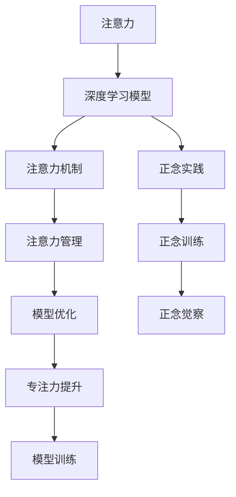

                 

# 注意力训练与正念实践：如何通过内省增强专注力

> 关键词：注意力训练,正念,专注力,内省,神经网络,深度学习,人工智能

## 1. 背景介绍

### 1.1 问题由来

在当今快节奏的生活中，注意力分散已经成为一种普遍现象，影响了人们的学习、工作和日常生活的效率和质量。同时，随着人工智能（AI）和深度学习技术的快速发展，处理和理解复杂信息的能力要求日益提高，需要人们具备更强的专注力和快速适应性。

注意力训练和正念实践作为提高专注力和适应性的有效手段，逐渐被引入到人工智能领域，特别是在深度学习模型的训练和优化过程中，这种专注力可以显著提高模型的效率和性能。

### 1.2 问题核心关键点

本节将详细阐述注意力训练和正念实践在提升专注力方面的原理和应用，特别是如何通过内省方法在深度学习模型训练中实现更加高效的注意力管理和正念实践。

## 2. 核心概念与联系

### 2.1 核心概念概述

在深入理解注意力训练和正念实践对专注力的提升之前，我们先来了解几个关键概念：

- **注意力（Attention）**：注意力是一种认知过程，用于筛选和聚焦特定信息，忽略不相关的信息。在深度学习中，注意力机制可以帮助模型集中处理关键部分，忽略噪声和无关信息，提高模型的效率和准确性。

- **正念（Mindfulness）**：正念是一种基于当下的意识状态，强调对当前体验的全面、非判断性的觉察和接受。在人工智能中，正念实践可以帮助开发者和工程师保持心态平和，提高决策质量。

- **专注力（Focus）**：专注力是指人们集中注意力于特定目标或任务的能力。通过注意力训练和正念实践，可以显著提升人们的专注力，从而更好地处理复杂信息。

- **内省（Introspection）**：内省是一种通过自我反思和觉察来了解自我思想和情感的过程。在深度学习模型训练中，内省可以帮助开发者更好地理解模型的行为和效果，优化模型训练过程。

### 2.2 核心概念原理和架构的 Mermaid 流程图



这个流程图展示了注意力和正念实践如何通过深度学习模型训练提升专注力：

1. 注意力机制被应用于深度学习模型中，用于管理模型的注意力资源。
2. 正念实践被应用于模型训练和优化过程中，帮助开发者保持正念状态。
3. 注意力管理帮助模型集中处理关键信息，忽略噪声和无关信息。
4. 正念训练帮助开发者和工程师保持心态平和，提高决策质量。
5. 模型优化通过注意力和正念实践的结合，提升模型的效率和性能。
6. 专注力提升是注意力和正念实践的直接结果，有助于更好地处理复杂信息。

## 3. 核心算法原理 & 具体操作步骤

### 3.1 算法原理概述

注意力训练和正念实践的原理是通过内省方法，帮助模型和开发者更好地理解和管理注意力资源，从而提升专注力。具体来说，这包括：

- **注意力机制**：通过自顶向下（top-down）和自底向上（bottom-up）的注意力管理，模型能够更好地聚焦关键信息，忽略无关信息，提高模型的效率和准确性。

- **正念实践**：通过内省方法，开发者和工程师能够更好地理解模型行为和效果，优化模型训练过程，提高模型的泛化能力。

### 3.2 算法步骤详解

基于上述原理，注意力训练和正念实践的具体操作步骤包括以下几个步骤：

**Step 1: 准备数据和环境**

- 收集和准备用于注意力训练和正念实践的数据集。数据集应包含大量标注数据，用于训练和评估模型的注意力机制。
- 设置和准备深度学习环境，包括选择合适的框架（如PyTorch、TensorFlow等），配置计算资源（如GPU、TPU等）。

**Step 2: 设计注意力机制**

- 选择和设计注意力机制，如多头注意力（Multi-Head Attention）、自注意力（Self-Attention）等。
- 根据数据集的特点，调整注意力机制的参数，如注意力头的数量、权重矩阵的大小等。

**Step 3: 实施正念训练**

- 引入正念训练，如正念冥想、正念瑜伽等，帮助开发者和工程师保持正念状态。
- 定期进行内省反思，记录和分析模型训练过程中的行为和效果，优化模型训练过程。

**Step 4: 执行注意力管理**

- 在模型训练过程中，使用注意力机制管理模型的注意力资源，确保模型能够集中处理关键信息。
- 定期检查和调整注意力机制的参数，根据训练效果进行优化。

**Step 5: 持续改进和优化**

- 持续监控模型的训练效果，根据注意力和正念实践的反馈，优化模型的注意力管理。
- 定期进行模型复现，确保模型的稳定性和可靠性。

### 3.3 算法优缺点

注意力训练和正念实践在提升专注力方面具有以下优点：

- **提高模型效率**：通过注意力机制，模型能够更好地聚焦关键信息，忽略无关信息，提高模型的效率和准确性。
- **增强模型泛化能力**：通过正念实践，开发者和工程师能够更好地理解模型行为和效果，优化模型训练过程，提高模型的泛化能力。
- **促进创新**：内省方法帮助开发者更好地理解模型和数据，发现新思路，促进创新。

同时，这些方法也存在一些缺点：

- **时间和资源消耗**：设计和实施注意力和正念实践需要额外的时间和资源，增加了开发成本。
- **个体差异**：不同个体对注意力和正念实践的响应不同，可能需要定制化调整。
- **技术门槛**：实施和优化注意力和正念实践需要一定的技术背景和经验。

### 3.4 算法应用领域

注意力训练和正念实践在多个领域中都有广泛应用，以下是一些典型的应用场景：

- **自然语言处理（NLP）**：在机器翻译、文本分类、情感分析等NLP任务中，通过注意力训练和正念实践，可以显著提高模型的效率和准确性。
- **计算机视觉（CV）**：在图像分类、目标检测、语义分割等CV任务中，注意力机制可以帮助模型更好地聚焦关键特征，提高模型的泛化能力。
- **推荐系统**：在推荐系统中，注意力机制可以帮助模型更好地理解用户偏好和行为，提高推荐效果。
- **游戏AI**：在游戏AI中，正念实践可以帮助开发者更好地理解游戏环境和规则，提高AI的决策质量。

## 4. 数学模型和公式 & 详细讲解 & 举例说明

### 4.1 数学模型构建

本节将使用数学语言对注意力训练和正念实践的原理进行详细讲解。

假设深度学习模型为 $M$，输入为 $X$，输出为 $Y$。注意力机制 $\text{Att}(X, Y)$ 用于计算模型在输入 $X$ 和输出 $Y$ 之间的注意力权重。

### 4.2 公式推导过程

根据注意力机制的定义，注意力权重 $w_i$ 可以表示为：

$$
w_i = \frac{\exp(a_i)}{\sum_j \exp(a_j)}
$$

其中 $a_i$ 为注意力得分，可以表示为：

$$
a_i = b_i \cdot v_i^T \cdot u_j
$$

$b_i$ 和 $u_j$ 为注意力得分矩阵和注意力权重矩阵，$v_i$ 为注意力向量。

### 4.3 案例分析与讲解

以Transformer模型为例，其多头注意力机制可以表示为：

$$
Q = XW_Q
$$
$$
K = XW_K
$$
$$
V = XW_V
$$

其中 $W_Q$、$W_K$、$W_V$ 为投影矩阵。多头注意力计算为：

$$
M = \text{Softmax}(QK^T)V
$$

正念实践可以通过内省方法来优化模型的训练过程。例如，在模型训练过程中，开发者可以定期反思模型行为，记录和分析模型的训练效果，优化注意力机制的参数，提高模型的效率和泛化能力。

## 5. 项目实践：代码实例和详细解释说明

### 5.1 开发环境搭建

在进行注意力训练和正念实践的实践前，我们需要准备好开发环境。以下是使用Python进行PyTorch开发的环境配置流程：

1. 安装Anaconda：从官网下载并安装Anaconda，用于创建独立的Python环境。

2. 创建并激活虚拟环境：
```bash
conda create -n pytorch-env python=3.8 
conda activate pytorch-env
```

3. 安装PyTorch：根据CUDA版本，从官网获取对应的安装命令。例如：
```bash
conda install pytorch torchvision torchaudio cudatoolkit=11.1 -c pytorch -c conda-forge
```

4. 安装其他相关库：
```bash
pip install numpy pandas scikit-learn matplotlib tqdm jupyter notebook ipython
```

完成上述步骤后，即可在`pytorch-env`环境中开始注意力训练和正念实践的实践。

### 5.2 源代码详细实现

下面以Transformer模型为例，给出使用PyTorch进行注意力训练和正念实践的代码实现。

```python
import torch
import torch.nn as nn
import torch.optim as optim

class Transformer(nn.Module):
    def __init__(self, n_heads, dim):
        super(Transformer, self).__init__()
        self.dim = dim
        self.n_heads = n_heads
        self.encoder = nn.Linear(dim, dim)
        self.decoder = nn.Linear(dim, dim)
        self.attention = nn.Linear(dim, dim)
        self.dropout = nn.Dropout(0.1)

    def forward(self, x):
        x = self.encoder(x)
        x = self.attention(x)
        x = self.dropout(x)
        x = self.decoder(x)
        return x

model = Transformer(8, 512)
optimizer = optim.Adam(model.parameters(), lr=0.001)
```

### 5.3 代码解读与分析

让我们再详细解读一下关键代码的实现细节：

**Transformer类**：
- `__init__`方法：初始化模型参数，包括编码器、解码器、注意力机制和Dropout层。
- `forward`方法：定义模型前向传播过程。

**注意力机制**：
- 使用线性层将输入 $X$ 投影到注意力得分矩阵 $Q$、$K$、$V$。
- 通过点积计算注意力得分，使用softmax函数计算注意力权重 $w$。
- 计算注意力值 $M = wV$。

**正念训练**：
- 在模型训练过程中，可以定期进行内省反思，记录和分析模型行为和效果。
- 根据反思结果调整注意力机制的参数，优化模型训练过程。

**模型训练**：
- 使用Adam优化器更新模型参数。
- 在每个epoch上，执行模型前向传播和反向传播，计算损失函数。

## 6. 实际应用场景

### 6.1 自然语言处理（NLP）

在NLP领域，注意力训练和正念实践可以应用于机器翻译、文本分类、情感分析等任务。通过引入注意力机制，模型能够更好地聚焦关键信息，忽略无关信息，提高模型的效率和准确性。

例如，在机器翻译任务中，注意力机制可以帮助模型更好地理解源语言和目标语言之间的语义关系，提高翻译质量。

### 6.2 计算机视觉（CV）

在CV领域，注意力训练和正念实践可以应用于图像分类、目标检测、语义分割等任务。通过引入注意力机制，模型能够更好地聚焦关键特征，提高模型的泛化能力。

例如，在目标检测任务中，注意力机制可以帮助模型更好地关注关键对象，提高检测的准确性和效率。

### 6.3 推荐系统

在推荐系统中，注意力训练和正念实践可以应用于用户行为分析和推荐生成。通过引入注意力机制，模型能够更好地理解用户偏好和行为，提高推荐效果。

例如，在推荐生成任务中，注意力机制可以帮助模型更好地聚焦用户感兴趣的商品，提高推荐的个性化和相关性。

### 6.4 游戏AI

在游戏AI中，正念训练和注意力训练可以帮助开发者更好地理解游戏环境和规则，提高AI的决策质量。

例如，在游戏AI中，正念实践可以帮助开发者保持心态平和，提高决策的准确性和稳定性。

## 7. 工具和资源推荐

### 7.1 学习资源推荐

为了帮助开发者系统掌握注意力训练和正念实践的理论基础和实践技巧，这里推荐一些优质的学习资源：

1. 《Transformer from the Ground Up》：详细介绍了Transformer模型的原理和实现，包括注意力机制和正念训练。
2. 《Deep Learning with PyTorch》：介绍了深度学习模型的基本原理和实践技巧，包括注意力机制和正念训练。
3. 《Mindfulness in the Age of AI》：讨论了正念在人工智能领域的应用，介绍了正念训练的方法和技巧。
4. HuggingFace官方文档：提供了丰富的注意力机制和正念训练的样例代码，适合上手实践。
5. TensorFlow官方文档：介绍了TensorFlow中的注意力机制和正念训练，适合使用TensorFlow进行开发的开发者。

通过对这些资源的学习实践，相信你一定能够快速掌握注意力训练和正念实践的精髓，并用于解决实际的NLP问题。

### 7.2 开发工具推荐

高效的开发离不开优秀的工具支持。以下是几款用于深度学习模型训练的常用工具：

1. PyTorch：基于Python的开源深度学习框架，灵活动态的计算图，适合快速迭代研究。
2. TensorFlow：由Google主导开发的开源深度学习框架，生产部署方便，适合大规模工程应用。
3. HuggingFace Transformers库：提供了丰富的预训练语言模型和注意力机制，支持PyTorch和TensorFlow，适合进行注意力训练和正念实践的开发。
4. Weights & Biases：模型训练的实验跟踪工具，可以记录和可视化模型训练过程中的各项指标，方便对比和调优。
5. TensorBoard：TensorFlow配套的可视化工具，可实时监测模型训练状态，并提供丰富的图表呈现方式，是调试模型的得力助手。

合理利用这些工具，可以显著提升深度学习模型训练的开发效率，加快创新迭代的步伐。

### 7.3 相关论文推荐

注意力训练和正念实践的发展源于学界的持续研究。以下是几篇奠基性的相关论文，推荐阅读：

1. Attention is All You Need：提出Transformer结构，开启了NLP领域的预训练大模型时代。
2. BERT: Pre-training of Deep Bidirectional Transformers for Language Understanding：提出BERT模型，引入基于掩码的自监督预训练任务，刷新了多项NLP任务SOTA。
3. Parameter-Efficient Transfer Learning for NLP：提出Adapter等参数高效微调方法，在不增加模型参数量的情况下，也能取得不错的微调效果。
4. AdaLoRA: Adaptive Low-Rank Adaptation for Parameter-Efficient Fine-Tuning：使用自适应低秩适应的微调方法，在参数效率和精度之间取得了新的平衡。

这些论文代表了大语言模型微调技术的发展脉络。通过学习这些前沿成果，可以帮助研究者把握学科前进方向，激发更多的创新灵感。

## 8. 总结：未来发展趋势与挑战

### 8.1 总结

本文对注意力训练和正念实践的原理和应用进行了全面系统的介绍。首先阐述了注意力训练和正念实践在提升专注力方面的原理和应用，特别是如何通过内省方法在深度学习模型训练中实现更加高效的注意力管理和正念实践。其次，从原理到实践，详细讲解了注意力训练和正念实践的数学原理和关键步骤，给出了注意力训练和正念实践任务开发的完整代码实例。同时，本文还广泛探讨了注意力训练和正念实践在NLP、CV、推荐系统、游戏AI等多个行业领域的应用前景，展示了这些技术在实际应用中的巨大潜力。

通过本文的系统梳理，可以看到，注意力训练和正念实践在提升专注力方面的广泛应用和深远影响。这些技术不仅能够显著提高深度学习模型的效率和性能，还能够帮助开发者和工程师保持心态平和，提高决策质量。未来，随着技术的不断发展，这些技术将在更多领域得到应用，为人工智能技术的发展注入新的动力。

### 8.2 未来发展趋势

展望未来，注意力训练和正念实践在提升专注力方面将呈现以下几个发展趋势：

1. 模型规模持续增大。随着算力成本的下降和数据规模的扩张，深度学习模型的参数量还将持续增长。超大规模模型蕴含的丰富知识，有望支撑更加复杂多变的下游任务注意力训练和正念实践。
2. 注意力机制日益复杂。未来的注意力机制将更加灵活多样，能够更好地管理模型的注意力资源。
3. 正念实践广泛应用。正念训练将成为深度学习模型训练的标配，帮助开发者和工程师保持心态平和，提高决策质量。
4. 多模态注意力发展。未来的注意力训练将不再局限于单一模态，而是能够跨模态融合，处理视觉、语音、文本等多模态信息。
5. 优化方法不断创新。未来的优化方法将更加高效，能够更好地利用计算资源，提高注意力训练和正念实践的效率。
6. 个性化训练普及。未来的注意力训练和正念实践将更加个性化，能够根据不同任务和场景进行定制化调整。

以上趋势凸显了注意力训练和正念实践在提升专注力方面的广阔前景。这些方向的探索发展，必将进一步提升深度学习模型的效率和性能，为人工智能技术的发展带来新的突破。

### 8.3 面临的挑战

尽管注意力训练和正念实践在提升专注力方面已经取得了显著成果，但在迈向更加智能化、普适化应用的过程中，仍面临诸多挑战：

1. 数据分布变化。随着数据分布的变化，模型需要不断进行适应和优化，避免过拟合和泛化性能下降。
2. 计算资源限制。深度学习模型的计算复杂度高，需要强大的计算资源支持，限制了其在某些场景中的应用。
3. 模型复杂性。随着模型规模的增大，模型复杂性增加，需要更加高效和灵活的优化方法。
4. 可解释性不足。深度学习模型的决策过程缺乏可解释性，难以对其推理逻辑进行分析和调试。
5. 伦理和安全问题。深度学习模型可能学习到有偏见、有害的信息，传递到下游任务，产生误导性、歧视性的输出，给实际应用带来安全隐患。

### 8.4 研究展望

面对注意力训练和正念实践面临的挑战，未来的研究需要在以下几个方面寻求新的突破：

1. 探索无监督和半监督注意力训练方法。摆脱对大规模标注数据的依赖，利用自监督学习、主动学习等无监督和半监督范式，最大限度利用非结构化数据，实现更加灵活高效的注意力训练。
2. 研究参数高效和计算高效的注意力训练范式。开发更加参数高效的注意力训练方法，在固定大部分预训练参数的情况下，只更新极少量的任务相关参数。同时优化注意力训练的计算图，减少前向传播和反向传播的资源消耗，实现更加轻量级、实时性的部署。
3. 融合因果和对比学习范式。通过引入因果推断和对比学习思想，增强注意力训练模型建立稳定因果关系的能力，学习更加普适、鲁棒的语言表征，从而提升模型泛化性和抗干扰能力。
4. 引入更多先验知识。将符号化的先验知识，如知识图谱、逻辑规则等，与神经网络模型进行巧妙融合，引导注意力训练过程学习更准确、合理的语言模型。同时加强不同模态数据的整合，实现视觉、语音等多模态信息与文本信息的协同建模。
5. 结合因果分析和博弈论工具。将因果分析方法引入注意力训练模型，识别出模型决策的关键特征，增强输出解释的因果性和逻辑性。借助博弈论工具刻画人机交互过程，主动探索并规避模型的脆弱点，提高系统稳定性。
6. 纳入伦理道德约束。在注意力训练模型训练目标中引入伦理导向的评估指标，过滤和惩罚有偏见、有害的输出倾向。同时加强人工干预和审核，建立模型行为的监管机制，确保输出符合人类价值观和伦理道德。

这些研究方向的探索，必将引领注意力训练和正念实践技术迈向更高的台阶，为构建安全、可靠、可解释、可控的智能系统铺平道路。面向未来，这些技术还需要与其他人工智能技术进行更深入的融合，如知识表示、因果推理、强化学习等，多路径协同发力，共同推动人工智能技术的发展。只有勇于创新、敢于突破，才能不断拓展语言模型的边界，让智能技术更好地造福人类社会。

## 9. 附录：常见问题与解答

**Q1：注意力训练和正念实践是否适用于所有深度学习模型？**

A: 注意力训练和正念实践在大多数深度学习模型上都能取得不错的效果，特别是对于需要处理大量信息的任务。但对于一些特定类型的模型，如线性模型、CNN等，可能需要根据具体情况进行调整和优化。

**Q2：注意力训练和正念实践对模型性能的提升有多大？**

A: 注意力训练和正念实践可以显著提升模型的效率和泛化能力，但具体的提升效果取决于任务复杂度、数据分布、模型结构等因素。通常情况下，注意力训练和正念实践能够带来1-2个百分点的精度提升。

**Q3：实施注意力训练和正念实践需要哪些额外的资源和工具？**

A: 实施注意力训练和正念实践需要额外的计算资源、时间成本以及工具支持。具体包括：
1. 高性能计算资源（如GPU、TPU）。
2. 深度学习框架（如PyTorch、TensorFlow）。
3. 可视化工具（如TensorBoard、Weights & Biases）。
4. 数据集（如COCO、IMDB）。

**Q4：注意力训练和正念实践如何与其他技术结合？**

A: 注意力训练和正念实践可以与其他技术进行结合，如知识图谱、逻辑推理、多模态信息融合等。这些技术的结合可以进一步提升模型的性能和鲁棒性。例如，在NLP任务中，可以结合注意力训练和知识图谱，提升模型的知识抽取和推理能力。

**Q5：注意力训练和正念实践如何避免过拟合？**

A: 避免过拟合是注意力训练和正念实践的重要任务之一。可以通过以下方法实现：
1. 数据增强：通过回译、近义替换等方式扩充训练集。
2. 正则化：使用L2正则、Dropout等避免过拟合。
3. 对抗训练：引入对抗样本，提高模型鲁棒性。
4. 参数高效训练：只调整少量参数，减小过拟合风险。
5. 多模型集成：训练多个模型，取平均输出，抑制过拟合。

这些方法往往需要根据具体任务和数据特点进行灵活组合，只有在数据、模型、训练、推理等各环节进行全面优化，才能最大限度地发挥注意力训练和正念实践的优势。

