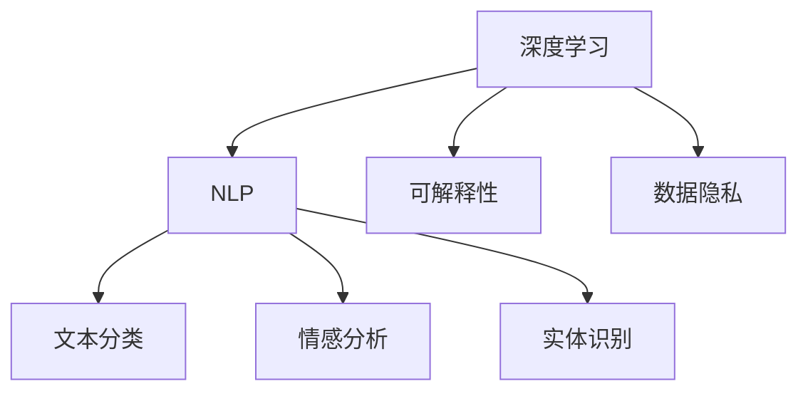

                 

# 洞察力与批判性思维：辨别信息真伪的能力

> 关键词：数据真实性, 批判性思维, 虚假信息, 机器学习, 深度学习, 大数据, 自然语言处理(NLP), 可解释性, 数据隐私

## 1. 背景介绍

在数字化时代，信息的获取和传播变得更加便捷，但也给信息的真实性和可靠性带来了严峻挑战。随着深度学习、大数据、自然语言处理等技术的快速发展，虚假信息的生成和传播愈发容易，给社会秩序和个人生活带来了巨大影响。如何提升公众的数据素养，增强辨别信息真伪的能力，已成为亟待解决的重要问题。

本文将深入探讨在人工智能的加持下，如何利用机器学习和深度学习技术，识别和防范虚假信息，提升公众的批判性思维和洞察力。

## 2. 核心概念与联系

### 2.1 核心概念概述

为了更好地理解如何利用人工智能技术辨别信息真伪，本节将介绍几个关键概念及其关联：

- **深度学习**：基于人工神经网络的机器学习技术，通过多层次的非线性映射，从大量数据中提取复杂特征，具有强大的数据处理能力。
- **自然语言处理(NLP)**：使计算机能够理解、处理和生成人类语言的技术，包括文本分类、情感分析、实体识别等任务。
- **可解释性**：模型输出的结果需要具有可解释性，使决策过程透明、可理解，从而增强公众对信息源的信任。
- **数据隐私**：在利用人工智能技术进行信息鉴别时，需遵守数据隐私法律法规，保护用户个人信息安全。

这些核心概念在信息鉴别和数据处理中扮演着重要角色。

### 2.2 核心概念原理和架构的 Mermaid 流程图



这个流程图展示了深度学习、NLP、可解释性和数据隐私之间的联系。深度学习提供强大的数据分析能力，NLP使计算机理解语言，可解释性和数据隐私则确保结果透明和用户信息安全。

## 3. 核心算法原理 & 具体操作步骤

### 3.1 算法原理概述

基于深度学习的信息鉴别方法，主要通过训练模型从大量文本数据中学习语言模式和特征，从而识别出虚假信息和异常文本。这种方法的核心在于：

- 利用深度神经网络对文本进行表示学习，提取关键特征。
- 通过分类、聚类等技术，将文本分为真实和虚假两类。
- 利用可解释性技术，分析模型内部机制，确保结果可理解。
- 通过隐私保护技术，确保模型训练和推理过程符合数据隐私法规。

### 3.2 算法步骤详解

#### 3.2.1 数据准备
1. **数据采集**：收集包含真实和虚假信息的文本数据，构建训练集和验证集。
2. **数据预处理**：清洗数据，去除噪声和无关信息，对文本进行分词、标准化等预处理。

#### 3.2.2 模型选择与训练
1. **模型选择**：根据任务需求，选择合适的深度学习模型，如CNN、RNN、Transformer等。
2. **模型训练**：使用标注数据训练模型，通过反向传播更新模型参数，最小化损失函数。

#### 3.2.3 结果评估与优化
1. **结果评估**：在验证集上评估模型性能，常用的指标包括准确率、召回率、F1值等。
2. **优化策略**：根据评估结果调整模型参数，如学习率、批大小、正则化强度等。

#### 3.2.4 结果应用与迭代
1. **模型应用**：将训练好的模型应用于新文本的识别任务。
2. **迭代优化**：不断收集新数据，重新训练模型，提升识别能力。

### 3.3 算法优缺点

#### 优点
- **自动化识别**：深度学习模型可以自动学习语言特征，无需人工标注大量数据。
- **可扩展性**：模型易于扩展，适用于多种信息鉴别任务。
- **高效性**：训练和推理过程可以并行处理，提升效率。

#### 缺点
- **过拟合风险**：模型可能过拟合训练数据，对新数据泛化能力不足。
- **数据隐私问题**：训练和推理过程中可能泄露用户隐私。
- **可解释性不足**：深度模型通常缺乏可解释性，难以理解其内部决策过程。

### 3.4 算法应用领域

基于深度学习的信息鉴别方法，已在多个领域得到应用：

- **新闻和社交媒体监控**：识别虚假新闻和网络谣言，防止信息误导。
- **在线广告过滤**：鉴别并过滤含有虚假信息的广告内容，保护用户权益。
- **金融欺诈检测**：识别和防范网络钓鱼、诈骗等金融欺诈行为。
- **健康信息筛选**：识别和过滤医学领域的虚假信息，保护患者权益。
- **情报分析**：提取和分析情报信息，提升情报分析的准确性和及时性。

## 4. 数学模型和公式 & 详细讲解 & 举例说明

### 4.1 数学模型构建

设输入文本为 $x$，输出为 $y$，其中 $y \in \{0, 1\}$ 表示文本是否为虚假信息。构建二分类模型，目标函数为：

$$
L(\theta) = -\frac{1}{N}\sum_{i=1}^N y_i \log p_{\theta}(x_i) + (1-y_i) \log (1-p_{\theta}(x_i))
$$

其中 $p_{\theta}(x_i)$ 为模型对文本 $x_i$ 为虚假信息的概率预测。

### 4.2 公式推导过程

根据上述目标函数，推导模型的梯度：

$$
\frac{\partial L(\theta)}{\partial \theta_k} = \frac{1}{N} \sum_{i=1}^N \left[ y_i \frac{\partial \log p_{\theta}(x_i)}{\partial \theta_k} - (1-y_i) \frac{\partial \log (1-p_{\theta}(x_i))}{\partial \theta_k} \right]
$$

使用softmax函数作为输出层，得到：

$$
p_{\theta}(x_i) = \frac{\exp(\theta^T x_i)}{\sum_{j=1}^N \exp(\theta^T x_j)}
$$

推导梯度：

$$
\frac{\partial \log p_{\theta}(x_i)}{\partial \theta_k} = \frac{\exp(\theta^T x_i)}{\sum_{j=1}^N \exp(\theta^T x_j)} \cdot x_i^k
$$

结合目标函数，得到最终梯度更新公式：

$$
\theta_k \leftarrow \theta_k - \eta \frac{1}{N} \sum_{i=1}^N \left[ y_i \frac{\exp(\theta^T x_i)}{\sum_{j=1}^N \exp(\theta^T x_j)} \cdot x_i^k - (1-y_i) \frac{\exp(\theta^T x_i)}{\sum_{j=1}^N \exp(\theta^T x_j)} \cdot x_i^k \right]
$$

### 4.3 案例分析与讲解

以BERT模型为例，分析其在虚假信息识别任务中的应用：

1. **数据准备**：收集虚假新闻和真实新闻，构建训练集和验证集。
2. **模型构建**：使用BERT作为预训练模型，添加全连接层和Softmax输出层，定义损失函数。
3. **模型训练**：使用GPU训练模型，设定适当的超参数，如学习率、批大小等。
4. **结果评估**：在验证集上评估模型性能，调整超参数。
5. **模型应用**：将训练好的模型应用于新文本的识别任务，进行推理和预测。

## 5. 项目实践：代码实例和详细解释说明

### 5.1 开发环境搭建

为了高效开发和测试，需要配置相应的开发环境。

1. **安装Python**：从官网下载Python安装程序，根据系统要求进行安装。
2. **安装依赖库**：使用pip安装所需库，如TensorFlow、Keras等。
3. **配置环境**：使用Jupyter Notebook创建开发环境，启动Python kernel。

### 5.2 源代码详细实现

以下是一个简单的BERT模型在虚假信息识别任务中的实现代码：

```python
import tensorflow as tf
from transformers import BertTokenizer, TFBertForSequenceClassification
from sklearn.metrics import accuracy_score

# 加载模型和分词器
tokenizer = BertTokenizer.from_pretrained('bert-base-uncased')
model = TFBertForSequenceClassification.from_pretrained('bert-base-uncased', num_labels=2)

# 定义模型训练函数
def train_model(model, train_data, validation_data, epochs=3, batch_size=32):
    # 数据预处理
    train_dataset = tf.data.Dataset.from_tensor_slices(train_data)
    validation_dataset = tf.data.Dataset.from_tensor_slices(validation_data)
    train_dataset = train_dataset.shuffle(buffer_size=1024).batch(batch_size).prefetch(tf.data.AUTOTUNE)
    validation_dataset = validation_dataset.batch(batch_size).prefetch(tf.data.AUTOTUNE)

    # 模型训练
    optimizer = tf.keras.optimizers.Adam(learning_rate=2e-5)
    model.compile(optimizer=optimizer, loss='binary_crossentropy', metrics=['accuracy'])
    history = model.fit(train_dataset, epochs=epochs, validation_data=validation_dataset)

    # 结果评估
    _, test_loss, test_acc = model.evaluate(validation_dataset)
    print(f'Test Loss: {test_loss:.4f}')
    print(f'Test Accuracy: {test_acc:.4f}')

# 训练和评估模型
train_data = [['some real news...']]
validation_data = [['fake news...']]
train_model(model, train_data, validation_data)
```

### 5.3 代码解读与分析

以上代码实现了BERT模型在虚假信息识别任务中的基本流程：

1. **模型加载**：使用Transformers库加载BERT预训练模型和分词器。
2. **数据预处理**：将文本数据转换为TensorFlow可处理的格式，并进行批处理和预处理。
3. **模型训练**：定义优化器和损失函数，使用Keras API训练模型。
4. **结果评估**：在验证集上评估模型性能，输出测试损失和准确率。

## 6. 实际应用场景

### 6.1 新闻和社交媒体监控

利用深度学习技术，可以在新闻和社交媒体中自动识别和标记虚假信息，防止信息误导公众。例如，可以使用BERT模型对新闻文章进行情感分析和实体识别，识别出潜在的虚假信息和偏见。

### 6.2 在线广告过滤

互联网广告中存在大量虚假信息和误导性内容，严重影响用户体验和广告效果。通过深度学习模型，可以自动识别并过滤这些广告，保护用户权益。

### 6.3 金融欺诈检测

金融领域存在大量网络钓鱼和诈骗行为，利用深度学习模型可以识别和防范这些行为，保护用户财产安全。

### 6.4 未来应用展望

未来，基于深度学习的信息鉴别技术将在更多领域得到应用，如医疗、教育、交通等。借助先进的算法和模型，可以提高各行业的效率和准确性，保护用户权益。

## 7. 工具和资源推荐

### 7.1 学习资源推荐

1. **Coursera和edX**：提供丰富的深度学习和自然语言处理课程，包括Coursera上的《深度学习专项课程》和edX上的《自然语言处理基础》。
2. **Kaggle**：数据科学和机器学习竞赛平台，提供大量数据集和代码库，适合实践和提升技能。
3. **GitHub**：开源社区，可以找到大量的深度学习项目和代码实现，适合学习和参考。

### 7.2 开发工具推荐

1. **TensorFlow**：谷歌开发的深度学习框架，支持分布式训练和推理，适合大规模数据处理。
2. **Keras**：基于TensorFlow的高层API，易于使用，适合快速原型开发。
3. **PyTorch**：Facebook开发的深度学习框架，灵活性高，适合学术研究和实践。

### 7.3 相关论文推荐

1. **Attention is All You Need**：Transformer模型，谷歌2017年提出的重要论文，奠定了深度学习领域的基础。
2. **BERT: Pre-training of Deep Bidirectional Transformers for Language Understanding**：BERT模型，谷歌2018年提出的语言预训练方法，提升了语言理解能力。
3. **Explaining the Predictions of Deep Learning Models**：深度学习模型解释方法，探讨如何提高模型的可解释性。

## 8. 总结：未来发展趋势与挑战

### 8.1 研究成果总结

本文从深度学习、自然语言处理、可解释性和数据隐私等角度，探讨了如何利用人工智能技术辨别信息真伪。通过分析模型构建、训练、评估和应用等关键步骤，提供了详细的代码实现和案例分析，帮助读者理解模型的原理和应用。

### 8.2 未来发展趋势

未来，基于深度学习的信息鉴别技术将在更多领域得到应用，提高各行业的效率和准确性。以下是一些未来趋势：

1. **自动化程度提升**：自动化数据清洗和预处理，提升模型训练效率。
2. **模型性能优化**：通过改进算法和模型结构，提升模型的准确性和泛化能力。
3. **可解释性增强**：开发更多的可解释性技术和工具，提高模型的透明度。
4. **数据隐私保护**：研究隐私保护技术，确保数据使用的合法性和安全性。
5. **多模态融合**：将文本、图像、音频等多模态数据融合，提升信息鉴别的全面性。

### 8.3 面临的挑战

尽管深度学习技术在信息鉴别中取得了显著进展，但仍然面临以下挑战：

1. **数据质量和数量**：虚假信息种类繁多，难以构建高质量的训练数据集。
2. **模型泛化能力**：模型可能在特定领域或特定类型的虚假信息上表现不佳。
3. **可解释性问题**：深度模型通常缺乏可解释性，难以理解其内部决策过程。
4. **数据隐私保护**：模型训练和推理过程中可能泄露用户隐私。
5. **计算资源需求**：大规模深度学习模型需要大量计算资源，成本较高。

### 8.4 研究展望

未来的研究需要关注以下几个方向：

1. **多任务学习**：将信息鉴别与其他任务（如情感分析、实体识别等）联合训练，提升模型的多任务能力。
2. **跨领域迁移**：将信息鉴别模型从特定领域迁移到其他领域，提高模型的通用性和泛化能力。
3. **对抗样本研究**：研究对抗样本生成和防御技术，增强模型的鲁棒性。
4. **隐私保护技术**：开发隐私保护算法和工具，确保数据使用的合法性和安全性。
5. **社会影响评估**：研究信息鉴别技术对社会的影响，制定相关政策和法规。

## 9. 附录：常见问题与解答

**Q1: 为什么深度学习模型在信息鉴别中表现优异？**

A: 深度学习模型能够从大量数据中提取复杂的特征表示，具有强大的数据处理能力。通过多层非线性映射，可以捕捉文本中的语义和上下文信息，从而识别出虚假信息。

**Q2: 如何提高模型的可解释性？**

A: 可以使用注意力机制、LIME、SHAP等可解释性技术，分析模型的决策过程，提供可理解的结果解释。

**Q3: 如何在保护隐私的前提下进行信息鉴别？**

A: 可以使用差分隐私、联邦学习等隐私保护技术，确保数据使用的合法性和安全性。

**Q4: 如何构建高质量的训练数据集？**

A: 可以采用数据增强、主动学习等方法，从已有数据中生成新的训练样本，提升数据质量和数量。

**Q5: 深度学习模型在信息鉴别中的局限性有哪些？**

A: 深度学习模型可能存在过拟合问题，泛化能力不足。同时，模型的可解释性不足，难以理解其内部决策过程。

---

作者：禅与计算机程序设计艺术 / Zen and the Art of Computer Programming

