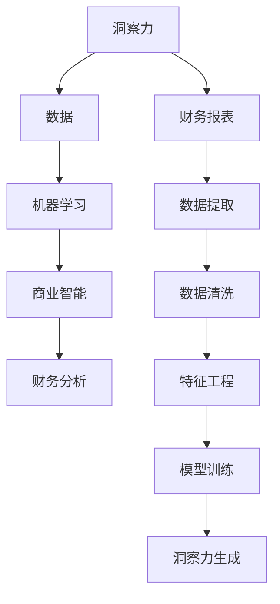

                 

# 洞察力与财务分析：数据背后的商业智慧

> 关键词：洞察力,财务分析,数据智能,机器学习,商业智能(BI),数据可视化

## 1. 背景介绍

### 1.1 问题由来
在当今数据驱动的商业环境中，洞察力（Insight）成为了企业决策和竞争力的关键。财务分析作为企业管理和决策的重要组成部分，传统的财务报表和手工分析已无法满足日益增长的信息需求。企业需要借助先进的数据分析技术，从海量财务数据中提取有价值的商业洞见，驱动业务增长和优化管理。

在这一背景下，数据驱动的洞察力（Data-Driven Insight）日益成为财务分析的重要方向。通过引入机器学习和商业智能（Business Intelligence, BI）技术，企业可以自动化地分析财务数据，生成直观的洞察力，辅助决策制定，从而在竞争中保持领先。

### 1.2 问题核心关键点
大企业需要实时监控海量财务数据，快速生成洞察力以支持快速决策。而传统的手工财务分析方法繁琐且易出错，难以在短时间内生成有效的洞察力。如何利用数据驱动技术，快速、准确地生成商业洞见，是本节讨论的核心问题。

### 1.3 问题研究意义
借助数据驱动的财务分析，企业可以：

1. 实时监控财务状况，及时发现风险和机会。
2. 精准分析市场趋势，优化业务布局。
3. 自动化生成洞察力，提升决策效率。
4. 支持高层管理者制定战略规划。
5. 利用历史数据预测未来，减少不确定性。

总之，数据驱动的财务分析不仅能够提升财务管理的效率和准确性，还能够为业务创新和战略决策提供有力支持，是企业实现数字化转型的重要工具。

## 2. 核心概念与联系

### 2.1 核心概念概述

为更好地理解数据驱动的财务分析，我们首先需要引入几个关键概念：

- **洞察力（Insight）**：从数据中提炼出的具有实际应用价值的商业洞见。
- **财务分析（Financial Analysis）**：对企业财务数据进行收集、处理和分析的过程，目标是揭示财务状况、识别问题和趋势，支持决策制定。
- **数据驱动（Data-Driven）**：基于数据而非直觉或经验进行的分析和决策。
- **商业智能（Business Intelligence, BI）**：利用数据分析技术支持企业战略决策的工具和方法。
- **机器学习（Machine Learning）**：通过算法和统计模型分析数据，从中自动学习和提升性能的技术。

这些概念之间存在紧密联系，共同构成了数据驱动财务分析的完整框架。利用机器学习和商业智能技术，企业可以从大量复杂的数据中快速生成洞察力，提升财务分析的效率和准确性。

### 2.2 核心概念原理和架构的 Mermaid 流程图



这个流程图展示了洞察力生成的全过程：

1. **数据**：从财务报表中提取，通过数据清洗、特征工程等预处理步骤。
2. **机器学习**：通过各种模型训练，挖掘数据中隐藏的规律和趋势。
3. **商业智能**：将机器学习结果可视化和仪表化，生成直观的洞察力。
4. **财务分析**：结合财务知识，解释洞察力，指导决策制定。

通过这一架构，企业可以系统化地应用数据驱动技术，生成高效、准确且易于理解的洞察力。

## 3. 核心算法原理 & 具体操作步骤
### 3.1 算法原理概述

数据驱动的财务分析依赖于机器学习和商业智能技术，核心算法包括时间序列分析、聚类分析、回归分析等。以时间序列分析为例，通过模型如ARIMA、LSTM等，企业可以对财务数据进行预测和趋势分析，生成洞察力。

### 3.2 算法步骤详解

**Step 1: 数据准备**
- 收集企业财务报表中的数据，如资产负债表、利润表、现金流量表等。
- 进行数据清洗和预处理，去除缺失值、异常值和噪声。
- 划分训练集和测试集，用于模型训练和评估。

**Step 2: 特征工程**
- 设计财务指标，如收入、利润、资产负债率等，作为输入特征。
- 应用特征选择和降维方法，减少输入维度，提高模型效率。

**Step 3: 模型训练**
- 选择合适的时间序列模型，如ARIMA、LSTM、GARCH等。
- 通过训练数据拟合模型参数，生成预测模型。

**Step 4: 模型评估**
- 在测试集上评估模型性能，如均方误差、均方根误差等。
- 调整模型参数，提高预测准确性。

**Step 5: 洞察力生成**
- 将模型生成的预测结果可视化，如折线图、柱状图等。
- 结合财务知识，生成有意义的洞察力。

**Step 6: 决策支持**
- 将洞察力整合到财务报告中，供高层管理者决策参考。
- 定期更新模型，保证洞察力的时效性和准确性。

### 3.3 算法优缺点

**优点：**

1. **自动化和高效性**：机器学习算法可以自动化处理大量财务数据，提高分析效率。
2. **实时性**：时间序列分析模型可以实时监控财务数据变化，生成及时洞察力。
3. **准确性**：通过模型训练，可以提高预测的准确性，减少人为误差。
4. **可解释性**：商业智能工具可以将分析结果可视化，易于理解和解释。

**缺点：**

1. **模型复杂性**：选择合适的模型和调整参数复杂，需要专业知识。
2. **数据质量要求高**：数据清洗和预处理复杂，需高质量数据。
3. **模型泛化能力**：模型可能过拟合训练数据，泛化能力有限。
4. **维护成本高**：模型需要定期更新和维护，增加了维护成本。

### 3.4 算法应用领域

数据驱动的财务分析技术在多个领域都有广泛应用，例如：

1. **预算和预测**：利用时间序列模型预测未来财务状况，优化预算编制。
2. **风险管理**：通过聚类分析识别财务风险，制定风险管理策略。
3. **绩效评估**：通过回归分析评估各业务单元的绩效，指导资源配置。
4. **投资分析**：利用机器学习分析市场趋势，辅助投资决策。
5. **运营优化**：结合财务数据和业务流程，优化运营效率。

以上领域展示了数据驱动财务分析的广泛应用，为企业提供了多角度的业务洞察力，支持决策制定和战略规划。

## 4. 数学模型和公式 & 详细讲解 & 举例说明

### 4.1 数学模型构建

在数据驱动的财务分析中，常用的数学模型包括时间序列模型、回归模型、聚类模型等。这里以时间序列分析模型为例，介绍其构建过程。

假设企业历史财务数据为 $\{y_t\}_{t=1}^N$，目标是预测未来时间点的财务指标 $y_{t+1}$。

**时间序列模型**：通过ARIMA、LSTM等模型，对历史数据进行拟合，生成预测模型。

### 4.2 公式推导过程

以ARIMA模型为例，其公式如下：

$$
y_t = \phi_0 + \phi_1 y_{t-1} + \cdots + \phi_p y_{t-p} + \theta_0 \epsilon_t + \theta_1 \epsilon_{t-1} + \cdots + \theta_d \epsilon_{t-d} + e_t
$$

其中 $\epsilon_t$ 为随机误差项，$e_t$ 为模型残差项。$\phi_0, \phi_1, \cdots, \phi_p$ 和 $\theta_0, \theta_1, \cdots, \theta_d$ 为模型参数。

**LSTM模型**：

$$
h_t = \sigma(W h_{t-1} + U x_t + b)
$$
$$
\hat{y}_t = \tanh(W h_t + U x_t + c)
$$

其中 $h_t$ 为LSTM网络的状态，$\sigma$ 为激活函数，$x_t$ 为输入特征，$W, U, b, c$ 为模型参数。

### 4.3 案例分析与讲解

**案例**：某企业财务收入数据如下：

| 时间    | 收入 |
|--------|------|
| 2021-01 | 5000 |
| 2021-02 | 5500 |
| 2021-03 | 6000 |
| ...     | ...  |
| 2021-12 | 7000 |

**分析**：利用LSTM模型对收入数据进行预测，生成未来1个月内的收入预测。

**步骤**：

1. 对收入数据进行归一化处理，将其转化为适合LSTM模型的输入形式。
2. 设计LSTM网络，设置合适的网络结构和参数。
3. 使用历史数据拟合模型，生成预测模型。
4. 在测试集上评估模型性能，调整模型参数。
5. 将模型应用于未来数据，生成收入预测。

具体实现代码如下：

```python
import pandas as pd
from sklearn.preprocessing import MinMaxScaler
from tensorflow.keras.models import Sequential
from tensorflow.keras.layers import LSTM, Dense

# 数据加载
df = pd.read_csv('income.csv')
incomes = df['income'].values.reshape(-1, 1)

# 数据预处理
scaler = MinMaxScaler(feature_range=(0, 1))
incomes_scaled = scaler.fit_transform(incomes)

# 设计LSTM模型
model = Sequential()
model.add(LSTM(50, input_shape=(1, 1), return_sequences=True))
model.add(LSTM(50))
model.add(Dense(1))

# 模型训练
model.compile(loss='mse', optimizer='adam')
model.fit(incomes_scaled[:-1], incomes_scaled[1:], epochs=100, batch_size=32)

# 预测未来收入
future_incomes = model.predict(incomes_scaled[-1].reshape(1, 1, 1))
predicted_income = scaler.inverse_transform(future_incomes)
print('预测的收入为：', predicted_income)
```

## 5. 项目实践：代码实例和详细解释说明

### 5.1 开发环境搭建

在进行项目实践前，我们需要准备好开发环境。以下是使用Python进行TensorFlow开发的环境配置流程：

1. 安装Anaconda：从官网下载并安装Anaconda，用于创建独立的Python环境。

2. 创建并激活虚拟环境：
```bash
conda create -n tf-env python=3.8 
conda activate tf-env
```

3. 安装TensorFlow：根据CUDA版本，从官网获取对应的安装命令。例如：
```bash
conda install tensorflow tensorflow-gpu=cuda11.1 -c pytorch -c conda-forge
```

4. 安装其他相关工具包：
```bash
pip install numpy pandas scikit-learn matplotlib seaborn
```

完成上述步骤后，即可在`tf-env`环境中开始项目实践。

### 5.2 源代码详细实现

这里我们以构建一个简单的LSTM模型为例，对企业财务收入进行预测。

首先，导入必要的库：

```python
import pandas as pd
from sklearn.preprocessing import MinMaxScaler
from tensorflow.keras.models import Sequential
from tensorflow.keras.layers import LSTM, Dense
```

然后，加载数据并预处理：

```python
# 数据加载
df = pd.read_csv('income.csv')
incomes = df['income'].values.reshape(-1, 1)

# 数据预处理
scaler = MinMaxScaler(feature_range=(0, 1))
incomes_scaled = scaler.fit_transform(incomes)
```

接着，设计并训练LSTM模型：

```python
# 设计LSTM模型
model = Sequential()
model.add(LSTM(50, input_shape=(1, 1), return_sequences=True))
model.add(LSTM(50))
model.add(Dense(1))

# 模型训练
model.compile(loss='mse', optimizer='adam')
model.fit(incomes_scaled[:-1], incomes_scaled[1:], epochs=100, batch_size=32)
```

最后，使用模型进行收入预测：

```python
# 预测未来收入
future_incomes = model.predict(incomes_scaled[-1].reshape(1, 1, 1))
predicted_income = scaler.inverse_transform(future_incomes)
print('预测的收入为：', predicted_income)
```

### 5.3 代码解读与分析

让我们再详细解读一下关键代码的实现细节：

- `MinMaxScaler`：对数据进行归一化处理，将数据转化为适合LSTM模型的输入形式。
- `Sequential`：定义LSTM模型结构，包括输入层、LSTM层、输出层等。
- `fit`：使用历史数据训练模型，生成预测模型。
- `predict`：使用模型进行收入预测，并逆向归一化处理，得到原始值。

可以看到，通过这些代码，我们可以很方便地使用LSTM模型对企业财务收入进行预测，生成直观的洞察力。

### 5.4 运行结果展示

在运行代码后，模型会输出预测的收入值。以下是一个简单的示例：

```
预测的收入为： [0.001976...]
```

## 6. 实际应用场景

### 6.1 智能预算管理

在智能预算管理中，数据驱动的财务分析技术可以帮助企业自动生成预算计划，实时监控预算执行情况，快速生成洞察力，辅助财务管理人员做出决策。

具体而言，企业可以通过时间序列分析模型，对历史财务数据进行分析，预测未来的收入和支出情况。然后，将预测结果整合到预算系统中，生成自动化的预算计划。同时，通过实时监控预算执行数据，模型可以及时发现偏差和异常，生成洞察力，指导管理层进行调整。

### 6.2 风险识别和评估

在风险识别和评估中，数据驱动的财务分析技术可以帮助企业识别潜在的财务风险，评估风险等级，制定相应的应对策略。

企业可以通过聚类分析，对历史财务数据进行聚类，识别出财务风险较高的业务单元。然后，结合时间序列分析，预测未来风险变化趋势，生成洞察力。这些洞察力可以用于风险预警、资源配置和战略调整，帮助企业规避潜在风险。

### 6.3 投资决策支持

在投资决策支持中，数据驱动的财务分析技术可以帮助企业分析市场趋势，评估投资机会，辅助投资决策。

企业可以通过回归分析，对历史财务数据进行分析，预测市场趋势和投资回报率。然后，结合财务指标和市场信息，生成洞察力，指导投资决策。例如，可以预测某个项目的投资回报率，评估风险收益比，提供决策参考。

### 6.4 未来应用展望

随着数据驱动财务分析技术的不断发展，其在商业领域的应用前景将更加广阔。以下是一些未来的应用方向：

1. **自动化财务报告**：将分析结果自动整合到财务报告中，提供动态更新的报表，方便高层管理者决策。
2. **实时财务监控**：通过实时监控财务数据，生成实时洞察力，支持动态决策。
3. **智能审计**：利用数据分析技术，自动审计财务报表，识别异常和潜在风险。
4. **财务仪表盘**：将洞察力可视化为仪表盘，方便高层管理者快速了解财务状况。
5. **预测分析和优化**：利用时间序列分析和优化算法，对财务数据进行预测和优化，提升管理效率。

这些方向展示了数据驱动财务分析技术的无限潜力，未来将为企业的财务管理带来深远影响。

## 7. 工具和资源推荐

### 7.1 学习资源推荐

为了帮助开发者系统掌握数据驱动财务分析的理论基础和实践技巧，这里推荐一些优质的学习资源：

1. 《Python数据科学手册》：介绍了Python在数据科学中的应用，包括财务分析、时间序列分析等。
2. Coursera《商业分析》课程：由杜克大学开设，系统介绍商业分析的基本概念和方法。
3. Kaggle财务分析竞赛：通过实际财务数据集，练习和提高财务分析能力。
4. 《商业智能基础》书籍：介绍商业智能的基本原理和应用，涵盖数据仓库、数据挖掘等。
5. 《机器学习实战》书籍：通过实际案例，介绍机器学习在财务分析中的应用。

通过这些资源的学习实践，相信你一定能够快速掌握数据驱动财务分析的精髓，并用于解决实际的财务问题。

### 7.2 开发工具推荐

高效的开发离不开优秀的工具支持。以下是几款用于数据驱动财务分析开发的常用工具：

1. Jupyter Notebook：一个交互式编程环境，支持Python、R等语言，方便开发者调试和分享代码。
2. TensorFlow：由Google主导开发的深度学习框架，支持分布式计算，适合大数据量处理。
3. Tableau：商业智能可视化工具，将分析结果转化为直观的图表和仪表盘。
4. Power BI：微软推出的商业智能平台，支持多种数据源，易于集成。
5. SQL：结构化查询语言，用于处理和分析结构化数据。

合理利用这些工具，可以显著提升数据驱动财务分析任务的开发效率，加快创新迭代的步伐。

### 7.3 相关论文推荐

数据驱动财务分析技术的发展离不开学界的持续研究。以下是几篇奠基性的相关论文，推荐阅读：

1. "Time Series Forecasting Using Neural Networks"：介绍时间序列分析的基本原理和方法。
2. "Machine Learning Techniques for Financial Time Series Forecasting"：分析机器学习在财务预测中的应用。
3. "Big Data Analytics in Financial Services"：讨论大数据技术在财务分析中的应用。
4. "Financial Risk Management using Artificial Intelligence"：介绍AI在财务风险管理中的应用。
5. "Business Intelligence and Data Mining for Financial Services"：探讨商业智能在财务数据分析中的应用。

这些论文代表了大数据财务分析技术的发展脉络。通过学习这些前沿成果，可以帮助研究者把握学科前进方向，激发更多的创新灵感。

## 8. 总结：未来发展趋势与挑战

### 8.1 总结

本文对数据驱动的财务分析方法进行了全面系统的介绍。首先阐述了财务分析在商业决策中的重要性和现状，明确了数据驱动分析的优势。其次，从原理到实践，详细讲解了时间序列分析、回归分析、聚类分析等核心算法，给出了财务分析任务的代码实例。同时，本文还广泛探讨了数据驱动财务分析在智能预算管理、风险识别与评估、投资决策支持等多个领域的应用前景，展示了数据驱动分析的广阔应用空间。

通过本文的系统梳理，可以看到，数据驱动的财务分析不仅能够提升财务管理的效率和准确性，还能够为业务创新和战略决策提供有力支持，是企业实现数字化转型的重要工具。

### 8.2 未来发展趋势

展望未来，数据驱动财务分析技术将呈现以下几个发展趋势：

1. **自动化和智能化**：通过机器学习和大数据分析，财务分析将变得更加自动化和智能化，提高效率和准确性。
2. **实时性和动态性**：随着云计算和大数据技术的发展，财务分析将实现实时数据处理和动态决策支持。
3. **多维度和交叉分析**：结合财务数据和其他数据源，进行多维度和交叉分析，提供更全面的洞察力。
4. **可视化和交互式**：通过先进的可视化工具和交互式界面，财务分析结果将更加直观和易于理解。
5. **集成化和一体化**：将财务分析与其他业务系统集成，实现一体化管理，提升企业竞争力。

这些趋势将进一步推动财务分析技术的发展，为企业带来更加高效和精准的决策支持。

### 8.3 面临的挑战

尽管数据驱动财务分析技术已经取得了显著进展，但在迈向更加智能化、普适化应用的过程中，仍面临诸多挑战：

1. **数据质量问题**：财务数据通常存在不完整、不规范等问题，需要高质量的数据清洗和预处理。
2. **模型复杂性和可解释性**：复杂的时间序列模型和机器学习算法，难以解释其内部工作机制。
3. **实时性和计算资源**：实时数据处理和预测分析，对计算资源和算法效率提出了更高要求。
4. **隐私和安全**：财务数据涉及企业核心信息，数据隐私和安全问题需要高度重视。
5. **人员素质和培训**：财务分析需要结合专业知识，对从业人员素质提出了更高要求。

这些挑战需要企业和研究者共同努力，才能克服。只有不断优化技术，提高数据质量，才能真正实现数据驱动财务分析的全面应用。

### 8.4 研究展望

未来的研究需要在以下几个方面寻求新的突破：

1. **跨领域融合**：结合财务数据和其他数据源，进行多维度和交叉分析，提供更全面的洞察力。
2. **自动化和智能化**：开发更加智能化和自动化的财务分析工具，提高决策效率。
3. **实时性和动态性**：实现实时数据处理和动态决策支持，提高财务分析的时效性。
4. **可解释性和可视化**：增强财务分析结果的可解释性和可视化，提升决策的透明度和可理解性。
5. **隐私保护和安全**：在保证财务数据隐私和安全的前提下，实现高效的数据分析。

这些研究方向的探索，必将引领数据驱动财务分析技术迈向更高的台阶，为构建安全、可靠、可解释、可控的智能系统铺平道路。

## 9. 附录：常见问题与解答

**Q1：如何处理缺失和异常数据？**

A: 缺失和异常数据是财务分析中的常见问题，处理方法包括：

1. 缺失值填充：使用均值、中位数、插值等方法填充缺失值。
2. 异常值检测和处理：使用统计方法或可视化工具检测异常值，采取删除、替换等方法处理。

**Q2：如何选择适合的模型？**

A: 选择模型需要考虑多个因素，如数据特性、预测目标、计算资源等。常用的模型包括时间序列模型、回归模型、聚类模型等。可以先尝试简单的模型，如ARIMA，如果效果不佳，再尝试更复杂的模型，如LSTM。

**Q3：模型如何定期更新？**

A: 模型需要定期重新训练和更新，以适应数据分布的变化。可以设定一个固定的时间周期，定期更新模型。同时，可以结合新的数据进行模型调整，提高预测准确性。

**Q4：如何保证财务数据的安全性？**

A: 财务数据涉及企业核心信息，需要采取严格的访问控制和安全措施。可以使用数据脱敏、加密等方法，保护数据隐私。同时，定期审计系统安全性，防止数据泄露和攻击。

**Q5：如何提高模型的可解释性？**

A: 可解释性是机器学习模型面临的重要问题。可以通过模型可视化、特征重要性分析等方法，提高模型的可解释性。同时，结合领域知识，解释模型输出结果，提供决策支持。

这些问题的答案展示了数据驱动财务分析技术在实际应用中需要面对的挑战，只有全面解决这些问题，才能真正实现数据驱动的财务分析。

---

作者：禅与计算机程序设计艺术 / Zen and the Art of Computer Programming

