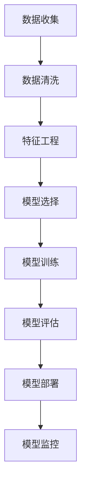

                 

# 洞察力与预测：数据分析的艺术与科学

> 关键词：数据分析, 预测模型, 统计学习, 机器学习, 深度学习, 时间序列分析

## 1. 背景介绍

### 1.1 问题由来
在当今数据驱动的时代，几乎每个行业都在依靠数据分析来做出决策。无论是金融、零售、医疗还是互联网，都在利用数据洞察力来优化产品、提升服务、降低成本和增加收益。然而，尽管数据无处不在，但其背后的洞察力却往往是稀缺的。数据分析师和数据科学家们需要掌握一系列的技术和工具，来有效地从数据中提取出有价值的洞察力，并据此做出精确的预测。

### 1.2 问题核心关键点
数据分析的核心目标是：
1. **数据收集与清洗**：从各种来源收集数据，并对其进行清洗，确保数据质量和完整性。
2. **特征工程**：提取和构建有助于模型学习的数据特征。
3. **模型构建与选择**：选择合适的统计、机器学习和深度学习模型，进行模型训练和调优。
4. **模型评估与验证**：通过交叉验证、混淆矩阵等方法评估模型的性能。
5. **模型部署与监控**：将训练好的模型部署到生产环境，并实时监控其性能。

数据分析需要系统地应用这些步骤，确保从数据中提取出的洞察力是准确和可靠的。

### 1.3 问题研究意义
通过对数据分析技术的深入理解，数据分析师和数据科学家能够更好地利用数据洞察力进行决策和预测。这不仅有助于企业优化运营，提升竞争优势，还能在医疗、金融等领域带来显著的实际效益。例如，在医疗领域，数据分析能够帮助诊断疾病、优化治疗方案；在金融领域，数据分析可以预测市场趋势、管理风险。

## 2. 核心概念与联系

### 2.1 核心概念概述

为更好地理解数据分析的流程和方法，本节将介绍几个关键概念及其相互关系：

- **数据分析**：通过统计、机器学习和深度学习等技术手段，从原始数据中提取有价值的洞察力，进行数据驱动的决策和预测。
- **统计学习**：利用统计方法对数据进行建模和分析，常用的方法包括回归、分类、聚类等。
- **机器学习**：通过构建模型对数据进行预测或分类，常用的算法包括线性回归、决策树、支持向量机等。
- **深度学习**：利用多层神经网络对数据进行建模和预测，适用于复杂的数据集和深度特征的提取，如卷积神经网络(CNN)、循环神经网络(RNN)、长短时记忆网络(LSTM)等。
- **时间序列分析**：对时间序列数据进行建模和分析，常用的方法包括ARIMA模型、LSTM、长短期记忆网络等。

这些概念之间的关系可以通过以下Mermaid流程图来展示：



这个流程图展示了数据分析的基本流程：

1. 从不同来源收集数据。
2. 对数据进行清洗和预处理。
3. 提取和构建数据特征。
4. 选择和训练合适的模型。
5. 评估模型的性能。
6. 将模型部署到生产环境。
7. 实时监控模型的性能。

## 3. 核心算法原理 & 具体操作步骤
### 3.1 算法原理概述

数据分析的核心原理在于利用统计学、机器学习和深度学习的算法，对数据进行建模和预测。其核心步骤如下：

1. **数据准备**：收集和清洗数据，提取特征。
2. **模型选择**：根据问题的性质选择适合的模型。
3. **模型训练**：使用历史数据对模型进行训练。
4. **模型评估**：使用验证集或测试集评估模型的性能。
5. **模型优化**：根据评估结果对模型进行调整和优化。
6. **模型部署**：将训练好的模型部署到生产环境。
7. **模型监控**：实时监控模型性能，确保模型持续有效。

### 3.2 算法步骤详解

#### 3.2.1 数据准备

数据准备是数据分析的基础步骤。主要包括以下内容：

1. **数据收集**：从各种数据源（如数据库、API、日志等）收集原始数据。
2. **数据清洗**：去除重复、缺失、异常值等数据，确保数据质量。
3. **数据转换**：将原始数据转换为模型所需的格式，如标准化、归一化等。
4. **特征提取**：从原始数据中提取有助于模型学习的特征，如时间戳、特征编码等。

#### 3.2.2 模型选择

模型选择需要根据问题的性质和数据的特性来决定。常用的模型包括：

1. **回归模型**：用于预测数值型变量，如线性回归、岭回归等。
2. **分类模型**：用于分类问题，如逻辑回归、决策树、随机森林等。
3. **聚类模型**：用于无监督学习，如K均值聚类、层次聚类等。
4. **深度学习模型**：用于处理复杂数据，如卷积神经网络(CNN)、循环神经网络(RNN)、长短期记忆网络(LSTM)等。
5. **时间序列模型**：用于预测时间序列数据，如ARIMA模型、LSTM等。

#### 3.2.3 模型训练

模型训练是将数据输入模型，通过优化算法调整模型参数，使其能够对数据进行准确预测的过程。常用的优化算法包括：

1. **梯度下降**：通过计算梯度，逐步调整模型参数。
2. **随机梯度下降**：每次使用一个样本来更新模型参数。
3. **Adam算法**：结合了梯度下降和动量算法的优点，能够快速收敛。

#### 3.2.4 模型评估

模型评估是通过验证集或测试集对模型性能进行评估，常用的指标包括：

1. **均方误差(MSE)**：用于回归问题，计算预测值与真实值之间的平均误差。
2. **均方根误差(RMSE)**：对均方误差开方，更直观地反映误差大小。
3. **准确率(Accuracy)**：用于分类问题，计算模型正确预测的样本数占总样本数的比例。
4. **精确率(Precision)**：用于分类问题，计算模型正确预测的正样本数占预测为正样本数的比例。
5. **召回率(Recall)**：用于分类问题，计算模型正确预测的正样本数占真实正样本数的比例。

#### 3.2.5 模型优化

模型优化是通过调整模型参数和算法，提高模型性能的过程。常用的方法包括：

1. **超参数调整**：调整学习率、正则化参数等超参数，寻找最优模型。
2. **模型集成**：通过集成多个模型，提升模型性能。
3. **交叉验证**：通过交叉验证方法，评估模型性能并优化参数。

#### 3.2.6 模型部署

模型部署是将训练好的模型应用于实际问题，进行预测或分类的过程。主要包括以下步骤：

1. **模型加载**：从存储介质中加载模型。
2. **数据预处理**：对新数据进行预处理，使其符合模型输入格式。
3. **模型推理**：将新数据输入模型，进行预测或分类。
4. **结果输出**：将模型预测结果输出，供业务使用。

#### 3.2.7 模型监控

模型监控是为了确保模型在生产环境中持续有效，需要实时监控模型性能。主要包括以下步骤：

1. **数据收集**：收集模型预测结果和真实数据。
2. **性能评估**：通过指标计算模型性能。
3. **异常检测**：检测模型预测结果与真实结果之间的异常偏差。
4. **模型更新**：根据异常检测结果，更新模型参数。

### 3.3 算法优缺点

数据分析算法具有以下优点：

1. **准确性**：通过构建和优化模型，能够实现高精度的预测。
2. **灵活性**：适用于各种类型的数据和问题，能够灵活应用。
3. **可解释性**：能够通过特征工程和模型评估，解释模型预测过程。

同时，数据分析算法也存在以下缺点：

1. **数据依赖**：需要大量的高质量数据才能训练出有效的模型。
2. **计算资源需求高**：复杂的深度学习模型需要大量的计算资源。
3. **模型复杂度**：模型复杂度高，训练和优化过程耗时较长。

### 3.4 算法应用领域

数据分析算法在多个领域得到了广泛应用，包括但不限于：

1. **金融风险管理**：利用回归模型和分类模型预测金融市场风险。
2. **医疗诊断**：利用分类模型和聚类模型预测疾病风险和治疗效果。
3. **零售销售预测**：利用时间序列模型和回归模型预测销售趋势和库存水平。
4. **供应链优化**：利用聚类模型和回归模型优化供应链管理和物流配送。
5. **智能推荐**：利用分类模型和协同过滤算法推荐商品和服务。
6. **舆情分析**：利用文本挖掘和情感分析技术分析社交媒体和新闻舆情。

数据分析的应用领域非常广泛，几乎涵盖了各个行业，为业务决策提供了强大的数据支持。

## 4. 数学模型和公式 & 详细讲解  
### 4.1 数学模型构建

数据分析的核心数学模型包括统计模型、机器学习模型和深度学习模型。下面以线性回归模型为例，介绍数学模型的构建过程。

**线性回归模型**：

$$ y = \beta_0 + \beta_1 x_1 + \beta_2 x_2 + ... + \beta_n x_n + \epsilon $$

其中，$y$ 表示预测变量，$x_i$ 表示自变量，$\beta_i$ 表示系数，$\epsilon$ 表示误差项。

**回归问题的损失函数**：

$$ L(\beta) = \frac{1}{2n} \sum_{i=1}^n (y_i - \hat{y}_i)^2 $$

其中，$n$ 表示样本数，$y_i$ 表示真实值，$\hat{y}_i$ 表示预测值。

### 4.2 公式推导过程

**最小二乘法求解回归系数**：

最小二乘法通过最小化残差平方和，求解线性回归系数 $\beta$。具体公式如下：

$$ \beta = (X^T X)^{-1} X^T y $$

其中，$X$ 表示自变量矩阵，$y$ 表示预测变量矩阵，$\beta$ 表示回归系数。

### 4.3 案例分析与讲解

以房价预测为例，利用线性回归模型对数据进行分析：

1. **数据准备**：收集历史房价数据和相关特征数据。
2. **特征工程**：提取特征，如面积、楼层、地理位置等。
3. **模型选择**：选择线性回归模型。
4. **模型训练**：使用历史数据训练模型，求解回归系数。
5. **模型评估**：使用验证集评估模型性能，调整超参数。
6. **模型部署**：将训练好的模型部署到生产环境，进行房价预测。
7. **模型监控**：实时监控模型性能，检测异常偏差，更新模型参数。

## 5. 项目实践：代码实例和详细解释说明
### 5.1 开发环境搭建

在进行数据分析项目实践前，我们需要准备好开发环境。以下是使用Python进行Scikit-learn开发的准备工作：

1. 安装Anaconda：从官网下载并安装Anaconda，用于创建独立的Python环境。

2. 创建并激活虚拟环境：
```bash
conda create -n sklearn-env python=3.8 
conda activate sklearn-env
```

3. 安装Scikit-learn：
```bash
conda install scikit-learn
```

4. 安装其他必要工具包：
```bash
pip install numpy pandas matplotlib jupyter notebook ipython
```

完成上述步骤后，即可在`sklearn-env`环境中开始项目实践。

### 5.2 源代码详细实现

下面我们以房价预测为例，给出使用Scikit-learn库对线性回归模型进行训练和评估的Python代码实现。

```python
import numpy as np
from sklearn.model_selection import train_test_split
from sklearn.linear_model import LinearRegression
from sklearn.metrics import mean_squared_error, r2_score
from sklearn.datasets import load_boston

# 加载波士顿房价数据集
boston = load_boston()
X = boston.data
y = boston.target

# 划分训练集和测试集
X_train, X_test, y_train, y_test = train_test_split(X, y, test_size=0.2, random_state=42)

# 创建线性回归模型
model = LinearRegression()

# 训练模型
model.fit(X_train, y_train)

# 评估模型
y_pred = model.predict(X_test)
mse = mean_squared_error(y_test, y_pred)
rmse = np.sqrt(mse)
r2 = r2_score(y_test, y_pred)

print(f"RMSE: {rmse:.2f}, R2 Score: {r2:.2f}")
```

以上就是使用Scikit-learn库对线性回归模型进行房价预测的完整代码实现。可以看到，Scikit-learn库封装了丰富的机器学习算法，开发者只需调用接口即可快速实现数据分析。

### 5.3 代码解读与分析

让我们再详细解读一下关键代码的实现细节：

**数据加载**：使用`load_boston`函数加载波士顿房价数据集，包含房屋特征和房价。

**数据划分**：使用`train_test_split`函数将数据集划分为训练集和测试集。

**模型创建**：使用`LinearRegression`函数创建线性回归模型。

**模型训练**：使用`fit`函数训练模型，求解回归系数。

**模型评估**：使用`predict`函数对测试集进行预测，计算均方误差和R2分数。

**结果输出**：打印出模型的RMSE和R2分数，评估模型性能。

## 6. 实际应用场景
### 6.1 智能推荐系统

智能推荐系统利用数据分析和机器学习技术，对用户行为进行建模和预测，推荐个性化的商品和服务。具体步骤如下：

1. **数据收集**：收集用户浏览、点击、购买等行为数据。
2. **特征工程**：提取用户行为特征，如浏览时长、点击次数、购买金额等。
3. **模型选择**：选择协同过滤或基于内容的推荐算法。
4. **模型训练**：使用历史数据训练模型，优化参数。
5. **模型评估**：使用A/B测试等方法评估推荐效果。
6. **模型部署**：将训练好的模型部署到推荐系统，实时推荐商品和服务。
7. **模型监控**：实时监控推荐系统性能，检测推荐偏差，更新模型参数。

### 6.2 金融风险管理

金融风险管理利用数据分析和机器学习技术，对金融市场和客户行为进行建模和预测，管理金融风险。具体步骤如下：

1. **数据收集**：收集金融市场数据和客户交易数据。
2. **特征工程**：提取金融数据和客户行为特征，如股价波动、交易金额、客户信用等级等。
3. **模型选择**：选择回归模型或分类模型。
4. **模型训练**：使用历史数据训练模型，优化参数。
5. **模型评估**：使用交叉验证等方法评估模型性能。
6. **模型部署**：将训练好的模型部署到金融风险管理系统，实时预测市场风险和客户违约概率。
7. **模型监控**：实时监控金融风险管理系统性能，检测异常偏差，更新模型参数。

### 6.3 医疗诊断

医疗诊断利用数据分析和机器学习技术，对病人的健康状况进行建模和预测，辅助医生进行诊断和治疗。具体步骤如下：

1. **数据收集**：收集病人的病历数据和检查结果。
2. **特征工程**：提取病人的健康特征，如病历记录、检查结果、药物使用等。
3. **模型选择**：选择分类模型或聚类模型。
4. **模型训练**：使用历史数据训练模型，优化参数。
5. **模型评估**：使用混淆矩阵等方法评估模型性能。
6. **模型部署**：将训练好的模型部署到医疗诊断系统，实时辅助医生进行诊断。
7. **模型监控**：实时监控医疗诊断系统性能，检测诊断偏差，更新模型参数。

### 6.4 未来应用展望

随着数据分析技术的不断发展，其在更多领域的应用前景将更加广阔。未来，数据分析将会在以下几个方面取得突破：

1. **大数据分析**：利用大数据技术，处理海量数据，提取高价值洞察力。
2. **深度学习模型**：利用深度学习模型，处理复杂数据，提升预测精度。
3. **跨领域应用**：利用跨领域数据，进行联合学习，提升模型泛化能力。
4. **实时数据处理**：利用实时数据流处理技术，实现实时数据分析和预测。
5. **自动化分析**：利用自动化技术，提高数据分析效率，降低人工成本。

## 7. 工具和资源推荐
### 7.1 学习资源推荐

为了帮助开发者系统掌握数据分析的理论基础和实践技巧，这里推荐一些优质的学习资源：

1. 《Python数据科学手册》：涵盖Python数据分析的方方面面，适合初学者学习。
2. 《统计学习方法》：清华大学出版社，介绍统计学习方法的基本概念和算法。
3. 《机器学习实战》：涵盖机器学习的基本算法和实战案例，适合动手实践。
4. 《深度学习》：Ian Goodfellow著，介绍深度学习的基本概念和算法。
5. 《机器学习基础》：吴恩达Coursera课程，适合系统学习机器学习理论。

通过对这些资源的学习实践，相信你一定能够快速掌握数据分析的精髓，并用于解决实际的业务问题。
###  7.2 开发工具推荐

高效的开发离不开优秀的工具支持。以下是几款用于数据分析开发的常用工具：

1. Python：作为一种开源编程语言，Python拥有丰富的数据处理和机器学习库，如NumPy、Pandas、Scikit-learn等。
2. R语言：适用于统计分析和数据可视化，拥有丰富的数据处理和机器学习库，如ggplot2、dplyr、caret等。
3. Jupyter Notebook：适用于交互式数据分析和机器学习开发，支持代码块、图表展示、笔记记录等功能。
4. Tableau：适用于数据可视化和商业智能分析，能够直观展示数据分析结果。
5. Power BI：适用于商业智能和数据可视化，支持数据连接、报表生成等功能。

合理利用这些工具，可以显著提升数据分析的开发效率，加快创新迭代的步伐。

### 7.3 相关论文推荐

数据分析技术的发展源于学界的持续研究。以下是几篇奠基性的相关论文，推荐阅读：

1. 《回归分析》：W.E. Gleser著，介绍回归分析的基本概念和方法。
2. 《机器学习：一种模型驱动的介绍》：Tom Mitchell著，介绍机器学习的基本概念和方法。
3. 《深度学习》：Ian Goodfellow著，介绍深度学习的基本概念和算法。
4. 《统计学习方法》：李航著，介绍统计学习方法的基本概念和算法。
5. 《时间序列分析与预测》：R.S. Tsay著，介绍时间序列分析的基本概念和方法。

这些论文代表了大数据分析技术的发展脉络。通过学习这些前沿成果，可以帮助研究者把握学科前进方向，激发更多的创新灵感。

## 8. 总结：未来发展趋势与挑战
### 8.1 总结

本文对数据分析技术的核心概念、算法原理和具体操作步骤进行了全面系统的介绍。首先阐述了数据分析的流程和方法，明确了从数据收集到模型部署的各个环节。其次，从理论到实践，详细讲解了线性回归模型、时间序列模型等常见算法的构建和评估过程，给出了数据分析项目开发的完整代码实例。同时，本文还广泛探讨了数据分析在智能推荐、金融风险管理、医疗诊断等多个领域的应用前景，展示了数据分析技术的巨大潜力。

通过本文的系统梳理，可以看到，数据分析技术正在成为各个行业的重要支撑，极大地提升了业务决策的科学性和准确性。未来，伴随数据分析技术的不断演进，其在更多领域的应用前景将更加广阔，为各行各业带来更深远的变革。

### 8.2 未来发展趋势

展望未来，数据分析技术将呈现以下几个发展趋势：

1. **大数据分析**：随着大数据技术的发展，数据规模将不断扩大，数据分析技术将更加依赖于分布式计算和存储。
2. **深度学习模型**：深度学习模型将在数据分析中发挥越来越重要的作用，提升模型的预测精度。
3. **自动化分析**：自动化技术将进一步普及，提高数据分析效率，降低人工成本。
4. **跨领域应用**：数据分析将跨领域融合，提升模型的泛化能力和应用范围。
5. **实时数据处理**：实时数据处理技术将进一步发展，实现实时数据分析和预测。

这些趋势凸显了数据分析技术的广阔前景，为各行业带来更多可能性。

### 8.3 面临的挑战

尽管数据分析技术已经取得了瞩目成就，但在迈向更加智能化、普适化应用的过程中，它仍面临着诸多挑战：

1. **数据质量问题**：数据收集和清洗需要大量人工干预，数据质量难以保证。
2. **计算资源需求高**：大数据和深度学习模型需要大量计算资源，成本较高。
3. **模型复杂度**：复杂模型难以解释，模型调参和优化过程复杂。
4. **数据隐私和安全**：数据隐私和安全问题日益突出，数据保护措施亟待加强。
5. **跨领域融合**：跨领域数据分析需要协调不同领域的数据和模型，难度较大。

面对这些挑战，数据分析技术需要不断优化和改进，确保其高效、可靠和可解释性。

### 8.4 研究展望

面对数据分析技术所面临的挑战，未来的研究需要在以下几个方面寻求新的突破：

1. **数据自动化处理**：利用自动化技术，提高数据清洗和特征工程的效率。
2. **模型可解释性**：开发可解释性更强的模型，帮助用户理解模型预测过程。
3. **数据隐私保护**：研究数据隐私保护技术，确保数据安全。
4. **跨领域融合**：开发跨领域融合的数据分析算法，提升模型泛化能力。
5. **实时数据处理**：研究实时数据处理技术，实现实时数据分析和预测。

这些研究方向的探索，将引领数据分析技术迈向更高的台阶，为各行各业带来更多创新和突破。

## 9. 附录：常见问题与解答

**Q1：数据分析的流程是怎样的？**

A: 数据分析的流程主要包括以下步骤：

1. 数据收集：从各种数据源（如数据库、API、日志等）收集原始数据。
2. 数据清洗：去除重复、缺失、异常值等数据，确保数据质量。
3. 特征工程：提取和构建有助于模型学习的数据特征。
4. 模型选择：根据问题的性质选择适合的模型。
5. 模型训练：使用历史数据对模型进行训练。
6. 模型评估：使用验证集或测试集评估模型性能。
7. 模型优化：根据评估结果对模型进行调整和优化。
8. 模型部署：将训练好的模型应用于实际问题，进行预测或分类。
9. 模型监控：实时监控模型性能，确保模型持续有效。

**Q2：如何选择合适的特征进行建模？**

A: 选择合适的特征进行建模需要考虑以下因素：

1. 相关性：选择与预测目标高度相关的特征，如房价预测中的面积、楼层等。
2. 冗余性：避免选择高度相关的特征，如房价预测中的面积和平方面积。
3. 解释性：选择具有较好解释性的特征，如房价预测中的地理位置。
4. 数据质量：选择质量较高的特征，如房价预测中的价格数据。

**Q3：数据分析在医疗诊断中的应用前景是什么？**

A: 数据分析在医疗诊断中有着广泛的应用前景，主要包括：

1. 疾病预测：利用分类模型预测病人是否患有某种疾病，如癌症、糖尿病等。
2. 治疗效果评估：利用回归模型评估治疗效果，如治疗前后病人的健康指标变化。
3. 药物研发：利用数据分析加速药物筛选和临床试验，如预测药物对病人的疗效。
4. 病人分群：利用聚类模型将病人分为不同的群体，进行个性化治疗。

数据分析在医疗诊断中的应用将大大提升医疗服务质量和效率，带来显著的实际效益。

**Q4：大数据分析技术的主要特点是什么？**

A: 大数据分析技术的主要特点包括：

1. 数据量大：处理的数据量通常以TB、PB级为单位。
2. 数据多样性：处理的数据类型包括结构化、半结构化和非结构化数据。
3. 数据处理速度快：能够在短时间内处理海量数据，进行实时分析。
4. 处理复杂度高：处理的数据通常具有复杂结构，需要进行复杂的数据挖掘和建模。
5. 应用广泛：大数据分析技术在金融、医疗、零售、互联网等领域得到广泛应用。

大数据分析技术的发展将进一步推动各行各业的数据驱动决策和智能决策。

**Q5：如何应对数据分析中的数据质量问题？**

A: 应对数据分析中的数据质量问题需要采取以下措施：

1. 数据清洗：去除重复、缺失、异常值等数据，确保数据质量。
2. 数据验证：通过验证数据的一致性和完整性，确保数据准确。
3. 数据增强：利用数据增强技术，提高数据多样性，减少数据偏差。
4. 数据融合：将不同来源的数据进行融合，提升数据完整性和代表性。
5. 数据治理：制定数据治理标准，确保数据质量可控。

通过这些措施，可以有效应对数据分析中的数据质量问题，确保模型训练的准确性和可靠性。

---

作者：禅与计算机程序设计艺术 / Zen and the Art of Computer Programming

