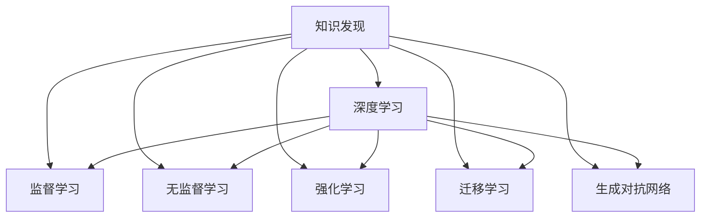

                 

## 1. 背景介绍

在信息爆炸的今天，如何高效地从大量数据中发现和抽取有用的知识，成为了一项重要而艰巨的任务。知识发现(Knowledge Discovery, KDD)引擎便是应运而生的解决方案。它通过深度学习算法，从海量数据中挖掘出潜在的知识模式和关联关系，辅助决策支持、商业智能、情报分析等领域实现信息增值。

### 1.1 问题由来

传统的数据挖掘方法多采用统计学和规则方法，但在处理高维度、复杂数据结构时，往往效果不佳。深度学习方法的引入，为知识发现提供了更加高效和灵活的途径。它能够自动提取数据中的非线性关系，适应非结构化和半结构化数据，并且通过多层非线性变换实现特征学习，使得模型的表达能力和泛化能力得到极大提升。

### 1.2 问题核心关键点

当前，深度学习在知识发现引擎中的应用主要体现在以下几个方面：

- **监督学习**：通过标注数据训练模型，预测新样本的标签，用于分类、回归、推荐等任务。
- **无监督学习**：从无标注数据中挖掘出潜在的模式和结构，用于聚类、降维、异常检测等。
- **强化学习**：通过与环境的交互，动态优化决策策略，用于策略优化、游戏AI等。
- **半监督学习**：结合少量标注和大量无标注数据，提高模型的泛化能力。
- **生成对抗网络**：生成样本数据，进行数据增强，辅助模型训练和评价。
- **迁移学习**：通过在相似领域或任务上的预训练，提高新任务的模型性能。

这些深度学习方法，共同构成了知识发现引擎的核心技术体系，为大数据时代的知识发现和信息挖掘提供了强有力的支撑。

## 2. 核心概念与联系

### 2.1 核心概念概述

为更好地理解深度学习在知识发现引擎中的应用，本节将介绍几个密切相关的核心概念：

- **知识发现(Knowledge Discovery, KDD)**：从大规模数据中挖掘出有用知识和模式的过程。KDD涉及数据预处理、特征工程、模型训练、结果解释等多个环节，是信息科学与人工智能的交叉领域。
- **深度学习(Deep Learning)**：一种通过多层非线性变换进行特征学习和表示学习的算法，在图像、语音、自然语言处理等诸多领域都取得了显著进展。
- **监督学习(Supervised Learning)**：利用标注数据训练模型，进行分类、回归等任务。
- **无监督学习(Unsupervised Learning)**：从无标注数据中挖掘出潜在模式和结构，用于聚类、降维、异常检测等。
- **强化学习(Reinforcement Learning)**：通过与环境的交互，动态优化决策策略。
- **迁移学习(Transfer Learning)**：通过在相似领域或任务上的预训练，提高新任务的模型性能。
- **生成对抗网络(GAN)**：由生成器和判别器两部分组成，用于生成样本数据，进行数据增强。

这些概念之间的逻辑关系可以通过以下Mermaid流程图来展示：



这个流程图展示了大语言模型的核心概念及其之间的关系：

1. 知识发现通过深度学习获取数据中的知识模式和关联关系。
2. 深度学习通过监督、无监督、强化、迁移等学习范式，进行特征提取和模式识别。
3. 不同的学习范式，结合生成对抗网络等技术，进一步丰富了知识发现的手段和效果。

## 3. 核心算法原理 & 具体操作步骤

### 3.1 算法原理概述

深度学习在知识发现引擎中的应用，主要体现在以下几个方面：

- **特征学习**：通过多层非线性变换，自动提取数据的隐含特征，用于后续的分析和挖掘。
- **模式识别**：通过分类、回归等监督学习算法，识别数据中的潜在模式和关系。
- **聚类分析**：通过无监督学习算法，对数据进行分组和分类，发现数据中的内在结构。
- **异常检测**：通过生成对抗网络等技术，生成样本数据，用于检测数据中的异常点和噪声。
- **策略优化**：通过强化学习算法，在实际环境中动态优化决策策略，提高问题解决的效率和效果。

这些算法原理共同构成了深度学习在知识发现引擎中的应用基础，使得深度学习能够高效地从数据中挖掘出有价值的信息和知识。

### 3.2 算法步骤详解

深度学习在知识发现引擎中的应用，一般包括以下几个关键步骤：

**Step 1: 数据预处理**
- 收集数据，进行清洗、去重、缺失值填充等预处理操作。
- 对文本数据进行分词、向量化等预处理。
- 对图像、音频、视频等多模态数据进行特征提取。

**Step 2: 特征工程**
- 根据任务需求，选择合适的特征表示方法，如词嵌入、卷积特征、循环特征等。
- 应用特征组合、降维等技术，提取有意义的特征表示。
- 引入噪声、扰动等技术，增加模型的鲁棒性。

**Step 3: 模型选择**
- 根据任务类型，选择合适的深度学习模型，如卷积神经网络(CNN)、循环神经网络(RNN)、长短时记忆网络(LSTM)等。
- 对于分类任务，选择适当的激活函数和损失函数，如softmax、交叉熵等。
- 对于回归任务，选择适当的损失函数，如均方误差、绝对误差等。
- 对于生成任务，选择适当的生成模型，如生成对抗网络(GAN)、变分自编码器(VAE)等。

**Step 4: 模型训练**
- 将处理好的数据输入模型，进行前向传播计算。
- 计算损失函数，进行反向传播，更新模型参数。
- 应用正则化技术，如L2正则、Dropout等，防止过拟合。
- 设置合适的学习率、批大小、迭代轮数等超参数。
- 在验证集上评估模型性能，根据结果调整超参数。

**Step 5: 模型评估**
- 在测试集上评估模型性能，计算各种指标，如精度、召回率、F1值等。
- 分析模型的优缺点，优化模型结构。
- 生成样本数据，进行数据增强，辅助模型训练和评价。

**Step 6: 模型部署**
- 将训练好的模型保存为模型文件。
- 部署模型到生产环境，接受实际数据输入。
- 应用在线学习技术，不断更新模型，适应数据分布的变化。
- 进行模型监控和维护，确保模型稳定性和可靠性。

以上是深度学习在知识发现引擎中的常见应用流程。在实际应用中，还需要根据具体任务的特点，对每个环节进行优化设计，以获得更好的效果。

### 3.3 算法优缺点

深度学习在知识发现引擎中的应用具有以下优点：
1. 高效性：深度学习算法能够自动提取数据的隐含特征，减少了人工特征工程的工作量。
2. 灵活性：深度学习模型具有较强的表达能力，能够适应各种复杂的数据结构。
3. 泛化能力：通过多层非线性变换，深度学习模型可以学习到更丰富的数据表示，提高模型的泛化能力。
4. 自动化：深度学习模型的训练和优化过程高度自动化，减少了人工干预的复杂度。
5. 适应性强：深度学习模型能够适应非结构化和半结构化数据，适用于各种知识发现任务。

同时，该方法也存在一些局限性：
1. 数据依赖：深度学习模型的性能依赖于大量高质量的标注数据，对于数据量不足的任务可能效果不佳。
2. 模型复杂度：深度学习模型的结构复杂，训练和推理所需的时间和计算资源较大。
3. 可解释性差：深度学习模型的决策过程难以解释，缺乏透明性。
4. 过拟合风险：深度学习模型容易过拟合，特别是在标注数据不足的情况下。
5. 超参数调优：深度学习模型的训练过程需要调整多个超参数，寻找最优参数组合存在一定难度。

尽管存在这些局限性，但深度学习在知识发现引擎中的应用，仍然具有巨大的潜力和发展空间。未来相关研究的重点在于如何进一步降低数据依赖，提高模型的鲁棒性和可解释性，同时兼顾效率和效果。

### 3.4 算法应用领域

深度学习在知识发现引擎中的应用，已经广泛应用于多个领域，涵盖以下几种主要方向：

1. **商业智能(BI)**：利用深度学习算法对企业运营数据进行分析，提取有价值的商业洞察，辅助决策支持。
2. **智能推荐系统**：通过深度学习模型进行用户兴趣挖掘和行为预测，推荐符合用户需求的商品和服务。
3. **自然语言处理(NLP)**：利用深度学习模型对文本数据进行分类、聚类、情感分析等处理，提取有价值的信息。
4. **图像识别与处理**：通过深度学习模型进行图像分类、目标检测、图像生成等处理，提取图像中的关键信息。
5. **视频分析与处理**：利用深度学习模型进行视频分类、动作识别、对象跟踪等处理，提取视频中的关键信息。
6. **智能医疗**：通过深度学习模型对医疗数据进行分析和挖掘，提取有价值的医疗知识，辅助临床决策。
7. **金融分析**：利用深度学习模型对金融数据进行分析和挖掘，提取有价值的金融知识，辅助投资和风险管理。

除了这些应用方向外，深度学习在知识发现引擎中的研究也正在不断拓展，为更多领域带来了新的突破。

## 4. 数学模型和公式 & 详细讲解 & 举例说明

### 4.1 数学模型构建

本节将使用数学语言对深度学习在知识发现引擎中的应用过程进行更加严格的刻画。

假设深度学习模型为 $M_{\theta}$，其中 $\theta$ 为模型参数。给定知识发现任务 $T$ 的数据集 $D=\{(x_i,y_i)\}_{i=1}^N$，模型的训练目标是最小化损失函数 $\mathcal{L}(\theta)$，使得模型预测的输出 $y^*$ 逼近真实标签 $y_i$。

定义模型 $M_{\theta}$ 在输入 $x_i$ 上的预测输出为 $\hat{y}=M_{\theta}(x_i)$。设 $T$ 为分类任务，则交叉熵损失函数定义为：

$$
\ell(M_{\theta}(x_i),y_i) = -[y_i\log M_{\theta}(x_i) + (1-y_i)\log (1-M_{\theta}(x_i))]
$$

则经验风险为：

$$
\mathcal{L}(\theta) = -\frac{1}{N}\sum_{i=1}^N \ell(M_{\theta}(x_i),y_i)
$$

在得到损失函数 $\mathcal{L}(\theta)$ 的梯度后，即可带入参数更新公式：

$$
\theta \leftarrow \theta - \eta \nabla_{\theta}\mathcal{L}(\theta) - \eta\lambda\theta
$$

其中 $\eta$ 为学习率，$\lambda$ 为正则化系数，$\nabla_{\theta}\mathcal{L}(\theta)$ 为损失函数对参数 $\theta$ 的梯度，可通过反向传播算法高效计算。

### 4.2 公式推导过程

以下我们以图像分类任务为例，推导交叉熵损失函数及其梯度的计算公式。

假设模型 $M_{\theta}$ 在输入图像 $x$ 上的输出为 $\hat{y}=M_{\theta}(x) \in [0,1]$，表示图像属于各类别的概率。真实标签 $y \in \{1,0\}$。则二分类交叉熵损失函数定义为：

$$
\ell(M_{\theta}(x),y) = -[y\log \hat{y} + (1-y)\log (1-\hat{y})]
$$

将其代入经验风险公式，得：

$$
\mathcal{L}(\theta) = -\frac{1}{N}\sum_{i=1}^N [y_i\log M_{\theta}(x_i)+(1-y_i)\log(1-M_{\theta}(x_i))]
$$

根据链式法则，损失函数对参数 $\theta_k$ 的梯度为：

$$
\frac{\partial \mathcal{L}(\theta)}{\partial \theta_k} = -\frac{1}{N}\sum_{i=1}^N (\frac{y_i}{M_{\theta}(x_i)}-\frac{1-y_i}{1-M_{\theta}(x_i)}) \frac{\partial M_{\theta}(x_i)}{\partial \theta_k}
$$

其中 $\frac{\partial M_{\theta}(x_i)}{\partial \theta_k}$ 可进一步递归展开，利用自动微分技术完成计算。

在得到损失函数的梯度后，即可带入参数更新公式，完成模型的迭代优化。重复上述过程直至收敛，最终得到适应下游任务的最优模型参数 $\theta^*$。

## 5. 项目实践：代码实例和详细解释说明

### 5.1 开发环境搭建

在进行深度学习在知识发现引擎中的应用实践前，我们需要准备好开发环境。以下是使用Python进行PyTorch开发的环境配置流程：

1. 安装Anaconda：从官网下载并安装Anaconda，用于创建独立的Python环境。

2. 创建并激活虚拟环境：
```bash
conda create -n pytorch-env python=3.8 
conda activate pytorch-env
```

3. 安装PyTorch：根据CUDA版本，从官网获取对应的安装命令。例如：
```bash
conda install pytorch torchvision torchaudio cudatoolkit=11.1 -c pytorch -c conda-forge
```

4. 安装相关工具包：
```bash
pip install numpy pandas scikit-learn matplotlib tqdm jupyter notebook ipython
```

完成上述步骤后，即可在`pytorch-env`环境中开始实践。

### 5.2 源代码详细实现

下面我以图像分类任务为例，给出使用PyTorch进行深度学习模型在知识发现引擎中应用的完整代码实现。

首先，定义图像分类任务的数据处理函数：

```python
from torchvision import datasets, transforms
from torch.utils.data import DataLoader

transform = transforms.Compose([
    transforms.Resize(224),
    transforms.ToTensor(),
    transforms.Normalize(mean=[0.485, 0.456, 0.406],
                         std=[0.229, 0.224, 0.225])
])

train_dataset = datasets.CIFAR10(root='./data', train=True, download=True, transform=transform)
train_loader = DataLoader(train_dataset, batch_size=32, shuffle=True)

test_dataset = datasets.CIFAR10(root='./data', train=False, download=True, transform=transform)
test_loader = DataLoader(test_dataset, batch_size=32, shuffle=False)
```

然后，定义模型和优化器：

```python
from torch import nn, optim

model = nn.Sequential(
    nn.Conv2d(3, 64, kernel_size=3, stride=1, padding=1),
    nn.ReLU(inplace=True),
    nn.MaxPool2d(kernel_size=2, stride=2),
    nn.Conv2d(64, 128, kernel_size=3, stride=1, padding=1),
    nn.ReLU(inplace=True),
    nn.MaxPool2d(kernel_size=2, stride=2),
    nn.Conv2d(128, 256, kernel_size=3, stride=1, padding=1),
    nn.ReLU(inplace=True),
    nn.MaxPool2d(kernel_size=2, stride=2),
    nn.Flatten(),
    nn.Linear(256*8*8, 128),
    nn.ReLU(inplace=True),
    nn.Linear(128, 10),
    nn.LogSoftmax(dim=1)
)

criterion = nn.NLLLoss()
optimizer = optim.Adam(model.parameters(), lr=0.001)
```

接着，定义训练和评估函数：

```python
import numpy as np

device = torch.device('cuda' if torch.cuda.is_available() else 'cpu')
model.to(device)

def train_epoch(model, data_loader, optimizer):
    model.train()
    for batch_idx, (data, target) in enumerate(data_loader):
        data, target = data.to(device), target.to(device)
        optimizer.zero_grad()
        output = model(data)
        loss = criterion(output, target)
        loss.backward()
        optimizer.step()
    return loss.item() / len(data_loader)

def evaluate(model, data_loader):
    model.eval()
    total_loss = 0
    correct = 0
    with torch.no_grad():
        for data, target in data_loader:
            data, target = data.to(device), target.to(device)
            output = model(data)
            total_loss += criterion(output, target).item()
            pred = output.argmax(dim=1, keepdim=True)
            correct += pred.eq(target.view_as(pred)).sum().item()
    print(f'Loss: {total_loss / len(data_loader):.4f}, Accuracy: {100 * correct / len(data_loader):.2f}%')
```

最后，启动训练流程并在测试集上评估：

```python
epochs = 10
for epoch in range(epochs):
    loss = train_epoch(model, train_loader, optimizer)
    print(f'Epoch {epoch + 1}, loss: {loss:.4f}')
    evaluate(model, test_loader)
```

以上就是使用PyTorch进行图像分类任务应用的完整代码实现。可以看到，得益于PyTorch的强大封装，我们可以用相对简洁的代码完成模型的加载和训练。

### 5.3 代码解读与分析

让我们再详细解读一下关键代码的实现细节：

**数据处理函数**：
- `transform`：定义了图像数据预处理的操作，包括缩放、归一化等。
- `train_dataset`：定义了训练集数据集，使用CIFAR-10数据集。
- `train_loader`：定义了训练集数据加载器，用于批量处理数据。
- `test_dataset`：定义了测试集数据集，使用CIFAR-10数据集。
- `test_loader`：定义了测试集数据加载器，用于批量处理数据。

**模型和优化器**：
- `model`：定义了卷积神经网络模型，包含卷积层、激活函数、池化层、全连接层等。
- `criterion`：定义了交叉熵损失函数，用于计算模型预测和真实标签之间的差异。
- `optimizer`：定义了Adam优化器，用于更新模型参数。

**训练和评估函数**：
- `train_epoch`：定义了训练过程的每个epoch，在数据加载器上迭代，更新模型参数，并返回当前epoch的损失。
- `evaluate`：定义了评估过程，在测试集数据加载器上迭代，计算模型预测的准确率和损失，并打印输出。

**训练流程**：
- `epochs`：定义了总的epoch数，开始循环迭代。
- 每个epoch内，先在训练集上训练，输出当前epoch的损失。
- 在测试集上评估，输出模型预测的准确率。
- 重复上述步骤，直到所有epoch结束。

可以看到，PyTorch配合深度学习模型，使得图像分类任务的开发变得简洁高效。开发者可以将更多精力放在模型结构优化、超参数调优等高层逻辑上，而不必过多关注底层的实现细节。

当然，工业级的系统实现还需考虑更多因素，如模型的保存和部署、超参数的自动搜索、更灵活的任务适配层等。但核心的深度学习应用流程基本与此类似。

## 6. 实际应用场景

### 6.1 智能推荐系统

智能推荐系统是深度学习在知识发现引擎中最为成功的应用之一。它通过分析用户的历史行为数据，挖掘用户的兴趣偏好，并根据实时数据动态推荐商品或服务。

在技术实现上，可以收集用户浏览、点击、购买等行为数据，并提取和商品、服务相关的文本、图像等多模态数据。将这些数据作为模型输入，使用深度学习算法进行特征学习，提取用户兴趣和商品特征的表示。在生成推荐列表时，先用候选物品的文本、图像等特征作为输入，由模型预测用户兴趣匹配度，再结合其他特征综合排序，便可以得到个性化程度更高的推荐结果。

### 6.2 智能客服系统

智能客服系统通过深度学习算法对客户咨询数据进行分析，提取常见问题模式和解决方案。系统能够在用户提出问题时，自动匹配最相关的答案模板，并生成动态回复。

在技术实现上，可以收集企业内部的历史客服对话记录，将问题和最佳答复构建成监督数据，在此基础上对深度学习模型进行训练。微调后的模型能够自动理解用户意图，匹配最合适的答案模板进行回复。对于客户提出的新问题，还可以接入检索系统实时搜索相关内容，动态组织生成回答。如此构建的智能客服系统，能大幅提升客户咨询体验和问题解决效率。

### 6.3 金融舆情监测

金融机构需要实时监测市场舆论动向，以便及时应对负面信息传播，规避金融风险。深度学习算法能够自动从新闻、报道、评论等文本数据中挖掘出市场舆情，并进行情感分析，预测市场走势。

在技术实现上，可以收集金融领域相关的新闻、报道、评论等文本数据，并对其进行主题标注和情感标注。在此基础上对深度学习模型进行训练，使其能够自动判断文本属于何种主题，情感倾向是正面、中性还是负面。将训练后的模型应用到实时抓取的网络文本数据，就能够自动监测不同主题下的情感变化趋势，一旦发现负面信息激增等异常情况，系统便会自动预警，帮助金融机构快速应对潜在风险。

### 6.4 未来应用展望

随着深度学习技术的不断进步，其在知识发现引擎中的应用也将更加广泛。未来，深度学习将在更多领域得到应用，为传统行业带来变革性影响。

在智慧医疗领域，深度学习算法可以用于医学影像诊断、疾病预测、药物研发等，提升医疗服务的智能化水平，辅助医生诊疗，加速新药开发进程。

在智能教育领域，深度学习算法可应用于作业批改、学情分析、知识推荐等方面，因材施教，促进教育公平，提高教学质量。

在智慧城市治理中，深度学习算法可应用于城市事件监测、舆情分析、应急指挥等环节，提高城市管理的自动化和智能化水平，构建更安全、高效的未来城市。

此外，在企业生产、社会治理、文娱传媒等众多领域，深度学习算法也将不断涌现，为经济社会发展注入新的动力。

## 7. 工具和资源推荐

### 7.1 学习资源推荐

为了帮助开发者系统掌握深度学习在知识发现引擎中的应用，这里推荐一些优质的学习资源：

1. **《深度学习》一书**：深度学习领域的经典教材，全面介绍了深度学习的理论基础和算法实现。

2. **Coursera《深度学习专项课程》**：斯坦福大学Andrew Ng教授主讲的深度学习课程，涵盖了深度学习的基本概念和经典模型。

3. **CS231n《卷积神经网络》课程**：斯坦福大学开设的计算机视觉课程，介绍了卷积神经网络在图像识别中的应用。

4. **Kaggle竞赛平台**：Kaggle提供了大量的数据集和竞赛任务，帮助开发者实践深度学习算法。

5. **Arxiv预印本**：Arxiv是深度学习领域最重要的预印本平台，涵盖了最新的研究论文和模型实现。

通过对这些资源的学习实践，相信你一定能够快速掌握深度学习在知识发现引擎中的应用精髓，并用于解决实际的NLP问题。

### 7.2 开发工具推荐

高效的开发离不开优秀的工具支持。以下是几款用于深度学习在知识发现引擎中的应用开发的常用工具：

1. **PyTorch**：基于Python的开源深度学习框架，灵活动态的计算图，适合快速迭代研究。

2. **TensorFlow**：由Google主导开发的开源深度学习框架，生产部署方便，适合大规模工程应用。

3. **Keras**：高层次深度学习库，提供了简单易用的API接口，快速搭建深度学习模型。

4. **Jupyter Notebook**：交互式笔记本，支持Python、R等语言，便于实验记录和分享。

5. **TensorBoard**：TensorFlow配套的可视化工具，可实时监测模型训练状态，并提供丰富的图表呈现方式。

6. **Weights & Biases**：模型训练的实验跟踪工具，可以记录和可视化模型训练过程中的各项指标。

合理利用这些工具，可以显著提升深度学习在知识发现引擎中的应用开发效率，加快创新迭代的步伐。

### 7.3 相关论文推荐

深度学习在知识发现引擎中的应用源于学界的持续研究。以下是几篇奠基性的相关论文，推荐阅读：

1. **AlexNet论文**：Hinton等人提出的卷积神经网络模型，奠定了深度学习在图像识别中的应用基础。

2. **ResNet论文**：He等人提出的残差网络，突破了深度神经网络的退化问题，提升了模型深度和性能。

3. **VGGNet论文**：Simonyan和Zisserman提出的VGG网络，通过小卷积核、多层次结构，提升了模型精度。

4. **Inception论文**：Szegedy等人提出的Inception网络，引入了多尺度特征图，提高了模型对复杂数据的识别能力。

5. **Transformer论文**：Vaswani等人提出的Transformer模型，引入了自注意力机制，提升了模型对长序列数据的处理能力。

6. **BERT论文**：Devlin等人提出的BERT模型，通过预训练和微调，在自然语言处理任务上取得了SOTA。

这些论文代表了大语言模型在知识发现引擎中的应用发展脉络。通过学习这些前沿成果，可以帮助研究者把握学科前进方向，激发更多的创新灵感。

## 8. 总结：未来发展趋势与挑战

### 8.1 总结

本文对深度学习在知识发现引擎中的应用进行了全面系统的介绍。首先阐述了深度学习算法在知识发现中的应用背景和意义，明确了深度学习在知识发现中的核心地位。其次，从原理到实践，详细讲解了深度学习在知识发现中的应用过程，给出了具体的应用代码实现。同时，本文还广泛探讨了深度学习在智能推荐、智能客服、金融舆情监测等多个领域的应用前景，展示了深度学习技术的巨大潜力。此外，本文精选了深度学习应用的各类学习资源，力求为读者提供全方位的技术指引。

通过本文的系统梳理，可以看到，深度学习在知识发现引擎中的应用已经成为了行业标准，广泛应用于各个领域。得益于深度学习的高效性和表达能力，深度学习在知识发现中的应用将会进一步拓展，为更多领域带来变革性影响。

### 8.2 未来发展趋势

展望未来，深度学习在知识发现引擎中的应用将呈现以下几个发展趋势：

1. **模型规模持续增大**：随着算力成本的下降和数据规模的扩张，深度学习模型的参数量还将持续增长。超大规模深度学习模型蕴含的丰富特征表示，有望支撑更加复杂多变的知识发现任务。

2. **数据依赖降低**：深度学习算法的泛化能力得到不断提升，对于标注数据的需求也在降低。未来，基于弱监督、无监督学习的方法将在更多领域得到应用。

3. **多模态融合**：深度学习模型能够适应非结构化和半结构化数据，未来将更多地融合图像、音频、视频等多模态数据，提高模型的综合分析能力。

4. **在线学习**：深度学习模型需要不断地从新数据中学习，以保持其性能。未来，在线学习技术将更加成熟，模型能够持续适应数据分布的变化。

5. **跨领域迁移**：深度学习模型在特定领域进行微调后，能够很好地迁移到其他领域，提高模型的跨领域适应能力。

6. **可解释性增强**：深度学习模型缺乏透明性，未来将结合因果分析、可解释AI等技术，增强模型的可解释性，提高用户的信任度。

7. **伦理与安全**：深度学习模型可能学习到有害信息，未来将加强对模型的伦理审查，确保其安全性。

以上趋势凸显了深度学习在知识发现引擎中的广阔前景。这些方向的探索发展，必将进一步提升深度学习在知识发现中的应用效果，为更多领域带来新的突破。

### 8.3 面临的挑战

尽管深度学习在知识发现引擎中的应用已经取得了显著进展，但在迈向更加智能化、普适化应用的过程中，它仍面临着诸多挑战：

1. **数据依赖**：深度学习模型的性能依赖于大量高质量的标注数据，对于数据量不足的任务可能效果不佳。如何进一步降低数据依赖，提高模型的鲁棒性，是未来需要解决的重要问题。

2. **模型鲁棒性**：深度学习模型容易受到噪声和异常数据的影响，导致泛化能力不足。如何在保证模型精度的同时，提高模型的鲁棒性，也是未来需要解决的重要问题。

3. **可解释性差**：深度学习模型的决策过程缺乏透明性，难以解释其内部工作机制和推理逻辑。如何赋予深度学习模型更强的可解释性，提高用户对模型的信任度，是未来需要解决的重要问题。

4. **计算资源需求大**：深度学习模型需要大量的计算资源进行训练和推理，如何优化模型的计算效率，降低计算资源需求，是未来需要解决的重要问题。

5. **伦理与安全**：深度学习模型可能学习到有害信息，如何从数据和算法层面消除模型偏见，确保输出的安全性，也是未来需要解决的重要问题。

尽管存在这些挑战，但随着深度学习技术的不断进步，其在知识发现引擎中的应用将得到进一步的提升。未来，相关研究需要在以下几个方面寻求新的突破：

1. **数据增强**：通过数据增强技术，扩充训练集的多样性，提高模型的泛化能力。

2. **无监督学习**：结合无监督学习技术，利用非结构化数据，提高模型的自适应能力。

3. **多任务学习**：结合多任务学习技术，提高模型在不同任务之间的迁移能力。

4. **知识图谱**：结合知识图谱，提高模型的领域特定知识表示能力。

5. **模型压缩**：通过模型压缩技术，提高模型的计算效率，降低计算资源需求。

6. **跨领域迁移**：结合跨领域迁移学习技术，提高模型在不同领域之间的泛化能力。

7. **可解释性增强**：结合可解释AI技术，提高模型的可解释性，增强用户信任度。

这些研究方向的探索，必将引领深度学习在知识发现引擎中的应用走向成熟，为更多领域带来新的突破。

### 8.4 研究展望

未来，深度学习在知识发现引擎中的应用将进一步拓展，推动更多领域的智能化升级。在智慧医疗、智能教育、智慧城市等领域，深度学习将发挥更大的作用，推动信息社会的进步。

在智慧医疗领域，深度学习算法可以用于医学影像诊断、疾病预测、药物研发等，提升医疗服务的智能化水平，辅助医生诊疗，加速新药开发进程。

在智能教育领域，深度学习算法可应用于作业批改、学情分析、知识推荐等方面，因材施教，促进教育公平，提高教学质量。

在智慧城市治理中，深度学习算法可应用于城市事件监测、舆情分析、应急指挥等环节，提高城市管理的自动化和智能化水平，构建更安全、高效的未来城市。

此外，在企业生产、社会治理、文娱传媒等众多领域，深度学习算法也将不断涌现，为经济社会发展注入新的动力。

## 9. 附录：常见问题与解答

**Q1: 深度学习在知识发现引擎中的应用效果如何？**

A: 深度学习在知识发现引擎中的应用效果显著。相比于传统的数据挖掘方法，深度学习能够自动提取数据的隐含特征，识别数据中的潜在模式和关系，提高模型的泛化能力和表现。在图像识别、文本分类、推荐系统等任务上，深度学习模型已经取得了SOTA的效果。

**Q2: 深度学习在知识发现引擎中的应用有哪些关键技术？**

A: 深度学习在知识发现引擎中的应用，主要依赖以下关键技术：

1. **特征学习**：通过多层非线性变换，自动提取数据的隐含特征，用于后续的分析和挖掘。

2. **模式识别**：通过分类、回归等监督学习算法，识别数据中的潜在模式和关系。

3. **聚类分析**：通过无监督学习算法，对数据进行分组和分类，发现数据中的内在结构。

4. **异常检测**：通过生成对抗网络等技术，生成样本数据，用于检测数据中的异常点和噪声。

5. **策略优化**：通过强化学习算法，在实际环境中动态优化决策策略，提高问题解决的效率和效果。

这些关键技术共同构成了深度学习在知识发现引擎中的核心技术体系，为大数据时代的知识发现和信息挖掘提供了强有力的支撑。

**Q3: 深度学习在知识发现引擎中的应用有哪些实际应用场景？**

A: 深度学习在知识发现引擎中的应用已经广泛应用于多个领域，涵盖以下几种主要方向：

1. **商业智能(BI)**：利用深度学习算法对企业运营数据进行分析，提取有价值的商业洞察，辅助决策支持。

2. **智能推荐系统**：通过深度学习模型进行用户兴趣挖掘和行为预测，推荐符合用户需求的商品和服务。

3. **自然语言处理(NLP)**：利用深度学习模型对文本数据进行分类、聚类、情感分析等处理，提取有价值的信息。

4. **图像识别与处理**：通过深度学习模型进行图像分类、目标检测、图像生成等处理，提取图像中的关键信息。

5. **视频分析与处理**：利用深度学习模型进行视频分类、动作识别、对象跟踪等处理，提取视频中的关键信息。

6. **智能医疗**：通过深度学习模型对医疗数据进行分析和挖掘，提取有价值的医疗知识，辅助临床决策。

7. **金融分析**：利用深度学习模型对金融数据进行分析和挖掘，提取有价值的金融知识，辅助投资和风险管理。

除了这些应用方向外，深度学习在知识发现引擎中的研究也正在不断拓展，为更多领域带来了新的突破。

**Q4: 深度学习在知识发现引擎中的应用有哪些未来发展方向？**

A: 深度学习在知识发现引擎中的应用，未来将主要朝以下几个方向发展：

1. **模型规模持续增大**：随着算力成本的下降和数据规模的扩张，深度学习模型的参数量还将持续增长。超大规模深度学习模型蕴含的丰富特征表示，有望支撑更加复杂多变的知识发现任务。

2. **数据依赖降低**：深度学习算法的泛化能力得到不断提升，对于标注数据的需求也在降低。未来，基于弱监督、无监督学习的方法将在更多领域得到应用。

3. **多模态融合**：深度学习模型能够适应非结构化和半结构化数据，未来将更多地融合图像、音频、视频等多模态数据，提高模型的综合分析能力。

4. **在线学习**：深度学习模型需要不断地从新数据中学习，以保持其性能。未来，在线学习技术将更加成熟，模型能够持续适应数据分布的变化。

5. **跨领域迁移**：深度学习模型在特定领域进行微调后，能够很好地迁移到其他领域，提高模型的跨领域适应能力。

6. **可解释性增强**：深度学习模型缺乏透明性，未来将结合因果分析、可解释AI等技术，增强模型的可解释性，提高用户对模型的信任度。

7. **伦理与安全**：深度学习模型可能学习到有害信息，如何从数据和算法层面消除模型偏见，确保输出的安全性，也是未来需要解决的重要问题。

这些未来发展方向将进一步提升深度学习在知识发现中的应用效果，为更多领域带来新的突破。

**Q5: 深度学习在知识发现引擎中的应用有哪些挑战？**

A: 深度学习在知识发现引擎中的应用，仍面临以下几个挑战：

1. **数据依赖**：深度学习模型的性能依赖于大量高质量的标注数据，对于数据量不足的任务可能效果不佳。如何进一步降低数据依赖，提高模型的鲁棒性，是未来需要解决的重要问题。

2. **模型鲁棒性**：深度学习模型容易受到噪声和异常数据的影响，导致泛化能力不足。如何在保证模型精度的同时，提高模型的鲁棒性，也是未来需要解决的重要问题。

3. **可解释性差**：深度学习模型的决策过程缺乏透明性，难以解释其内部工作机制和推理逻辑。如何赋予深度学习模型更强的可解释性，提高用户对模型的信任度，是未来需要解决的重要问题。

4. **计算资源需求大**：深度学习模型需要大量的计算资源进行训练和推理，如何优化模型的计算效率，降低计算资源需求，是未来需要解决的重要问题。

5. **伦理与安全**：深度学习模型可能学习到有害信息，如何从数据和算法层面消除模型偏见，确保输出的安全性，也是未来需要解决的重要问题。

尽管存在这些挑战，但随着深度学习技术的不断进步，其在知识发现引擎中的应用将得到进一步的提升。未来，相关研究需要在以下几个方面寻求新的突破：

1. **数据增强**：通过数据增强技术，扩充训练集的多样性，提高模型的泛化能力。

2. **无监督学习**：结合无监督学习技术，利用非结构化数据，提高模型的自适应能力。

3. **多任务学习**：结合多任务学习技术，提高模型在不同任务之间的迁移能力。

4. **知识图谱**：结合知识图谱，提高模型的领域特定知识表示能力。

5. **模型压缩**：通过模型压缩技术，提高模型的计算效率，降低计算资源需求。

6. **跨领域迁移**：结合跨领域迁移学习技术，提高模型在不同领域之间的泛化能力。

7. **可解释性增强**：结合可解释AI技术，提高模型的可解释性，增强用户信任度。

这些研究方向的探索，必将引领深度学习在知识发现引擎中的应用走向成熟，为更多领域带来新的突破。

---

作者：禅与计算机程序设计艺术 / Zen and the Art of Computer Programming

