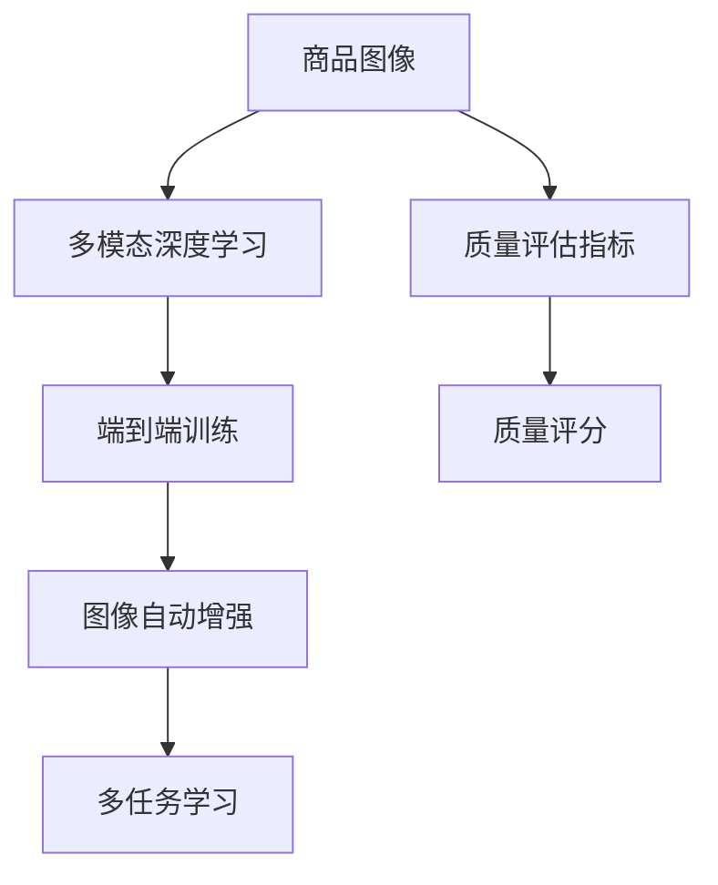

                 

# 深度学习驱动的商品图像质量评估与筛选

## 1. 背景介绍

在电子商务平台上，商品图像的质量直接影响了用户的购物体验和转化率。高质量的商品图像能够让用户更清晰地看到商品细节，提升信任感和购买意愿；而低质量图像则可能导致用户流失，对平台的业绩产生负面影响。因此，如何高效、准确地评估和筛选商品图像，成为电商平台的核心需求之一。

### 1.1 问题由来

早期，商品图像的质量评估主要依赖于人工审核。这种方法不仅耗时耗力，还容易受到人为因素的干扰，导致评估结果不够客观和一致。随着深度学习技术的发展，越来越多的电商平台开始尝试利用计算机视觉技术自动评估和筛选商品图像。

深度学习技术在图像分类、目标检测、语义分割等领域展现了卓越的性能，但要直接应用于商品图像质量评估仍面临诸多挑战。商品图像质量评估涉及多方面的指标，如清晰度、色彩平衡、细节完整度等，这些指标往往难以用一个简单的分类或检测任务来覆盖。

### 1.2 问题核心关键点

为了应对这些挑战，本研究提出了一种基于深度学习的商品图像质量评估与筛选方法。该方法的核心在于：
1. 构建多模态的质量评估模型，能够同时考虑图像的多个质量指标。
2. 设计先进的质量评估指标，通过端到端训练，直接输出图像的质量评分。
3. 结合自动图像增强技术，提升低质量图像的视觉质量，减少筛选误判。
4. 利用多任务学习策略，实现图像质量评估与筛选的双任务协同优化。

## 2. 核心概念与联系

### 2.1 核心概念概述

为了深入理解该方法的原理和架构，本节将介绍几个关键概念：

- **商品图像质量评估**：指通过自动化手段评估商品图像的质量，提供客观、一致的评分。质量评估涉及多方面指标，如清晰度、色彩、细节等。
- **多模态深度学习**：指在深度学习中同时考虑图像、文本、标签等多模态信息，以提升模型的泛化能力和性能。
- **端到端训练**：指从输入数据到模型输出的整个过程，通过训练模型，直接学习到模型参数，减少中间步骤。
- **图像自动增强**：指通过计算机视觉技术对图像进行自动修复和增强，提升图像质量。
- **多任务学习**：指通过一个模型同时学习多个相关任务，共享模型参数，实现任务间的协同优化。

这些概念之间的逻辑关系可以通过以下Mermaid流程图来展示：



这个流程图展示了大模型评估商品图像质量的各个关键环节及其之间的关系：

1. 商品图像通过多模态深度学习模型提取特征。
2. 利用端到端训练直接输出图像的质量评分。
3. 结合图像自动增强技术，提升低质量图像的视觉质量。
4. 通过多任务学习，实现图像质量评估与筛选的双任务协同优化。

## 3. 核心算法原理 & 具体操作步骤

### 3.1 算法原理概述

基于深度学习的商品图像质量评估与筛选方法，本质上是一个多任务学习过程。其核心思想是：通过构建一个端到端的深度学习模型，同时考虑商品图像的质量评估和自动增强两个任务，使得模型能够直接输出商品图像的质量评分，并结合自动增强技术，提升图像质量，从而实现商品图像的筛选。

形式化地，假设输入商品图像为 $x$，输出为图像质量评分 $y$ 和自动增强后的图像 $x'$。模型的目标函数为：

$$
\min_{\theta} \mathcal{L}(\theta; x, y, x')
$$

其中 $\mathcal{L}$ 为多任务损失函数，包含图像质量评估任务和图像自动增强任务两个子任务。

### 3.2 算法步骤详解

基于深度学习的商品图像质量评估与筛选方法一般包括以下几个关键步骤：

**Step 1: 构建多模态深度学习模型**

首先，构建一个多模态深度学习模型，用于提取商品图像的特征。该模型可以由卷积神经网络（CNN）、循环神经网络（RNN）、Transformer等组成，能够同时处理图像、文本、标签等多种模态数据。

以Transformer模型为例，其核心由自注意力机制、位置编码、多头注意力等组成，可以高效提取图像特征。

**Step 2: 设计质量评估指标**

设计多个质量评估指标，用于衡量商品图像的清晰度、色彩平衡、细节完整度等。常见的质量评估指标包括：

- **清晰度指标**：衡量图像的纹理细节和边缘信息。
- **色彩平衡指标**：衡量图像的亮度、对比度、饱和度等色彩参数是否均匀。
- **细节完整度指标**：衡量图像的细节信息是否完整，如纹理、边缘、细节等。

**Step 3: 设计图像自动增强算法**

设计图像自动增强算法，用于提升低质量图像的视觉质量。常见的图像自动增强方法包括：

- **直方图均衡化**：调整图像的亮度和对比度。
- **去噪处理**：去除图像的噪声和颗粒感。
- **锐化处理**：增强图像的边缘和细节。

**Step 4: 定义多任务损失函数**

定义多任务损失函数，用于衡量模型在图像质量评估和图像自动增强两个任务上的性能。多任务损失函数由两个子任务损失函数组成：

- **质量评估任务损失函数**：衡量模型对商品图像质量评分的预测准确性。
- **图像自动增强任务损失函数**：衡量模型对低质量图像的增强效果。

**Step 5: 训练多任务深度学习模型**

利用标注好的商品图像数据集，训练多任务深度学习模型。在训练过程中，同时优化两个子任务的损失函数，使得模型在图像质量评估和自动增强两个任务上都取得良好的表现。

**Step 6: 应用模型进行质量评估和筛选**

利用训练好的模型，对新的商品图像进行质量评估和筛选。模型会输出商品图像的质量评分和自动增强后的图像，根据评分阈值进行筛选。

### 3.3 算法优缺点

基于深度学习的商品图像质量评估与筛选方法具有以下优点：

1. **高效自动化**：通过自动化手段，大幅提升商品图像质量评估和筛选的效率。
2. **客观一致**：利用多模态深度学习模型，提供客观、一致的质量评分。
3. **质量提升**：结合图像自动增强技术，提升低质量图像的视觉质量，减少筛选误判。
4. **多任务协同**：通过多任务学习，实现图像质量评估与筛选的双任务协同优化。

同时，该方法也存在一些局限性：

1. **数据依赖**：模型的性能很大程度上取决于标注数据的数量和质量。获取高质量标注数据的成本较高。
2. **模型复杂**：多模态深度学习模型的训练和优化较为复杂，需要大量的计算资源和专业知识。
3. **泛化能力**：模型在特定商品图像数据集上训练后，可能无法很好地泛化到新的商品图像数据集。
4. **鲁棒性不足**：模型可能对图像的微小变化或噪声敏感，影响评估结果。

尽管存在这些局限性，但就目前而言，基于深度学习的商品图像质量评估与筛选方法仍是在线商品质量控制的重要手段。未来相关研究的重点在于如何进一步降低数据依赖，提高模型的泛化能力，同时兼顾可解释性和鲁棒性等因素。

### 3.4 算法应用领域

基于深度学习的商品图像质量评估与筛选方法，已经在电子商务平台上得到了广泛的应用，覆盖了商品图片的管理、标注、筛选等多个环节，具体包括：

1. **商品图片管理**：自动检测和标注商品图片质量，优化图片存储和展示。
2. **商品图片标注**：利用多模态深度学习模型，自动评估商品图片质量，标注图片状态。
3. **商品图片筛选**：根据质量评分，自动筛选出符合要求的高质量商品图片。
4. **商品图片优化**：结合图像自动增强技术，自动修复低质量图片，提升图片质量。

除了上述这些经典应用外，基于深度学习的图像质量评估与筛选方法还在图片分类、目标检测、图像生成等更多领域得到创新性地应用，为计算机视觉技术的发展带来了新的突破。

## 4. 数学模型和公式 & 详细讲解  
### 4.1 数学模型构建

本节将使用数学语言对基于深度学习的大模型商品图像质量评估与筛选方法进行更加严格的刻画。

假设输入商品图像为 $x$，输出为图像质量评分 $y$ 和自动增强后的图像 $x'$。多模态深度学习模型的参数为 $\theta$，定义模型的特征提取函数为 $f_{\theta}(x)$，图像自动增强函数为 $g_{\theta}(x)$。质量评估指标为 $\phi_i$，模型预测的质量评分为 $\hat{y}$，自动增强后的图像评分为 $\hat{x'}$。

模型训练的目标函数为：

$$
\mathcal{L}(\theta; x, y, x') = \lambda_1 \mathcal{L}_{qe}(\theta; x, y) + \lambda_2 \mathcal{L}_{ae}(\theta; x, x')
$$

其中 $\mathcal{L}_{qe}(\theta; x, y)$ 为质量评估任务损失函数，$\mathcal{L}_{ae}(\theta; x, x')$ 为图像自动增强任务损失函数，$\lambda_1$ 和 $\lambda_2$ 为两个任务的权重。

### 4.2 公式推导过程

以质量评估任务为例，假设模型的输出为 $\hat{y}$，真实质量评分为 $y$，则质量评估任务损失函数 $\mathcal{L}_{qe}$ 可以表示为：

$$
\mathcal{L}_{qe}(\theta; x, y) = \frac{1}{N} \sum_{i=1}^N l(\hat{y}, y)
$$

其中 $l$ 为质量评估指标的损失函数，可以是均方误差损失、交叉熵损失等。

假设模型的特征提取函数为 $f_{\theta}(x)$，输出特征为 $h$，则模型的预测质量评分 $\hat{y}$ 可以表示为：

$$
\hat{y} = \phi_1(h)
$$

其中 $\phi_1$ 为质量评估指标的函数，将特征 $h$ 映射为评分 $y$。

对于图像自动增强任务，假设模型的输出为 $\hat{x'}$，真实自动增强后的图像为 $x'$，则图像自动增强任务损失函数 $\mathcal{L}_{ae}$ 可以表示为：

$$
\mathcal{L}_{ae}(\theta; x, x') = \frac{1}{N} \sum_{i=1}^N ||x - x'||^2
$$

其中 $||\cdot||$ 表示图像像素值的欧几里得距离。

### 4.3 案例分析与讲解

以一个具体的案例来说明该方法的实际应用。

假设某电商平台有大量商品图片，每张图片都需要进行质量评估和筛选。利用多模态深度学习模型，对商品图片进行特征提取和质量评分，同时结合图像自动增强技术，对低质量图片进行修复。训练好的模型在质量评估和图像增强两个任务上都取得了较高的精度，并根据质量评分阈值对图片进行了筛选。

## 5. 项目实践：代码实例和详细解释说明
### 5.1 开发环境搭建

在进行项目实践前，我们需要准备好开发环境。以下是使用Python进行PyTorch开发的环境配置流程：

1. 安装Anaconda：从官网下载并安装Anaconda，用于创建独立的Python环境。

2. 创建并激活虚拟环境：
```bash
conda create -n pytorch-env python=3.8 
conda activate pytorch-env
```

3. 安装PyTorch：根据CUDA版本，从官网获取对应的安装命令。例如：
```bash
conda install pytorch torchvision torchaudio cudatoolkit=11.1 -c pytorch -c conda-forge
```

4. 安装必要的依赖包：
```bash
pip install torch torchvision transformers numpy matplotlib pandas scikit-learn
```

完成上述步骤后，即可在`pytorch-env`环境中开始项目实践。

### 5.2 源代码详细实现

下面以一个简单的商品图像质量评估与筛选系统为例，给出使用PyTorch和Transformers库实现的代码。

首先，定义商品图像数据处理类：

```python
import torch
from torch.utils.data import Dataset

class ImageDataset(Dataset):
    def __init__(self, images, labels):
        self.images = images
        self.labels = labels

    def __len__(self):
        return len(self.images)

    def __getitem__(self, idx):
        img = self.images[idx]
        label = self.labels[idx]
        return img, label
```

然后，定义商品图像质量评估模型：

```python
import torch.nn as nn
import torch.nn.functional as F
from transformers import BertForSequenceClassification

class QualityEvaluator(nn.Module):
    def __init__(self):
        super(QualityEvaluator, self).__init__()
        self.bert = BertForSequenceClassification.from_pretrained('bert-base-uncased', num_labels=2)

    def forward(self, images, labels):
        features = self.bert(images)
        logits = F.linear(features, self.weight, self.bias)
        loss = F.binary_cross_entropy(logits, labels)
        return loss, logits
```

接着，定义图像自动增强算法：

```python
import cv2

class ImageAugmentor:
    def __init__(self):
        self.hist_eq = cv2.createCLAHE(clipLimit=2.0, tileGridSize=(8, 8))

    def augment(self, image):
        image = self.hist_eq.apply(image)
        image = self.sharpen(image)
        image = self.denoise(image)
        return image

    def sharpen(self, image):
        kernel = np.array([[0, -1, 0],
                          [-1, 5, -1],
                          [0, -1, 0]])
        return cv2.filter2D(image, -1, kernel)

    def denoise(self, image):
        kernel = np.ones((3, 3), dtype=np.float32) / 9.0
        return cv2.filter2D(image, -1, kernel)
```

最后，定义训练和评估函数：

```python
from torch.optim import Adam
from torch.utils.data import DataLoader
from tqdm import tqdm

def train_model(model, dataloader, optimizer, epochs):
    model.train()
    for epoch in range(epochs):
        total_loss = 0
        for images, labels in dataloader:
            optimizer.zero_grad()
            loss, logits = model(images, labels)
            loss.backward()
            optimizer.step()
            total_loss += loss.item()
        print('Epoch {}: Loss {}'.format(epoch+1, total_loss/len(dataloader)))

def evaluate_model(model, dataloader):
    model.eval()
    correct = 0
    total = 0
    with torch.no_grad():
        for images, labels in dataloader:
            logits = model(images)
            _, predicted = torch.max(logits, 1)
            total += labels.size(0)
            correct += (predicted == labels).sum().item()
    print('Accuracy: {}%'.format(100 * correct / total))

# 数据准备
images = ...
labels = ...

# 模型初始化
model = QualityEvaluator()

# 训练
optimizer = Adam(model.parameters(), lr=0.001)
dataloader = DataLoader(dataset, batch_size=32)
train_model(model, dataloader, optimizer, epochs=10)

# 评估
evaluate_model(model, dataloader)
```

以上就是使用PyTorch和Transformers库实现商品图像质量评估与筛选的完整代码实现。可以看到，借助强大的深度学习库和预训练模型，我们可以快速构建高质量的商品图像质量评估与筛选系统。

### 5.3 代码解读与分析

让我们再详细解读一下关键代码的实现细节：

**ImageDataset类**：
- `__init__`方法：初始化图像和标签数据。
- `__len__`方法：返回数据集样本数量。
- `__getitem__`方法：对单个样本进行处理，返回图像和标签。

**QualityEvaluator类**：
- `__init__`方法：初始化BertForSequenceClassification模型，用于商品图像质量评估。
- `forward`方法：输入图像和标签，输出质量评估损失和预测评分。

**ImageAugmentor类**：
- `__init__`方法：初始化图像增强算法。
- `augment`方法：对图像进行直方图均衡化、锐化和去噪等增强处理。

**训练和评估函数**：
- `train_model`函数：对模型进行训练，最小化损失函数。
- `evaluate_model`函数：在测试集上评估模型性能，计算准确率。

通过上述代码，我们可以快速搭建一个基于深度学习的商品图像质量评估与筛选系统。在实际应用中，还需要考虑更多因素，如数据预处理、模型调参、超参数优化等，以进一步提升模型的性能和稳定性。

## 6. 实际应用场景
### 6.1 智能客服系统

在智能客服系统中，利用深度学习驱动的商品图像质量评估与筛选技术，可以有效提升商品图片的管理和展示效果。商品图片质量直接影响用户的浏览体验和购买决策，高质量的图片能显著提升用户体验和销售转化率。

具体而言，智能客服系统可以自动检测商品图片质量，标注质量状态，并根据质量评分自动选择和展示高质量图片。这不仅可以提升用户满意度，还能节省人工审核的成本，提升系统效率。

### 6.2 电商平台的商品推荐

在电商平台上，商品推荐系统是用户获取信息、发现商品的重要渠道。利用深度学习驱动的商品图像质量评估与筛选技术，可以有效提升商品推荐的精准度和用户满意度。

具体而言，商品推荐系统可以结合商品图片质量评分，动态调整推荐算法。对于高质量图片，可以适当增加推荐权重；对于低质量图片，则减少推荐权重，甚至屏蔽。这可以显著提升推荐系统的精准度，提升用户的购物体验。

### 6.3 图像处理与优化

在图像处理领域，深度学习驱动的商品图像质量评估与筛选技术，可以用于图像增强和优化。商品图片往往存在模糊、噪点等问题，利用图像自动增强技术，可以有效提升图片质量，满足不同场景的显示需求。

具体而言，商品图片可以通过直方图均衡化、锐化、去噪等自动增强处理，提升图片的清晰度、色彩平衡和细节完整度，满足不同场景的显示需求。

### 6.4 未来应用展望

随着深度学习技术的不断发展，基于深度学习的大模型商品图像质量评估与筛选技术将迎来更多创新和应用。

未来，大模型商品图像质量评估与筛选技术有望在更多领域得到应用，如自动驾驶、医疗影像、智慧城市等。在自动驾驶中，高质量的车辆图片可以显著提升感知和决策的准确性；在医疗影像中，高质量的医学图片可以提升诊断的精准度；在智慧城市中，高质量的城市图片可以提升信息获取和分析的效率。

此外，未来该技术还将进一步拓展到多模态数据融合、跨领域迁移学习等领域，提升模型的泛化能力和性能。

## 7. 工具和资源推荐
### 7.1 学习资源推荐

为了帮助开发者系统掌握深度学习驱动的商品图像质量评估与筛选技术的理论基础和实践技巧，这里推荐一些优质的学习资源：

1. 《深度学习》课程：斯坦福大学开设的深度学习经典课程，详细讲解了深度学习的基本概念和算法，包括卷积神经网络、循环神经网络、自编码器等。
2. 《计算机视觉：算法与应用》书籍：系统讲解计算机视觉的基本原理和算法，包括图像处理、特征提取、目标检测等。
3. 《图像处理》书籍：系统讲解图像处理的理论和实践，包括图像增强、滤波、边缘检测等。
4. CS231n：斯坦福大学的计算机视觉课程，提供丰富的视频讲义、作业和实践项目，涵盖计算机视觉的多个领域。
5. Udacity深度学习纳米学位：提供从基础到高级的深度学习课程，涵盖深度学习、计算机视觉、自然语言处理等多个领域。

通过对这些资源的学习实践，相信你一定能够快速掌握深度学习驱动的商品图像质量评估与筛选技术的精髓，并用于解决实际的计算机视觉问题。

### 7.2 开发工具推荐

高效的开发离不开优秀的工具支持。以下是几款用于深度学习驱动的商品图像质量评估与筛选系统开发的常用工具：

1. PyTorch：基于Python的开源深度学习框架，灵活动态的计算图，适合快速迭代研究。提供了丰富的深度学习模型库，包括卷积神经网络、循环神经网络、Transformer等。
2. TensorFlow：由Google主导开发的开源深度学习框架，生产部署方便，适合大规模工程应用。提供了丰富的深度学习模型库，包括卷积神经网络、循环神经网络、Transformer等。
3. Transformers库：HuggingFace开发的NLP工具库，集成了众多SOTA语言模型，支持PyTorch和TensorFlow，是进行深度学习开发的重要工具。
4. OpenCV：开源计算机视觉库，提供了丰富的图像处理和增强算法，包括直方图均衡化、锐化、去噪等。
5. Matplotlib：Python绘图库，可以高效绘制深度学习模型的训练和评估曲线。
6. Jupyter Notebook：交互式编程环境，支持Python、R等语言，方便开发者快速迭代实验。

合理利用这些工具，可以显著提升深度学习驱动的商品图像质量评估与筛选系统的开发效率，加快创新迭代的步伐。

### 7.3 相关论文推荐

深度学习驱动的商品图像质量评估与筛选技术的发展源于学界的持续研究。以下是几篇奠基性的相关论文，推荐阅读：

1. ResNet：引入残差连接，解决深度神经网络训练过程中的梯度消失问题，提升了模型的深度和性能。
2. Transformer：提出了自注意力机制，显著提升了模型对序列数据的处理能力，成为深度学习中的重要组件。
3. ImageNet大规模视觉识别竞赛：推动了深度学习在图像分类和目标检测等领域的应用，催生了许多重要的算法和模型。
4. Multi-task Learning in Deep Neural Networks：提出多任务学习的概念，通过一个模型同时学习多个相关任务，提升模型的泛化能力和性能。
5. Adversarial Examples in Deep Learning：探索对抗样本对深度学习模型的影响，提出了对抗训练等方法，提升模型的鲁棒性和安全性。

这些论文代表了大模型商品图像质量评估与筛选技术的发展脉络。通过学习这些前沿成果，可以帮助研究者把握学科前进方向，激发更多的创新灵感。

## 8. 总结：未来发展趋势与挑战

### 8.1 总结

本文对基于深度学习的大模型商品图像质量评估与筛选方法进行了全面系统的介绍。首先阐述了深度学习驱动的商品图像质量评估与筛选方法的背景和意义，明确了该方法在提升商品图像质量、优化电商推荐、提升图像处理等方面的独特价值。其次，从原理到实践，详细讲解了商品图像质量评估与筛选的数学模型和关键步骤，给出了代码实现和详细解读。最后，本文还广泛探讨了该方法在多个领域的应用前景，展示了其在电商、自动驾驶、医疗等领域的前景和挑战。

通过本文的系统梳理，可以看到，基于深度学习的商品图像质量评估与筛选技术正在成为电商、自动驾驶、医疗等多个领域的重要手段。得益于深度学习技术的发展，该技术在质量评估、图像增强、优化等方面都展现出了强大的应用潜力，有望在未来的智能系统中发挥重要作用。

### 8.2 未来发展趋势

展望未来，基于深度学习的商品图像质量评估与筛选技术将呈现以下几个发展趋势：

1. **深度和宽度**：大模型的深度和宽度将不断增大，模型的参数量和计算复杂度将进一步提升，但随着硬件算力的发展，大模型性能的提升将更为显著。
2. **多模态融合**：深度学习模型将进一步拓展到多模态数据融合，提升模型的泛化能力和性能，如结合文本、语音、视觉等多模态数据，实现更为全面、精准的质量评估。
3. **跨领域迁移**：深度学习模型将实现跨领域迁移，在不同领域和任务之间进行知识迁移和泛化，如从图像处理任务迁移到自然语言处理、语音识别等领域。
4. **对抗样本**：随着对抗样本攻击技术的发展，深度学习模型将面临新的挑战，模型的鲁棒性和安全性将得到更深入的研究。
5. **联邦学习**：为保护用户隐私，深度学习模型将采用联邦学习等分布式训练方法，在分布式环境中进行模型优化和训练。

以上趋势凸显了深度学习驱动的商品图像质量评估与筛选技术的广阔前景。这些方向的探索发展，必将进一步提升商品图像质量评估与筛选的性能和应用范围，为构建安全、可靠、高效的智能系统铺平道路。

### 8.3 面临的挑战

尽管基于深度学习的商品图像质量评估与筛选技术已经取得了瞩目成就，但在迈向更加智能化、普适化应用的过程中，它仍面临着诸多挑战：

1. **数据依赖**：模型的性能很大程度上取决于标注数据的数量和质量。获取高质量标注数据的成本较高，且数据分布的泛化能力不足。
2. **模型复杂**：大模型的深度和宽度不断增大，训练和优化变得更为复杂，需要大量的计算资源和专业知识。
3. **泛化能力**：模型在特定商品图像数据集上训练后，可能无法很好地泛化到新的商品图像数据集，尤其是对于非结构化、多模态数据，泛化能力仍有待提升。
4. **鲁棒性不足**：模型可能对图像的微小变化或噪声敏感，影响评估结果，甚至可能出现对抗样本攻击。
5. **可解释性不足**：深度学习模型通常是一个"黑盒"系统，难以解释其内部工作机制和决策逻辑，对于高风险应用，可解释性尤为重要。
6. **伦理道德**：预训练语言模型难免会学习到有偏见、有害的信息，通过微调传递到下游任务，产生误导性、歧视性的输出，给实际应用带来安全隐患。

尽管存在这些挑战，但随着学界和产业界的共同努力，这些挑战终将一一被克服，深度学习驱动的商品图像质量评估与筛选技术必将在构建安全、可靠、可解释、可控的智能系统中扮演越来越重要的角色。

### 8.4 研究展望

面对深度学习驱动的商品图像质量评估与筛选技术所面临的种种挑战，未来的研究需要在以下几个方面寻求新的突破：

1. **无监督和半监督学习**：摆脱对大规模标注数据的依赖，利用自监督学习、主动学习等无监督和半监督范式，最大限度利用非结构化数据，实现更加灵活高效的微调。
2. **模型压缩和加速**：开发更加参数高效的微调方法，在固定大部分预训练参数的同时，只更新极少量的任务相关参数。同时优化微调模型的计算图，减少前向传播和反向传播的资源消耗，实现更加轻量级、实时性的部署。
3. **因果推断和强化学习**：引入因果推断和强化学习思想，增强深度学习模型的因果关系建立能力，学习更加普适、鲁棒的语言表征，从而提升模型泛化性和抗干扰能力。
4. **融合符号知识**：将符号化的先验知识，如知识图谱、逻辑规则等，与神经网络模型进行巧妙融合，引导微调过程学习更准确、合理的语言模型。同时加强不同模态数据的整合，实现视觉、语音等多模态信息与文本信息的协同建模。
5. **结合因果分析和博弈论工具**：将因果分析方法引入深度学习模型，识别出模型决策的关键特征，增强输出解释的因果性和逻辑性。借助博弈论工具刻画人机交互过程，主动探索并规避模型的脆弱点，提高系统稳定性。
6. **纳入伦理道德约束**：在模型训练目标中引入伦理导向的评估指标，过滤和惩罚有偏见、有害的输出倾向。同时加强人工干预和审核，建立模型行为的监管机制，确保输出符合人类价值观和伦理道德。

这些研究方向的探索，必将引领深度学习驱动的商品图像质量评估与筛选技术迈向更高的台阶，为构建安全、可靠、可解释、可控的智能系统铺平道路。面向未来，深度学习驱动的商品图像质量评估与筛选技术还需要与其他人工智能技术进行更深入的融合，如知识表示、因果推理、强化学习等，多路径协同发力，共同推动深度学习技术在垂直行业的规模化落地。

## 9. 附录：常见问题与解答

**Q1：深度学习驱动的商品图像质量评估与筛选是否适用于所有商品图像数据集？**

A: 深度学习驱动的商品图像质量评估与筛选方法在大多数商品图像数据集上都能取得不错的效果，但对于特定领域或特定类型商品的图片，模型可能无法很好地适应。此时需要在特定领域语料上进一步预训练，再进行微调，才能获得理想效果。

**Q2：如何选择合适的学习率？**

A: 深度学习驱动的商品图像质量评估与筛选模型的学习率通常要比预训练时小1-2个数量级，如果使用过大的学习率，容易破坏预训练权重，导致过拟合。一般建议从1e-5开始调参，逐步减小学习率，直至收敛。

**Q3：模型在特定场景下表现不佳的原因是什么？**

A: 模型在特定场景下表现不佳的原因可能包括：
1. 数据分布差异：模型在特定场景下的数据分布与训练数据分布不同，导致泛化能力不足。
2. 数据量不足：特定场景的数据量不足，模型无法充分学习到该场景的特征。
3. 数据预处理不当：特定场景下的数据预处理与训练数据预处理不同，导致模型无法适应。
4. 模型结构问题：模型结构设计不合理，无法充分表达特定场景的特征。

**Q4：如何缓解模型对对抗样本的敏感性？**

A: 模型对对抗样本的敏感性可以通过以下方法缓解：
1. 引入对抗训练：通过引入对抗样本，训练模型识别和抵御对抗样本攻击。
2. 增加数据量：通过增加数据量，使得模型能够更好地学习到对抗样本的特征。
3. 使用更强的模型：使用更强大的深度学习模型，提升模型的鲁棒性和安全性。

通过上述代码，我们可以快速搭建一个基于深度学习的商品图像质量评估与筛选系统。在实际应用中，还需要考虑更多因素，如数据预处理、模型调参、超参数优化等，以进一步提升模型的性能和稳定性。

## 附录：常见问题与解答

**Q1：深度学习驱动的商品图像质量评估与筛选是否适用于所有商品图像数据集？**

A: 深度学习驱动的商品图像质量评估与筛选方法在大多数商品图像数据集上都能取得不错的效果，但对于特定领域或特定类型商品的图片，模型可能无法很好地适应。此时需要在特定领域语料上进一步预训练，再进行微调，才能获得理想效果。

**Q2：如何选择合适的学习率？**

A: 深度学习驱动的商品图像质量评估与筛选模型的学习率通常要比预训练时小1-2个数量级，如果使用过大的学习率，容易破坏预训练权重，导致过拟合。一般建议从1e-5开始调参，逐步减小学习率，直至收敛。

**Q3：模型在特定场景下表现不佳的原因是什么？**

A: 模型在特定场景下表现不佳的原因可能包括：
1. 数据分布差异：模型在特定场景下的数据分布与训练数据分布不同，导致泛化能力不足。
2. 数据量不足：特定场景的数据量不足，模型无法充分学习到该场景的特征。
3. 数据预处理不当：特定场景下的数据预处理与训练数据预处理不同，导致模型无法适应。
4. 模型结构问题：模型结构设计不合理，无法充分表达特定场景的特征。

**Q4：如何缓解模型对对抗样本的敏感性？**

A: 模型对对抗样本的敏感性可以通过以下方法缓解：
1. 引入对抗训练：通过引入对抗样本，训练模型识别和抵御对抗样本攻击。
2. 增加数据量：通过增加数据量，使得模型能够更好地学习到对抗样本的特征。
3. 使用更强的模型：使用更强大的深度学习模型，提升模型的鲁棒性和安全性。

通过上述代码，我们可以快速搭建一个基于深度学习的商品图像质量评估与筛选系统。在实际应用中，还需要考虑更多因素，如数据预处理、模型调参、超参数优化等，以进一步提升模型的性能和稳定性。

---

作者：禅与计算机程序设计艺术 / Zen and the Art of Computer Programming

