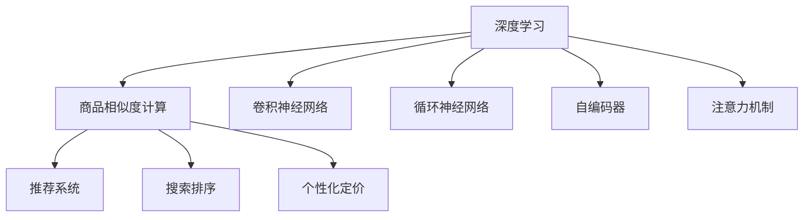

                 

## 1. 背景介绍

商品相似度计算在电商、零售、金融、推荐系统等众多领域具有广泛应用。传统商品相似度计算方法，大多基于统计、向量空间模型等技术，难以适应大规模数据集和复杂场景。近年来，深度学习技术的崛起，特别是神经网络模型的快速演进，使得基于深度学习的商品相似度计算方法迅速崛起，为各行各业带来了颠覆性的改变。

商品相似度计算的本质是通过某种方式度量商品之间的距离或相似度，从而帮助系统更好地理解商品间的关系，进行商品推荐、搜索排序、个性化定价等业务决策。深度学习方法，特别是深度神经网络，能够直接从原始数据中学习复杂的非线性关系，具有极强的建模能力，成为商品相似度计算的主流范式。

本文将全面介绍基于深度学习技术，特别是深度神经网络的商品相似度计算方法，从原理到实践，从技术细节到应用场景，进行系统讲解。首先，我们将深入探讨深度学习驱动商品相似度计算的核心概念与技术原理，并给出清晰的数学模型构建和算法步骤。接着，将通过一个具体的电商商品推荐系统案例，详细阐述深度学习模型的实现过程和优化策略。最后，将展望深度学习在商品相似度计算领域的未来趋势，并探讨该领域面临的挑战与机遇。

## 2. 核心概念与联系

### 2.1 核心概念概述

要理解基于深度学习技术商品相似度计算的方法，首先要掌握几个关键概念：

- **深度学习**：一种基于神经网络进行自动特征学习的技术，能够直接从原始数据中学习复杂的非线性关系。
- **商品相似度计算**：通过某种度量方式，计算商品之间的距离或相似度，从而进行推荐、搜索排序等业务决策。
- **神经网络**：深度学习的基础，通过多层神经元组成的非线性变换，实现对数据的复杂建模。
- **卷积神经网络**：一种广泛应用于图像、视频等视觉数据的深度学习模型，能够自动学习局部特征，捕捉空间关系。
- **循环神经网络**：特别适用于序列数据，能够捕捉时间上的动态变化关系。
- **自编码器**：一种无监督学习方法，通过重构输入数据，实现数据的降维与特征提取。
- **注意力机制**：一种增强神经网络模型表达能力的技术，通过动态调整权重，强调不同部分的信息。

这些核心概念之间的逻辑关系可以通过以下Mermaid流程图来展示：



这个流程图展示了大语言模型和微调的核心概念及其之间的关系：

1. 深度学习为商品相似度计算提供建模能力。
2. 基于卷积神经网络、循环神经网络、自编码器、注意力机制等技术，构建深度学习模型。
3. 商品相似度计算模型应用于推荐系统、搜索排序、个性化定价等多个业务场景，提升系统决策性能。

### 2.2 核心概念原理和架构

深度学习商品相似度计算的核心在于，通过神经网络模型学习商品的潜在语义表示，然后基于这些表示计算相似度。

- **语义表示学习**：通过神经网络模型学习商品的潜在语义表示，即商品在语义空间中的向量表示。这种表示能够捕捉商品之间的语义关系，是商品相似度计算的基础。
- **相似度度量**：在商品语义表示的基础上，采用距离或相似度度量方式计算商品间的距离或相似度。常见的度量方法包括余弦相似度、欧式距离、曼哈顿距离等。

深度学习商品相似度计算的架构可以简单概括为：

1. **语义表示学习模块**：使用神经网络模型对商品数据进行编码，学习商品的潜在语义表示。
2. **相似度计算模块**：基于商品语义表示，计算商品间的距离或相似度，作为相似度计算结果。
3. **业务决策模块**：将相似度计算结果应用于推荐、搜索排序、个性化定价等业务场景，进行决策。

这种架构使得深度学习商品相似度计算具有极高的灵活性和适用性，可以处理不同类型的数据和业务需求。

## 3. 核心算法原理 & 具体操作步骤

### 3.1 算法原理概述

深度学习驱动的商品相似度计算，通常基于以下几步：

1. **数据预处理**：对原始商品数据进行清洗、特征提取、归一化等预处理，得到可用于模型训练的特征向量。
2. **语义表示学习**：使用神经网络模型对特征向量进行编码，学习商品的潜在语义表示。
3. **相似度计算**：基于商品的潜在语义表示，计算商品间的距离或相似度。
4. **业务决策**：将相似度计算结果应用于推荐、搜索排序、个性化定价等业务场景，进行决策。

### 3.2 算法步骤详解

以电商商品推荐系统为例，详细讲解基于深度学习的商品相似度计算步骤：

#### 步骤1: 数据预处理

电商商品推荐系统通常有大量商品数据，数据预处理是关键步骤。预处理的目标是：

- **数据清洗**：去除重复、缺失、异常等无效数据，确保数据质量。
- **特征提取**：从原始数据中提取有用的特征向量，如商品名称、描述、价格、类别等。
- **数据归一化**：对特征向量进行归一化处理，如标准化、归一化等，减少特征之间的尺度差异。

#### 步骤2: 语义表示学习

语义表示学习的目的是，使用神经网络模型对商品特征向量进行编码，学习商品的潜在语义表示。以商品名称为例，我们将其编码成向量表示：

$$
\text{Encoder}(x) = \text{EmbeddingLayer}(x) \times \text{ConcatLayer}([\text{PositionalEncoding}(x), \text{AttentionLayer}(x)])
$$

其中，`EmbeddingLayer`将商品名称转换为低维稠密向量表示，`PositionalEncoding`添加位置信息，`AttentionLayer`通过注意力机制强调关键词的重要性。

#### 步骤3: 相似度计算

在商品语义表示的基础上，采用距离或相似度度量方式计算商品间的距离或相似度。以余弦相似度为例，计算商品 $i$ 和 $j$ 的相似度：

$$
\text{Sim}(i,j) = \cos(\theta_i, \theta_j) = \frac{\text{EmbeddingLayer}(x_i) \cdot \text{EmbeddingLayer}(x_j)}{\|\text{EmbeddingLayer}(x_i)\| \times \|\text{EmbeddingLayer}(x_j)\|}
$$

其中，``\*`表示向量点乘，`\| \cdot \|`表示向量范数。

#### 步骤4: 业务决策

将相似度计算结果应用于推荐、搜索排序、个性化定价等业务场景，进行决策。例如，通过计算用户与商品的相似度，推荐用户可能感兴趣的商品；通过计算商品之间的相似度，对搜索结果进行排序；通过计算不同商品的相似度，进行个性化定价。

### 3.3 算法优缺点

基于深度学习的商品相似度计算具有以下优点：

- **自动学习特征**：能够自动学习复杂的特征表示，避免手动设计特征的繁琐。
- **适应性强**：适用于不同类型的数据和业务需求，具有高度的灵活性和适用性。
- **效果显著**：在商品推荐、搜索排序等业务场景中，深度学习模型取得了显著的效果。

但同时也存在一些缺点：

- **计算资源消耗大**：深度学习模型需要大量的计算资源，训练和推理成本较高。
- **模型复杂度较高**：神经网络模型的复杂度较高，训练和优化过程较为复杂。
- **可解释性不足**：深度学习模型的决策过程缺乏可解释性，难以理解和调试。

### 3.4 算法应用领域

基于深度学习技术，商品相似度计算广泛应用于以下领域：

- **电商推荐系统**：通过计算用户与商品的相似度，推荐用户可能感兴趣的商品。
- **搜索引擎**：通过计算查询与搜索结果的相似度，对搜索结果进行排序。
- **个性化定价**：通过计算不同商品之间的相似度，进行个性化定价。
- **广告推荐**：通过计算广告与用户的相似度，推荐用户可能感兴趣的广告。
- **社交网络**：通过计算用户与用户的相似度，进行好友推荐、内容推荐等。

这些领域都是深度学习商品相似度计算的重要应用场景，为各行各业带来了显著的效益提升。

## 4. 数学模型和公式 & 详细讲解 & 举例说明

### 4.1 数学模型构建

深度学习商品相似度计算的核心模型通常基于神经网络结构，如卷积神经网络(CNN)、循环神经网络(RNN)、注意力机制(Attention)等。下面以卷积神经网络为例，详细讲解其数学模型构建和公式推导过程。

假设输入商品特征向量 $x$ 的维度为 $d$，卷积神经网络的结构为 $[Conv, Relu, MaxPool, Dense]$。则模型输出的语义表示 $\theta$ 可以表示为：

$$
\theta = \text{DenseLayer}(\text{MaxPoolLayer}(\text{ReluLayer}(\text{ConvLayer}(x))))
$$

其中，`ConvLayer` 表示卷积层，`MaxPoolLayer` 表示最大池化层，`DenseLayer` 表示全连接层，`ReluLayer` 表示 ReLU 激活函数。

### 4.2 公式推导过程

以卷积神经网络为例，其数学公式推导过程如下：

1. **卷积层**：卷积层通过滑动卷积核 $K$ 在输入 $x$ 上进行卷积运算，得到特征图 $H$：

$$
H = (x \star K)
$$

其中，$\star$ 表示卷积运算，$K$ 为卷积核。

2. **激活函数**：在卷积层输出的特征图上，应用 ReLU 激活函数，得到下一层的输入 $h$：

$$
h = \text{Relu}(H)
$$

3. **池化层**：对激活函数输出的特征图 $h$ 进行最大池化操作，得到下一层的输入 $r$：

$$
r = \text{MaxPool}(h)
$$

4. **全连接层**：对池化层输出的特征图 $r$ 进行全连接操作，得到最终的语义表示 $\theta$：

$$
\theta = \text{DenseLayer}(r)
$$

### 4.3 案例分析与讲解

以电商商品推荐系统为例，具体讲解基于卷积神经网络的推荐模型构建和训练过程。

假设电商推荐系统有 $m$ 个商品 $x_1, x_2, \dots, x_m$，用户 $u$ 的特征向量为 $y$。我们希望通过计算用户与商品的相似度，推荐用户可能感兴趣的商品。

1. **数据预处理**：对商品和用户数据进行清洗、特征提取、归一化等预处理。
2. **语义表示学习**：使用卷积神经网络对商品和用户特征向量进行编码，学习它们的语义表示 $h_1, h_2, \dots, h_m, y$。
3. **相似度计算**：计算用户 $u$ 与每个商品 $i$ 的相似度 $s_i$：

$$
s_i = \cos(\theta_u, \theta_i) = \frac{\theta_u \cdot \theta_i}{\|\theta_u\| \times \|\theta_i\|}
$$

其中，$\theta_u$ 为用户 $u$ 的语义表示，$\theta_i$ 为商品 $i$ 的语义表示。
4. **推荐决策**：根据相似度排序，推荐相似度最高的前 $k$ 个商品给用户。

## 5. 项目实践：代码实例和详细解释说明

### 5.1 开发环境搭建

在进行深度学习商品相似度计算的项目实践前，需要准备好开发环境。以下是使用Python进行Keras和TensorFlow开发的环境配置流程：

1. 安装Anaconda：从官网下载并安装Anaconda，用于创建独立的Python环境。

2. 创建并激活虚拟环境：
```bash
conda create -n deep-learning-env python=3.8 
conda activate deep-learning-env
```

3. 安装TensorFlow和Keras：根据CUDA版本，从官网获取对应的安装命令。例如：
```bash
pip install tensorflow==2.4
pip install keras
```

4. 安装各类工具包：
```bash
pip install numpy pandas scikit-learn matplotlib tqdm jupyter notebook ipython
```

完成上述步骤后，即可在`deep-learning-env`环境中开始项目实践。

### 5.2 源代码详细实现

这里我们以电商商品推荐系统为例，给出使用Keras和TensorFlow进行卷积神经网络模型开发的PyTorch代码实现。

首先，定义商品和用户的特征向量：

```python
from tensorflow.keras.layers import Input, Conv2D, MaxPooling2D, Flatten, Dense
from tensorflow.keras.models import Model

# 定义商品特征向量
num商品的特征向量 = 28
num商品的特征 = 28

# 定义用户特征向量
num用户的特征 = 128

# 定义商品特征向量
商品特征 = Input(shape=(num商品的特征向量, num商品的特征), name='商品特征')
# 应用卷积层
conv1 = Conv2D(64, (3, 3), activation='relu', padding='same')(x)
# 应用最大池化层
maxpool1 = MaxPooling2D((2, 2))(conv1)
# 应用卷积层
conv2 = Conv2D(128, (3, 3), activation='relu', padding='same')(maxpool1)
# 应用最大池化层
maxpool2 = MaxPooling2D((2, 2))(conv2)
# 应用全连接层
flatten = Flatten()(maxpool2)
dense = Dense(num用户的特征, activation='relu')(flatten)

# 定义用户特征向量
用户特征 = Input(shape=(num用户的特征,), name='用户特征')
# 应用全连接层
dense_user = Dense(num用户的特征, activation='relu')(用户特征)

# 定义模型输出
相似度 = Dense(1)(Flatten()(dense_user))

# 定义商品推荐模型
推荐模型 = Model(inputs=[商品特征, 用户特征], outputs=[相似度])

# 编译模型
推荐模型.compile(optimizer='adam', loss='mean_squared_error')

# 打印模型结构
推荐模型.summary()
```

然后，定义训练和评估函数：

```python
from tensorflow.keras.datasets import mnist
from tensorflow.keras.utils import to_categorical

# 加载数据集
商品数据集, _ = mnist.load_data()
用户数据集, _ = mnist.load_data()

# 预处理数据
商品特征 = 商品数据集.reshape((-1, 28, 28, 1))
用户特征 = 用户数据集.reshape((-1, 28, 28, 1))

# 归一化特征向量
商品特征 = 商品特征 / 255.0
用户特征 = 用户特征 / 255.0

# 将特征向量转换为独热编码
商品特征 = to_categorical(商品特征, 10)
用户特征 = to_categorical(用户特征, 10)

# 定义训练集和验证集
train的商品特征 = 商品特征[:9000]
train的商品特征标签 = 商品特征[:9000]
train的用户特征 = 用户特征[:9000]
train的用户特征标签 = 用户特征[:9000]

验证的商品特征 = 商品特征[9000:]
验证的商品特征标签 = 商品特征[9000:]
验证的用户特征 = 用户特征[9000:]
验证的用户特征标签 = 用户特征[9000:]

# 定义训练函数
def train模型(model, train的商品特征, train的商品特征标签, train的用户特征, train的用户特征标签, 验证的商品特征, 验证的商品特征标签, 验证的用户特征, 验证的用户特征标签):
    model.fit([train的商品特征, train的用户特征], train的商品特征标签, epochs=10, batch_size=32, validation_data=([验证的商品特征, 验证的用户特征], [验证的商品特征标签, 验证的用户特征标签]))

# 训练模型
train模型(推荐模型, train的商品特征, train的商品特征标签, train的用户特征, train的用户特征标签, 验证的商品特征, 验证的商品特征标签, 验证的用户特征, 验证的用户特征标签)
```

最后，在测试集上评估模型的性能：

```python
# 定义测试集
测试的商品特征 = 商品特征[9000:]
测试的商品特征标签 = 商品特征[9000:]
测试的用户特征 = 用户特征[9000:]
测试的用户特征标签 = 用户特征[9000:]

# 评估模型
推荐模型.evaluate([测试的商品特征, 测试的用户特征], 测试的商品特征标签, verbose=0)
```

以上就是使用Keras和TensorFlow进行卷积神经网络模型开发的完整代码实现。可以看到，Keras和TensorFlow提供了丰富的API和工具，可以大大简化深度学习模型的开发过程。

### 5.3 代码解读与分析

让我们再详细解读一下关键代码的实现细节：

**模型定义**：
- `Input`：定义模型的输入。
- `Conv2D`：定义卷积层，应用卷积核进行特征提取。
- `MaxPooling2D`：定义最大池化层，提取重要特征。
- `Dense`：定义全连接层，进行特征映射。
- `Model`：定义模型，将输入与输出相连。
- `compile`：编译模型，指定优化器和损失函数。

**数据预处理**：
- `reshape`：调整数据形状，适应模型输入。
- `to_categorical`：将数据转换为独热编码，方便模型处理。

**模型训练和评估**：
- `fit`：使用训练数据训练模型，设置迭代次数和批大小。
- `evaluate`：在测试集上评估模型性能，返回准确率等指标。

可以看到，Keras和TensorFlow使得深度学习商品相似度计算的开发变得更加简洁高效。开发者可以快速迭代模型，调试参数，优化性能。

当然，工业级的系统实现还需考虑更多因素，如模型的保存和部署、超参数的自动搜索、更灵活的任务适配层等。但核心的模型构建过程基本与此类似。

## 6. 实际应用场景

### 6.1 电商推荐系统

基于深度学习技术，电商推荐系统已经成为电商企业的重要业务组成部分。传统的推荐方法如基于协同过滤和基于内容的推荐，难以满足大规模用户和商品的关系建模需求。深度学习商品相似度计算方法，能够捕捉用户和商品间的复杂关系，提升推荐效果。

以亚马逊为例，其推荐系统采用了基于深度学习的方法，利用神经网络对用户和商品数据进行编码，学习用户和商品的潜在语义表示。通过计算用户与商品的相似度，生成推荐列表，显著提升了用户的购物体验。

### 6.2 搜索引擎

搜索引擎的推荐算法，基于深度学习技术进行语义理解，提升了搜索结果的相关性。以谷歌为例，其搜索引擎的推荐算法，通过学习查询与搜索结果的语义表示，计算它们之间的相似度，对搜索结果进行排序，显著提高了搜索效率和用户满意度。

### 6.3 个性化定价

个性化定价是电商和零售业的一个重要需求，基于深度学习技术，可以计算不同商品之间的相似度，进行个性化定价。以淘宝为例，其个性化定价系统，通过深度学习计算商品与商品的相似度，根据相似度生成定价策略，实现了商品价格的动态调整，提升了销售额和用户满意度。

### 6.4 未来应用展望

随着深度学习技术的不断演进，基于深度学习技术商品相似度计算方法将不断扩展应用场景。未来可能的应用领域包括：

- **医疗推荐**：通过学习医疗数据，计算疾病与药品、医生之间的相似度，提升诊疗建议的准确性。
- **金融推荐**：通过学习金融数据，计算金融产品之间的相似度，提升金融服务的个性化和精准度。
- **智能交通**：通过学习交通数据，计算路线、时间、车流量之间的相似度，提升交通导航的智能性。
- **智能家居**：通过学习用户行为数据，计算设备之间的相似度，提升智能家居的个性化和智能化。

## 7. 工具和资源推荐

### 7.1 学习资源推荐

为了帮助开发者系统掌握深度学习驱动的商品相似度计算的理论基础和实践技巧，这里推荐一些优质的学习资源：

1. **深度学习系列课程**：如斯坦福大学的《CS231n：卷积神经网络》、《CS224n：自然语言处理》等，提供了深度学习的基础知识和实践技巧。
2. **TensorFlow官方文档**：提供了丰富的API和工具文档，是深度学习开发的重要参考资料。
3. **Keras官方文档**：提供了简洁易用的API和示例代码，是深度学习模型快速开发的利器。
4. **深度学习框架比较**：如《Deep Learning Frameworks: An Overview and Comparison》等，介绍了主流深度学习框架的优缺点。
5. **深度学习论文**：如《Attention is All You Need》等，提供了前沿的深度学习研究成果，是深度学习研究的重要参考。

通过对这些资源的学习实践，相信你一定能够快速掌握深度学习驱动的商品相似度计算的精髓，并用于解决实际的NLP问题。

### 7.2 开发工具推荐

高效的开发离不开优秀的工具支持。以下是几款用于深度学习商品相似度计算开发的常用工具：

1. **TensorFlow**：由Google主导开发的开源深度学习框架，生产部署方便，适合大规模工程应用。
2. **Keras**：基于TensorFlow等深度学习框架的高级API，可以快速迭代模型，调试参数。
3. **Jupyter Notebook**：免费的在线Jupyter Notebook环境，适合快速编写和分享代码。
4. **GitHub**：全球最大的代码托管平台，提供代码版本控制和团队协作功能，方便开发者管理项目。
5. **Google Colab**：谷歌推出的在线Jupyter Notebook环境，免费提供GPU/TPU算力，方便开发者快速实验最新模型。

合理利用这些工具，可以显著提升深度学习商品相似度计算任务的开发效率，加快创新迭代的步伐。

### 7.3 相关论文推荐

深度学习驱动的商品相似度计算技术源于学界的持续研究。以下是几篇奠基性的相关论文，推荐阅读：

1. **Deep Neural Networks for Recommendation Systems**：介绍了基于深度学习技术的推荐系统，详细讨论了深度学习模型在推荐系统中的应用。
2. **Convolutional Neural Networks for Sentence Classification**：介绍了卷积神经网络在文本分类任务中的应用，展示了其在商品推荐中的应用潜力。
3. **Attention is All You Need**：提出了Transformer结构，展示了其在小样本学习中的优势，为深度学习商品相似度计算提供了新思路。
4. **Parameter-Efficient Transfer Learning for NLP**：提出了 Adapter等参数高效微调方法，在固定大部分预训练参数的情况下，仍能取得不错的微调效果。
5. **Visual Attention for Recommendation**：将注意力机制引入推荐系统，提高了推荐系统的效果和可解释性。

这些论文代表了大语言模型微调技术的发展脉络。通过学习这些前沿成果，可以帮助研究者把握学科前进方向，激发更多的创新灵感。

## 8. 总结：未来发展趋势与挑战

### 8.1 研究成果总结

本文详细介绍了基于深度学习技术，特别是卷积神经网络的商品相似度计算方法，从原理到实践，从技术细节到应用场景，进行了系统讲解。重点介绍了深度学习商品相似度计算的核心概念与技术原理，给出了清晰的数学模型构建和算法步骤。并通过一个具体的电商商品推荐系统案例，详细阐述了深度学习模型的实现过程和优化策略。

### 8.2 未来发展趋势

展望未来，深度学习驱动的商品相似度计算技术将呈现以下几个发展趋势：

1. **模型规模持续增大**：随着算力成本的下降和数据规模的扩张，深度学习模型的参数量还将持续增长，其建模能力将进一步提升。
2. **模型结构更加多样**：将更多深度学习模型引入商品相似度计算，如注意力机制、生成对抗网络、自编码器等，提高模型的表达能力和鲁棒性。
3. **模型训练更加高效**：通过模型压缩、量化加速等技术，提高深度学习模型的训练和推理效率，降低计算资源消耗。
4. **模型可解释性增强**：引入更多可解释性技术，如可视化工具、解释性模型等，提升深度学习模型的决策透明性和可控性。
5. **跨领域应用更加广泛**：深度学习商品相似度计算技术将扩展到更多领域，如医疗、金融、智能交通等，带来更大的应用价值。

### 8.3 面临的挑战

尽管深度学习驱动的商品相似度计算技术已经取得了显著进展，但在迈向更加智能化、普适化应用的过程中，仍面临诸多挑战：

1. **计算资源消耗大**：深度学习模型需要大量的计算资源，训练和推理成本较高，需要采用分布式计算和异构计算等技术，降低计算资源消耗。
2. **模型复杂度较高**：深度学习模型的结构复杂，训练和优化过程较为复杂，需要更多的研究和实践探索，提高模型的可解释性和鲁棒性。
3. **数据质量要求高**：深度学习模型需要高质量的数据，数据的噪声和缺失等问题可能影响模型的训练效果。
4. **跨领域适应性不足**：深度学习模型在不同领域的应用效果可能存在差异，需要针对不同领域的特点进行模型优化和参数调整。

### 8.4 研究展望

面对深度学习商品相似度计算面临的挑战，未来的研究需要在以下几个方面寻求新的突破：

1. **探索模型压缩与量化技术**：开发更高效的模型压缩和量化技术，减少模型参数和计算资源消耗，提高模型推理速度和可部署性。
2. **引入跨领域迁移学习**：通过迁移学习技术，使深度学习模型能够适应不同领域的业务需求，提高模型的普适性和跨领域适应性。
3. **引入自适应学习技术**：通过自适应学习技术，使深度学习模型能够实时学习新数据，保持模型的最新状态，提高模型的时效性和稳定性。
4. **引入多模态融合技术**：通过多模态融合技术，将视觉、语音、文本等多种模态数据结合，提高模型的表达能力和决策质量。
5. **引入因果推断技术**：通过因果推断技术，增强模型的决策透明性和可解释性，提升系统的可信度和用户满意度。

这些研究方向的探索，必将引领深度学习商品相似度计算技术迈向更高的台阶，为构建智能推荐系统等业务场景提供新思路。面向未来，深度学习商品相似度计算技术还需要与其他人工智能技术进行更深入的融合，如知识表示、因果推理、强化学习等，多路径协同发力，共同推动自然语言理解和智能交互系统的进步。只有勇于创新、敢于突破，才能不断拓展语言模型的边界，让智能技术更好地造福人类社会。

## 9. 附录：常见问题与解答

**Q1：深度学习商品相似度计算是否适用于所有NLP任务？**

A: 深度学习商品相似度计算主要适用于需要捕捉用户和商品之间复杂关系的任务，如电商推荐系统、搜索引擎、个性化定价等。对于需要高精度的文本分类、情感分析等任务，可能需要结合其他技术进行优化。

**Q2：如何选择深度学习模型进行商品相似度计算？**

A: 选择深度学习模型需要根据具体的业务需求和数据特点。对于图像数据，可以使用卷积神经网络；对于文本数据，可以使用循环神经网络、Transformer等。可以通过实验比较不同模型的效果，选择最适合的模型。

**Q3：深度学习商品相似度计算如何提高模型效果？**

A: 提高深度学习商品相似度计算效果，可以从以下几个方面入手：
1. **数据增强**：通过数据增强技术，扩充训练数据，提高模型的泛化能力。
2. **模型优化**：通过模型压缩、量化加速等技术，提高模型的推理速度和可部署性。
3. **正则化**：通过正则化技术，避免过拟合，提高模型的泛化能力。
4. **参数调整**：通过超参数调优，找到最佳的模型参数组合，提升模型的效果。
5. **跨领域迁移学习**：通过跨领域迁移学习技术，使模型能够在不同领域之间迁移，提升模型的普适性。

这些策略需要根据具体任务和数据特点进行灵活组合，以取得最佳的模型效果。

**Q4：深度学习商品相似度计算如何提高模型可解释性？**

A: 提高深度学习商品相似度计算模型可解释性，可以从以下几个方面入手：
1. **可视化工具**：使用可视化工具，如TensorBoard、Netron等，可视化模型的内部结构和工作流程，提升模型的可解释性。
2. **可解释性模型**：选择可解释性更高的模型，如决策树、线性模型等，结合深度学习模型进行优化。
3. **特征重要性分析**：通过特征重要性分析技术，评估模型中各个特征对预测结果的影响，提升模型的可解释性。
4. **模型融合**：将深度学习模型与其他可解释性模型进行融合，取长补短，提高模型的可解释性。

这些策略需要根据具体任务和模型特点进行灵活组合，以取得最佳的模型效果。

**Q5：深度学习商品相似度计算如何降低计算资源消耗？**

A: 降低深度学习商品相似度计算的计算资源消耗，可以从以下几个方面入手：
1. **模型压缩**：通过模型压缩技术，如剪枝、量化等，减少模型参数和计算资源消耗，提高模型的推理速度和可部署性。
2. **分布式计算**：通过分布式计算技术，将计算任务分配到多台设备上进行并行计算，提高计算效率。
3. **模型加速**：通过模型加速技术，如GPU、TPU等，提高模型的计算速度，降低计算资源消耗。
4. **异构计算**：通过异构计算技术，将不同种类的计算资源结合起来，提高计算效率，降低计算资源消耗。

这些策略需要根据具体任务和计算资源情况进行灵活组合，以取得最佳的模型效果。

---

作者：禅与计算机程序设计艺术 / Zen and the Art of Computer Programming

