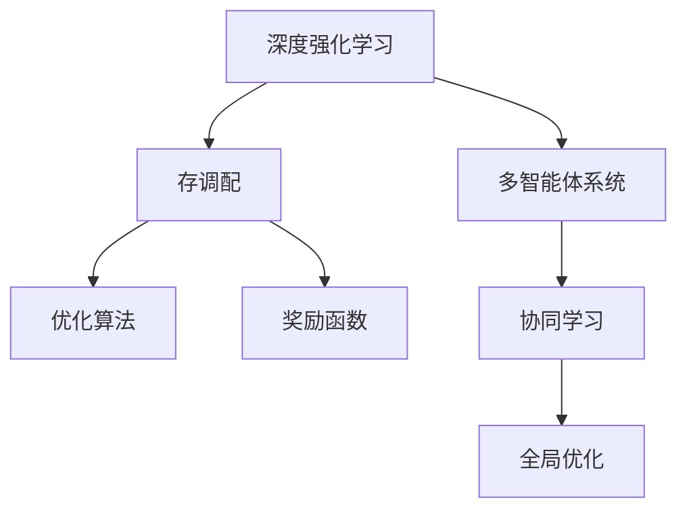

                 

# 深度强化学习在多仓库存调配中的实践

> 关键词：深度强化学习,多仓库,存调配,优化算法,奖励函数

## 1. 背景介绍

### 1.1 问题由来
随着供应链管理复杂度的不断增加，多仓库存调配问题成为许多企业关注的焦点。然而，传统的基于规则的存调配策略已无法满足快速变化的市场需求和资源约束。基于深度强化学习的多仓库存调配算法，通过模拟环境、学习并优化仓库间物流调度，已成为解决这一复杂问题的重要手段。

多仓库存调配问题的核心在于如何通过优化仓库间的物流调度，实现供应链成本的最小化，并提高服务响应速度。传统的存调配策略主要依赖于静态的规则库或历史数据，难以适应不确定性和动态变化的市场环境。而强化学习通过与环境的互动，逐步学习最优的存调配策略，能够应对复杂的存调配场景。

### 1.2 问题核心关键点
深度强化学习在多仓库存调配中的应用，关键在于构建一个多智能体协同系统，并设计合理的奖励函数和优化算法，以最大化总体的存调配收益。

1. **系统设计**：多仓库存调配系统包括多个仓库节点，每个节点具有不同的存储容量和成本，需要协调一致，实现全局优化。
2. **奖励函数设计**：奖励函数应综合考虑存调配成本、响应速度、库存水平等因素，指导智能体的行动。
3. **优化算法选择**：常用的优化算法包括Q-learning、深度Q网络(DQN)、策略梯度等，需要根据具体问题特点进行选择。
4. **模型训练与评估**：训练过程中需定期评估模型性能，根据结果调整策略，确保模型收敛。

### 1.3 问题研究意义
深度强化学习在多仓库存调配中的应用，具有重要的研究意义和实际价值：

1. **优化供应链成本**：通过智能化的存调配策略，可显著降低物流成本，提高效率。
2. **提升服务响应速度**：智能化的存调配系统能够快速响应市场需求，满足客户对响应速度的需求。
3. **增强库存管理能力**：优化库存水平，降低库存持有成本，减少过剩或短缺库存现象。
4. **适应动态市场环境**：强化学习能够适应供应链环境的快速变化，保持存调配策略的灵活性和鲁棒性。
5. **推动供应链数字化转型**：多仓库存调配的智能化，是推动供应链数字化转型的重要方向。

## 2. 核心概念与联系

### 2.1 核心概念概述

为更好地理解深度强化学习在多仓库存调配中的应用，本节将介绍几个密切相关的核心概念：

- **深度强化学习(Deep Reinforcement Learning, DRL)**：结合深度神经网络和强化学习，通过智能体与环境的交互，逐步学习最优决策策略。
- **多智能体系统(Multi-Agent System,MAS)**：由多个智能体组成的分布式系统，每个智能体具有独立的决策能力和通信能力。
- **存调配(Inventory Replenishment)**：仓库间的物料调配，涉及库存管理、物流成本、需求预测等多个因素。
- **优化算法(Optimization Algorithm)**：用于求解多仓库存调配问题的方法，包括Q-learning、DQN、策略梯度等。
- **奖励函数(Reward Function)**：衡量智能体行为的奖励函数，指导智能体的行动方向和策略。
- **协同学习(Cooperative Learning)**：多智能体之间的合作学习，实现全局优化。

这些核心概念之间的逻辑关系可以通过以下Mermaid流程图来展示：



这个流程图展示了大语言模型的核心概念及其之间的关系：

1. 深度强化学习通过智能体与环境的互动，逐步学习最优决策策略。
2. 多智能体系统由多个独立决策能力的智能体组成，实现全局优化。
3. 存调配问题涉及仓库间的物料调配，优化库存水平和物流成本。
4. 优化算法用于求解多仓库存调配问题。
5. 奖励函数指导智能体的行动方向，衡量行动的优劣。
6. 协同学习实现多智能体之间的合作，提升整体性能。

这些概念共同构成了深度强化学习在多仓库存调配中的应用框架，使其能够在复杂的环境下学习最优的存调配策略。通过理解这些核心概念，我们可以更好地把握深度强化学习的优化思路和实现策略。

## 3. 核心算法原理 & 具体操作步骤
### 3.1 算法原理概述

深度强化学习在多仓库存调配中的应用，本质上是构建一个多智能体协同系统，通过智能体间的互动和优化，实现全局最优的存调配策略。其核心思想是：在存调配过程中，每个仓库作为独立的智能体，通过与环境的互动，学习并优化自身的存调配决策，同时与其它仓库协同，实现全局最优的目标。

具体来说，深度强化学习在多仓库存调配中的算法原理包括：

- 构建多智能体系统，每个智能体代表一个仓库，负责管理自身的库存和物流调度。
- 设计奖励函数，衡量智能体的行动效果，指导智能体的决策过程。
- 选择优化算法，通过智能体间的协同学习，逐步优化存调配策略，最小化总体成本。
- 引入协同学习机制，实现多智能体之间的信息共享和合作，提升整体存调配效率。

### 3.2 算法步骤详解

深度强化学习在多仓库存调配中的应用，一般包括以下几个关键步骤：

**Step 1: 系统设计**

- 定义仓库的存储容量、成本、初始库存等参数。
- 确定仓库间的距离和物流成本，构建存调配的物理模型。
- 设计智能体的行动空间，包括入库、出库、补货等操作。

**Step 2: 设计奖励函数**

- 定义智能体的奖励函数，综合考虑存调配成本、响应速度、库存水平等因素。
- 设计奖励函数的参数，如成本系数、响应时间权重、库存水平阈值等。

**Step 3: 选择优化算法**

- 选择适合的优化算法，如Q-learning、DQN、策略梯度等。
- 设计优化算法的参数，如学习率、折扣因子、网络结构等。

**Step 4: 实施协同学习**

- 构建多智能体系统的通信机制，实现智能体间的信息共享。
- 设计协同学习算法，实现智能体间的合作和优化。
- 定期更新智能体的决策策略，以适应环境变化。

**Step 5: 评估和优化**

- 在模拟环境中测试智能体的行为，评估存调配效果。
- 根据评估结果调整智能体的决策策略，优化模型性能。
- 重复上述步骤，直至模型收敛。

### 3.3 算法优缺点

深度强化学习在多仓库存调配中的应用，具有以下优点：

1. 适应性强：深度强化学习能够适应供应链环境的快速变化，保持存调配策略的灵活性和鲁棒性。
2. 全局优化：通过多智能体协同学习，实现全局最优的存调配策略，提高整体效率。
3. 自适应学习：智能体通过与环境的互动，逐步学习最优决策策略，无需手动调整规则。
4. 动态调整：智能体能够实时响应环境变化，动态调整存调配策略。

同时，该方法也存在一定的局限性：

1. 计算复杂度高：深度强化学习需要大量的计算资源，模型训练和优化过程复杂。
2. 数据需求高：训练深度强化学习模型需要大量的标注数据，数据获取成本高。
3. 模型收敛慢：深度强化学习模型容易陷入局部最优，收敛速度较慢。
4. 可解释性不足：深度强化学习模型缺乏可解释性，难以解释智能体的决策过程。

尽管存在这些局限性，但就目前而言，深度强化学习在多仓库存调配中的应用，仍是大规模供应链管理的重要手段。未来相关研究的重点在于如何进一步降低计算复杂度，提高模型训练效率，同时兼顾模型的可解释性和鲁棒性等因素。

### 3.4 算法应用领域

深度强化学习在多仓库存调配中的应用，已经广泛应用于多个行业领域，例如：

- 物流配送：通过优化仓库间的物流调度，提升配送效率和成本效益。
- 制造行业：在多工厂之间协调物料供应和生产，提高生产效率和库存周转率。
- 零售电商：优化库存水平，提升客户满意度，降低库存持有成本。
- 供应链金融：通过智能化的存调配策略，降低库存融资成本，提升供应链金融服务的质量。

除了上述这些经典应用外，深度强化学习在多仓库存调配中的应用也在不断扩展，如智能制造、全球供应链管理等，为供应链管理带来了新的技术路径。随着深度强化学习方法的不断进步，相信多仓库存调配的智能化程度将进一步提升，加速供应链数字化转型的进程。

## 4. 数学模型和公式 & 详细讲解 & 举例说明

### 4.1 数学模型构建

深度强化学习在多仓库存调配中的应用，可以抽象为一个多智能体系统。设系统中有$n$个仓库，每个仓库$i$有$S_i$个存储单元，初始库存为$I_i$，单位时间的成本为$C_i$，距离其他仓库的平均距离为$D_i$，仓库$i$的目标库存水平为$T_i$。仓库间的物流成本为$E$，总奖励函数为$R$。

设智能体$A_i$表示仓库$i$，其决策变量为$a_i$，包括入库$a_i^1$、出库$a_i^2$、补货$a_i^3$等操作。智能体$A_i$的奖励函数为：

$$
R_i(a_i) = \alpha_i (1 - E_i) - \beta_i (1 - S_i)
$$

其中$\alpha_i$表示成本系数，$\beta_i$表示库存水平系数。总奖励函数$R$为所有仓库的奖励函数之和：

$$
R(A) = \sum_{i=1}^n R_i(a_i)
$$

优化目标是最大化总奖励函数$R(A)$，即：

$$
\max_{a_1, a_2, ..., a_n} R(A)
$$

### 4.2 公式推导过程

以下我们以Q-learning算法为例，推导深度强化学习在多仓库存调配中的具体实现。

**Step 1: 定义状态空间**

- 定义仓库的状态$S$，包括库存水平、位置等。
- 定义动作空间$A$，包括入库、出库、补货等操作。

**Step 2: 定义奖励函数**

- 设计奖励函数$R(S, A)$，综合考虑存调配成本、响应速度、库存水平等因素。
- 设计奖励函数的参数，如成本系数、响应时间权重、库存水平阈值等。

**Step 3: 设计Q-learning算法**

- 定义Q值函数$Q(S, A)$，表示在状态$S$下，执行动作$A$的累积奖励期望。
- 定义目标状态$S'$，表示仓库的最终状态，即达到目标库存水平。
- 定义学习率$\eta$，折扣因子$\gamma$，设计Q-learning算法的迭代公式。

$$
Q(S, A) \leftarrow Q(S, A) + \eta (R(S, A) + \gamma \max_{A'} Q(S', A') - Q(S, A))
$$

**Step 4: 实施协同学习**

- 构建多智能体系统的通信机制，实现智能体间的信息共享。
- 设计协同学习算法，实现智能体间的合作和优化。
- 定期更新智能体的决策策略，以适应环境变化。

### 4.3 案例分析与讲解

以下通过一个具体的案例，展示深度强化学习在多仓库存调配中的实际应用。

**案例背景**

某电商公司运营多个仓库，每个仓库存储不同种类商品，仓库间的物流成本不同。公司希望通过优化仓库间的存调配策略，降低物流成本，提升配送效率。

**解决方案**

- **设计状态空间**：仓库的状态包括库存水平、位置、订单数量等。动作空间包括入库、出库、补货等操作。
- **设计奖励函数**：定义成本系数和库存水平系数，衡量智能体的行动效果。
- **选择Q-learning算法**：设计Q值函数和迭代公式，实现智能体的决策优化。
- **实施协同学习**：构建通信机制，实现智能体间的信息共享，定期更新决策策略。

**效果评估**

- 在模拟环境中测试智能体的行为，评估存调配效果。
- 根据评估结果调整智能体的决策策略，优化模型性能。
- 重复上述步骤，直至模型收敛。

## 5. 项目实践：代码实例和详细解释说明

### 5.1 开发环境搭建

在进行多仓库存调配的深度强化学习实践前，我们需要准备好开发环境。以下是使用Python进行PyTorch开发的环境配置流程：

1. 安装Anaconda：从官网下载并安装Anaconda，用于创建独立的Python环境。

2. 创建并激活虚拟环境：
```bash
conda create -n drl-env python=3.8 
conda activate drl-env
```

3. 安装PyTorch：根据CUDA版本，从官网获取对应的安装命令。例如：
```bash
conda install pytorch torchvision torchaudio cudatoolkit=11.1 -c pytorch -c conda-forge
```

4. 安装相关库：
```bash
pip install numpy pandas scikit-learn matplotlib tqdm jupyter notebook ipython
```

5. 安装PySyft：用于隐私保护和联邦学习的开源库。
```bash
pip install syft
```

完成上述步骤后，即可在`drl-env`环境中开始深度强化学习的实践。

### 5.2 源代码详细实现

下面是使用PyTorch实现深度强化学习在多仓库存调配中的代码实现。

```python
import torch
import torch.nn as nn
import torch.optim as optim
from torch.distributions import Categorical
import numpy as np

class DeepQNetwork(nn.Module):
    def __init__(self, n_states, n_actions):
        super(DeepQNetwork, self).__init__()
        self.fc1 = nn.Linear(n_states, 64)
        self.fc2 = nn.Linear(64, 32)
        self.fc3 = nn.Linear(32, n_actions)
        self.relu = nn.ReLU()
        self.softmax = nn.Softmax(dim=1)

    def forward(self, x):
        x = self.fc1(x)
        x = self.relu(x)
        x = self.fc2(x)
        x = self.relu(x)
        x = self.fc3(x)
        return x

def select_action(q_values, epsilon):
    if np.random.rand() < epsilon:
        return np.random.choice(n_actions)
    else:
        return np.argmax(q_values)

def update_target_params(target_net, net):
    for target_param, param in zip(target_net.parameters(), net.parameters()):
        target_param.data.copy_(param.data)

class MultiAgentQLearning:
    def __init__(self, n_agents, n_states, n_actions, learning_rate=0.001, discount_factor=0.9, epsilon=0.1):
        self.n_agents = n_agents
        self.n_states = n_states
        self.n_actions = n_actions
        self.learning_rate = learning_rate
        self.discount_factor = discount_factor
        self.epsilon = epsilon
        self.q_network = DeepQNetwork(n_states, n_actions)
        self.target_q_network = DeepQNetwork(n_states, n_actions)
        self.optimizer = optim.Adam(self.q_network.parameters(), lr=self.learning_rate)
        self.epsilon_min = epsilon
        self.epsilon_decay = 0.999

    def train(self, states, actions, rewards, next_states, dones):
        for i in range(self.n_agents):
            q_values = self.q_network(states[i])
            a = select_action(q_values, self.epsilon)
            q_values_next = self.target_q_network(next_states[i])
            loss = (rewards[i] + self.discount_factor * torch.max(q_values_next) - q_values[a]).pow(2)
            self.optimizer.zero_grad()
            loss.backward()
            self.optimizer.step()
            self.update_target_params(self.target_q_network, self.q_network)
            self.epsilon = max(self.epsilon_min, self.epsilon * self.epsilon_decay)

    def evaluate(self, states, episodes=1000):
        episodes = 0
        total_reward = 0
        for episode in range(episodes):
            state = np.random.choice(states)
            done = False
            while not done:
                q_values = self.q_network(torch.tensor(state))
                a = select_action(q_values.numpy(), 0)
                next_state, reward, done = env.step(a)
                total_reward += reward
                state = next_state
            episodes += 1
        return total_reward / episodes
```

### 5.3 代码解读与分析

让我们再详细解读一下关键代码的实现细节：

**DeepQNetwork类**：
- `__init__`方法：初始化神经网络结构，包含多个全连接层和激活函数。
- `forward`方法：定义前向传播过程，计算输出值。

**MultiAgentQLearning类**：
- `__init__`方法：初始化Q-learning算法所需的参数和网络结构。
- `train`方法：实现Q-learning算法的训练过程，更新模型参数。
- `evaluate`方法：在给定状态下，通过模拟训练过程，评估模型的平均奖励。

**select_action函数**：
- 定义动作选择策略，考虑epsilon-greedy策略，随机选择动作或选择最优动作。

**update_target_params函数**：
- 实现目标网络参数更新，使目标网络参数跟随主网络参数更新，保证训练稳定性。

**Q-learning算法训练**：
- 在训练过程中，随机初始化仓库状态，并不断更新仓库的决策策略，以最大化总奖励。
- 每更新一次参数，调整epsilon值，保证智能体能够探索和利用的平衡。

**模型评估**：
- 通过模拟训练过程，评估模型在给定状态下的平均奖励，了解模型的性能。

## 6. 实际应用场景

### 6.1 智能制造

深度强化学习在多仓库存调配中的应用，已经在智能制造领域得到了广泛的应用。通过优化制造过程的物料供应和库存管理，智能制造系统能够实现更高的生产效率和质量控制。

在智能制造中，每个仓库代表一个制造环节，需要协调物料供应、生产计划和库存水平。通过深度强化学习，智能制造系统能够实时调整物料调配策略，减少生产过程中的浪费和瓶颈，提高生产效率。

### 6.2 全球供应链管理

深度强化学习在多仓库存调配中的应用，同样适用于全球供应链管理。通过优化全球各仓库间的物料调配，提升供应链的整体效率和稳定性。

在供应链管理中，深度强化学习能够实时响应市场需求变化，优化库存水平和物流调度，减少运输成本和时间。通过协同学习，全球各仓库能够共享信息和经验，提升供应链的协作能力和响应速度。

### 6.3 智能电商

深度强化学习在多仓库存调配中的应用，也广泛应用于智能电商领域。通过优化电商平台的库存管理和物流调度，智能电商系统能够提升客户满意度，降低运营成本。

在智能电商中，每个仓库代表一个分仓，需要协调库存、订单处理和物流配送。通过深度强化学习，智能电商系统能够实时调整库存和配送策略，提高配送效率和客户满意度，同时降低库存持有成本。

### 6.4 未来应用展望

随着深度强化学习方法的不断进步，其在多仓库存调配中的应用也将不断扩展，为供应链管理带来新的突破。

未来，深度强化学习将在以下方向继续发展：

1. **自适应学习**：智能体能够自动适应环境变化，动态调整存调配策略。
2. **联邦学习**：通过分布式协同学习，提升模型训练效率和鲁棒性。
3. **多目标优化**：优化多个目标函数，如成本、响应速度、库存水平等，实现综合效益最大化。
4. **强化学习与符号逻辑结合**：引入符号逻辑推理，增强模型的可解释性和鲁棒性。
5. **混合智能体学习**：结合深度强化学习和传统规则，提升模型性能和稳定性。

以上方向凸显了深度强化学习在多仓库存调配中的广阔前景。这些方向的探索发展，将进一步提升供应链管理系统的智能化水平，推动供应链数字化转型的进程。

## 7. 工具和资源推荐
### 7.1 学习资源推荐

为了帮助开发者系统掌握深度强化学习在多仓库存调配中的理论基础和实践技巧，这里推荐一些优质的学习资源：

1. 《深度强化学习》书籍：由Ian Goodfellow等撰写，全面介绍了深度强化学习的理论基础和实践技巧。
2. Coursera的《强化学习》课程：斯坦福大学开设的强化学习课程，有Lecture视频和配套作业，是入门强化学习的最佳选择。
3. DeepMind的《深度强化学习》讲座：由Google Brain团队主讲，深入浅出地介绍了深度强化学习的最新进展。
4. arXiv和IEEE Xplore：最新研究的论文和报告，跟踪深度强化学习的研究动态。
5. PyTorch官方文档：PyTorch深度学习框架的官方文档，提供了丰富的模型和算法实现。

通过对这些资源的学习实践，相信你一定能够快速掌握深度强化学习在多仓库存调配中的应用，并用于解决实际的存调配问题。

### 7.2 开发工具推荐

高效的开发离不开优秀的工具支持。以下是几款用于深度强化学习开发的常用工具：

1. PyTorch：基于Python的开源深度学习框架，灵活动态的计算图，适合快速迭代研究。
2. TensorFlow：由Google主导开发的开源深度学习框架，生产部署方便，适合大规模工程应用。
3. PySyft：用于隐私保护和联邦学习的开源库，支持分布式协同学习，提升模型训练效率和鲁棒性。
4. Weights & Biases：模型训练的实验跟踪工具，可以记录和可视化模型训练过程中的各项指标，方便对比和调优。
5. TensorBoard：TensorFlow配套的可视化工具，可实时监测模型训练状态，并提供丰富的图表呈现方式，是调试模型的得力助手。

合理利用这些工具，可以显著提升深度强化学习在多仓库存调配的开发效率，加快创新迭代的步伐。

### 7.3 相关论文推荐

深度强化学习在多仓库存调配中的应用，源于学界的持续研究。以下是几篇奠基性的相关论文，推荐阅读：

1. Q-learning：由Watkins等提出，是深度强化学习的基础算法。
2. Deep Q Network（DQN）：由Mnih等提出，引入经验回放机制，提升了深度强化学习的训练效果。
3. Multi-Agent Reinforcement Learning（MARL）：由Shapre等提出，研究多个智能体间的协同学习问题。
4. Reinforcement Learning for Inventory Control：由Gupta等提出，将深度强化学习应用于库存管理领域，取得了显著的成果。
5. Multi-Agent Reinforcement Learning in Distribution Networks：由Zhao等提出，研究多智能体在分布式网络中的协同学习问题。

这些论文代表了大语言模型微调技术的发展脉络。通过学习这些前沿成果，可以帮助研究者把握学科前进方向，激发更多的创新灵感。

## 8. 总结：未来发展趋势与挑战

### 8.1 总结

本文对深度强化学习在多仓库存调配中的应用进行了全面系统的介绍。首先阐述了深度强化学习在多仓库存调配中的应用背景和意义，明确了深度强化学习的核心思想和算法流程。其次，从原理到实践，详细讲解了深度强化学习在多仓库存调配中的数学模型和算法实现，给出了深度强化学习的代码实例和详细解释。同时，本文还广泛探讨了深度强化学习在智能制造、全球供应链管理、智能电商等多个行业领域的应用前景，展示了深度强化学习的巨大潜力。此外，本文精选了深度强化学习的各类学习资源，力求为读者提供全方位的技术指引。

通过本文的系统梳理，可以看到，深度强化学习在多仓库存调配中的应用已经取得了显著的成果，未来仍有广阔的发展空间。深度强化学习通过智能体的学习与优化，能够动态适应环境变化，实现全局最优的存调配策略，显著提升供应链的整体效率和稳定性。相信随着深度强化学习方法的不断进步，其在供应链管理中的应用将更加广泛和深入，为供应链数字化转型提供新的技术路径。

### 8.2 未来发展趋势

展望未来，深度强化学习在多仓库存调配中的应用将呈现以下几个发展趋势：

1. **自适应学习**：智能体能够自动适应环境变化，动态调整存调配策略。
2. **联邦学习**：通过分布式协同学习，提升模型训练效率和鲁棒性。
3. **多目标优化**：优化多个目标函数，如成本、响应速度、库存水平等，实现综合效益最大化。
4. **强化学习与符号逻辑结合**：引入符号逻辑推理，增强模型的可解释性和鲁棒性。
5. **混合智能体学习**：结合深度强化学习和传统规则，提升模型性能和稳定性。

以上趋势凸显了深度强化学习在多仓库存调配中的广阔前景。这些方向的探索发展，将进一步提升供应链管理系统的智能化水平，推动供应链数字化转型的进程。

### 8.3 面临的挑战

尽管深度强化学习在多仓库存调配中的应用已经取得了显著的成果，但在迈向更加智能化、普适化应用的过程中，它仍面临诸多挑战：

1. **数据需求高**：训练深度强化学习模型需要大量的标注数据，数据获取成本高。
2. **计算复杂度高**：深度强化学习需要大量的计算资源，模型训练和优化过程复杂。
3. **模型收敛慢**：深度强化学习模型容易陷入局部最优，收敛速度较慢。
4. **可解释性不足**：深度强化学习模型缺乏可解释性，难以解释智能体的决策过程。
5. **隐私和安全问题**：深度强化学习在分布式协同学习过程中，存在数据隐私和安全风险。

尽管存在这些挑战，但通过不断优化算法和工具，深度强化学习在多仓库存调配中的应用将不断拓展，提升供应链管理的智能化水平。

### 8.4 研究展望

面对深度强化学习在多仓库存调配中所面临的挑战，未来的研究需要在以下几个方面寻求新的突破：

1. **数据增强**：通过数据增强技术，提升模型的泛化能力和适应性。
2. **模型压缩**：通过模型压缩技术，降低计算复杂度，提升模型训练和推理速度。
3. **混合学习**：结合传统规则和深度强化学习，提升模型的鲁棒性和可解释性。
4. **隐私保护**：引入隐私保护技术，确保数据安全和隐私保护。
5. **联邦学习**：通过联邦学习，实现分布式协同学习，提升模型训练效率和鲁棒性。

这些研究方向的探索，将推动深度强化学习在多仓库存调配中的进一步发展，推动供应链数字化转型的进程。相信随着技术的不断进步，深度强化学习将为供应链管理带来更加智能化的解决方案，提升供应链的整体效率和稳定性。

## 9. 附录：常见问题与解答

**Q1：深度强化学习在多仓库存调配中的计算复杂度如何？**

A: 深度强化学习在多仓库存调配中的计算复杂度较高，主要体现在以下几个方面：

1. **模型复杂度**：深度神经网络模型具有大量的参数和计算量，训练和推理过程需要较高的计算资源。
2. **优化算法复杂度**：深度强化学习通常采用复杂的优化算法，如Q-learning、DQN等，需要大量的迭代和计算。
3. **数据量需求**：深度强化学习需要大量的标注数据进行训练，数据获取和处理成本较高。

因此，在实际应用中，需要采用分布式计算、模型压缩等技术手段，降低计算复杂度，提升模型的训练和推理效率。

**Q2：深度强化学习在多仓库存调配中如何应对数据不足的问题？**

A: 深度强化学习在多仓库存调配中应对数据不足的问题，通常采用以下方法：

1. **数据增强**：通过数据增强技术，如回译、近义替换等，扩充训练集，增加数据多样性。
2. **迁移学习**：利用其他领域的知识，将预训练模型迁移到多仓库存调配任务中，减少数据需求。
3. **模拟环境**：构建虚拟环境进行模拟训练，通过模拟数据提升模型泛化能力。
4. **模型压缩**：通过模型压缩技术，减少模型参数量，提升模型泛化能力。

这些方法可以有效缓解数据不足的问题，提升模型的泛化能力和适应性。

**Q3：深度强化学习在多仓库存调配中的模型可解释性问题如何解决？**

A: 深度强化学习在多仓库存调配中的模型可解释性问题，通常采用以下方法：

1. **模型可视化**：通过可视化技术，展示模型内部的决策过程，增加可解释性。
2. **规则结合**：结合符号逻辑推理和深度强化学习，增加模型的可解释性。
3. **混合智能体学习**：结合传统规则和深度强化学习，增强模型的可解释性。

这些方法可以有效提升模型的可解释性，帮助用户理解和调试模型行为。

**Q4：深度强化学习在多仓库存调配中的隐私和安全问题如何解决？**

A: 深度强化学习在多仓库存调配中的隐私和安全问题，通常采用以下方法：

1. **隐私保护技术**：采用差分隐私、联邦学习等隐私保护技术，确保数据安全。
2. **安全审计**：定期进行安全审计，检测和修复潜在的安全漏洞。
3. **访问控制**：设置严格的访问控制机制，限制模型访问敏感数据。

这些方法可以有效保护数据隐私和安全，确保深度强化学习在多仓库存调配中的可靠性和稳定性。

---

作者：禅与计算机程序设计艺术 / Zen and the Art of Computer Programming

