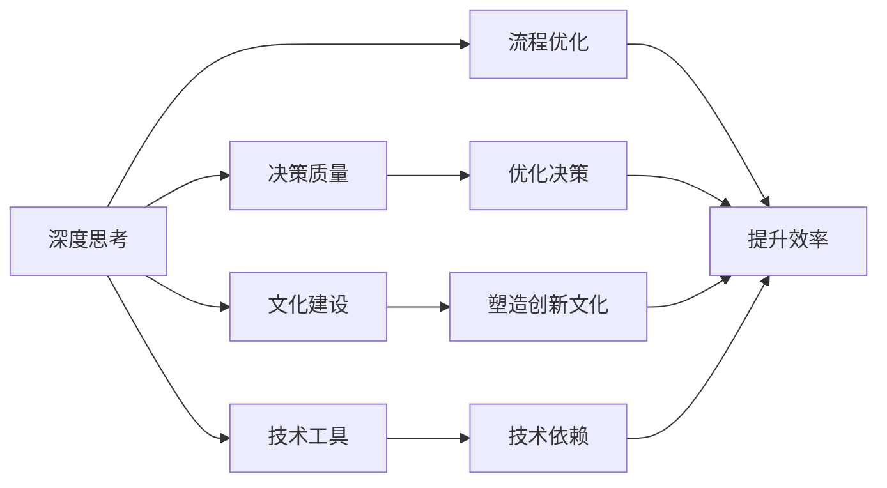

                 

# 深度思考与管理质量的关系

深度思考（Deep Thinking）与管理质量（Management Quality）是两个密切相关且相辅相成的概念，它们在大数据时代得到了前所未有的重视。随着科技的快速发展，深度学习、人工智能、自动化等技术不断涌现，对于管理者的深度思考能力提出了更高的要求，以应对技术带来的复杂性和不确定性。同时，管理质量也成为衡量企业竞争力的关键指标之一，代表着企业的战略、流程、文化和人才等方面是否具备高效、稳定、可控的特质。本文将深入探讨深度思考与管理质量的关系，通过案例分析、算法推导、项目实践等手段，全面解析二者之间的内在联系，并提出未来发展的趋势与挑战。

## 1. 背景介绍

### 1.1 问题由来

在信息爆炸和快速迭代的时代，管理者面临越来越多的决策难题，如何做出合理、科学的决策成为重中之重。传统的经验管理方法已经难以应对复杂多变的市场环境。与此同时，深度学习和人工智能技术的普及，使得决策支持系统、预测模型、自动化流程等工具在企业管理中得到了广泛应用。

这些问题引发了对于深度思考的强烈需求。深度思考不再仅仅是个人能力，而成为企业面对市场变化、技术创新等挑战的重要策略。

### 1.2 问题核心关键点

深度思考与管理质量的核心关键点主要包括以下几个方面：

1. **决策质量**：深度思考强调数据分析、模型推断、情境分析等科学方法，通过严谨的思考过程，提升决策的合理性。
2. **流程优化**：深度思考不仅关注结果，更关注过程，通过技术手段优化流程，提升效率和质量。
3. **文化建设**：深度思考需要在企业内部营造一种基于数据和事实的决策文化，提高员工的逻辑思维和问题解决能力。
4. **技术工具**：深度思考需要依托先进的技术工具，如大数据分析、机器学习、自然语言处理等，支持复杂问题的分析和解决。

### 1.3 问题研究意义

深度思考与管理质量的结合，可以帮助企业更好地应对市场和技术变革，提升管理效率和决策质量，增强企业的核心竞争力。具体而言：

1. **提升决策科学性**：深度思考通过数据分析、模型推断等科学方法，提升决策的科学性和合理性，避免直觉和经验决策的偏差。
2. **优化流程效率**：深度思考强调流程的科学设计和管理，通过技术手段提高流程效率和质量，减少人为错误和资源浪费。
3. **塑造创新文化**：深度思考提倡基于事实和数据的创新思考，鼓励员工提出新想法、新方法，推动企业不断创新。
4. **增强技术依赖**：深度思考依赖于先进的技术工具和平台，有助于企业保持技术领先，提升市场响应速度。

## 2. 核心概念与联系

### 2.1 核心概念概述

深度思考（Deep Thinking）是指通过深度学习、数据分析、逻辑推理等科学方法，对复杂问题进行全面、深入的分析，以做出合理决策的能力。管理质量（Management Quality）是指企业在战略、流程、文化、人才等方面具备高效、稳定、可控的特质，代表企业的整体管理水平。

这两个概念的联系主要体现在以下几方面：

- **决策基础**：深度思考提供科学的方法和工具，作为管理质量提升的基础。
- **过程优化**：深度思考强调过程的优化，有助于提升管理质量。
- **文化塑造**：深度思考促使企业形成基于数据和事实的决策文化，推动管理质量的全面提升。

### 2.2 核心概念原理和架构的 Mermaid 流程图



这个流程图展示了深度思考与管理质量之间的联系：

1. 深度思考通过科学方法和工具支持决策质量的提升。
2. 深度思考优化流程，提升效率和质量。
3. 深度思考塑造创新文化，推动管理质量的全面提升。
4. 深度思考依赖于先进的技术工具，进一步提高管理质量。

## 3. 核心算法原理 & 具体操作步骤

### 3.1 算法原理概述

深度思考与管理质量结合的核心算法原理主要包括以下几个方面：

1. **数据分析与模型推断**：通过数据收集、清洗、分析，构建数据模型，进行预测和推断，支持决策制定。
2. **过程优化**：利用数据分析结果，优化流程设计和管理，提升效率和质量。
3. **文化塑造**：通过培训、宣传、制度建设等方式，推动企业文化向基于数据和事实的决策文化转变。
4. **技术工具支持**：依托先进的科技工具和平台，提供强大的技术支持，保障深度思考的实施。

### 3.2 算法步骤详解

深度思考与管理质量的结合，一般包括以下几个关键步骤：

**Step 1: 数据准备与分析**

- **数据收集**：收集与决策相关的各类数据，包括内部业务数据、外部市场数据、技术数据等。
- **数据清洗**：对数据进行去重、补全、格式转换等处理，确保数据质量。
- **数据分析**：使用统计分析、数据挖掘、机器学习等方法，对数据进行多维度分析，提取有价值的信息。

**Step 2: 模型构建与推断**

- **模型选择**：根据分析目标选择合适的模型，如回归模型、分类模型、神经网络模型等。
- **模型训练**：使用训练数据对模型进行训练，优化模型参数。
- **模型推断**：使用测试数据对模型进行推断，验证模型效果。

**Step 3: 流程优化**

- **流程设计**：根据数据分析和模型推断结果，重新设计流程，优化流程结构。
- **流程执行**：在优化后的流程中执行各项任务，验证流程效果。
- **流程调整**：根据反馈结果，不断调整流程，直到达到最佳效果。

**Step 4: 文化建设**

- **培训教育**：通过培训、讲座、工作坊等方式，提高员工的逻辑思维和问题解决能力。
- **宣传推广**：通过企业内部宣传、案例分享等方式，推动基于数据和事实的决策文化。
- **制度建设**：制定相关的制度和规范，确保深度思考和数据驱动决策的持续实施。

### 3.3 算法优缺点

深度思考与管理质量结合的优势包括：

- **提升决策科学性**：科学的方法和工具支持，避免直觉和经验决策的偏差。
- **优化流程效率**：通过数据分析和模型推断，优化流程设计和管理，提高效率和质量。
- **塑造创新文化**：推动企业文化向基于数据和事实的决策文化转变，提升创新能力。
- **增强技术依赖**：依赖先进的科技工具和平台，保持技术领先，提升市场响应速度。

然而，这种方法也存在一些缺点：

- **数据依赖**：数据质量和数据量直接影响分析结果，数据不完整或不准确可能影响决策。
- **技术复杂性**：需要高水平的技术和工具支持，对人员和资源要求较高。
- **文化变革**：推动企业文化变革需要时间，可能遇到阻力。

### 3.4 算法应用领域

深度思考与管理质量结合的方法，已经在多个领域得到广泛应用，包括但不限于：

1. **金融风险管理**：通过数据分析和模型推断，识别和预测金融风险，优化风险管理流程。
2. **医疗健康管理**：通过医疗数据和预测模型，优化诊疗流程，提升医疗服务质量。
3. **制造业生产管理**：通过生产数据和模型推断，优化生产流程，提升生产效率和质量。
4. **零售供应链管理**：通过销售数据和需求预测，优化供应链管理流程，提升库存和物流效率。

这些领域的应用展示了深度思考与管理质量结合的强大威力，为其他企业提供了借鉴和参考。

## 4. 数学模型和公式 & 详细讲解 & 举例说明

### 4.1 数学模型构建

深度思考与管理质量结合的数学模型主要包括以下几个方面：

1. **数据预处理模型**：用于数据清洗和格式转换。
2. **统计分析模型**：用于数据的基本统计分析。
3. **机器学习模型**：用于构建预测模型，如回归模型、分类模型、神经网络模型等。
4. **优化流程模型**：用于流程优化，如过程网络、业务规则等。

### 4.2 公式推导过程

以回归模型为例，其基本公式为：

$$
y = \beta_0 + \beta_1 x_1 + \beta_2 x_2 + \ldots + \beta_n x_n + \epsilon
$$

其中，$y$ 为预测目标，$x_i$ 为自变量，$\beta_i$ 为回归系数，$\epsilon$ 为误差项。

在数据预处理阶段，通过以下公式进行数据清洗和归一化处理：

$$
x_i = \frac{x_i - \mu}{\sigma}
$$

其中，$\mu$ 为均值，$\sigma$ 为标准差。

在统计分析阶段，使用以下公式计算样本均值和方差：

$$
\bar{x} = \frac{1}{n} \sum_{i=1}^n x_i
$$

$$
s^2 = \frac{1}{n-1} \sum_{i=1}^n (x_i - \bar{x})^2
$$

在机器学习阶段，使用梯度下降法对模型参数进行优化：

$$
\theta = \theta - \alpha \frac{\partial \text{loss}}{\partial \theta}
$$

其中，$\theta$ 为模型参数，$\alpha$ 为学习率，$\text{loss}$ 为损失函数。

### 4.3 案例分析与讲解

假设一家电商企业希望通过深度思考与管理质量结合的方法提升库存管理效率，具体步骤如下：

1. **数据准备与分析**：收集历史销售数据、库存数据、市场数据等，进行数据清洗和预处理。
2. **模型构建与推断**：构建预测模型，如时间序列模型、回归模型等，预测未来销售量。
3. **流程优化**：根据预测结果，优化库存补货和配送流程，提高库存周转率。
4. **文化建设**：通过培训和宣传，提高员工的数据分析和决策能力。

## 5. 项目实践：代码实例和详细解释说明

### 5.1 开发环境搭建

在进行项目实践前，我们需要准备好开发环境。以下是使用Python进行数据分析和机器学习的开发环境配置流程：

1. 安装Anaconda：从官网下载并安装Anaconda，用于创建独立的Python环境。

2. 创建并激活虚拟环境：
```bash
conda create -n data-env python=3.8 
conda activate data-env
```

3. 安装必要的库：
```bash
conda install pandas numpy matplotlib scikit-learn statsmodels
```

4. 安装机器学习库：
```bash
pip install scikit-learn
```

完成上述步骤后，即可在`data-env`环境中进行数据分析和机器学习实验。

### 5.2 源代码详细实现

这里我们以时间序列预测为例，给出使用Python进行深度思考与管理质量结合的代码实现。

首先，定义数据处理函数：

```python
import pandas as pd
from sklearn.model_selection import train_test_split
from sklearn.linear_model import ARIMA

def preprocess_data(df, target_col):
    # 数据清洗
    df.dropna(inplace=True)
    # 数据转换
    df[target_col] = df[target_col].astype(int)
    # 数据划分
    X = df.drop(target_col, axis=1)
    y = df[target_col]
    X_train, X_test, y_train, y_test = train_test_split(X, y, test_size=0.2, random_state=42)
    return X_train, X_test, y_train, y_test
```

然后，定义模型训练和评估函数：

```python
def train_model(X_train, y_train, X_test, y_test):
    # 训练模型
    model = ARIMA(y_train, order=(1,1,1))
    model.fit(X_train)
    # 评估模型
    y_pred = model.forecast(steps=len(X_test))
    mse = mean_squared_error(y_test, y_pred)
    return mse
```

最后，启动模型训练和评估流程：

```python
# 数据准备
df = pd.read_csv('sales_data.csv')
X_train, X_test, y_train, y_test = preprocess_data(df, 'sales')

# 模型训练
mse = train_model(X_train, y_train, X_test, y_test)
print(f'Mean Squared Error: {mse:.2f}')
```

以上就是使用Python进行时间序列预测的完整代码实现。可以看到，借助机器学习库和统计分析库，我们可以轻松地进行数据预处理、模型训练和结果评估。

### 5.3 代码解读与分析

让我们再详细解读一下关键代码的实现细节：

**preprocess_data函数**：
- `df.dropna(inplace=True)`：对数据进行去重处理，去除NaN值。
- `df[target_col] = df[target_col].astype(int)`：将目标变量转换为整型。
- `X_train, X_test, y_train, y_test = train_test_split(X, y, test_size=0.2, random_state=42)`：将数据集划分为训练集和测试集，随机划分比例为80/20。

**train_model函数**：
- `model = ARIMA(y_train, order=(1,1,1))`：构建ARIMA模型，预测1阶差分后的时间序列数据。
- `model.fit(X_train)`：使用训练集对模型进行拟合。
- `y_pred = model.forecast(steps=len(X_test))`：使用模型对测试集进行预测。
- `mse = mean_squared_error(y_test, y_pred)`：计算预测值与真实值之间的均方误差。

**启动模型训练和评估流程**：
- `df = pd.read_csv('sales_data.csv')`：读取销售数据，构建数据框。
- `X_train, X_test, y_train, y_test = preprocess_data(df, 'sales')`：对数据进行预处理，划分训练集和测试集。
- `mse = train_model(X_train, y_train, X_test, y_test)`：训练模型并评估其性能，输出均方误差。

可以看到，借助Python库，我们可以方便地进行数据预处理、模型训练和结果评估，深入理解深度思考与管理质量结合的实现过程。

## 6. 实际应用场景

### 6.1 智能制造

深度思考与管理质量的结合在智能制造领域有着广泛的应用。传统的制造业面临生产计划制定、供应链管理、质量控制等多方面的挑战，通过深度思考可以提升整体效率和质量。

具体而言，可以通过大数据分析技术，收集和处理生产数据、设备数据、质量数据等，构建预测模型，优化生产计划和供应链管理。同时，利用数据分析结果，优化生产流程和质量控制，提高生产效率和产品合格率。

### 6.2 金融风险管理

在金融行业，深度思考与管理质量的结合可以显著提升风险管理水平。传统的风险管理依赖于经验和直觉，容易受到人为因素影响。通过深度思考，利用大数据分析和机器学习技术，可以更准确地识别和预测风险，优化风险管理流程。

例如，通过历史交易数据和市场数据，构建预测模型，预测市场波动和风险事件，优化风险控制策略。同时，利用数据分析结果，优化风险管理流程，提高风险管理效率和准确性。

### 6.3 医疗健康管理

在医疗健康领域，深度思考与管理质量的结合可以提升医疗服务质量和效率。传统的医疗决策依赖于经验积累，容易受到个体差异和个人经验影响。通过深度思考，利用医疗数据和机器学习技术，可以更准确地诊断疾病，优化诊疗流程。

例如，通过病历数据和诊断结果，构建预测模型，预测疾病发展和病情变化，优化诊疗方案。同时，利用数据分析结果，优化诊疗流程，提高诊疗效率和医疗服务质量。

## 7. 工具和资源推荐

### 7.1 学习资源推荐

为了帮助开发者系统掌握深度思考与管理质量的理论基础和实践技巧，这里推荐一些优质的学习资源：

1. 《深度学习》系列书籍：全面介绍了深度学习的基础理论、算法和应用，是深度思考的必读书籍。
2. 《数据分析与统计建模》课程：斯坦福大学开设的数据分析课程，涵盖数据清洗、统计分析、机器学习等内容，帮助理解数据分析的流程和工具。
3. Kaggle平台：数据科学竞赛平台，提供丰富的数据集和机器学习竞赛，实践深度思考能力。
4. 《Python数据科学手册》书籍：详细介绍了Python在数据分析和机器学习中的应用，适合初学者和高级开发者。

通过对这些资源的学习实践，相信你一定能够快速掌握深度思考与管理质量的精髓，并用于解决实际的商业问题。

### 7.2 开发工具推荐

高效的开发离不开优秀的工具支持。以下是几款用于深度思考与数据分析开发的常用工具：

1. Python：基于解释型的高级编程语言，功能强大且易于学习，广泛应用于数据科学和机器学习领域。
2. R语言：专门用于统计分析和数据可视化，丰富的统计函数和图形库，支持深度思考所需的数据分析任务。
3. TensorFlow和PyTorch：流行的深度学习框架，提供丰富的API和算法库，支持深度学习模型的构建和训练。
4. Jupyter Notebook：交互式编程环境，支持Python、R等多种语言，方便数据科学家进行数据分析和模型推断。

合理利用这些工具，可以显著提升深度思考与管理质量的开发效率，加快创新迭代的步伐。

### 7.3 相关论文推荐

深度思考与管理质量的发展源于学界的持续研究。以下是几篇奠基性的相关论文，推荐阅读：

1. "Deep Learning" by Ian Goodfellow, Yoshua Bengio, and Aaron Courville：深度学习领域的经典教材，介绍了深度思考所需的基础理论和算法。
2. "The Elements of Statistical Learning" by Trevor Hastie, Robert Tibshirani, and Jerome Friedman：统计学习领域的经典教材，详细介绍了统计分析和机器学习算法。
3. "Deep Thought for Decision-Making" by Ralf Wilhelmsmeyer：探讨了深度思考在决策支持系统中的应用，提出了一些实用的方法。

这些论文代表了大数据和人工智能时代下深度思考与管理质量的研究方向，通过学习这些前沿成果，可以帮助研究者把握学科前进方向，激发更多的创新灵感。

## 8. 总结：未来发展趋势与挑战

### 8.1 总结

本文对深度思考与管理质量的结合进行了全面系统的介绍。首先阐述了深度思考与管理质量的研究背景和意义，明确了二者的结合在提升决策质量和优化流程效率方面的重要价值。其次，从原理到实践，详细讲解了深度思考与管理质量结合的数学原理和关键步骤，给出了深度思考与管理质量结合的完整代码实例。同时，本文还广泛探讨了深度思考与管理质量结合在智能制造、金融风险管理、医疗健康等多个领域的应用前景，展示了深度思考与管理质量结合的强大威力。

通过本文的系统梳理，可以看到，深度思考与管理质量的结合已经成为企业管理和决策的重要手段，其应用范围和影响深远。未来，伴随深度学习、大数据、人工智能等技术的不断进步，深度思考与管理质量的结合必将迎来新的发展机遇。

### 8.2 未来发展趋势

展望未来，深度思考与管理质量的结合将呈现以下几个发展趋势：

1. **技术融合**：深度思考与管理质量的结合将与其他前沿技术如区块链、物联网、边缘计算等进行更深层次的融合，提升数据的全面性和实时性。
2. **智能化转型**：深度思考与管理质量的结合将推动企业管理向智能化方向转型，提高企业的市场响应速度和创新能力。
3. **数据驱动**：深度思考与管理质量的结合将更多依赖于数据驱动，通过大数据分析和技术手段，优化决策和流程。
4. **跨学科发展**：深度思考与管理质量的结合将跨越学科界限，促进企业管理与计算机科学、统计学、心理学等领域的交叉融合，形成更加全面的知识体系。
5. **伦理和安全**：深度思考与管理质量的结合将更加注重数据隐私、伦理和安全问题，保障管理决策的公正性和安全性。

这些趋势凸显了深度思考与管理质量结合的未来发展方向，为企业管理提供更广阔的想象空间。

### 8.3 面临的挑战

尽管深度思考与管理质量的结合取得了显著成效，但在迈向更加智能化、普适化应用的过程中，它仍面临着诸多挑战：

1. **数据质量**：数据质量是深度思考与管理质量结合的基石，如何获取高质量、全面、实时的数据，是未来的挑战之一。
2. **技术复杂性**：深度思考与管理质量的结合依赖于先进的技术工具和算法，对人员和资源要求较高，如何降低技术门槛，提高技术可操作性，是一大挑战。
3. **文化变革**：推动企业文化向数据驱动决策转变需要时间，可能遇到阻力，如何加快文化变革步伐，增强员工的接受度，是一大挑战。
4. **隐私和伦理**：深度思考与管理质量的结合涉及大量数据处理，如何保护数据隐私和伦理安全，是一大挑战。

### 8.4 研究展望

面对深度思考与管理质量结合所面临的挑战，未来的研究需要在以下几个方面寻求新的突破：

1. **数据采集与预处理**：开发更加高效的数据采集和预处理技术，确保数据的全面性和实时性。
2. **模型优化**：研发更加高效、泛化能力更强的机器学习模型，降低技术门槛，提高可操作性。
3. **文化建设**：通过培训、宣传、制度建设等方式，推动企业文化向数据驱动决策转变，增强员工的接受度。
4. **隐私保护**：引入隐私保护技术，如差分隐私、联邦学习等，保护数据隐私和伦理安全。

这些研究方向的探索，必将引领深度思考与管理质量结合技术迈向更高的台阶，为企业管理提供更全面、高效、安全的决策支持系统。

---

作者：禅与计算机程序设计艺术 / Zen and the Art of Computer Programming

