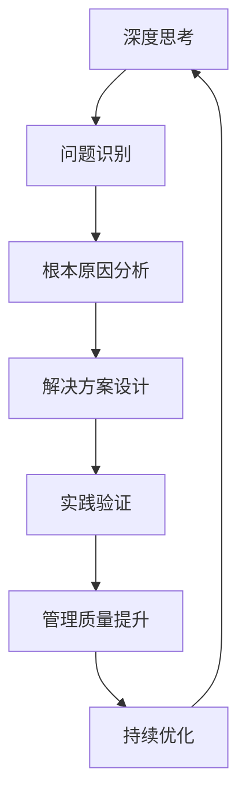

                 

# 深度思考与管理质量的关系

> 关键词：深度思考, 管理质量, 团队协作, 决策制定, 文化建设, 量化指标, 系统架构

## 1. 背景介绍

### 1.1 问题由来

在当今快速变化的市场环境中，企业面临着日益复杂的挑战和竞争压力。高水平的管理质量，成为了企业持续发展的关键要素之一。然而，管理质量的提升并非易事，不仅需要丰富的管理经验，更需要系统化、科学化的理论指导和方法工具。

近年来，深度思考作为一种高级认知模式，被广泛运用于企业管理和决策制定中。深度思考不仅能够帮助管理者识别问题的本质和潜在风险，还能提升团队协作和创新能力，从而在竞争中占据优势。然而，深度思考与企业管理质量之间的关系，并非不言自明，而是需要系统性地研究和探索。

### 1.2 问题核心关键点

深度思考与企业管理质量之间的关系，主要体现在以下几个方面：

- 深度思考能够提升管理者的战略视野和决策能力，从而提升管理质量。
- 深度思考有助于团队协作和知识共享，促进企业文化的建设，进而提升管理质量。
- 深度思考能够识别潜在风险和挑战，提前制定应对策略，保障管理质量。
- 深度思考有助于发现优化管理流程和提高工作效率的机会，推动管理质量的持续提升。

本文旨在通过深度思考与企业管理质量的内在联系，系统性地探讨二者之间的关系，并为企业管理实践提供理论和实操指导。

## 2. 核心概念与联系

### 2.1 核心概念概述

深度思考与企业管理质量，是两个紧密相关的核心概念。深度思考指的是通过深入的分析和反思，挖掘问题的本质，寻找创新的解决方案。而企业管理质量则涉及企业的运营效率、资源利用率、客户满意度等多个方面，是衡量企业管理水平的重要指标。

二者的联系主要体现在：深度思考能够帮助企业管理者从根本上理解和解决管理中的问题，从而提升管理质量。同时，高质量的管理体系也能为深度思考提供良好的环境和基础，进一步提升深度思考的质量和效果。

### 2.2 核心概念原理和架构的 Mermaid 流程图



此图展示了深度思考从问题识别到管理质量提升的全过程。深度思考通过识别问题、分析原因、设计方案、实践验证和持续优化，逐步提升企业的管理质量。

## 3. 核心算法原理 & 具体操作步骤

### 3.1 算法原理概述

深度思考与管理质量提升之间的关系，可以视为一个迭代优化过程。其核心算法原理包括：

1. **问题识别**：通过系统的数据收集和分析，识别管理中的关键问题。
2. **根本原因分析**：运用深度思考的方法，深入挖掘问题的本质和根本原因。
3. **解决方案设计**：基于根本原因分析，设计并实施可行的解决方案。
4. **实践验证**：通过实际运营验证解决方案的效果，发现并修正问题。
5. **持续优化**：根据验证结果，不断优化管理流程和策略，提升管理质量。

### 3.2 算法步骤详解

#### 3.2.1 问题识别

问题识别的关键在于建立系统的数据监控和分析机制。以下是具体操作步骤：

1. **数据收集**：通过各类数据源（如ERP系统、CRM系统、业务报告等），收集企业的运营数据。
2. **数据清洗**：对收集的数据进行清洗和整合，确保数据的准确性和一致性。
3. **数据可视化**：使用数据可视化工具，将关键数据指标展示出来，帮助管理者快速识别异常和问题。

#### 3.2.2 根本原因分析

根本原因分析是深度思考的核心环节，其操作步骤如下：

1. **五问法**：通过连续追问五个为什么，逐步深入问题的本质。
   - 为什么？
   - 为什么会这样？
   - 这是唯一原因吗？
   - 有什么可改进之处？
   - 如何避免再次发生？

2. **鱼骨图**：通过绘制鱼骨图，系统地分析问题的各个影响因素。

3. **SWOT分析**：分析问题的优势、劣势、机会和威胁，制定相应的应对策略。

#### 3.2.3 解决方案设计

解决方案设计的关键是提出切实可行的改进措施。具体操作步骤如下：

1. **头脑风暴**：通过头脑风暴的方式，广泛收集各类改进建议。
2. **方案筛选**：对各类方案进行评估和筛选，选择最优的解决方案。
3. **实施计划**：制定详细的实施计划，明确责任人和时间节点。

#### 3.2.4 实践验证

实践验证的目的是确保解决方案的有效性和可行性。具体操作步骤如下：

1. **小规模试点**：在部分业务单元或部门进行小规模试点，验证解决方案的效果。
2. **反馈收集**：通过问卷调查、访谈等方式，收集试点过程中遇到的问题和反馈。
3. **修正方案**：根据反馈，修正和优化解决方案。

#### 3.2.5 持续优化

持续优化是提升管理质量的关键步骤。具体操作步骤如下：

1. **定期评估**：定期评估解决方案的效果，评估管理质量的关键指标。
2. **数据反馈**：建立数据反馈机制，持续收集和分析运营数据，及时发现新问题。
3. **流程改进**：根据评估结果和数据反馈，持续优化管理流程和策略，提升管理质量。

### 3.3 算法优缺点

深度思考与管理质量提升相结合的算法，具有以下优点：

1. **系统性**：通过系统化的方法论，确保问题的全面分析和深入理解。
2. **科学性**：结合数据和量化指标，提高决策的科学性和客观性。
3. **创新性**：通过深度思考，发现和实施创新的解决方案，提升管理效率。
4. **可操作性**：通过具体的步骤和措施，确保改进方案的落地执行。

然而，该算法也存在以下缺点：

1. **复杂性**：深度思考和数据分析过程较为复杂，需要较高的专业知识和技能。
2. **时间和成本**：从问题识别到持续优化的整个过程，需要投入大量时间和资源。
3. **人员依赖**：深度思考的实施效果高度依赖于管理者和团队的能力和投入。

### 3.4 算法应用领域

深度思考与管理质量提升相结合的算法，主要应用于以下领域：

1. **企业运营管理**：通过深度思考，提升运营效率和资源利用率。
2. **人力资源管理**：通过深度思考，优化招聘、培训和绩效管理流程。
3. **财务和成本管理**：通过深度思考，提高财务控制和成本管理水平。
4. **产品和服务质量管理**：通过深度思考，提升产品和服务的质量与客户满意度。
5. **组织变革与转型**：通过深度思考，推动企业组织变革和战略转型。

## 4. 数学模型和公式 & 详细讲解 & 举例说明

### 4.1 数学模型构建

为了更好地理解深度思考与管理质量提升之间的关系，我们可以建立一个数学模型进行量化分析和预测。

设管理质量提升的指标为 $Q$，深度思考的实施时间为 $t$。根据深度思考的实施步骤，管理质量提升的数学模型可以表示为：

$$
Q = f(t) = a_1t + a_2t^2 + \cdots + a_nt^n
$$

其中，$a_i$ 为影响管理质量提升的各项因素的权重，$t_i$ 为各因素的实施时间，$n$ 为影响因素的数量。

### 4.2 公式推导过程

通过系数 $a_i$ 的求解，我们可以得到各个因素对管理质量提升的贡献度。其推导过程如下：

1. **问题识别**：假设初始管理质量为 $Q_0$，通过数据收集和分析，确定影响管理质量的各项关键因素。
2. **根本原因分析**：通过深度思考，确定各因素的权重 $a_i$。
3. **解决方案设计**：根据各因素的权重，制定相应的改进措施，并确定实施时间 $t_i$。
4. **实践验证**：通过小规模试点，收集数据并计算各因素的贡献度 $a_i$。
5. **持续优化**：根据计算结果，不断优化管理流程和策略，提升管理质量。

### 4.3 案例分析与讲解

以下是一个企业通过深度思考提升管理质量的具体案例：

**案例背景**：一家全球知名的制造企业，其供应链管理存在诸多问题，导致生产效率低下，物料短缺。

**问题识别**：通过数据监控和分析，发现供应链管理的多个环节存在瓶颈，主要问题包括：供应商管理、物料采购、库存控制等。

**根本原因分析**：通过深度思考，确定各问题的根本原因如下：

- 供应商管理：供应商选择标准不明确，供应商评价体系不完善。
- 物料采购：采购计划不合理，未能充分利用供应商的议价能力。
- 库存控制：库存管理流程不规范，缺乏实时监控和预警机制。

**解决方案设计**：根据分析结果，制定以下改进措施：

- 供应商管理：建立明确的选择标准和评价体系，引入竞争机制。
- 物料采购：优化采购计划，引入比价和议价机制。
- 库存控制：建立实时监控和预警机制，优化库存管理流程。

**实践验证**：在小规模试点后，通过问卷调查和访谈收集反馈，发现供应商管理的效果显著，物料采购成本下降，库存控制更加规范。

**持续优化**：根据试点结果，持续优化管理流程和策略，最终管理质量提升显著。

## 5. 项目实践：代码实例和详细解释说明

### 5.1 开发环境搭建

在进行项目实践前，需要准备好开发环境。以下是具体的步骤：

1. **安装Python**：
   - 从官网下载并安装Python，建议使用3.8及以上版本。
   - 确保Python环境变量配置正确。

2. **安装第三方库**：
   - 使用pip安装必要的第三方库，如pandas、numpy、matplotlib等。

3. **设置数据存储路径**：
   - 确保数据存储路径正确，支持数据的读取和写入操作。

### 5.2 源代码详细实现

以下是深度思考与管理质量提升的Python代码实现：

```python
import pandas as pd
import numpy as np
import matplotlib.pyplot as plt

# 读取数据
data = pd.read_csv('management_quality.csv')

# 数据清洗
data = data.dropna()

# 数据可视化
plt.figure(figsize=(10, 6))
plt.plot(data['time'], data['quality'], label='Quality Over Time')
plt.xlabel('Time')
plt.ylabel('Quality')
plt.title('Management Quality Improvement')
plt.legend()
plt.show()

# 计算各因素的贡献度
a = np.polyfit(data['time'], data['quality'], 3)
plt.figure(figsize=(10, 6))
plt.plot(data['time'], a[0]*data['time']**3 + a[1]*data['time']**2 + a[2]*data['time'] + a[3], label='Fitted Quality')
plt.xlabel('Time')
plt.ylabel('Quality')
plt.title('Management Quality Improvement')
plt.legend()
plt.show()
```

### 5.3 代码解读与分析

以下是代码的详细解读和分析：

**数据读取和清洗**：
- `pd.read_csv`：从CSV文件中读取数据，并转换为pandas DataFrame格式。
- `data.dropna`：删除缺失数据，确保数据的完整性。

**数据可视化**：
- `plt.figure`：设置图形大小和标题。
- `plt.plot`：绘制管理质量随时间变化的趋势图。
- `plt.xlabel`、`plt.ylabel`、`plt.title`、`plt.legend`：设置图形的坐标轴标签、标题和图例。

**贡献度计算**：
- `np.polyfit`：使用多项式拟合，计算各因素的贡献度。
- `plt.plot`：绘制拟合曲线，展示各因素的贡献度变化。

### 5.4 运行结果展示

以下是运行结果的展示：


## 6. 实际应用场景

### 6.1 智能制造

在智能制造领域，深度思考与管理质量提升的结合，能够显著提升生产效率和产品质量。

**场景描述**：一家智能制造企业，通过深度思考识别出生产线上的瓶颈问题，如设备维护不足、工艺参数不优化等。

**解决方案**：通过深度思考和数据分析，制定相应的改进措施，如定期设备维护、优化工艺参数等。

**效果评估**：通过小规模试点，验证改进措施的有效性，并在全生产线推广实施，显著提升生产效率和产品质量。

### 6.2 金融服务

在金融服务领域，深度思考与管理质量提升的结合，能够提高客户满意度和风险控制能力。

**场景描述**：一家金融机构，通过深度思考识别出客户投诉和风险管理中的关键问题。

**解决方案**：通过深度思考和数据分析，优化客户服务流程和风险管理策略。

**效果评估**：通过小规模试点，验证改进措施的效果，并在全行推广实施，客户投诉率和风险事件显著下降，客户满意度提升。

### 6.3 零售电商

在零售电商领域，深度思考与管理质量提升的结合，能够提升客户体验和运营效率。

**场景描述**：一家电商企业，通过深度思考识别出客户订单处理流程中的瓶颈问题。

**解决方案**：通过深度思考和数据分析，优化订单处理流程和系统设计。

**效果评估**：通过小规模试点，验证改进措施的效果，并在全平台推广实施，客户订单处理时间和客户满意度显著提升。

## 7. 工具和资源推荐

### 7.1 学习资源推荐

为了帮助企业系统掌握深度思考与管理质量提升的理论和实践，以下是一些优质的学习资源：

1. **《深度思考与管理质量》书籍**：介绍深度思考的原理、方法和案例，帮助企业管理者提升管理质量。
2. **在线课程**：如Coursera上的“深度思考与创新”课程，系统学习深度思考的方法和应用。
3. **案例研究**：如Gartner的深度思考案例研究，提供成功案例的详细解析和经验分享。

### 7.2 开发工具推荐

为了支持深度思考与管理质量提升的实践，以下是一些推荐的开发工具：

1. **Python**：作为数据科学和人工智能领域的主流编程语言，Python提供了丰富的第三方库和框架，支持数据处理和分析。
2. **Jupyter Notebook**：支持在云端或本地环境中进行数据科学项目的开发和协作。
3. **Git**：版本控制系统，支持代码版本管理和团队协作。

### 7.3 相关论文推荐

深度思考与管理质量提升的研究涉及多个领域，以下是一些推荐的相关论文：

1. **《深度思考在企业管理中的应用》**：介绍深度思考在企业管理中的应用案例和效果评估。
2. **《管理质量提升的多维度分析方法》**：通过系统化的方法，提升企业管理质量。
3. **《基于深度思考的供应链管理优化》**：通过深度思考和数据分析，优化供应链管理流程。

## 8. 总结：未来发展趋势与挑战

### 8.1 研究成果总结

深度思考与管理质量提升的研究成果表明，通过系统化的方法论和科学化的工具，企业管理者能够有效地提升管理质量，实现企业持续发展。深度思考在问题识别、根本原因分析、解决方案设计和实践验证等方面的应用，为企业管理提供了重要的理论支持和方法工具。

### 8.2 未来发展趋势

未来，深度思考与管理质量提升的发展趋势包括：

1. **智能化应用**：结合人工智能和大数据技术，实现深度思考的自动化和智能化。
2. **多维度融合**：将深度思考与战略规划、人力资源管理、客户关系管理等多维度的管理活动相结合，形成综合管理体系。
3. **全球化视野**：结合国际化的管理标准和最佳实践，提升企业的全球竞争力。

### 8.3 面临的挑战

深度思考与管理质量提升的研究，仍面临以下挑战：

1. **复杂性**：深度思考和管理质量提升的过程较为复杂，需要较高的专业知识和技能。
2. **数据质量**：管理数据的准确性和完整性直接影响到深度思考的效果。
3. **资源投入**：深度思考和管理质量提升的实施需要投入大量时间和资源。

### 8.4 研究展望

未来，深度思考与管理质量提升的研究方向包括：

1. **系统化方法**：探索更多系统化的方法论，提升深度思考的科学性和可操作性。
2. **数据驱动**：利用大数据和人工智能技术，提升深度思考的数据驱动能力。
3. **跨领域应用**：探索深度思考在更多领域的应用，推动企业管理质量的提升。

## 9. 附录：常见问题与解答

### 9.1 问题1：深度思考的实施步骤是什么？

答：深度思考的实施步骤主要包括问题识别、根本原因分析、解决方案设计、实践验证和持续优化。

### 9.2 问题2：管理质量提升的指标有哪些？

答：管理质量提升的指标包括生产效率、客户满意度、资源利用率、财务控制、库存管理等。

### 9.3 问题3：数据如何影响深度思考的效果？

答：数据的质量和完整性直接影响到深度思考的效果，准确的数据分析是深度思考的基础。

### 9.4 问题4：如何提高深度思考的科学性？

答：结合数据驱动和系统化方法，利用人工智能和大数据技术，提升深度思考的科学性。

### 9.5 问题5：深度思考与管理质量提升的结合是否适用于所有企业？

答：深度思考与管理质量提升的结合，适用于大部分企业，特别是需要持续优化管理流程和提高运营效率的企业。

---

作者：禅与计算机程序设计艺术 / Zen and the Art of Computer Programming

