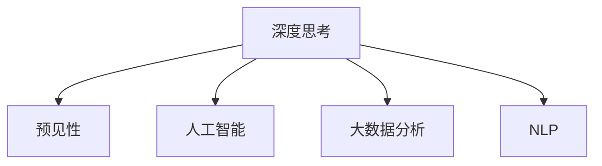

                 

## 1. 背景介绍

在快速变化的商业环境中，管理者的决策直接影响着企业的生存和发展。然而，人类思维的局限性和信息的不完备性，使得管理者在面对复杂多变的情况时，难以全面准确地预测未来。预见性（Foresight）的能力，成为了管理者最宝贵的资产之一。深度思考（Deep Thinking）作为人工智能领域的核心技术之一，正在逐渐展现出其在提升管理者预见性方面的巨大潜力。本文将探讨深度思考与预见性之间的关系，分析其在实际管理中的应用，以及未来发展的趋势和挑战。

## 2. 核心概念与联系

### 2.1 核心概念概述

为更好地理解深度思考与管理预见性的关系，本节将介绍几个密切相关的核心概念：

- 深度思考（Deep Thinking）：利用深度学习、大数据分析等先进技术，通过多维度、多层次的分析，帮助管理者深入理解复杂问题，做出更准确的预测和决策。
- 预见性（Foresight）：指管理者对未来趋势的预测和判断能力，包括技术发展、市场需求、竞争态势等方面。
- 人工智能（AI）：通过模拟人类智能，使机器能够自主学习、推理和决策，从而在多个领域辅助人类进行深度思考和预见性判断。
- 大数据分析（Big Data Analytics）：利用大数据技术，通过分析和挖掘海量数据，揭示隐藏在数据背后的规律和趋势，为管理决策提供有力支持。
- 自然语言处理（NLP）：使计算机能够理解、解释和生成自然语言，为深度思考和预见性分析提供基础。

这些核心概念之间的逻辑关系可以通过以下Mermaid流程图来展示：



这个流程图展示了一系列的深度思考概念及其之间的关系：

1. 深度思考通过人工智能、大数据分析和自然语言处理等技术，揭示数据的深层含义和规律。
2. 基于深度思考的结果，管理者能够对未来的发展做出更准确的预测和判断，从而进行科学的决策。

## 3. 核心算法原理 & 具体操作步骤

### 3.1 算法原理概述

深度思考的实现主要依赖于人工智能技术，尤其是深度学习。深度学习通过多层神经网络，对数据进行特征提取、抽象和推理，最终生成预测结果。其核心思想是通过数据驱动的方式，让机器学习数据中的规律和模式，从而实现对未来的预测。

具体而言，深度学习模型通常由输入层、若干隐藏层和输出层组成。其中，隐藏层通过不断调整权重和偏置，学习数据的特征表示，最终输出预测结果。常见的深度学习模型包括卷积神经网络（CNN）、循环神经网络（RNN）和变分自编码器（VAE）等。

### 3.2 算法步骤详解

基于深度学习的预见性模型通常包括以下几个关键步骤：

**Step 1: 数据收集与预处理**
- 收集与目标预测相关的大量历史数据和背景信息，并进行清洗、归一化和标准化处理。
- 对数据进行特征提取，选择或构建合适的特征表示。

**Step 2: 模型构建与训练**
- 设计合适的深度学习模型架构，选择适当的损失函数和优化算法。
- 使用历史数据对模型进行训练，通过反向传播算法不断调整模型参数，最小化损失函数。

**Step 3: 模型评估与验证**
- 使用验证集评估模型性能，判断模型是否存在过拟合或欠拟合。
- 根据评估结果，调整模型超参数和特征选择，重新训练模型。

**Step 4: 模型应用与反馈**
- 将训练好的模型应用于实际预测任务，对未来趋势进行预测。
- 根据预测结果，调整业务策略，并定期反馈预测结果，对模型进行迭代优化。

### 3.3 算法优缺点

深度思考在预见性分析中的优势在于：

- 数据驱动：基于海量数据进行模型训练，能够发现数据中的复杂模式和规律。
- 自动化：模型训练和预测过程完全自动化，能够快速应对多变的环境。
- 精确性：通过多层次的神经网络结构，深度学习模型在预测精度方面有较高的优势。

然而，深度思考也存在一些局限性：

- 模型复杂：深度学习模型结构复杂，需要大量计算资源进行训练和推理。
- 黑盒性质：深度学习模型作为"黑盒"，其内部工作机制难以解释，增加了管理者的信任成本。
- 数据依赖：深度学习模型依赖于高质量的数据，数据的不完备或不准确可能影响模型效果。

### 3.4 算法应用领域

深度思考在预见性分析中的应用非常广泛，主要包括以下几个领域：

- **金融预测**：利用历史交易数据和市场信息，对股票、债券等金融资产的价格变化进行预测。
- **市场分析**：通过对消费者行为数据和市场趋势的分析，预测市场需求变化和竞争对手的策略调整。
- **技术趋势**：利用技术发展数据和专利信息，预测新兴技术的发展方向和应用场景。
- **客户行为**：通过对用户行为数据和反馈信息进行分析，预测客户未来的需求和偏好。
- **供应链管理**：利用历史采购和销售数据，预测供应链中的需求波动和库存管理。

## 4. 数学模型和公式 & 详细讲解 & 举例说明

### 4.1 数学模型构建

深度思考的预见性模型通常基于统计学和机器学习的理论框架构建。以线性回归模型为例，假设我们有一个训练集 $D=\{(x_i, y_i)\}_{i=1}^N$，其中 $x_i$ 是输入特征，$y_i$ 是对应的目标变量，$N$ 是样本数。模型的目标是找到一组最优参数 $\theta$，使得预测值 $\hat{y}$ 与实际值 $y$ 尽可能接近。线性回归模型的数学形式为：

$$
\hat{y} = \theta^T x + b
$$

其中 $\theta$ 是模型的权重向量，$b$ 是偏置项。

### 4.2 公式推导过程

线性回归模型的损失函数为均方误差（MSE），即：

$$
L(\theta) = \frac{1}{N} \sum_{i=1}^N (y_i - \hat{y_i})^2
$$

模型参数 $\theta$ 的估计通过最小化损失函数得到：

$$
\theta^* = \mathop{\arg\min}_{\theta} L(\theta)
$$

常用的优化算法包括梯度下降（GD）和随机梯度下降（SGD），其更新公式为：

$$
\theta \leftarrow \theta - \eta \nabla_{\theta}L(\theta)
$$

其中 $\eta$ 是学习率，$\nabla_{\theta}L(\theta)$ 是损失函数对参数 $\theta$ 的梯度。

### 4.3 案例分析与讲解

以金融预测为例，假设我们要预测股票价格的变化趋势。可以收集股票的开盘价、收盘价、成交量、公司财报等历史数据，作为模型的输入特征。使用这些数据训练一个线性回归模型，对未来股价进行预测。模型的预测结果可以帮助管理者做出买入或卖出的决策。

## 5. 项目实践：代码实例和详细解释说明

### 5.1 开发环境搭建

在进行深度思考项目实践前，我们需要准备好开发环境。以下是使用Python进行TensorFlow开发的环境配置流程：

1. 安装Anaconda：从官网下载并安装Anaconda，用于创建独立的Python环境。

2. 创建并激活虚拟环境：
```bash
conda create -n tf-env python=3.8 
conda activate tf-env
```

3. 安装TensorFlow：根据CUDA版本，从官网获取对应的安装命令。例如：
```bash
pip install tensorflow-gpu==2.6
```

4. 安装Scikit-Learn和Pandas等辅助库：
```bash
pip install scikit-learn pandas
```

完成上述步骤后，即可在`tf-env`环境中开始深度思考实践。

### 5.2 源代码详细实现

下面我们以股票价格预测为例，给出使用TensorFlow构建深度思考模型的PyTorch代码实现。

首先，定义数据预处理函数：

```python
import pandas as pd
import numpy as np
from sklearn.preprocessing import MinMaxScaler

def load_data(file_path, target_column, scaler=None):
    df = pd.read_csv(file_path)
    X = df.drop(target_column, axis=1).values
    y = df[target_column].values.reshape(-1, 1)
    if scaler:
        X = scaler.fit_transform(X)
    return X, y
```

然后，定义模型和优化器：

```python
import tensorflow as tf
from tensorflow.keras import layers

model = tf.keras.Sequential([
    layers.Dense(64, activation='relu'),
    layers.Dense(64, activation='relu'),
    layers.Dense(1)
])

optimizer = tf.keras.optimizers.Adam(learning_rate=0.001)
```

接着，定义训练和评估函数：

```python
def train_model(X_train, y_train, X_test, y_test, epochs=100, batch_size=32):
    model.compile(optimizer=optimizer, loss='mse')
    model.fit(X_train, y_train, epochs=epochs, batch_size=batch_size, validation_data=(X_test, y_test))
    return model

def evaluate_model(model, X_test, y_test):
    y_pred = model.predict(X_test)
    mse = tf.keras.losses.MeanSquaredError()(y_test, y_pred).numpy()
    return mse
```

最后，启动训练流程并在测试集上评估：

```python
X_train, y_train = load_data('train.csv', 'price', scaler=MinMaxScaler())
X_test, y_test = load_data('test.csv', 'price', scaler=MinMaxScaler())

model = train_model(X_train, y_train, X_test, y_test)

mse = evaluate_model(model, X_test, y_test)
print(f"Mean Squared Error: {mse:.4f}")
```

以上就是使用TensorFlow进行股票价格预测的完整代码实现。可以看到，TensorFlow通过高度抽象的API，使深度思考模型的构建和训练变得简洁高效。

### 5.3 代码解读与分析

让我们再详细解读一下关键代码的实现细节：

**load_data函数**：
- 从CSV文件中加载数据，并去除目标列以外的所有特征，构建输入和输出矩阵。
- 对输入特征进行归一化处理，使用sklearn的MinMaxScaler进行标准化。

**模型和优化器定义**：
- 使用tf.keras.Sequential构建一个包含三个全连接层的神经网络。
- 设置Adam优化器和合适的学习率。

**train_model函数**：
- 使用模型的compile方法设置损失函数和优化器。
- 使用fit方法进行训练，指定训练轮数和批次大小。
- 在验证集上评估模型性能。

**evaluate_model函数**：
- 使用模型的predict方法进行测试集上的预测，并计算均方误差（MSE）。

**训练流程**：
- 使用历史股票价格数据训练模型，并在测试集上评估均方误差。

可以看到，TensorFlow提供了丰富的API，使得深度思考模型的构建和训练过程变得非常简单。开发者可以将更多精力放在模型选择、超参数调优等高层逻辑上，而不必过多关注底层的实现细节。

当然，工业级的系统实现还需考虑更多因素，如模型的保存和部署、超参数的自动搜索、更灵活的任务适配层等。但核心的预见性建模基本与此类似。

## 6. 实际应用场景

### 6.1 金融预测

深度思考在金融领域的应用非常广泛，尤其是股票、债券等金融资产的价格预测。通过历史交易数据和市场信息，深度学习模型可以揭示数据中的复杂模式和规律，从而帮助管理者预测未来市场走势，进行投资决策。

在技术实现上，可以使用深度学习模型对股票价格进行回归预测，或者使用时间序列预测模型，如LSTM、GRU等，预测股票价格的变化趋势。模型训练完成后，管理者可以根据预测结果，及时调整投资组合，规避市场风险。

### 6.2 市场分析

深度思考在市场分析中的应用同样广泛。通过对消费者行为数据和市场趋势的分析，深度学习模型可以预测市场需求变化和竞争对手的策略调整，帮助企业制定更加科学的市场策略。

在技术实现上，可以使用深度学习模型对消费者行为数据进行分类或聚类，挖掘潜在的需求模式和市场趋势。模型训练完成后，企业可以根据预测结果，调整产品线和市场推广策略，抢占市场先机。

### 6.3 技术趋势

深度思考在技术趋势预测中的应用同样有着广泛的前景。通过技术发展数据和专利信息，深度学习模型可以预测新兴技术的发展方向和应用场景，帮助企业提前布局，把握未来的技术机遇。

在技术实现上，可以使用深度学习模型对专利数据进行分类或聚类，识别出具有创新性的专利，并预测其未来的发展方向和应用场景。模型训练完成后，企业可以根据预测结果，投资开发新兴技术，抢占技术高地。

## 7. 工具和资源推荐

### 7.1 学习资源推荐

为了帮助开发者系统掌握深度思考的理论基础和实践技巧，这里推荐一些优质的学习资源：

1. 《深度学习》系列博文：由深度学习领域的知名专家撰写，深入浅出地介绍了深度学习的原理和应用。

2. CS231n《卷积神经网络》课程：斯坦福大学开设的深度学习明星课程，涵盖深度学习在图像识别、自然语言处理等领域的应用。

3. 《Python深度学习》书籍：使用Python实现深度学习模型的经典教程，适合初学者入门。

4. TensorFlow官方文档：TensorFlow的官方文档，提供了海量预训练模型和完整的预见性样例代码，是上手实践的必备资料。

5. Kaggle竞赛平台：提供了大量真实世界的数据集和比赛项目，是锻炼深度思考能力的好地方。

通过对这些资源的学习实践，相信你一定能够快速掌握深度思考的精髓，并用于解决实际的预见性问题。

### 7.2 开发工具推荐

高效的开发离不开优秀的工具支持。以下是几款用于深度思考开发的常用工具：

1. TensorFlow：基于Python的开源深度学习框架，灵活动态的计算图，适合快速迭代研究。

2. PyTorch：基于Python的开源深度学习框架，动态计算图，易于调试和优化。

3. Keras：一个高级神经网络API，使用简洁的API设计，适合初学者快速上手。

4. Weights & Biases：模型训练的实验跟踪工具，可以记录和可视化模型训练过程中的各项指标，方便对比和调优。

5. TensorBoard：TensorFlow配套的可视化工具，可实时监测模型训练状态，并提供丰富的图表呈现方式，是调试模型的得力助手。

6. Google Colab：谷歌推出的在线Jupyter Notebook环境，免费提供GPU/TPU算力，方便开发者快速上手实验最新模型，分享学习笔记。

合理利用这些工具，可以显著提升深度思考任务的开发效率，加快创新迭代的步伐。

### 7.3 相关论文推荐

深度思考的发展源于学界的持续研究。以下是几篇奠基性的相关论文，推荐阅读：

1. Deep Learning（《深度学习》书籍）：深度学习领域的经典著作，详细介绍了深度学习的基本概念和核心技术。

2. Convolutional Neural Networks for Deep Learning（卷积神经网络论文）：介绍卷积神经网络在计算机视觉领域的广泛应用。

3. Long Short-Term Memory（LSTM论文）：介绍循环神经网络在时间序列预测中的应用。

4. Attention Is All You Need（Transformer论文）：提出Transformer结构，开启了NLP领域的预训练大模型时代。

5. Transformer-XL: Attentions Are All You Need（Transformer-XL论文）：对原始Transformer结构进行了改进，增加了长期依赖建模能力。

6. Generative Adversarial Networks（GAN论文）：提出生成对抗网络，实现了高质量的图像生成和数据生成任务。

这些论文代表了大深度学习的发展脉络。通过学习这些前沿成果，可以帮助研究者把握学科前进方向，激发更多的创新灵感。

## 8. 总结：未来发展趋势与挑战

### 8.1 总结

本文对深度思考与预见性之间的关系进行了全面系统的介绍。首先阐述了深度思考在提升预见性方面的重要性，明确了深度学习在多领域预见性分析中的独特价值。其次，从原理到实践，详细讲解了深度思考的数学模型和实现步骤，给出了深度思考任务开发的完整代码实例。同时，本文还广泛探讨了深度思考方法在金融、市场、技术等多个行业领域的应用前景，展示了深度思考范式的巨大潜力。此外，本文精选了深度思考技术的各类学习资源，力求为读者提供全方位的技术指引。

通过本文的系统梳理，可以看到，深度思考技术在预见性分析中发挥着越来越重要的作用。深度学习模型通过数据驱动的方式，揭示了数据中的复杂模式和规律，为管理者提供了有力的决策支持。未来，伴随深度学习技术的不断进步，深度思考技术必将在更多领域大放异彩，深刻影响人类的决策过程。

### 8.2 未来发展趋势

展望未来，深度思考技术将呈现以下几个发展趋势：

1. 模型规模持续增大。随着算力成本的下降和数据规模的扩张，深度学习模型的参数量还将持续增长。超大规模模型蕴含的丰富知识，有望支撑更加复杂多变的预见性分析。

2. 模型效率持续提升。未来深度学习模型将进一步优化结构，提升推理速度和计算效率，实现轻量级、实时性的预测和决策。

3. 模型解释性增强。深度学习模型作为"黑盒"，其内部工作机制难以解释，增加了管理者的信任成本。未来模型将引入更多可解释性技术，如知识蒸馏、因果分析等，提高模型的透明度。

4. 多模态融合。当前的深度学习模型多聚焦于单一模态的数据，未来将更加注重多模态数据的融合，提升预见性分析的全面性和准确性。

5. 自动化决策增强。深度学习模型的自动化决策能力将不断增强，通过与业务规则和专家知识的结合，实现更加智能、高效的管理决策。

以上趋势凸显了深度思考技术的广阔前景。这些方向的探索发展，必将进一步提升预见性分析的性能和应用范围，为决策者提供更加全面、准确的信息支持。

### 8.3 面临的挑战

尽管深度思考技术已经取得了瞩目成就，但在迈向更加智能化、普适化应用的过程中，它仍面临着诸多挑战：

1. 数据质量瓶颈。深度学习模型的效果很大程度上依赖于数据质量，数据的不完备、不真实可能影响模型的预测能力。如何获取高质量的数据，成为制约深度思考发展的关键。

2. 模型复杂性问题。深度学习模型结构复杂，训练和推理过程中存在计算资源和时间消耗的问题。如何在保证模型效果的前提下，降低模型复杂性，提升计算效率，将是重要的优化方向。

3. 模型解释性不足。深度学习模型作为"黑盒"，其内部工作机制难以解释，增加了管理者的信任成本。如何赋予模型更强的可解释性，将是亟待解决的问题。

4. 模型鲁棒性问题。深度学习模型在面对新数据时，容易产生灾难性遗忘，影响模型的长期性能。如何提高模型的鲁棒性，增强其适应能力，是未来的重要研究方向。

5. 安全性问题。深度学习模型可能存在潜在的漏洞和风险，如对抗样本攻击、数据隐私泄露等。如何保障模型安全性，确保模型的可靠性和合规性，将是重要的挑战。

6. 法律法规问题。深度学习模型在实际应用中，可能涉及隐私保护、数据使用等法律法规问题，如何遵守相关规定，保护用户隐私，将是重要的法律问题。

面对深度思考面临的这些挑战，未来的研究需要在以下几个方面寻求新的突破：

1. 探索更高效的数据获取和预处理方法，提高数据质量和多样性。

2. 优化深度学习模型结构，减少计算资源消耗，提升模型的推理速度。

3. 引入更多可解释性技术，如知识蒸馏、因果分析等，提高模型的透明度。

4. 研究模型的鲁棒性和泛化能力，增强其适应新数据的能力。

5. 加强模型的安全性保障，防范潜在的漏洞和风险。

6. 遵守相关法律法规，保护用户隐私和数据安全。

这些研究方向的探索，必将引领深度思考技术迈向更高的台阶，为决策者提供更加全面、准确的信息支持。未来，伴随深度思考技术的不断进步，深度思考必将在更多领域大放异彩，深刻影响人类的决策过程。

## 9. 附录：常见问题与解答

**Q1：深度思考是否适用于所有管理决策？**

A: 深度思考在管理决策中的应用非常广泛，但对于某些决策场景，如道德判断、情感决策等，深度思考可能难以发挥作用。此时需要结合管理者的经验判断，综合考虑多个因素，做出最终的决策。

**Q2：深度思考模型是否需要大量的数据？**

A: 深度思考模型的效果很大程度上依赖于数据质量，但并不一定需要大量的数据。对于某些场景，如市场趋势预测、消费者行为分析等，通过精心设计的数据和特征，可以在相对少的数据下取得较好的效果。

**Q3：深度思考模型是否需要解释？**

A: 深度思考模型作为"黑盒"，其内部工作机制难以解释，增加了管理者的信任成本。如何赋予模型更强的可解释性，是未来的重要研究方向。这将有助于提高模型的透明度，增强决策者的信任。

**Q4：深度思考模型是否需要不断更新？**

A: 深度思考模型需要定期更新，以适应新的数据和变化的市场环境。通过不断迭代优化模型，可以提高其预测能力和适应性。

**Q5：深度思考模型是否需要结合业务规则？**

A: 深度思考模型作为数据驱动的工具，需要结合业务规则和专家知识，进行更加全面、准确的决策。在实际应用中，模型需要与业务规则进行结合，才能更好地发挥作用。

总之，深度思考在管理决策中的应用前景广阔，但也面临诸多挑战。通过不断优化模型、数据和算法，结合业务规则和专家知识，深度思考必将在更多领域大放异彩，为决策者提供更加全面、准确的信息支持。相信随着技术的不断发展，深度思考必将在构建智能化决策支持系统中发挥越来越重要的作用。

---

作者：禅与计算机程序设计艺术 / Zen and the Art of Computer Programming

