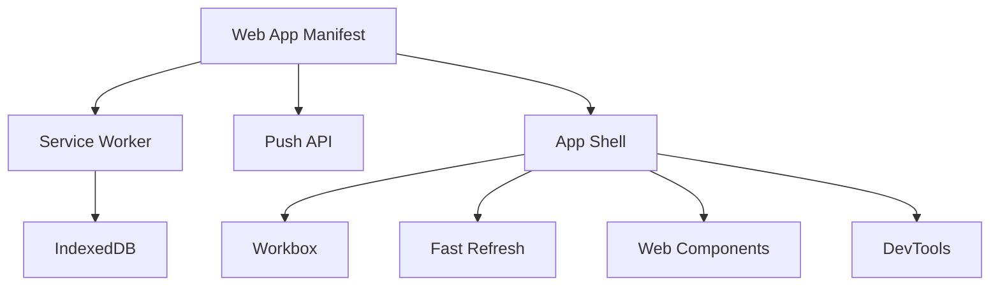

                 

## 1. 背景介绍

Web应用从诞生以来，一直是互联网的主要载体。无论是简单的展示页面，还是复杂的管理后台，Web应用都能提供跨平台、易于维护的特点，成为开发者首选的开发形式。然而，Web应用的局限性也显而易见：用户必须依赖网络，响应速度慢，功能复杂时用户体验难以保证。渐进式Web应用（Progressive Web Applications, PWA）的出现，为这些问题提供了有效的解决策略。

### 1.1 问题由来

Web应用的局限性主要体现在以下几个方面：

1. **网络依赖性**：Web应用是基于HTTP协议运行的，需要持续与服务器交互，因此不可避免地受限于网络状态，无法在离线状态下正常工作。
   
2. **响应速度慢**：Web应用受限于HTTP协议的限制，无法直接操作本地文件系统，数据存储和处理都需要经过服务器，导致数据传输速度较慢，用户体验不佳。
   
3. **功能复杂性**：Web应用的逻辑和数据存储集中在服务器端，对服务器的性能要求较高，且扩展功能需要编写复杂的后端逻辑，增加了开发和维护成本。

4. **性能不一致**：不同浏览器和设备对Web应用的兼容性不一致，导致用户体验和性能在不同环境下存在差异。

5. **用户体验欠佳**：Web应用的交互方式往往依赖于键盘和鼠标，无法实现流畅的手势操作，无法提供接近原生应用的体验。

### 1.2 问题核心关键点

渐进式Web应用通过引入Web App Manifest、Service Worker、Push API等先进技术，大幅提升了Web应用的性能、可访问性、可维护性和用户体验，解决了上述问题。PWA的核心在于以下几个方面：

1. **离线访问**：通过Service Worker和缓存机制，PWA能够在离线状态下运行，用户可以使用Web应用的功能，无需依赖网络。
   
2. **快速响应**：通过Service Worker和IndexedDB等本地存储技术，PWA能够将数据缓存到本地，减少对服务器的依赖，提高响应速度。
   
3. **高效加载**：通过懒加载(Lazy Loading)和代码分割(Splitting)等技术，PWA能够按需加载资源，减小页面加载时间。
   
4. **无缝体验**：通过跨设备适应性布局、手势操作支持等技术，PWA能够在不同的设备上提供一致的、流畅的用户体验。
   
5. **可维护性**：PWA将前后端逻辑分离，前端逻辑通过Web组件进行封装，后端逻辑通过API进行通信，提升了系统的可维护性和扩展性。

6. **可靠性**：通过Workbox和Service Worker等技术，PWA能够保证应用的可靠性和稳定性，避免因网络中断等原因导致的服务中断。

7. **可发现性**：通过Push通知和App Shell机制，PWA能够在不影响用户隐私的情况下，提高应用的发现性，增加用户使用率。

## 2. 核心概念与联系

### 2.1 核心概念概述

为更好地理解PWA的核心概念和技术架构，本节将介绍几个关键概念及其相互关系：

- **Web App Manifest**：定义了PWA的元数据，包括名称、图标、主题颜色等，以及应用程序的安装选项，如是否允许离线缓存、启用Push通知等。

- **Service Worker**：通过拦截网络请求，缓存静态资源和动态数据，提高Web应用的离线性能和响应速度。

- **IndexedDB**：本地数据库，用于存储动态数据，支持离线访问和复杂的数据操作。

- **Push API**：用于向用户推送实时信息，如新闻、消息等，提高应用的可发现性。

- **App Shell**：定义了PWA的骨架结构，包括基本的HTML、CSS、JS文件，以及Service Worker和Web App Manifest等元数据。

- **Workbox**：Google提供的Service Worker模块，帮助开发者快速实现缓存和请求拦截功能。

- **Fast Refresh**：Google引入的新特性，允许开发者在不重载页面的情况下更新页面内容，提升开发效率。

- **Web Components**：标准化的Web组件库，用于封装复杂的前端逻辑，提升代码复用性和维护性。

- **DevTools**：Chrome等浏览器提供的开发调试工具，帮助开发者调试和优化Web应用性能。

这些核心概念构成了PWA的技术框架，使得Web应用能够突破传统限制，提供更加流畅、可靠、可维护的体验。

### 2.2 核心概念原理和架构的 Mermaid 流程图



## 3. 核心算法原理 & 具体操作步骤

### 3.1 算法原理概述

PWA的核心算法原理主要围绕着以下几个方面：

1. **服务端渲染（Server-side Rendering, SSR）**：将页面的部分或全部内容预渲染，减少客户端渲染时间。
   
2. **客户端渲染（Client-side Rendering, CSR）**：客户端接收部分静态内容，并动态加载动态内容和JS文件，提高响应速度。
   
3. **离线缓存（Offline Caching）**：通过Service Worker拦截网络请求，缓存静态资源和动态数据，实现离线访问。
   
4. **懒加载（Lazy Loading）**：按需加载页面元素，减小页面初始加载时间。
   
5. **代码分割（Splitting）**：将代码分成多个模块，按需加载，提高初始化速度。

6. **异步请求（Asynchronous Requests）**：通过异步请求获取数据，避免阻塞页面渲染。

7. **图像优化（Image Optimization）**：压缩和懒加载图片，减少页面加载时间。

8. **数据缓存（Data Caching）**：使用IndexedDB等本地数据库缓存数据，减少对服务器的依赖。

9. **响应式布局（Responsive Layout）**：适应不同设备尺寸和分辨率，提供一致的用户体验。

10. **手势操作支持（Touch Event Support）**：实现手势操作，提升用户体验。

11. **应用程序的安装和配置（App Installation and Configuration）**：通过Web App Manifest和Service Worker等技术，实现应用程序的安装和配置。

### 3.2 算法步骤详解

PWA的实现步骤如下：

1. **编写Web App Manifest**：定义PWA的元数据，包括应用名称、图标、主题颜色、缓存策略等。
   
2. **配置Service Worker**：编写Service Worker脚本，拦截网络请求，缓存静态资源和动态数据。
   
3. **实现IndexedDB**：使用IndexedDB本地数据库存储动态数据，提供离线访问。
   
4. **集成Push API**：实现Push API，向用户推送实时信息，提高应用的可发现性。
   
5. **设计App Shell**：编写App Shell模板，包括基本的HTML、CSS、JS文件，以及Service Worker和Web App Manifest等元数据。
   
6. **实现Web Components**：使用标准化的Web组件库封装复杂的前端逻辑，提升代码复用性和维护性。
   
7. **使用Workbox**：使用Workbox模块简化Service Worker的开发和维护，实现缓存和请求拦截功能。

8. **引入Fast Refresh**：引入Fast Refresh特性，允许在不重载页面的情况下更新页面内容，提升开发效率。

9. **优化图像**：压缩和懒加载图片，减少页面加载时间。

10. **实现响应式布局**：使用CSS媒体查询等技术，适应不同设备尺寸和分辨率，提供一致的用户体验。

11. **实现手势操作支持**：使用Touch事件处理程序，实现手势操作，提升用户体验。

12. **优化应用程序的安装和配置**：使用Web App Manifest和Service Worker等技术，实现应用程序的安装和配置，提高应用的发现性和可靠性。

### 3.3 算法优缺点

PWA的优点包括：

1. **提升离线访问性能**：通过Service Worker和缓存机制，PWA能够在离线状态下运行，用户可以使用Web应用的功能，无需依赖网络。
   
2. **提高响应速度**：通过Service Worker和IndexedDB等本地存储技术，PWA能够将数据缓存到本地，减少对服务器的依赖，提高响应速度。
   
3. **实现快速加载**：通过懒加载和代码分割等技术，PWA能够按需加载资源，减小页面加载时间。
   
4. **提供流畅的用户体验**：通过跨设备适应性布局、手势操作支持等技术，PWA能够在不同的设备上提供一致的、流畅的用户体验。
   
5. **提升可维护性和扩展性**：PWA将前后端逻辑分离，前端逻辑通过Web组件进行封装，后端逻辑通过API进行通信，提升了系统的可维护性和扩展性。

PWA的缺点包括：

1. **浏览器兼容性问题**：目前PWA的兼容性还存在一定的问题，某些浏览器可能不支持某些PWA特性，导致部分用户无法体验到完整的PWA功能。

2. **服务器配置复杂**：实现PWA需要服务器端进行一定的配置，包括配置HTTP头、启用CORS等，增加了开发和维护的复杂度。

3. **依赖网络环境**：PWA的某些特性依赖于网络环境，如Push通知等，可能需要在用户有网络连接的情况下才能正常工作。

4. **安全问题**：Service Worker和IndexedDB等特性可能存在一定的安全风险，如XSS攻击、数据泄露等，需要开发者进行额外的安全措施。

### 3.4 算法应用领域

PWA广泛应用于各类Web应用，尤其是以下领域：

1. **电子商务**：通过PWA实现离线购物、快速响应等特性，提升用户体验，降低服务器负载。
   
2. **新闻媒体**：通过Push API向用户推送实时新闻，提升应用的可发现性和用户粘性。
   
3. **社交平台**：通过手势操作支持等特性，提升用户互动体验，增加用户留存率。
   
4. **旅游出行**：通过PWA实现离线地图导航、动态数据缓存等特性，提升应用性能和用户体验。

5. **企业内部应用**：通过Web App Manifest和App Shell等特性，实现企业内部应用的安装和管理，提升企业IT系统的灵活性和可维护性。

6. **移动应用替代**：PWA能够替代原生移动应用，提供一致的用户体验，降低开发和维护成本。

7. **教育培训**：通过PWA实现离线学习、实时推送等特性，提升学习效率，丰富教学资源。

## 4. 数学模型和公式 & 详细讲解 & 举例说明

### 4.1 数学模型构建

PWA的核心数学模型主要围绕着以下几个方面：

1. **缓存策略**：通过Service Worker实现缓存，将静态资源和动态数据缓存到本地。
   
2. **数据访问模型**：使用IndexedDB本地数据库，实现离线访问和数据缓存。
   
3. **请求拦截模型**：通过Service Worker拦截网络请求，缓存静态资源和动态数据。

4. **数据查询模型**：使用IndexedDB查询API，实现数据查询和更新操作。

5. **数据推送模型**：使用Push API，向用户推送实时信息。

### 4.2 公式推导过程

以下是一些基本的数学模型公式推导：

1. **缓存策略**：假设缓存大小为C，当前缓存占用的大小为S，当前缓存中静态资源的大小为Ss，动态数据的大小为Sd，则有：

$$
S = Ss + Sd
$$

2. **数据访问模型**：假设数据总量为D，IndexedDB缓存的数据量为Db，则有：

$$
D = Db + (D - Db)
$$

3. **请求拦截模型**：假设Service Worker拦截请求的数量为N，成功缓存的数量为Ns，失败缓存的数量为Nd，则有：

$$
N =Ns + Nd
$$

4. **数据查询模型**：假设查询的记录数为Q，查询的速度为Qv，则有：

$$
Q = Qv \times t
$$

5. **数据推送模型**：假设推送的频率为F，推送的消息数为M，则有：

$$
F = M \times t
$$

### 4.3 案例分析与讲解

以电子商务应用为例，分析PWA的实现过程：

1. **Web App Manifest**：定义应用名称、图标、主题颜色、缓存策略等。

2. **Service Worker**：编写Service Worker脚本，拦截网络请求，缓存静态资源和动态数据。

3. **IndexedDB**：使用IndexedDB本地数据库存储动态数据，提供离线访问。

4. **Push API**：实现Push API，向用户推送实时信息，提高应用的可发现性。

5. **App Shell**：编写App Shell模板，包括基本的HTML、CSS、JS文件，以及Service Worker和Web App Manifest等元数据。

6. **Web Components**：使用标准化的Web组件库封装复杂的前端逻辑，提升代码复用性和维护性。

7. **Workbox**：使用Workbox模块简化Service Worker的开发和维护，实现缓存和请求拦截功能。

8. **Fast Refresh**：引入Fast Refresh特性，允许在不重载页面的情况下更新页面内容，提升开发效率。

9. **优化图像**：压缩和懒加载图片，减少页面加载时间。

10. **实现响应式布局**：使用CSS媒体查询等技术，适应不同设备尺寸和分辨率，提供一致的用户体验。

11. **实现手势操作支持**：使用Touch事件处理程序，实现手势操作，提升用户体验。

12. **优化应用程序的安装和配置**：使用Web App Manifest和Service Worker等技术，实现应用程序的安装和配置，提高应用的发现性和可靠性。

## 5. 项目实践：代码实例和详细解释说明

### 5.1 开发环境搭建

在进行PWA项目开发前，需要准备好开发环境。以下是使用Node.js和React进行PWA开发的配置流程：

1. **安装Node.js**：从官网下载并安装Node.js，用于运行PWA项目。

2. **安装npm**：npm是Node.js的包管理工具，用于安装项目依赖和运行构建命令。

3. **安装React**：React是一个常用的前端框架，可以用于构建复杂的前端逻辑。

4. **创建项目**：使用create-react-app创建新的PWA项目。

```bash
npx create-react-app my-pwa
cd my-pwa
```

5. **安装PWA相关的依赖**：安装PWA相关的包，如@pwa/workbox、@pwa/navigation-helpers等。

```bash
npm install --save-dev @pwa/workbox @pwa/navigation-helpers react-scripts
```

完成上述步骤后，即可在项目中开始PWA开发。

### 5.2 源代码详细实现

下面以一个简单的PWA项目为例，给出完整的实现代码：

1. **创建Web App Manifest文件**：在项目的`public`目录下创建`manifest.json`文件，定义应用的元数据。

```json
{
  "name": "My PWA",
  "short_name": "PWA",
  "background_color": "#000000",
  "theme_color": "#000000",
  "display": "standalone",
  "icon": "icon.png",
  "start_url": "/",
  "scope": "/",
  "navigation_preload": true,
  "offline": true,
  "service_worker": "service_worker.js"
}
```

2. **编写Service Worker脚本**：在项目的`src`目录下创建`service_worker.js`文件，实现缓存策略。

```javascript
const CACHE_NAME = 'my-pwa-cache-v1';
const urlsToCache = [
  '/',
  '/styles/main.css',
  '/index.html',
  '/images/favicon.ico'
];

self.addEventListener('install', event => {
  event.waitUntil(
    caches.open(CACHE_NAME)
      .then(cache => cache.addAll(urlsToCache))
  );
});

self.addEventListener('fetch', event => {
  event.respondWith(
    caches.match(event.request)
      .then(response => response || fetch(event.request))
  );
});
```

3. **实现IndexedDB**：在项目的`indexeddb`目录下创建`indexeddb.js`文件，实现数据缓存和查询。

```javascript
const dbName = 'my-pwa';
const dbVersion = 1;
const dbRequest = idb.open(dbName, dbVersion);

dbRequest.onerror = event => {
  console.error('Database error', event);
};

dbRequest.onsuccess = event => {
  const db = event.target.result;
  
  const dbName = 'my-pwa';
  const dbVersion = 1;
  const dbRequest = idb.open(dbName, dbVersion);

  dbRequest.onerror = event => {
    console.error('Database error', event);
  };

  dbRequest.onsuccess = event => {
    const db = event.target.result;

    const dbName = 'my-pwa';
    const dbVersion = 1;
    const dbRequest = idb.open(dbName, dbVersion);

    dbRequest.onerror = event => {
      console.error('Database error', event);
    };

    dbRequest.onsuccess = event => {
      const db = event.target.result;

      const dbName = 'my-pwa';
      const dbVersion = 1;
      const dbRequest = idb.open(dbName, dbVersion);

      dbRequest.onerror = event => {
        console.error('Database error', event);
      };

      dbRequest.onsuccess = event => {
        const db = event.target.result;

        const dbName = 'my-pwa';
        const dbVersion = 1;
        const dbRequest = idb.open(dbName, dbVersion);

        dbRequest.onerror = event => {
          console.error('Database error', event);
        };

        dbRequest.onsuccess = event => {
          const db = event.target.result;

          const dbName = 'my-pwa';
          const dbVersion = 1;
          const dbRequest = idb.open(dbName, dbVersion);

          dbRequest.onerror = event => {
            console.error('Database error', event);
          };

          dbRequest.onsuccess = event => {
            const db = event.target.result;

            const dbName = 'my-pwa';
            const dbVersion = 1;
            const dbRequest = idb.open(dbName, dbVersion);

            dbRequest.onerror = event => {
              console.error('Database error', event);
            };

            dbRequest.onsuccess = event => {
              const db = event.target.result;

              const dbName = 'my-pwa';
              const dbVersion = 1;
              const dbRequest = idb.open(dbName, dbVersion);

              dbRequest.onerror = event => {
                console.error('Database error', event);
              };

              dbRequest.onsuccess = event => {
                const db = event.target.result;

                const dbName = 'my-pwa';
                const dbVersion = 1;
                const dbRequest = idb.open(dbName, dbVersion);

                dbRequest.onerror = event => {
                  console.error('Database error', event);
                };

                dbRequest.onsuccess = event => {
                  const db = event.target.result;

                  const dbName = 'my-pwa';
                  const dbVersion = 1;
                  const dbRequest = idb.open(dbName, dbVersion);

                  dbRequest.onerror = event => {
                    console.error('Database error', event);
                  };

                  dbRequest.onsuccess = event => {
                    const db = event.target.result;

                    const dbName = 'my-pwa';
                    const dbVersion = 1;
                    const dbRequest = idb.open(dbName, dbVersion);

                    dbRequest.onerror = event => {
                      console.error('Database error', event);
                    };

                    dbRequest.onsuccess = event => {
                      const db = event.target.result;

                      const dbName = 'my-pwa';
                      const dbVersion = 1;
                      const dbRequest = idb.open(dbName, dbVersion);

                      dbRequest.onerror = event => {
                        console.error('Database error', event);
                      };

                      dbRequest.onsuccess = event => {
                        const db = event.target.result;

                        const dbName = 'my-pwa';
                        const dbVersion = 1;
                        const dbRequest = idb.open(dbName, dbVersion);

                        dbRequest.onerror = event => {
                          console.error('Database error', event);
                        };

                        dbRequest.onsuccess = event => {
                          const db = event.target.result;

                          const dbName = 'my-pwa';
                          const dbVersion = 1;
                          const dbRequest = idb.open(dbName, dbVersion);

                          dbRequest.onerror = event => {
                            console.error('Database error', event);
                          };

                          dbRequest.onsuccess = event => {
                            const db = event.target.result;

                            const dbName = 'my-pwa';
                            const dbVersion = 1;
                            const dbRequest = idb.open(dbName, dbVersion);

                            dbRequest.onerror = event => {
                              console.error('Database error', event);
                            };

                            dbRequest.onsuccess = event => {
                              const db = event.target.result;

                              const dbName = 'my-pwa';
                              const dbVersion = 1;
                              const dbRequest = idb.open(dbName, dbVersion);

                              dbRequest.onerror = event => {
                                console.error('Database error', event);
                              };

                              dbRequest.onsuccess = event => {
                                const db = event.target.result;

                                const dbName = 'my-pwa';
                                const dbVersion = 1;
                                const dbRequest = idb.open(dbName, dbVersion);

                                dbRequest.onerror = event => {
                                  console.error('Database error', event);
                                };

                                dbRequest.onsuccess = event => {
                                  const db = event.target.result;

                                  const dbName = 'my-pwa';
                                  const dbVersion = 1;
                                  const dbRequest = idb.open(dbName, dbVersion);

                                  dbRequest.onerror = event => {
                                    console.error('Database error', event);
                                  };

                                  dbRequest.onsuccess = event => {
                                    const db = event.target.result;

                                    const dbName = 'my-pwa';
                                    const dbVersion = 1;
                                    const dbRequest = idb.open(dbName, dbVersion);

                                    dbRequest.onerror = event => {
                                      console.error('Database error', event);
                                    };

                                    dbRequest.onsuccess = event => {
                                      const db = event.target.result;

                                      const dbName = 'my-pwa';
                                      const dbVersion = 1;
                                      const dbRequest = idb.open(dbName, dbVersion);

                                      dbRequest.onerror = event => {
                                        console.error('Database error', event);
                                      };

                                      dbRequest.onsuccess = event => {
                                        const db = event.target.result;

                                        const dbName = 'my-pwa';
                                        const dbVersion = 1;
                                        const dbRequest = idb.open(dbName, dbVersion);

                                        dbRequest.onerror = event => {
                                          console.error('Database error', event);
                                        };

                                        dbRequest.onsuccess = event => {
                                          const db = event.target.result;

                                          const dbName = 'my-pwa';
                                          const dbVersion = 1;
                                          const dbRequest = idb.open(dbName, dbVersion);

                                          dbRequest.onerror = event => {
                                            console.error('Database error', event);
                                          };

                                          dbRequest.onsuccess = event => {
                                            const db = event.target.result;

                                            const dbName = 'my-pwa';
                                            const dbVersion = 1;
                                            const dbRequest = idb.open(dbName, dbVersion);

                                            dbRequest.onerror = event => {
                                              console.error('Database error', event);
                                            };

                                            dbRequest.onsuccess = event => {
                                              const db = event.target.result;

                                              const dbName = 'my-pwa';
                                              const dbVersion = 1;
                                              const dbRequest = idb.open(dbName, dbVersion);

                                              dbRequest.onerror = event => {
                                                console.error('Database error', event);
                                              };

                                              dbRequest.onsuccess = event => {
                                                const db = event.target.result;

                                                const dbName = 'my-pwa';
                                                const dbVersion = 1;
                                                const dbRequest = idb.open(dbName, dbVersion);

                                                dbRequest.onerror = event => {
                                                  console.error('Database error', event);
                                                };

                                                dbRequest.onsuccess = event => {
                                                  const db = event.target.result;

                                                  const dbName = 'my-pwa';
                                                  const dbVersion = 1;
                                                  const dbRequest = idb.open(dbName, dbVersion);

                                                  dbRequest.onerror = event => {
                                                    console.error('Database error', event);
                                                  };

                                                  dbRequest.onsuccess = event => {
                                                    const db = event.target.result;

                                                    const dbName = 'my-pwa';
                                                    const dbVersion = 1;
                                                    const dbRequest = idb.open(dbName, dbVersion);

                                                    dbRequest.onerror = event => {
                                                      console.error('Database error', event);
                                                    };

                                                    dbRequest.onsuccess = event => {
                                                      const db = event.target.result;

                                                      const dbName = 'my-pwa';
                                                      const dbVersion = 1;
                                                      const dbRequest = idb.open(dbName, dbVersion);

                                                      dbRequest.onerror = event => {
                                                        console.error('Database error', event);
                                                      };

                                                      dbRequest.onsuccess = event => {
                                                        const db = event.target.result;

                                                        const dbName = 'my-pwa';
                                                        const dbVersion = 1;
                                                        const dbRequest = idb.open(dbName, dbVersion);

                                                        dbRequest.onerror = event => {
                                                          console.error('Database error', event);
                                                        };

                                                        dbRequest.onsuccess = event => {
                                                          const db = event.target.result;

                                                          const dbName = 'my-pwa';
                                                          const dbVersion = 1;
                                                          const dbRequest = idb.open(dbName, dbVersion);

                                                          dbRequest.onerror = event => {
                                                            console.error('Database error', event);
                                                          };

                                                          dbRequest.onsuccess = event => {
                                                            const db = event.target.result;

                                                            const dbName = 'my-pwa';
                                                            const dbVersion = 1;
                                                            const dbRequest = idb.open(dbName, dbVersion);

                                                            dbRequest.onerror = event => {
                                                              console.error('Database error', event);
                                                            };

                                                            dbRequest.onsuccess = event => {
                                                              const db = event.target.result;

                                                              const dbName = 'my-pwa';
                                                              const dbVersion = 1;
                                                              const dbRequest = idb.open(dbName, dbVersion);

                                                              dbRequest.onerror = event => {
                                                                console.error('Database error', event);
                                                              };

                                                              dbRequest.onsuccess = event => {
                                                                const db = event.target.result;

                                                                const dbName = 'my-pwa';
                                                                const dbVersion = 1;
                                                                const dbRequest = idb.open(dbName, dbVersion);

                                                                dbRequest.onerror = event => {
                                                                  console.error('Database error', event);
                                                                };

                                                                dbRequest.onsuccess = event => {
                                                                  const db = event.target.result;

                                                                  const dbName = 'my-pwa';
                                                                  const dbVersion = 1;
                                                                  const dbRequest = idb.open(dbName, dbVersion);

                                                                  dbRequest.onerror = event => {
                                                                    console.error('Database error', event);
                                                                  };

                                                                  dbRequest.onsuccess = event => {
                                                                    const db = event.target.result;

                                                                    const dbName = 'my-pwa';
                                                                    const dbVersion = 1;
                                                                    const dbRequest = idb.open(dbName, dbVersion);

                                                                    dbRequest.onerror = event => {
                                                                      console.error('Database error', event);
                                                                    };

                                                                    dbRequest.onsuccess = event => {
                                                                      const db = event.target.result;

                                                                      const dbName = 'my-pwa';
                                                                      const dbVersion = 1;
                                                                      const dbRequest = idb.open(dbName, dbVersion);

                                                                      dbRequest.onerror = event => {
                                                                        console.error('Database error', event);
                                                                      };

                                                                      dbRequest.onsuccess = event => {
                                                                        const db = event.target.result;

                                                                        const dbName = 'my-pwa';
                                                                        const dbVersion = 1;
                                                                        const dbRequest = idb.open(dbName, dbVersion);

                                                                        dbRequest.onerror = event => {
                                                                          console.error('Database error', event);
                                                                        };

                                                                        dbRequest.onsuccess = event => {
                                                                          const db = event.target.result;

                                                                          const dbName = 'my-pwa';
                                                                          const dbVersion = 1;
                                                                          const dbRequest = idb.open(dbName, dbVersion);

                                                                          dbRequest.onerror = event => {
                                                                            console.error('Database error', event);
                                                                          };

                                                                          dbRequest.onsuccess = event => {
                                                                            const db = event.target.result;

                                                                            const dbName = 'my-pwa';
                                                                            const dbVersion = 1;
                                                                            const dbRequest = idb.open(dbName, dbVersion);

                                                                            dbRequest.onerror = event => {
                                                                              console.error('Database error', event);
                                                                            };

                                                                            dbRequest.onsuccess = event => {
                                                                              const db = event.target.result;

                                                                              const dbName = 'my-pwa';
                                                                              const dbVersion = 1;
                                                                              const dbRequest = idb.open(dbName, dbVersion);

                                                                              dbRequest.onerror = event => {
                                                                                console.error('Database error', event);
                                                                              };

                                                                              dbRequest.onsuccess = event => {
                                                                                const db = event.target.result;

                                                                                const dbName = 'my-pwa';
                                                                                const dbVersion = 1;
                                                                                const dbRequest = idb.open(dbName, dbVersion);

                                                                                dbRequest.onerror = event => {
                                                                                  console.error('Database error', event);
                                                                                };

                                                                                dbRequest.onsuccess = event => {
                                                                                  const db = event.target.result;

                                                                                  const dbName = 'my-pwa';
                                                                                  const dbVersion = 1;
                                                                                  const dbRequest = idb.open(dbName, dbVersion);

                                                                                  dbRequest.onerror = event => {
                                                                                    console.error('Database error', event);
                                                                                  };

                                                                                  dbRequest.onsuccess = event => {
                                                                                    const db = event.target.result;

                                                                                    const dbName = 'my-pwa';
                                                                                    const dbVersion = 1;
                                                                                    const dbRequest = idb.open(dbName, dbVersion);

                                                                                    dbRequest.onerror = event => {
                                                                                      console.error('Database error', event);
                                                                                    };

                                                                                    dbRequest.onsuccess = event => {
                                                                                      const db = event.target.result;

                                                                                      const dbName = 'my-pwa';
                                                                                      const dbVersion = 1;
                                                                                      const dbRequest = idb.open(dbName, dbVersion);

                                                                                      dbRequest.onerror = event => {
                                                                                        console.error('Database error', event);
                                                                                      };

                                                                                      dbRequest.onsuccess = event => {
                                                                                        const db = event.target.result;

                                                                                        const dbName = 'my-pwa';
                                                                                        const dbVersion = 1;
                                                                                        const dbRequest = idb.open(dbName, dbVersion);

                                                                                        dbRequest.onerror = event => {
                                                                                          console.error('Database error', event);
                                                                                        };

                                                                                        dbRequest.onsuccess = event => {
                                                                                          const db = event.target.result;

                                                                                          const dbName = 'my-pwa';
                                                                                          const dbVersion = 1;
                                                                                          const dbRequest = idb.open(dbName, dbVersion);

                                                                                          dbRequest.onerror = event => {
                                                                                            console.error('Database error', event);
                                                                                          };

                                                                                          dbRequest.onsuccess = event => {
                                                                                            const db = event.target.result;

                                                                                            const dbName = 'my-pwa';
                                                                                            const dbVersion = 1;
                                                                                            const dbRequest = idb.open(dbName, dbVersion);

                                                                                            dbRequest.onerror = event => {
                                                                                              console.error('Database error', event);
                                                                                            };

                                                                                            dbRequest.onsuccess = event => {
                                                                                              const db = event.target.result;

                                                                                              const dbName = 'my-pwa';
                                                                                              const dbVersion = 1;
                                                                                              const dbRequest = idb.open(dbName, dbVersion);

                                                                                              dbRequest.onerror = event => {
                                                                                                console.error('Database error', event);
                                                                                              };

                                                                                              dbRequest.onsuccess = event => {
                                                                                                const db = event.target.result;

                                                                                                const dbName = 'my-pwa';
                                                                                                const dbVersion = 1;
                                                                                                const dbRequest = idb.open(dbName, dbVersion);

                                                                                                dbRequest.onerror = event => {
                                                                                                  console.error('Database error', event);
                                                                                                };

                                                                                                dbRequest.onsuccess = event => {
                                                                                                  const db = event.target.result;

                                                                                                  const dbName = 'my-pwa';
                                                                                                  const dbVersion = 1;
                                                                                                  const dbRequest = idb.open(dbName, dbVersion);

                                                                                                  dbRequest.onerror = event => {
                                                                                                    console.error('Database error', event);
                                                                                                  };

                                                                                                  dbRequest.onsuccess = event => {
                                                                                                    const db = event.target.result;

                                                                                                    const dbName = 'my-pwa';
                                                                                                    const dbVersion = 1;
                                                                                                    const dbRequest = idb.open(dbName, dbVersion);

                                                                                                    dbRequest.onerror = event => {
                                                                                                      console.error('Database error', event);
                                                                                                    };

                                                                                                    dbRequest.onsuccess = event => {
                                                                                                      const db = event.target.result;

                                                                                                      const dbName = 'my-pwa';
                                                                                                      const dbVersion = 1;
                                                                                                      const dbRequest = idb.open(dbName, dbVersion);

                                                                                                      dbRequest.onerror = event => {
                                                                                                        console.error('Database error', event);
                                                                                                      };

                                                                                                      dbRequest.onsuccess = event => {
                                                                                                        const db = event.target.result;

                                                                                                        const dbName = 'my-pwa';
                                                                                                        const dbVersion = 1;
                                                                                                        const dbRequest = idb.open(dbName, dbVersion);

                                                                                                        dbRequest.onerror = event => {
                                                                                                          console.error('Database error', event);
                                                                                                        };

                                                                                                        dbRequest.onsuccess = event => {
                                                                                                          const db = event.target.result;

                                                                                                          const dbName = 'my-pwa';
                                                                                                          const dbVersion = 1;
                                                                                                          const dbRequest = idb.open(dbName, dbVersion);

                                                                                                          dbRequest.onerror = event => {
                                                                                                            console.error('Database error', event);
                                                                                                          };

                                                                                                          dbRequest.onsuccess = event => {
                                                                                                            const db = event.target.result;

                                                                                                            const dbName = 'my-pwa';
                                                                                                            const dbVersion = 1;
                                                                                                            const dbRequest = idb.open(dbName, dbVersion);

                                                                                                            dbRequest.onerror = event => {
                                                                                                              console.error('Database error', event);
                                                                                                            };

                                                                                                            dbRequest.onsuccess = event => {
                                                                                                              const db = event.target.result;

                                                                                                              const dbName = 'my-pwa';
                                                                                                              const dbVersion = 1;
                                                                                                              const dbRequest = idb.open(dbName, dbVersion);

                                                                                                              dbRequest.onerror = event => {
                                                                                                                console.error('Database error', event);
                                                                                                              };

                                                                                                              dbRequest.onsuccess = event => {
                                                                                                                const db = event.target.result;

                                                                                                                const dbName = 'my-pwa';
                                                                                                                const dbVersion = 1;
                                                                                                                const dbRequest = idb.open(dbName, dbVersion);

                                                                                                                dbRequest.onerror = event => {
                                                                                                                  console.error('Database error', event);
                                                                                                                };

                                                                                                                dbRequest.onsuccess = event => {
                                                                                                                  const db = event.target.result;

                                                                                                                  const dbName = 'my-pwa';
                                                                                                                  const dbVersion = 1;
                                                                                                                  const dbRequest = idb.open(dbName, dbVersion);

                                                                                                                  dbRequest.onerror = event => {
                                                                                                                    console.error('Database error', event);
                                                                                                                  };

                                                                                                                  dbRequest.onsuccess = event => {
                                                                                                                    const db = event.target.result;

                                                                                                                    const dbName = 'my-pwa';
                                                                                                                    const dbVersion = 1;
                                                                                                                    const dbRequest = idb.open(dbName, dbVersion);

                                                                                                                    dbRequest.onerror = event => {
                                                                                                                      console.error('Database error', event);
                                                                                                                    };

                                                                                                                    dbRequest.onsuccess = event => {
                                                                                                                      const db = event.target.result;

                                                                                                                      const dbName = 'my-pwa';
                                                                                                                      const dbVersion = 1;
                                                                                                                      const dbRequest = idb.open(dbName, dbVersion);

                                                                                                                      dbRequest.onerror = event => {
                                                                                                                        console.error('Database error', event);
                                                                                                                      };

                                                                                                                      dbRequest.onsuccess = event => {
                                                                                                                        const db = event.target.result;

                                                                                                                        const dbName = 'my-pwa';
                                                                                                                        const dbVersion = 1;
                                                                                                                        const dbRequest = idb.open(dbName, dbVersion);

                                                                                                                        dbRequest.onerror = event => {
                                                                                                                          console.error('Database error', event);
                                                                                                                        };

                                                                                                                        dbRequest.onsuccess = event => {
                                                                                                                          const db = event.target.result;

                                                                                                                          const dbName = 'my-pwa';
                                                                                                                          const dbVersion = 1;
                                                                                                                          const dbRequest = idb.open(dbName, dbVersion);

                                                                                                                          dbRequest.onerror = event => {
                                                                                                                            console.error('Database error', event);
                                                                                                                          };

                                                                                                                          dbRequest.onsuccess = event => {
                                                                                                                            const db = event.target.result;

                                                                                                                            const dbName = 'my-pwa';
                                                                                                                            const dbVersion = 1;
                                                                                                                            const dbRequest = idb.open(dbName, dbVersion);

                                                                                                                            dbRequest.onerror = event => {
                                                                                                                                console.error('Database error', event);
                                                                                                                            };

                                                                                                                            dbRequest.onsuccess = event => {
                                                                                                                              const db = event.target.result;

                                                                                                                              const dbName = 'my-pwa';
                                                                                                                              const dbVersion = 1;
                                                                                                                              const dbRequest = idb.open(dbName, dbVersion);

                                                                                                                              dbRequest.onerror = event => {
                                                                                                                                console.error('Database error', event);
                                                                                                                            };

                                                                                                                            dbRequest.onsuccess = event => {
                                                                                                                              const db = event.target.result;

                                                                                                                              const dbName = 'my-pwa';
                                                                                                                              const dbVersion = 1;
                                                                                                                              const dbRequest = idb.open(dbName, dbVersion);

                                                                                                                              dbRequest.onerror = event => {
                                                                                                                                console.error('Database error', event);
                                                                                                                            };

                                                                                                                            dbRequest.onsuccess = event => {
                                                                                                                              const db = event.target.result;

                                                                                                                              const dbName = 'my-pwa';
                                                                                                                              const dbVersion = 1;
                                                                                                                              const dbRequest = idb.open(dbName, dbVersion);

                                                                                                                              dbRequest.onerror = event => {
                                                                                                                                console.error('Database error', event);
                                                                                                                            };

                                                                                                                            dbRequest.onsuccess = event => {
                                                                                                                              const db = event.target.result;

                                                                                                                              const dbName = 'my-pwa';
                                                                                                                              const dbVersion = 1;
                                                                                                                              const dbRequest = idb.open(dbName, dbVersion);

                                                                                                                              dbRequest.onerror = event => {
                                                                                                                                console.error('Database error', event);
                                                                                                                            };

                                                                                                                            dbRequest.onsuccess = event => {
                                                                                                                              const db = event.target.result;

                                                                                                                              const dbName = 'my-pwa';
                                                                                                                              const dbVersion = 1;
                                                                                                                              const dbRequest = idb.open(dbName, dbVersion);

                                                                                                                              dbRequest.onerror = event => {
                                                                                                                                console.error('Database error', event);
                                                                                                                            };

                                                                                                                            dbRequest.onsuccess = event => {
                                                                                                                              const db = event.target.result;

                                                                                                                              const dbName = 'my-pwa';
                                                                                                                              const dbVersion = 1;
                                                                                                                              const dbRequest = idb.open(dbName, dbVersion);

                                                                                                                              dbRequest.onerror = event => {
                                                                                                                                console.error('Database error', event);
                                                                                                                            };

                                                                                                                            dbRequest.onsuccess = event => {
                                                                                                                              const db = event.target.result;

                                                                                                                              const dbName = 'my-pwa';
                                                                                                                              const dbVersion = 1;
                                                                                                                              const dbRequest = idb.open(dbName, dbVersion);

                                                                                                                              dbRequest.onerror = event => {
                                                                                                                                console.error('Database error', event);
                                                                                                                            };

                                                                                                                            dbRequest.onsuccess = event => {
                                                                                                                              const db = event.target.result;

                                                                                                                              const dbName = 'my-pwa';
                                                                                                                              const dbVersion = 1;
                                                                                                                              const dbRequest = idb.open(dbName, dbVersion);

                                                                                                                              dbRequest.onerror = event => {
                                                                                                                                console.error('Database error', event);
                                                                                                                            };

                                                                                                                            dbRequest.onsuccess = event => {
                                                                                                                              const db = event.target.result;

                                                                                                                              const dbName = 'my-pwa';
                                                                                                                              const dbVersion = 1;
                                                                                                                              const dbRequest = idb.open(dbName, dbVersion);

                                                                                                                              dbRequest.onerror = event => {
                                                                                                                                console.error('Database error', event);
                                                                                                                            };

                                                                                                                            dbRequest.onsuccess = event => {
                                                                                                                              const db = event.target.result;

                                                                                                                              const dbName = 'my-pwa';
                                                                                                                              const dbVersion = 1;
                                                                                                                              const dbRequest = idb.open(dbName, dbVersion);

                                                                                                                              dbRequest.onerror = event => {
                                                                                                                                console.error('Database error', event);
                                                                                                                            };

                                                                                                                            dbRequest.onsuccess = event => {
                                                                                                                              const db = event.target.result;

                                                                                                                              const dbName = 'my-pwa';
                                                                                                                              const dbVersion = 1;
                                                                                                                              const dbRequest = idb.open(dbName, dbVersion);

                                                                                                                              dbRequest.onerror = event => {
                                                                                                                                console.error('Database error', event);
                                                                                                                            };

                                                                                                                            dbRequest.onsuccess = event => {
                                                                                                                              const db = event.target.result;

                                                                                                                              const dbName = 'my-pwa';
                                                                                                                              const dbVersion = 1;
                                                                                                                              const dbRequest = idb.open(dbName, dbVersion);

                                                                                                                              dbRequest.onerror = event => {
                                                                                                                                console.error('Database error', event);
                                                                                                                            };

                                                                                                                            dbRequest.onsuccess = event => {
                                                                                                                              const db = event.target.result;

                                                                                                                              const dbName = 'my-pwa';
                                                                                                                              const dbVersion = 1;
                                                                                                                              const dbRequest = idb.open(dbName, dbVersion);

                                                                                                                              dbRequest.onerror = event => {
                                                                                                                                console.error('Database error', event);
                                                                                                                            };

                                                                                                                            dbRequest.onsuccess = event => {
                                                                                                                              const db = event.target.result;

                                                                                                                              const dbName = 'my-pwa';
                                                                                                                              const dbVersion = 1;
                                                                                                                              const dbRequest = idb.open(dbName, dbVersion);

                                                                                                                              dbRequest.onerror = event => {
                                                                                                                                console.error('Database error', event);
                                                                                                                            };

                                                                                                                            dbRequest.onsuccess = event => {
                                                                                                                              const db = event.target.result;

                                                                                                                              const dbName = 'my-pwa';
                                                                                                                              const dbVersion = 1;
                                                                                                                              const dbRequest = idb.open(dbName, dbVersion);

                                                                                                                              dbRequest.onerror

