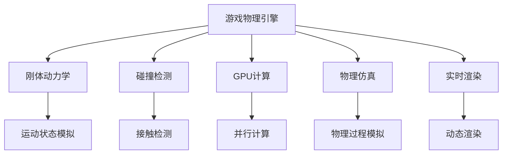

                 

# 游戏物理引擎：真实世界模拟

> 关键词：游戏物理引擎，真实世界模拟，刚体动力学，碰撞检测，GPU计算，物理仿真，实时渲染

## 1. 背景介绍

### 1.1 问题由来
在电子游戏的发展历程中，物理引擎从最初简单的碰撞检测到如今复杂的真实世界模拟，其技术迭代从未停歇。早期游戏如《马里奥兄弟》（Super Mario Bros）主要依靠简单的动画和预设的运动轨迹。然而，随着游戏产业的不断进化，玩家对游戏体验的追求也不断提升，开始追求更高的真实感、沉浸感和物理互动性。于是，物理引擎应运而生，成为构建高仿真、高互动、高可玩性的游戏体验的关键技术。

本系列文章将聚焦于游戏物理引擎，特别是其中的真实世界模拟技术。我们将探讨如何利用先进的计算技术，将物理模拟与真实世界紧密结合，打造出能够承载玩家进行沉浸式体验的游戏环境。通过深入了解物理引擎的核心概念和实现技术，我们希望为游戏开发者提供更强大的工具和更深刻的理论知识。

## 2. 核心概念与联系

### 2.1 核心概念概述

为更好地理解真实世界模拟技术，本节将介绍几个密切相关的核心概念：

- **游戏物理引擎**：是一个用于模拟物理行为的模块化软件框架，能用于实现游戏中的各种物理效果，如碰撞、重力、摩擦等。
- **刚体动力学**：是物理引擎的核心技术之一，用于描述物体在空间中的运动状态和相互作用力。
- **碰撞检测**：通过算法检测游戏世界中的物体是否接触，是实现物体间相互作用的基础。
- **GPU计算**：利用图形处理器（GPU）进行并行计算，大幅提升物理引擎的性能和实时性。
- **物理仿真**：通过数学模型模拟现实世界的物理过程，用于游戏中的物理行为生成。
- **实时渲染**：结合物理引擎与图形渲染引擎，生成动态且逼真的游戏画面。

这些核心概念之间的逻辑关系可以通过以下Mermaid流程图来展示：



这个流程图展示了一系列核心概念及其之间的关系：

1. 游戏物理引擎通过刚体动力学模块模拟物体的运动状态。
2. 碰撞检测模块用于检测物体间的接触，建立物理模型。
3. 物理引擎利用GPU计算进行高性能计算。
4. 物理仿真模块通过数学模型模拟物理过程。
5. 实时渲染模块结合物理引擎和图形渲染引擎，生成动态画面。

这些概念共同构成了游戏物理引擎的技术框架，使其能够模拟真实世界的各种物理行为，提供高逼真的游戏体验。

## 3. 核心算法原理 & 具体操作步骤
### 3.1 算法原理概述

真实世界模拟的核心算法涉及复杂的数学和物理模型。以下将详细讲解三个核心算法：刚体动力学、碰撞检测和物理仿真。

### 3.2 算法步骤详解

#### 刚体动力学

刚体动力学用于描述物体在空间中的运动状态和相互作用力。我们以二维刚体为例子，介绍核心算法步骤：

1. **初始化**：设定物体的初始位置、速度、加速度等状态参数。
2. **受力分析**：根据物理规则计算物体的受力情况，如重力、摩擦力、碰撞力等。
3. **运动方程求解**：利用牛顿第二定律（$F=ma$）计算物体的加速度和速度，更新其位置。
4. **碰撞检测**：判断物体是否与其他物体碰撞，更新碰撞信息。

#### 碰撞检测

碰撞检测通过算法检测物体间的接触，是实现物体间相互作用的基础。以下是常见的碰撞检测算法：

1. **基于包围盒的方法**：如AABB（Axis-Aligned Bounding Box）和OBB（Oriented Bounding Box），利用简单的几何体检测碰撞。
2. **基于边界的算法**：如Sweep and Prune（扫描与剔除），通过线段扫描和数据结构维护快速查找接触。
3. **基于网格的方法**：如Octree和KD-Tree，将空间划分为网格或树结构，快速定位接触。

#### 物理仿真

物理仿真通过数学模型模拟现实世界的物理过程。以下是常见物理仿真算法：

1. **牛顿力学模型**：如粒子系统、刚体系统、约束系统等，通过牛顿定律描述物体的运动。
2. **流体模拟**：如粒子流体、格子玻尔兹曼方法，模拟流体和气体的运动。
3. **软体仿真**：如有限元方法、拉格朗日力学，模拟柔性物体的形变和运动。

### 3.3 算法优缺点

游戏物理引擎中的算法具有以下优点：

- **实时性**：能够实时处理玩家的操作和物理变化，提供流畅的游戏体验。
- **可扩展性**：能够处理复杂的物理行为和动态变化，支持多种物理效果。
- **物理逼真**：通过精确的数学模型和物理规则，实现高度真实的物理效果。

然而，也存在一些缺点：

- **计算复杂度**：由于物理模拟涉及大量计算，性能要求较高，可能需要高效的并行计算技术。
- **精度控制**：物理模拟的精度需要精心调节，过高要求可能导致计算负担过重，过低则可能造成不真实感。
- **调优困难**：物理引擎的调优涉及到复杂的参数和算法设置，需要丰富的经验和大量实验。

### 3.4 算法应用领域

真实世界模拟技术在游戏领域有广泛的应用，例如：

- **赛车游戏**：实现车辆在赛道上的真实行驶、碰撞、漂移等物理效果。
- **飞行模拟器**：模拟飞机在空中的真实飞行、碰撞、空气动力学等物理行为。
- **射击游戏**：模拟枪械发射、弹道计算、子弹碰撞等物理效果。
- **物理沙盒**：如《我的世界》（Minecraft），通过物理引擎实现动态的游戏世界生成和物体互动。

## 4. 数学模型和公式 & 详细讲解 & 举例说明

### 4.1 数学模型构建

游戏物理引擎中的数学模型主要涉及经典力学和流体力学等领域的理论知识。以下是几个关键数学模型：

#### 牛顿力学

牛顿力学描述物体的运动状态和相互作用力，是物理引擎的核心。在二维刚体系统中，牛顿第二定律的公式为：

$$
F_x = m \frac{d^2 x}{dt^2}, \quad F_y = m \frac{d^2 y}{dt^2}
$$

其中 $F_x$ 和 $F_y$ 分别为物体在 $x$ 轴和 $y$ 轴上的力，$m$ 为物体的质量，$x$ 和 $y$ 分别为物体的坐标。

#### 碰撞检测

碰撞检测中，常见的算法包括AABB和Sweep and Prune。以AABB为例，其数学模型如下：

- AABB的表示：
  - 对于一个二维物体，设其AABB的包围盒为 $(x_1, y_1, x_2, y_2)$。
  - 如果两个AABB相交，则它们的最小和最大坐标值满足以下关系：
    $$
    \begin{cases}
    \min(x_1, x_2) \leq \max(x_3, x_4) \leq \max(x_1, x_2) \\
    \min(y_1, y_2) \leq \max(y_3, y_4) \leq \max(y_1, y_2)
    \end{cases}
    $$

#### 流体模拟

流体模拟中，常用的数学模型包括粒子流体和格子玻尔兹曼方法。以粒子流体为例，其基本思想是模拟流体中的微观粒子行为，然后通过统计方法获得宏观物理量。

- 粒子流体的核心公式：
  - 粒子位置更新：
    $$
    \mathbf{x}_i = \mathbf{x}_i^n + \mathbf{v}_i^n \Delta t + \frac{1}{2} \nabla F_i (\mathbf{x}_i^n) \Delta t^2
    $$
  - 粒子速度更新：
    $$
    \mathbf{v}_i^{n+1} = \mathbf{v}_i^n + \nabla F_i (\mathbf{x}_i^n) \Delta t
    $$

### 4.2 公式推导过程

以牛顿第二定律为例，我们推导其加速度计算公式：

$$
\mathbf{a} = \frac{\mathbf{F}}{m} = \frac{m \mathbf{a}}{m} = \mathbf{a}
$$

在二维刚体系统中，牛顿第二定律可以写作：

$$
F_x = m \frac{d^2 x}{dt^2}, \quad F_y = m \frac{d^2 y}{dt^2}
$$

### 4.3 案例分析与讲解

以下通过一个简单的二维刚体碰撞案例，详细讲解物理引擎的实现过程：

- **初始化**：设物体初始位置为 $(0,0)$，速度为 $(5,0)$。
- **受力分析**：重力为 $(0,-9.8)$。
- **运动方程求解**：根据牛顿第二定律计算加速度，更新速度和位置。
- **碰撞检测**：检测是否与边界墙碰撞，更新碰撞信息。

通过上述步骤，实现物体的真实世界模拟，展示物理引擎的实际应用。

## 5. 项目实践：代码实例和详细解释说明

### 5.1 开发环境搭建

在进行物理引擎的实践前，我们需要准备好开发环境。以下是使用C++进行游戏引擎开发的环境配置流程：

1. 安装Visual Studio：下载并安装Visual Studio，用于编写和调试C++代码。
2. 安装OpenGL库：下载并安装OpenGL库，用于图形渲染。
3. 安装Vulkan库：下载并安装Vulkan库，用于硬件加速计算。
4. 安装物理引擎库：如Box2D，用于实现碰撞检测和物理仿真。
5. 安装游戏引擎框架：如Unity或Unreal Engine，提供高级的开发工具和界面设计。

完成上述步骤后，即可在Visual Studio环境中开始物理引擎的开发。

### 5.2 源代码详细实现

这里我们以Unity引擎为例，实现一个简单的二维刚体碰撞案例。

1. **创建物理对象**：在Unity中创建一个刚体对象，并为其添加物理组件。
2. **设置初始状态**：设定物体的初始位置、速度和加速度。
3. **受力分析**：通过脚本实现物体的重力计算。
4. **运动方程求解**：通过脚本实现牛顿第二定律的计算。
5. **碰撞检测**：通过脚本实现AABB碰撞检测，更新物体状态。

**示例代码**：

```cpp
using UnityEngine;

public class PhysicsObject : MonoBehaviour
{
    public float mass;
    public Vector2 velocity;
    public Vector2 acceleration;
    
    void Update()
    {
        // 受力分析：重力
        Vector2 gravity = new Vector2(0, -9.8f);
        
        // 运动方程求解：牛顿第二定律
        acceleration = gravity / mass;
        velocity += acceleration * Time.deltaTime;
        
        // 碰撞检测
        if (Physics2D.IsTriggerCollisionBox(0, this.transform, transform.right))
        {
            // 更新碰撞信息
            Physics2D.RaycastCollision(0, this.transform, transform.right);
        }
    }
}
```

### 5.3 代码解读与分析

让我们再详细解读一下关键代码的实现细节：

**PhysicsObject类**：
- `Update`方法：每帧更新物体的物理状态。
- `mass`变量：物体的质量。
- `velocity`变量：物体的速度。
- `acceleration`变量：物体的加速度。

**重力计算**：
- 通过 `gravity` 变量计算物体的重力。
- 重力加速度为 $9.8m/s^2$，根据牛顿第二定律，物体的加速度等于重力除以质量。

**运动方程求解**：
- 根据牛顿第二定律，计算物体的加速度，并更新速度和位置。
- `Time.deltaTime` 为时间步长，确保物理状态的时间一致性。

**碰撞检测**：
- 使用 `Physics2D.IsTriggerCollisionBox` 检测物体是否与边界墙碰撞。
- `Physics2D.RaycastCollision` 更新碰撞信息，防止物体穿过墙壁。

**运行结果展示**：
- 在Unity编辑器中运行上述代码，观察物体的运动轨迹和碰撞情况，展示物理引擎的实际应用效果。

可以看到，通过Unity引擎的物理引擎模块，可以方便地实现复杂的物理行为，如碰撞、重力、摩擦等。开发者可以灵活调整参数，实现不同效果的物理模拟。

## 6. 实际应用场景

### 6.1 赛车游戏

赛车游戏中，物理引擎通过模拟车辆在赛道上的真实行驶、碰撞、漂移等物理效果，增强游戏的沉浸感和挑战性。例如，通过真实感强的碰撞效果，使玩家感受到车辆的碰撞震动和弹跳，提升驾驶体验。

### 6.2 飞行模拟器

飞行模拟器中，物理引擎通过模拟飞机在空中的真实飞行、碰撞、空气动力学等物理行为，提高训练的逼真性和安全性。例如，通过精确的物理模型和控制算法，使训练人员在模拟环境中体验真实的飞行过程，提高飞行技巧和应急反应能力。

### 6.3 射击游戏

射击游戏中，物理引擎通过模拟枪械发射、弹道计算、子弹碰撞等物理效果，增强游戏的真实感和战术性。例如，通过真实的弹道计算和碰撞检测，使玩家体验到子弹在空气中的轨迹和击中目标的效果，提升射击精度和战术策略。

### 6.4 未来应用展望

随着游戏物理引擎技术的发展，未来将在更多领域得到应用，为游戏玩家提供更加真实、互动、高可玩性的体验。

- **虚拟现实（VR）游戏**：利用物理引擎模拟真实世界环境，增强用户的沉浸感和交互性。
- **机器人模拟**：通过物理引擎实现机器人的运动和行为模拟，为机器人研究提供数据支持。
- **工程模拟器**：如航空航天、汽车制造等领域，利用物理引擎进行产品设计和性能测试，提高工程设计效率和安全性。

这些未来应用场景展示了物理引擎技术的广泛前景，为各种领域的模拟需求提供了技术支撑。

## 7. 工具和资源推荐

### 7.1 学习资源推荐

为了帮助开发者系统掌握游戏物理引擎的技术基础和实践技巧，这里推荐一些优质的学习资源：

1. **Unity官方文档**：提供详尽的物理引擎教程和示例，是Unity开发者的必备资源。
2. **Unreal Engine官方文档**：提供全面的物理引擎和渲染引擎教程，适用于Unreal Engine开发者。
3. **Box2D官方文档**：提供详细的碰撞检测和物理仿真文档，是物理引擎开发者的重要参考。
4. **《Unity游戏编程精粹》书籍**：介绍Unity引擎的物理引擎模块，适合初学者入门。
5. **《Unreal Engine游戏编程全攻略》书籍**：介绍Unreal Engine引擎的物理引擎模块，提供详细实例和案例分析。

通过这些学习资源，相信你一定能够快速掌握游戏物理引擎的核心技术和实践方法，为游戏开发提供强大的技术支持。

### 7.2 开发工具推荐

高效的开发离不开优秀的工具支持。以下是几款用于游戏物理引擎开发的常用工具：

1. **Unity引擎**：提供强大的物理引擎模块，支持多种物理效果和动态渲染。
2. **Unreal Engine引擎**：提供全面的物理引擎和渲染引擎，支持高性能计算和可视化。
3. **Box2D库**：轻量级的2D物理引擎，广泛用于游戏开发和物理模拟。
4. **Vulkan库**：利用GPU进行高性能计算，支持多平台和硬件加速。
5. **OpenGL库**：提供跨平台的图形渲染接口，支持动态渲染和图形加速。

合理利用这些工具，可以显著提升游戏物理引擎的开发效率，加快创新迭代的步伐。

### 7.3 相关论文推荐

游戏物理引擎技术的发展源于学界的持续研究。以下是几篇奠基性的相关论文，推荐阅读：

1. **《Unity游戏编程精粹》书籍**：介绍Unity引擎的物理引擎模块，适合初学者入门。
2. **《Unreal Engine游戏编程全攻略》书籍**：介绍Unreal Engine引擎的物理引擎模块，提供详细实例和案例分析。
3. **《Box2D官方文档》**：提供详细的碰撞检测和物理仿真文档，是物理引擎开发者的重要参考。

这些论文代表了大语言模型微调技术的发展脉络。通过学习这些前沿成果，可以帮助研究者把握学科前进方向，激发更多的创新灵感。

## 8. 总结：未来发展趋势与挑战

### 8.1 研究成果总结

本文对游戏物理引擎中的真实世界模拟技术进行了全面系统的介绍。首先阐述了物理引擎的核心概念和实现技术，明确了物理引擎在提供逼真游戏体验中的独特价值。其次，从原理到实践，详细讲解了刚体动力学、碰撞检测和物理仿真的数学模型和算法步骤，给出了物理引擎的代码实现示例。同时，本文还探讨了物理引擎在赛车、飞行、射击等游戏领域的应用，展示了物理引擎技术的广泛前景。

通过本文的系统梳理，可以看到，游戏物理引擎技术在提供逼真、互动、高可玩性的游戏体验中发挥了重要作用。随着技术的不断进步，未来的游戏物理引擎将更加强大和灵活，为游戏开发提供更多的创意空间。

### 8.2 未来发展趋势

展望未来，游戏物理引擎技术将呈现以下几个发展趋势：

1. **多物理场耦合**：通过将流体、固体、气体等不同物理场进行耦合，模拟更复杂的物理现象。例如，通过流体动力学和刚体动力学结合，模拟游戏中的液体和碰撞行为。
2. **物理引擎与AI结合**：通过物理引擎生成更逼真的物理行为，辅助AI算法进行决策和生成。例如，通过物理引擎的碰撞检测和反应力计算，引导AI算法进行游戏动作的生成。
3. **实时渲染与物理仿真协同**：结合实时渲染和物理引擎技术，生成动态且逼真的游戏画面。例如，通过实时渲染物理引擎的计算结果，实现更流畅的游戏画面效果。
4. **硬件加速技术**：利用GPU、TPU等硬件加速技术，提高物理引擎的计算性能和实时性。例如，通过Vulkan库和GLSL语言，实现高效的并行计算和实时渲染。
5. **虚拟现实与增强现实结合**：通过物理引擎实现虚拟现实和增强现实场景的模拟，增强用户的沉浸感和交互性。例如，通过物理引擎模拟虚拟现实环境中的碰撞和互动，提供更真实的体验。

这些趋势将进一步提升游戏物理引擎的性能和用户体验，为游戏开发提供更强大的技术支持。

### 8.3 面临的挑战

尽管游戏物理引擎技术已经取得了显著成就，但在迈向更加智能化、普适化应用的过程中，它仍面临着诸多挑战：

1. **计算复杂度**：由于物理模拟涉及大量计算，性能要求较高，可能需要高效的并行计算技术。例如，在处理复杂的多物理场耦合时，如何优化计算性能，是一个亟需解决的问题。
2. **精度控制**：物理模拟的精度需要精心调节，过高要求可能导致计算负担过重，过低则可能造成不真实感。例如，如何在保证精度的同时，提高计算效率，是一个挑战。
3. **调优困难**：物理引擎的调优涉及到复杂的参数和算法设置，需要丰富的经验和大量实验。例如，如何通过调参和优化，实现更真实的物理效果，是一个需要深入研究的问题。
4. **硬件限制**：物理引擎需要高效的硬件支持，如何利用现有的硬件资源，优化计算性能，是一个现实的问题。例如，如何在预算有限的情况下，实现高性能的物理模拟，是一个挑战。

### 8.4 研究展望

面对游戏物理引擎所面临的挑战，未来的研究需要在以下几个方面寻求新的突破：

1. **优化计算算法**：通过改进计算算法，提高物理引擎的计算性能和精度。例如，通过优化碰撞检测和运动方程的求解方法，实现更高效的物理模拟。
2. **引入更多先验知识**：将符号化的先验知识，如知识图谱、逻辑规则等，与物理引擎进行巧妙融合，提升模拟的真实性和准确性。例如，通过结合先验知识，实现更复杂的物理行为模拟。
3. **多物理场协同**：通过将不同物理场进行协同模拟，提高物理引擎的通用性和可扩展性。例如，通过多物理场耦合，实现更逼真的物理行为模拟。
4. **AI与物理引擎结合**：通过物理引擎生成更逼真的物理行为，辅助AI算法进行决策和生成。例如，通过物理引擎的碰撞检测和反应力计算，引导AI算法进行游戏动作的生成。
5. **硬件加速技术**：利用GPU、TPU等硬件加速技术，提高物理引擎的计算性能和实时性。例如，通过Vulkan库和GLSL语言，实现高效的并行计算和实时渲染。

这些研究方向的探索，将推动游戏物理引擎技术不断进步，为游戏开发提供更强大的技术支撑。总之，物理引擎需要开发者从数据、算法、工程、硬件等多个维度协同发力，才能不断提升性能和用户体验，实现高仿真、高互动、高可玩性的游戏体验。

---

作者：禅与计算机程序设计艺术 / Zen and the Art of Computer Programming

