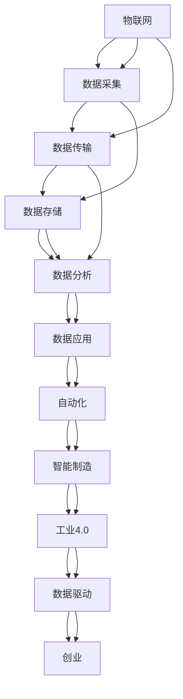

                 

# 物联网技术在自动化创业中的运用

> 关键词：物联网(IoT)、自动化(Automation)、创业(Business Startups)、智能制造(Smart Manufacturing)、数据驱动(Data-Driven)、工业4.0(Industrial 4.0)、边缘计算(Edge Computing)

## 1. 背景介绍

### 1.1 问题由来

近年来，全球范围内自动化技术正以迅猛的速度发展，自动化创业迎来了新的浪潮。自动化创业不仅推动了产业升级和生产效率提升，也为新型商业模式提供了广阔的空间。物联网(IoT)技术的广泛应用，成为推动自动化创业的重要驱动力。

物联网是一种将物理世界通过互联网进行连接和交互的技术，通过各种传感器、执行器、数据采集设备等，将物理数据与数字信息进行无缝融合。在自动化创业中，物联网可以提供实时数据监控、远程控制、智能决策等多种功能，使得自动化系统更加智能、高效、可靠。

## 2. 核心概念与联系

### 2.1 核心概念概述

为更好地理解物联网在自动化创业中的运用，本节将介绍几个关键概念：

- **物联网(IoT)**：通过传感器、执行器、RFID、嵌入式系统等设备，将物理世界的各种数据转化为数字信号，进而通过网络传输和处理，实现设备与设备的连接、人与设备的连接、设备与云端的连接。

- **自动化(Automation)**：通过机器、设备、软件等技术，替代或辅助人类执行一些复杂或重复性工作，以提高效率、减少成本、增强安全性。

- **创业(Business Startup)**：以创新为基础，通过市场验证和商业模式优化，实现产品或服务的商业化过程。

- **智能制造(Smart Manufacturing)**：利用物联网、人工智能、大数据等技术，实现生产过程的智能化、自动化和柔性化，提升生产效率和产品质量。

- **数据驱动(Data-Driven)**：利用数据进行决策，优化生产过程、提升管理水平、改进产品设计。

- **工业4.0(Industrial 4.0)**：基于信息物理系统(Cyber-Physical System)的智能制造新模式，通过云计算、物联网、大数据、人工智能等技术，推动工业生产的数字化、网络化、智能化。

- **边缘计算(Edge Computing)**：在网络边缘侧进行数据处理、分析和应用，以减少数据传输的延迟和带宽消耗，提高系统实时性。

这些概念之间的逻辑关系可以通过以下Mermaid流程图来展示：



这个流程图展示物联网在自动化创业中的核心概念及其之间的关系：

1. 物联网通过各种传感器收集数据，将物理世界数字化。
2. 数据经过传输、存储，进入数据分析环节，产生智能决策。
3. 自动化系统执行这些决策，优化生产过程。
4. 智能制造推动产业升级，成为工业4.0的重要组成部分。
5. 数据驱动决策，提升效率和质量。
6. 创业是这一技术生态的最终目标，实现商业化应用。

## 3. 核心算法原理 & 具体操作步骤
### 3.1 算法原理概述

物联网在自动化创业中的应用，涉及多种算法和技术的综合运用。主要包括：

- **传感器融合算法**：通过多种传感器数据融合，提高数据采集的准确性和可靠性。
- **机器学习算法**：利用数据挖掘、模式识别等算法，对采集到的数据进行建模，提高生产过程的自动化和智能化水平。
- **控制算法**：通过自动化控制策略，对生产设备进行精确控制，实现生产过程的优化和稳定。
- **通信协议**：通过建立标准化的通信协议，实现不同设备之间的无缝连接和数据交换。

物联网在自动化创业中的应用流程大致如下：

1. 数据采集：通过传感器等设备收集物理世界的数据。
2. 数据传输：将采集到的数据通过网络传输到云端或边缘设备。
3. 数据分析：利用机器学习等算法对数据进行分析和处理，产生决策。
4. 数据应用：将决策结果转化为控制指令，对生产过程进行优化和控制。
5. 系统集成：将采集、传输、分析、控制等环节集成在一起，形成完整的自动化系统。

### 3.2 算法步骤详解

下面以一个智能制造场景为例，详细讲解物联网在自动化创业中的操作步骤：

1. **数据采集**：在生产线上部署各种传感器，如温度传感器、压力传感器、振动传感器等，实时采集生产数据。

2. **数据传输**：将采集到的数据通过无线网络传输到边缘计算设备或云端，进行初步处理和存储。

3. **数据分析**：利用机器学习算法对数据进行建模，识别出生产过程中的异常情况，预测设备故障。

4. **数据应用**：根据数据分析结果，通过自动化控制系统调整生产参数，优化生产过程。

5. **系统集成**：将数据采集、传输、分析、控制等环节集成在一起，形成一个完整的智能制造系统。

### 3.3 算法优缺点

物联网在自动化创业中的应用，具有以下优点：

- **提高生产效率**：通过实时数据监控和智能决策，优化生产过程，提高生产效率和质量。
- **降低生产成本**：减少人工干预，降低生产过程中的人力成本和时间成本。
- **提高生产安全**：通过数据分析和预测，及时发现潜在风险，避免安全事故的发生。
- **增强企业竞争力**：通过自动化系统，提升企业的生产能力和市场响应速度，增强市场竞争力。

但同时，物联网在自动化创业中也有一些缺点：

- **初始投资成本高**：部署传感器、建立网络连接等需要较大的初始投资。
- **数据隐私和安全问题**：采集到的数据可能包含敏感信息，需要严格的数据管理和安全防护。
- **技术复杂度高**：系统集成和运维需要专业的技术支持和维护人员。
- **数据质量依赖性强**：传感器数据的质量和准确性直接影响系统的决策和控制效果。

### 3.4 算法应用领域

物联网在自动化创业中的应用领域非常广泛，主要包括：

- **智能制造**：利用物联网技术，实现生产过程的智能化和自动化，提高生产效率和产品质量。
- **智慧农业**：通过传感器等设备，实时监控农作物的生长环境，优化农业生产过程。
- **智慧医疗**：利用物联网技术，实现对患者健康状况的实时监测和数据分析，提供精准医疗服务。
- **智能交通**：通过传感器和数据传输，实现对交通流量的实时监控和优化，提高交通安全性和通行效率。
- **智慧城市**：利用物联网技术，实现城市运行数据的实时监控和管理，提高城市管理水平和居民生活质量。

## 4. 数学模型和公式 & 详细讲解  
### 4.1 数学模型构建

本节将使用数学语言对物联网在自动化创业中的数据采集和处理过程进行更加严格的刻画。

记物联网系统的数据采集设备为 $S_i=\{x_i,y_i,z_i\}$，其中 $x_i$ 为传感器采集的数据，$y_i$ 为环境参数（如温度、湿度、压力等），$z_i$ 为设备状态（如设备运行状态、故障状态等）。数据采集过程可以表示为：

$$
S_i = f(x_i,y_i,z_i)
$$

其中 $f$ 为数据采集函数。采集到的数据经过网络传输，到达边缘计算设备或云端，经过预处理后存储在数据库中，表示为：

$$
D = \{d_i\}_{i=1}^N
$$

其中 $d_i$ 为数据记录，包括时间戳、传感器数据、环境参数和设备状态等信息。

### 4.2 公式推导过程

物联网在自动化创业中的数据分析过程，可以通过以下几个步骤进行数学建模：

1. **数据清洗**：对采集到的数据进行去噪、去重、缺失值填充等处理，提高数据质量。

2. **特征提取**：从采集到的数据中提取有用的特征，如温度、湿度、压力、设备状态等。

3. **数据建模**：利用机器学习算法，对特征数据进行建模，产生预测结果或决策结果。

4. **决策执行**：根据数据建模结果，执行相应的自动化控制策略。

以智能制造场景为例，假设机器学习算法为支持向量机(SVM)，其决策函数为：

$$
y = SVM(\mathbf{X}, \mathbf{w}, b)
$$

其中 $\mathbf{X}$ 为特征向量，$\mathbf{w}$ 为模型参数，$b$ 为偏置项。

### 4.3 案例分析与讲解

以一个智能制造中的温度监控系统为例，分析物联网的应用过程：

1. **数据采集**：在生产线上部署温度传感器，实时采集生产环境温度。

2. **数据传输**：将采集到的温度数据通过网络传输到边缘计算设备或云端。

3. **数据清洗**：对传输过来的数据进行去噪、去重等处理，去除无效数据。

4. **特征提取**：从清洗后的数据中提取有用的特征，如温度、生产时间、设备状态等。

5. **数据建模**：利用支持向量机算法对特征数据进行建模，预测设备运行状态。

6. **决策执行**：根据模型预测结果，通过自动化控制系统调整生产参数，优化生产过程。

## 5. 项目实践：代码实例和详细解释说明
### 5.1 开发环境搭建

在进行物联网项目开发前，我们需要准备好开发环境。以下是使用Python进行IoT开发的环境配置流程：

1. 安装Python：从官网下载并安装Python，确保版本为3.6以上。

2. 安装PyTorch：使用pip安装PyTorch，支持深度学习和模型训练。

3. 安装TensorFlow：使用pip安装TensorFlow，支持分布式计算和模型部署。

4. 安装IoT相关的库：如paho-mqtt、flask、pyserial等，支持数据采集和传输。

5. 搭建测试环境：使用Raspberry Pi等设备搭建物联网测试环境，部署传感器、边缘计算设备等。

6. 搭建云计算平台：使用AWS、Azure等云平台搭建云计算环境，部署云服务器、数据库等。

完成上述步骤后，即可在开发环境中开始物联网项目的开发和测试。

### 5.2 源代码详细实现

下面以一个智能制造中的温度监控系统为例，给出使用Python和IoT库进行温度监控的代码实现。

```python
import pyserial
import paho.mqtt.client as mqtt
import numpy as np
from sklearn.svm import SVC
from datetime import datetime

# 连接串口，设置波特率和超时时间
ser = pyserial.Serial(port='/dev/ttyUSB0', baudrate=9600, timeout=1)

# 连接MQTT客户端
client = mqtt.Client()
client.connect('mqtt.example.com', 1883, 1883)

# 数据采集函数
def get_temperature():
    data = ser.readline().decode('utf-8')
    return float(data)

# 数据存储函数
def save_temperature(temperature):
    timestamp = datetime.now().strftime('%Y-%m-%d %H:%M:%S')
    data = {'timestamp': timestamp, 'temperature': temperature}
    client.publish('temperature/data', str(data))
    client.publish('temperature/temperature', str(temperature))

# 数据清洗函数
def clean_temperature(data):
    # 去噪、去重等处理
    return data

# 特征提取函数
def extract_temperature_features(data):
    # 提取有用的特征
    return [data['temperature'], data['timestamp'], data['status']]

# 数据建模函数
def build_temperature_model():
    # 数据预处理
    data = clean_temperature(data)
    features = extract_temperature_features(data)
    # 训练SVM模型
    model = SVC()
    model.fit(features, labels)
    return model

# 启动数据采集和模型训练
if __name__ == '__main__':
    temperature = get_temperature()
    save_temperature(temperature)
    features = extract_temperature_features(data)
    model = build_temperature_model()
    prediction = model.predict(features)
    print(prediction)
```

以上是使用Python进行IoT开发和温度监控的代码实现。可以看到，IoT库和机器学习库的结合，使得温度监控系统的实现变得简洁高效。

### 5.3 代码解读与分析

让我们再详细解读一下关键代码的实现细节：

**数据采集函数**：
- `get_temperature`方法：通过串口连接设备，读取传感器数据，转换为浮点数后返回。

**数据存储函数**：
- `save_temperature`方法：将传感器数据存储到MQTT消息队列中，供后续分析使用。

**数据清洗函数**：
- `clean_temperature`方法：对采集到的数据进行去噪、去重等处理，提高数据质量。

**特征提取函数**：
- `extract_temperature_features`方法：从清洗后的数据中提取有用的特征，如温度、生产时间、设备状态等。

**数据建模函数**：
- `build_temperature_model`方法：利用支持向量机算法对特征数据进行建模，产生预测结果或决策结果。

**启动数据采集和模型训练**：
- 主程序通过串口读取温度数据，存储到MQTT队列中，然后提取特征，训练SVM模型，并输出预测结果。

可以看出，IoT和机器学习的结合，使得温度监控系统的实现变得简洁高效。开发者可以将更多精力放在系统设计和算法改进上，而不必过多关注底层的实现细节。

## 6. 实际应用场景
### 6.1 智能制造

物联网在智能制造中的应用非常广泛，可以用于设备的监控、故障预测、生产调度等环节。通过实时数据采集和分析，可以实现设备状态监控、故障预测和预防性维护，优化生产过程，提高生产效率和产品质量。

在技术实现上，可以部署各种传感器，实时采集设备运行状态、温度、压力等数据，并通过网络传输到边缘计算设备或云端。在边缘计算设备上，进行数据清洗和预处理，再通过云端进行数据分析和建模，产生决策结果。最后，将决策结果通过网络传输回生产现场，指导设备控制和生产调度。

### 6.2 智慧农业

物联网在智慧农业中的应用，主要集中在农作物的生长监测、土壤水分监测、病虫害预警等方面。通过各种传感器和设备，实时采集农作物的生长环境数据，并进行分析和建模，优化农业生产过程。

在技术实现上，可以部署各种传感器，实时采集土壤水分、温度、湿度、光照等数据，并通过网络传输到云端。在云端，进行数据清洗和预处理，再通过机器学习算法进行数据分析和建模，产生决策结果。最后，将决策结果通过网络传输回田间，指导农业生产。

### 6.3 智慧医疗

物联网在智慧医疗中的应用，主要集中在患者健康监测、医疗设备管理、药品管理等方面。通过各种传感器和设备，实时采集患者的健康数据、医疗设备的状态和运行数据，并进行分析和建模，优化医疗服务。

在技术实现上，可以部署各种传感器，实时采集患者的健康数据、医疗设备的状态和运行数据，并通过网络传输到云端。在云端，进行数据清洗和预处理，再通过机器学习算法进行数据分析和建模，产生决策结果。最后，将决策结果通过网络传输回医疗设备或医院管理平台，指导医疗服务。

### 6.4 未来应用展望

随着物联网技术的发展和应用，未来在自动化创业中的运用也将更加广泛和深入。以下是一些未来应用展望：

1. **工业互联网**：利用物联网技术，实现工业数据的实时监控和管理，推动工业互联网的发展。

2. **智能家居**：通过物联网技术，实现家居设备的智能化控制和互联互通，提升居民生活质量。

3. **智慧城市**：利用物联网技术，实现城市运行数据的实时监控和管理，提升城市管理水平和居民生活质量。

4. **智能物流**：通过物联网技术，实现物流数据的实时监控和优化，提高物流效率和安全性。

5. **智能交通**：通过物联网技术，实现交通流量的实时监控和优化，提高交通安全性和通行效率。

## 7. 工具和资源推荐
### 7.1 学习资源推荐

为了帮助开发者系统掌握物联网在自动化创业中的应用，这里推荐一些优质的学习资源：

1. **《IoT应用开发实战指南》**：详细介绍了物联网开发的技术栈、工具和实践经验，适合入门学习。

2. **《机器学习实战》**：介绍了机器学习的基本概念和应用场景，适合学习数据建模和算法实现。

3. **《Python IoT编程实战》**：详细介绍了Python在物联网开发中的应用，适合学习IoT开发实战技能。

4. **IoT平台（如AWS IoT、Azure IoT）官方文档**：提供了IoT开发所需的API、SDK和示例代码，适合学习和参考。

5. **Kaggle数据科学竞赛**：提供了大量IoT相关的数据集和竞赛任务，适合实践和提升算法技能。

通过对这些资源的学习实践，相信你一定能够快速掌握物联网在自动化创业中的应用，并用于解决实际的IoT问题。

### 7.2 开发工具推荐

高效的开发离不开优秀的工具支持。以下是几款用于IoT开发常用的工具：

1. **PyTorch**：基于Python的开源深度学习框架，灵活动态的计算图，适合快速迭代研究。

2. **TensorFlow**：由Google主导开发的开源深度学习框架，生产部署方便，适合大规模工程应用。

3. **IoT开发板（如Raspberry Pi、Arduino）**：支持各种IoT设备的硬件开发和原型设计。

4. **MQTT消息队列**：轻量级消息队列协议，支持实时数据传输和分布式应用。

5. **边缘计算平台（如AWS Greengrass、Azure IoT Edge）**：支持边缘计算设备的部署和管理。

6. **Jupyter Notebook**：支持Python和IoT开发的交互式编程环境，方便调试和分享。

合理利用这些工具，可以显著提升IoT项目开发效率，加快创新迭代的步伐。

### 7.3 相关论文推荐

物联网在自动化创业中的应用，源于学界的持续研究。以下是几篇奠基性的相关论文，推荐阅读：

1. **《IoT: A Survey》**：系统总结了物联网技术的发展现状和应用场景，适合了解整体概念。

2. **《Machine Learning for IoT》**：介绍了机器学习在物联网中的应用，适合学习数据建模和算法实现。

3. **《Internet of Things (IoT) in Manufacturing》**：探讨了物联网在智能制造中的应用，适合了解具体案例。

4. **《Data-Driven IoT Systems》**：介绍了数据驱动在IoT系统中的应用，适合学习数据管理和决策优化。

5. **《Smart Manufacturing via IoT》**：探讨了物联网在智能制造中的应用，适合学习系统设计和实践经验。

这些论文代表了大规模IoT应用的发展脉络。通过学习这些前沿成果，可以帮助研究者把握学科前进方向，激发更多的创新灵感。

## 8. 总结：未来发展趋势与挑战

### 8.1 总结

本文对物联网在自动化创业中的应用进行了全面系统的介绍。首先阐述了物联网技术的发展背景和在自动化创业中的重要作用，明确了IoT在提升生产效率、降低生产成本、提高生产安全等方面的独特价值。其次，从原理到实践，详细讲解了物联网在自动化创业中的数据采集、数据传输、数据分析和决策执行等关键步骤，给出了IoT项目开发的完整代码实例。同时，本文还广泛探讨了IoT技术在智能制造、智慧农业、智慧医疗等多个行业领域的应用前景，展示了IoT范式的巨大潜力。此外，本文精选了IoT技术的各类学习资源，力求为读者提供全方位的技术指引。

通过本文的系统梳理，可以看到，物联网技术在自动化创业中发挥着越来越重要的作用。物联网的广泛应用，不仅推动了传统行业的数字化转型，也催生了更多的商业模式和应用场景。未来，伴随物联网技术的发展和成熟，IoT范式必将在更多领域大放异彩，带来新的机遇和挑战。

### 8.2 未来发展趋势

展望未来，物联网在自动化创业中的应用将呈现以下几个发展趋势：

1. **智能化的提高**：随着AI技术的不断进步，物联网将具备更加强大的智能化能力，支持更加复杂和多样化的应用场景。

2. **数据驱动的深入**：物联网将更加注重数据的采集和分析，支持更加精细和精准的决策支持。

3. **跨行业的融合**：物联网将与更多行业进行深度融合，推动各个行业的数字化和智能化转型。

4. **边缘计算的普及**：物联网将更加注重边缘计算的部署和管理，支持更加高效和实时的数据处理。

5. **标准化的推进**：物联网将逐步建立统一的标准化框架，推动技术共享和互联互通。

6. **安全性保障**：物联网将更加注重数据安全和隐私保护，确保数据的可靠性和安全性。

以上趋势凸显了物联网在自动化创业中的广阔前景。这些方向的探索发展，必将进一步提升IoT系统的性能和应用范围，为自动化创业带来更多的机会和挑战。

### 8.3 面临的挑战

尽管物联网在自动化创业中的应用已经取得了瞩目成就，但在迈向更加智能化、普适化应用的过程中，它仍面临着诸多挑战：

1. **数据量的爆炸性增长**：物联网设备数量庞大，数据量呈爆炸性增长，对数据存储和处理提出了更高的要求。

2. **数据隐私和安全问题**：采集到的数据可能包含敏感信息，需要严格的数据管理和安全防护。

3. **技术复杂度提高**：物联网系统的复杂度不断提高，需要更多的技术支持和维护人员。

4. **设备互操作性不足**：不同厂商、不同协议的设备互联互通存在挑战，需要更多的标准化和兼容性支持。

5. **经济效益难以评估**：物联网技术的经济效益评估存在挑战，需要更多的行业标准和实践经验。

6. **技术迭代速度加快**：物联网技术发展迅速，需要持续的技术更新和升级。

7. **设备寿命和维护问题**：物联网设备寿命和维护问题需要更多的技术支持和运营经验。

这些挑战需要业界共同努力，通过技术创新和标准建设，逐步克服。

### 8.4 研究展望

面对物联网在自动化创业中所面临的挑战，未来的研究需要在以下几个方面寻求新的突破：

1. **大数据和云计算技术**：提升数据存储和处理能力，支持海量数据的实时分析和建模。

2. **边缘计算技术**：提升数据处理效率，降低数据传输延迟和带宽消耗，提高系统的实时性。

3. **标准化和互操作性**：建立统一的标准化框架，推动不同厂商、不同协议的设备互联互通。

4. **数据隐私和安全技术**：提升数据隐私和安全保护能力，确保数据的安全性和可靠性。

5. **人工智能和机器学习**：利用AI技术，提升物联网系统的智能化和自动化水平。

6. **经济效益评估**：研究物联网技术的经济效益评估方法，支持技术的商业化应用。

7. **设备维护和管理**：研究物联网设备的维护和管理方法，提升设备寿命和可靠性。

这些研究方向将推动物联网技术在自动化创业中的应用更加广泛和深入，为未来技术发展提供更多可能性。

## 9. 附录：常见问题与解答

**Q1：物联网在自动化创业中是否需要高成本的初始投资？**

A: 物联网在自动化创业中的初始投资通常较高，因为需要购买传感器、边缘计算设备、网络连接等硬件设备。但是，随着技术的成熟和市场的推广，设备的成本和部署难度将逐步降低。同时，物联网技术可以显著降低运营和维护成本，提升生产效率和质量，具有显著的经济效益。

**Q2：物联网在自动化创业中是否容易被攻击和侵入？**

A: 物联网设备可能存在安全漏洞，容易受到攻击和侵入。因此，需要采取严格的数据加密、访问控制等安全措施，确保数据的安全性和隐私保护。同时，需要进行定期的安全检查和漏洞修补，提升系统的安全性和稳定性。

**Q3：物联网在自动化创业中的数据量和处理能力是否有限制？**

A: 物联网设备数量庞大，数据量呈爆炸性增长，对数据存储和处理提出了更高的要求。需要采用大数据和云计算技术，提升数据存储和处理能力，支持海量数据的实时分析和建模。同时，需要优化数据采集和传输，减少数据传输延迟和带宽消耗，提高系统的实时性。

**Q4：物联网在自动化创业中是否需要大量技术人才支持？**

A: 物联网系统的复杂度不断提高，需要更多的技术支持和维护人员。因此，需要建立完善的技术团队，涵盖硬件开发、数据处理、应用开发等多个方面。同时，可以通过培训、招聘等方式提升团队的技术能力和经验水平。

**Q5：物联网在自动化创业中的经济效益是否难以评估？**

A: 物联网技术的经济效益评估存在挑战，需要更多的行业标准和实践经验。可以通过建立经济模型，计算成本和收益，评估技术经济效益。同时，可以通过实际应用案例，进行经济效益的验证和优化。

通过对这些问题的解答，可以看出物联网在自动化创业中具有广阔的发展前景和挑战。只有在技术创新和应用实践中不断探索和突破，才能最大化物联网技术在自动化创业中的应用价值。

---

作者：禅与计算机程序设计艺术 / Zen and the Art of Computer Programming

