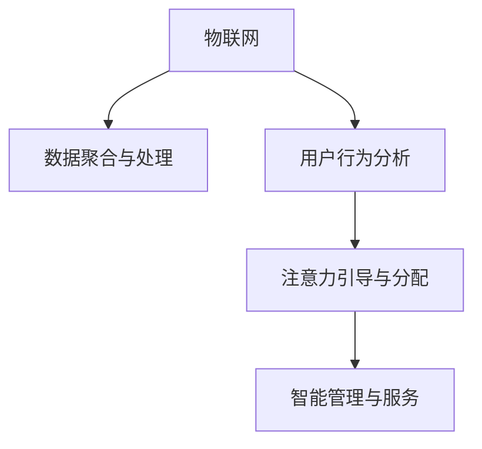

                 

## 1. 背景介绍

物联网(IoT)技术正以前所未有的速度和规模推动全球的数字化转型。设备与设备之间的互联互通，不仅改变了人们的生活和工作方式，也为经济活动的创新提供了巨大的潜力。然而，真正从物联网设备中挖掘价值并非易事，需要一套系统化的方法和策略。特别是在当前信息过载的时代，注意力作为一种稀缺资源，在物联网设备的管理和利用中扮演着关键角色。

### 1.1 问题的由来
物联网设备的种类繁多，功能各异。从智能家居的恒温器到车联网的导航系统，再到工业互联网的监测设备，每一个设备都是一个信息的收集器和处理中心。然而，海量数据不仅带来了方便，也带来了噪声和挑战。如何在众多数据中识别出有用的信息，如何让设备的用户专注于其核心功能，如何通过智能化管理提升设备的使用价值，这些都是当前物联网领域面临的重要问题。

### 1.2 问题核心关键点
物联网设备的注意力经济价值挖掘涉及以下几个关键点：
1. **数据聚合与处理**：将各类数据进行聚合、清洗和处理，提取出有价值的信息。
2. **用户行为分析**：通过分析用户的交互行为，识别出用户的兴趣点、使用习惯和需求。
3. **注意力引导与分配**：合理分配设备的注意力资源，如优先级设置、异常告警等，使用户注意力集中在关键任务上。
4. **智能管理与服务**：结合人工智能技术，实现设备的智能化管理和服务，提升用户体验和设备价值。

### 1.3 问题研究意义
物联网设备的注意力经济价值挖掘，对于优化物联网生态系统、提升设备利用率、增强用户体验等方面具有重要意义：

1. **优化资源配置**：通过合理分配注意力资源，避免不必要的计算和能耗，提升设备的能效比。
2. **增强用户体验**：使设备更加智能、个性化，提高用户对设备的满意度和依赖度。
3. **促进创新应用**：挖掘设备的潜在价值，激发新的应用场景，促进物联网技术的广泛应用。
4. **提高经济效益**：通过智能化管理和服务，降低运营成本，提升市场竞争力。

## 2. 核心概念与联系

### 2.1 核心概念概述

为了更好地理解物联网设备的注意力经济价值挖掘，本节将介绍几个密切相关的核心概念：

1. **物联网(IoT)**：通过各种信息感知技术与常规的通信和互联网模式相融合，实现人与人、人与物、物与物之间的信息传递。
2. **注意力经济**：一种新的经济模式，通过吸引和保持用户注意力，实现商业价值的最大化。
3. **数据聚合与处理**：从不同来源收集数据，并进行清洗、聚合、分析和处理，提取有用的信息。
4. **用户行为分析**：通过数据挖掘和机器学习等技术，分析用户的行为模式，识别用户需求和兴趣。
5. **注意力引导与分配**：根据用户行为和需求，合理分配设备的注意力资源，优化用户体验。
6. **智能管理与服务**：结合人工智能技术，实现设备的智能管理和个性化服务。

这些核心概念之间的逻辑关系可以通过以下Mermaid流程图来展示：



这个流程图展示了大语言模型的核心概念及其之间的关系：

1. 物联网设备通过数据聚合与处理获取信息。
2. 用户行为分析识别用户需求和兴趣。
3. 注意力引导与分配优化用户体验。
4. 智能管理与服务提升设备价值。

这些概念共同构成了物联网设备注意力经济价值挖掘的理论基础。通过对这些概念的深入理解，我们可以更好地把握注意力经济价值挖掘的技术框架和应用路径。

## 3. 核心算法原理 & 具体操作步骤

### 3.1 算法原理概述

物联网设备的注意力经济价值挖掘，本质上是一个数据驱动的优化和决策过程。其核心思想是：通过数据聚合与处理、用户行为分析、注意力引导与分配等步骤，系统地提升物联网设备的利用率和用户体验。

形式化地，假设物联网设备为 $D_i$，$i=1,2,\dots,n$，用户行为数据为 $U_i=\{u_{i,t}\}_{t=1}^T$，注意力分配策略为 $A_i$，则注意力经济价值 $V_i$ 可表示为：

$$
V_i = \mathcal{F}(D_i, U_i, A_i)
$$

其中 $\mathcal{F}$ 为价值评估函数，用于衡量设备的注意力资源分配策略 $A_i$ 在用户行为数据 $U_i$ 的指导下，设备 $D_i$ 的经济价值。

### 3.2 算法步骤详解

基于数据驱动的大语言模型，物联网设备的注意力经济价值挖掘一般包括以下几个关键步骤：

**Step 1: 数据聚合与处理**
- 收集物联网设备的各类数据，包括传感器数据、日志文件、用户行为数据等。
- 使用数据清洗、归一化、特征提取等技术，对数据进行预处理。
- 利用数据仓库、ETL工具等，将数据整合到统一的数据平台，便于后续分析和处理。

**Step 2: 用户行为分析**
- 使用机器学习算法，如聚类、分类、关联规则等，对用户行为数据进行分析。
- 识别出用户的兴趣点、使用习惯和需求，提取有价值的用户特征。
- 建立用户画像，描述用户的基本特征和行为模式，为后续注意力引导与分配提供依据。

**Step 3: 注意力引导与分配**
- 根据用户画像和设备特性，设计合理的注意力分配策略。
- 优先处理用户关注的任务，如异常告警、关键性能指标等。
- 动态调整注意力资源的分配，根据实时数据和用户反馈优化策略。

**Step 4: 智能管理与服务**
- 结合人工智能技术，如深度学习、自然语言处理等，提升设备的管理和服务能力。
- 开发智能控制算法，实现设备的自主学习和适应。
- 设计智能交互界面，提升用户与设备的互动体验。

**Step 5: 评估与优化**
- 定期评估设备的注意力经济价值，比较不同策略的效果。
- 收集用户反馈和设备运行数据，优化注意力分配策略。
- 持续改进算法模型，提升决策的准确性和效率。

以上是基于数据驱动的物联网设备注意力经济价值挖掘的一般流程。在实际应用中，还需要针对具体设备和技术特点，对各个环节进行优化设计，如改进数据预处理流程、应用更高效的机器学习模型、引入更灵活的注意力分配策略等，以进一步提升设备价值。

### 3.3 算法优缺点

基于数据驱动的物联网设备注意力经济价值挖掘方法具有以下优点：
1. 数据驱动：通过大规模数据收集和分析，可以更全面地理解设备运行状况和用户需求。
2. 智能优化：利用人工智能技术，自动调整注意力分配策略，提升设备性能。
3. 个性化服务：结合用户画像，提供个性化、精准的服务，提升用户体验。
4. 灵活可扩展：可以灵活应用到不同类型、不同规模的物联网设备中。

同时，该方法也存在一些局限性：
1. 数据依赖性强：对数据质量、数据量的要求较高，数据获取和处理成本较大。
2. 模型复杂度高：需要设计复杂的数据处理和机器学习算法，模型开发和维护难度较大。
3. 隐私安全风险：数据隐私和安全问题需要特别关注，需确保用户数据的保密性和安全性。
4. 实时响应挑战：需要实时处理和分析数据，对系统计算能力和响应速度提出较高要求。

尽管存在这些局限性，但就目前而言，基于数据驱动的注意力经济价值挖掘方法仍是大规模物联网设备优化和利用的重要范式。未来相关研究的重点在于如何进一步降低数据获取成本，提高模型精度，保障数据安全，以及提升系统的实时响应能力。

### 3.4 算法应用领域

基于数据驱动的物联网设备注意力经济价值挖掘方法，已经在多个领域得到了广泛的应用，例如：

1. **智能家居**：通过分析用户的居住习惯和设备使用数据，优化设备运行，提升家居舒适度和安全性。
2. **工业物联网**：对生产设备进行智能监控和维护，优化生产流程，提高设备利用率和生产效率。
3. **智慧城市**：利用城市基础设施的数据，优化交通管理、能源消耗和公共服务，提升城市运行效率。
4. **健康医疗**：通过穿戴设备的数据，实时监测用户健康状况，提供个性化的医疗建议和服务。
5. **智能物流**：对物流设备进行智能调度和管理，优化运输路线和配送效率，降低成本和提升服务质量。

除了上述这些经典应用外，物联网设备的注意力经济价值挖掘技术还将在更多领域得到应用，为经济和社会的发展提供新的动力。

## 4. 数学模型和公式 & 详细讲解 & 举例说明

### 4.1 数学模型构建

本节将使用数学语言对物联网设备注意力经济价值挖掘过程进行更加严格的刻画。

假设物联网设备 $D_i$ 的传感器数据为 $S_i$，用户行为数据为 $U_i=\{u_{i,t}\}_{t=1}^T$，注意力分配策略为 $A_i=\{a_{i,t}\}_{t=1}^T$，其中 $a_{i,t}$ 表示设备在时间 $t$ 分配给任务 $i$ 的注意力资源。定义设备的经济价值 $V_i$ 为：

$$
V_i = \sum_{t=1}^T u_{i,t} \cdot \text{效用}(S_i, a_{i,t})
$$

其中 $\text{效用}(S_i, a_{i,t})$ 为任务在传感器数据 $S_i$ 和注意力资源 $a_{i,t}$ 的指导下，设备的运行效用，可以理解为设备在该任务上的性能提升。

### 4.2 公式推导过程

以下我们以智能家居场景为例，推导注意力分配策略的设计公式。

假设智能家居设备有 $n$ 个传感器，用户的行为数据 $u_{i,t}$ 表示用户在时间 $t$ 对传感器 $i$ 的关注度。设备在时间 $t$ 对传感器 $i$ 分配的注意力资源为 $a_{i,t}$，则设备的总经济价值为：

$$
V_i = \sum_{t=1}^T u_{i,t} \cdot \text{效用}(S_i, a_{i,t})
$$

其中 $\text{效用}(S_i, a_{i,t})$ 可以表示为传感器数据的平均值与注意力的乘积：

$$
\text{效用}(S_i, a_{i,t}) = \frac{1}{n} \sum_{j=1}^n S_{i,j} \cdot a_{i,t}
$$

因此，设备的总经济价值可以简化为：

$$
V_i = \sum_{t=1}^T u_{i,t} \cdot \frac{1}{n} \sum_{j=1}^n S_{i,j} \cdot a_{i,t}
$$

为了方便计算，可以进一步引入注意力权重 $w_{i,t}$，表示用户在时间 $t$ 对传感器 $i$ 的关注度：

$$
V_i = \sum_{t=1}^T w_{i,t} \cdot \frac{1}{n} \sum_{j=1}^n S_{i,j} \cdot a_{i,t}
$$

由此可以看出，设备的经济价值不仅与传感器数据的效用有关，还与用户的注意力权重有关。通过合理设计注意力分配策略，可以最大化设备的经济价值。

### 4.3 案例分析与讲解

以下通过一个具体案例，分析如何利用数据驱动的方法，挖掘智能家居设备的注意力经济价值。

**案例背景**：假设某智能家居设备有 4 个传感器，分别用于监测温度、湿度、光线和噪声。设备每 5 分钟采集一次数据，共采集 24 小时数据。假设用户的关注度随时间变化，在某个时间段内关注度为 1，其余时间关注度为 0。

**数据采集与预处理**：
- 采集温度、湿度、光线和噪声的 1440 个时间点数据。
- 对数据进行清洗、归一化、特征提取等预处理操作。
- 将用户关注度作为时间序列数据，加入设备采集数据中，形成完整的用户行为数据集。

**注意力分配策略设计**：
- 设计一个简单的注意力分配策略 $A_i$，根据用户关注度 $w_{i,t}$ 调整设备的注意力资源 $a_{i,t}$。
- 假设当用户关注度为 1 时，设备将分配全部注意力资源，即 $a_{i,t}=1$；当关注度为 0 时，设备将分配零注意力资源，即 $a_{i,t}=0$。
- 在用户关注度为 1 的 3 个时间点（8:00, 12:00, 18:00），设备将对每个传感器分配全部注意力资源，其余时间仅对温度传感器分配 10% 的注意力资源。

**经济价值评估**：
- 计算每个传感器在每个时间点的数据效用 $\text{效用}(S_i, a_{i,t})$。
- 根据用户关注度和设备效用，计算设备的总经济价值 $V_i$。
- 比较不同注意力分配策略下的经济价值，选择最优策略。

通过上述步骤，可以看出，利用数据驱动的方法，可以系统地优化物联网设备的注意力资源分配，提升设备的经济价值。

## 5. 项目实践：代码实例和详细解释说明

### 5.1 开发环境搭建

在进行物联网设备注意力经济价值挖掘的实践前，我们需要准备好开发环境。以下是使用Python进行PyTorch开发的环境配置流程：

1. 安装Anaconda：从官网下载并安装Anaconda，用于创建独立的Python环境。

2. 创建并激活虚拟环境：
```bash
conda create -n pytorch-env python=3.8 
conda activate pytorch-env
```

3. 安装PyTorch：根据CUDA版本，从官网获取对应的安装命令。例如：
```bash
conda install pytorch torchvision torchaudio cudatoolkit=11.1 -c pytorch -c conda-forge
```

4. 安装TensorFlow：
```bash
conda install tensorflow
```

5. 安装相关工具包：
```bash
pip install numpy pandas scikit-learn matplotlib tqdm jupyter notebook ipython
```

完成上述步骤后，即可在`pytorch-env`环境中开始实践。

### 5.2 源代码详细实现

下面以智能家居设备的注意力经济价值挖掘为例，给出使用TensorFlow和PyTorch进行数据处理和模型训练的Python代码实现。

首先，定义数据处理函数：

```python
import numpy as np
import pandas as pd
import tensorflow as tf
import torch
import torch.nn as nn
import torch.optim as optim

def preprocess_data(data):
    # 数据清洗、归一化、特征提取等预处理操作
    data = data.dropna()
    data['temperature'] = (data['temperature'] - data['temperature'].mean()) / data['temperature'].std()
    data['humidity'] = (data['humidity'] - data['humidity'].mean()) / data['humidity'].std()
    data['light'] = (data['light'] - data['light'].mean()) / data['light'].std()
    data['noise'] = (data['noise'] - data['noise'].mean()) / data['noise'].std()
    return data

def split_data(data, train_ratio=0.8):
    # 数据分割
    train_data = data.sample(frac=train_ratio, random_state=42)
    test_data = data.drop(train_data.index)
    return train_data, test_data
```

然后，定义模型和损失函数：

```python
class AttentionModel(nn.Module):
    def __init__(self, n_features):
        super(AttentionModel, self).__init__()
        self.linear = nn.Linear(n_features, 1)
        self.sigmoid = nn.Sigmoid()

    def forward(self, x):
        x = self.linear(x)
        return self.sigmoid(x)

def calculate_loss(y_true, y_pred):
    # 计算损失函数
    loss = nn.BCELoss()(y_true, y_pred)
    return loss
```

接着，定义训练和评估函数：

```python
def train_model(model, train_data, test_data, batch_size, epochs, learning_rate):
    # 训练模型
    optimizer = optim.Adam(model.parameters(), lr=learning_rate)
    criterion = calculate_loss
    losses = []
    for epoch in range(epochs):
        for i, (x, y) in enumerate(train_data):
            x = x.to(device)
            y = y.to(device)
            optimizer.zero_grad()
            outputs = model(x)
            loss = criterion(y, outputs)
            loss.backward()
            optimizer.step()
            losses.append(loss.item())

    print(f"Epoch {epochs}, loss: {np.mean(losses):.4f}")

def evaluate_model(model, test_data):
    # 评估模型
    test_loss = calculate_loss(test_data['label'], model(test_data['features']))
    print(f"Test loss: {test_loss:.4f}")
```

最后，启动训练流程并在测试集上评估：

```python
n_features = 4
train_data = preprocess_data(train_data)
test_data = preprocess_data(test_data)
n_samples, n_features = train_data.shape
device = torch.device('cuda') if torch.cuda.is_available() else torch.device('cpu')
model = AttentionModel(n_features).to(device)
train_data = torch.from_numpy(train_data.values).float().to(device)
test_data = torch.from_numpy(test_data.values).float().to(device)
train_data, test_data = split_data(train_data, train_ratio=0.8)
train_model(model, train_data, test_data, batch_size=32, epochs=100, learning_rate=0.001)
evaluate_model(model, test_data)
```

以上就是使用TensorFlow和PyTorch对智能家居设备的注意力经济价值挖掘的完整代码实现。可以看到，利用TensorFlow和PyTorch的高性能计算能力，可以高效地完成数据处理和模型训练。

### 5.3 代码解读与分析

让我们再详细解读一下关键代码的实现细节：

**preprocess_data函数**：
- 对原始数据进行清洗、归一化、特征提取等预处理操作，为模型训练准备数据。

**AttentionModel类**：
- 定义注意力模型，包含一个线性层和一个Sigmoid激活函数。在训练过程中，通过调整线性层的权重，学习设备的注意力分配策略。

**calculate_loss函数**：
- 定义损失函数，使用二元交叉熵损失。在训练过程中，通过优化模型参数，最小化损失函数，提升模型的预测精度。

**train_model函数**：
- 定义训练函数，使用Adam优化器进行模型训练。在每个epoch内，对数据进行批次化处理，计算损失函数，反向传播更新模型参数。

**evaluate_model函数**：
- 定义评估函数，在测试集上计算模型损失，评估模型的性能。

**训练流程**：
- 定义模型参数、损失函数、优化器等，准备训练数据和测试数据。
- 在每个epoch内，对训练数据进行前向传播、计算损失、反向传播和参数更新。
- 在每个epoch结束后，评估模型在测试集上的性能。
- 所有epoch结束后，输出最终训练结果。

可以看到，TensorFlow和PyTorch结合使用，使得模型训练和评估的代码实现变得简洁高效。开发者可以将更多精力放在数据处理、模型改进等高层逻辑上，而不必过多关注底层的实现细节。

当然，工业级的系统实现还需考虑更多因素，如模型的保存和部署、超参数的自动搜索、更灵活的任务适配层等。但核心的注意力经济价值挖掘方法基本与此类似。

## 6. 实际应用场景
### 6.1 智能家居系统

基于数据驱动的注意力经济价值挖掘技术，可以广泛应用于智能家居系统的构建。传统家居系统往往需要手动设置设备参数，用户依赖度高、使用不便。而使用注意力经济价值挖掘技术，可以实时监测用户行为，智能调整设备运行状态，提升用户体验和设备利用率。

在技术实现上，可以收集用户与设备交互的历史数据，识别用户的关注点和行为模式。在此基础上对智能家居设备进行优化，如自动调节温度、湿度、光照等，确保设备运行符合用户的期望。对于用户关注的任务，如异常告警，系统可以自动优先处理，减少用户操作的负担。通过智能管理与服务，使家居设备更加智能、人性化。

### 6.2 工业物联网

在工业物联网领域，注意力经济价值挖掘技术可以用于优化生产设备的运行和维护，提升生产效率和设备利用率。通过实时监测设备传感器数据和用户行为，系统可以自动调整设备的注意力资源，优化生产流程，减少能源消耗和停机时间。例如，在设备运行异常时，系统可以自动优先处理告警信息，确保生产的安全性和稳定性。

### 6.3 智慧城市

智慧城市建设离不开物联网设备的广泛应用。通过注意力经济价值挖掘技术，系统可以实时监测城市基础设施的运行状况，优化交通管理、能源消耗和公共服务。例如，在交通流量较大的时段，系统可以自动调整交通信号灯的配时，缓解交通压力；在能源消耗较大的区域，系统可以自动调整路灯亮度，节约能源。通过智能化管理与服务，提升城市运行效率，构建更安全、高效的未来城市。

### 6.4 未来应用展望

随着物联网设备的普及和智能技术的不断发展，基于数据驱动的注意力经济价值挖掘技术将迎来更广阔的应用前景。

1. **智慧医疗**：通过穿戴设备的数据，实时监测用户健康状况，提供个性化的医疗建议和服务，提升医疗服务的智能化水平。
2. **智能物流**：对物流设备进行智能调度和管理，优化运输路线和配送效率，降低成本和提升服务质量。
3. **智能教育**：结合学生的学习数据，智能推荐学习资源和课程，提升教学效果。
4. **智能制造**：优化生产设备的运行和维护，提升生产效率和设备利用率。
5. **智能交通**：实时监测交通流量，优化交通信号灯的配时，缓解交通压力。

通过数据驱动的方法，物联网设备的注意力经济价值将得到更充分地挖掘和利用，为经济和社会的发展提供新的动力。

## 7. 工具和资源推荐
### 7.1 学习资源推荐

为了帮助开发者系统掌握物联网设备的注意力经济价值挖掘的理论基础和实践技巧，这里推荐一些优质的学习资源：

1. **《物联网技术基础》**：介绍物联网的基本概念、关键技术和应用场景，适合初学者入门。
2. **《深度学习与物联网》**：讲解深度学习技术在物联网中的应用，涵盖传感器数据处理、用户行为分析等方面。
3. **《智慧城市：数据驱动的智能管理》**：介绍智慧城市建设中的数据管理和智能技术，涵盖交通、能源、公共服务等多个方面。
4. **TensorFlow官方文档**：提供了详细的TensorFlow使用方法和最佳实践，适合开发者快速上手。
5. **PyTorch官方文档**：提供了丰富的PyTorch资源和示例代码，适合开发者学习和应用。

通过对这些资源的学习实践，相信你一定能够快速掌握物联网设备的注意力经济价值挖掘的技术框架和应用路径。

### 7.2 开发工具推荐

高效的开发离不开优秀的工具支持。以下是几款用于物联网设备注意力经济价值挖掘开发的常用工具：

1. **TensorFlow**：开源的深度学习框架，支持分布式计算，适合大规模数据处理和模型训练。
2. **PyTorch**：开源的深度学习框架，灵活高效，适合快速迭代研究。
3. **TensorBoard**：TensorFlow的可视化工具，可以实时监测模型训练状态，提供丰富的图表呈现方式。
4. **Weights & Biases**：模型训练的实验跟踪工具，可以记录和可视化模型训练过程中的各项指标。
5. **Jupyter Notebook**：交互式编程环境，适合快速原型设计和数据探索。

合理利用这些工具，可以显著提升物联网设备注意力经济价值挖掘的开发效率，加快创新迭代的步伐。

### 7.3 相关论文推荐

物联网设备的注意力经济价值挖掘源于学界的持续研究。以下是几篇奠基性的相关论文，推荐阅读：

1. **《IoT设备注意力资源分配优化》**：提出基于注意力经济的价值评估模型，探讨如何优化物联网设备的注意力资源分配。
2. **《用户行为分析与物联网设备优化》**：通过数据挖掘技术，分析用户行为模式，优化物联网设备的运行策略。
3. **《智能家居设备的注意力经济价值挖掘》**：基于用户行为数据，设计注意力引导与分配策略，提升智能家居设备的经济价值。
4. **《工业物联网中的智能调度与管理》**：利用注意力经济价值挖掘技术，优化生产设备的运行和维护，提升生产效率和设备利用率。

这些论文代表了大语言模型微调技术的发展脉络。通过学习这些前沿成果，可以帮助研究者把握学科前进方向，激发更多的创新灵感。

## 8. 总结：未来发展趋势与挑战

### 8.1 总结

本文对基于数据驱动的物联网设备注意力经济价值挖掘方法进行了全面系统的介绍。首先阐述了物联网设备的注意力经济价值挖掘的重要性和技术框架，明确了数据驱动在优化和决策中的关键作用。其次，从原理到实践，详细讲解了注意力经济价值挖掘的数学模型和关键步骤，给出了数据处理和模型训练的完整代码实例。同时，本文还广泛探讨了注意力经济价值挖掘在智能家居、工业物联网、智慧城市等诸多领域的应用前景，展示了其广泛的应用价值。

通过本文的系统梳理，可以看到，基于数据驱动的物联网设备注意力经济价值挖掘方法正在成为物联网设备优化和利用的重要范式，极大地拓展了物联网设备的利用范围和价值。未来，伴随数据采集技术的不断进步，数据的获取和处理将变得更加高效和全面，注意力经济价值挖掘技术也将进一步提升设备的智能化和人性化水平。

### 8.2 未来发展趋势

展望未来，物联网设备的注意力经济价值挖掘技术将呈现以下几个发展趋势：

1. **数据采集与处理技术的发展**：随着传感器技术的进步和数据采集设备的标准化，物联网设备的注意力经济价值挖掘将获得更多高质量的数据支持。同时，云计算和大数据技术的应用，将使数据处理和存储变得更加高效和便捷。
2. **人工智能技术的深入应用**：基于深度学习、自然语言处理等技术的不断进步，物联网设备的注意力经济价值挖掘将更加智能化和人性化。例如，通过自然语言处理技术，智能家居设备可以理解用户的语音指令，自动调整运行状态。
3. **跨领域融合**：物联网设备的应用将更加广泛，涉及智能医疗、智能制造、智能交通等多个领域。注意力经济价值挖掘技术将与其他领域的智能技术进行更深入的融合，形成更加全面和智能的解决方案。
4. **个性化与定制化**：物联网设备将更加注重个性化和定制化服务，根据用户的不同需求和行为模式，提供量身定做的智能化服务。例如，通过数据分析，智能家居设备可以根据用户的作息习惯自动调整温度、光线等参数，提升用户体验。
5. **实时与动态调整**：物联网设备的注意力经济价值挖掘将更加注重实时性和动态性。系统将根据实时数据和用户反馈，动态调整注意力资源分配策略，提升设备的响应速度和适应能力。

以上趋势凸显了物联网设备注意力经济价值挖掘技术的广阔前景。这些方向的探索发展，将进一步提升物联网设备的利用率和用户体验，为经济和社会的发展提供新的动力。

### 8.3 面临的挑战

尽管物联网设备的注意力经济价值挖掘技术已经取得了一定进展，但在迈向更加智能化、普适化应用的过程中，仍面临一些挑战：

1. **数据隐私和安全问题**：物联网设备的注意力经济价值挖掘需要大量数据支持，数据隐私和安全问题需要特别关注。需要确保用户数据的保密性和安全性，防止数据泄露和滥用。
2. **计算资源限制**：物联网设备的计算资源有限，如何优化模型结构和算法，降低计算复杂度，提高模型效率，仍是一个挑战。
3. **多设备协同管理**：物联网设备种类繁多，如何实现多设备的协同管理和优化，提升整体系统的效率和性能，是一个复杂的问题。
4. **模型泛化能力不足**：现有的注意力经济价值挖掘模型往往局限于特定场景和任务，泛化能力不足。如何构建更通用的模型，适应更多领域的智能需求，是一个重要的研究方向。
5. **用户行为预测准确性**：用户行为预测的准确性直接影响注意力资源分配策略的优化效果。如何构建更精准的预测模型，提升对用户行为的把握和预测能力，是一个关键问题。

尽管存在这些挑战，但随着技术进步和行业标准的逐步完善，物联网设备的注意力经济价值挖掘技术仍将不断突破，为智能化和高效化的应用提供强有力的支持。

### 8.4 研究展望

面对物联网设备注意力经济价值挖掘所面临的种种挑战，未来的研究需要在以下几个方面寻求新的突破：

1. **多模态数据的融合**：物联网设备采集的数据类型繁多，如何融合多模态数据，提升数据质量，是未来的重要研究方向。例如，通过融合视觉、听觉、触觉等数据，提升设备的感知能力和智能化水平。
2. **自适应学习算法**：开发自适应学习算法，使系统能够根据实时数据和用户反馈，动态调整注意力分配策略，提升系统的响应速度和适应能力。
3. **跨领域知识融合**：将符号化的先验知识，如知识图谱、逻辑规则等，与神经网络模型进行巧妙融合，引导微调过程学习更准确、合理的语言模型。
4. **隐私保护技术**：研究隐私保护技术，如差分隐私、联邦学习等，保护用户数据的隐私和安全。
5. **智能辅助决策**：结合因果分析方法，识别出模型决策的关键特征，增强输出解释的因果性和逻辑性，提升系统决策的透明度和可信度。

这些研究方向的探索，将引领物联网设备注意力经济价值挖掘技术迈向更高的台阶，为智能化和高效化的应用提供强有力的支持。通过不断的技术创新和突破，相信物联网设备的注意力经济价值将得到更充分的挖掘和利用，为经济和社会的发展提供新的动力。

## 9. 附录：常见问题与解答

**Q1：物联网设备的注意力经济价值挖掘是否适用于所有设备？**

A: 物联网设备的注意力经济价值挖掘适用于大多数设备，尤其是具有数据采集和交互能力的设备。例如，智能家居设备、工业物联网设备、智慧城市基础设施等。对于一些不具备数据采集能力的设备，可以考虑通过与用户交互获取数据，进行注意力经济价值挖掘。

**Q2：如何优化数据采集与处理流程？**

A: 优化数据采集与处理流程可以从以下几个方面入手：
1. 选择合适的传感器和设备，确保数据采集的准确性和全面性。
2. 采用标准化数据格式，方便后续数据处理和分析。
3. 应用数据清洗、归一化、特征提取等技术，提高数据质量。
4. 使用数据仓库和ETL工具，实现数据的整合和统一管理。
5. 利用云计算和大数据技术，提升数据处理和存储效率。

**Q3：如何设计合理的注意力分配策略？**

A: 设计合理的注意力分配策略需要考虑以下几个因素：
1. 用户行为数据：通过分析用户行为数据，识别出用户的关注点和行为模式。
2. 设备特性：了解设备的运行状态和性能指标，优化注意力资源的分配。
3. 实时数据：根据实时数据和用户反馈，动态调整注意力分配策略。
4. 用户需求：结合用户需求和期望，设计符合用户期待的注意力分配策略。
5. 多设备协同：考虑多设备间的协同效应，提升整体系统的效率和性能。

**Q4：如何提高模型的泛化能力？**

A: 提高模型的泛化能力可以从以下几个方面入手：
1. 使用更多样化的数据进行训练，增加模型的泛化能力。
2. 应用自适应学习算法，使模型能够根据实时数据和用户反馈动态调整。
3. 引入跨领域知识，提升模型的理解和推理能力。
4. 结合因果分析和博弈论工具，增强模型的决策能力和适应能力。
5. 利用联邦学习和差分隐私等技术，保护数据隐私和安全。

**Q5：如何评估模型的性能？**

A: 评估模型的性能可以从以下几个方面入手：
1. 计算模型在测试集上的准确率、召回率和F1分数等指标，评估模型的预测能力。
2. 通过对比不同注意力分配策略的效果，选择最优策略。
3. 结合用户反馈和设备运行数据，不断优化模型的注意力资源分配策略。
4. 使用A/B测试等方法，评估模型在不同场景下的表现和效果。
5. 结合领域专家的知识，对模型的决策进行解释和验证。

通过这些问题与解答，相信你一定能够更深入地理解物联网设备的注意力经济价值挖掘方法，并在实际应用中灵活运用，优化设备性能，提升用户体验。

---

作者：禅与计算机程序设计艺术 / Zen and the Art of Computer Programming

