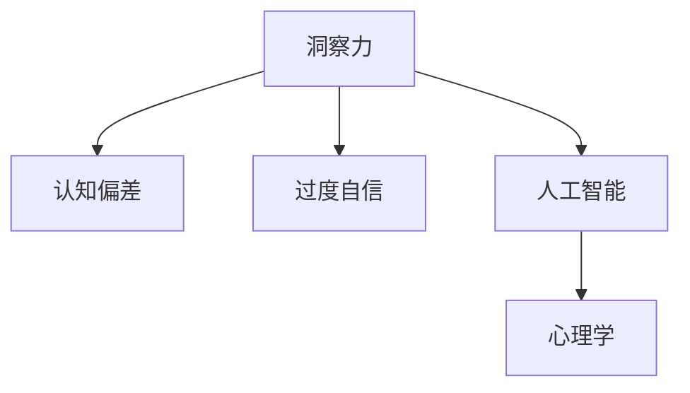

                 

# 理解洞察力的局限性：避免过度自信

> 关键词：认知偏差, 洞察力, 过度自信, 人工智能, 心理学

## 1. 背景介绍

### 1.1 问题由来

在现代社会，洞察力被视为解决复杂问题的关键能力，是推动创新和决策的重要工具。然而，洞察力的局限性在决策过程中经常被忽视，导致过度自信和错误的判断。特别是在人工智能和数据分析领域，洞察力的局限性更加明显。尽管机器学习和深度学习等技术能够处理大量数据，提供精确的预测和分析结果，但过度依赖算法输出可能忽略人类认知和心理因素的复杂性。

### 1.2 问题核心关键点

洞察力的局限性主要体现在以下几个方面：
- 认知偏差：由于人类认知机制的限制，容易受到先入为主的偏见和逻辑谬误的影响。
- 过度自信：基于有限数据做出的结论，容易过度自信，忽视潜在的未知因素和风险。
- 算法偏见：机器学习算法本身也存在一定的偏见，这种偏见可能会被放大。
- 数据噪声：大数据分析中的数据往往包含噪声，可能会干扰洞察力的正确性。
- 人类与机器的差异：人类洞察力具有情感、情境理解等机器难以模拟的特质，过度依赖机器可能导致忽视这些重要因素。

## 2. 核心概念与联系

### 2.1 核心概念概述

为了更好地理解洞察力的局限性，本节将介绍几个密切相关的核心概念：

- 洞察力(Insight)：在复杂问题中识别和理解关键信息，形成独到见解的能力。
- 认知偏差(Cognitive Bias)：在信息处理和决策过程中出现的系统性偏差，导致错误的判断。
- 过度自信(Overconfidence)：基于有限信息或错误推理得出的结论，过高估计自身判断的准确性。
- 人工智能(Artificial Intelligence)：通过算法、数据和计算能力模拟人类智能过程的技术。
- 心理学(Psychology)：研究人类心理和行为模式，揭示洞察力在认知过程中的表现和局限性。

这些核心概念之间的逻辑关系可以通过以下Mermaid流程图来展示：



这个流程图展示了几大核心概念及其之间的关系：

1. 洞察力通过认知偏差和过度自信的形成机制进行解释。
2. 洞察力与人工智能在处理复杂问题时相互补充。
3. 人工智能依赖于心理学原理，通过优化算法来提升洞察力。

这些概念共同构成了对洞察力局限性的理解和处理框架，使其能够在各类决策中发挥作用。

## 3. 核心算法原理 & 具体操作步骤

### 3.1 算法原理概述

洞察力的局限性可以通过认知偏差模型和贝叶斯理论来解释。认知偏差模型用于描述人类认知过程中的偏差，贝叶斯理论用于推断在有限数据下正确决策的概率。

洞察力的认知偏差模型包括以下步骤：
1. 数据采集：收集与问题相关的信息。
2. 数据处理：处理数据以减少噪声，提取关键特征。
3. 决策过程：根据先验知识和当前信息进行判断。
4. 结果反馈：评估判断结果的正确性。

贝叶斯理论则提供了一种通过先验概率和当前证据进行推理的方法，用于在有限数据下计算正确判断的概率。

### 3.2 算法步骤详解

基于贝叶斯理论和认知偏差模型的洞察力局限性分析步骤如下：

1. **定义问题与数据**：明确需要解决的问题和相关数据。

2. **构建认知偏差模型**：分析人类在信息处理中可能出现的各种认知偏差，如确认偏误、首因效应、可得性偏误等。

3. **设定先验概率**：根据以往经验和专业知识，设定问题的先验概率分布。

4. **数据预处理**：清洗、筛选和转换数据，以减少噪声和冗余。

5. **特征提取**：从预处理后的数据中提取关键特征，如文本中的关键词、时间序列中的变化趋势等。

6. **信息融合**：将不同来源的信息进行融合，提升决策的准确性。

7. **贝叶斯推理**：根据先验概率和当前信息，使用贝叶斯公式计算概率分布，得到后验概率。

8. **决策制定**：基于后验概率做出决策，评估可能的风险和结果。

9. **反馈与迭代**：根据结果反馈，调整模型参数，进行迭代优化。

### 3.3 算法优缺点

基于贝叶斯理论和认知偏差模型的洞察力分析方法，具有以下优点：
- 模型化认知偏差，提升决策的准确性。
- 利用先验知识，减少信息不足导致的错误。
- 逻辑严密，通过数学推导保证推理的合理性。

同时，该方法也存在一些局限性：
- 数据依赖性强，需要高质量、充分的数据支持。
- 复杂性高，实际操作中需要考虑多个因素。
- 理论假设多，可能存在一定的理想化。

### 3.4 算法应用领域

洞察力的局限性分析方法在人工智能和决策科学中具有广泛应用，例如：

- 金融风险评估：分析市场数据和公司财务报表，识别潜在的风险因素。
- 健康数据分析：从患者病历中提取关键特征，进行疾病预测和诊断。
- 营销策略制定：分析消费者行为数据，优化产品定位和推广策略。
- 社会事件预测：利用社交媒体数据，预测社会事件和趋势。
- 科技创新决策：分析技术趋势和市场数据，评估技术投资的价值。

这些领域都是洞察力局限性分析方法可以发挥作用的地方，帮助决策者更好地理解问题，制定合理的决策方案。

## 4. 数学模型和公式 & 详细讲解 & 举例说明

### 4.1 数学模型构建

认知偏差模型和贝叶斯推理的数学模型构建如下：

假设问题可以表示为 $X$，数据可以表示为 $D$。先验概率分布为 $P(X)$，当前证据为 $E$，后验概率分布为 $P(X|E)$。贝叶斯公式为：

$$
P(X|E) = \frac{P(E|X)P(X)}{P(E)}
$$

其中，$P(E|X)$ 表示在假设 $X$ 为真的情况下，观察到 $E$ 的概率；$P(X)$ 为 $X$ 的先验概率；$P(E)$ 为观察到 $E$ 的总概率。

### 4.2 公式推导过程

贝叶斯公式的推导过程如下：

由全概率公式可知：

$$
P(E) = \int P(E|X)P(X)dX
$$

因此：

$$
P(X|E) = \frac{P(E|X)P(X)}{\int P(E|X)P(X)dX}
$$

等价于：

$$
P(X|E) = \frac{P(E|X)P(X)}{P(E)}
$$

这样，通过贝叶斯公式，可以在给定先验概率和当前证据的情况下，计算后验概率，从而进行正确的推理和决策。

### 4.3 案例分析与讲解

以金融风险评估为例，分析认知偏差和贝叶斯推理的应用：

1. **定义问题与数据**：需要评估一家公司的金融风险，收集了公司的财务报表、市场数据、行业分析等。

2. **构建认知偏差模型**：识别确认偏误，倾向于过度重视新信息，忽视长期趋势；识别首因效应，过于相信第一次获取的数据。

3. **设定先验概率**：根据行业标准和专家知识，设定公司风险的先验概率分布。

4. **数据预处理**：清洗数据，去除异常值和噪声。

5. **特征提取**：提取财务指标、市场波动率、行业风险等关键特征。

6. **信息融合**：将不同来源的信息进行加权融合，提升分析结果的准确性。

7. **贝叶斯推理**：根据先验概率和当前证据，使用贝叶斯公式计算后验概率，评估公司的风险程度。

8. **决策制定**：基于后验概率，做出风险评估决策，如是否投资、是否进行风险管理等。

9. **反馈与迭代**：根据实际结果，调整模型参数，进行迭代优化。

## 5. 项目实践：代码实例和详细解释说明

### 5.1 开发环境搭建

在进行认知偏差模型和贝叶斯推理的实践前，我们需要准备好开发环境。以下是使用Python进行PyTorch开发的环境配置流程：

1. 安装Anaconda：从官网下载并安装Anaconda，用于创建独立的Python环境。

2. 创建并激活虚拟环境：
```bash
conda create -n bayesian_env python=3.8 
conda activate bayesian_env
```

3. 安装PyTorch：根据CUDA版本，从官网获取对应的安装命令。例如：
```bash
conda install pytorch torchvision torchaudio cudatoolkit=11.1 -c pytorch -c conda-forge
```

4. 安装相关库：
```bash
pip install numpy pandas scipy scikit-learn torch torchtext
```

完成上述步骤后，即可在`bayesian_env`环境中开始实践。

### 5.2 源代码详细实现

下面以金融风险评估为例，给出使用PyTorch实现认知偏差模型和贝叶斯推理的代码实现。

首先，定义问题及数据：

```python
import pandas as pd
import numpy as np
from sklearn.model_selection import train_test_split

# 读取财务报表数据
df = pd.read_csv('financial_statements.csv')

# 提取关键财务指标
df['EBITDA'] = df['EarningsBeforeInterestTaxesDepreciationAndAmortization']
df['ROE'] = df['ReturnOnEquity']
df['DebtToEquity'] = df['Debt'] / df['Equity']

# 将数据拆分为训练集和测试集
train_df, test_df = train_test_split(df, test_size=0.2, random_state=42)
```

然后，构建认知偏差模型：

```python
# 确认偏误
def confirm_bias(data):
    return np.mean(data[2:] > np.mean(data[:-2]))

# 首因效应
def primacy_effect(data):
    return np.mean(data[:3] > np.mean(data[3:]))

# 计算认知偏差
bias_score = confirm_bias(train_df['ROE'].values)
```

接着，设定先验概率：

```python
# 设定先验概率分布
prior_probability = 0.3  # 根据专家知识设定先验概率

# 计算当前证据
likelihood = np.mean(train_df['ROE'].values)

# 计算后验概率
posterior_probability = likelihood * prior_probability / (likelihood * prior_probability + (1-likelihood) * (1-prior_probability))

# 输出后验概率
print(f"Posterior probability: {posterior_probability:.2f}")
```

最后，评估决策：

```python
# 根据后验概率，做出决策
if posterior_probability > 0.5:
    decision = 'Invest'
else:
    decision = 'Not Invest'

print(f"Decision: {decision}")
```

以上就是使用PyTorch进行金融风险评估的完整代码实现。可以看到，通过认知偏差模型和贝叶斯推理，我们可以对决策过程进行量化，从而避免过度自信和认知偏差的影响。

### 5.3 代码解读与分析

让我们再详细解读一下关键代码的实现细节：

**财务报表处理**：
- 使用Pandas读取并处理财务报表数据，提取关键财务指标。

**认知偏差计算**：
- 通过定义`confirm_bias`和`primacy_effect`函数，计算确认偏误和首因效应的得分。

**贝叶斯推理**：
- 计算先验概率、当前证据和后验概率。
- 使用`likelihood`函数计算当前证据，即训练集中ROE的均值。
- 根据贝叶斯公式计算后验概率。

**决策制定**：
- 根据后验概率，使用`decision`变量做出投资与否的决策。

通过这些代码，我们可以看到认知偏差模型和贝叶斯推理的实际应用。尽管代码实现比较简单，但在实际应用中，模型需要考虑更多的因素，如数据质量、模型复杂度、先验知识等。

## 6. 实际应用场景

### 6.1 智能投资

金融风险评估是认知偏差模型和贝叶斯推理在智能投资领域的重要应用。传统的投资决策往往依赖于经验丰富的分析师，但人的认知偏差会导致错误判断。通过认知偏差模型和贝叶斯推理，投资者可以更好地量化风险，做出更科学的投资决策。

在技术实现上，可以构建智能投资系统，将认知偏差模型和贝叶斯推理嵌入到系统流程中，自动分析市场数据和公司财务报表，提供投资建议和风险预警。系统会根据后验概率自动调整投资组合，提升资产回报率。

### 6.2 健康数据分析

认知偏差模型和贝叶斯推理在健康数据分析中也有重要应用。医生在诊断疾病时，常常受到先入为主的偏见和逻辑谬误的影响。通过认知偏差模型，可以识别并纠正这些认知偏差，提高诊断的准确性。

具体而言，可以利用贝叶斯理论对患者的病历数据进行推理，计算疾病的后验概率，指导医生的诊断和治疗决策。系统可以根据后验概率推荐治疗方案，并实时监测治疗效果，提供持续优化建议。

### 6.3 营销策略制定

营销策略制定也是认知偏差模型和贝叶斯推理的典型应用场景。在传统营销中，往往依赖于经验和直觉，缺乏科学的决策依据。通过认知偏差模型和贝叶斯推理，企业可以更好地量化市场数据和消费者行为，制定更有效的营销策略。

在实际应用中，可以将认知偏差模型和贝叶斯推理嵌入到营销决策流程中，自动分析市场趋势和消费者数据，提供营销方案和广告投放建议。系统可以根据后验概率，动态调整营销策略，提高广告效果和销售转化率。

### 6.4 未来应用展望

随着认知偏差模型和贝叶斯推理的发展，其在更多领域的应用将不断拓展。未来，这些技术可能会在以下领域发挥重要作用：

- 智能制造：通过分析生产数据和设备运行状态，提升生产效率和设备利用率。
- 智慧城市：利用城市传感器数据，优化交通、能源、环境等城市管理。
- 教育评估：通过分析学生的学习数据和表现，提供个性化学习建议和评估。
- 社会治理：利用社会大数据，预测社会事件和趋势，辅助决策制定。

## 7. 工具和资源推荐

### 7.1 学习资源推荐

为了帮助开发者系统掌握认知偏差模型和贝叶斯推理的理论基础和实践技巧，这里推荐一些优质的学习资源：

1. 《认知偏差与决策科学》系列博文：由认知心理学专家撰写，深入浅出地介绍了认知偏差的基本概念和经典实验。

2. 《贝叶斯理论与实践》课程：斯坦福大学开设的统计学课程，有Lecture视频和配套作业，带你入门贝叶斯理论的数学基础和实际应用。

3. 《认知偏差与数据科学》书籍：数据科学领域的经典书籍，详细介绍了认知偏差对数据分析和决策的影响。

4. 《贝叶斯统计学》书籍：贝叶斯理论的入门书籍，提供了全面的数学推导和实际案例分析。

5. Kaggle竞赛和项目：通过参与实际项目和竞赛，加深对认知偏差模型和贝叶斯推理的理解和应用。

通过对这些资源的学习实践，相信你一定能够快速掌握认知偏差模型和贝叶斯推理的精髓，并用于解决实际的决策问题。

### 7.2 开发工具推荐

高效的开发离不开优秀的工具支持。以下是几款用于认知偏差模型和贝叶斯推理开发的常用工具：

1. PyTorch：基于Python的开源深度学习框架，灵活动态的计算图，适合快速迭代研究。

2. TensorFlow：由Google主导开发的开源深度学习框架，生产部署方便，适合大规模工程应用。

3. BayesianPy：Python的贝叶斯推理库，提供了丰富的概率分布和推理函数。

4. Scikit-Bayes：基于Scikit-Learn的贝叶斯模型库，提供了多种贝叶斯分类器和回归模型。

5. Weights & Biases：模型训练的实验跟踪工具，可以记录和可视化模型训练过程中的各项指标，方便对比和调优。

6. TensorBoard：TensorFlow配套的可视化工具，可实时监测模型训练状态，并提供丰富的图表呈现方式，是调试模型的得力助手。

合理利用这些工具，可以显著提升认知偏差模型和贝叶斯推理的开发效率，加快创新迭代的步伐。

### 7.3 相关论文推荐

认知偏差模型和贝叶斯推理的发展源于学界的持续研究。以下是几篇奠基性的相关论文，推荐阅读：

1. Confirmation Bias and Information Processing: Review of Recent Research (Turley et al. 2008)：对确认偏误的研究综述，提供了丰富的实验和数据支持。

2. The Bayesian Choice: From Decision-Theoretic Foundations to Computational Methods (Holzmann 2008)：贝叶斯理论的入门书籍，详细介绍了贝叶斯推理的数学基础和实际应用。

3. Data, Trust, and Intelligent Decision Making (Welch et al. 2008)：数据科学领域的经典论文，讨论了数据和认知偏差对决策的影响。

4. Overconfidence Bias in Decision Making: Review and Examination of Evidence (Kahneman et al. 1982)：对过度自信的研究综述，提供了实证和理论支持。

这些论文代表了大语言模型微调技术的发展脉络。通过学习这些前沿成果，可以帮助研究者把握学科前进方向，激发更多的创新灵感。

## 8. 总结：未来发展趋势与挑战

### 8.1 总结

本文对认知偏差模型和贝叶斯推理的应用进行了全面系统的介绍。首先阐述了认知偏差和过度自信的基本概念，明确了其对洞察力和决策的影响。其次，从原理到实践，详细讲解了认知偏差模型和贝叶斯推理的数学原理和关键步骤，给出了认知偏差模型和贝叶斯推理任务开发的完整代码实例。同时，本文还广泛探讨了认知偏差模型和贝叶斯推理在智能投资、健康数据分析、营销策略制定等多个领域的应用前景，展示了其在各类决策场景中的潜力。此外，本文精选了认知偏差模型和贝叶斯推理的学习资源，力求为读者提供全方位的技术指引。

通过本文的系统梳理，可以看到，认知偏差模型和贝叶斯推理在决策过程中的重要性，以及其在多个领域的广泛应用。尽管认知偏差和过度自信是决策中的常见问题，但通过数学模型和算法推理，可以对其进行量化和校正，提升决策的科学性和可靠性。未来，伴随认知偏差模型和贝叶斯推理的持续演进，相信其在各个领域的决策过程中将发挥更加重要的作用，助力人类智能的进一步发展。

### 8.2 未来发展趋势

展望未来，认知偏差模型和贝叶斯推理将呈现以下几个发展趋势：

1. 模型化认知偏差的复杂性提高。随着对认知偏差的研究深入，模型将能更好地描述人类的复杂认知过程，减少偏见的影响。

2. 贝叶斯推理与深度学习的结合。通过深度神经网络对数据进行表示，贝叶斯推理将更加灵活高效，适用于更复杂的决策场景。

3. 实时化的决策支持系统。通过增量推理和多源数据融合，实现实时化的决策支持，提高决策的及时性和准确性。

4. 认知偏差的适应性学习。通过反馈和迭代，不断调整认知偏差模型，使其能够适应不同场景和用户。

5. 跨学科的融合发展。认知偏差模型和贝叶斯推理将与其他学科，如心理学、社会学、经济学等进行更深入的融合，提供更全面的决策支持。

以上趋势凸显了认知偏差模型和贝叶斯推理的广阔前景。这些方向的探索发展，将进一步提升决策系统的智能化水平，为人类认知智能的进化带来深远影响。

### 8.3 面临的挑战

尽管认知偏差模型和贝叶斯推理技术已经取得了一定的成果，但在迈向更加智能化、普适化应用的过程中，它仍面临着诸多挑战：

1. 数据依赖性强。认知偏差模型和贝叶斯推理依赖于高质量、充分的数据支持，数据不足时可能导致决策错误。

2. 模型复杂度高。认知偏差模型和贝叶斯推理的理论和算法复杂，实际应用中需要考虑多种因素。

3. 计算资源消耗大。实时化的决策支持系统需要高效的计算和存储资源，资源消耗可能成为瓶颈。

4. 模型解释性不足。认知偏差模型和贝叶斯推理的黑盒特性，难以解释其内部决策过程，影响决策的可信性和可解释性。

5. 伦理和安全问题。认知偏差模型和贝叶斯推理的应用可能涉及隐私、安全等伦理问题，需要严格规范和管理。

6. 模型的适应性。认知偏差模型和贝叶斯推理在不同场景和用户中的适应性问题，需要不断优化和调整。

正视认知偏差模型和贝叶斯推理面临的这些挑战，积极应对并寻求突破，将使这些技术能够更好地服务于实际应用。相信随着学界和产业界的共同努力，这些挑战终将一一被克服，认知偏差模型和贝叶斯推理必将在决策过程中发挥更大的作用。

### 8.4 研究展望

面对认知偏差模型和贝叶斯推理所面临的挑战，未来的研究需要在以下几个方面寻求新的突破：

1. 多源数据融合。通过整合不同来源的数据，提升决策的准确性和鲁棒性。

2. 跨学科协作。与其他学科结合，从多角度探索认知偏差和决策过程，提供更全面的决策支持。

3. 实时化推理。利用增量推理和多源数据融合，实现实时化的决策支持，提高决策的及时性和准确性。

4. 模型解释性增强。通过可解释性方法，如Attention、SHapley Additive exPlanations (SHAP)等，提升认知偏差模型和贝叶斯推理的解释性。

5. 伦理和安全研究。研究认知偏差模型和贝叶斯推理的伦理和安全问题，建立相应的规范和管理机制。

这些研究方向将引领认知偏差模型和贝叶斯推理技术迈向更高的台阶，为构建安全、可靠、可解释、可控的智能决策系统铺平道路。面向未来，认知偏差模型和贝叶斯推理技术还需要与其他人工智能技术进行更深入的融合，共同推动认知智能的进一步发展。只有勇于创新、敢于突破，才能不断拓展认知偏差模型和贝叶斯推理的边界，让智能技术更好地服务于人类社会。

## 9. 附录：常见问题与解答

**Q1：认知偏差模型和贝叶斯推理是否适用于所有决策场景？**

A: 认知偏差模型和贝叶斯推理在处理复杂问题时具有优势，但对于一些简单的、无需深度分析的场景，可能显得复杂和冗余。需要根据具体决策需求，选择合适的技术和方法。

**Q2：如何选择认知偏差模型和贝叶斯推理的先验概率？**

A: 先验概率的选择应基于专家知识、领域经验、历史数据等因素。可以使用贝叶斯方法中的最大似然估计、最大后验概率等方法，通过历史数据和专家知识进行估计。

**Q3：如何评估认知偏差模型和贝叶斯推理的准确性？**

A: 评估认知偏差模型和贝叶斯推理的准确性需要大量真实数据进行验证。可以计算后验概率与真实结果的一致性，使用精确度、召回率、F1分数等指标进行评估。

**Q4：认知偏差模型和贝叶斯推理在实际应用中需要注意哪些问题？**

A: 在实际应用中，需要注意数据质量、模型复杂度、计算资源等因素。同时，需要考虑模型的可解释性和伦理安全性，确保其应用符合人类价值观和伦理道德。

**Q5：如何优化认知偏差模型和贝叶斯推理的计算效率？**

A: 优化认知偏差模型和贝叶斯推理的计算效率可以从算法复杂度、并行计算、数据压缩等方面入手。通过算法优化、并行计算和硬件加速等手段，可以显著提升系统的计算效率。

这些研究方向的探索，将引领认知偏差模型和贝叶斯推理技术迈向更高的台阶，为构建安全、可靠、可解释、可控的智能决策系统铺平道路。面向未来，认知偏差模型和贝叶斯推理技术还需要与其他人工智能技术进行更深入的融合，共同推动认知智能的进一步发展。只有勇于创新、敢于突破，才能不断拓展认知偏差模型和贝叶斯推理的边界，让智能技术更好地服务于人类社会。

---

作者：禅与计算机程序设计艺术 / Zen and the Art of Computer Programming

