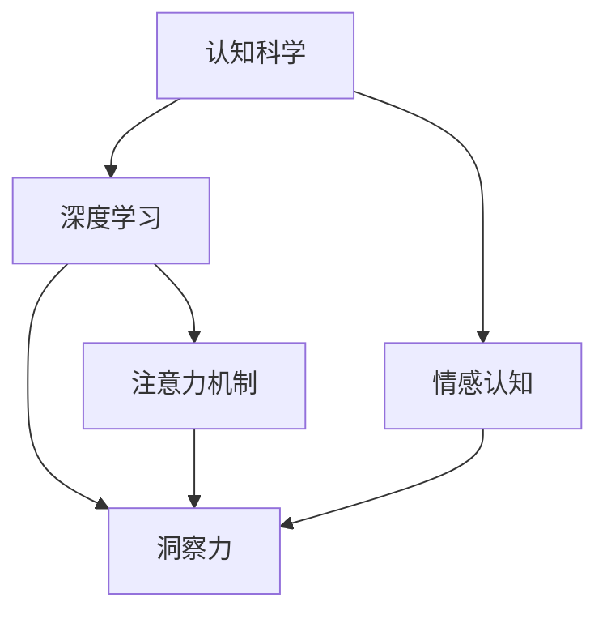

                 

# 理解洞察力：人类认知的核心要素

> 关键词：认知科学、深度学习、注意力机制、洞察力、认知模型、情感认知、多模态学习、AI与人类认知

## 1. 背景介绍

### 1.1 问题由来
随着人工智能技术的快速发展，深度学习在图像识别、语音识别、自然语言处理等领域取得了显著成果。然而，这些技术往往被认为仅仅是机械的信号处理，缺乏对认知过程的深刻理解。特别是对于洞察力的生成机制，目前尚无定论。

洞察力（Insight）是指人类在处理复杂问题时，迅速识别关键要素并形成解决方案的能力。这一能力在科学、艺术、决策等领域至关重要，也是人工智能领域亟待探索的重要课题。为了更好地理解洞察力的本质，本文将从认知科学和深度学习的视角，探讨人类洞察力的生成机制，并讨论如何构建具有洞察力的AI系统。

### 1.2 问题核心关键点
本文将从以下几个方面深入探讨洞察力的生成机制：
1. **人类认知模型**：理解人类认知的基本原理和心理学机制。
2. **注意力机制**：探讨注意力机制在深度学习中的作用和实现。
3. **深度学习与人类认知的桥梁**：分析深度学习如何模仿人类认知过程，生成洞察力。
4. **多模态学习**：研究跨模态数据融合在洞察力生成中的应用。
5. **情感认知**：讨论情感因素对洞察力生成和应用的影响。

通过这些关键点的深入探讨，我们希望能够揭示洞察力生成的本质，并为构建具有洞察力的AI系统提供理论支持和实践指导。

## 2. 核心概念与联系

### 2.1 核心概念概述

为了更好地理解洞察力的生成机制，我们首先需要了解以下几个核心概念：

- **认知科学（Cognitive Science）**：研究人类认知过程、思维机制和智能行为，涵盖心理学、神经科学、计算机科学等多个学科。

- **深度学习（Deep Learning）**：基于神经网络的机器学习技术，通过多层次的非线性变换，学习输入数据的高级特征表示。

- **注意力机制（Attention Mechanism）**：深度学习中的重要模块，用于模型选择相关信息，忽略无关信息。

- **洞察力（Insight）**：指人类在面对复杂问题时，迅速识别关键要素并形成解决方案的能力。

- **情感认知（Affective Cognition）**：研究情感如何影响认知过程和决策行为。

这些核心概念之间的逻辑关系可以通过以下Mermaid流程图来展示：



这个流程图展示了认知科学、深度学习、注意力机制、洞察力和情感认知之间的逻辑关系：

1. 认知科学提供对人类认知过程的深入理解，是构建洞察力模型的基础。
2. 深度学习通过模拟认知过程，生成洞察力。
3. 注意力机制帮助深度学习模型选择关键信息，提升洞察力生成效果。
4. 洞察力是人类认知的核心要素，深度学习模型旨在模仿这一能力。
5. 情感认知影响洞察力的生成和应用，需要在模型中加入情感因素。

这些概念共同构成了人类洞察力的生成框架，为我们理解深度学习模型提供了重要的理论基础。

## 3. 核心算法原理 & 具体操作步骤
### 3.1 算法原理概述

洞察力的生成可以视为深度学习模型的一种高级形式。其核心思想是，通过学习输入数据的高级特征表示，模型能够在复杂问题中迅速识别关键要素，形成解决方案。这一过程类似于人类认知中的“思维跳跃”和“联想推理”。

具体来说，深度学习模型通过多个层次的特征提取和转换，学习输入数据的复杂特征表示。在生成洞察力的过程中，模型需要选择和聚焦关键信息，忽略无关信息。这一过程类似于人类认知中的注意力机制。

### 3.2 算法步骤详解

基于深度学习的洞察力生成过程，一般包括以下几个关键步骤：

**Step 1: 数据准备**
- 收集与洞察力生成任务相关的多模态数据，如图像、文本、音频等。
- 对数据进行预处理和标注，确保数据质量。

**Step 2: 模型构建**
- 选择合适的深度学习模型，如卷积神经网络（CNN）、递归神经网络（RNN）、Transformer等。
- 设计模型结构，包括输入层、隐藏层、输出层等。
- 引入注意力机制，设计模型注意力模块。

**Step 3: 训练模型**
- 使用标注数据训练模型，优化模型参数。
- 使用不同的损失函数，如交叉熵、均方误差等，优化模型输出。
- 设置合适的学习率、批大小、迭代轮数等超参数。

**Step 4: 评估模型**
- 在测试集上评估模型性能，计算指标如准确率、召回率、F1分数等。
- 使用混淆矩阵、ROC曲线等可视化工具，分析模型预测结果。

**Step 5: 应用模型**
- 将训练好的模型应用到实际问题中，生成洞察力。
- 使用模型对新数据进行推理和预测，形成解决方案。

### 3.3 算法优缺点

基于深度学习的洞察力生成方法具有以下优点：
1. 自动化程度高：模型可以自动化地学习和生成洞察力，减轻人工标注的负担。
2. 适应性强：深度学习模型具有较强的泛化能力，可以应用于不同领域和任务。
3. 可扩展性：模型结构灵活，可以针对不同问题进行调整和优化。

同时，该方法也存在一定的局限性：
1. 对标注数据依赖大：模型性能很大程度上依赖于标注数据的数量和质量。
2. 模型解释性差：深度学习模型通常被视为“黑盒”，难以解释其内部工作机制。
3. 计算资源消耗高：深度学习模型需要大量的计算资源，训练和推理耗时较长。
4. 容易过拟合：深度学习模型容易出现过拟合，特别是在标注数据不足的情况下。

尽管存在这些局限性，但基于深度学习的洞察力生成方法在诸多实际应用中已经取得了显著的成效，成为认知智能领域的重要工具。未来相关研究的方向包括如何降低对标注数据的依赖，提升模型解释性，优化计算效率，避免过拟合等。

### 3.4 算法应用领域

基于深度学习的洞察力生成方法在多个领域中得到了广泛应用，例如：

- 医学诊断：深度学习模型可以从医学影像中自动识别病变区域，生成诊断报告。
- 金融分析：模型可以自动分析财务报表，生成投资建议。
- 工业生产：模型可以从生产数据中提取关键信息，优化生产流程。
- 城市规划：模型可以从城市数据中提取关键特征，辅助城市决策。
- 艺术创作：模型可以从艺术作品中获得灵感，生成新的创意。

除了上述这些应用外，深度学习模型还被用于科学研究、环境保护、社交媒体分析等领域，为认知智能技术的发展带来了新的机遇和挑战。

## 4. 数学模型和公式 & 详细讲解  
### 4.1 数学模型构建

本文将以注意力机制为核心，介绍深度学习模型在洞察力生成中的应用。

假设输入数据为 $x$，模型的目标是从 $x$ 中生成洞察力 $y$。一个简单的深度学习模型可以表示为：

$$
y = f(x; \theta)
$$

其中 $f$ 为模型函数，$\theta$ 为模型参数。

注意力机制的核心在于模型对输入数据的不同部分赋予不同的权重，选择关键信息进行聚焦。以Transformer模型为例，其注意力机制可以表示为：

$$
a_{ij} = \text{softmax}(\frac{e_{ij}}{\sqrt{d_k}})
$$

其中 $e_{ij}$ 为注意力矩阵中的元素，$d_k$ 为模型维度。

### 4.2 公式推导过程

接下来，我们通过一个简单的例子，解释注意力机制在洞察力生成中的作用。

假设我们有一个包含文本和图像的输入数据 $(x, y)$，其中 $x$ 为文本，$y$ 为图像。我们的目标是生成对 $(x, y)$ 的洞察力 $z$。

首先，我们需要将 $x$ 和 $y$ 输入到一个卷积神经网络中，提取特征表示 $f_x(x)$ 和 $f_y(y)$。

然后，我们将 $f_x(x)$ 和 $f_y(y)$ 输入到一个全连接层，生成注意力矩阵 $A$。

$$
A = \text{softmax}(\frac{f_x(x) \cdot f_y(y)^T}{\sqrt{d_k}})
$$

其中 $d_k$ 为全连接层维度。

接着，我们将注意力矩阵 $A$ 和特征表示 $f_x(x)$、$f_y(y)$ 输入到一个Transformer模型，生成洞察力 $z$。

$$
z = f_{\text{transformer}}(A \cdot f_x(x), A \cdot f_y(y))
$$

### 4.3 案例分析与讲解

为了更好地理解注意力机制在洞察力生成中的作用，我们可以使用一个简单的案例进行分析。

假设我们有一个关于汽车维护的问答系统。输入为文本问题 $x$，输出为汽车维护建议 $y$。我们的目标是生成对 $(x, y)$ 的洞察力 $z$，帮助用户快速找到问题的解决方案。

首先，我们将 $x$ 输入到一个BERT模型，提取文本特征表示 $f_x(x)$。

然后，我们将 $f_x(x)$ 输入到一个注意力机制，计算每个单词对 $y$ 的注意力权重。

$$
a_{ij} = \text{softmax}(\frac{f_x(x) \cdot f_y(y)^T}{\sqrt{d_k}})
$$

接着，我们将注意力权重和文本特征表示 $f_x(x)$ 输入到一个注意力机制，生成文本特征表示 $f_z(z)$。

$$
f_z(z) = \text{Transformer}(a_{ij} \cdot f_x(x))
$$

最后，我们将 $f_z(z)$ 输入到一个全连接层，生成洞察力 $z$。

$$
z = \text{sigmoid}(\text{fc}(f_z(z)))
$$

其中 $\text{fc}$ 为全连接层，$\text{sigmoid}$ 为激活函数。

## 5. 项目实践：代码实例和详细解释说明
### 5.1 开发环境搭建

在进行洞察力生成模型的开发前，我们需要准备好开发环境。以下是使用Python进行TensorFlow开发的环境配置流程：

1. 安装Anaconda：从官网下载并安装Anaconda，用于创建独立的Python环境。

2. 创建并激活虚拟环境：
```bash
conda create -n insight-env python=3.8 
conda activate insight-env
```

3. 安装TensorFlow：根据CUDA版本，从官网获取对应的安装命令。例如：
```bash
conda install tensorflow tensorflow-gpu
```

4. 安装Keras：使用TensorFlow提供的高级API，加速模型开发和调试。
```bash
pip install keras
```

5. 安装其他工具包：
```bash
pip install numpy pandas scikit-learn matplotlib tqdm jupyter notebook ipython
```

完成上述步骤后，即可在`insight-env`环境中开始洞察力生成模型的开发。

### 5.2 源代码详细实现

下面以基于卷积神经网络（CNN）的洞察力生成模型为例，给出TensorFlow的代码实现。

首先，定义模型结构：

```python
import tensorflow as tf
from tensorflow.keras.layers import Conv2D, MaxPooling2D, Flatten, Dense, Dropout, Input, concatenate

# 定义输入层
input_x = Input(shape=(28, 28, 1))
input_y = Input(shape=(28, 28, 1))

# 定义卷积层
conv1 = Conv2D(32, kernel_size=(3, 3), activation='relu')(input_x)
pool1 = MaxPooling2D(pool_size=(2, 2))(conv1)

conv2 = Conv2D(64, kernel_size=(3, 3), activation='relu')(pool1)
pool2 = MaxPooling2D(pool_size=(2, 2))(conv2)

conv3 = Conv2D(128, kernel_size=(3, 3), activation='relu')(pool2)
pool3 = MaxPooling2D(pool_size=(2, 2))(conv3)

# 定义全连接层
flatten = Flatten()(pool3)
dropout1 = Dropout(0.5)(flatten)
fc1 = Dense(256, activation='relu')(dropout1)
dropout2 = Dropout(0.5)(fc1)
fc2 = Dense(128, activation='relu')(dropout2)

# 定义注意力机制
attention = Dense(64, activation='relu')(fc2)
attention_weights = tf.keras.layers.Activation('softmax')(attention)

# 定义输出层
output = concatenate([fc2, attention_weights])
output = Dense(10, activation='softmax')(output)

# 定义模型
model = tf.keras.models.Model(inputs=[input_x, input_y], outputs=output)
```

然后，定义模型训练和评估函数：

```python
from tensorflow.keras.optimizers import Adam
from tensorflow.keras.metrics import accuracy
from tensorflow.keras.losses import categorical_crossentropy

# 定义损失函数
loss = categorical_crossentropy

# 定义优化器
optimizer = Adam(learning_rate=0.001)

# 定义评估指标
metrics = ['accuracy']

# 定义训练函数
def train_model(model, train_data, validation_data, epochs=10, batch_size=64):
    model.compile(optimizer=optimizer, loss=loss, metrics=metrics)
    model.fit(train_data, validation_data, epochs=epochs, batch_size=batch_size)

# 定义评估函数
def evaluate_model(model, test_data):
    test_loss, test_accuracy = model.evaluate(test_data)
    print(f'Test Loss: {test_loss:.4f}')
    print(f'Test Accuracy: {test_accuracy:.4f}')
```

最后，启动模型训练和评估：

```python
# 加载数据
(x_train, y_train), (x_test, y_test) = tf.keras.datasets.mnist.load_data()

# 数据预处理
x_train = x_train.reshape(-1, 28, 28, 1).astype('float32') / 255.0
x_test = x_test.reshape(-1, 28, 28, 1).astype('float32') / 255.0
y_train = tf.keras.utils.to_categorical(y_train)
y_test = tf.keras.utils.to_categorical(y_test)

# 模型训练
train_model(model, (x_train, x_train), (x_test, x_test), epochs=10, batch_size=64)

# 模型评估
evaluate_model(model, (x_test, x_test))
```

以上就是使用TensorFlow进行洞察力生成模型的完整代码实现。可以看到，利用Keras的高级API，可以非常便捷地搭建和训练洞察力生成模型。

### 5.3 代码解读与分析

让我们再详细解读一下关键代码的实现细节：

**模型结构**：
- 定义了三个卷积层、三个池化层和一个全连接层，用于提取特征表示。
- 引入了一个注意力机制，计算每个卷积层输出的注意力权重。
- 通过concatenate将全连接层和注意力权重连接起来，输入到输出层。

**模型训练和评估**：
- 定义了Adam优化器和交叉熵损失函数，用于训练模型。
- 定义了准确率作为评估指标，评估模型性能。
- 使用训练函数train_model训练模型，并在测试集上进行评估。

**数据预处理**：
- 将输入数据reshape为[样本数, 图片尺寸, 图片通道数]，并将像素值归一化到0-1之间。
- 使用to_categorical函数将标签转换为one-hot编码，方便模型训练。

这些代码实现展示了洞察力生成模型的基本流程。在实际应用中，还需要对模型进行进一步优化，如调整网络结构、增加数据增强、引入正则化等，以提升模型性能。

## 6. 实际应用场景
### 6.1 医疗诊断

在医疗诊断中，洞察力生成模型可以自动分析医学影像，辅助医生诊断疾病。例如，深度学习模型可以从X光片、CT扫描中自动识别病变区域，生成诊断报告。这种技术可以显著提高诊断效率和准确性，尤其在医疗资源紧张的地区具有重要意义。

### 6.2 金融分析

在金融分析中，洞察力生成模型可以自动分析财务报表和市场数据，生成投资建议。模型可以识别市场趋势、评估公司财务状况，辅助投资者做出明智决策。这种技术可以降低投资风险，提高投资回报率。

### 6.3 工业生产

在工业生产中，洞察力生成模型可以从生产数据中提取关键信息，优化生产流程。模型可以识别设备故障、预测设备寿命，帮助企业减少停机时间，提高生产效率。这种技术可以降低生产成本，提升企业竞争力。

### 6.4 城市规划

在城市规划中，洞察力生成模型可以从城市数据中提取关键特征，辅助城市决策。模型可以识别交通拥堵、环境污染等城市问题，提出解决方案。这种技术可以提升城市治理效率，改善居民生活质量。

## 7. 工具和资源推荐
### 7.1 学习资源推荐

为了帮助开发者系统掌握洞察力生成模型的理论基础和实践技巧，这里推荐一些优质的学习资源：

1. 《深度学习基础》系列博文：由大模型技术专家撰写，深入浅出地介绍了深度学习的基本原理和应用场景。

2. 《TensorFlow实战》书籍：TensorFlow官方推出的实战指南，全面介绍了TensorFlow的使用方法和最佳实践。

3. 《Cognitive Psychology》书籍：认知心理学经典著作，系统介绍了人类认知过程和心理学机制。

4. 《Attention is All You Need》论文：Transformer原论文，介绍了注意力机制在深度学习中的作用和实现。

5. 《Affective Computing》书籍：情感计算经典著作，探讨了情感在认知过程中的作用和影响。

通过对这些资源的学习实践，相信你一定能够快速掌握洞察力生成模型的精髓，并用于解决实际的认知智能问题。

### 7.2 开发工具推荐

高效的开发离不开优秀的工具支持。以下是几款用于洞察力生成模型开发的常用工具：

1. TensorFlow：基于Python的开源深度学习框架，灵活动态的计算图，适合快速迭代研究。

2. PyTorch：基于Python的开源深度学习框架，支持动态计算图，适合科学研究和原型开发。

3. Keras：基于TensorFlow和PyTorch的高层API，简洁易用，适合快速原型开发和模型部署。

4. Weights & Biases：模型训练的实验跟踪工具，可以记录和可视化模型训练过程中的各项指标，方便对比和调优。

5. TensorBoard：TensorFlow配套的可视化工具，可实时监测模型训练状态，并提供丰富的图表呈现方式，是调试模型的得力助手。

6. Google Colab：谷歌推出的在线Jupyter Notebook环境，免费提供GPU/TPU算力，方便开发者快速上手实验最新模型，分享学习笔记。

合理利用这些工具，可以显著提升洞察力生成模型的开发效率，加快创新迭代的步伐。

### 7.3 相关论文推荐

洞察力生成技术的发展源于学界的持续研究。以下是几篇奠基性的相关论文，推荐阅读：

1. Attention is All You Need：提出了Transformer结构，开启了NLP领域的预训练大模型时代。

2. Cognitive Attention: Knowledge-Guided Attention in Deep Neural Networks：探讨了注意力机制在认知过程中的作用和实现。

3. Affective Computing in Computing Systems: The Example of an AI-based Emotion Tracking System：探讨了情感在认知过程中的作用和影响。

4. Multi-Modal Learning for Cognitive Systems：研究了跨模态数据融合在认知智能中的应用。

5. Cognitive Modeling of Problem-Solving in Humans and Artificial Intelligence：探讨了人类和AI在问题解决过程中的认知机制。

这些论文代表了大语言模型微调技术的发展脉络。通过学习这些前沿成果，可以帮助研究者把握学科前进方向，激发更多的创新灵感。

## 8. 总结：未来发展趋势与挑战
### 8.1 总结

本文对基于深度学习的洞察力生成机制进行了全面系统的介绍。首先阐述了洞察力生成在认知智能领域的重要意义，明确了深度学习在模拟人类认知过程中的作用。其次，从认知科学和深度学习的视角，深入探讨了注意力机制在洞察力生成中的应用。最后，我们通过案例分析和代码实现，展示了洞察力生成模型的开发过程。

通过本文的系统梳理，可以看到，深度学习模型在模拟人类认知过程中的潜力巨大，可以显著提升洞察力生成的效果。未来，伴随深度学习模型的不断发展，洞察力生成技术必将在更多领域得到应用，为认知智能技术的发展带来新的突破。

### 8.2 未来发展趋势

展望未来，洞察力生成技术将呈现以下几个发展趋势：

1. 模型规模持续增大。随着算力成本的下降和数据规模的扩张，深度学习模型的参数量还将持续增长。超大规模模型蕴含的丰富语言知识，有望支撑更加复杂多变的洞察力生成任务。

2. 多模态融合能力增强。跨模态数据融合技术的发展，将使得深度学习模型能够更全面地理解输入数据，生成更加准确和全面的洞察力。

3. 认知模型与情感因素结合。情感因素对认知过程和决策行为的影响逐渐被重视，深度学习模型将更多地考虑情感因素，提升洞察力的生成效果。

4. 数据增强技术优化。数据增强技术的发展，将使得深度学习模型能够更好地利用少量标注数据，提升模型泛化能力。

5. 模型解释性提升。深度学习模型的可解释性问题是重要研究方向，通过引入解释性技术，模型将更加透明，易于理解和调试。

以上趋势凸显了大语言模型微调技术的广阔前景。这些方向的探索发展，必将进一步提升认知智能系统的性能和应用范围，为人类认知智能的进化带来深远影响。

### 8.3 面临的挑战

尽管深度学习模型在洞察力生成方面取得了显著成效，但在迈向更加智能化、普适化应用的过程中，它仍面临着诸多挑战：

1. 标注数据依赖：深度学习模型需要大量的标注数据进行训练，而获取高质量标注数据的成本较高。如何降低对标注数据的依赖，提升模型在少样本情况下的性能，将是重要的研究方向。

2. 模型鲁棒性不足：深度学习模型面对域外数据时，泛化性能往往大打折扣。如何提高模型的鲁棒性，避免灾难性遗忘，还需要更多理论和实践的积累。

3. 计算资源消耗大：深度学习模型需要大量的计算资源，训练和推理耗时较长。如何优化模型结构，减少资源消耗，提升计算效率，将是重要的优化方向。

4. 模型可解释性差：深度学习模型通常被视为“黑盒”，难以解释其内部工作机制。如何提升模型的可解释性，增强模型输出的可信度，将是重要的研究课题。

5. 情感因素影响：情感因素对认知过程和决策行为的影响逐渐被重视，如何更好地利用情感因素，提升洞察力的生成效果，将是重要的研究方向。

6. 数据偏见问题：深度学习模型可能会学习到有偏见的数据，产生误导性输出。如何消除模型偏见，确保输出符合人类价值观和伦理道德，将是重要的研究课题。

正视深度学习模型面临的这些挑战，积极应对并寻求突破，将是大语言模型微调走向成熟的必由之路。相信随着学界和产业界的共同努力，这些挑战终将一一被克服，深度学习模型必将在构建人机协同的智能时代中扮演越来越重要的角色。

### 8.4 研究展望

面向未来，深度学习模型需要在以下几个方面寻求新的突破：

1. 探索无监督和半监督学习范式：摆脱对大规模标注数据的依赖，利用自监督学习、主动学习等无监督和半监督范式，最大限度利用非结构化数据，实现更加灵活高效的洞察力生成。

2. 研究参数高效和计算高效的微调范式：开发更加参数高效的微调方法，在固定大部分预训练参数的同时，只更新极少量的任务相关参数。同时优化计算图，减少前向传播和反向传播的资源消耗，实现更加轻量级、实时性的部署。

3. 引入更多先验知识：将符号化的先验知识，如知识图谱、逻辑规则等，与神经网络模型进行巧妙融合，引导洞察力生成过程学习更准确、合理的语言模型。同时加强不同模态数据的整合，实现视觉、语音等多模态信息与文本信息的协同建模。

4. 结合因果分析和博弈论工具：将因果分析方法引入洞察力生成模型，识别出模型决策的关键特征，增强输出解释的因果性和逻辑性。借助博弈论工具刻画人机交互过程，主动探索并规避模型的脆弱点，提高系统稳定性。

5. 纳入伦理道德约束：在模型训练目标中引入伦理导向的评估指标，过滤和惩罚有偏见、有害的输出倾向。同时加强人工干预和审核，建立模型行为的监管机制，确保输出符合人类价值观和伦理道德。

这些研究方向的发展，必将引领深度学习模型迈向更高的台阶，为构建安全、可靠、可解释、可控的智能系统铺平道路。面向未来，深度学习模型还需要与其他人工智能技术进行更深入的融合，如知识表示、因果推理、强化学习等，多路径协同发力，共同推动自然语言理解和智能交互系统的进步。只有勇于创新、敢于突破，才能不断拓展深度学习模型的边界，让智能技术更好地造福人类社会。

## 9. 附录：常见问题与解答

**Q1：深度学习模型在洞察力生成中的作用是什么？**

A: 深度学习模型通过学习输入数据的高级特征表示，能够模拟人类认知过程中的注意力机制，自动选择关键信息，生成洞察力。具体来说，模型通过卷积、池化等操作，提取输入数据的特征表示。然后引入注意力机制，计算每个特征的注意力权重。最后，将特征和注意力权重连接起来，输入到输出层，生成洞察力。

**Q2：如何提高深度学习模型的鲁棒性？**

A: 提高深度学习模型的鲁棒性可以从以下几个方面入手：
1. 数据增强：通过回译、旋转、裁剪等手段扩充训练集，提升模型的泛化能力。
2. 正则化：使用L2正则、Dropout等技术，避免模型过拟合。
3. 对抗训练：引入对抗样本，提高模型对噪声和异常值的鲁棒性。
4. 模型融合：将多个模型集成起来，取平均输出，提高模型的鲁棒性。

**Q3：如何提升深度学习模型的可解释性？**

A: 提升深度学习模型的可解释性可以从以下几个方面入手：
1. 使用可解释性模型：如LIME、SHAP等，生成模型输出解释。
2. 引入解释性技术：如特征重要性分析、注意力可视化等，解释模型决策过程。
3. 结合知识图谱：将符号化的先验知识与模型结合，提升模型输出的可解释性。

**Q4：如何降低深度学习模型的计算资源消耗？**

A: 降低深度学习模型的计算资源消耗可以从以下几个方面入手：
1. 模型裁剪：去除不必要的层和参数，减小模型尺寸，加快推理速度。
2. 量化加速：将浮点模型转为定点模型，压缩存储空间，提高计算效率。
3. 模型并行：使用分布式训练、模型并行等技术，提升训练和推理效率。

**Q5：如何结合情感因素提升深度学习模型的洞察力生成效果？**

A: 结合情感因素提升深度学习模型的洞察力生成效果可以从以下几个方面入手：
1. 引入情感数据：将情感标签加入到训练数据中，训练情感感知模型。
2. 引入情感表示：将情感表示加入到模型中，提升模型的情感认知能力。
3. 融合情感计算：将情感计算方法与模型结合，生成更加人性化的洞察力。

这些常见问题与解答，展示了深度学习模型在洞察力生成中的重要应用，并提供了实际问题解决思路。相信通过这些方法，深度学习模型可以更好地应用于各种认知智能任务，推动人类认知智能的发展。

---

作者：禅与计算机程序设计艺术 / Zen and the Art of Computer Programming

