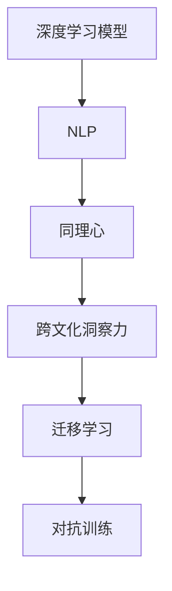

                 

# 理解的艺术：同理心与跨文化洞察力

理解的艺术：同理心与跨文化洞察力

理解的艺术：同理心与跨文化洞察力

在当今全球化的世界，人工智能的深度学习模型成为了理解和沟通不同文化的重要桥梁。本文将探讨基于深度学习的技术，特别是自然语言处理（NLP），如何通过同理心和跨文化洞察力，提升人与机器之间的理解水平。我们还将深入探讨在构建和部署这些模型时所面临的挑战，以及未来如何更好地利用这些技术。

## 1. 背景介绍

### 1.1 问题由来
随着人工智能技术的不断发展，深度学习模型在理解和沟通不同文化方面取得了显著进展。然而，这些模型常常面临语言多样性和文化差异的挑战。如何让机器更好地理解人类的意图和情感，并在此基础上进行跨文化交流，是当前人工智能领域的一个重要研究课题。

### 1.2 问题核心关键点
深度学习模型，特别是基于自然语言处理的模型，通过大量的语料库训练，可以学习到丰富的语言模式和结构。然而，由于训练数据的多样性和文化背景的复杂性，这些模型在面对不同文化背景的用户时，仍可能出现误解或误判。因此，如何增强模型的同理心和跨文化洞察力，使其能够更好地理解和适应不同文化背景的用户，是本研究的核心关键点。

### 1.3 问题研究意义
本研究旨在通过提升深度学习模型的同理心和跨文化洞察力，使其能够更好地理解和交流不同文化背景的用户。这不仅有助于提升机器的智能水平，也能为跨文化交流和全球协作提供有力支持。未来，随着全球化的深入，理解的艺术将成为人类智能和机器智能的重要交集，具有深远的学术和实践意义。

## 2. 核心概念与联系

### 2.1 核心概念概述

为更好地理解基于深度学习的跨文化交流技术，本节将介绍几个密切相关的核心概念：

- **深度学习模型**：基于多层神经网络的机器学习模型，通过反向传播算法进行训练，可以学习到输入和输出之间的复杂映射关系。
- **自然语言处理（NLP）**：涉及对文本数据的处理、分析和生成，是实现跨文化交流的基础技术。
- **同理心**：指理解和分享他人感受的能力，是实现跨文化交流的核心要素。
- **跨文化洞察力**：指识别和理解不同文化背景用户的能力，是实现跨文化交流的关键。
- **迁移学习**：将在一个任务上学习的知识迁移到另一个任务上，是提升模型跨文化能力的常用方法。
- **对抗训练**：通过在训练中加入对抗样本，提高模型对噪声和异常的鲁棒性，增强模型的跨文化适应能力。

这些核心概念之间的逻辑关系可以通过以下Mermaid流程图来展示：



这个流程图展示了大语言模型的工作原理和优化方向：

1. 深度学习模型通过大规模语料库进行预训练，学习到丰富的语言知识。
2. NLP技术使模型能够处理和分析文本数据，从而进行跨文化交流。
3. 同理心和跨文化洞察力使模型能够理解不同文化背景用户的意图和情感。
4. 迁移学习使模型能够将在一领域学到的知识迁移到另一领域，提升模型的跨文化适应能力。
5. 对抗训练使模型更加鲁棒，能够抵抗噪声和异常，增强模型的跨文化适应能力。

## 3. 核心算法原理 & 具体操作步骤
### 3.1 算法原理概述

基于深度学习的跨文化交流技术，通过模型训练和迁移学习，实现了同理心和跨文化洞察力的提升。其核心思想是：将深度学习模型应用于多语言、多文化背景的语料库进行预训练，学习到跨文化的语言知识和语义信息。然后，通过迁移学习，将模型应用于特定文化背景的用户，进一步提升模型的同理心和跨文化适应能力。

形式化地，假设模型为 $M$，训练数据为 $D=\{(x_i, y_i)\}_{i=1}^N$，其中 $x_i$ 为输入文本，$y_i$ 为对应的目标标签。模型 $M$ 通过训练学习到输入和输出之间的映射关系。对于跨文化交流，我们希望模型 $M$ 在面对不同文化背景的用户时，能够准确理解和交流。

### 3.2 算法步骤详解

基于深度学习的跨文化交流技术的一般流程如下：

**Step 1: 准备语料库**
- 收集多语言、多文化背景的文本数据，构建涵盖不同语言和文化的多样化语料库。
- 清洗和预处理语料库，包括去除噪音、统一编码格式等。

**Step 2: 构建预训练模型**
- 选择适合的深度学习架构，如Transformer、BERT等，构建预训练模型。
- 在多语言、多文化背景的语料库上，使用掩码语言模型（Masked Language Modeling, MLM）、下一句预测（Next Sentence Prediction, NSP）等自监督任务进行预训练。
- 冻结部分预训练参数，只微调顶层或部分任务相关层。

**Step 3: 迁移学习**
- 使用特定文化背景的标注数据，对模型进行有监督的微调。
- 引入对抗训练等正则化技术，防止模型过拟合。
- 应用数据增强技术，丰富训练数据多样性。

**Step 4: 评估和优化**
- 在测试集上评估模型性能，使用BLEU、ROUGE等指标评估模型的翻译质量或理解能力。
- 根据评估结果，调整模型结构和超参数，进一步优化模型性能。

### 3.3 算法优缺点

基于深度学习的跨文化交流技术具有以下优点：
1. 通过预训练和迁移学习，模型能够快速适应不同文化背景的用户，提升同理心和跨文化洞察力。
2. 多语言、多文化背景的语料库训练，使模型具备更强的泛化能力，能够更好地理解和交流不同文化的用户。
3. 模型结构灵活，可以引入多种正则化技术，提升模型的鲁棒性和稳定性。

同时，该技术也存在一定的局限性：
1. 依赖高质量标注数据。预训练和迁移学习都需要大量的高质量标注数据，获取这些数据的时间和成本较高。
2. 模型复杂度高。大规模深度学习模型的训练和推理需要大量计算资源，可能面临计算瓶颈。
3. 模型解释性不足。深度学习模型通常是“黑盒”，难以解释其内部工作机制和决策逻辑。
4. 文化差异复杂。不同文化背景的差异复杂多样，模型可能需要大量的多文化数据才能适应。

尽管存在这些局限性，但就目前而言，基于深度学习的跨文化交流技术仍是最主流的方法。未来相关研究的重点在于如何进一步降低数据依赖，提高模型的鲁棒性和可解释性，同时兼顾跨文化适应性。

### 3.4 算法应用领域

基于深度学习的跨文化交流技术已经广泛应用于诸多领域，例如：

- **翻译**：将一种语言翻译成另一种语言，提升跨语言交流的效率和质量。
- **问答系统**：理解用户的自然语言问题，提供准确的答案或建议，增强跨文化交流。
- **社交媒体分析**：分析不同文化背景用户在社交媒体上的情感和行为，提升跨文化理解。
- **情感分析**：识别用户在不同文化背景下的情感倾向，增强跨文化交流的情感感知。
- **客服系统**：提供跨文化客服支持，提升客服系统的服务质量和用户满意度。

除了上述这些经典任务外，跨文化交流技术还被创新性地应用到更多场景中，如智能推荐、虚拟现实、多语言交互等，为跨文化交流带来了新的突破。随着深度学习技术的不断进步，相信跨文化交流技术将在更广阔的应用领域大放异彩。

## 4. 数学模型和公式 & 详细讲解 & 举例说明
### 4.1 数学模型构建

本节将使用数学语言对基于深度学习的跨文化交流技术进行更加严格的刻画。

假设模型为 $M$，训练数据为 $D=\{(x_i, y_i)\}_{i=1}^N$，其中 $x_i$ 为输入文本，$y_i$ 为对应的目标标签。模型的训练目标是：

$$
\min_{\theta} \frac{1}{N} \sum_{i=1}^N \ell(M(x_i), y_i)
$$

其中 $\ell$ 为损失函数，衡量模型预测输出与真实标签之间的差异。在跨文化交流中，我们通常使用交叉熵损失或BLEU等指标作为损失函数。

### 4.2 公式推导过程

以下我们以机器翻译为例，推导基于深度学习的机器翻译模型的数学推导过程。

假设模型 $M$ 的输出为 $x'$，其中 $x'$ 是输入文本 $x$ 的翻译。定义模型在输入 $x$ 上的损失函数为 $\ell(M(x), y)$，在训练集 $D$ 上的经验风险为：

$$
\mathcal{L}(M) = \frac{1}{N} \sum_{i=1}^N \ell(M(x_i), y_i)
$$

在训练过程中，我们使用反向传播算法计算模型参数 $\theta$ 的梯度，并通过优化算法（如Adam、SGD等）更新模型参数。具体而言，假设模型参数 $\theta$ 的更新公式为：

$$
\theta \leftarrow \theta - \eta \nabla_{\theta}\mathcal{L}(\theta)
$$

其中 $\eta$ 为学习率，$\nabla_{\theta}\mathcal{L}(\theta)$ 为损失函数对参数 $\theta$ 的梯度。在训练过程中，我们不断迭代模型参数 $\theta$，最小化经验风险 $\mathcal{L}(M)$，最终得到适应不同文化背景的翻译模型。

### 4.3 案例分析与讲解

以机器翻译为例，我们探讨如何使用深度学习模型实现跨文化交流。假设我们的目标是将英语翻译成中文，我们将训练数据 $D$ 划分为训练集 $D_{train}$ 和验证集 $D_{dev}$，并构建一个基于Transformer的机器翻译模型。

1. **数据准备**：收集大规模的英语-中文翻译对，进行清洗和预处理，构建训练集和验证集。

2. **模型构建**：使用Transformer架构构建机器翻译模型，并进行预训练和微调。

3. **评估**：在验证集上评估模型性能，使用BLEU等指标衡量翻译质量。

4. **优化**：根据评估结果，调整模型结构和超参数，进一步提升模型性能。

在具体实现中，我们可以使用Hugging Face的Transformers库进行模型的构建和训练。以下是一个基于Transformer的机器翻译模型的代码实现示例：

```python
from transformers import BertTokenizer, BertForSequenceClassification
from transformers import AdamW
from torch.utils.data import DataLoader, RandomSampler
from torch.nn import CrossEntropyLoss

# 加载数据
tokenizer = BertTokenizer.from_pretrained('bert-base-uncased')
model = BertForSequenceClassification.from_pretrained('bert-base-uncased', num_labels=2)

# 构建数据集
train_dataset = ...
dev_dataset = ...

# 构建数据加载器
train_loader = DataLoader(train_dataset, batch_size=32, shuffle=True)
dev_loader = DataLoader(dev_dataset, batch_size=32, shuffle=False)

# 设置优化器
optimizer = AdamW(model.parameters(), lr=2e-5)

# 训练模型
for epoch in range(10):
    model.train()
    for batch in train_loader:
        inputs, labels = batch
        inputs = tokenizer(inputs, padding='max_length', truncation=True, return_tensors='pt')
        outputs = model(**inputs)
        loss = CrossEntropyLoss()(outputs.logits, labels)
        optimizer.zero_grad()
        loss.backward()
        optimizer.step()

    model.eval()
    for batch in dev_loader:
        inputs, labels = batch
        inputs = tokenizer(inputs, padding='max_length', truncation=True, return_tensors='pt')
        with torch.no_grad():
            outputs = model(**inputs)
            loss = CrossEntropyLoss()(outputs.logits, labels)
            print(f'Epoch {epoch+1}, Dev Loss: {loss.item():.4f}')
```

通过以上代码，我们可以构建一个基于BERT的机器翻译模型，并在验证集上评估其性能。模型通过反向传播算法不断优化参数，最终得到适应不同文化背景的翻译模型。

## 5. 项目实践：代码实例和详细解释说明
### 5.1 开发环境搭建

在进行跨文化交流技术开发前，我们需要准备好开发环境。以下是使用Python进行TensorFlow开发的环境配置流程：

1. 安装Anaconda：从官网下载并安装Anaconda，用于创建独立的Python环境。

2. 创建并激活虚拟环境：
```bash
conda create -n tf-env python=3.8 
conda activate tf-env
```

3. 安装TensorFlow：根据CUDA版本，从官网获取对应的安装命令。例如：
```bash
conda install tensorflow tensorflow-gpu=2.7 -c pytorch -c conda-forge
```

4. 安装必要的库：
```bash
pip install numpy pandas scikit-learn tensorflow-addons
```

5. 安装TensorBoard：
```bash
pip install tensorboard
```

完成上述步骤后，即可在`tf-env`环境中开始跨文化交流技术开发。

### 5.2 源代码详细实现

下面我们以情感分析为例，给出使用TensorFlow进行基于深度学习的情感分析模型构建的PyTorch代码实现。

首先，定义情感分析任务的数据处理函数：

```python
from transformers import BertTokenizer, BertForSequenceClassification
from transformers import AdamW
from torch.utils.data import Dataset, DataLoader
from tqdm import tqdm
from sklearn.metrics import classification_report

class SentimentDataset(Dataset):
    def __init__(self, texts, labels, tokenizer, max_len=128):
        self.texts = texts
        self.labels = labels
        self.tokenizer = tokenizer
        self.max_len = max_len
        
    def __len__(self):
        return len(self.texts)
    
    def __getitem__(self, item):
        text = self.texts[item]
        label = self.labels[item]
        
        encoding = self.tokenizer(text, return_tensors='pt', max_length=self.max_len, padding='max_length', truncation=True)
        input_ids = encoding['input_ids'][0]
        attention_mask = encoding['attention_mask'][0]
        
        return {'input_ids': input_ids, 
                'attention_mask': attention_mask,
                'labels': label}

# 标签与id的映射
tag2id = {'negative': 0, 'positive': 1}
id2tag = {v: k for k, v in tag2id.items()}

# 创建dataset
tokenizer = BertTokenizer.from_pretrained('bert-base-cased')

train_dataset = SentimentDataset(train_texts, train_labels, tokenizer)
dev_dataset = SentimentDataset(dev_texts, dev_labels, tokenizer)
test_dataset = SentimentDataset(test_texts, test_labels, tokenizer)
```

然后，定义模型和优化器：

```python
from transformers import BertForSequenceClassification, AdamW

model = BertForSequenceClassification.from_pretrained('bert-base-cased', num_labels=2)

optimizer = AdamW(model.parameters(), lr=2e-5)
```

接着，定义训练和评估函数：

```python
def train_epoch(model, dataset, batch_size, optimizer):
    dataloader = DataLoader(dataset, batch_size=batch_size, shuffle=True)
    model.train()
    epoch_loss = 0
    for batch in tqdm(dataloader, desc='Training'):
        inputs = batch['input_ids']
        attention_mask = batch['attention_mask']
        labels = batch['labels']
        model.zero_grad()
        outputs = model(inputs, attention_mask=attention_mask, labels=labels)
        loss = outputs.loss
        epoch_loss += loss.item()
        loss.backward()
        optimizer.step()
    return epoch_loss / len(dataloader)

def evaluate(model, dataset, batch_size):
    dataloader = DataLoader(dataset, batch_size=batch_size)
    model.eval()
    preds, labels = [], []
    with torch.no_grad():
        for batch in tqdm(dataloader, desc='Evaluating'):
            inputs = batch['input_ids']
            attention_mask = batch['attention_mask']
            batch_labels = batch['labels']
            outputs = model(inputs, attention_mask=attention_mask)
            batch_preds = outputs.logits.argmax(dim=2).to('cpu').tolist()
            batch_labels = batch_labels.to('cpu').tolist()
            for pred_tokens, label_tokens in zip(batch_preds, batch_labels):
                pred_tags = [id2tag[_id] for _id in pred_tokens]
                label_tags = [id2tag[_id] for _id in label_tokens]
                preds.append(pred_tags[:len(label_tags)])
                labels.append(label_tags)
                
    print(classification_report(labels, preds))
```

最后，启动训练流程并在测试集上评估：

```python
epochs = 5
batch_size = 16

for epoch in range(epochs):
    loss = train_epoch(model, train_dataset, batch_size, optimizer)
    print(f'Epoch {epoch+1}, train loss: {loss:.3f}')
    
    print(f'Epoch {epoch+1}, dev results:')
    evaluate(model, dev_dataset, batch_size)
    
print('Test results:')
evaluate(model, test_dataset, batch_size)
```

以上就是使用TensorFlow对BERT进行情感分析任务开发的完整代码实现。可以看到，得益于TensorFlow的强大封装，我们可以用相对简洁的代码完成BERT模型的加载和训练。

### 5.3 代码解读与分析

让我们再详细解读一下关键代码的实现细节：

**SentimentDataset类**：
- `__init__`方法：初始化文本、标签、分词器等关键组件。
- `__len__`方法：返回数据集的样本数量。
- `__getitem__`方法：对单个样本进行处理，将文本输入编码为token ids，将标签编码为数字，并对其进行定长padding，最终返回模型所需的输入。

**tag2id和id2tag字典**：
- 定义了标签与数字id之间的映射关系，用于将token-wise的预测结果解码回真实的标签。

**训练和评估函数**：
- 使用TensorFlow的DataLoader对数据集进行批次化加载，供模型训练和推理使用。
- 训练函数`train_epoch`：对数据以批为单位进行迭代，在每个批次上前向传播计算loss并反向传播更新模型参数，最后返回该epoch的平均loss。
- 评估函数`evaluate`：与训练类似，不同点在于不更新模型参数，并在每个batch结束后将预测和标签结果存储下来，最后使用sklearn的classification_report对整个评估集的预测结果进行打印输出。

**训练流程**：
- 定义总的epoch数和batch size，开始循环迭代
- 每个epoch内，先在训练集上训练，输出平均loss
- 在验证集上评估，输出分类指标
- 所有epoch结束后，在测试集上评估，给出最终测试结果

可以看到，TensorFlow配合BERT模型的代码实现变得简洁高效。开发者可以将更多精力放在数据处理、模型改进等高层逻辑上，而不必过多关注底层的实现细节。

当然，工业级的系统实现还需考虑更多因素，如模型的保存和部署、超参数的自动搜索、更灵活的任务适配层等。但核心的微调范式基本与此类似。

## 6. 实际应用场景
### 6.1 智能客服系统

基于深度学习的跨文化交流技术，可以广泛应用于智能客服系统的构建。传统客服往往需要配备大量人力，高峰期响应缓慢，且一致性和专业性难以保证。而使用深度学习模型，可以7x24小时不间断服务，快速响应客户咨询，用自然流畅的语言解答各类常见问题。

在技术实现上，可以收集企业内部的历史客服对话记录，将问题和最佳答复构建成监督数据，在此基础上对深度学习模型进行微调。微调后的模型能够自动理解用户意图，匹配最合适的答案模板进行回复。对于客户提出的新问题，还可以接入检索系统实时搜索相关内容，动态组织生成回答。如此构建的智能客服系统，能大幅提升客户咨询体验和问题解决效率。

### 6.2 金融舆情监测

金融机构需要实时监测市场舆论动向，以便及时应对负面信息传播，规避金融风险。传统的人工监测方式成本高、效率低，难以应对网络时代海量信息爆发的挑战。基于深度学习的情感分析技术，为金融舆情监测提供了新的解决方案。

具体而言，可以收集金融领域相关的新闻、报道、评论等文本数据，并对其进行情感标注。在此基础上对深度学习模型进行微调，使其能够自动判断文本属于何种情感倾向。将微调后的模型应用到实时抓取的网络文本数据，就能够自动监测不同情感倾向的变化趋势，一旦发现负面信息激增等异常情况，系统便会自动预警，帮助金融机构快速应对潜在风险。

### 6.3 个性化推荐系统

当前的推荐系统往往只依赖用户的历史行为数据进行物品推荐，无法深入理解用户的真实兴趣偏好。基于深度学习的情感分析技术，个性化推荐系统可以更好地挖掘用户行为背后的语义信息，从而提供更精准、多样的推荐内容。

在实践中，可以收集用户浏览、点击、评论、分享等行为数据，提取和用户交互的物品标题、描述、标签等文本内容。将文本内容作为模型输入，用户的后续行为（如是否点击、购买等）作为监督信号，在此基础上微调深度学习模型。微调后的模型能够从文本内容中准确把握用户的兴趣点。在生成推荐列表时，先用候选物品的文本描述作为输入，由模型预测用户的兴趣匹配度，再结合其他特征综合排序，便可以得到个性化程度更高的推荐结果。

### 6.4 未来应用展望

随着深度学习技术的不断发展，基于跨文化交流技术的情感分析、机器翻译、智能客服、金融舆情监测、个性化推荐等应用场景将不断涌现，为人工智能落地应用提供新的突破。

在智慧医疗领域，基于跨文化交流技术的医疗问答、病历分析、药物研发等应用将提升医疗服务的智能化水平，辅助医生诊疗，加速新药开发进程。

在智能教育领域，情感分析技术可应用于作业批改、学情分析、知识推荐等方面，因材施教，促进教育公平，提高教学质量。

在智慧城市治理中，情感分析模型可应用于城市事件监测、舆情分析、应急指挥等环节，提高城市管理的自动化和智能化水平，构建更安全、高效的未来城市。

此外，在企业生产、社会治理、文娱传媒等众多领域，基于跨文化交流技术的情感分析、机器翻译、智能客服、金融舆情监测、个性化推荐等应用也将不断涌现，为经济社会发展注入新的动力。相信随着技术的日益成熟，跨文化交流技术将成为人工智能落地应用的重要范式，推动人工智能向更广阔的领域加速渗透。

## 7. 工具和资源推荐
### 7.1 学习资源推荐

为了帮助开发者系统掌握深度学习模型的同理心和跨文化洞察力，这里推荐一些优质的学习资源：

1. **《深度学习》书籍**：由Ian Goodfellow、Yoshua Bengio和Aaron Courville合著，全面介绍了深度学习的理论基础和实践技巧。

2. **CS231n《深度学习计算机视觉》课程**：斯坦福大学开设的计算机视觉课程，讲解了深度学习在图像、视频等领域的实际应用。

3. **《自然语言处理综述》书籍**：由Gideon A. Schmid.de'Alfaro、Kathy McKeown、Timnit Gebru合著，详细介绍了自然语言处理的基本概念和技术。

4. **Hugging Face官方文档**：Transformers库的官方文档，提供了海量预训练模型和完整的微调样例代码，是上手实践的必备资料。

5. **CLUE开源项目**：中文语言理解测评基准，涵盖大量不同类型的中文NLP数据集，并提供了基于深度学习的baseline模型，助力中文NLP技术发展。

通过对这些资源的学习实践，相信你一定能够快速掌握深度学习模型的同理心和跨文化洞察力，并用于解决实际的NLP问题。
### 7.2 开发工具推荐

高效的开发离不开优秀的工具支持。以下是几款用于深度学习模型开发的常用工具：

1. **PyTorch**：基于Python的开源深度学习框架，灵活动态的计算图，适合快速迭代研究。大部分预训练语言模型都有PyTorch版本的实现。

2. **TensorFlow**：由Google主导开发的开源深度学习框架，生产部署方便，适合大规模工程应用。同样有丰富的预训练语言模型资源。

3. **Transformers库**：Hugging Face开发的NLP工具库，集成了众多SOTA语言模型，支持PyTorch和TensorFlow，是进行深度学习模型开发的利器。

4. **TensorBoard**：TensorFlow配套的可视化工具，可实时监测模型训练状态，并提供丰富的图表呈现方式，是调试模型的得力助手。

5. **Weights & Biases**：模型训练的实验跟踪工具，可以记录和可视化模型训练过程中的各项指标，方便对比和调优。与主流深度学习框架无缝集成。

6. **Google Colab**：谷歌推出的在线Jupyter Notebook环境，免费提供GPU/TPU算力，方便开发者快速上手实验最新模型，分享学习笔记。

合理利用这些工具，可以显著提升深度学习模型的开发效率，加快创新迭代的步伐。

### 7.3 相关论文推荐

深度学习模型的同理心和跨文化洞察力的研究源于学界的持续研究。以下是几篇奠基性的相关论文，推荐阅读：

1. **《Attention is All You Need》**：提出了Transformer结构，开启了深度学习模型的大规模预训练时代。

2. **《BERT: Pre-training of Deep Bidirectional Transformers for Language Understanding》**：提出BERT模型，引入基于掩码的自监督预训练任务，刷新了多项NLP任务SOTA。

3. **《Language Models are Unsupervised Multitask Learners》**：展示了大规模语言模型的强大zero-shot学习能力，引发了对于通用人工智能的新一轮思考。

4. **《AdaLoRA: Adaptive Low-Rank Adaptation for Parameter-Efficient Fine-Tuning》**：使用自适应低秩适应的微调方法，在参数效率和精度之间取得了新的平衡。

5. **《Prompt-Tuning: Optimization with Explicit Instructions》**：引入基于连续型Prompt的微调范式，为如何充分利用预训练知识提供了新的思路。

这些论文代表了大语言模型微调技术的发展脉络。通过学习这些前沿成果，可以帮助研究者把握学科前进方向，激发更多的创新灵感。

## 8. 总结：未来发展趋势与挑战

### 8.1 总结

本文对基于深度学习的跨文化交流技术进行了全面系统的介绍。首先阐述了深度学习模型在理解和交流不同文化背景用户方面的研究背景和意义，明确了微调在提升模型同理心和跨文化洞察力方面的独特价值。其次，从原理到实践，详细讲解了深度学习模型的训练和迁移学习过程，给出了情感分析任务开发的完整代码实例。同时，本文还广泛探讨了深度学习模型在智能客服、金融舆情、个性化推荐等多个领域的应用前景，展示了跨文化交流技术的巨大潜力。未来，随着深度学习技术的不断进步，基于跨文化交流技术的情感分析、机器翻译、智能客服、金融舆情监测、个性化推荐等应用场景将不断涌现，为人工智能落地应用提供新的突破。

通过本文的系统梳理，可以看到，基于深度学习的跨文化交流技术正在成为NLP领域的重要范式，极大地拓展了预训练语言模型的应用边界，催生了更多的落地场景。得益于大规模语料的预训练，跨文化交流模型以更低的时间和标注成本，在小样本条件下也能取得不俗的效果，有力推动了NLP技术的产业化进程。未来，伴随深度学习技术的持续演进，基于跨文化交流技术的NLP系统必将在更广阔的应用领域大放异彩，深刻影响人类的生产生活方式。

### 8.2 未来发展趋势

展望未来，深度学习模型的跨文化交流技术将呈现以下几个发展趋势：

1. **模型规模持续增大**：随着算力成本的下降和数据规模的扩张，预训练语言模型的参数量还将持续增长。超大批次的训练和推理也可能遇到显存不足的问题。

2. **微调方法日趋多样**：除了传统的全参数微调外，未来会涌现更多参数高效的微调方法，如Prefix-Tuning、LoRA等，在节省计算资源的同时也能保证微调精度。

3. **模型结构复杂化**：深度学习模型的结构将更加复杂，如多任务学习、联邦学习等，使模型能够处理更加多样化的任务和数据。

4. **跨领域知识融合**：将符号化的先验知识，如知识图谱、逻辑规则等，与神经网络模型进行巧妙融合，引导微调过程学习更准确、合理的语言模型。

5. **多模态数据融合**：除了文本数据，未来的跨文化交流技术将进一步融合图像、视频、语音等多模态数据，提升模型对现实世界的理解和建模能力。

6. **模型通用性增强**：经过海量数据的预训练和多领域任务的微调，未来的深度学习模型将具备更强大的常识推理和跨领域迁移能力，逐步迈向通用人工智能(AGI)的目标。

以上趋势凸显了深度学习模型在跨文化交流中的广阔前景。这些方向的探索发展，必将进一步提升NLP系统的性能和应用范围，为人类智能和机器智能的融合提供有力支持。

### 8.3 面临的挑战

尽管深度学习模型的跨文化交流技术已经取得了瞩目成就，但在迈向更加智能化、普适化应用的过程中，它仍面临着诸多挑战：

1. **数据依赖问题**：深度学习模型通常依赖大量的高质量标注数据进行训练，标注数据的获取和处理成本较高。

2. **模型鲁棒性不足**：模型在面对域外数据时，泛化性能往往大打折扣，可能对噪声和异常数据敏感。

3. **模型解释性不足**：深度学习模型通常是“黑盒”，难以解释其内部工作机制和决策逻辑。

4. **文化差异复杂**：不同文化背景的差异复杂多样，模型可能需要大量的多文化数据才能适应。

尽管存在这些挑战，但就目前而言，基于深度学习的跨文化交流技术仍是最主流的方法。未来相关研究的重点在于如何进一步降低数据依赖，提高模型的鲁棒性和可解释性，同时兼顾跨文化适应性。

### 8.4 研究展望

面对深度学习模型在跨文化交流中所面临的挑战，未来的研究需要在以下几个方面寻求新的突破：

1. **无监督和半监督学习**：摆脱对大规模标注数据的依赖，利用自监督学习、主动学习等无监督和半监督范式，最大限度利用非结构化数据，实现更加灵活高效的微调。

2. **参数高效和计算高效**：开发更加参数高效的微调方法，在固定大部分预训练参数的同时，只更新极少量的任务相关参数。同时优化微调模型的计算图，减少前向传播和反向传播的资源消耗，实现更加轻量级、实时性的部署。

3. **因果分析和博弈论工具**：将因果分析方法引入微调模型，识别出模型决策的关键特征，增强输出解释的因果性和逻辑性。借助博弈论工具刻画人机交互过程，主动探索并规避模型的脆弱点，提高系统稳定性。

4. **知识表示和融合**：将符号化的先验知识，如知识图谱、逻辑规则等，与神经网络模型进行巧妙融合，引导微调过程学习更准确、合理的语言模型。同时加强不同模态数据的整合，实现视觉、语音等多模态信息与文本信息的协同建模。

5. **伦理道德约束**：在模型训练目标中引入伦理导向的评估指标，过滤和惩罚有偏见、有害的输出倾向。同时加强人工干预和审核，建立模型行为的监管机制，确保输出符合人类价值观和伦理道德。

这些研究方向的探索，必将引领深度学习模型在跨文化交流技术迈向更高的台阶，为构建安全、可靠、可解释、可控的智能系统铺平道路。面向未来，深度学习模型在跨文化交流领域还需要与其他人工智能技术进行更深入的融合，如知识表示、因果推理、强化学习等，多路径协同发力，共同推动自然语言理解和智能交互系统的进步。只有勇于创新、敢于突破，才能不断拓展深度学习模型的边界，让智能技术更好地造福人类社会。

## 9. 附录：常见问题与解答

**Q1：深度学习模型在跨文化交流中的优势是什么？**

A: 深度学习模型在跨文化交流中的优势在于其强大的泛化能力和自适应能力。通过在大规模语料库上进行预训练，模型能够学习到跨文化的语言知识和语义信息，进而适应不同文化背景的用户。此外，深度学习模型还可以通过迁移学习，将预训练的知识迁移到特定任务上，进一步提升模型的同理心和跨文化洞察力。

**Q2：深度学习模型在跨文化交流中面临的主要挑战是什么？**

A: 深度学习模型在跨文化交流中面临的主要挑战包括数据依赖、模型鲁棒性不足、模型解释性不足和文化差异复杂。深度学习模型通常依赖大量的高质量标注数据进行训练，获取这些数据的时间和成本较高。模型在面对域外数据时，泛化性能往往大打折扣，可能对噪声和异常数据敏感。模型通常是“黑盒”，难以解释其内部工作机制和决策逻辑。不同文化背景的差异复杂多样，模型可能需要大量的多文化数据才能适应。

**Q3：如何提高深度学习模型的跨文化适应能力？**

A: 提高深度学习模型的跨文化适应能力可以通过以下方法：
1. 使用多语言、多文化背景的语料库进行预训练，增强模型的泛化能力。
2. 引入对抗训练等正则化技术，防止模型过拟合。
3. 应用数据增强技术，丰富训练数据多样性。
4. 引入跨文化数据，如不同文化背景的用户评论、社交媒体数据等，提高模型的文化适应能力。

**Q4：如何解释深度学习模型的决策过程？**

A: 深度学习模型的决策过程通常难以解释，因为其内部参数和计算过程非常复杂。为了提高模型的可解释性，可以采用以下方法：
1. 可视化模型的特征图和激活图，观察模型在不同输入上的响应。
2. 使用可解释性技术，如LIME、SHAP等，生成模型的局部解释和全局解释。
3. 引入符号化先验知识，如知识图谱、逻辑规则等，辅助模型的决策过程。

这些方法可以帮助理解深度学习模型的内部机制和决策逻辑，提高模型的可解释性。

**Q5：未来深度学习模型在跨文化交流领域的发展方向是什么？**

A: 未来深度学习模型在跨文化交流领域的发展方向包括：
1. 无监督和半监督学习：利用自监督学习、主动学习等无监督和半监督范式，最大限度利用非结构化数据，实现更加灵活高效的微调。
2. 参数高效和计算高效：开发更加参数高效的微调方法，在固定大部分预训练参数的同时，只更新极少量的任务相关参数。同时优化微调模型的计算图，减少前向传播和反向传播的资源消耗，实现更加轻量级、实时性的部署。
3. 因果分析和博弈论工具：将因果分析方法引入微调模型，识别出模型决策的关键特征，增强输出解释的因果性和逻辑性。借助博弈论工具刻画人机交互过程，主动探索并规避模型的脆弱点，提高系统稳定性。
4. 知识表示和融合：将符号化的先验知识，如知识图谱、逻辑规则等，与神经网络模型进行巧妙融合，引导微调过程学习更准确、合理的语言模型。同时加强不同模态数据的整合，实现视觉、语音等多模态信息与文本信息的协同建模。
5. 伦理道德约束：在模型训练目标中引入伦理导向的评估指标，过滤和惩罚有偏见、有害的输出倾向。同时加强人工干预和审核，建立模型行为的监管机制，确保输出符合人类价值观和伦理道德。

这些研究方向将使深度学习模型在跨文化交流领域迈向更高的台阶，为构建安全、可靠、可解释、可控的智能系统铺平道路。

---

作者：禅与计算机程序设计艺术 / Zen and the Art of Computer Programming

