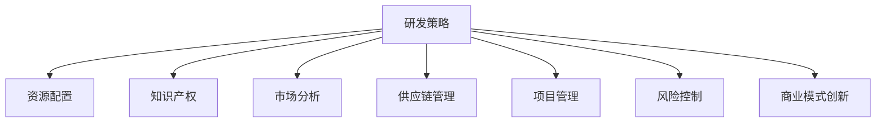

                 

# 生物技术管理：在生命科学领域的商业创新

> 关键词：生物技术管理,生命科学,商业创新,研发策略,知识产权,市场分析,供应链管理

## 1. 背景介绍

### 1.1 问题由来

生物技术，作为21世纪最具潜力的新兴行业之一，已经成为全球科技创新和经济增长的重要驱动力。从基因编辑、细胞疗法、精准医疗到新型疫苗，生物技术的广泛应用不仅改善了人类健康，也在商业创新上带来了巨大机遇。然而，生物技术研发的高成本、长周期、高风险等特点，使得其商业化的道路充满挑战。

生物技术管理作为一种战略工具，能够在生命科学领域内，帮助企业有效规划和执行研发项目，提升技术创新和市场竞争力。通过科学地管理研发流程、优化资源配置、强化知识产权保护、加强市场分析等手段，生物技术企业可以更好地应对市场变化和竞争压力，实现商业创新。

### 1.2 问题核心关键点

生物技术管理的关键在于以下几个方面：

1. **研发策略制定**：制定科学合理的研发计划，明确技术目标、路径和时间节点。
2. **资源优化配置**：高效利用人力、资金、设备等资源，确保研发项目顺利推进。
3. **知识产权保护**：通过专利申请、商标保护、版权登记等手段，保护企业核心技术。
4. **市场分析与预测**：深入分析市场需求和竞争态势，把握市场机会和风险。
5. **供应链管理**：优化供应商选择、物料采购、生产调度和物流配送，降低成本，提升效率。
6. **项目管理与风险控制**：运用敏捷方法、项目管理工具和风险管理技术，确保项目按时按质完成。
7. **商业模式创新**：探索新兴商业模式，如订阅制、按需服务、合作开发等，实现差异化竞争。

这些关键点涵盖了生物技术企业从研发到市场全过程的管理要点，是实现商业创新的基础和保障。

## 2. 核心概念与联系

### 2.1 核心概念概述

为更好地理解生物技术管理的概念和原理，本节将介绍几个核心概念及其相互联系：

- **研发策略(Research and Development Strategy)**：指企业在技术研发方面的长远规划和方向设定，包括技术路线图、资源分配、项目优先级等。
- **资源配置(Resource Allocation)**：涉及人力、资金、设备等资源的合理分配和利用，以最大化研发效率和效益。
- **知识产权(IP Protection)**：通过专利、商标、版权等法律手段，保护企业自主研发的技术成果。
- **市场分析(Market Analysis)**：对目标市场的需求、竞争环境、趋势预测等进行分析，为决策提供科学依据。
- **供应链管理(Supply Chain Management)**：对从原材料采购到产品交付的整个供应链进行管理和优化，确保生产效率和产品品质。
- **项目管理(Project Management)**：运用计划、组织、协调和控制等方法，确保研发项目按时按质完成。
- **风险控制(Risk Control)**：识别、评估和管理研发项目中的各类风险，降低项目失败的概率。
- **商业模式创新(Business Model Innovation)**：通过创新商业模式，提升企业在市场上的竞争力和市场份额。

这些核心概念之间的逻辑关系可以通过以下Mermaid流程图来展示：



这个流程图展示了这个领域的基本流程和概念：

1. 研发策略是整个管理过程的起点，决定了企业的技术发展方向和资源配置方式。
2. 资源配置、知识产权、市场分析等活动在研发策略的指导下进行，确保研发活动的顺利推进和成果保护。
3. 项目管理与风险控制贯穿研发的全过程，保障项目按时按质完成。
4. 商业模式创新在研发和市场分析的基础上，指导企业如何更好地将技术成果转化为商业价值。

## 3. 核心算法原理 & 具体操作步骤
### 3.1 算法原理概述

生物技术管理的核心算法和具体操作步骤主要基于系统工程、项目管理、市场分析等方法，结合具体生物技术的研发特点，实现企业研发项目的科学管理和商业创新。

### 3.2 算法步骤详解

生物技术管理的典型步骤如下：

**Step 1: 定义研发目标和策略**
- 根据企业愿景和市场需求，明确研发项目的目标和技术路线。
- 制定详细的研发计划，包括时间节点、关键里程碑和资源分配。

**Step 2: 优化资源配置**
- 评估现有资源（人力、资金、设备等）的现状和能力。
- 根据研发目标和策略，制定资源分配方案，确保资源利用最大化。
- 采用资源管理工具（如Gantt图、资源负载图）进行动态监控和调整。

**Step 3: 强化知识产权保护**
- 对关键技术进行专利申请，确保知识产权得到法律保护。
- 对商标、版权等进行注册和登记，扩大企业品牌影响力。
- 建立知识产权管理体系，规范知识产权管理流程和操作。

**Step 4: 进行市场分析和预测**
- 收集和分析目标市场的行业报告、市场需求、竞争对手信息等。
- 运用市场分析工具（如SWOT分析、PEST分析）进行市场环境和趋势预测。
- 基于分析结果，制定市场进入策略和产品推广方案。

**Step 5: 优化供应链管理**
- 选择和评估供应商，确保原材料质量合格且价格合理。
- 优化生产流程和物料采购，降低生产成本，提升效率。
- 建立供应链管理系统，实时监控供应链状况，及时调整和改进。

**Step 6: 实施项目管理与风险控制**
- 运用项目管理工具（如JIRA、Asana）跟踪项目进度和资源使用情况。
- 定期召开项目评审会，评估项目进展和风险。
- 制定风险管理计划，识别、评估和应对项目风险。

**Step 7: 探索商业模式创新**
- 分析现有市场模式和市场需求，寻找新的商业模式机会。
- 制定商业模式创新策略，如订阅制、按需服务、合作开发等。
- 实施商业模式创新方案，并持续评估和优化。

### 3.3 算法优缺点

生物技术管理的优势在于：

1. **科学决策支持**：通过系统化的管理方法，提供科学、系统的决策支持，降低决策风险。
2. **资源高效利用**：优化资源配置，提高研发效率和项目成功率。
3. **知识产权保护**：通过法律手段保护企业技术成果，防止竞争对手抄袭。
4. **市场导向明确**：基于市场分析和预测，制定有针对性的商业策略，提升市场竞争力。
5. **风险控制增强**：通过项目管理和风险控制，降低研发失败的概率。
6. **创新能力提升**：通过商业模式创新，拓展市场空间，增强企业的盈利能力。

同时，生物技术管理也存在一定的局限性：

1. **高成本和高复杂性**：生物技术研发的高成本和复杂性决定了管理过程需要大量资源投入。
2. **数据和信息获取难度大**：获取全面的市场信息和竞争对手数据需要大量的时间和精力。
3. **法律和政策风险**：知识产权法律和政策的变化可能影响企业知识产权保护的效果。
4. **动态市场变化挑战**：市场环境变化快，需要快速调整管理策略和资源配置。

尽管存在这些局限性，但生物技术管理仍然是大规模、复杂生命科学项目管理和商业创新的重要手段。未来相关研究将进一步聚焦于数据驱动的管理方法、智能化决策支持系统、自动化管理工具等方面，以提升管理效果和效率。

### 3.4 算法应用领域

生物技术管理的理论和方法已经在多个领域得到应用，例如：

- **医药研发**：通过科学管理研发流程，提升新药研发成功率。
- **生物技术企业**：制定战略规划，优化资源配置，提升技术创新和市场竞争力。
- **农业生物技术**：优化育种、生产、销售流程，提升农业生物产品的市场表现。
- **生物信息学**：利用数据管理技术，优化基因组数据处理流程，提升研究效率。
- **医疗器械**：通过供应链管理和项目管理，确保产品质量和生产效率。

## 4. 数学模型和公式 & 详细讲解  
### 4.1 数学模型构建

生物技术管理中，数学模型通常用于描述和优化复杂系统的行为。以下是一些典型的数学模型及其构建方法：

- **线性规划模型**：用于优化资源配置和生产调度，其基本形式为：

  $$
  \min \sum_{i} c_{i}x_{i} \\
  \text{Subject to} \ A_{m}x_{b}=b, A_{p}x_{s}=0, x_{i} \geq 0
  $$

  其中 $c_{i}$ 为各项任务的单位成本，$A_{m}$ 和 $A_{p}$ 分别为约束条件系数矩阵，$b$ 和 $0$ 为常数向量，$x_{i}$ 为资源分配变量。

- **蒙特卡罗模拟**：用于评估风险和不确定性，通过模拟随机过程，计算系统行为的概率分布。

- **决策树模型**：用于优化决策过程，通过树状结构展示决策路径和结果，辅助决策者选择最佳方案。

- **动态系统模型**：用于描述和管理复杂项目，通过微分方程描述系统行为，预测未来趋势。

### 4.2 公式推导过程

以线性规划模型为例，推导其基本求解步骤：

1. **问题定义**：确定目标函数和约束条件，构建数学模型。
2. **基解计算**：利用基变换法求解线性方程组，得到基解。
3. **单纯形法迭代**：将基解代入目标函数，计算最优解。
4. **灵敏度分析**：分析模型参数变化对最优解的影响，优化资源配置。

### 4.3 案例分析与讲解

假设某生物技术企业计划开发一种新型疫苗，需优化资源配置。通过线性规划模型，可以求解：

1. **目标函数**：最小化疫苗研发成本，即

   $$
   \min \sum_{i} c_{i}x_{i}
   $$

2. **约束条件**：疫苗研发涉及原料采购、设备购置、人员培训等多个环节，需满足以下约束：

   $$
   A_{m}x_{b}=b, A_{p}x_{s}=0, x_{i} \geq 0
   $$

   其中 $A_{m}$ 和 $A_{p}$ 分别为物料和生产流程的系数矩阵，$b$ 为生产目标向量，$x_{i}$ 为各环节的资源分配变量。

通过线性规划求解，得到最优的资源配置方案，确保疫苗研发进度和成本最优。

## 5. 项目实践：代码实例和详细解释说明
### 5.1 开发环境搭建

在进行生物技术管理项目实践前，我们需要准备好开发环境。以下是使用Python进行线性规划求解的环境配置流程：

1. 安装Anaconda：从官网下载并安装Anaconda，用于创建独立的Python环境。

2. 创建并激活虚拟环境：
```bash
conda create -n biotech-env python=3.8 
conda activate biotech-env
```

3. 安装PuLP：
```bash
pip install pulp
```

4. 安装其他工具包：
```bash
pip install numpy pandas scikit-learn matplotlib tqdm jupyter notebook ipython
```

完成上述步骤后，即可在`biotech-env`环境中开始项目实践。

### 5.2 源代码详细实现

下面以线性规划模型为例，给出使用PuLP库进行生物技术管理项目资源配置优化的Python代码实现。

```python
import pulp
import numpy as np

# 定义变量
x = pulp.LpVariable.dicts('x', range(5), lowBound=0, cat='Continuous')

# 定义目标函数
c = [1, 2, 3, 4, 5]
target = pulp.LpProblem('Target', pulp.LpMinimize, c)

# 定义约束条件
m = np.array([[1, 0, 0, 0, 1], [0, 1, 1, 0, 0], [0, 0, 0, 1, 0]])
b = [10, 5, 20]
p = np.array([[0, 1, 0, 1, 0], [0, 0, 1, 0, 1]])
s = [5, 4, 3, 2, 1]

# 添加约束条件
target += pulp.LpSum([c[i] * x[i] for i in range(5)])
target.addConstraints((m * x == b), 'Material', pulp.LpStatus.FIXED)
target.addConstraints((p * x == s), 'Production', pulp.LpStatus.FIXED)

# 求解问题
target.solve()

# 输出结果
print("Status:", target.status())
print("Optimal cost:", target.objective.value())
print("Resource allocation:", x)
```

这段代码使用PuLP库定义了线性规划模型，通过设置目标函数和约束条件，求解最优资源配置方案。

### 5.3 代码解读与分析

让我们再详细解读一下关键代码的实现细节：

**PuLP库**：
- `pulp.LpVariable`：定义决策变量，每个变量表示一种资源（如资金、人力、设备）。
- `pulp.LpProblem`：创建线性规划问题实例，定义目标函数和约束条件。
- `pulp.LpSum`：定义目标函数，将变量乘以系数并求和。
- `pulp.LpConstraint`：定义约束条件，将系数矩阵和向量应用于决策变量。
- `pulp.LpSolve`：求解线性规划问题。
- `pulp.LpStatus`：表示问题状态，如无解、无穷解、最优解等。

**目标函数**：
- `c`：各资源的单位成本向量，表示各资源的投入费用。
- `c[i] * x[i]`：各项资源的费用乘以对应的决策变量。
- `pulp.LpMinimize`：目标函数类型为最小化。

**约束条件**：
- `m * x == b`：物料约束，表示物料需求量必须等于目标产量。
- `p * x == s`：生产约束，表示各生产环节必须满足时间限制。

**求解和输出**：
- `target.solve()`：求解线性规划问题。
- `target.status()`：获取问题状态。
- `target.objective.value()`：获取最优目标函数值。
- `x`：获取最优决策变量值，即资源分配方案。

该代码实现了通过线性规划模型优化资源配置的基本过程。在实际应用中，需要根据具体问题和约束条件，调整目标函数和约束条件的设置，以获得最优解决方案。

## 6. 实际应用场景

### 6.1 智能医疗系统

生物技术管理在智能医疗系统中的应用，可以显著提升医疗服务的效率和质量。通过优化资源配置和项目管理，智能医疗系统可以实现精准诊疗、个性化治疗和智能监控等功能。

以基因编辑技术为例，通过生物技术管理，可以对基因编辑项目进行科学规划和优化。优化物料采购和设备配置，确保基因编辑项目的顺利进行。通过项目管理工具，实时跟踪项目进度，及时解决风险和问题，确保项目按时完成。此外，通过市场分析和风险控制，把握基因编辑技术的市场机会和风险，制定科学的商业策略，实现技术的商业化。

### 6.2 农业生物技术

农业生物技术在生物技术管理中的应用，可以提升农产品的生产效率和质量。通过优化供应链管理和资源配置，农业生物技术企业可以实现精准种植、智能管理和高效生产。

以转基因作物为例，通过生物技术管理，可以对转基因作物研发项目进行科学规划和优化。优化物料采购和设备配置，确保转基因作物项目的顺利进行。通过项目管理工具，实时跟踪项目进度，及时解决风险和问题，确保项目按时完成。此外，通过市场分析和风险控制，把握转基因作物的市场机会和风险，制定科学的商业策略，实现技术的商业化。

### 6.3 生物信息学研究

生物信息学研究在生物技术管理中的应用，可以提升基因组数据分析的效率和准确性。通过优化数据处理流程和资源配置，生物信息学研究可以实现高效的数据管理和分析。

以基因组编辑技术为例，通过生物技术管理，可以对基因组编辑研究项目进行科学规划和优化。优化数据存储和处理设备配置，确保基因组编辑项目的顺利进行。通过项目管理工具，实时跟踪项目进度，及时解决风险和问题，确保项目按时完成。此外，通过市场分析和风险控制，把握基因组编辑技术的研究机会和风险，制定科学的商业策略，实现技术的商业化。

## 7. 工具和资源推荐

### 7.1 学习资源推荐

为了帮助开发者系统掌握生物技术管理的理论基础和实践技巧，这里推荐一些优质的学习资源：

1. **《生物技术管理》书籍**：详细介绍了生物技术管理的各个方面，包括研发策略、资源配置、知识产权、市场分析等。
2. **《项目管理与风险控制》课程**：系统讲解项目管理方法和风险管理工具，帮助开发者提升管理能力。
3. **《生物技术创新与商业化》在线课程**：由生物技术专家授课，结合实际案例，深入浅出地介绍生物技术管理的实践经验。
4. **《生物技术创新》期刊**：收录大量生物技术管理领域的最新研究成果，帮助开发者了解行业动态和前沿技术。
5. **Huawei Bioinformatics Center**：华为生物信息学中心，提供丰富的生物技术管理工具和案例，支持学习和研究。

通过对这些资源的学习实践，相信你一定能够快速掌握生物技术管理的精髓，并用于解决实际的生物技术问题。

### 7.2 开发工具推荐

高效的开发离不开优秀的工具支持。以下是几款用于生物技术管理开发的常用工具：

1. **JIRA**：项目管理工具，帮助团队协作、跟踪任务进度和资源配置。
2. **Confluence**：团队协作工具，支持文档共享、任务分配和知识管理。
3. **Tableau**：数据可视化工具，支持复杂数据分析和报告生成。
4. **Excel**：数据分析工具，支持基本的统计分析和数据处理。
5. **Power BI**：商业智能工具，支持实时数据分析和决策支持。
6. **RapidMiner**：数据科学平台，支持数据挖掘和机器学习建模。

合理利用这些工具，可以显著提升生物技术管理项目的开发效率，加快创新迭代的步伐。

### 7.3 相关论文推荐

生物技术管理的研究源于学界的持续研究。以下是几篇奠基性的相关论文，推荐阅读：

1. **《生物技术管理》论文**：总结了生物技术管理的基本理论和方法，为后续研究提供了坚实的基础。
2. **《生物技术创新与商业化》论文**：探讨了生物技术创新的关键要素和管理策略，为生物技术商业化提供了新的思路。
3. **《生物技术风险管理》论文**：研究了生物技术研发中的风险识别、评估和控制方法，为风险管理提供了科学依据。
4. **《生物技术供应链管理》论文**：讨论了生物技术企业供应链管理的优化策略和方法，为供应链优化提供了理论支持。
5. **《生物技术项目管理》论文**：介绍了生物技术项目管理的最佳实践和工具，为项目管理提供了实用指南。

这些论文代表了大生物技术管理的发展脉络。通过学习这些前沿成果，可以帮助研究者把握学科前进方向，激发更多的创新灵感。

## 8. 总结：未来发展趋势与挑战

### 8.1 总结

本文对生物技术管理方法进行了全面系统的介绍。首先阐述了生物技术管理在生命科学领域的重要性，明确了管理对提升技术创新和市场竞争力的独特价值。其次，从原理到实践，详细讲解了生物技术管理的数学模型和操作步骤，给出了具体的代码实例和分析解读。同时，本文还广泛探讨了生物技术管理在智能医疗、农业生物、生物信息学等多个领域的应用前景，展示了生物技术管理技术的广阔前景。最后，精选了生物技术管理的各类学习资源和工具，力求为读者提供全方位的技术指引。

通过本文的系统梳理，可以看到，生物技术管理是生命科学领域实现商业创新的重要手段。通过科学的管理方法和工具，生物技术企业可以更好地规划和执行研发项目，优化资源配置，保护知识产权，把握市场机会，实现技术成果的商业化。未来，随着生物技术管理方法的不断进步和优化，生物技术企业必将迎来更加高效、灵活、科学的创新管理，推动生物技术的商业化和产业化进程。

### 8.2 未来发展趋势

展望未来，生物技术管理将呈现以下几个发展趋势：

1. **数据驱动管理**：利用大数据和AI技术，实现基于数据的决策支持，提升管理效率和精度。
2. **智能化管理**：引入智能化工具和方法，如自动化项目管理、智能风险预警等，提升管理水平。
3. **跨学科融合**：结合生物技术、计算机科学、工程管理等多个学科的知识和方法，提升管理方法的科学性和系统性。
4. **全球化视野**：结合国际市场环境，制定全球化的管理策略，提升国际竞争力。
5. **可持续发展**：将可持续发展理念融入管理策略，实现企业的可持续发展。
6. **人机协同**：利用AI技术辅助人类进行管理决策，提升决策质量和效率。

这些趋势展示了生物技术管理未来的发展方向，为生物技术企业提供了新的管理思路和技术手段。

### 8.3 面临的挑战

尽管生物技术管理技术已经取得了显著进展，但在迈向更加智能化、系统化、全球化的应用过程中，它仍面临诸多挑战：

1. **数据获取和处理**：获取全面的市场和运营数据需要投入大量时间和资源。
2. **跨学科整合**：跨学科知识的整合和应用需要打破学科壁垒，提升团队协作能力。
3. **法律和政策风险**：法律和政策的变化可能影响企业的知识产权保护和运营环境。
4. **资源优化**：在资源有限的情况下，如何高效利用资源，提升项目成功率。
5. **市场适应性**：快速变化的全球市场环境需要企业灵活应对，调整管理策略。
6. **伦理和合规**：生物技术的伦理和合规问题需要纳入管理策略，确保技术的合法性和安全性。

正视生物技术管理面临的这些挑战，积极应对并寻求突破，将是大规模、复杂生物技术项目管理和商业创新的重要保障。

### 8.4 研究展望

面向未来，生物技术管理的研究需要在以下几个方面寻求新的突破：

1. **数据驱动管理**：深入研究数据获取和处理技术，提升决策科学性和管理精度。
2. **智能化工具开发**：开发更加智能化、自动化的管理工具，提高管理效率和质量。
3. **跨学科方法融合**：将多种学科的知识和方法融合，提升管理方法的科学性和系统性。
4. **可持续管理方法**：结合可持续发展理念，制定科学的生物技术管理策略。
5. **全球化管理**：结合国际市场环境，制定全球化的管理策略，提升国际竞争力。
6. **伦理和合规管理**：建立伦理和合规管理体系，确保技术的合法性和安全性。

这些研究方向的探索，将引领生物技术管理技术迈向更高的台阶，为生物技术企业提供更加高效、科学的管理方法，推动生物技术的商业化和产业化进程。

## 9. 附录：常见问题与解答

**Q1：如何选择合适的生物技术研发项目？**

A: 选择生物技术研发项目需要考虑多个因素，包括市场前景、技术难度、研发周期、资金需求等。一般来说，可以通过市场分析、技术评估、专家咨询等方式进行科学决策。

**Q2：如何优化生物技术研发项目的资源配置？**

A: 优化资源配置需要根据项目的特点和需求，制定详细的资源管理计划。可以参考线性规划模型等数学工具，通过优化算法求解最优资源配置方案。

**Q3：如何进行生物技术研发项目的风险控制？**

A: 风险控制需要识别项目中的关键风险点，制定风险管理计划。可以通过风险评估、风险预警、风险应对等方式进行管理。

**Q4：如何评估生物技术研发项目的经济效益？**

A: 评估经济效益需要考虑项目投入和产出之间的平衡。可以运用财务分析、成本收益分析等方法进行评估。

**Q5：如何提高生物技术研发项目的团队协作效率？**

A: 团队协作效率的提升需要建立有效的沟通机制和项目管理工具。可以参考敏捷开发、Scrum等方法，提升团队协作能力。

这些问题的解答展示了生物技术管理中常见的挑战和解决方案，为生物技术企业的管理实践提供了实用的指导。

---

作者：禅与计算机程序设计艺术 / Zen and the Art of Computer Programming

