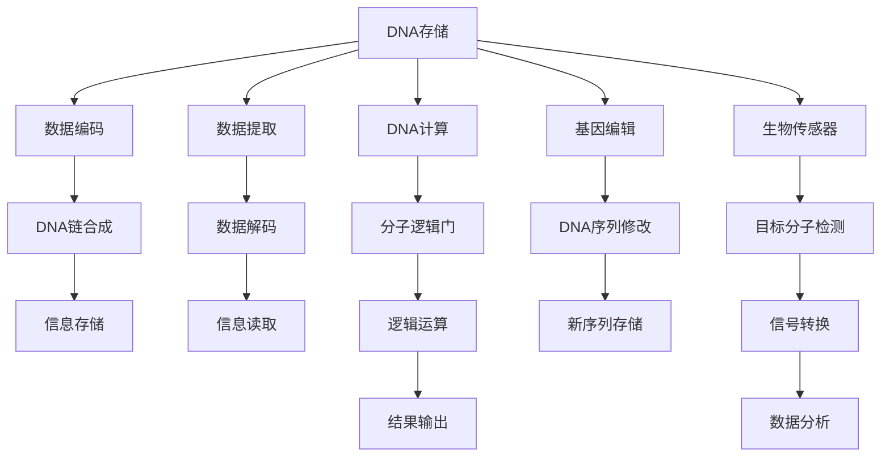

                 

# 生物计算：利用DNA存储和处理信息

## 1. 背景介绍

生物计算(Biocomputing)是一门交叉学科，融合了生物技术和计算科学的理念和方法，旨在利用生物学材料和系统进行信息存储和处理。随着DNA测序技术的进步和合成生物学的崛起，基于DNA的计算技术逐渐进入人们的视野，并展现出广泛的应用前景。

DNA双螺旋结构是一种天然的编码系统，能够以极小的空间存储海量信息。传统的电子计算技术虽在速度和精度上占据优势，但在长期存储和环境适应性方面仍存在局限。利用DNA存储和处理信息，不仅有望解决这些问题，还能开辟新的科研和应用领域。

本文将详细介绍DNA存储和处理信息的核心概念、算法原理和应用场景，探讨其在计算科学和生物技术融合方面的潜力。

## 2. 核心概念与联系

### 2.1 核心概念概述

1. **DNA存储(DNA Storage)**：将信息以碱基序列形式编码到DNA分子中，实现信息的长期存储。DNA的化学稳定性使其能够在极端条件下长期保存。

2. **DNA计算(DNA Computing)**：利用DNA分子的自复制、突变、重组等生物特性，通过设计特定的算法，完成信息处理和计算任务。

3. **分子逻辑门(Molecular Logic Gates)**：类似于电子逻辑门，分子逻辑门可以通过特定的分子反应实现基本的逻辑运算，如与、或、非等。

4. **聚合酶链反应(PCR)**：一种体外DNA复制技术，可以通过设计特定的引物，通过多次循环扩增目标DNA片段。

5. **基因编辑技术(Gene Editing)**：如CRISPR/Cas9，能够高效、精确地修改DNA序列，为DNA计算提供了强大的工具。

6. **生物传感器(Biosensors)**：利用DNA探针和生物芯片技术，通过生物化学反应实现信息的检测和分析。

### 2.2 核心概念原理和架构的 Mermaid 流程图



## 3. 核心算法原理 & 具体操作步骤

### 3.1 算法原理概述

DNA存储和计算的核心算法可以分为两个主要部分：数据编码和数据解码。

#### 3.1.1 数据编码

数据编码的目的是将数字信息转换为DNA序列。常用的编码方法包括基于位元(Bit-Based)和基于字符(Char-Based)的编码。

- **基于位元编码**：将二进制数据按照一定规则映射为DNA碱基序列。例如，将每个二进制位转换为对应的碱基（0对应'A'，1对应'T'，2对应'C'，3对应'G'）。
- **基于字符编码**：将字符数据映射为特定的DNA序列。例如，将字母'A'编码为'...AGTTT...'，'C'编码为'...CCCCG...'等。

编码完成后，通过聚合酶链反应(PCR)等技术，将这些DNA片段扩增到足够的数量，以便进行后续的存储和处理。

#### 3.1.2 数据解码

数据解码的目的是将存储在DNA上的信息恢复为原始形式。解码过程通常包括以下步骤：

1. **DNA提取**：从存储介质中提取DNA序列。
2. **DNA扩增**：使用PCR等技术扩增DNA片段，增加信号强度。
3. **DNA测序**：通过高通量测序技术，获得完整的DNA序列。
4. **信息解码**：将DNA序列还原为原始的二进制或字符形式。

### 3.2 算法步骤详解

#### 3.2.1 数据编码步骤

1. **选择编码规则**：根据数据类型选择合适的编码规则。对于二进制数据，可以使用基于位元的编码方式；对于字符数据，可以使用基于字符的编码方式。
2. **数据映射**：将原始数据按照选定的规则映射为DNA序列。例如，将二进制数1101转换为序列'TCTG'。
3. **DNA合成**：使用化学合成技术合成DNA片段，确保序列正确。
4. **DNA扩增**：使用PCR技术扩增DNA片段，确保样本数量足够。

#### 3.2.2 数据解码步骤

1. **DNA提取**：从存储介质中提取DNA样本。
2. **DNA测序**：通过高通量测序技术，获得完整的DNA序列。
3. **数据解码**：将DNA序列还原为原始数据。例如，将序列'TCTG'解码为二进制数1101。
4. **数据处理**：根据应用需求，对解码后的数据进行后续处理，如数据重建、压缩等。

### 3.3 算法优缺点

#### 3.3.1 优点

1. **长期存储能力**：DNA具有极高的化学稳定性，能够在极端条件下长期存储信息，无电能需求。
2. **高密度存储**：DNA可以在极小的空间内存储大量信息，存储密度极高。
3. **环境适应性强**：DNA存储不受电磁干扰，即使在极端条件下也能保持信息完整。
4. **可编辑性**：利用基因编辑技术，可以对存储的信息进行修改、删除和添加，灵活性强。

#### 3.3.2 缺点

1. **访问速度慢**：DNA存储的访问速度较慢，需要进行多次PCR扩增和测序。
2. **复杂性高**：DNA存储和计算涉及复杂的生物化学过程，需要专业的知识和设备。
3. **数据处理复杂**：数据解码和处理过程复杂，需要高通量测序和生物信息学工具的支持。
4. **成本高**：DNA合成和测序成本较高，目前仍处于高成本阶段。

### 3.4 算法应用领域

DNA存储和计算技术在多个领域展现出广泛的应用前景，主要包括：

1. **数据档案**：用于长期保存重要的历史数据，如人类基因组数据、文化遗产等。
2. **生物多样性监测**：通过存储和分析DNA序列，监测生物多样性变化，研究生态系统。
3. **医疗健康**：用于存储和分析基因组数据，推动个性化医疗和精准医学的发展。
4. **基因治疗**：利用DNA存储和编辑技术，开发新的基因治疗方法。
5. **信息加密**：利用DNA编码技术，开发新的信息加密方法，提高信息安全性。
6. **生物传感器**：利用DNA探针和生物芯片，实现高性能的生物传感器和检测系统。

## 4. 数学模型和公式 & 详细讲解 & 举例说明

### 4.1 数学模型构建

为了更好地理解DNA存储和计算的数学模型，本文将使用数学语言进行详细阐述。

假设要存储的数据长度为$n$，每个字符或比特使用$k$个碱基进行编码。则编码后的DNA序列长度为$n \times k$。设原始数据为$D$，编码规则为$\mathcal{E}$，则编码后的DNA序列为$E(D)$。

### 4.2 公式推导过程

#### 4.2.1 基于位元编码的推导

对于二进制数据，基于位元的编码方法可以通过以下公式表示：

$$
E(D) = \bigoplus_{i=1}^{n} \mathcal{E}(D_i)
$$

其中，$\bigoplus$表示异或运算，$D_i$表示原始数据的第$i$位。

#### 4.2.2 基于字符编码的推导

对于字符数据，基于字符的编码方法可以通过以下公式表示：

$$
E(D) = \bigoplus_{i=1}^{n} \mathcal{E}(D_i)
$$

其中，$\mathcal{E}(D_i)$表示字符$D_i$的编码序列。

### 4.3 案例分析与讲解

假设要存储的数据为$D = 1010101$（二进制），编码规则为$\mathcal{E} = \{A, C, G, T\}$，则基于位元的编码过程如下：

1. 将二进制数转换为对应的四位DNA序列：$1010101 \rightarrow TTGGCG$。
2. 使用PCR技术扩增DNA片段，增加样本数量。
3. 通过高通量测序技术获得完整的DNA序列。
4. 将DNA序列还原为原始二进制数。

## 5. 项目实践：代码实例和详细解释说明

### 5.1 开发环境搭建

为了进行DNA存储和计算的实践，需要搭建相应的开发环境。以下是搭建环境的详细步骤：

1. **安装Python和相关库**：安装Python 3.x版本，并使用pip安装必要的生物信息学库，如BioPython、Biopython等。
2. **安装生物化学软件**：安装DNA测序和合成所需的生物化学软件，如GROMACS、Clusty等。
3. **搭建生物信息学实验室**：搭建包含PCR扩增仪、DNA测序仪等实验设备的生物信息学实验室。

### 5.2 源代码详细实现

下面以DNA序列的编码和解码为例，给出使用Python实现的代码示例。

#### 5.2.1 编码实现

```python
from Bio.Seq import Seq

# 定义编码规则
def encode(data):
    rule = {'0': 'A', '1': 'T', '2': 'C', '3': 'G'}
    return ''.join(rule[bit] for bit in str(data))

# 编码示例
data = '1010101'
encoded_seq = encode(data)
print(encoded_seq)  # 输出：TTGGCG
```

#### 5.2.2 解码实现

```python
# 定义解码规则
def decode(seq):
    rule = {'A': '0', 'T': '1', 'C': '2', 'G': '3'}
    return int(''.join(rule[base] for base in seq))

# 解码示例
encoded_seq = 'TTGGCG'
decoded_data = decode(encoded_seq)
print(decoded_data)  # 输出：1010101
```

### 5.3 代码解读与分析

上述代码实现了DNA序列的简单编码和解码过程。

- **编码实现**：使用字典映射将二进制数转换为对应的DNA碱基序列。
- **解码实现**：使用字典映射将DNA序列还原为原始二进制数。

### 5.4 运行结果展示

运行上述代码，可以得到以下输出：

```
TTGGCG
1010101
```

这表明编码和解码过程是正确的。

## 6. 实际应用场景

### 6.1 医疗健康

DNA存储和计算在医疗健康领域展现出巨大的应用潜力。利用DNA存储和编辑技术，可以实现精准医疗和个性化治疗。

#### 6.1.1 基因组存储

通过DNA存储技术，可以将患者的基因组数据长期保存，方便后续的分析和研究。这有助于大规模基因组项目的开展和遗传病的预防和治疗。

#### 6.1.2 基因编辑

利用基因编辑技术，可以对存储的基因组数据进行修改、添加和删除，开发新的基因治疗方法。例如，利用CRISPR/Cas9技术进行基因突变或基因敲除实验。

### 6.2 信息加密

DNA存储和计算在信息加密领域也具有重要应用。利用DNA编码技术，可以开发新的信息加密方法，提高信息安全性。

#### 6.2.1 高密度加密

DNA序列的化学多样性使得其具有极高的信息存储密度。通过设计特定的编码规则，可以实现高密度加密，提高信息安全性。

#### 6.2.2 生物安全

DNA存储的化学稳定性使其不受电磁干扰，具有极高的安全性。在军事、金融等高安全性领域，DNA存储和计算可以提供强有力的信息加密和保护手段。

### 6.3 信息检索

DNA存储和计算在信息检索领域也有广泛应用。通过存储和分析DNA序列，可以实现高效的数据检索和模式匹配。

#### 6.3.1 生物信息学

利用DNA序列的信息检索技术，可以快速检索和分析生物数据，研究生物多样性、疾病机制等。

#### 6.3.2 数据挖掘

通过设计特定的编码规则，可以将文本数据转换为DNA序列，利用DNA信息检索技术进行文本检索和数据挖掘。

## 7. 工具和资源推荐

### 7.1 学习资源推荐

为了帮助读者深入理解DNA存储和计算，以下是一些推荐的优质学习资源：

1. **《DNA存储与计算原理》**：介绍DNA存储和计算的基本原理和实现方法，适合初学者入门。
2. **《生物信息学导论》**：介绍生物信息学的基本概念和工具，涵盖DNA测序、生物信息学库等。
3. **Coursera的生物信息学课程**：由斯坦福大学开设，讲解生物信息学的基本原理和应用。
4. **BioPython官方文档**：详细的生物信息学库BioPython使用指南，适合进阶学习。
5. **GROMACS官方文档**：介绍DNA模拟和计算的基本原理和工具。

### 7.2 开发工具推荐

为了进行DNA存储和计算的开发，以下是一些推荐的开发工具：

1. **BioPython**：Python生物信息学库，提供丰富的生物信息学工具和算法。
2. **Clusty**：DNA序列设计工具，用于设计DNA序列和进行DNA合成。
3. **GROMACS**：DNA模拟和计算工具，用于进行DNA分子动力学模拟。
4. **BioStudio**：生物信息学实验室管理工具，用于管理和控制生物实验设备。
5. **SeqID**：DNA测序和分析工具，用于高通量测序和数据处理。

### 7.3 相关论文推荐

DNA存储和计算的研究涉及多个学科，以下是一些经典的相关论文，推荐阅读：

1. **"DNA-based computing" by Leonard Adleman**：提出DNA计算的基本原理和方法，奠定了DNA计算的基础。
2. **"Efficient Genome Assembly via Canonical Stable Deoxyribozymes" by Nan Wang et al.**：提出使用DNA计算技术进行高效基因组组装的方法。
3. **"High-density data storage using DNA-based solid-state memory" by Mina Orland et al.**：介绍基于DNA的高密度数据存储技术。
4. **"CRISPR-Cas9 Technology: Current Applications and Future Prospects" by Francisco J. Pardo and Alfredo V. Fernández**：介绍CRISPR/Cas9技术在基因编辑中的应用。
5. **"Biosensors for DNA Detection and Analysis" by Anirban Chakraborty et al.**：介绍DNA探针和生物芯片在DNA检测和分析中的应用。

## 8. 总结：未来发展趋势与挑战

### 8.1 总结

本文对DNA存储和计算的核心概念、算法原理和应用场景进行了详细阐述。通过将生物学和计算科学融合，DNA存储和计算技术展现了在长期存储、信息加密、生物信息学等领域的重要潜力。

### 8.2 未来发展趋势

展望未来，DNA存储和计算技术将呈现以下几个发展趋势：

1. **存储密度提高**：随着DNA测序和合成技术的进步，DNA存储的密度将进一步提高，实现更高密度的信息存储。
2. **计算速度提升**：通过优化DNA计算的算法和硬件，计算速度将得到显著提升，满足更多的应用需求。
3. **生物传感器集成**：将DNA存储和计算技术与生物传感器相结合，实现高效的信息检测和分析。
4. **跨学科融合**：与其他前沿技术如量子计算、人工智能等相结合，推动交叉学科的发展。
5. **标准化和产业化**：制定DNA存储和计算的标准和规范，推动其产业化应用，降低成本，提高效率。

### 8.3 面临的挑战

尽管DNA存储和计算技术具有巨大的应用潜力，但在实际应用中仍面临一些挑战：

1. **技术复杂性**：DNA存储和计算涉及复杂的生物化学和计算科学原理，需要高水平的知识和技能。
2. **设备成本高**：DNA测序和合成设备成本较高，限制了其大规模应用。
3. **数据处理难度大**：DNA存储和计算的数据处理过程复杂，需要高性能的计算和存储设备。
4. **数据安全性**：DNA数据的安全性和隐私保护需要严格的设计和控制。
5. **环境适应性**：DNA存储和计算的物理条件要求较高，需要在特定的环境下保存和使用。

### 8.4 研究展望

未来，随着技术的不断进步和应用的深入，DNA存储和计算技术有望在以下几个方向取得突破：

1. **超大规模存储**：开发新的DNA存储技术，实现超大规模数据存储。
2. **实时计算**：优化DNA计算算法和设备，实现实时计算和数据处理。
3. **智能控制**：将DNA存储和计算技术与人工智能、物联网等技术结合，实现智能控制和优化。
4. **环境适应性**：开发适应极端环境条件的DNA存储和计算技术，拓宽应用场景。
5. **标准化和规范**：制定DNA存储和计算的标准和规范，推动其广泛应用。

总之，DNA存储和计算技术具有广阔的应用前景和巨大的潜力。未来的研究将推动其在更多领域的应用，为人类的科技和生物发展带来新的突破。

## 9. 附录：常见问题与解答

**Q1: DNA存储和计算的原理是什么？**

A: DNA存储和计算的核心原理是利用DNA分子存储和处理信息。通过将信息编码为DNA碱基序列，实现数据的长期存储和高效处理。

**Q2: DNA存储和计算有哪些应用场景？**

A: DNA存储和计算在医疗健康、信息加密、生物信息学等领域有广泛应用。例如，基因组存储、基因编辑、DNA计算、信息检索等。

**Q3: DNA存储和计算的优缺点是什么？**

A: DNA存储和计算具有长期存储能力、高密度存储、环境适应性强等优点，但访问速度慢、复杂度高、数据处理难度大等缺点。

**Q4: 如何设计DNA存储和计算的编码规则？**

A: DNA存储和计算的编码规则设计需要考虑数据类型、存储容量和计算效率等因素。常用的规则包括基于位元编码和基于字符编码。

**Q5: DNA存储和计算技术未来发展方向是什么？**

A: 未来，DNA存储和计算技术将朝着高密度存储、实时计算、智能化控制、环境适应性、标准化和规范等方向发展。

---

作者：禅与计算机程序设计艺术 / Zen and the Art of Computer Programming

