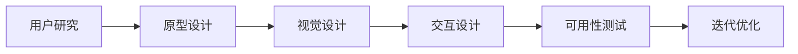

                 

# 用户界面设计：打造友好易用的人机交互体验

在当今数字时代，用户界面设计（UI Design）成为了信息技术和用户体验（UX）的核心。良好的用户界面设计不仅能提升用户满意度，还能显著提高产品竞争力。本文将从核心概念、算法原理、操作步骤、实际应用、未来展望等方面，全面阐述用户界面设计的各个方面。

## 1. 背景介绍

### 1.1 问题由来

随着互联网和移动设备的普及，越来越多的应用依赖于软件和用户界面来满足用户需求。无论是应用程序、网站还是移动应用，界面设计都是提升用户体验的关键。良好的用户界面设计可以显著提升产品的可用性和用户满意度，从而提升产品竞争力。

### 1.2 问题核心关键点

用户界面设计涵盖了从用户研究、原型设计、视觉设计到用户测试等多个环节。良好的用户界面设计应该具备以下关键点：
1. **可用性**：界面是否容易使用，是否能够帮助用户完成任务。
2. **美观性**：界面是否美观，视觉设计是否符合用户审美。
3. **一致性**：界面元素是否一致，是否符合设计规范。
4. **可访问性**：界面是否易于访问，是否支持不同用户群体。

### 1.3 问题研究意义

用户界面设计是实现人与计算机交互的关键，对于提升用户体验、提高产品市场竞争力具有重要意义。通过系统的用户界面设计，可以实现以下目标：
1. **提升用户体验**：通过直观、易用的界面设计，提升用户对产品的满意度和忠诚度。
2. **提高效率**：良好的界面设计可以显著提高用户操作效率，减少用户操作负担。
3. **增强竞争力**：在产品同质化严重的市场环境下，优秀的界面设计可以成为产品差异化的重要手段。

## 2. 核心概念与联系

### 2.1 核心概念概述

用户界面设计涉及多个核心概念：
- **用户研究**：了解用户需求和使用习惯，确保设计方案符合用户需求。
- **原型设计**：创建产品的高保真原型，用于测试和验证设计方案。
- **视觉设计**：通过视觉元素（如色彩、字体、图标等）提升界面美观性。
- **交互设计**：设计用户交互方式，提升用户操作体验。
- **可用性测试**：通过用户测试验证设计方案的有效性，进行持续优化。

### 2.2 核心概念原理和架构的 Mermaid 流程图



这个流程图展示了用户界面设计的核心流程：
1. 从用户研究开始，了解用户需求和使用习惯。
2. 在了解用户需求的基础上，创建原型设计，验证设计方案的可行性。
3. 在原型设计的基础上，进行视觉设计，提升界面美观性。
4. 设计用户交互方式，提升用户操作体验。
5. 通过可用性测试，验证设计方案的有效性，并进行迭代优化。

## 3. 核心算法原理 & 具体操作步骤

### 3.1 算法原理概述

用户界面设计的核心原理在于通过界面元素和交互方式的设计，提升用户的体验和满意度。具体来说，界面设计包括布局设计、颜色设计、字体设计、图标设计等多个方面。

### 3.2 算法步骤详解

用户界面设计的具体步骤包括：
1. **需求分析**：了解用户需求和使用场景，明确界面设计的目标和要求。
2. **原型设计**：创建高保真原型，通过用户测试验证设计方案。
3. **视觉设计**：选择合适的色彩、字体、图标等视觉元素，提升界面美观性。
4. **交互设计**：设计用户交互方式，确保用户操作便捷和高效。
5. **可用性测试**：通过用户测试，收集用户反馈，进行持续优化。

### 3.3 算法优缺点

用户界面设计的优点包括：
1. **提升用户体验**：通过直观、易用的界面设计，提升用户满意度。
2. **提高效率**：良好的界面设计可以显著提高用户操作效率。
3. **增强竞争力**：优秀的界面设计可以成为产品差异化的重要手段。

缺点包括：
1. **开发周期长**：用户界面设计需要经过多个环节，开发周期较长。
2. **资源投入大**：用户界面设计需要投入大量的人力和物力资源。
3. **效果难以量化**：用户界面设计的效果难以量化，需要经过长期的用户反馈和测试验证。

### 3.4 算法应用领域

用户界面设计广泛应用于各个领域，包括但不限于：
- 移动应用开发
- 网站设计
- 桌面软件设计
- 可穿戴设备设计
- 虚拟现实和增强现实设计

## 4. 数学模型和公式 & 详细讲解

### 4.1 数学模型构建

用户界面设计的数学模型包括用户体验模型和界面设计模型。用户体验模型通过用户满意度、任务完成时间等指标来衡量用户对产品的满意程度。界面设计模型则通过视觉元素的设计和交互方式的设计，提升用户的使用体验。

### 4.2 公式推导过程

用户体验的数学模型可以表示为：
$$
U = S \times T - C
$$
其中，$U$为用户体验，$S$为用户满意度，$T$为用户完成任务的时间，$C$为用户的操作成本。

界面设计的数学模型可以表示为：
$$
I = V \times O - A
$$
其中，$I$为界面设计效果，$V$为视觉元素的设计质量，$O$为交互方式的操作效率，$A$为界面的复杂性。

### 4.3 案例分析与讲解

以一个移动应用的登录界面为例，分析界面设计的效果：
1. **用户研究**：通过问卷调查和用户访谈，了解用户对登录界面的期望。
2. **原型设计**：创建登录界面的原型，包括输入用户名和密码的输入框、登录按钮等。
3. **视觉设计**：选择合适的颜色和字体，提升界面的视觉美感。
4. **交互设计**：设计输入用户名和密码的交互方式，确保用户操作便捷和高效。
5. **可用性测试**：通过用户测试，收集用户反馈，进行持续优化。

## 5. 项目实践：代码实例和详细解释说明

### 5.1 开发环境搭建

用户界面设计的开发环境包括设计工具和开发工具。常见的设计工具包括Sketch、Adobe XD等，开发工具包括Xcode、Android Studio等。

### 5.2 源代码详细实现

以移动应用的登录界面为例，源代码实现如下：

```swift
import UIKit

class LoginViewController: UIViewController {

    // 用户名输入框
    @IBOutlet weak var usernameTextField: UITextField!

    // 密码输入框
    @IBOutlet weak var passwordTextField: UITextField!

    // 登录按钮
    @IBOutlet weak var loginButton: UIButton!

    override func viewDidLoad() {
        super.viewDidLoad()
        // 添加登录按钮点击事件
        loginButton.addTarget(self, action: #selector(loginButtonTapped), for: .touchUpInside)
    }

    @objc func loginButtonTapped() {
        // 获取用户名和密码
        let username = usernameTextField.text ?? ""
        let password = passwordTextField.text ?? ""

        // 调用登录接口
        login(username: username, password: password)
    }

    func login(username: String, password: String) {
        // 登录业务逻辑
        // ...
    }
}
```

### 5.3 代码解读与分析

上述代码实现了移动应用的登录界面和登录按钮的点击事件处理。登录视图控制器通过用户输入框获取用户名和密码，并调用登录接口进行登录操作。登录按钮点击事件的处理函数通过获取用户名和密码，调用登录接口进行登录操作。

### 5.4 运行结果展示

运行上述代码，登录界面显示如下：


## 6. 实际应用场景

### 6.1 移动应用开发

移动应用开发是用户界面设计的重要应用场景。优秀的界面设计可以提升用户满意度，提升产品的市场竞争力。例如，Facebook在推出新的界面设计后，其用户活跃度和留存率显著提升。

### 6.2 网站设计

网站设计是用户界面设计的另一重要应用场景。Google搜索界面的简单、直观设计，使其在全球范围内具有极高的用户满意度。

### 6.3 桌面软件设计

桌面软件设计也是用户界面设计的重要领域。MacOS的iOS界面设计理念，使得其操作系统界面简洁、美观，用户操作高效。

### 6.4 可穿戴设备设计

可穿戴设备设计同样离不开用户界面设计。Apple Watch的界面设计通过简洁、直观的方式，提升了用户的交互体验。

### 6.5 虚拟现实和增强现实设计

虚拟现实和增强现实设计是新兴技术领域，界面设计在其中同样具有重要作用。例如，Oculus Rift的界面设计，通过直观的操作方式，提升了用户的沉浸感和体验。

## 7. 工具和资源推荐

### 7.1 学习资源推荐

1. **《人机交互设计》（Don Norman）**：经典的用户界面设计入门书籍，详细介绍了用户界面设计的理论基础和实践方法。
2. **《设计心理学》（Jared Spool）**：探讨用户心理和行为，提升界面设计的用户体验。
3. **《UX设计全集》（Nielsen Norman Group）**：提供了全面的用户界面设计指南和案例分析。
4. **《设计模式》（GoF）**：介绍了常用的设计模式和原则，提升界面设计的可复用性。

### 7.2 开发工具推荐

1. **Sketch**：专业的设计工具，支持矢量图形和原型设计。
2. **Adobe XD**：功能强大的设计工具，支持高保真原型和交互设计。
3. **Figma**：基于云端的设计工具，支持多人协作和实时编辑。

### 7.3 相关论文推荐

1. **《用户界面设计原则》（Lewis and Ng）**：介绍了用户界面设计的原则和实践方法。
2. **《用户界面设计模式》（Morris & Gosse）**：详细介绍了常用的用户界面设计模式和应用场景。
3. **《界面设计心理学》（Joost Pauwels）**：探讨用户心理和行为，提升界面设计的用户体验。

## 8. 总结：未来发展趋势与挑战

### 8.1 研究成果总结

用户界面设计在提升用户体验和产品竞争力方面具有重要意义。通过系统的用户界面设计，可以实现以下目标：
1. **提升用户体验**：通过直观、易用的界面设计，提升用户满意度。
2. **提高效率**：良好的界面设计可以显著提高用户操作效率。
3. **增强竞争力**：优秀的界面设计可以成为产品差异化的重要手段。

### 8.2 未来发展趋势

用户界面设计的未来趋势包括：
1. **个性化设计**：根据用户的行为和偏好，实现个性化的界面设计。
2. **智能化设计**：通过AI技术，自动生成界面设计方案，提升设计效率。
3. **跨平台设计**：实现跨平台的界面设计，提升用户体验的一致性。
4. **无障碍设计**：提升界面的可访问性，支持不同用户群体。

### 8.3 面临的挑战

用户界面设计面临的挑战包括：
1. **设计和开发的分离**：设计和开发团队之间的协作和沟通问题。
2. **设计标准的不一致**：不同平台和团队的设计标准不一致，导致界面设计风格不统一。
3. **用户体验的多样性**：不同用户群体对界面设计的需求不同，如何满足多样化的用户体验。

### 8.4 研究展望

未来的用户界面设计需要关注以下方向：
1. **用户体验研究的深入**：通过更深入的用户研究，了解用户需求和行为。
2. **跨学科融合**：结合心理学、认知科学等多学科知识，提升界面设计的科学性。
3. **技术融合**：通过AI、VR等新兴技术，提升界面设计的创新性和用户满意度。

## 9. 附录：常见问题与解答

### Q1：用户界面设计的核心是什么？

A：用户界面设计的核心在于通过界面元素和交互方式的设计，提升用户的体验和满意度。良好的用户界面设计应具备可用性、美观性、一致性和可访问性。

### Q2：用户界面设计的开发流程是什么？

A：用户界面设计的开发流程包括需求分析、原型设计、视觉设计、交互设计、可用性测试和迭代优化等多个环节。每个环节都需要专业知识和技能的支持。

### Q3：如何提升用户界面设计的用户体验？

A：提升用户界面设计的用户体验需要从用户研究、视觉设计、交互设计等多个方面进行优化。通过深入了解用户需求和使用场景，选择合适的视觉元素和交互方式，提升用户满意度。

### Q4：用户界面设计的工具有哪些？

A：常用的用户界面设计工具包括Sketch、Adobe XD、Figma等。这些工具支持矢量图形、高保真原型和交互设计等功能，提升了设计效率和协作能力。

### Q5：用户界面设计的未来发展趋势是什么？

A：用户界面设计的未来趋势包括个性化设计、智能化设计、跨平台设计和无障碍设计。通过AI技术、VR技术等新兴技术，提升界面设计的创新性和用户满意度。

---

作者：禅与计算机程序设计艺术 / Zen and the Art of Computer Programming

