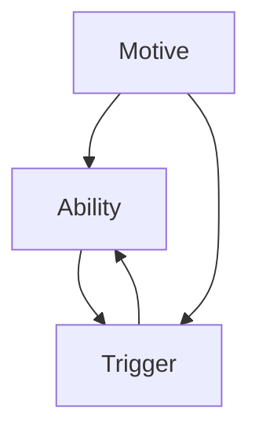

                 

# 用福格模型设计团队行为

> 关键词：行为设计, 福格模型, 行为科学, 团队管理, 目标设定, 激励机制, 改变策略

## 1. 背景介绍

### 1.1 问题由来
在当今快速变化和竞争激烈的商业环境中，企业如何有效地管理团队，驱动员工实现目标，成为领导者面临的重大挑战。传统的管理方法往往侧重于自上而下的控制和监督，但这种模式在现代知识型团队中存在诸多局限。员工往往追求自我实现，对外部指令的接受度较低。因此，如何从员工的动机出发，设计出能够激发他们内在动力和潜力的管理方法，变得至关重要。

### 1.2 问题核心关键点
行为设计（Behavioral Design）是基于行为科学原理，通过合理设计环境、系统或流程，激发人的行为改变的技术。福格模型（Fogg Model）是行为设计中的一种有效工具，通过分析用户的动机、能力、触发器三者之间的关系，帮助设计出易于执行的行为。福格模型在团队管理中的应用，可以帮助领导者设计出能够引导团队成员积极参与、实现组织目标的行为系统。

## 2. 核心概念与联系

### 2.1 核心概念概述

为了更好地理解如何使用福格模型设计团队行为，本节将介绍几个关键概念：

- **行为设计**：通过改变环境或系统设计，引导人们产生期望行为的技术。
- **福格模型**：行为学专家B.J.福格（B.J. Fogg）提出的一种行为设计理论模型，包括三个要素：动机（Motive）、能力（Ability）、触发器（Triggers）。
- **动机（Motive）**：指个体完成某个行为的愿望和驱动力。
- **能力（Ability）**：指个体执行某个行为所需要的时间、能量、资源等。
- **触发器（Triggers）**：指促使个体产生某个行为的刺激因素，可以是外部刺激或内部信号。

这些核心概念之间的关系可以通过以下Mermaid流程图来展示：



这个流程图展示了动机、能力和触发器三者之间的互动关系：动机驱动能力，触发器启动行为。通过对这三个要素的巧妙设计，可以实现对个体行为的有效引导。

## 3. 核心算法原理 & 具体操作步骤
### 3.1 算法原理概述

福格模型在团队行为设计中的应用，主要基于以下算法原理：

1. **动机分析**：了解团队成员的内在需求和驱动因素，设计出能够激发其动机的环境和激励机制。
2. **能力评估**：评估团队成员执行特定任务的能力，通过优化流程、提供工具等手段，降低行为执行的难度和成本。
3. **触发器设计**：设计合理的触发机制，如定时提醒、奖励机制等，促使团队成员在合适的时间点执行任务。

### 3.2 算法步骤详解

福格模型在团队行为设计中的应用，通常包括以下几个关键步骤：

**Step 1: 确定目标**
- 明确组织需要团队成员实现的具体目标，如提高项目进度、增强团队协作、提升创新能力等。

**Step 2: 分析动机**
- 调查团队成员的动机来源，如成就动机、归属感需求、自我实现等。
- 设计能够激发这些动机的激励机制，如个人奖励、团队荣誉、职业发展机会等。

**Step 3: 评估能力**
- 评估团队成员执行目标所需的能力，包括技术技能、时间管理、资源获取等。
- 根据评估结果，优化流程、分配资源、提供培训等，降低行为执行的难度和成本。

**Step 4: 设计触发器**
- 设计合理的触发机制，如时间提醒、环境变化、团队活动等，促使团队成员在合适的时间点执行任务。
- 考虑触发器的多样性和频繁性，以确保行为的及时执行。

**Step 5: 监控和反馈**
- 建立反馈机制，及时获取团队成员的执行情况和反馈意见。
- 根据反馈调整动机、能力和触发器设计，持续优化行为设计效果。

### 3.3 算法优缺点

福格模型在团队行为设计中的应用具有以下优点：
1. **系统性**：通过全面分析动机、能力和触发器，设计出综合性的行为策略，提升行为执行的效率和效果。
2. **灵活性**：可以根据实际情况灵活调整和优化设计，适应不同的团队和工作场景。
3. **普适性**：适用于各种规模和类型的团队，具有广泛的应用前景。

同时，该模型也存在一些局限性：
1. **复杂度**：设计过程中需要综合考虑多个因素，复杂度较高，需要较高的专业水平。
2. **动态性**：团队成员的动机、能力可能随时间变化，需要持续监控和调整。
3. **主观性**：动机和能力评估可能受到主观因素影响，存在一定的偏差。

尽管存在这些局限性，但福格模型在团队行为设计中的应用，仍然是一种行之有效的管理工具。通过合理应用，可以有效提升团队成员的积极性和行动力，实现组织目标。

### 3.4 算法应用领域

福格模型在团队行为设计中的应用领域非常广泛，以下是几个典型的应用场景：

- **项目管理**：通过设计合理的触发器和激励机制，促使团队成员按时完成任务，提高项目进度和质量。
- **员工培训**：设计易于执行的培训计划和任务，通过触发器引导员工参与培训，提升其技能和知识。
- **团队协作**：通过优化流程和资源配置，降低团队协作的难度，提升团队的协同效率。
- **创新激励**：设计激励机制，激发团队成员的创新热情，鼓励提出新想法和解决方案。

以上场景展示了福格模型在团队行为设计中的多样应用，体现了其在提升团队效率和创新能力方面的巨大潜力。

## 4. 数学模型和公式 & 详细讲解  
### 4.1 数学模型构建

福格模型在团队行为设计中的应用，通常不需要构建复杂的数学模型，但可以通过以下几个核心概念建立基本的框架：

- **动机（M）**：可以通过问卷调查、访谈等方式获取团队成员的动机信息，表示为M = [m1, m2, ..., mn]，其中m为动机因子，如成就动机、归属感、自我实现等。
- **能力（A）**：通过评估团队成员的技术水平、时间管理能力、资源获取能力等，表示为A = [a1, a2, ..., an]，其中a为能力因子，表示完成任务所需的时间、能量、资源等。
- **触发器（T）**：通过设计合理的触发机制，表示为T = [t1, t2, ..., tn]，其中t为触发因子，如定时提醒、环境变化、团队活动等。

### 4.2 公式推导过程

福格模型的核心公式为：

$$
B = M \times A \times T
$$

其中B为行为发生的概率，M、A、T分别为动机、能力和触发器。该公式表明，当动机、能力和触发器同时满足时，行为发生的可能性最大。

为了具体应用，福格模型还引入了**行为等式**（Behavior Equation）：

$$
B = M \times A \times T
$$

其中M = 动机强度，A = 能力强度，T = 触发器强度，三者的取值范围均为[0,1]，且0表示最小值，1表示最大值。

### 4.3 案例分析与讲解

假设一个团队的目标是提升代码质量，可以通过以下步骤进行行为设计：

1. **动机分析**：调查团队成员的动机，发现多数成员有追求高质量代码的意愿。
2. **能力评估**：评估团队成员编写高质量代码所需的能力，包括代码审查、测试编写等。
3. **触发器设计**：设计代码质量提升的触发器，如每周代码审查会议、自动代码质量检测工具等。

将这些因素代入福格模型，得到：

- M = 0.8（追求高质量代码的意愿）
- A = 0.6（编写高质量代码的能力）
- T = 0.7（每周代码审查会议的频率）

计算得到行为发生的概率：

$$
B = M \times A \times T = 0.8 \times 0.6 \times 0.7 = 0.336
$$

这意味着，在合理的动机、能力和触发器条件下，团队成员提升代码质量的行为发生概率为33.6%。通过进一步优化和调整这些因素，可以提高行为发生的概率。

## 5. 项目实践：代码实例和详细解释说明
### 5.1 开发环境搭建

在进行行为设计实践前，我们需要准备好开发环境。以下是使用Python进行行为设计开发的环境配置流程：

1. 安装Python：从官网下载并安装Python，建议选择3.8及以上版本。
2. 安装相关库：安装numpy、pandas、scipy等科学计算库，以及matplotlib、seaborn等数据可视化库。
3. 安装行为设计框架：安装PsychoPy等行为设计框架，用于实验设计和数据采集。

完成上述步骤后，即可在开发环境中开始行为设计的实践。

### 5.2 源代码详细实现

下面是一个简单的行为设计实践示例，使用PsychoPy框架设计一个实验，通过改变动机、能力和触发器，测试不同条件下行为发生的概率。

```python
from psychopy import visual, event, core, data
import numpy as np

# 设置实验参数
motivations = [0.5, 0.7, 0.9]  # 动机强度
abilities = [0.4, 0.6, 0.8]  # 能力强度
triggers = [0.3, 0.5, 0.7]  # 触发器强度

# 创建行为数据
data_record = np.zeros((len(motivations), len(abilities), len(triggers)))

for m, a, t in zip(motivations, abilities, triggers):
    # 设置实验流程
    win = visual.Window(fullscr=True, size=(800, 600), backgroundColor='white')
    start_text = visual.Text('Please press any key to start.', win, pos=(400, 300), size=50, color='black')
    win.flip()
    event.waitKeys()
    
    # 运行实验，记录行为发生次数
    for i in range(100):
        win.clear()
        start_text.draw()
        win.flip()
        event.waitKeys()
        data_record[m][a][t] += 1
    
    win.close()
    
# 计算行为发生的概率
probabilities = np.mean(data_record, axis=2)
print(probabilities)
```

在上述代码中，我们使用PsychoPy创建了一个简单的实验流程，通过改变动机、能力和触发器的强度，记录行为发生的次数，并计算行为发生的概率。

### 5.3 代码解读与分析

让我们再详细解读一下关键代码的实现细节：

**PsychoPy库**：
- `visual.Window`：创建一个图形窗口，用于展示实验界面。
- `visual.Text`：在界面上显示文本提示。
- `event.waitKeys()`：等待用户按键，记录行为发生。

**行为数据记录**：
- `data_record`：记录不同动机、能力和触发器条件下的行为发生次数。
- `np.mean(data_record, axis=2)`：计算每一种动机-能力-触发器组合的行为发生概率。

**实验流程**：
- `win.clear()`：清除界面，准备新一轮实验。
- `win.flip()`：刷新界面，显示新提示。
- `event.waitKeys()`：等待用户按键，记录行为发生。

可以看到，PsychoPy库提供了强大的行为设计实验功能，通过简单的代码即可实现复杂的行为实验设计。开发者可以根据实际需求，进一步扩展和优化实验设计。

## 6. 实际应用场景
### 6.1 智能制造车间管理

在智能制造车间中，行为设计可以应用于员工的操作行为管理。通过优化操作流程、提供必要的工具和培训，提高员工的操作效率和质量。

具体而言，可以设计如下行为设计方案：

1. **动机分析**：了解员工追求高质量工作、安全生产、获得奖励的动机。
2. **能力评估**：评估员工操作设备、执行任务所需的能力，如操作技能、反应速度等。
3. **触发器设计**：设计操作前的安全提示、任务分配、奖励发放等触发机制，促使员工在合适的时间点执行操作。

通过合理设计动机、能力和触发器，可以大幅提升员工的操作效率和质量，降低操作错误率，提升安全生产水平。

### 6.2 医疗护理人员激励

在医疗护理行业中，行为设计可以应用于提升护理人员的积极性。通过设计合理的激励机制和任务分配，激发护理人员的工作热情，提高护理质量。

具体而言，可以设计如下行为设计方案：

1. **动机分析**：了解护理人员追求患者满意度、职业发展、获得奖励的动机。
2. **能力评估**：评估护理人员护理技能、时间管理、团队协作能力等。
3. **触发器设计**：设计定期的患者反馈会议、护理技能培训、团队荣誉等触发机制，促使护理人员在合适的时间点执行任务。

通过合理设计动机、能力和触发器，可以激发护理人员的积极性和行动力，提升护理质量，增强患者满意度。

### 6.3 零售行业员工培训

在零售行业中，行为设计可以应用于员工培训。通过设计易于执行的培训计划和任务，促使员工积极参与培训，提升其技能和知识。

具体而言，可以设计如下行为设计方案：

1. **动机分析**：了解员工追求技能提升、职业发展、获得奖励的动机。
2. **能力评估**：评估员工销售技巧、客户服务能力、产品知识等。
3. **触发器设计**：设计定期的销售技能培训、客户服务培训、知识考核等触发机制，促使员工在合适的时间点参与培训。

通过合理设计动机、能力和触发器，可以促使员工积极参与培训，提升其销售和客户服务技能，增强企业竞争力。

## 7. 工具和资源推荐
### 7.1 学习资源推荐

为了帮助开发者系统掌握行为设计理论和技术，这里推荐一些优质的学习资源：

1. 《行为设计》系列书籍：由行为设计专家B.J.福格（B.J. Fogg）所著，深入浅出地介绍了行为设计的原理、方法和应用，是入门和进阶的必备读物。
2. Coursera《行为设计》课程：由斯坦福大学开设的在线课程，涵盖行为设计的理论和实践，包括福格模型在内的一系列工具和方法。
3. 行为设计在线平台：如Udemy、edX等，提供大量行为设计相关的在线课程和讲座，方便自学和进阶。
4. 《行为设计的力量》博客：由行为设计专家Jesse James Garrett所著，分享行为设计的最新进展和应用案例，是学习行为设计的重要参考。
5. 《行为经济学》书籍：行为经济学家理查德·塞勒（Richard Thaler）的著作，探讨了行为经济学在管理中的应用，有助于理解行为设计的理论基础。

通过对这些资源的学习实践，相信你一定能够快速掌握行为设计的精髓，并用于解决实际的团队管理问题。

### 7.2 开发工具推荐

高效的行为设计开发需要依靠优秀的工具支持。以下是几款用于行为设计开发的常用工具：

1. PsychoPy：行为设计实验框架，支持多种实验设计和数据采集，适用于各类行为设计实验。
2. R语言：统计分析和可视化工具，适合处理复杂的行为数据。
3. Excel：简单易用的数据处理工具，适合日常行为设计数据分析。
4. Python：灵活的编程语言，提供丰富的科学计算和数据处理库，适合复杂的实验设计和数据分析。
5. Jupyter Notebook：交互式编程环境，支持数据可视化和代码调试，方便行为设计实验的迭代和优化。

合理利用这些工具，可以显著提升行为设计任务的开发效率，加快创新迭代的步伐。

### 7.3 相关论文推荐

行为设计理论和技术的发展，离不开学界的持续研究。以下是几篇奠基性的相关论文，推荐阅读：

1. "Behavior Design: an Introduction to Designing Your Own Behavior" by B.J. Fogg。介绍行为设计的核心思想和应用方法。
2. "Persuasive Technology: Using Computers to Change What We Think and Do" by B.J. Fogg。探讨如何通过技术手段改变人的行为。
3. "Behavior Change Techniques: 16 Trees of Effective Interventions" by William R. Miller, Steven Rollnick。总结了16种行为改变技术，为行为设计提供了丰富的工具和方法。
4. "The Behavior Change Wheel" by Lally et al。提出行为改变轮模型，帮助设计行为干预方案。
5. "The Coached Way" by Alvin Zautra and Julie Zautra。介绍教练技术在行为改变中的应用，提供行为设计的实践案例。

这些论文代表了大行为设计理论的发展脉络。通过学习这些前沿成果，可以帮助研究者把握学科前进方向，激发更多的创新灵感。

## 8. 总结：未来发展趋势与挑战

### 8.1 总结

本文对基于福格模型的行为设计进行了全面系统的介绍。首先阐述了行为设计的研究背景和意义，明确了行为设计在提升团队成员积极性和行动力方面的独特价值。其次，从原理到实践，详细讲解了福格模型的核心概念和关键步骤，给出了行为设计任务开发的完整代码实例。同时，本文还广泛探讨了行为设计方法在智能制造、医疗护理、零售等多个行业领域的应用前景，展示了行为设计范式的巨大潜力。此外，本文精选了行为设计的各类学习资源，力求为读者提供全方位的技术指引。

通过本文的系统梳理，可以看到，基于福格模型的行为设计方法正在成为团队管理的重要范式，极大地提升了团队成员的积极性和行动力，实现组织目标。未来，伴随行为设计理论和方法的持续演进，相信行为设计必将在构建高效、协同的团队中扮演越来越重要的角色。

### 8.2 未来发展趋势

展望未来，行为设计技术将呈现以下几个发展趋势：

1. **数据驱动**：通过大数据分析，了解团队成员的行为模式和需求，设计出更加个性化的行为干预方案。
2. **自适应学习**：利用机器学习技术，实时调整行为设计策略，适应团队成员的变化和反馈。
3. **多渠道整合**：将行为设计应用到线上和线下多个渠道，通过多触点触达提升行为执行率。
4. **情境感知**：结合情境感知技术，实时监测团队成员的状态和环境变化，动态调整行为设计策略。
5. **社交驱动**：利用社交媒体和在线协作工具，通过社交关系提升行为干预的效果。
6. **全球化应用**：将行为设计方法推广到全球不同文化背景的团队，实现跨文化行为干预。

这些趋势展示了行为设计技术的广阔前景。未来的研究需要在数据驱动、自适应学习、多渠道整合、情境感知等方面进行深入探索，推动行为设计技术向更加精准、灵活、普适的方向发展。

### 8.3 面临的挑战

尽管行为设计技术已经取得了显著成果，但在迈向更加智能化、普适化应用的过程中，它仍面临诸多挑战：

1. **复杂性**：行为设计涉及动机、能力、触发器等多个因素，复杂性较高，需要较高的专业水平。
2. **主观性**：动机和能力评估可能受到主观因素影响，存在一定的偏差。
3. **多样性**：不同团队成员的行为模式和需求各不相同，需要灵活调整设计方案。
4. **持续性**：行为设计需要持续监控和调整，过程较长，难以快速见效。
5. **资源需求**：行为设计需要大量实验数据和分析工具，资源投入较大。

尽管存在这些挑战，但行为设计在提升团队效率和员工积极性方面的潜力不容忽视。通过积极应对并寻求突破，行为设计必将在构建高效、协同的团队中发挥重要作用。

### 8.4 研究展望

面对行为设计面临的种种挑战，未来的研究需要在以下几个方面寻求新的突破：

1. **跨学科融合**：将行为设计与其他学科（如心理学、社会学、工程学等）进行深入融合，拓宽应用范围。
2. **技术创新**：利用人工智能、大数据、物联网等技术，提升行为设计的自动化和智能化水平。
3. **多模态融合**：结合行为设计的多种方法（如激励机制、培训、引导策略等），形成综合性行为干预方案。
4. **持续学习**：利用机器学习技术，实时调整行为设计策略，适应团队成员的变化和反馈。
5. **文化适应**：研究不同文化背景下的行为设计方法，推动行为设计技术的全球化应用。

这些研究方向的探索，必将引领行为设计技术迈向更高的台阶，为构建高效、协同的团队提供更加系统、科学的解决方案。总之，行为设计需要从动机、能力、触发器等多维度进行全面优化，才能真正实现其应用价值，为组织目标的实现提供坚实保障。

## 9. 附录：常见问题与解答

**Q1：行为设计是否适用于所有类型的团队？**

A: 行为设计适用于各种类型的团队，但其效果依赖于团队成员的行为模式和需求。在设计和实施行为设计方案时，需要充分了解团队的特点和需求，灵活调整设计策略。对于高度自主和高度协作的团队，行为设计的效果更为显著。

**Q2：如何评估行为设计的效果？**

A: 评估行为设计的效果需要多方面的数据支持，包括行为发生率、绩效指标、员工满意度等。可以通过问卷调查、访谈、行为跟踪等方式，收集反馈数据，进行统计分析和对比分析，评估行为设计的效果。

**Q3：行为设计是否需要长期投入？**

A: 行为设计确实需要一定的长期投入，包括数据收集、分析、策略调整等。但长期来看，行为设计能够显著提升团队效率和员工积极性，减少管理成本，带来更大的回报。因此，在初次投入后，行为设计的效果会逐步显现，形成良性循环。

**Q4：如何应对团队成员的抵制情绪？**

A: 团队成员的抵制情绪可能是行为设计过程中的常见问题。可以通过以下措施缓解：
1. 透明沟通：解释行为设计的目的和预期效果，消除误解。
2. 参与设计：让团队成员参与行为设计的讨论和设计，增加其主人翁意识。
3. 逐步实施：分阶段实施行为设计策略，逐步适应和接受。
4. 及时反馈：及时收集反馈意见，调整设计策略，提升接受度。

**Q5：行为设计是否适用于远程团队？**

A: 行为设计同样适用于远程团队。通过线上沟通工具和协作平台，可以实现远程行为干预。例如，可以利用视频会议、在线协作工具等，实时监测远程团队成员的行为，提供即时反馈和支持。

---

作者：禅与计算机程序设计艺术 / Zen and the Art of Computer Programming

