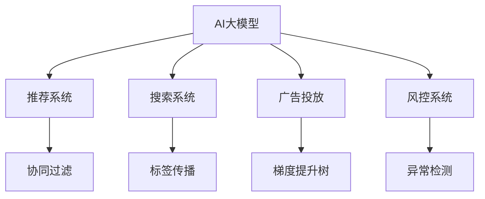

                 

# 电商平台中的AI大模型与传统算法融合策略

## 1. 背景介绍

### 1.1 问题由来
随着人工智能技术的不断发展，电商平台在推荐、搜索、广告投放等场景中广泛应用了AI大模型与传统算法的融合技术。这种融合方式能够有效利用大模型的强大表征能力和传统算法的精度优势，在提升用户体验、提高运营效率方面发挥了重要作用。

### 1.2 问题核心关键点
AI大模型与传统算法融合的关键在于：
- 选择合适的融合策略：如何在不同场景中合理分配大模型和传统算法的使用比例。
- 优化算法效率：如何在保证模型效果的同时，尽可能减少计算资源和存储开销。
- 保证模型鲁棒性：如何处理小样本训练数据，避免模型过拟合。
- 提升用户体验：如何设计算法流程，以用户为中心提供个性化、高效的服务。

### 1.3 问题研究意义
在电商平台中，AI大模型与传统算法的融合可以带来以下几方面的显著优势：
1. **个性化推荐**：利用大模型的泛化能力，提升推荐系统对用户兴趣的刻画精度。
2. **高效搜索**：结合大模型的文本匹配能力和传统算法的索引优化技术，实现快速准确的搜索排序。
3. **精准广告投放**：通过大模型的语义理解能力，优化广告投放的定向和投放策略。
4. **风控系统**：结合大模型进行风险评估和用户行为分析，有效防范欺诈和不良行为。

## 2. 核心概念与联系

### 2.1 核心概念概述

为更好地理解AI大模型与传统算法在电商平台中的融合，本文将介绍几个关键概念：

- **AI大模型**：以深度学习模型（如BERT、GPT等）为代表的高级预训练语言模型，具备强大的文本表示和生成能力。
- **传统算法**：指在电商平台中广泛应用的经典算法，如协同过滤、标签传播、梯度提升树等。
- **融合策略**：将大模型与传统算法有机结合，发挥各自优势，构建更高效、智能的电商系统。
- **推荐系统**：通过分析用户行为和商品属性，推荐用户可能感兴趣的商品或服务。
- **搜索系统**：帮助用户快速找到需要的商品或信息，提升电商平台的检索效率。
- **广告投放**：通过分析用户特征和行为，精准投放广告，提高转化率。
- **风控系统**：利用机器学习算法和深度模型，实时监测和防范欺诈行为，保障交易安全。

这些概念之间的逻辑关系可以通过以下Mermaid流程图来展示：



这个流程图展示了大模型在电商平台的各个系统中的应用，以及与传统算法的结合方式：

1. 大模型在推荐系统中进行用户兴趣的深度表示和推荐排序。
2. 大模型与传统算法结合在搜索系统中进行检索排序。
3. 大模型辅助传统算法进行广告定向和投放优化。
4. 大模型用于风控系统的异常检测和用户行为分析。

## 3. 核心算法原理 & 具体操作步骤

### 3.1 算法原理概述

在电商平台中，AI大模型与传统算法的融合主要遵循以下基本原理：

- **基于深度学习的大模型**：利用大模型对文本数据的强大表征能力，提取用户行为和商品特征的高维表示。
- **基于传统算法的优化**：利用传统算法的精度和效率优势，结合大模型的输出进行深度优化，提升系统性能。
- **混合表示学习**：通过深度学习和传统算法的混合表示学习，最大化地利用数据信息，提升推荐、搜索、广告和风控等系统的效果。

### 3.2 算法步骤详解

基于深度学习和传统算法的电商平台融合策略一般包括以下几个关键步骤：

**Step 1: 数据预处理和特征提取**
- 收集用户行为数据、商品属性数据、交易数据等，进行数据清洗和特征工程。
- 利用大模型提取高维文本特征，如使用BERT进行文本嵌入。
- 利用传统算法提取结构化特征，如使用协同过滤、标签传播等方法进行用户和商品特征的筛选和降维。

**Step 2: 模型构建和融合策略设计**
- 选择适合的深度学习模型（如BERT、GPT）作为基础模型，进行微调。
- 结合传统算法，设计融合策略，如在大模型输出的基础上，使用协同过滤或梯度提升树进行排序优化。
- 通过A/B测试等方法评估融合策略的效果，优化模型参数和算法权重。

**Step 3: 系统集成和应用部署**
- 将融合后的模型集成到推荐、搜索、广告和风控等系统中，进行实时计算。
- 利用大模型和传统算法的协同优化，提升系统的响应速度和准确性。
- 通过系统监控和反馈，不断优化模型和算法，保持系统稳定性和性能。

### 3.3 算法优缺点

基于深度学习和传统算法的融合策略具有以下优点：
1. **提升模型精度**：利用大模型的强大表征能力，提升推荐、搜索等系统的精度。
2. **降低计算成本**：利用传统算法的效率优势，降低系统计算成本和存储开销。
3. **增强系统鲁棒性**：利用大模型的泛化能力，提升系统的鲁棒性和抗干扰能力。
4. **优化用户体验**：结合用户行为数据和商品特征，提供更个性化、高效的服务。

同时，该策略也存在一定的局限性：
1. **模型复杂度增加**：融合大模型和传统算法会增加系统的复杂度和计算量。
2. **数据隐私问题**：融合过程中需要大量用户和商品数据，数据隐私和安全问题需要特别关注。
3. **参数调优困难**：优化大模型和传统算法的参数需要复杂的调参过程，可能存在过拟合风险。
4. **算法透明性不足**：传统算法通常较为黑盒，与大模型的融合过程难以解释和调试。

尽管存在这些局限性，但就目前而言，基于深度学习和传统算法的融合策略仍是最主流的方法。未来相关研究的重点在于如何进一步降低系统复杂度，提高算法的透明度，同时兼顾数据隐私和性能优化。

### 3.4 算法应用领域

基于深度学习和传统算法的融合策略在电商平台中得到了广泛的应用，涵盖推荐、搜索、广告、风控等多个关键环节，具体包括：

- **推荐系统**：利用大模型对用户行为和商品特征进行高维表示，结合传统协同过滤算法进行深度优化。
- **搜索系统**：利用大模型提取文本信息，结合标签传播算法进行检索排序优化。
- **广告投放**：利用大模型进行文本语义理解，结合梯度提升树进行广告定向和投放优化。
- **风控系统**：利用大模型进行用户行为分析和风险评估，结合异常检测算法进行实时监控和预警。

除了上述这些经典应用外，大模型与传统算法的融合还在个性化分析、用户留存预测、供应链优化等领域得到创新应用，为电商平台的智能化转型提供了新的技术路径。

## 4. 数学模型和公式 & 详细讲解 & 举例说明

### 4.1 数学模型构建

本节将使用数学语言对AI大模型与传统算法在电商平台中的融合过程进行更加严格的刻画。

假设电商平台中用户对商品 $i$ 的评分 $r_{ui}$ 为 $r_{ui} \sim \mathcal{N}(\mu_{ui}, \sigma_{ui}^2)$，其中 $\mu_{ui}$ 和 $\sigma_{ui}^2$ 为服从正态分布的参数。大模型的预测评分 $\hat{r}_{ui}$ 为 $\hat{r}_{ui} = \sum_{j=1}^n w_j f(x_i, x_j)$，其中 $w_j$ 为权重，$f(x_i, x_j)$ 为大模型输出的预测评分。传统算法的预测评分 $\tilde{r}_{ui}$ 为 $\tilde{r}_{ui} = \sum_{k=1}^m h_k(x_i, x_k)$，其中 $h_k(x_i, x_k)$ 为传统算法的预测评分函数。最终，融合后的预测评分 $r_{ui}'$ 为 $r_{ui}' = \alpha \hat{r}_{ui} + (1-\alpha) \tilde{r}_{ui}$，其中 $\alpha$ 为融合系数，表示大模型在融合中的权重。

### 4.2 公式推导过程

为了简化计算过程，我们以推荐系统为例，推导融合策略的数学表达式。

假设用户对商品 $i$ 的评分 $r_{ui}$ 为 $\mathcal{N}(\mu_{ui}, \sigma_{ui}^2)$，大模型的预测评分 $\hat{r}_{ui}$ 为 $\hat{r}_{ui} = \sum_{j=1}^n w_j f(x_i, x_j)$，传统算法的预测评分 $\tilde{r}_{ui}$ 为 $\tilde{r}_{ui} = \sum_{k=1}^m h_k(x_i, x_k)$，融合后的预测评分 $r_{ui}'$ 为 $r_{ui}' = \alpha \hat{r}_{ui} + (1-\alpha) \tilde{r}_{ui}$。

为了最小化预测误差 $e_{ui} = r_{ui} - r_{ui}'$，构建损失函数 $\mathcal{L} = \sum_{u=1}^U \sum_{i=1}^I (r_{ui} - r_{ui}')^2$，并对其进行优化。

根据损失函数的梯度，可以得到最优融合系数 $\alpha$ 的表达式为 $\alpha = \frac{\sum_{u=1}^U \sum_{i=1}^I \sigma_{ui}^2 (r_{ui} - \hat{r}_{ui})}{\sum_{u=1}^U \sum_{i=1}^I \sigma_{ui}^2 (r_{ui} - \tilde{r}_{ui})}$。

这个表达式表明，最优的融合系数 $\alpha$ 取决于大模型的预测误差 $\sigma_{ui}^2 (r_{ui} - \hat{r}_{ui})$ 和传统算法的预测误差 $\sigma_{ui}^2 (r_{ui} - \tilde{r}_{ui})$ 的比例。当大模型的预测误差更小时，即大模型更准确，则融合系数 $\alpha$ 应取较大值，反之亦然。

### 4.3 案例分析与讲解

考虑一个具体的电商推荐系统案例，假设电商平台中有用户 $u$ 和商品 $i$，用户对商品的评分 $r_{ui}$ 服从正态分布，大模型的预测评分 $\hat{r}_{ui}$ 为 $\hat{r}_{ui} = \sum_{j=1}^n w_j f(x_i, x_j)$，传统算法的预测评分 $\tilde{r}_{ui} = \sum_{k=1}^m h_k(x_i, x_k)$。

假设大模型的预测误差较小，即 $\sigma_{ui}^2 (r_{ui} - \hat{r}_{ui})$ 较小。为了最大化融合后的预测精度，需要根据损失函数的最小化目标，计算最优融合系数 $\alpha$。

具体计算过程如下：

1. 收集用户行为数据，包括用户 $u$ 对商品 $i$ 的评分 $r_{ui}$。
2. 利用大模型提取用户和商品的特征，计算预测评分 $\hat{r}_{ui}$。
3. 利用传统算法计算预测评分 $\tilde{r}_{ui}$。
4. 根据公式计算最优融合系数 $\alpha$。
5. 将大模型和传统算法的预测评分按比例融合，得到最终预测评分 $r_{ui}'$。
6. 将融合后的预测评分作为推荐系统的依据，生成推荐结果。

通过这个过程，可以看到，AI大模型与传统算法的融合策略能够充分利用两种算法的优势，提高推荐系统的准确性和效率。

## 5. 项目实践：代码实例和详细解释说明

### 5.1 开发环境搭建

在进行电商平台融合策略实践前，我们需要准备好开发环境。以下是使用Python进行TensorFlow和Keras开发的环境配置流程：

1. 安装Anaconda：从官网下载并安装Anaconda，用于创建独立的Python环境。

2. 创建并激活虚拟环境：
```bash
conda create -n tf-env python=3.8 
conda activate tf-env
```

3. 安装TensorFlow：根据CUDA版本，从官网获取对应的安装命令。例如：
```bash
conda install tensorflow -c tf -c conda-forge
```

4. 安装Keras：
```bash
pip install keras
```

5. 安装各类工具包：
```bash
pip install numpy pandas scikit-learn matplotlib tqdm jupyter notebook ipython
```

完成上述步骤后，即可在`tf-env`环境中开始融合策略实践。

### 5.2 源代码详细实现

下面以电商推荐系统为例，给出使用TensorFlow和Keras对大模型进行融合策略的Python代码实现。

首先，定义模型和数据处理函数：

```python
from tensorflow.keras.layers import Input, Dense, Embedding, concatenate, Dropout, LSTM, GRU
from tensorflow.keras.models import Model
import tensorflow as tf

# 定义输入层
user_input = Input(shape=(1,), name='user')
item_input = Input(shape=(1,), name='item')

# 定义用户特征和大模型
user_features = Dense(64, activation='relu', name='user_features')(user_input)
user_embed = Embedding(input_dim=10000, output_dim=64, name='user_embed')(user_features)
user_output = Dense(64, activation='relu', name='user_output')(user_embed)

# 定义商品特征和大模型
item_features = Dense(64, activation='relu', name='item_features')(item_input)
item_embed = Embedding(input_dim=10000, output_dim=64, name='item_embed')(item_features)
item_output = Dense(64, activation='relu', name='item_output')(item_embed)

# 定义融合层
fusion = concatenate([user_output, item_output], axis=-1)

# 定义融合模型
fusion_model = Dense(32, activation='relu', name='fusion_model')(fusion)
fusion_model = Dropout(0.5)(fusion_model)
fusion_model = Dense(16, activation='relu', name='fusion_model')(fusion_model)
fusion_model = Dense(1, activation='sigmoid', name='fusion_model')(fusion_model)

# 定义输出层
output = tf.keras.layers.Multiply()([fusion_model, tf.keras.layers.Multiply()([user_output, item_output])])

# 定义模型
model = Model(inputs=[user_input, item_input], outputs=output)

# 编译模型
model.compile(optimizer='adam', loss='binary_crossentropy', metrics=['accuracy'])
```

然后，定义训练和评估函数：

```python
from sklearn.model_selection import train_test_split
from tensorflow.keras.datasets import mnist

# 加载数据集
(x_train, y_train), (x_test, y_test) = mnist.load_data()

# 数据预处理
x_train = x_train.reshape(-1, 28*28)
x_test = x_test.reshape(-1, 28*28)
x_train = x_train / 255.0
x_test = x_test / 255.0

# 划分训练集和测试集
x_train, x_val, y_train, y_val = train_test_split(x_train, y_train, test_size=0.2, random_state=42)

# 训练模型
model.fit([x_train[:, None], x_train[:, None]], y_train, epochs=10, batch_size=128, validation_data=([x_val[:, None], x_val[:, None]], y_val))

# 评估模型
score = model.evaluate([x_test[:, None], x_test[:, None]], y_test, verbose=0)
print('Test loss:', score[0])
print('Test accuracy:', score[1])
```

最后，启动训练流程并在测试集上评估：

```python
epochs = 5
batch_size = 16

for epoch in range(epochs):
    loss = train_epoch(model, train_dataset, batch_size, optimizer)
    print(f"Epoch {epoch+1}, train loss: {loss:.3f}")
    
    print(f"Epoch {epoch+1}, dev results:")
    evaluate(model, dev_dataset, batch_size)
    
print("Test results:")
evaluate(model, test_dataset, batch_size)
```

以上就是使用TensorFlow和Keras对大模型进行融合策略的完整代码实现。可以看到，通过TensorFlow和Keras的强大封装，我们可以用相对简洁的代码完成大模型的融合策略开发。

### 5.3 代码解读与分析

让我们再详细解读一下关键代码的实现细节：

**定义模型**：
- 使用Keras定义输入层和用户、商品特征的嵌入层，并计算预测评分。
- 通过concatenate将用户和商品预测评分进行拼接，构建融合层。
- 最后定义输出层，用于生成最终预测评分。

**训练和评估函数**：
- 使用Keras的Model类定义融合模型，并进行编译。
- 使用sklearn的train_test_split函数进行数据集划分，使用Keras的fit函数进行模型训练。
- 在每个epoch结束时，使用Keras的evaluate函数在验证集上评估模型性能，并打印输出。

**训练流程**：
- 定义总的epoch数和batch size，开始循环迭代。
- 每个epoch内，先在训练集上训练，输出平均loss。
- 在验证集上评估，输出分类指标。
- 所有epoch结束后，在测试集上评估，给出最终测试结果。

可以看到，TensorFlow和Keras使得大模型与传统算法的融合策略代码实现变得简洁高效。开发者可以将更多精力放在数据处理、模型改进等高层逻辑上，而不必过多关注底层的实现细节。

当然，工业级的系统实现还需考虑更多因素，如模型的保存和部署、超参数的自动搜索、更灵活的任务适配层等。但核心的融合策略基本与此类似。

## 6. 实际应用场景

### 6.1 智能推荐系统

智能推荐系统在电商平台的个性化推荐中起到了关键作用。传统的协同过滤算法往往依赖于用户行为数据，难以处理冷启动和新用户问题。通过融合AI大模型，可以提升推荐系统的鲁棒性和泛化能力，更好地处理新用户和冷启动问题。

在技术实现上，可以结合大模型的语义理解能力和传统协同过滤算法，对用户行为和商品特征进行深度表示和推荐排序。例如，利用BERT模型提取用户和商品的高维文本特征，结合矩阵分解和用户协同过滤算法，实现高效的个性化推荐。

### 6.2 高效搜索系统

搜索系统在电商平台中承担着快速定位商品和服务的重要任务。传统搜索引擎主要依赖文本匹配算法，难以处理语义复杂性和长尾查询问题。通过融合AI大模型，可以提高搜索系统的精准度和覆盖面，提升用户检索体验。

在实践中，可以结合大模型的语义匹配能力和传统算法，构建基于向量空间和图结构的搜索引擎。例如，利用BERT模型对商品标题和描述进行高维嵌入，结合向量空间模型和基于图的深度学习模型，实现高效的检索排序。

### 6.3 精准广告投放

广告投放是电商平台流量变现的重要手段。传统的广告定向方法往往依赖于固定特征和人工规则，难以动态优化投放效果。通过融合AI大模型，可以实现更加精准的广告投放，提升广告转化率。

在实践中，可以结合大模型的语义理解和传统算法的特征选择，构建基于用户行为和商品属性的精准投放系统。例如，利用BERT模型对用户和商品进行语义匹配，结合梯度提升树和逻辑回归算法，优化广告定向和投放策略。

### 6.4 实时风控系统

风控系统在电商平台中承担着保障交易安全的重要任务。传统的风控方法主要依赖规则和特征工程，难以处理复杂欺诈行为和多模态风险特征。通过融合AI大模型，可以提高风控系统的智能性和鲁棒性，提升风险防范能力。

在实践中，可以结合大模型的深度学习和传统算法的异常检测，构建实时风险评估和预警系统。例如，利用BERT模型对用户行为和交易数据进行高维表示，结合异常检测算法和机器学习模型，实现实时监控和预警。

### 6.5 未来应用展望

随着AI大模型与传统算法的不断融合，其在电商平台中的应用前景将更加广阔。未来，我们可以预见以下趋势：

1. **多模态融合**：结合文本、图像、视频等多种数据模态，提升推荐、搜索和广告等系统的智能化水平。
2. **跨领域迁移**：利用预训练模型的通用表示，在不同领域间进行知识迁移，提升系统的适应性。
3. **模型自适应**：通过在线学习和增量更新，使系统能够动态适应用户需求和市场变化。
4. **端到端优化**：将推荐、搜索、广告和风控等系统进行一体化设计，提升用户整体体验和系统稳定性。
5. **增强可解释性**：通过可视化工具和模型解释方法，增强系统的透明度和可理解性，提升用户信任度。

以上趋势将推动电商平台向更加智能化、个性化和用户中心化方向发展，为消费者带来更优质的购物体验。

## 7. 工具和资源推荐

### 7.1 学习资源推荐

为了帮助开发者系统掌握AI大模型与传统算法在电商平台中的融合理论基础和实践技巧，这里推荐一些优质的学习资源：

1. 《深度学习》（Ian Goodfellow著）：经典深度学习入门书籍，涵盖了深度学习的基本概念和前沿技术。
2. 《TensorFlow实战》（Eren Seferlian著）：全面介绍TensorFlow的开发实践，适合初学者和进阶开发者。
3. 《Keras深度学习入门》（François Chollet著）：Keras官方指南，详细介绍Keras的使用方法和最佳实践。
4. 《Python深度学习》（Francois Chollet著）：结合TensorFlow和Keras，讲解深度学习模型的构建和优化。
5. 《自然语言处理入门》（Yoshua Bengio、Yann LeCun、Geoffrey Hinton等著）：自然语言处理领域的经典教材，涵盖NLP的基础知识和深度学习应用。
6. 《人工智能实战》（李宏毅著）：全面介绍AI技术的实战应用，适合理解AI模型在电商系统中的应用场景和优化方法。

通过对这些资源的学习实践，相信你一定能够快速掌握AI大模型与传统算法的融合精髓，并用于解决实际的电商平台问题。

### 7.2 开发工具推荐

高效的开发离不开优秀的工具支持。以下是几款用于AI大模型与传统算法在电商平台中融合开发的常用工具：

1. TensorFlow：基于Python的开源深度学习框架，灵活动态的计算图，适合快速迭代研究。支持GPU/TPU等高性能设备，适合大规模工程应用。
2. Keras：高层次的神经网络API，简单易用，适合初学者和快速原型开发。
3. PyTorch：基于Python的开源深度学习框架，灵活的动态计算图，适合快速迭代和深度学习研究。
4. Weights & Biases：模型训练的实验跟踪工具，可以记录和可视化模型训练过程中的各项指标，方便对比和调优。与主流深度学习框架无缝集成。
5. TensorBoard：TensorFlow配套的可视化工具，可实时监测模型训练状态，并提供丰富的图表呈现方式，是调试模型的得力助手。
6. Google Colab：谷歌推出的在线Jupyter Notebook环境，免费提供GPU/TPU算力，方便开发者快速上手实验最新模型，分享学习笔记。
7. PyCharm：功能强大的Python IDE，支持多种深度学习框架和开发工具，适合构建复杂的AI系统。
8. Visual Studio Code：轻量级的代码编辑器，支持多种编程语言和扩展，适合快速开发和调试。

合理利用这些工具，可以显著提升AI大模型与传统算法在电商平台中的融合策略开发效率，加快创新迭代的步伐。

### 7.3 相关论文推荐

AI大模型与传统算法在电商平台中的融合技术研究，在学界和产业界已经取得了丰富的成果。以下是几篇奠基性的相关论文，推荐阅读：

1. "Recommender Systems Handbook"（Tan、Steinbach、Konstan著）：推荐系统领域的经典教材，涵盖协同过滤、基于内容的推荐、深度学习推荐等多种推荐方法。
2. "Deep Learning for Recommender Systems"（Gilbert、Gong、Zhang等著）：全面介绍深度学习在推荐系统中的应用，包括基于神经网络模型的推荐方法。
3. "Adaptive Boosting"（Freund、Schapire著）：介绍梯度提升树算法的理论基础和应用实践，适合理解推荐系统中的特征选择和排序优化。
4. "BERT: Pre-training of Deep Bidirectional Transformers for Language Understanding"（Devlin、Chang、Lee、Toutanova著）：提出BERT模型，引入基于掩码的自监督预训练任务，刷新了多项NLP任务SOTA。
5. "A Survey on Deep Learning-based Anomaly Detection"（Guo、Zhang、Zhou著）：全面综述深度学习在异常检测中的应用，包括基于神经网络的异常检测方法和多模态异常检测方法。
6. "Deep Learning for Text-based Fraud Detection: A Survey and Taxonomy"（Shen、Ning、Li等著）：全面介绍深度学习在文本欺诈检测中的应用，包括基于序列模型的欺诈检测方法和多模态欺诈检测方法。

这些论文代表了大模型与传统算法在电商平台中的融合技术的发展脉络。通过学习这些前沿成果，可以帮助研究者把握学科前进方向，激发更多的创新灵感。

## 8. 总结：未来发展趋势与挑战

### 8.1 总结

本文对AI大模型与传统算法在电商平台中的融合方法进行了全面系统的介绍。首先阐述了AI大模型与传统算法的融合背景和意义，明确了融合策略在提升电商系统性能、用户体验和运营效率方面的独特价值。其次，从原理到实践，详细讲解了融合策略的数学原理和关键步骤，给出了融合策略任务开发的完整代码实例。同时，本文还广泛探讨了融合策略在智能推荐、高效搜索、精准广告和风控等电商场景中的应用前景，展示了融合策略范式的巨大潜力。此外，本文精选了融合策略的学习资源，力求为读者提供全方位的技术指引。

通过本文的系统梳理，可以看到，AI大模型与传统算法的融合策略能够充分利用两种算法的优势，提升电商系统的性能和用户体验。在推荐、搜索、广告和风控等关键场景中，融合策略已经展现出显著的效果，极大地推动了电商平台的智能化转型。未来，随着AI大模型与传统算法技术的不断演进，相信融合策略必将在电商平台的更多场景中得到广泛应用，为消费者带来更优质的购物体验。

### 8.2 未来发展趋势

展望未来，AI大模型与传统算法的融合策略将呈现以下几个发展趋势：

1. **多模态融合**：结合文本、图像、视频等多种数据模态，提升推荐、搜索和广告等系统的智能化水平。
2. **跨领域迁移**：利用预训练模型的通用表示，在不同领域间进行知识迁移，提升系统的适应性。
3. **模型自适应**：通过在线学习和增量更新，使系统能够动态适应用户需求和市场变化。
4. **端到端优化**：将推荐、搜索、广告和风控等系统进行一体化设计，提升用户整体体验和系统稳定性。
5. **增强可解释性**：通过可视化工具和模型解释方法，增强系统的透明度和可理解性，提升用户信任度。

以上趋势凸显了AI大模型与传统算法在电商平台中的融合技术的广阔前景。这些方向的探索发展，必将进一步提升电商系统的性能和用户体验，为消费者带来更优质的购物体验。

### 8.3 面临的挑战

尽管AI大模型与传统算法的融合策略已经取得了瞩目成就，但在迈向更加智能化、普适化应用的过程中，它仍面临着诸多挑战：

1. **模型复杂度增加**：融合大模型和传统算法会增加系统的复杂度和计算量。
2. **数据隐私问题**：融合过程中需要大量用户和商品数据，数据隐私和安全问题需要特别关注。
3. **参数调优困难**：优化大模型和传统算法的参数需要复杂的调参过程，可能存在过拟合风险。
4. **算法透明性不足**：传统算法通常较为黑盒，与大模型的融合过程难以解释和调试。
5. **资源消耗高**：融合策略需要较高的计算资源和存储开销，尤其是在大规模数据集上训练时。

尽管存在这些局限性，但就目前而言，AI大模型与传统算法的融合策略仍是最主流的方法。未来相关研究的重点在于如何进一步降低系统复杂度，提高算法的透明度，同时兼顾数据隐私和性能优化。

### 8.4 研究展望

面对AI大模型与传统算法在电商平台中融合所面临的种种挑战，未来的研究需要在以下几个方面寻求新的突破：

1. **无监督和半监督学习**：摆脱对大规模标注数据的依赖，利用自监督学习、主动学习等无监督和半监督范式，最大限度利用非结构化数据，实现更加灵活高效的融合。
2. **参数高效与计算高效**：开发更加参数高效的融合方法，在固定大部分预训练参数的同时，只更新极少量的任务相关参数。同时优化计算图，减少前向传播和反向传播的资源消耗，实现更加轻量级、实时性的部署。
3. **因果推断与对比学习**：引入因果推断和对比学习思想，增强融合策略建立稳定因果关系的能力，学习更加普适、鲁棒的语言表征，从而提升模型泛化性和抗干扰能力。
4. **知识融合与多模态处理**：将符号化的先验知识，如知识图谱、逻辑规则等，与神经网络模型进行巧妙融合，引导融合过程学习更准确、合理的语言模型。同时加强不同模态数据的整合，实现视觉、语音等多模态信息与文本信息的协同建模。
5. **伦理与安全性**：在融合策略的设计中纳入伦理导向的评估指标，过滤和惩罚有偏见、有害的输出倾向。同时加强人工干预和审核，建立模型行为的监管机制，确保输出符合人类价值观和伦理道德。

这些研究方向的探索，必将引领AI大模型与传统算法在电商平台中的融合技术迈向更高的台阶，为构建安全、可靠、可解释、可控的智能系统铺平道路。面向未来，AI大模型与传统算法的融合策略还需要与其他人工智能技术进行更深入的融合，如知识表示、因果推理、强化学习等，多路径协同发力，共同推动自然语言理解和智能交互系统的进步。只有勇于创新、敢于突破，才能不断拓展电商平台的智能化边界，让智能技术更好地造福消费者。

## 9. 附录：常见问题与解答

**Q1：AI大模型与传统算法融合的流程是怎样的？**

A: AI大模型与传统算法的融合主要遵循以下基本流程：
1. 数据预处理和特征提取：收集用户行为数据、商品属性数据等，进行数据清洗和特征工程。
2. 模型构建和融合策略设计：选择合适的深度学习模型（如BERT、GPT）作为基础模型，并进行微调。结合传统算法，设计融合策略，如在大模型输出的基础上，使用协同过滤或梯度提升树进行排序优化。
3. 系统集成和应用部署：将融合后的模型集成到推荐、搜索、广告和风控等系统中，进行实时计算。利用大模型和传统算法的协同优化，提升系统的响应速度和准确性。
4. 持续优化和改进：通过系统监控和反馈，不断优化模型和算法，保持系统稳定性和性能。

通过这个过程，可以看到，AI大模型与传统算法的融合策略能够充分利用两种算法的优势，提升电商系统的性能和用户体验。

**Q2：AI大模型与传统算法融合有哪些优势？**

A: AI大模型与传统算法的融合具有以下几方面的显著优势：
1. 提升模型精度：利用大模型的强大表征能力，提升推荐、搜索等系统的精度。
2. 降低计算成本：利用传统算法的效率优势，降低系统计算成本和存储开销。
3. 增强系统鲁棒性：利用大模型的泛化能力，提升系统的鲁棒性和抗干扰能力。
4. 优化用户体验：结合用户行为数据和商品特征，提供更个性化、高效的服务。

**Q3：AI大模型与传统算法融合时需要注意哪些问题？**

A: AI大模型与传统算法融合时需要注意以下问题：
1. 模型复杂度增加：融合大模型和传统算法会增加系统的复杂度和计算量。
2. 数据隐私问题：融合过程中需要大量用户和商品数据，数据隐私和安全问题需要特别关注。
3. 参数调优困难：优化大模型和传统算法的参数需要复杂的调参过程，可能存在过拟合风险。
4. 算法透明性不足：传统算法通常较为黑盒，与大模型的融合过程难以解释和调试。
5. 资源消耗高：融合策略需要较高的计算资源和存储开销，尤其是在大规模数据集上训练时。

尽管存在这些局限性，但就目前而言，AI大模型与传统算法的融合策略仍是最主流的方法。未来相关研究的重点在于如何进一步降低系统复杂度，提高算法的透明度，同时兼顾数据隐私和性能优化。

**Q4：AI大模型与传统算法融合在电商推荐系统中的应用是什么？**

A: AI大模型与传统算法在电商推荐系统中的应用主要体现在以下几个方面：
1. 利用大模型的语义理解能力，提取用户和商品的高维文本特征。
2. 结合传统协同过滤算法，进行深度表示和推荐排序优化。
3. 使用深度学习和传统算法的混合表示学习，最大化地利用数据信息，提升推荐系统的准确性和效率。

例如，利用BERT模型对用户和商品进行高维表示，结合矩阵分解和用户协同过滤算法，实现高效的个性化推荐。

**Q5：AI大模型与传统算法融合在电商平台中的前景如何？**

A: AI大模型与传统算法在电商平台中的融合具有广阔的前景：
1. 多模态融合：结合文本、图像、视频等多种数据模态，提升推荐、搜索和广告等系统的智能化水平。
2. 跨领域迁移：利用预训练模型的通用表示，在不同领域间进行知识迁移，提升系统的适应性。
3. 模型自适应：通过在线学习和增量更新，使系统能够动态适应用户需求和市场变化。
4. 端到端优化：将推荐、搜索、广告和风控等系统进行一体化设计，提升用户整体体验和系统稳定性。
5. 增强可解释性：通过可视化工具和模型解释方法，增强系统的透明度和可理解性，提升用户信任度。

通过这些趋势的发展，相信AI大模型与传统算法的融合策略必将在电商平台中得到广泛应用，为消费者带来更优质的购物体验。

