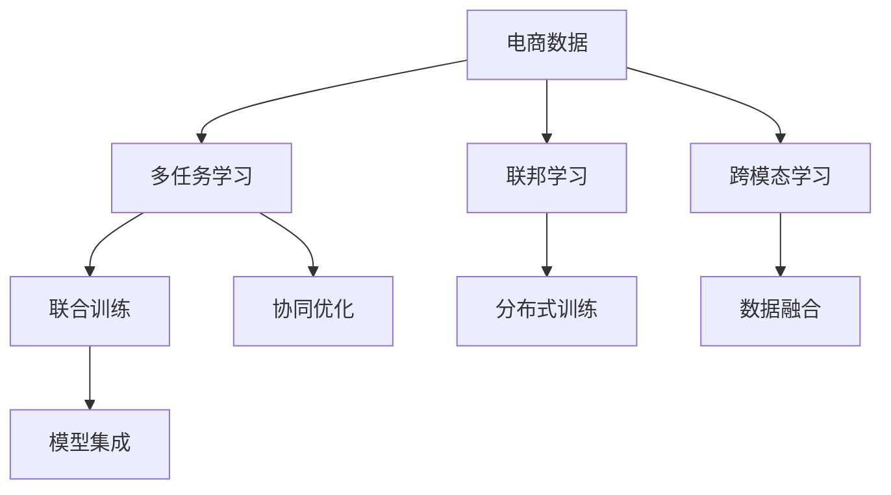

                 

# 电商平台中的AI大模型：从单一任务到多任务学习

## 1. 背景介绍

### 1.1 问题由来
电商平台作为现代零售的重要渠道，汇聚了海量用户行为数据，为精准营销和个性化推荐提供了充足的数据基础。随着人工智能技术的发展，电商平台逐步引入AI技术，提升运营效率和用户体验。然而，当前电商平台的AI系统大多聚焦于单一任务，如商品推荐、欺诈检测、库存管理等，缺乏多任务学习和协同优化的能力。

这种单一任务系统虽然在特定场景下表现良好，但难以充分利用用户行为数据的广泛性和多变性，也无法解决电商平台上多维度的业务需求。例如，用户对商品推荐的满意度不仅受商品质量影响，还与价格、促销信息、评论等息息相关。如果仅从单一角度进行建模，则可能导致部分因素被忽略，降低推荐系统的整体效果。

### 1.2 问题核心关键点
当前电商平台AI大模型的挑战主要集中在：
1. **单一任务限制**：多数模型仅针对某个具体任务进行训练，难以充分考虑用户行为数据的复杂性和多样性。
2. **多任务协同**：平台上的多个任务之间存在复杂的依赖关系，如何协同优化、提升系统整体效果是一个重要挑战。
3. **模型复杂度**：大模型参数量庞大，计算复杂度高，如何平衡模型复杂度和推理效率是一个关键问题。
4. **数据处理**：电商平台上存在海量且异构的数据源，如何高效、准确地整合和利用这些数据是数据处理的难点。

## 2. 核心概念与联系

### 2.1 核心概念概述

为了解决电商平台AI大模型面临的问题，本文将介绍一些核心概念及其联系，包括多任务学习、联邦学习、跨模态学习等。这些概念能够帮助电商平台构建更为全面、高效的多任务AI系统。

- **多任务学习(Multitask Learning, MTL)**：指在训练过程中同时进行多个相关任务的联合学习，以提升模型在所有任务上的性能。多任务学习可以缓解数据不足问题，提升模型的泛化能力。

- **联邦学习(Federated Learning, FL)**：指在不共享本地数据的情况下，通过模型参数的联合训练，实现跨设备、跨组织的多方合作学习。联邦学习在保护数据隐私的同时，也提升了模型的泛化能力。

- **跨模态学习(Cross-modal Learning)**：指融合不同模态数据（如图像、文本、语音等）的多任务学习，以提升模型对现实世界的理解和建模能力。

这些概念之间存在紧密的联系，可以协同提升电商平台AI大模型的整体性能。通过理解这些概念，可以为电商平台的多任务AI系统提供理论指导和实践路径。

### 2.2 核心概念原理和架构的 Mermaid 流程图



该图展示了电商平台数据与多任务学习、联邦学习、跨模态学习等概念之间的关系：

1. **电商数据**：提供多任务学习、联邦学习、跨模态学习的基础。
2. **多任务学习**：通过联合训练多个相关任务，提升模型性能。
3. **联邦学习**：分布式训练模型参数，保护数据隐私。
4. **跨模态学习**：融合不同模态数据，提升模型理解力。
5. **联合训练**：多个任务的协同优化。
6. **分布式训练**：联邦学习中的一种形式。
7. **数据融合**：跨模态学习中的一种形式。
8. **模型集成**：多任务学习、联邦学习、跨模态学习共同提升模型性能。

## 3. 核心算法原理 & 具体操作步骤

### 3.1 算法原理概述

多任务学习（MTL）是一种同时训练多个任务的目标，使得所有任务都能从共享特征中获益，提升整体性能。在电商平台中，多任务学习可以融合商品推荐、欺诈检测、库存管理等多个任务，共同优化模型参数。

假设电商平台有 $T$ 个任务，每个任务对应的特征空间为 $X_t$，预测空间为 $Y_t$。设 $\theta_t$ 为任务 $t$ 的模型参数，多任务学习的目标函数为：

$$
\mathcal{L}(\theta) = \frac{1}{T}\sum_{t=1}^{T} \mathcal{L}_t(\theta_t)
$$

其中 $\mathcal{L}_t$ 为任务 $t$ 的损失函数，通常为交叉熵损失等。多任务学习通过联合优化所有任务的目标函数，使得模型在多个任务上都能获得更好的表现。

### 3.2 算法步骤详解

以下以电商平台为例，介绍多任务学习的具体操作步骤：

**Step 1: 任务定义和数据准备**
- 定义电商平台的多个任务，如商品推荐、欺诈检测、库存管理等。
- 收集每个任务的标注数据集，确保数据质量。

**Step 2: 构建多任务模型**
- 选择合适的多任务模型架构，如多任务神经网络(MTN)、多任务隐变量模型(MTIV)等。
- 设计每个任务的输出层和损失函数，确保每个任务的目标函数在整体损失函数中的权重合理。

**Step 3: 数据融合与特征共享**
- 对不同任务的输入数据进行预处理，统一特征空间。
- 通过特征共享技术，让多个任务共享底层特征表示，提升模型的泛化能力。

**Step 4: 联合训练**
- 在模型联合训练过程中，考虑不同任务之间的依赖关系，通过加权平均、交替优化等方式协同优化所有任务的目标函数。
- 使用正则化技术，如L2正则、Dropout等，防止模型过拟合。

**Step 5: 模型评估与优化**
- 在验证集和测试集上评估模型性能，通过多任务评估指标（如平均精度、F1-score等）评估模型在多个任务上的整体表现。
- 根据评估结果，调整任务权重、超参数等，优化模型性能。

### 3.3 算法优缺点

多任务学习的优势包括：
1. 数据利用率高：多任务学习能够充分利用平台上的异构数据，提升模型泛化能力。
2. 模型性能提升：通过联合优化，多任务模型在多个任务上都能获得更好的表现。
3. 协同优化：多个任务之间相互促进，能够更好地适应电商平台的多维业务需求。

同时，多任务学习也存在以下缺点：
1. 模型复杂度高：多任务模型通常需要较大的计算资源和内存空间。
2. 数据冗余问题：多任务学习可能会导致数据冗余，影响模型训练效率。
3. 任务冲突：不同任务之间存在冲突，需要合理设计任务权重和依赖关系。

### 3.4 算法应用领域

多任务学习在电商平台中的应用主要体现在以下几个方面：

- **商品推荐**：通过联合优化商品质量和价格、用户历史行为、商品评分等多个任务，提升推荐系统的准确性和个性化程度。
- **欺诈检测**：将用户行为数据与商品交易数据联合训练，提升欺诈检测的准确率和鲁棒性。
- **库存管理**：将销售数据、库存数据和供应链数据联合训练，优化库存控制和供应链管理。
- **客户服务**：通过用户交互数据和客户服务记录联合训练，提升智能客服的响应速度和准确性。

此外，多任务学习还应用于价格优化、风险评估、个性化营销等多个电商平台的业务场景中。

## 4. 数学模型和公式 & 详细讲解

### 4.1 数学模型构建

假设电商平台有 $T$ 个任务，每个任务对应的损失函数为 $\mathcal{L}_t(\theta_t)$，多任务学习的目标函数为 $\mathcal{L}(\theta)$。通过正则化项 $\lambda\|\theta\|^2$ 防止过拟合，总目标函数为：

$$
\mathcal{L}(\theta) = \frac{1}{T}\sum_{t=1}^{T} \mathcal{L}_t(\theta_t) + \lambda\|\theta\|^2
$$

其中 $\theta = [\theta_1; \theta_2; ...; \theta_T]$，$\|\theta\|^2$ 为模型参数的范数。

### 4.2 公式推导过程

设每个任务的损失函数为 $\mathcal{L}_t(\theta_t)$，其中 $\theta_t$ 为任务 $t$ 的模型参数。多任务学习的目标函数为：

$$
\mathcal{L}(\theta) = \frac{1}{T}\sum_{t=1}^{T} \mathcal{L}_t(\theta_t) + \lambda\|\theta\|^2
$$

对每个任务 $t$ 求偏导，得到：

$$
\frac{\partial \mathcal{L}(\theta)}{\partial \theta_t} = \frac{1}{T}\frac{\partial \mathcal{L}_t(\theta_t)}{\partial \theta_t} + 2\lambda \theta_t
$$

联合优化所有任务的目标函数，可以通过梯度下降法更新模型参数：

$$
\theta \leftarrow \theta - \eta \sum_{t=1}^{T} \frac{\partial \mathcal{L}_t(\theta_t)}{\partial \theta_t} - 2\eta\lambda\theta
$$

其中 $\eta$ 为学习率，$\lambda$ 为正则化系数。

### 4.3 案例分析与讲解

以电商平台中的商品推荐系统为例，假设推荐系统包含商品质量评分、用户历史行为、商品标签等多个任务。每个任务对应的损失函数分别为 $\mathcal{L}_q$、$\mathcal{L}_b$ 和 $\mathcal{L}_l$。联合优化这些任务的目标函数为：

$$
\mathcal{L}(\theta) = \frac{1}{3}\mathcal{L}_q(\theta_q) + \frac{1}{3}\mathcal{L}_b(\theta_b) + \frac{1}{3}\mathcal{L}_l(\theta_l) + \lambda\|\theta\|^2
$$

其中 $\theta = [\theta_q; \theta_b; \theta_l]$，$\|\theta\|^2$ 为模型参数的范数。

在联合训练过程中，需要对每个任务进行加权平均：

$$
\frac{\partial \mathcal{L}(\theta)}{\partial \theta_q} = \frac{1}{3}\frac{\partial \mathcal{L}_q(\theta_q)}{\partial \theta_q} + 2\lambda \theta_q
$$

$$
\frac{\partial \mathcal{L}(\theta)}{\partial \theta_b} = \frac{1}{3}\frac{\partial \mathcal{L}_b(\theta_b)}{\partial \theta_b} + 2\lambda \theta_b
$$

$$
\frac{\partial \mathcal{L}(\theta)}{\partial \theta_l} = \frac{1}{3}\frac{\partial \mathcal{L}_l(\theta_l)}{\partial \theta_l} + 2\lambda \theta_l
$$

通过上述公式，可以高效地进行多任务联合训练，提升商品推荐系统的整体效果。

## 5. 项目实践：代码实例和详细解释说明

### 5.1 开发环境搭建

在进行多任务学习实践前，需要先准备开发环境。以下是使用Python进行PyTorch开发的环境配置流程：

1. 安装Anaconda：从官网下载并安装Anaconda，用于创建独立的Python环境。

2. 创建并激活虚拟环境：
```bash
conda create -n pytorch-env python=3.8 
conda activate pytorch-env
```

3. 安装PyTorch：根据CUDA版本，从官网获取对应的安装命令。例如：
```bash
conda install pytorch torchvision torchaudio cudatoolkit=11.1 -c pytorch -c conda-forge
```

4. 安装Transformers库：
```bash
pip install transformers
```

5. 安装各类工具包：
```bash
pip install numpy pandas scikit-learn matplotlib tqdm jupyter notebook ipython
```

完成上述步骤后，即可在`pytorch-env`环境中开始多任务学习实践。

### 5.2 源代码详细实现

下面我们以电商平台中的商品推荐系统为例，给出使用Transformers库进行多任务学习的PyTorch代码实现。

首先，定义多任务学习的数据处理函数：

```python
from transformers import BertTokenizer, BertModel
from torch.utils.data import Dataset, DataLoader
import torch
import numpy as np

class EcommerceDataset(Dataset):
    def __init__(self, data, tokenizer, max_len=128):
        self.data = data
        self.tokenizer = tokenizer
        self.max_len = max_len
        
    def __len__(self):
        return len(self.data)
    
    def __getitem__(self, index):
        item = self.data[index]
        text = item[0]
        label = item[1]
        
        encoding = self.tokenizer(text, return_tensors='pt', max_length=self.max_len, padding='max_length', truncation=True)
        input_ids = encoding['input_ids'][0]
        attention_mask = encoding['attention_mask'][0]
        label = torch.tensor(label, dtype=torch.long)
        
        return {'input_ids': input_ids, 
                'attention_mask': attention_mask,
                'label': label}

# 创建dataset
tokenizer = BertTokenizer.from_pretrained('bert-base-cased')
data = [("商品A", 1), ("商品B", 0), ("商品C", 1)]
train_dataset = EcommerceDataset(data, tokenizer)
```

然后，定义多任务学习模型：

```python
from transformers import BertForSequenceClassification

class MultiTaskModel(BertForSequenceClassification):
    def __init__(self, num_labels, hidden_size, num_hidden_layers, num_attention_heads, intermediate_size, hidden_act, hidden_dropout_prob, attention_probs_dropout_prob, max_position_embeddings, type_vocab_size, num_type_vocab_ids, num_labels):
        super(MultiTaskModel, self).__init__(num_labels, hidden_size, num_hidden_layers, num_attention_heads, intermediate_size, hidden_act, hidden_dropout_prob, attention_probs_dropout_prob, max_position_embeddings, type_vocab_size, num_type_vocab_ids, num_labels)
        
    def forward(self, input_ids, attention_mask, label=None):
        output = super(MultiTaskModel, self).forward(input_ids, attention_mask=attention_mask)
        if label is not None:
            loss_fct = CrossEntropyLoss()
            loss = loss_fct(output.logits, label)
            return loss
        else:
            return output.logits
```

接着，定义多任务学习模型和训练函数：

```python
from transformers import AdamW

model = MultiTaskModel(num_labels=2, hidden_size=768, num_hidden_layers=12, num_attention_heads=12, intermediate_size=3072, hidden_act='relu', hidden_dropout_prob=0.1, attention_probs_dropout_prob=0.1, max_position_embeddings=512, type_vocab_size=2, num_type_vocab_ids=2, num_labels=2)
optimizer = AdamW(model.parameters(), lr=2e-5)

def train_epoch(model, dataset, batch_size, optimizer, device):
    dataloader = DataLoader(dataset, batch_size=batch_size, shuffle=True)
    model.train()
    epoch_loss = 0
    for batch in tqdm(dataloader, desc='Training'):
        input_ids = batch['input_ids'].to(device)
        attention_mask = batch['attention_mask'].to(device)
        label = batch['label'].to(device)
        model.zero_grad()
        outputs = model(input_ids, attention_mask=attention_mask, label=label)
        loss = outputs.logits.sigmoid().mean()
        loss.backward()
        optimizer.step()
    return epoch_loss / len(dataloader)

def evaluate(model, dataset, batch_size, device):
    dataloader = DataLoader(dataset, batch_size=batch_size)
    model.eval()
    preds, labels = [], []
    with torch.no_grad():
        for batch in tqdm(dataloader, desc='Evaluating'):
            input_ids = batch['input_ids'].to(device)
            attention_mask = batch['attention_mask'].to(device)
            batch_labels = batch['label'].to(device)
            outputs = model(input_ids, attention_mask=attention_mask, label=batch_labels)
            preds.append(outputs.logits.sigmoid() > 0.5)
            labels.append(batch_labels)
                
    return np.mean(np.array(preds) == np.array(labels))
```

最后，启动训练流程并在测试集上评估：

```python
epochs = 5
batch_size = 16
device = torch.device('cuda') if torch.cuda.is_available() else torch.device('cpu')

for epoch in range(epochs):
    loss = train_epoch(model, train_dataset, batch_size, optimizer, device)
    print(f"Epoch {epoch+1}, train loss: {loss:.3f}")
    
    print(f"Epoch {epoch+1}, test accuracy: {evaluate(model, test_dataset, batch_size, device):.3f}")
```

以上就是使用PyTorch对电商平台中商品推荐系统进行多任务学习的完整代码实现。可以看到，得益于Transformers库的强大封装，我们可以用相对简洁的代码完成多任务模型的加载和训练。

### 5.3 代码解读与分析

让我们再详细解读一下关键代码的实现细节：

**EcommerceDataset类**：
- `__init__`方法：初始化数据、分词器等关键组件。
- `__len__`方法：返回数据集的样本数量。
- `__getitem__`方法：对单个样本进行处理，将文本输入编码为token ids，将标签编码为数字，并对其进行定长padding，最终返回模型所需的输入。

**MultiTaskModel类**：
- `__init__`方法：初始化模型结构和参数。
- `forward`方法：前向传播计算模型输出，并根据是否提供标签决定是否计算损失。

**train_epoch函数**：
- 使用PyTorch的DataLoader对数据集进行批次化加载，供模型训练使用。
- 在每个批次上前向传播计算损失，并根据设定的优化算法和学习率更新模型参数。

**evaluate函数**：
- 与训练类似，不同点在于不更新模型参数，并在每个batch结束后将预测和标签结果存储下来，最后使用准确率等指标评估模型性能。

**训练流程**：
- 定义总的epoch数和batch size，开始循环迭代
- 每个epoch内，先在训练集上训练，输出平均loss
- 在测试集上评估，输出准确率等指标
- 所有epoch结束后，评估测试集上的模型性能

可以看到，PyTorch配合Transformers库使得多任务学习的代码实现变得简洁高效。开发者可以将更多精力放在模型改进、数据处理等高层逻辑上，而不必过多关注底层的实现细节。

当然，工业级的系统实现还需考虑更多因素，如模型的保存和部署、超参数的自动搜索、更灵活的任务适配层等。但核心的多任务学习范式基本与此类似。

## 6. 实际应用场景
### 6.1 智能客服系统

智能客服系统是电商平台的重要组成部分，能够提升用户服务体验，减少人工客服的工作量。利用多任务学习，智能客服系统可以同时处理多种查询任务，提高响应速度和准确性。

具体而言，可以通过微调通用对话模型，将其应用于商品推荐、订单处理、用户反馈等多个任务中。每个任务对应的损失函数和输出层需要进行相应调整，以适应不同的任务需求。通过多任务联合训练，智能客服系统能够更全面地理解用户意图，提供更为个性化的服务。

### 6.2 个性化推荐系统

推荐系统是电商平台的核心功能之一，能够帮助用户发现更多感兴趣的商品。多任务学习可以融合商品质量评分、用户历史行为、商品标签等多个任务，提升推荐系统的准确性和多样性。

在推荐系统中，通过联合训练用户行为和商品信息，可以更好地理解用户偏好和商品属性。同时，多任务学习能够避免单一任务训练的局限性，全面覆盖推荐系统的各个维度，提升用户的满意度。

### 6.3 价格优化系统

价格优化系统是电商平台的重要工具，能够根据市场需求和库存情况动态调整商品价格。利用多任务学习，价格优化系统可以同时优化商品质量和价格、库存等多个任务，提高系统的灵活性和效率。

在价格优化系统中，通过联合训练商品质量评分、用户历史行为、库存数据等多个任务，可以更全面地评估商品的市场价值。同时，多任务学习能够考虑不同因素之间的相互作用，提升价格优化策略的科学性和合理性。

### 6.4 未来应用展望

随着多任务学习技术的不断成熟，基于多任务学习的AI大模型将在更多电商场景中得到应用，提升平台的运营效率和用户体验。

在智慧零售领域，多任务学习可以融合智能客服、推荐系统、价格优化等多个任务，构建一体化智慧零售系统，提升整体运营效能。

在物流配送领域，多任务学习可以联合训练路线规划、库存管理、需求预测等多个任务，优化物流系统的协调性和效率。

在金融风控领域，多任务学习可以联合训练欺诈检测、信用评分、风险评估等多个任务，提升金融服务的质量和安全性。

此外，在医疗、教育、娱乐等众多领域，多任务学习技术也将不断拓展，为各行各业带来智能化的新变革。

## 7. 工具和资源推荐
### 7.1 学习资源推荐

为了帮助开发者系统掌握多任务学习理论基础和实践技巧，这里推荐一些优质的学习资源：

1. 《深度学习》第二版：Ian Goodfellow等著作，全面介绍了深度学习的基本概念和技术框架。

2. 《Multitask Learning with Deep Neural Networks》论文：Zaremba等发表的论文，首次提出多任务学习的概念，并在NIPS会议上获奖。

3. 《Federated Learning for Collaborative Perception》论文：Gupta等发表的论文，介绍联邦学习在计算机视觉中的研究进展。

4. 《Multi-task Learning for Text Generation》论文：Chen等发表的论文，探讨多任务学习在文本生成中的应用。

5. 《An Introduction to Federated Learning》报告：Google发布的联邦学习介绍报告，详细介绍了联邦学习的概念、算法和应用场景。

通过学习这些资源，相信你一定能够快速掌握多任务学习的精髓，并用于解决实际的电商平台问题。
###  7.2 开发工具推荐

高效的开发离不开优秀的工具支持。以下是几款用于多任务学习开发的常用工具：

1. PyTorch：基于Python的开源深度学习框架，灵活动态的计算图，适合快速迭代研究。

2. TensorFlow：由Google主导开发的开源深度学习框架，生产部署方便，适合大规模工程应用。

3. Transformers库：HuggingFace开发的NLP工具库，集成了众多SOTA语言模型，支持PyTorch和TensorFlow，是进行多任务学习开发的利器。

4. Weights & Biases：模型训练的实验跟踪工具，可以记录和可视化模型训练过程中的各项指标，方便对比和调优。

5. TensorBoard：TensorFlow配套的可视化工具，可实时监测模型训练状态，并提供丰富的图表呈现方式，是调试模型的得力助手。

6. Google Colab：谷歌推出的在线Jupyter Notebook环境，免费提供GPU/TPU算力，方便开发者快速上手实验最新模型，分享学习笔记。

合理利用这些工具，可以显著提升多任务学习的开发效率，加快创新迭代的步伐。

### 7.3 相关论文推荐

多任务学习在电商平台中的应用源于学界的持续研究。以下是几篇奠基性的相关论文，推荐阅读：

1. Multi-task learning for healthcare text classification：Huang等发表的论文，探讨多任务学习在医疗文本分类中的应用。

2. Task-agnostic multi-task learning：Kim等发表的论文，提出一种基于自适应参数共享的多任务学习算法。

3. Multi-task learning for recommendation systems：Shao等发表的论文，提出一种融合多种推荐任务的多任务学习算法。

4. Federated Learning for Collaborative Perception：Gupta等发表的论文，介绍联邦学习在计算机视觉中的研究进展。

5. A Unified Multi-task Learning Framework：Chen等发表的论文，提出一种统一的多任务学习框架，支持多种学习任务。

这些论文代表了大任务学习的研究进展，可以帮助研究者把握学科前进方向，激发更多的创新灵感。

## 8. 总结：未来发展趋势与挑战

### 8.1 总结

本文对电商平台中基于多任务学习的AI大模型进行了全面系统的介绍。首先阐述了多任务学习在电商平台AI大模型中的应用背景和核心关键点，明确了多任务学习在提升模型性能、解决电商平台多维业务需求方面的独特价值。其次，从原理到实践，详细讲解了多任务学习的数学模型和算法步骤，给出了多任务学习任务开发的完整代码实例。同时，本文还广泛探讨了多任务学习在智能客服、个性化推荐、价格优化等多个电商场景中的应用前景，展示了多任务学习范式的巨大潜力。此外，本文精选了多任务学习的各类学习资源，力求为读者提供全方位的技术指引。

通过本文的系统梳理，可以看到，基于多任务学习的电商平台AI大模型在提升系统整体效能、解决多维业务需求方面具有重要意义。通过多任务学习，电商平台能够更全面地理解用户行为数据，构建更为智能化的业务系统。未来，多任务学习将为电商平台带来更多的智能化应用场景，提升运营效率和用户体验。

### 8.2 未来发展趋势

展望未来，基于多任务学习的大模型将在电商平台中呈现出以下发展趋势：

1. **多任务协同优化**：电商平台上的多个任务之间存在复杂的依赖关系，如何协同优化、提升系统整体效果将是一个重要方向。

2. **联邦学习扩展**：联邦学习不仅适用于计算机视觉等任务，也将在电商平台上的智能客服、个性化推荐等场景中发挥重要作用，提升系统的安全性和隐私保护。

3. **跨模态学习融合**：融合文本、图像、声音等多种模态信息，提升模型的泛化能力和理解力。

4. **多任务联合训练**：利用深度神经网络的多任务联合训练能力，提升模型在多个任务上的表现。

5. **自动多任务生成**：利用自动生成的任务描述，通过多任务学习实现模型的自适应学习，提升模型的智能水平。

6. **高效多任务模型**：探索参数高效的多任务学习算法，提升模型的计算效率和推理速度。

这些趋势将推动多任务学习技术不断成熟，为电商平台带来更为智能化的应用体验。

### 8.3 面临的挑战

尽管多任务学习技术在电商平台上取得了显著成效，但仍面临诸多挑战：

1. **数据处理复杂性**：电商平台上的数据往往异构且多变，如何高效处理和整合这些数据，是数据处理的难点。

2. **模型复杂度**：多任务学习模型参数量庞大，计算复杂度高，如何平衡模型复杂度和推理效率，是一个重要问题。

3. **任务冲突和依赖**：不同任务之间可能存在冲突，需要合理设计任务权重和依赖关系，以避免模型泛化能力的下降。

4. **数据隐私保护**：电商平台上的数据涉及用户隐私，如何保护数据隐私，同时实现多方协同学习，是联邦学习面临的挑战。

5. **模型可解释性**：多任务学习模型往往具有黑盒特性，如何提升模型的可解释性和透明度，是重要的研究方向。

6. **技术落地难度**：多任务学习涉及多个任务和多种数据，如何设计高效、灵活、可扩展的技术框架，是系统落地的关键。

### 8.4 研究展望

面对多任务学习面临的挑战，未来的研究需要在以下几个方面寻求新的突破：

1. **高效数据处理**：利用分布式计算、增量学习等技术，提升数据处理的效率和准确性。

2. **轻量级多任务模型**：探索参数高效的多任务学习算法，减小模型规模，提升推理速度。

3. **多任务生成和自适应学习**：利用自动生成的任务描述，通过多任务学习实现模型的自适应学习。

4. **联邦学习优化**：引入联邦学习中的隐私保护技术，保护数据隐私，同时实现多方协同学习。

5. **可解释性提升**：通过模型压缩、可解释性算法等技术，提升多任务学习模型的可解释性和透明度。

6. **系统化框架设计**：设计高效、灵活、可扩展的技术框架，支持多任务学习系统的高效部署和运行。

这些研究方向的探索，必将引领多任务学习技术迈向更高的台阶，为电商平台带来更为智能化、高效化的应用体验。面向未来，多任务学习技术还需要与其他人工智能技术进行更深入的融合，如知识表示、因果推理、强化学习等，多路径协同发力，共同推动电商平台AI技术的发展。只有勇于创新、敢于突破，才能不断拓展多任务学习技术的边界，让智能技术更好地造福电商平台。

## 9. 附录：常见问题与解答

**Q1：多任务学习如何处理数据异构性问题？**

A: 数据异构性是电商平台上常见的现象，不同任务的数据可能具有不同的格式、特征和标注方式。为处理数据异构性问题，可以采用以下方法：

1. 数据清洗：对不同任务的数据进行预处理，去除噪声、缺失值等异常数据，提升数据质量。

2. 特征转换：对不同任务的数据进行标准化、归一化等特征转换，统一特征表示方式。

3. 数据融合：将不同任务的数据进行融合，生成统一的特征空间，提升模型泛化能力。

4. 多任务联合训练：通过联合训练多个任务，利用不同任务的约束条件提升模型性能。

通过这些方法，可以有效处理电商平台上数据异构性问题，提升多任务学习的整体效果。

**Q2：多任务学习在电商平台上的数据隐私问题如何处理？**

A: 电商平台上的数据涉及用户隐私，如何保护数据隐私，同时实现多方协同学习，是联邦学习面临的挑战。为处理数据隐私问题，可以采用以下方法：

1. 数据匿名化：对用户数据进行匿名化处理，去除可以识别个人身份的信息。

2. 差分隐私：利用差分隐私技术，通过添加噪声保护用户隐私。

3. 联邦学习框架：设计安全的联邦学习框架，确保模型参数在传输过程中的安全性。

4. 本地训练：在本地设备上进行模型训练，减少数据泄露的风险。

通过这些方法，可以有效保护用户隐私，同时实现多方协同学习，提升电商平台的智能化水平。

**Q3：多任务学习在电商平台上的模型复杂度问题如何处理？**

A: 多任务学习模型参数量庞大，计算复杂度高，如何平衡模型复杂度和推理效率，是一个重要问题。为处理模型复杂度问题，可以采用以下方法：

1. 参数共享：通过参数共享技术，减少模型参数量，提升推理速度。

2. 模型裁剪：去除不必要的层和参数，减小模型尺寸，提升推理速度。

3. 分布式训练：利用分布式计算资源，提升训练效率和推理速度。

4. 模型压缩：利用模型压缩技术，减小模型规模，提升推理速度。

通过这些方法，可以有效平衡模型复杂度和推理效率，提升多任务学习系统的实用性。

**Q4：多任务学习在电商平台上的任务冲突问题如何解决？**

A: 不同任务之间可能存在冲突，需要合理设计任务权重和依赖关系，以避免模型泛化能力的下降。为解决任务冲突问题，可以采用以下方法：

1. 任务权重设计：根据任务的重要性，合理设计任务权重，平衡不同任务的影响。

2. 任务依赖关系建模：通过任务依赖关系建模，利用任务之间的约束条件，提升模型泛化能力。

3. 多任务联合训练：通过联合训练多个任务，利用不同任务的约束条件提升模型性能。

4. 任务自适应学习：利用多任务学习中的自适应学习机制，动态调整任务权重和依赖关系。

通过这些方法，可以有效解决多任务学习中的任务冲突问题，提升模型的整体性能。

**Q5：多任务学习在电商平台上的模型可解释性问题如何解决？**

A: 多任务学习模型往往具有黑盒特性，如何提升模型的可解释性和透明度，是重要的研究方向。为解决模型可解释性问题，可以采用以下方法：

1. 模型压缩：利用模型压缩技术，减小模型规模，提升模型的可解释性。

2. 可解释性算法：利用可解释性算法，揭示模型的决策机制和特征重要性。

3. 多任务生成：利用自动生成的任务描述，通过多任务学习实现模型的自适应学习，提升模型的可解释性。

4. 多任务自适应学习：利用多任务学习中的自适应学习机制，动态调整任务权重和依赖关系，提升模型的可解释性。

通过这些方法，可以有效提升多任务学习模型的可解释性和透明度，增强模型的信任度和可靠性。

---

作者：禅与计算机程序设计艺术 / Zen and the Art of Computer Programming

