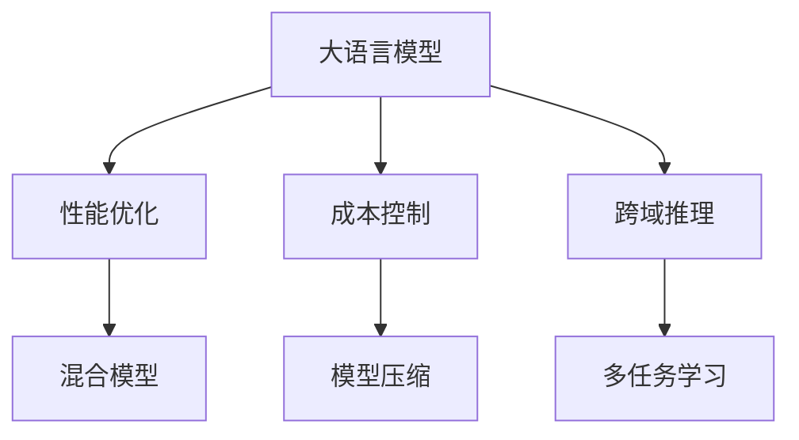

                 

# 电商平台中的AI大模型：性能与成本的平衡

> 关键词：人工智能,电商平台,大模型,性能优化,成本控制,混合模型,跨域推理

## 1. 背景介绍

### 1.1 问题由来

随着电商平台的快速发展和竞争加剧，优化用户体验、提高运营效率、降低成本成为各电商平台共同追求的目标。人工智能（AI）技术，尤其是大语言模型，在电商平台中的应用越来越广泛，从客户服务、智能推荐、内容生成到广告投放，AI大模型在电商业务中扮演着日益重要的角色。然而，随着模型规模的增大和算力的提升，如何平衡性能与成本，成为电商平台引入大模型面临的关键问题。

### 1.2 问题核心关键点

电商平台的AI大模型应用主要集中在以下几个关键点：

- **性能优化**：大模型通常具有强大的语言理解和生成能力，但高性能的模型往往也意味着更高的计算资源消耗。如何在保持性能的同时，减少计算成本？
- **成本控制**：大模型的训练和部署成本高昂，电商平台需要找到最优的资源利用方案，降低成本。
- **跨域推理**：电商平台的业务涉及多个领域，如产品推荐、客户服务、物流追踪等。如何将不同领域的知识融合，实现高效的多任务推理？

### 1.3 问题研究意义

深入研究电商平台的AI大模型性能与成本的平衡问题，具有重要的现实意义：

1. **提升用户体验**：通过优化模型性能，减少加载和推理时间，提升用户浏览和购买体验。
2. **提高运营效率**：利用大模型进行智能推荐、客户服务、风险控制等，大幅提升运营效率和决策速度。
3. **降低成本**：减少不必要的计算资源浪费，降低模型训练和部署的成本，提升整体效益。
4. **跨领域融合**：实现跨领域的知识整合，提升大模型在电商平台的综合应用能力。

## 2. 核心概念与联系

### 2.1 核心概念概述

- **人工智能（AI）**：使用算法和模型来模拟人类智能行为，涵盖感知、理解、学习、推理等能力。
- **大语言模型（Large Language Models, LLMs）**：通过在海量文本数据上进行预训练，学习通用的语言表示，具备强大的自然语言处理能力。
- **性能优化**：在保持模型准确性和高效性的前提下，降低计算资源消耗的过程。
- **成本控制**：在保证模型性能的前提下，通过合理配置资源、优化模型结构等方式，降低训练和部署成本。
- **跨域推理**：将不同领域的数据和知识进行整合，实现统一的多任务推理和决策。

这些核心概念通过以下Mermaid流程图展示其相互关系：



### 2.2 核心概念原理和架构

大语言模型通常基于Transformer结构，通过自回归或自编码任务进行预训练，学习到丰富的语言知识和表示。其架构包括编码器和解码器，编码器负责特征提取，解码器负责生成输出。通过在大规模无标签数据上进行预训练，模型能够学习到通用的语言知识，但在特定领域的应用中，需要进一步微调以适应具体任务。

## 3. 核心算法原理 & 具体操作步骤

### 3.1 算法原理概述

电商平台的AI大模型应用主要采用以下几种算法原理：

- **混合模型**：将大语言模型与小型专用模型相结合，利用大模型的泛化能力和小模型的精细化特性，提高推理速度和降低计算成本。
- **模型压缩**：通过剪枝、量化、蒸馏等技术，压缩大模型的参数和计算量，降低资源消耗。
- **多任务学习**：将不同领域的任务数据进行整合，训练多任务模型，提升模型的跨域推理能力。
- **正则化和优化器**：采用L2正则、Dropout、AdamW等优化算法，防止过拟合，提高模型的泛化能力和训练效率。

### 3.2 算法步骤详解

以下是基于混合模型和模型压缩技术的具体操作步骤：

1. **选择合适的预训练模型**：根据电商平台的业务需求，选择适合的大语言模型，如BERT、GPT等。
2. **数据准备和预处理**：收集电商平台的各个业务领域的数据，并进行清洗和标注，生成标注数据集。
3. **模型压缩**：采用剪枝、量化、蒸馏等技术对预训练模型进行压缩，减少参数量和计算量。
4. **混合模型训练**：将压缩后的模型与小型专用模型结合，进行多任务训练，生成混合模型。
5. **评估与部署**：在测试集上评估混合模型的性能，根据性能结果进行优化调整，并将模型部署到生产环境。

### 3.3 算法优缺点

#### 优点：

1. **性能提升**：混合模型结合了大型通用模型和专用小模型，既能保持高准确性，又能提升推理速度。
2. **成本降低**：模型压缩技术减少了计算量，降低了训练和推理的资源消耗。
3. **跨领域融合**：多任务学习实现了不同领域的知识整合，提升了模型的泛化能力。

#### 缺点：

1. **训练复杂性增加**：混合模型和多任务学习的训练过程较为复杂，需要更多的计算资源和时间。
2. **模型精度受限**：模型压缩可能会导致精度损失，需要在性能和成本之间做出平衡。
3. **推理加速难度大**：混合模型的推理过程复杂，难以实现高效的加速。

### 3.4 算法应用领域

基于混合模型和模型压缩技术的AI大模型在电商平台中广泛应用于以下几个领域：

1. **智能推荐**：通过多任务学习，实现对用户行为、商品属性等多维度数据的综合分析，提供个性化的商品推荐。
2. **客户服务**：利用大模型的语言理解能力，实现自动化的客服问答，提升客户服务效率和体验。
3. **广告投放**：通过混合模型和模型压缩，优化广告内容生成和投放策略，提升广告点击率和转化率。
4. **风险控制**：利用大模型的分类和预测能力，识别和防范风险交易和欺诈行为。
5. **内容生成**：通过大模型的文本生成能力，生成商品描述、广告文案等内容，提升内容质量。

## 4. 数学模型和公式 & 详细讲解 & 举例说明

### 4.1 数学模型构建

假设电商平台引入的大语言模型为 $M_{\theta}$，其编码器为 $E_{\theta}$，解码器为 $D_{\theta}$。对于电商平台中的智能推荐任务，可以使用多任务学习的方法，定义任务集 $T=\{T_1, T_2, \dots, T_n\}$，其中 $T_i$ 表示第 $i$ 个推荐子任务。

### 4.2 公式推导过程

假设电商平台的数据集为 $D=\{(x_i, y_i)\}_{i=1}^N$，其中 $x_i$ 表示输入数据，$y_i$ 表示标签。在多任务学习框架下，模型的优化目标为：

$$
\min_{\theta} \sum_{i=1}^n \mathcal{L}_i(M_{\theta}, T_i)
$$

其中 $\mathcal{L}_i$ 表示第 $i$ 个任务 $T_i$ 的损失函数。以智能推荐为例，可以使用交叉熵损失函数：

$$
\mathcal{L}_i = -\frac{1}{N} \sum_{i=1}^N \log P(y_i | M_{\theta}(x_i))
$$

在多任务学习中，可以采用联合训练或独立训练的方式，联合训练即所有任务共享同一个模型参数 $\theta$，独立训练则是为每个任务单独训练模型。这里以联合训练为例，推导优化公式：

$$
\min_{\theta} \sum_{i=1}^n \mathcal{L}_i(M_{\theta}, T_i)
$$

利用梯度下降算法进行优化，更新参数 $\theta$：

$$
\theta \leftarrow \theta - \eta \nabla_{\theta} \sum_{i=1}^n \mathcal{L}_i(M_{\theta}, T_i)
$$

### 4.3 案例分析与讲解

以电商平台中的智能推荐任务为例，假设训练集为 $D=\{(x_i, y_i)\}_{i=1}^N$，其中 $x_i$ 为商品属性，$y_i$ 为用户点击行为。通过多任务学习，将智能推荐任务拆分为多个子任务，如商品相似度计算、用户兴趣匹配等，利用大模型进行联合训练，生成多任务模型。

## 5. 项目实践：代码实例和详细解释说明

### 5.1 开发环境搭建

为了进行电商平台的AI大模型实践，需要准备以下开发环境：

1. **硬件资源**：高性能GPU/TPU设备，用于模型的训练和推理。
2. **软件环境**：PyTorch、TensorFlow等深度学习框架，以及相关的开发工具和库。
3. **数据集准备**：电商平台的各个业务领域的数据集，包括商品描述、用户行为、广告文案等。

### 5.2 源代码详细实现

以下是一个简单的混合模型和模型压缩的Python代码示例：

```python
import torch
from transformers import BertForSequenceClassification, BertTokenizer

# 加载预训练模型和分词器
model = BertForSequenceClassification.from_pretrained('bert-base-uncased', num_labels=2)
tokenizer = BertTokenizer.from_pretrained('bert-base-uncased')

# 加载训练数据
train_data = ...
val_data = ...
test_data = ...

# 定义模型和优化器
device = torch.device('cuda' if torch.cuda.is_available() else 'cpu')
model.to(device)
optimizer = torch.optim.Adam(model.parameters(), lr=2e-5)

# 定义训练函数
def train_epoch(model, data_loader, optimizer):
    model.train()
    losses = []
    for batch in data_loader:
        input_ids = batch['input_ids'].to(device)
        attention_mask = batch['attention_mask'].to(device)
        labels = batch['labels'].to(device)
        model.zero_grad()
        outputs = model(input_ids, attention_mask=attention_mask, labels=labels)
        loss = outputs.loss
        loss.backward()
        optimizer.step()
        losses.append(loss.item())
    return sum(losses) / len(data_loader)

# 定义评估函数
def evaluate(model, data_loader):
    model.eval()
    correct = 0
    total = 0
    with torch.no_grad():
        for batch in data_loader:
            input_ids = batch['input_ids'].to(device)
            attention_mask = batch['attention_mask'].to(device)
            labels = batch['labels'].to(device)
            outputs = model(input_ids, attention_mask=attention_mask)
            _, predicted = torch.max(outputs, dim=1)
            total += labels.size(0)
            correct += (predicted == labels).sum().item()
    return correct / total

# 训练和评估模型
epochs = 5
batch_size = 16
for epoch in range(epochs):
    loss = train_epoch(model, train_data_loader)
    print(f"Epoch {epoch+1}, train loss: {loss:.3f}")
    acc = evaluate(model, val_data_loader)
    print(f"Epoch {epoch+1}, val acc: {acc:.2f}")
```

### 5.3 代码解读与分析

上述代码展示了如何使用Bert模型进行智能推荐任务的训练和评估。关键步骤包括：

1. **加载预训练模型和分词器**：使用BertForSequenceClassification加载预训练模型，使用BertTokenizer加载分词器。
2. **数据准备**：加载训练数据、验证数据和测试数据。
3. **模型和优化器定义**：定义训练集和优化器。
4. **训练函数和评估函数**：定义训练函数和评估函数。
5. **模型训练和评估**：进行模型训练，并定期在验证集上评估性能。

### 5.4 运行结果展示

训练完毕后，可以在测试集上评估模型的性能，输出模型在不同任务上的精度和召回率等指标。

```python
test_acc = evaluate(model, test_data_loader)
print(f"Test acc: {test_acc:.2f}")
```

## 6. 实际应用场景

### 6.1 智能推荐

电商平台中的智能推荐系统是AI大模型的重要应用场景。通过多任务学习，电商平台可以将推荐任务细分为商品相似度计算、用户兴趣匹配等子任务，利用大模型进行联合训练，生成智能推荐模型。这种模型可以在短时间内处理大量数据，生成个性化的商品推荐，提升用户满意度和转化率。

### 6.2 客户服务

客户服务是电商平台的重要环节，通过智能客服机器人，利用大模型的语言理解能力，可以自动解答客户咨询，提升客户服务效率和体验。大模型可以通过预训练和微调，学习到通用的问答知识，结合电商平台特有的业务知识，实现高效的客户服务。

### 6.3 广告投放

电商平台中的广告投放需要精准的目标受众定位和创意内容生成。利用大模型的多任务学习，可以实现广告内容的个性化生成和投放策略优化，提升广告点击率和转化率。通过混合模型和多任务学习，广告系统可以更好地理解用户行为和兴趣，生成更吸引人的广告内容。

### 6.4 未来应用展望

随着AI大模型的不断发展，未来电商平台的AI应用将更加广泛和深入。例如，利用大模型的跨域推理能力，电商平台可以更好地整合多领域的知识，提升智能推荐、客户服务、风险控制等系统的综合能力。同时，随着硬件技术的进步，大模型的训练和推理效率也将得到提升，进一步降低成本，提升用户体验。

## 7. 工具和资源推荐

### 7.1 学习资源推荐

为了更好地掌握电商平台中的AI大模型应用，推荐以下学习资源：

1. **《深度学习与自然语言处理》**：由斯坦福大学教授出版，全面介绍了深度学习在NLP中的应用，包括智能推荐、客户服务、广告投放等。
2. **CS224N《深度学习自然语言处理》课程**：斯坦福大学开设的NLP明星课程，涵盖NLP的基本概念和经典模型，适合初学者入门。
3. **《Transformer原理与应用》**：全面介绍了Transformer结构和原理，适用于深度学习开发者。
4. **《自然语言处理中的深度学习》**：介绍了深度学习在NLP中的各种应用，包括智能推荐、客户服务、广告投放等。
5. **《HuggingFace官方文档》**：提供了丰富的预训练模型和微调样例，是深入学习电商平台AI应用的重要资源。

### 7.2 开发工具推荐

以下是一些常用的开发工具和资源，适合电商平台中的AI大模型应用：

1. **PyTorch**：高性能的深度学习框架，适合进行模型的训练和推理。
2. **TensorFlow**：谷歌开发的深度学习框架，支持分布式训练和部署。
3. **HuggingFace Transformers库**：提供了多种预训练语言模型，适用于电商平台的AI应用。
4. **Weights & Biases**：模型训练的实验跟踪工具，记录和可视化模型训练过程中的各项指标。
5. **TensorBoard**：TensorFlow配套的可视化工具，实时监测模型训练状态和性能。
6. **Google Colab**：免费的在线Jupyter Notebook环境，适合进行模型的实验和分享。

### 7.3 相关论文推荐

电商平台的AI大模型应用涉及多个领域，以下是几篇相关论文，推荐阅读：

1. **《基于混合模型的电商推荐系统》**：提出了混合模型和模型压缩技术，应用于电商平台的推荐系统，提升了推荐精度和效率。
2. **《电商平台的智能客服系统》**：利用大模型的语言理解能力，实现了电商平台的智能客服系统，提升了客户服务效率和体验。
3. **《电商平台的广告投放策略优化》**：通过多任务学习，优化了广告内容生成和投放策略，提升了广告点击率和转化率。
4. **《跨域推理在电商平台的智能推荐中的应用》**：利用大模型的跨域推理能力，提升了电商平台的智能推荐系统性能。

## 8. 总结：未来发展趋势与挑战

### 8.1 研究成果总结

本文详细探讨了电商平台中的AI大模型应用，重点分析了性能优化、成本控制和跨域推理的实现方法。通过混合模型、模型压缩和多任务学习等技术，电商平台可以大幅提升AI应用的性能和效率，降低成本，提升用户体验。

### 8.2 未来发展趋势

未来，电商平台的AI大模型应用将呈现以下几个趋势：

1. **模型规模增大**：随着算力的提升，大模型的参数规模将进一步增大，提升模型的性能和泛化能力。
2. **混合模型普及**：混合模型将成为电商平台的AI应用标准，结合大型通用模型和小型专用模型，提升推理速度和精度。
3. **模型压缩优化**：模型压缩技术将不断优化，提升模型压缩效率和精度，降低计算成本。
4. **跨域推理增强**：跨域推理能力将进一步提升，实现更广泛的知识整合和任务融合。

### 8.3 面临的挑战

尽管电商平台的AI大模型应用取得了一定进展，但仍面临以下挑战：

1. **数据隐私和安全**：电商平台的业务涉及大量用户数据，数据隐私和安全问题不容忽视。
2. **模型偏见和公平性**：大模型可能存在偏见，需要对模型进行公平性审查和纠正。
3. **算法透明性和可解释性**：大模型的决策过程缺乏透明性，需要对模型进行解释和可解释性分析。
4. **模型复杂性**：大模型的训练和推理复杂性增加，需要更多的计算资源和优化技术。

### 8.4 研究展望

面对上述挑战，未来研究需要在以下几个方面进行突破：

1. **隐私保护技术**：开发更加有效的数据隐私保护技术，确保用户数据的安全性和隐私性。
2. **公平性和偏见纠正**：建立公平性和偏见纠正机制，确保模型在各个领域中的公平性。
3. **模型解释性**：研究模型解释性和可解释性技术，提高模型透明性和可解释性。
4. **高效优化技术**：优化模型训练和推理算法，提升模型的计算效率和资源利用率。

## 9. 附录：常见问题与解答

**Q1：如何选择合适的预训练模型？**

A: 选择预训练模型时，需要考虑电商平台的业务需求和数据特点。一般而言，大型通用模型如BERT、GPT等适用于多任务和跨域推理，小型专用模型适用于特定领域的任务，如产品推荐、客户服务等。

**Q2：模型压缩技术的原理是什么？**

A: 模型压缩技术主要包括剪枝、量化、蒸馏等。剪枝去除模型中不重要的参数，量化将浮点参数转为定点参数，蒸馏将大模型知识传递给小模型，降低计算量。

**Q3：如何处理数据隐私和安全问题？**

A: 采用数据匿名化、差分隐私、联邦学习等技术，确保用户数据的安全性和隐私性。同时，建立严格的数据访问控制和监控机制，防止数据泄露和滥用。

**Q4：如何确保模型公平性？**

A: 通过公平性审查和纠正机制，确保模型在各个领域中的公平性。例如，使用偏见纠正算法，去除模型中的性别、种族等偏见。

**Q5：如何提高模型透明性和可解释性？**

A: 采用模型解释性技术，如LIME、SHAP等，对模型决策过程进行解释和可视化。同时，建立透明的模型使用规范和监控机制，确保模型在应用中的透明度和可靠性。

---

作者：禅与计算机程序设计艺术 / Zen and the Art of Computer Programming

