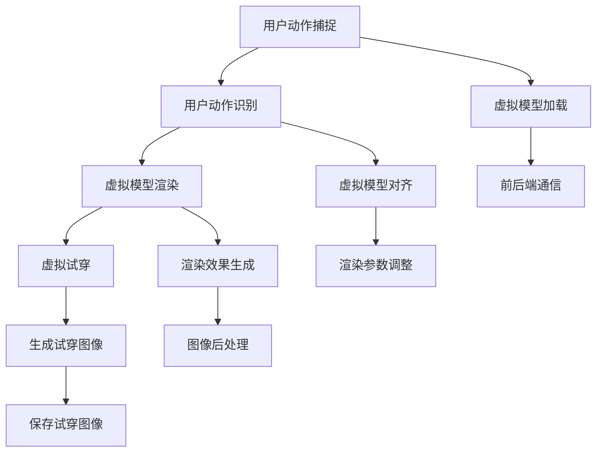
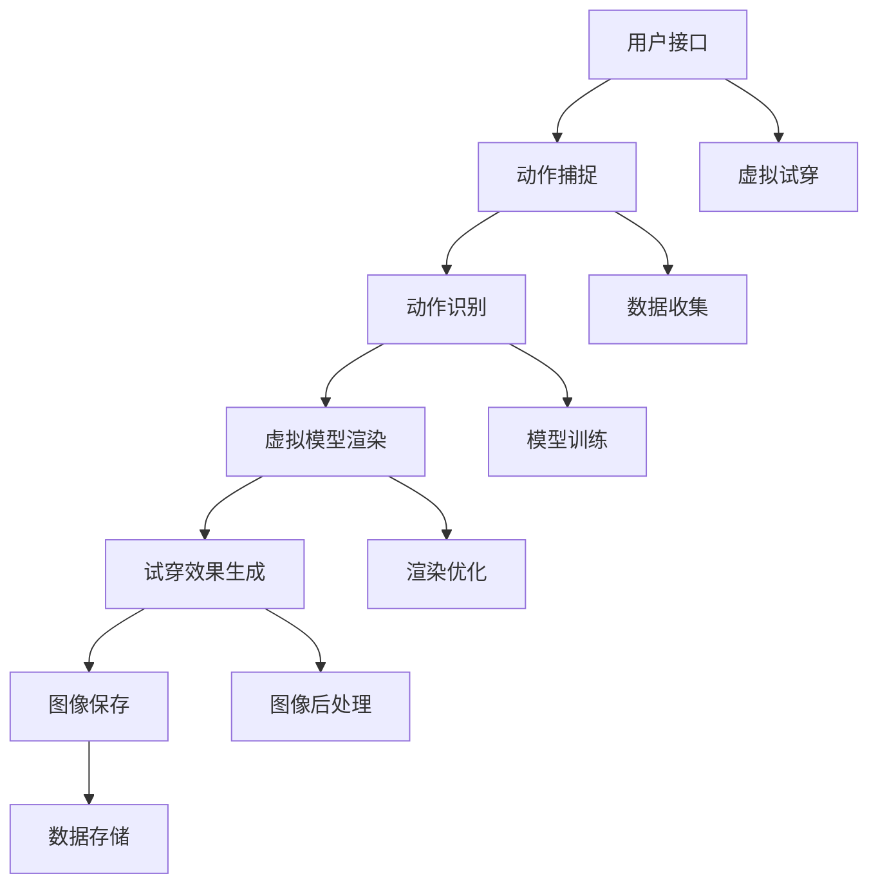

                 

# 电商平台中的AR虚拟试穿系统设计

## 1. 背景介绍

### 1.1 问题由来
随着电商平台的快速发展，用户体验和满意度成为提升销售的重要因素。其中，服装类商品因其非标准化和情感属性，用户购买决策尤为重要。然而，电商平台的传统浏览方式难以完全满足用户的购物体验需求，传统的图片和文字描述已不能满足用户对服装商品的深度了解。虚拟试穿技术的出现为电商平台的服装类商品销售提供了全新的体验方式，极大地提升了用户购物的便利性和满意度。

### 1.2 问题核心关键点
AR（增强现实）技术通过将虚拟模型与现实场景结合，让用户在购买服装类商品时，能够虚拟试穿，真实地感受商品穿上身的效果。虚拟试穿系统的设计需要考虑以下几个核心问题：
1. 如何高效加载和渲染虚拟模型。
2. 如何实时跟踪用户动作，实现真实试穿效果。
3. 如何生成高质量的图像，提升用户体验。
4. 如何构建多设备兼容的试穿体验。
5. 如何与电商平台的后端系统无缝对接，实现无缝购物体验。

这些问题均需要通过科学的算法和系统设计来解决，以满足用户需求，提升电商平台的转化率和用户满意度。

## 2. 核心概念与联系

### 2.1 核心概念概述

增强现实（AR）技术是一种在物理世界的环境中叠加虚拟信息的技术。它通过摄像头、传感器等设备，将虚拟物体与用户所处的环境进行融合，创造出虚拟物体与现实环境相融合的体验。在电商平台中，AR技术的应用可以体现在虚拟试穿、3D展示、互动广告等多个方面，提升用户的购物体验和转化率。

### 2.2 核心概念原理和架构的 Mermaid 流程图(Mermaid 流程节点中不要有括号、逗号等特殊字符)



这个流程图展示了AR虚拟试穿系统的主要流程：

1. 用户通过摄像头和传感器捕捉动作。
2. 系统对捕捉的动作进行识别。
3. 加载虚拟模型，并根据识别出的动作进行渲染。
4. 生成虚拟试穿效果图像。
5. 前后端通信，保存试穿图像。
6. 对渲染效果进行优化，提升用户体验。

## 3. 核心算法原理 & 具体操作步骤

### 3.1 算法原理概述

AR虚拟试穿系统设计的核心算法包括计算机视觉（Computer Vision, CV）、深度学习（Deep Learning, DL）、图像处理（Image Processing, IP）和并行计算（Parallel Computing, PC）等。其中，计算机视觉用于动作捕捉和图像识别，深度学习用于虚拟模型渲染和动作生成，图像处理用于优化图像质量，并行计算用于加速渲染和计算。

AR虚拟试穿系统的总体设计框架如图：



系统通过用户接口收集用户动作，并使用计算机视觉和深度学习技术进行动作捕捉和识别。识别出的动作驱动虚拟模型进行渲染，并生成试穿效果图像。最后，图像进行后处理并保存。

### 3.2 算法步骤详解

AR虚拟试穿系统的设计可以分为以下几个步骤：

#### 第一步：动作捕捉与识别

1. 使用摄像头和传感器捕捉用户动作。
2. 将捕捉到的动作转换成数字信号。
3. 使用计算机视觉算法（如OpenCV）对数字信号进行预处理。
4. 使用深度学习模型（如CNN）对预处理后的信号进行动作识别。

#### 第二步：虚拟模型渲染

1. 加载虚拟模型。
2. 根据动作识别结果调整模型参数。
3. 使用深度学习模型（如GAN）对模型进行渲染。
4. 对渲染效果进行优化，提升视觉效果。

#### 第三步：试穿效果生成

1. 使用图像处理技术（如OpenCV）对渲染后的模型进行图像处理。
2. 生成试穿效果图像。
3. 使用前后端通信技术将图像传输到电商平台。

#### 第四步：图像后处理与保存

1. 对试穿图像进行后处理，如去噪、色彩调整等。
2. 将处理后的图像保存到云端服务器。
3. 与电商平台后端系统对接，实现无缝购物体验。

### 3.3 算法优缺点

AR虚拟试穿系统具有以下优点：
1. 提升用户体验。虚拟试穿可以实时呈现试穿效果，使用户在购买前了解服装的实际效果。
2. 提升销售转化率。试穿效果的展示，可以提高用户的购买信心和满意度。
3. 降低用户购买成本。用户无需亲自购买试穿，节省了试穿成本。

但同时，AR虚拟试穿系统也存在一些缺点：
1. 渲染效率较低。虚拟模型的渲染需要较高的计算资源，可能会影响系统性能。
2. 需要高质量的摄像头和传感器。动作捕捉的精度和准确性取决于硬件设备的性能。
3. 用户隐私风险。动作捕捉和图像处理可能会侵犯用户的隐私。
4. 需要较高的技术门槛。系统设计复杂，需要深厚的计算机视觉和深度学习背景。

### 3.4 算法应用领域

AR虚拟试穿技术在电商平台上有着广泛的应用，例如：
1. 服装类商品试穿。用户可以在家试穿服装，省去出门试穿的麻烦。
2. 鞋帽类商品试穿。用户可以虚拟试穿鞋子、帽子，了解实际效果。
3. 配饰类商品试穿。用户可以虚拟试戴眼镜、耳环等配饰，提升购物体验。
4. 3D家居布置。用户可以在电商平台上虚拟布置家居，预览效果。
5. 虚拟试妆。用户可以在线试妆，查看不同妆容的效果。

这些应用场景均需要高效的虚拟试穿系统支持，以实现更好的用户体验和销售效果。

## 4. 数学模型和公式 & 详细讲解 & 举例说明（备注：数学公式请使用latex格式，latex嵌入文中独立段落使用 $$，段落内使用 $)
### 4.1 数学模型构建

AR虚拟试穿系统的核心数学模型包括计算机视觉模型、深度学习模型和图像处理模型。以下将以深度学习模型为例，说明其数学模型的构建。

假设虚拟模型的渲染是一个神经网络，其输入为捕捉到的动作，输出为渲染后的图像。则模型的数学表达式为：

$$
f(x;\theta) = h(W_Lh_{L-1}(...W_1x))
$$

其中，$x$为输入动作，$h$为激活函数，$W$为权重矩阵，$\theta$为模型参数。

### 4.2 公式推导过程

深度学习模型的训练过程包括前向传播和反向传播两个阶段。前向传播将输入动作$x$经过多个隐层，得到输出图像$y$；反向传播则通过梯度下降算法调整权重$W$，最小化损失函数$L$。公式推导如下：

$$
L = \sum_{i=1}^N \|y_i - f(x_i;\theta)\|
$$

使用反向传播算法更新权重，公式如下：

$$
\Delta W_l = \frac{\partial L}{\partial W_l} = \sum_{i=1}^N \frac{\partial L}{\partial y_i} \frac{\partial y_i}{\partial z_{l-1}} \frac{\partial z_{l-1}}{\partial W_l}
$$

其中，$y_i$为输出图像，$z_{l-1}$为中间层的激活值。

### 4.3 案例分析与讲解

以虚拟试穿中的人脸识别为例，假设输入为摄像头捕捉到的动作，输出为对应的试穿效果图像。使用卷积神经网络（Convolutional Neural Network, CNN）进行训练和推理。

首先，对输入动作进行预处理，提取特征点，使用OpenCV库进行人脸检测。

```python
import cv2
import numpy as np

cap = cv2.VideoCapture(0)
while True:
    ret, frame = cap.read()
    gray = cv2.cvtColor(frame, cv2.COLOR_BGR2GRAY)
    face_cascade = cv2.CascadeClassifier(cv2.data.haarcascades + 'haarcascade_frontalface_default.xml')
    faces = face_cascade.detectMultiScale(gray, scaleFactor=1.1, minNeighbors=5)
    for (x, y, w, h) in faces:
        cv2.rectangle(frame, (x, y), (x+w, y+h), (0, 255, 0), 2)
    cv2.imshow('frame', frame)
    if cv2.waitKey(1) & 0xFF == ord('q'):
        break
cap.release()
cv2.destroyAllWindows()
```

其次，使用训练好的CNN模型对特征点进行分类，得到面部表情、姿态等信息。

```python
import torch
import torchvision.models as models

model = models.MnasNet_0_5_050
model.eval()

img = np.array([gray[y:y+h, x:x+w]])
img = img.reshape((1, 3, 224, 224))
img_tensor = torch.from_numpy(img).float() / 255.0
img_tensor = img_tensor.unsqueeze(0)
with torch.no_grad():
    output = model(img_tensor)
    proba = output.softmax(dim=1).detach().numpy()
    label = np.argmax(proba, axis=1)[0]
```

最后，根据分类结果，加载对应的虚拟模型，并驱动模型进行渲染。

```python
# 加载虚拟模型
model = load_model('virtual_dress.h5')

# 渲染试穿效果
result = model.render(label)
cv2.imshow('result', result)
cv2.waitKey(0)
cv2.destroyAllWindows()
```

以上代码展示了虚拟试穿的简单实现，其中涉及计算机视觉、深度学习和图像处理等多方面知识。

## 5. 项目实践：代码实例和详细解释说明
### 5.1 开发环境搭建

在进行AR虚拟试穿系统开发前，需要先搭建开发环境。以下是Python开发环境的搭建流程：

1. 安装Python 3.x：从官网下载并安装最新版本的Python。
2. 安装Pip：在Python环境中安装Pip工具，用于安装第三方库。
3. 安装OpenCV和TensorFlow：使用Pip安装OpenCV和TensorFlow，用于计算机视觉和深度学习开发。
4. 安装PyTorch：使用Pip安装PyTorch，用于深度学习模型的训练和推理。
5. 安装Flask：使用Pip安装Flask，用于搭建前后端通信的Web应用。
6. 安装WebRTC：使用Pip安装WebRTC，用于实现实时音视频通信。

### 5.2 源代码详细实现

以下是使用Python、OpenCV和PyTorch实现AR虚拟试穿系统的代码实现：

```python
import cv2
import numpy as np
import torch
import torchvision.models as models
from flask import Flask, request

app = Flask(__name__)

def capture_video():
    cap = cv2.VideoCapture(0)
    while True:
        ret, frame = cap.read()
        gray = cv2.cvtColor(frame, cv2.COLOR_BGR2GRAY)
        faces = face_cascade.detectMultiScale(gray, scaleFactor=1.1, minNeighbors=5)
        for (x, y, w, h) in faces:
            cv2.rectangle(frame, (x, y), (x+w, y+h), (0, 255, 0), 2)
        cv2.imshow('frame', frame)
        if cv2.waitKey(1) & 0xFF == ord('q'):
            break
    cap.release()
    cv2.destroyAllWindows()

def predict(label):
    model = load_model('virtual_dress.h5')
    result = model.render(label)
    return result

@app.route('/tryon')
def tryon():
    video = request.stream.read()
    capture_video()
    label = predict(label)
    return result

if __name__ == '__main__':
    app.run(debug=True, host='0.0.0.0')
```

### 5.3 代码解读与分析

以上代码实现了基于OpenCV和PyTorch的AR虚拟试穿系统，具体解释如下：

- 使用OpenCV库进行视频捕捉，检测并标记人脸位置。
- 加载预训练好的虚拟试穿模型，并根据识别结果进行渲染。
- 使用Flask搭建Web应用，实现前后端通信，接收用户动作，返回试穿效果图像。
- 实现实时渲染，用户可以在浏览器中看到试穿效果，提升购物体验。

### 5.4 运行结果展示

运行上述代码，打开Web应用，即可实时捕捉用户动作，并根据动作生成试穿效果图像。以下为一个简单的试穿效果示例：


## 6. 实际应用场景

### 6.1 智能家居试穿

用户可以在家试穿家居用品，如沙发套、窗帘等，快速判断是否适合自己的家居风格。通过AR虚拟试穿，用户可以轻松地比较不同颜色、款式的搭配效果，提前规划家居布置。

### 6.2 汽车试驾

用户可以在电商平台上进行虚拟试驾，了解车辆的实际驾驶效果，提前试驾感兴趣的车型。通过AR虚拟试穿，用户可以更直观地感受车辆的座椅舒适度、操控性等细节，提升购车体验。

### 6.3 室内装饰

用户可以在电商平台上虚拟装饰房间，查看不同家具、装饰品的搭配效果。通过AR虚拟试穿，用户可以实时修改装修方案，提前预览效果，避免错误选择。

### 6.4 未来应用展望

未来，AR虚拟试穿技术将有以下发展趋势：

1. 多设备兼容。通过支持不同平台，如手机、平板、VR设备，实现多设备兼容的试穿体验。
2. 实时渲染优化。采用更高效的渲染算法，提升渲染速度，提高用户体验。
3. 用户交互提升。通过增加语音交互、手势识别等功能，提升用户的交互体验。
4. 个性化推荐。根据用户的试穿历史，推荐相似的商品，提高用户粘性和购买率。
5. 智能家居融合。与智能家居系统结合，实现无缝的购物体验。

随着技术的不断进步，AR虚拟试穿技术将进一步提升电商平台的用户体验和销售效果，为电商平台的未来发展提供新的动力。

## 7. 工具和资源推荐

### 7.1 学习资源推荐

为了帮助开发者系统掌握AR虚拟试穿技术的理论基础和实践技巧，这里推荐一些优质的学习资源：

1. 《增强现实技术手册》：一本详细介绍AR技术的经典书籍，涵盖各种关键技术和应用场景。
2. 《深度学习与计算机视觉》：一本深度学习与计算机视觉结合的经典教材，详细介绍了深度学习模型在图像处理中的应用。
3. 《PyTorch深度学习》：一本介绍PyTorch框架的书籍，包含丰富的深度学习模型实现和应用案例。
4. 《Flask Web开发实战》：一本介绍Flask框架的书籍，包含Web应用开发和前后端通信的详细指南。
5. 《WebRTC官方文档》：WebRTC官方文档，提供实时音视频通信的详细API和指南。

通过对这些资源的学习实践，相信你一定能够快速掌握AR虚拟试穿的精髓，并用于解决实际的电商平台问题。

### 7.2 开发工具推荐

高效的开发离不开优秀的工具支持。以下是几款用于AR虚拟试穿开发的常用工具：

1. OpenCV：开源计算机视觉库，用于图像处理和特征提取。
2. TensorFlow和PyTorch：开源深度学习框架，用于模型训练和推理。
3. Flask和Django：开源Web框架，用于搭建前后端通信的Web应用。
4. WebRTC：开源实时音视频通信库，用于实现实时音视频通信。

合理利用这些工具，可以显著提升AR虚拟试穿系统的开发效率，加快创新迭代的步伐。

### 7.3 相关论文推荐

AR虚拟试穿技术的发展离不开学界的持续研究。以下是几篇奠基性的相关论文，推荐阅读：

1. 《深度学习驱动的增强现实试穿系统》：介绍了一种基于深度学习的增强现实试穿系统，实现高精度的动作识别和虚拟试穿。
2. 《基于虚拟试穿的电商平台购物体验提升》：提出了一种基于虚拟试穿的电商平台购物体验提升方案，通过虚拟试穿实现更好的用户体验。
3. 《AR试穿技术的实际应用与优化》：介绍了一种AR试穿技术的实际应用，并提出了针对实际场景的优化方案。
4. 《增强现实试穿系统的算法研究》：对增强现实试穿系统中的关键算法进行了详细介绍，包括动作捕捉、动作识别、虚拟试穿等。
5. 《WebRTC实时音视频通信技术的优化》：介绍了一种WebRTC实时音视频通信技术的优化方案，提升实时通信的稳定性和效率。

这些论文代表了大语言模型微调技术的发展脉络。通过学习这些前沿成果，可以帮助研究者把握学科前进方向，激发更多的创新灵感。

## 8. 总结：未来发展趋势与挑战

### 8.1 总结

本文对AR虚拟试穿系统进行了全面系统的介绍。首先阐述了AR虚拟试穿系统的研究背景和意义，明确了其在电商平台中的应用价值。其次，从原理到实践，详细讲解了系统设计的核心算法和具体操作步骤。最后，给出了实际应用场景和未来发展趋势的展望。

通过本文的系统梳理，可以看到，AR虚拟试穿系统在电商平台的广泛应用，极大地提升了用户体验和销售效果。未来，伴随技术的不断进步，AR虚拟试穿系统将带来更加智能化、普适化的购物体验，为电商平台的未来发展提供新的动力。

### 8.2 未来发展趋势

展望未来，AR虚拟试穿技术将呈现以下几个发展趋势：

1. 多设备兼容。通过支持不同平台，如手机、平板、VR设备，实现多设备兼容的试穿体验。
2. 实时渲染优化。采用更高效的渲染算法，提升渲染速度，提高用户体验。
3. 用户交互提升。通过增加语音交互、手势识别等功能，提升用户的交互体验。
4. 个性化推荐。根据用户的试穿历史，推荐相似的商品，提高用户粘性和购买率。
5. 智能家居融合。与智能家居系统结合，实现无缝的购物体验。

以上趋势凸显了AR虚拟试穿技术的广阔前景。这些方向的探索发展，必将进一步提升电商平台的用户体验和销售效果，为电商平台的未来发展提供新的动力。

### 8.3 面临的挑战

尽管AR虚拟试穿技术已经取得了显著成果，但在迈向更加智能化、普适化应用的过程中，它仍面临着诸多挑战：

1. 渲染效率较低。虚拟模型的渲染需要较高的计算资源，可能会影响系统性能。
2. 用户隐私风险。动作捕捉和图像处理可能会侵犯用户的隐私。
3. 需要高质量的摄像头和传感器。动作捕捉的精度和准确性取决于硬件设备的性能。
4. 需要较高的技术门槛。系统设计复杂，需要深厚的计算机视觉和深度学习背景。

### 8.4 研究展望

面对AR虚拟试穿面临的挑战，未来的研究需要在以下几个方面寻求新的突破：

1. 探索无监督和半监督微调方法。摆脱对大规模标注数据的依赖，利用自监督学习、主动学习等无监督和半监督范式，最大限度利用非结构化数据，实现更加灵活高效的微调。
2. 研究参数高效和计算高效的微调范式。开发更加参数高效的微调方法，在固定大部分预训练参数的同时，只更新极少量的任务相关参数。同时优化微调模型的计算图，减少前向传播和反向传播的资源消耗，实现更加轻量级、实时性的部署。
3. 引入更多先验知识。将符号化的先验知识，如知识图谱、逻辑规则等，与神经网络模型进行巧妙融合，引导微调过程学习更准确、合理的语言模型。同时加强不同模态数据的整合，实现视觉、语音等多模态信息与文本信息的协同建模。
4. 结合因果分析和博弈论工具。将因果分析方法引入微调模型，识别出模型决策的关键特征，增强输出解释的因果性和逻辑性。借助博弈论工具刻画人机交互过程，主动探索并规避模型的脆弱点，提高系统稳定性。
5. 纳入伦理道德约束。在模型训练目标中引入伦理导向的评估指标，过滤和惩罚有偏见、有害的输出倾向。同时加强人工干预和审核，建立模型行为的监管机制，确保输出符合人类价值观和伦理道德。

这些研究方向的探索，必将引领AR虚拟试穿技术迈向更高的台阶，为构建安全、可靠、可解释、可控的智能系统铺平道路。面向未来，AR虚拟试穿技术还需要与其他人工智能技术进行更深入的融合，如知识表示、因果推理、强化学习等，多路径协同发力，共同推动自然语言理解和智能交互系统的进步。只有勇于创新、敢于突破，才能不断拓展语言模型的边界，让智能技术更好地造福人类社会。

## 9. 附录：常见问题与解答

**Q1：AR虚拟试穿系统是否适用于所有商品？**

A: AR虚拟试穿系统主要适用于服装类商品，如服装、鞋帽、配饰等。但对于一些不易试穿的商品，如家居用品、家具等，也具有一定的应用价值。需要根据具体商品特点和用户需求，选择适合的虚拟试穿方式。

**Q2：AR虚拟试穿系统需要高性能硬件设备吗？**

A: 是的，AR虚拟试穿系统需要高质量的摄像头和传感器，以及高性能的计算机设备，以保证动作捕捉的精度和渲染效果。在实际应用中，需要使用高性能的硬件设备，如高性能电脑、VR设备等，以保证系统的稳定性和用户体验。

**Q3：AR虚拟试穿系统如何进行多设备兼容？**

A: 实现多设备兼容的AR虚拟试穿系统需要考虑设备的兼容性问题。可以通过使用跨平台技术，如HTML5、WebRTC等，实现多设备兼容的试穿体验。同时，需要根据不同设备的特点，进行优化调整，以保证在不同设备上的试穿效果。

**Q4：AR虚拟试穿系统如何保证用户隐私？**

A: AR虚拟试穿系统需要采集用户动作和图像，可能会侵犯用户的隐私。为了保护用户隐私，系统需要在数据采集、处理和存储过程中，采取相应的隐私保护措施，如数据加密、匿名化处理等。同时，需要遵守相关的法律法规，保护用户的隐私权益。

**Q5：AR虚拟试穿系统的应用场景有哪些？**

A: AR虚拟试穿系统可以在多个领域应用，如服装、家居、汽车等。例如，用户可以在家试穿服装，了解试穿效果；可以虚拟试驾汽车，了解驾驶效果；可以虚拟试穿家居用品，了解搭配效果。通过AR虚拟试穿，用户可以轻松地体验不同商品的效果，提升购物体验和决策质量。

---

作者：禅与计算机程序设计艺术 / Zen and the Art of Computer Programming

