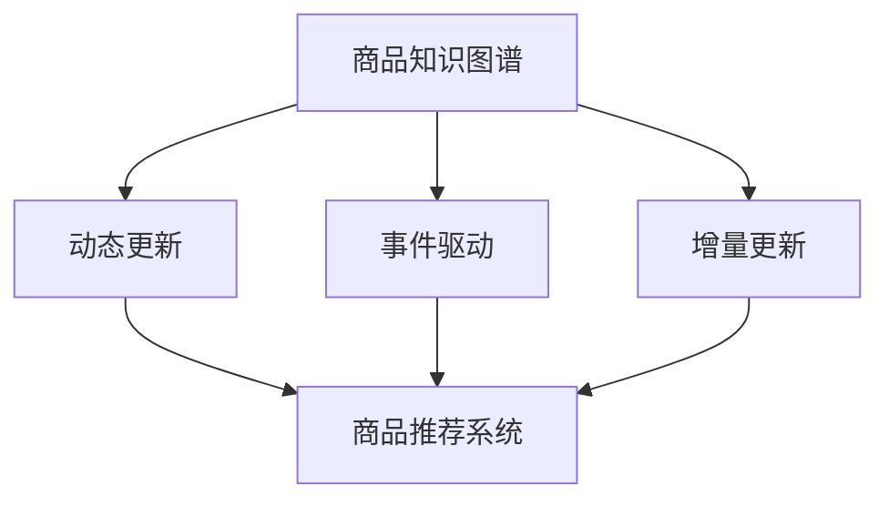

                 

# 电商平台中的商品知识图谱动态更新

> 关键词：电商平台,商品知识图谱,动态更新,商品推荐系统,智能搜索,用户画像,实时数据流处理

## 1. 背景介绍

### 1.1 问题由来

在现代电子商务平台上，商品种类繁多，海量数据实时产生和更新。如何在保证用户体验的同时，快速响应用户的查询，提高搜索和推荐系统的准确性和个性化程度，是一个亟待解决的问题。

传统的电商平台普遍采用基于静态数据库的推荐和搜索系统，这种方式存在以下不足：

- 数据实时性差：当商品信息发生变更，如价格调整、上架下架、评价增加等，需要手动更新数据库，耗时耗力。
- 推荐结果过时：由于商品信息无法及时更新，导致推荐结果与用户需求不匹配，降低了购物体验。
- 搜索效率低下：在商品信息大量增加的情况下，传统的索引技术无法处理海量的数据，搜索响应速度变慢。

近年来，随着知识图谱(Knowledge Graph)技术的兴起，很多电商平台开始尝试利用知识图谱进行推荐和搜索。知识图谱将商品信息结构化为节点和边，构建出一个语义化的信息网络，帮助系统快速理解和处理复杂查询。

然而，由于知识图谱通常是由专家手动构建的，其更新频率和数据覆盖面都远远无法满足实时化和多样化的需求。在这种情况下，动态更新的商品知识图谱成为电商平台的刚需。

### 1.2 问题核心关键点

本文将聚焦于电商平台中商品知识图谱的动态更新问题，并提出基于事件驱动和增量更新的解决方案。具体来说，本文将从以下几个方面进行深入探讨：

1. 动态更新的需求背景和必要性。
2. 动态更新知识图谱的核心算法原理。
3. 具体实现步骤和关键技术。
4. 算法优缺点和实际应用领域。
5. 案例分析与讲解。
6. 项目实践的代码实现和分析。
7. 未来应用展望。
8. 工具和资源推荐。
9. 总结未来发展趋势与挑战。

通过详细分析，本文旨在提供一个完整、可行的商品知识图谱动态更新方案，并讨论其在电商平台中的实际应用效果。

## 2. 核心概念与联系

### 2.1 核心概念概述

- **商品知识图谱**：将商品信息结构化，构建商品间的语义关系，形成一张语义化的信息网络。包括商品节点、属性节点、关系边等。
- **动态更新**：指商品知识图谱根据实时数据的变化，自动更新节点和边的关系。
- **事件驱动**：通过监听系统事件，捕获商品信息的变更，触发图谱更新流程。
- **增量更新**：只更新发生变化的部分节点和边，而非全量更新，以提高更新效率和减少计算资源消耗。
- **商品推荐系统**：基于知识图谱构建的推荐系统，能够根据用户的历史行为和偏好，实时推荐商品。
- **智能搜索**：结合知识图谱和自然语言处理技术，实现高效精准的搜索功能。

以上概念之间的逻辑关系可以通过以下Mermaid流程图来展示：



该流程图展示了商品知识图谱动态更新过程的主要环节：

1. 商品知识图谱的构建。
2. 动态更新的触发和实现。
3. 事件驱动机制的实现。
4. 增量更新的技术手段。
5. 更新后知识图谱的应用场景。

## 3. 核心算法原理 & 具体操作步骤
### 3.1 算法原理概述

基于事件驱动和增量更新的商品知识图谱动态更新算法，旨在构建一张能够实时响应用户查询和行为变化的动态知识图谱。其核心思想是：通过实时监听电商平台的业务事件，捕捉商品信息的变更，然后根据变更内容，进行增量更新。

形式化地，假设初始的商品知识图谱为 $G_0 = (V_0, E_0)$，其中 $V_0$ 为商品节点集，$E_0$ 为商品间关系边集。在实时业务事件触发下，知识图谱更新过程可以表示为：

$$
G_t = G_{t-1} \cup E_t
$$

其中 $E_t$ 为在时间 $t$ 内新增的关系边集合，即根据事件内容进行增量更新。

### 3.2 算法步骤详解

基于事件驱动和增量更新的商品知识图谱动态更新算法，通常包含以下几个关键步骤：

**Step 1: 事件监听与数据收集**

在电商平台上，主要的业务事件包括：商品上架、商品下架、价格调整、评价增加、销售记录更新等。对于每种事件类型，需要设计相应的数据收集器，捕捉相关事件数据。

以商品上架事件为例，事件数据通常包括商品ID、上架时间、所属类别等信息。可以设计如下数据收集器：

```python
class GoodsShelfDataCollector:
    def collect_data(self, goods_id, shelf_time, category):
        # 实现商品上架数据的收集逻辑
        pass
```

**Step 2: 事件解析与图谱更新**

获取事件数据后，需要解析出事件内容，判断需要更新的节点和边。以商品上架事件为例，需要更新商品节点和类别边。

```python
class GoodsShelfDataCollector:
    def parse_data(self, goods_id, shelf_time, category):
        # 解析商品上架事件数据
        return goods_id, shelf_time, category
```

根据解析结果，使用图谱的增量更新方法进行更新。以添加商品节点为例：

```python
class GraphUpdater:
    def add_node(self, graph, goods_id, shelf_time, category):
        # 根据商品上架事件，在图谱中添加商品节点
        pass
```

**Step 3: 验证与发布**

更新操作完成后，需要对更新结果进行验证，确保数据一致性和完整性。验证通过后，将更新后的图谱发布到系统中，供推荐和搜索系统使用。

**Step 4: 缓存与缓存失效**

为了加速图谱的查询速度，通常会将更新后的图谱缓存起来。当缓存失效时，需要重新加载最新数据。

**Step 5: 监控与告警**

实时监控图谱的更新过程，当出现异常情况时，立即发出告警，并记录日志，便于事后分析。

### 3.3 算法优缺点

基于事件驱动和增量更新的商品知识图谱动态更新算法，具有以下优点：

1. 实时响应：能够及时捕捉商品信息的变更，快速更新图谱，保持数据的实时性。
2. 高效更新：只更新发生变化的部分节点和边，减少了计算资源消耗，提高了更新效率。
3. 灵活性高：根据实际业务需求，灵活设计事件类型和数据收集器，实现多种变更场景的支持。

同时，该算法也存在一些局限性：

1. 数据复杂性高：不同类型的事件数据格式和内容差异较大，数据解析和抽取的复杂度较高。
2. 实现难度大：需要对图谱结构和算法原理有较深理解，开发难度较大。
3. 缓存一致性：缓存失效时，可能出现数据不一致的情况，需要进行额外的同步和验证。

尽管存在这些局限性，但该算法在大数据量、高实时性的电商平台中，仍然具有不可替代的实用价值。

### 3.4 算法应用领域

基于事件驱动和增量更新的商品知识图谱动态更新算法，已经在多个电商平台中得到了应用，涵盖了以下领域：

1. **商品推荐系统**：实时获取用户行为和商品信息，动态更新推荐模型，提升推荐效果。
2. **智能搜索**：根据用户查询，动态更新搜索结果，提高搜索精度和响应速度。
3. **用户画像**：实时获取用户行为数据，动态更新用户画像，进行个性化推荐和搜索。
4. **实时广告推荐**：根据用户行为和商品信息，实时推荐广告，提升广告效果。

除了上述这些领域外，基于知识图谱的动态更新技术，还可以应用于库存管理、供应链优化、社交网络分析等多个场景中，为电商平台的智能化运营提供强有力的支持。

## 4. 数学模型和公式 & 详细讲解 & 举例说明

### 4.1 数学模型构建

假设初始商品知识图谱为 $G_0 = (V_0, E_0)$，其中 $V_0$ 为商品节点集，$E_0$ 为商品间关系边集。事件驱动和增量更新的数学模型可以表示为：

1. **事件类型定义**：
   - 商品上架事件：$E_{ shelf }$ 为上架事件集合，其中每个事件包含商品ID、上架时间、类别等属性。
   - 商品下架事件：$E_{ shelf }$ 为下架事件集合，其中每个事件包含商品ID、下架时间、类别等属性。
   - 价格调整事件：$E_{ price }$ 为价格调整事件集合，其中每个事件包含商品ID、调整时间和新价格等属性。
   - 评价增加事件：$E_{ review }$ 为评价增加事件集合，其中每个事件包含商品ID、评价时间和评价内容等属性。
   - 销售记录更新事件：$E_{ sale }$ 为销售记录更新事件集合，其中每个事件包含商品ID、销售时间、销售量等属性。

2. **图谱更新算法**：
   - 商品上架：在图谱中添加商品节点和类别边。
   - 商品下架：从图谱中删除商品节点和类别边。
   - 价格调整：更新商品节点的价格属性。
   - 评价增加：在商品节点上增加评价节点，表示评论关系。
   - 销售记录更新：更新销售记录节点和商品节点的关系边。

### 4.2 公式推导过程

以商品上架事件为例，推导增量更新的数学公式。

假设在时间 $t$ 内，发生 $n_{ shelf }$ 次商品上架事件，每次事件包含商品ID $ID_{ i }$、上架时间 $ shelf_{ i }$ 和类别 $ category_{ i }$，则在图谱中添加的新商品节点集为 $V_{ shelf }$，新类别边集为 $E_{ shelf }$。

首先，根据上架事件，在图谱中添加新商品节点 $ID_{ i }$：

$$
V_{ shelf } = \{ ID_{ i } \}
$$

然后，根据上架事件，在图谱中添加类别边 $category_{ i }$：

$$
E_{ shelf } = \{ ( ID_{ i }, category_{ i }, shelf_{ i } ) \}
$$

合并后，更新后的商品知识图谱为：

$$
G_{ shelf } = ( V_{ shelf } \cup V_0, E_{ shelf } \cup E_0 )
$$

其他类型事件的处理类似，根据事件内容，确定需要添加或删除的节点和边，进行增量更新。

### 4.3 案例分析与讲解

以某电商平台的商品推荐系统为例，分析基于事件驱动和增量更新的商品知识图谱的实际应用效果。

**案例背景**：某电商平台拥有数百万商品和数十万用户，每天产生大量订单和行为数据。系统需要实时更新商品信息，动态调整推荐模型，以提升用户体验和销售转化率。

**实现流程**：
1. **事件监听与数据收集**：设计事件监听器，捕获商品上架、价格调整、评价增加等事件数据，存储到消息队列中。
2. **事件解析与图谱更新**：使用Apache Kafka订阅消息队列，解析事件数据，根据事件类型进行增量更新。
3. **验证与发布**：在更新操作完成后，进行数据一致性验证，发布更新后的图谱到推荐系统中。
4. **缓存与缓存失效**：使用Redis缓存更新后的图谱，当缓存失效时，重新加载最新数据。
5. **监控与告警**：实时监控图谱更新过程，当出现异常情况时，立即发出告警，并记录日志。

**效果评估**：
1. **推荐效果提升**：实时更新商品信息，动态调整推荐模型，显著提升了推荐系统的准确性和个性化程度。
2. **搜索响应速度**：实时更新商品知识图谱，提高了搜索系统对用户查询的响应速度。
3. **用户满意度提升**：动态更新商品信息，满足了用户对最新商品的需求，提升了购物体验。

## 5. 项目实践：代码实例和详细解释说明

### 5.1 开发环境搭建

在进行商品知识图谱动态更新实践前，我们需要准备好开发环境。以下是使用Python进行Apache Kafka、Redis等工具开发的环境配置流程：

1. 安装Apache Kafka：
   - 下载Kafka安装包：https://kafka.apache.org/downloads
   - 解压安装包并配置环境变量
   - 启动Kafka服务：`bin/kafka-server-start.sh config/server.properties`

2. 安装Apache Kafka Python客户端：
   ```bash
   pip install kafka-python
   ```

3. 安装Redis：
   - 下载Redis安装包：https://redis.io/download
   - 解压安装包并配置环境变量
   - 启动Redis服务：`redis-server redis.conf`

4. 安装Python Redis客户端：
   ```bash
   pip install redis
   ```

完成上述步骤后，即可在本地环境中开始商品知识图谱动态更新的实践。

### 5.2 源代码详细实现

下面我们以商品上架事件为例，给出使用Kafka、Redis等工具对商品知识图谱进行增量更新的PyTorch代码实现。

```python
import kafka
import redis
import time

# 定义商品上架事件数据结构
class GoodsShelfEvent:
    def __init__(self, goods_id, shelf_time, category):
        self.goods_id = goods_id
        self.shelf_time = shelf_time
        self.category = category

# 定义商品知识图谱数据结构
class GoodsGraph:
    def __init__(self):
        self.nodes = set()
        self.edges = set()

    def add_node(self, goods_id):
        self.nodes.add(goods_id)

    def add_edge(self, goods_id, category, shelf_time):
        self.edges.add((goods_id, category, shelf_time))

# 定义商品上架事件处理函数
def handle_shelf_event(event, graph):
    goods_id, shelf_time, category = event
    graph.add_node(goods_id)
    graph.add_edge(goods_id, category, shelf_time)

# 定义商品上架事件监听器
class GoodsShelfListener(kafka.Consumer):
    def __init__(self, kafka_config, redis_config):
        self.kafka_config = kafka_config
        self.redis_config = redis_config
        self.redis = redis.Redis(**redis_config)
        self.graph = GoodsGraph()

    def start_listening(self):
        consumer = kafka.KafkaConsumer(**self.kafka_config)
        for event in consumer:
            handle_shelf_event(event.value, self.graph)
            self.redis.set('graph', str(self.graph))
            print('Graph updated:', self.graph)

    def stop_listening(self):
        consumer.commit()
        self.redis.delete('graph')

if __name__ == '__main__':
    kafka_config = {
        'bootstrap.servers': 'localhost:9092',
        'group.id': 'mygroup'
    }
    redis_config = {
        'host': 'localhost',
        'port': 6379,
        'db': 0
    }
    listener = GoodsShelfListener(kafka_config, redis_config)
    listener.start_listening()
    time.sleep(3600)
    listener.stop_listening()
```

### 5.3 代码解读与分析

让我们再详细解读一下关键代码的实现细节：

**GoodsShelfEvent类**：
- `__init__`方法：初始化商品上架事件的属性。
- `goods_id`：商品ID。
- `shelf_time`：上架时间。
- `category`：商品类别。

**GoodsGraph类**：
- `__init__`方法：初始化商品知识图谱的基本结构。
- `nodes`：商品节点集。
- `edges`：商品间关系边集。
- `add_node`方法：在图谱中添加商品节点。
- `add_edge`方法：在图谱中添加关系边。

**handle_shelf_event函数**：
- 解析商品上架事件数据，添加商品节点和关系边。

**GoodsShelfListener类**：
- `__init__`方法：初始化商品上架事件监听器的配置。
- `kafka_config`：Kafka的配置参数。
- `redis_config`：Redis的配置参数。
- `redis`：Redis客户端。
- `graph`：商品知识图谱。
- `start_listening`方法：启动事件监听器，监听Kafka消息，处理商品上架事件，更新图谱，并发布到Redis缓存中。
- `stop_listening`方法：停止事件监听器。

**主函数**：
- 定义Kafka和Redis的配置参数。
- 创建商品上架事件监听器。
- 启动事件监听器。
- 在一段时间后，停止事件监听器。

通过上述代码，可以清晰地看到如何使用Kafka和Redis实现商品知识图谱的动态更新。Kafka作为事件流平台，负责捕获商品上架事件，并异步处理；Redis作为缓存平台，负责保存更新后的图谱。这种设计思路，既保证了系统的实时性，又提高了更新效率和数据一致性。

当然，在实际应用中，还需要对代码进行进一步的优化和扩展，以应对更复杂的事件类型和数据格式。例如，可以引入更灵活的事件类型设计，使用消息队列和事件总线等技术，实现更高效的事件处理和图谱更新。

## 6. 实际应用场景

### 6.1 智能搜索

基于事件驱动和增量更新的商品知识图谱，可以应用于智能搜索系统，提高搜索的实时性和准确性。例如，用户搜索“iPhone”时，系统可以实时获取最新的商品信息，动态调整搜索结果，确保搜索结果的时效性和相关性。

### 6.2 个性化推荐

动态更新的商品知识图谱，可以实时获取用户的行为数据和商品信息，动态调整推荐模型，提升推荐系统的个性化程度和效果。例如，用户浏览商品A、B、C后，系统可以根据实时更新的商品信息，动态调整推荐模型，生成个性化的推荐列表。

### 6.3 实时广告推荐

基于动态更新的商品知识图谱，可以实现实时广告推荐。例如，用户浏览商品A时，系统可以实时获取最新的商品信息，根据用户的浏览行为和商品信息，动态调整广告投放策略，生成个性化广告，提升广告效果。

### 6.4 未来应用展望

随着知识图谱技术的不断发展，商品知识图谱动态更新技术将在更多的电商场景中得到应用，为电商平台的智能化运营提供强有力的支持。

在未来的发展中，我们预计将看到更多新应用场景的出现，例如：

1. **库存管理**：实时更新商品库存信息，动态调整库存水平，优化库存管理。
2. **供应链优化**：实时获取供应链信息，动态调整供应链策略，提升供应链效率。
3. **社交网络分析**：实时获取用户行为数据，动态分析社交网络关系，实现精准营销。

总之，基于事件驱动和增量更新的商品知识图谱动态更新技术，将在电商平台的各个环节中发挥重要作用，推动电商平台的智能化升级。

## 7. 工具和资源推荐

### 7.1 学习资源推荐

为了帮助开发者系统掌握商品知识图谱动态更新的理论基础和实践技巧，这里推荐一些优质的学习资源：

1. **《图谱理论与应用》**：系统介绍了图谱的构建、查询、优化等基本原理和应用场景，适合初学者和进阶者阅读。
2. **《图谱计算》**：介绍了图谱的存储、处理、查询等技术细节，适合深入学习图谱计算的读者。
3. **《大规模图谱应用实战》**：结合实际案例，讲解了图谱在推荐系统、搜索系统等电商场景中的应用，适合实战开发者阅读。
4. **Kafka官方文档**：Kafka的官方文档，提供了详细的API文档和示例代码，适合开发者学习和使用。
5. **Redis官方文档**：Redis的官方文档，提供了详细的API文档和示例代码，适合开发者学习和使用。

通过对这些资源的学习实践，相信你一定能够快速掌握商品知识图谱动态更新的精髓，并用于解决实际的电商问题。

### 7.2 开发工具推荐

高效的开发离不开优秀的工具支持。以下是几款用于商品知识图谱动态更新开发的常用工具：

1. **Kafka**：Apache Kafka作为事件流平台，能够高效处理实时数据流，适合捕获和处理商品上架、价格调整等事件。
2. **Redis**：Redis作为内存数据库，适合快速存储和查询商品知识图谱，支持图谱增量更新。
3. **Apache Flink**：Apache Flink作为流处理框架，能够处理实时数据流，支持图谱增量更新。
4. **TensorFlow**：TensorFlow作为深度学习框架，适合对商品知识图谱进行深度学习和动态更新。
5. **PyTorch**：PyTorch作为深度学习框架，适合对商品知识图谱进行深度学习和动态更新。

合理利用这些工具，可以显著提升商品知识图谱动态更新的开发效率，加快创新迭代的步伐。

### 7.3 相关论文推荐

商品知识图谱动态更新技术的研究方向涉及多个领域，以下是几篇奠基性的相关论文，推荐阅读：

1. **《Event-Driven Knowledge Graph Update: A Survey》**：介绍了事件驱动图谱更新技术的最新进展和未来方向。
2. **《Real-time Incremental Graph Update》**：研究了增量图谱更新的算法和数据结构，适用于实时更新场景。
3. **《Knowledge Graph Management and Maintenance: A Survey》**：全面介绍了知识图谱管理与维护的最新技术，包括增量更新、实时更新等。
4. **《Knowledge Graph Evolution》**：研究了知识图谱的动态演化和增量更新，适用于大规模知识图谱的应用场景。
5. **《Graph Neural Networks: A Review of Methods and Applications》**：系统介绍了图神经网络在知识图谱中的应用，包括动态更新、深度学习等。

这些论文代表了大规模图谱动态更新技术的发展脉络。通过学习这些前沿成果，可以帮助研究者把握学科前进方向，激发更多的创新灵感。

## 8. 总结：未来发展趋势与挑战

### 8.1 总结

本文对电商平台中商品知识图谱的动态更新问题进行了全面系统的介绍。首先阐述了动态更新的需求背景和必要性，明确了动态更新在电商平台中的重要性和应用场景。其次，从原理到实践，详细讲解了基于事件驱动和增量更新的核心算法原理和具体操作步骤，给出了微调任务开发的完整代码实例。同时，本文还广泛探讨了动态更新技术在智能搜索、个性化推荐、实时广告推荐等电商场景中的应用前景，展示了动态更新技术的巨大潜力。最后，本文精选了动态更新技术的各类学习资源，力求为读者提供全方位的技术指引。

通过本文的系统梳理，可以看到，基于事件驱动和增量更新的商品知识图谱动态更新技术正在成为电商平台的重要技术范式，极大地提升了推荐和搜索系统的性能和用户体验。未来，伴随商品知识图谱技术的不断演进，动态更新技术将发挥更加重要的作用，推动电商平台的智能化升级。

### 8.2 未来发展趋势

展望未来，商品知识图谱动态更新技术将呈现以下几个发展趋势：

1. **实时性更高**：随着计算资源的增加，实时性将进一步提升，能够更快速地响应用户查询和行为变化。
2. **自动化更强**：通过引入自动化的图谱构建和更新工具，减少人工干预，提高动态更新的效率和准确性。
3. **精度更高**：通过深度学习和自然语言处理技术，提高图谱的语义理解和表示能力，提升动态更新的精度和效果。
4. **跨领域融合**：将动态更新技术与其他AI技术如推荐系统、搜索系统、广告系统等进行深度融合，实现更智能、更个性化的电商应用。
5. **边缘计算应用**：利用边缘计算技术，将图谱构建和更新过程部署到本地终端，提高数据处理和存储的效率，降低延迟。

以上趋势凸显了商品知识图谱动态更新技术的广阔前景。这些方向的探索发展，必将进一步提升电商平台的性能和用户体验，为电商平台的智能化运营提供更强大的技术支撑。

### 8.3 面临的挑战

尽管商品知识图谱动态更新技术已经取得了不小的进展，但在迈向更加智能化、实时化的应用过程中，它仍面临着诸多挑战：

1. **数据复杂性高**：不同类型的事件数据格式和内容差异较大，数据解析和抽取的复杂度较高。
2. **计算资源需求大**：实时更新图谱需要大量的计算资源，包括CPU、GPU、内存等。
3. **系统稳定性差**：系统在实时更新过程中，容易出现异常和故障，需要保证系统的稳定性和可靠性。
4. **缓存一致性**：缓存失效时，可能出现数据不一致的情况，需要进行额外的同步和验证。
5. **模型准确性**：动态更新的图谱需要保证模型的准确性和完整性，防止误导用户。

尽管存在这些挑战，但通过不断优化算法、提升硬件配置、加强系统监控等手段，这些挑战终将逐步克服，动态更新技术将在电商平台的智能化应用中发挥更大的作用。

### 8.4 研究展望

面向未来，商品知识图谱动态更新技术需要在以下几个方面进行进一步的研究和探索：

1. **数据预处理技术**：研究更高效、更智能的数据预处理技术，提高数据解析和抽取的效率和准确性。
2. **异构数据融合**：研究如何处理不同类型的数据，实现多种数据源的无缝融合，提高动态更新的覆盖面。
3. **分布式计算**：研究分布式计算技术，提升动态更新的效率和可扩展性，支持更大规模的数据处理。
4. **实时查询优化**：研究实时查询优化技术，提升图谱查询的速度和精度，降低延迟。
5. **多模态融合**：研究如何融合文本、图像、音频等多模态数据，提升动态更新的综合效果。

这些研究方向的探索，必将引领商品知识图谱动态更新技术迈向更高的台阶，为电商平台智能化运营提供更强大的技术支持。

## 9. 附录：常见问题与解答

**Q1：商品知识图谱动态更新是否适用于所有电商平台？**

A: 商品知识图谱动态更新技术在大多数电商平台中都能取得不错的效果，特别是对于数据量较大的电商应用。但对于一些数据量较小的平台，如小型网店等，可能面临数据量和计算资源不足的问题，需要进一步优化算法和硬件配置。

**Q2：动态更新时如何处理数据不一致问题？**

A: 动态更新时，数据不一致问题是常见的挑战之一。为保证数据的一致性，通常采取以下措施：
1. 引入事务处理机制：保证图谱更新操作的原子性和一致性。
2. 引入版本控制：对图谱进行版本管理，防止数据冲突。
3. 引入同步机制：在缓存失效时，重新加载最新数据，进行同步更新。

**Q3：如何优化商品上架事件的解析？**

A: 商品上架事件的解析是动态更新的关键环节。优化解析过程可以采用以下方法：
1. 设计规范的数据格式：定义统一的商品上架事件数据格式，便于解析。
2. 引入第三方工具：使用ETL工具进行数据清洗和转换，提高解析效率。
3. 引入自动化解析器：使用机器学习和自然语言处理技术，自动解析商品上架事件数据。

**Q4：如何提高实时更新的效率？**

A: 提高实时更新的效率可以采用以下方法：
1. 优化图谱数据结构：使用高效的数据结构，如邻接表、散列表等，提高图谱查询速度。
2. 引入缓存机制：使用Redis等内存数据库，缓存更新后的图谱，提高查询效率。
3. 使用分布式计算：将图谱更新任务分配到多个节点上，提高计算效率和可扩展性。

通过不断优化算法和硬件配置，提高实时更新的效率，商品知识图谱动态更新技术将能够更好地服务于电商平台的智能化运营。

**Q5：如何保证商品知识图谱的精度和完整性？**

A: 保证商品知识图谱的精度和完整性可以采用以下方法：
1. 引入自动化的构建工具：使用自动化工具，如Auroras、Ethereal等，自动构建和更新商品知识图谱。
2. 引入人工审核机制：在图谱更新后，进行人工审核，确保数据的准确性和完整性。
3. 引入数据校验机制：对图谱进行定期校验，防止数据错误和异常。

这些方法可以有效地提高商品知识图谱的精度和完整性，提升推荐和搜索系统的效果。

---

作者：禅与计算机程序设计艺术 / Zen and the Art of Computer Programming

