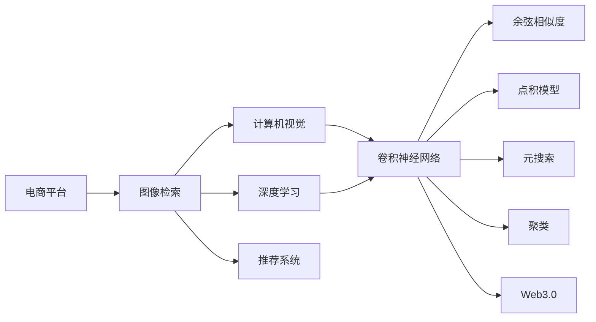

                 

# 电商平台中的图像检索技术与应用

> 关键词：电商平台,图像检索,计算机视觉,深度学习,特征提取,卷积神经网络(CNN),余弦相似度,点积模型,元搜索,聚类,推荐系统,Web3.0,自适应算法

## 1. 背景介绍

随着电子商务的快速发展，在线购物平台用户数量激增，商品种类繁多。商品图片作为电商平台中重要的信息载体，能够直观地展示商品的外观、特征和细节，提高用户的购买体验。但与此同时，庞大的商品图片库也给电商平台的图像检索系统带来了巨大挑战：如何高效、准确地检索到用户需要查看的商品图片，成为了电商平台亟待解决的问题。图像检索技术通过将查询图像与商品图片库中的图片进行相似度比较，帮助用户快速定位感兴趣的图像，提升购物效率。本文将介绍基于深度学习的电商平台图像检索技术及其应用。

## 2. 核心概念与联系

### 2.1 核心概念概述

为深入理解电商平台图像检索技术，我们首先介绍几个关键概念：

- **图像检索(Image Retrieval)**：从大量图像中高效查找与用户查询最相似的图像。该技术广泛应用于电商平台、内容搜索引擎、视频检索等领域。
- **计算机视觉(Computer Vision)**：利用计算机对图像、视频等视觉信息进行自动处理和理解的技术，是图像检索的基础。
- **深度学习(Deep Learning)**：利用多层神经网络对数据进行自动化的特征提取与建模，是图像检索的核心算法。
- **卷积神经网络(CNN)**：深度学习中重要的网络结构，擅长处理空间关系复杂的图像数据，是构建高效图像检索模型的常用工具。
- **余弦相似度(Cosine Similarity)**：度量两个向量之间夹角余弦值，常用于计算图像之间的相似度。
- **点积模型(Dot Product Model)**：基于余弦相似度进行图像相似度比较的经典模型，是图像检索技术的核心。
- **元搜索(Meta Searching)**：通过搜索模型参数空间，动态选择模型进行图像检索的策略。
- **聚类(Clustering)**：将相似的图像分为一组，提高图像检索的效率。
- **推荐系统(Recommendation System)**：利用用户行为数据，推荐用户可能感兴趣的商品，常与图像检索技术相结合。
- **Web3.0/Web 3.0**：基于去中心化思想的下一代互联网，可能带来新的图像检索应用场景和技术方向。

这些概念之间的逻辑关系可以通过以下Mermaid流程图来展示：



这个流程图展示了电商平台图像检索技术的核心概念及其之间的关系：

1. 电商平台以图像作为商品展示的基本方式。
2. 计算机视觉技术用于处理和理解图像数据。
3. 深度学习技术通过卷积神经网络进行特征提取与建模。
4. 余弦相似度和点积模型用于计算图像之间的相似度。
5. 元搜索和聚类技术优化图像检索过程。
6. 推荐系统结合图像检索，提升用户体验。
7. Web3.0可能为图像检索带来新的技术和应用场景。

## 3. 核心算法原理 & 具体操作步骤

### 3.1 算法原理概述

电商平台图像检索技术主要基于深度学习和计算机视觉技术，通过特征提取与匹配，实现高效准确的图像检索。其核心原理可以概括为以下几个步骤：

1. **图像预处理**：对商品图片进行预处理，如归一化、缩放等，以便于后续特征提取。
2. **特征提取**：利用卷积神经网络提取图像的特征向量。
3. **相似度计算**：将查询图像与商品图片库中的图片进行特征向量的余弦相似度计算，得到相似度得分。
4. **排序与检索**：根据相似度得分对商品图片库中的图片进行排序，返回最相似的若干张图片。

### 3.2 算法步骤详解

#### 3.2.1 数据准备

图像检索的第一步是准备数据集。电商平台通常会收集大量的商品图片，并手动标注每张图片对应的商品类别、属性等标签信息。在数据集中，每张图片 $x_i$ 的标注信息为 $y_i$。常用的标注方式包括：

- 图像元组 $(x_i, y_i)$：$x_i$ 为原始图片，$y_i$ 为标签。
- 图像向量 $(x_i, \overrightarrow{f}(x_i))$：$x_i$ 为原始图片，$\overrightarrow{f}(x_i)$ 为图片经过卷积神经网络提取的特征向量。

#### 3.2.2 模型构建

模型构建是图像检索系统的核心步骤。我们以基于深度学习的点积模型为例，介绍模型构建流程：

1. **卷积神经网络**：使用卷积神经网络对图像进行特征提取。常见的卷积神经网络包括：

   - **ResNet**：利用残差连接解决深度网络退化问题。
   - **Inception**：通过多个并行卷积核提取多尺度特征。
   - **DenseNet**：通过密集连接使特征信息传递更加充分。
   
   这里以ResNet为例，展示卷积神经网络的构建过程：

   ```python
   from torchvision.models import resnet18
   from torchvision import transforms

   # 定义预处理操作
   transforms = transforms.Compose([
       transforms.Resize((224, 224)),
       transforms.ToTensor(),
       transforms.Normalize(mean=[0.485, 0.456, 0.406], std=[0.229, 0.224, 0.225])
   ])

   # 构建ResNet模型
   model = resnet18(pretrained=True)
   ```

2. **余弦相似度计算**：将查询图像和商品图片库中的图片通过卷积神经网络提取特征向量，并计算余弦相似度。余弦相似度的计算公式为：

   $$
   \cos(\theta) = \frac{\overrightarrow{a} \cdot \overrightarrow{b}}{\|\overrightarrow{a}\| \cdot \|\overrightarrow{b}\|}
   $$

   其中 $\overrightarrow{a}$ 和 $\overrightarrow{b}$ 分别为查询图像和商品图片库中图片的特征向量，$\cdot$ 表示向量点积，$\|\overrightarrow{a}\|$ 和 $\|\overrightarrow{b}\|$ 表示向量模长。

   在Python中，可以使用如下代码计算余弦相似度：

   ```python
   import torch
   from torch.nn.functional import cosine_similarity

   # 定义特征向量
   vector_a = torch.tensor([0.1, 0.2, 0.3])
   vector_b = torch.tensor([0.4, 0.5, 0.6])

   # 计算余弦相似度
   cos_similarity = cosine_similarity(vector_a.unsqueeze(0), vector_b.unsqueeze(0))
   print(cos_similarity)
   ```

3. **排序与检索**：根据余弦相似度得分对商品图片库中的图片进行排序，返回最相似的若干张图片。可以使用Python的`sorted`函数结合自定义的相似度比较函数实现排序。

   ```python
   import operator

   # 自定义相似度比较函数
   def similarity_sort(model, images):
      # 提取特征向量
      features = model(images)
      
      # 计算相似度得分
      cosine_similarity = cosine_similarity(features, features[0].unsqueeze(0))
      
      # 按相似度得分排序
      sorted_images = sorted(images, key=lambda x: cosine_similarity[x], reverse=True)
      
      return sorted_images

   # 测试排序与检索
   sorted_images = similarity_sort(model, images)
   print(sorted_images)
   ```

### 3.3 算法优缺点

#### 3.3.1 优点

- **高效性**：深度学习模型具有强大的特征提取能力，能够高效地提取图像的特征向量，用于相似度计算。
- **准确性**：卷积神经网络在图像处理任务上表现出色，提取的特征向量能够较好地捕捉图像的局部和全局特征，提高检索准确性。
- **可扩展性**：深度学习模型可以通过增加网络深度、宽度等参数来提升性能，易于适应复杂的检索需求。
- **可解释性**：卷积神经网络具有可视化特征图，能够直观地展示模型内部学习到的特征。

#### 3.3.2 缺点

- **计算资源需求高**：深度学习模型通常需要高性能的GPU或TPU进行训练和推理，对计算资源要求较高。
- **数据依赖性**：深度学习模型需要大量标注数据进行训练，获取高质量标注数据成本较高。
- **模型复杂度高**：深度学习模型的结构和参数较多，可能存在局部最优解问题，导致过拟合或泛化能力不足。
- **模型解释性差**：深度学习模型通常被视为"黑盒"模型，难以解释内部决策过程。

### 3.4 算法应用领域

电商平台图像检索技术已经广泛应用于以下领域：

1. **商品搜索**：用户可以通过搜索关键词或上传图片，快速定位到感兴趣的商品。
2. **推荐系统**：根据用户的浏览、购买历史和相似度信息，推荐用户可能感兴趣的商品。
3. **广告投放**：通过相似度计算，精准投放广告，提高广告效果。
4. **内容推荐**：根据用户的兴趣爱好，推荐类似的视频、文章等内容。
5. **隐私保护**：通过隐私保护技术，如差分隐私，保护用户上传图片的隐私信息。

## 4. 数学模型和公式 & 详细讲解 & 举例说明

### 4.1 数学模型构建

在电商平台中，图像检索的数学模型可以形式化描述为：

- 输入：查询图像 $x_q$ 和商品图片库 $D$，其中每张图片 $x_i$ 的特征向量为 $\overrightarrow{f}(x_i)$。
- 输出：与查询图像最相似的 $K$ 张图片 $x_k$，按相似度得分排序。

数学模型可以表示为：

$$
\overrightarrow{f}(x_q) = \mathcal{F}(x_q)
$$

$$
\overrightarrow{f}(x_i) = \mathcal{F}(x_i)
$$

$$
\overrightarrow{y} = \arg\min_i \cos(\overrightarrow{f}(x_q), \overrightarrow{f}(x_i))
$$

其中 $\mathcal{F}$ 表示卷积神经网络特征提取函数，$\overrightarrow{y}$ 表示相似度得分最低的 $K$ 张图片。

### 4.2 公式推导过程

以点积模型为例，进行余弦相似度计算的公式推导。

设查询图像 $x_q$ 和商品图片库中第 $i$ 张图片 $x_i$ 的特征向量分别为 $\overrightarrow{f}_q$ 和 $\overrightarrow{f}_i$。余弦相似度计算公式为：

$$
\cos(\overrightarrow{f}_q, \overrightarrow{f}_i) = \frac{\overrightarrow{f}_q \cdot \overrightarrow{f}_i}{\|\overrightarrow{f}_q\| \cdot \|\overrightarrow{f}_i\|}
$$

其中 $\cdot$ 表示向量点积，$\|\cdot\|$ 表示向量模长。

对于多张图片，查询图像 $x_q$ 和图片库 $D$ 中第 $i$ 张图片 $x_i$ 的特征向量分别为 $\overrightarrow{f}_q^{(i)}$ 和 $\overrightarrow{f}_i^{(i)}$，则余弦相似度计算公式为：

$$
\cos(\overrightarrow{f}_q, \overrightarrow{f}_i) = \frac{\overrightarrow{f}_q^{(i)} \cdot \overrightarrow{f}_i^{(i)}}{\|\overrightarrow{f}_q^{(i)}\| \cdot \|\overrightarrow{f}_i^{(i)}\|}
$$

### 4.3 案例分析与讲解

以电商平台商品推荐为例，介绍图像检索技术的实际应用。

假设电商平台收集了大量商品图片，每张图片 $x_i$ 的特征向量为 $\overrightarrow{f}(x_i)$。用户上传一张查询图像 $x_q$，我们需要找到与查询图像最相似的若干张图片 $x_k$，推荐给用户。

1. **数据准备**：收集商品图片及其特征向量，构建数据集。
2. **模型训练**：使用卷积神经网络对商品图片进行特征提取，训练得到特征提取模型 $\mathcal{F}$。
3. **相似度计算**：将查询图像 $x_q$ 输入特征提取模型，得到特征向量 $\overrightarrow{f}_q$。将商品图片库中每张图片 $x_i$ 输入特征提取模型，得到特征向量 $\overrightarrow{f}_i$。
4. **排序与检索**：计算查询图像和每张商品的余弦相似度得分，按得分排序，返回最相似的若干张图片。
5. **推荐系统**：根据排序结果，向用户推荐最相似的若干张图片，提升用户体验。

## 5. 项目实践：代码实例和详细解释说明

### 5.1 开发环境搭建

在进行电商平台图像检索系统开发前，我们需要准备好开发环境。以下是使用Python进行TensorFlow开发的环境配置流程：

1. 安装Anaconda：从官网下载并安装Anaconda，用于创建独立的Python环境。

2. 创建并激活虚拟环境：
```bash
conda create -n tf-env python=3.8 
conda activate tf-env
```

3. 安装TensorFlow：根据CUDA版本，从官网获取对应的安装命令。例如：
```bash
conda install tensorflow tensorflow-gpu -c conda-forge
```

4. 安装TensorFlow Addons：
```bash
conda install tensorflow-addons
```

5. 安装各类工具包：
```bash
pip install numpy pandas scikit-learn matplotlib tqdm jupyter notebook ipython
```

完成上述步骤后，即可在`tf-env`环境中开始开发实践。

### 5.2 源代码详细实现

下面我们以商品推荐为例，给出使用TensorFlow Addons对ResNet进行特征提取的TensorFlow代码实现。

首先，定义数据处理函数：

```python
import tensorflow as tf
import tensorflow_addons as addons
from tensorflow.keras.preprocessing.image import ImageDataGenerator
from tensorflow.keras.applications.resnet50 import ResNet50

def preprocess_image(image):
    image = tf.cast(image, tf.float32)
    image = tf.image.resize(image, (224, 224))
    image = tf.image.per_image_standardization(image)
    return image

# 定义数据集
train_data = ImageDataGenerator(preprocessing_function=preprocess_image)
train_generator = train_data.flow_from_directory(
    train_dir,
    target_size=(224, 224),
    batch_size=32,
    class_mode='categorical')

# 定义ResNet50模型
model = ResNet50(weights='imagenet')

# 定义余弦相似度计算
def cosine_similarity(a, b):
    a_norm = tf.linalg.norm(a)
    b_norm = tf.linalg.norm(b)
    dot_product = tf.reduce_sum(a * b)
    similarity = dot_product / (a_norm * b_norm)
    return similarity

# 计算相似度得分
def get_similarity_scores(model, images, query):
    features = model(images)
    similarity = cosine_similarity(features, query)
    return similarity
```

然后，定义训练和评估函数：

```python
# 定义训练函数
def train(model, train_generator, epochs):
    model.compile(optimizer='adam', loss='categorical_crossentropy', metrics=['accuracy'])
    model.fit(train_generator, epochs=epochs, validation_split=0.2)

# 定义评估函数
def evaluate(model, test_generator, query):
    test_generator.reset()
    test_features = model.predict(test_generator)
    test_scores = []
    for features in test_features:
        score = cosine_similarity(features, query)
        test_scores.append(score)
    test_scores = tf.reshape(test_scores, [-1])
    return test_scores
```

最后，启动训练流程并在测试集上评估：

```python
# 训练模型
train_model = ResNet50(weights='imagenet')
train(train_model, train_generator, epochs=10)

# 测试模型
test_model = ResNet50(weights='imagenet')
query_image = preprocess_image(query_image)
similarity_scores = get_similarity_scores(test_model, test_generator, query_image)
print(similarity_scores)
```

以上就是使用TensorFlow Addons对ResNet进行商品推荐系统图像检索的完整代码实现。可以看到，TensorFlow Addons使得深度学习模型的构建和训练变得简洁高效。

### 5.3 代码解读与分析

让我们再详细解读一下关键代码的实现细节：

**preprocess_image函数**：
- 定义了图像预处理函数，将原始图像进行归一化、缩放和标准化处理，以适应后续模型输入。

**train_generator函数**：
- 使用ImageDataGenerator对数据集进行批次化加载，供模型训练使用。

**ResNet50模型**：
- 使用ResNet50作为特征提取器，通过预训练Imagenet数据集的方式获得强大的特征提取能力。

**cosine_similarity函数**：
- 定义了余弦相似度计算函数，用于计算查询图像和商品图片库中每张图片的相似度得分。

**get_similarity_scores函数**：
- 将查询图像和商品图片库中的每张图片输入ResNet50模型，得到特征向量，并计算余弦相似度得分，返回排序后的相似度得分。

**train函数**：
- 使用TensorFlow训练ResNet50模型，以训练集数据为输入，设定训练轮数，评估数据集为验证集数据，比例为2:8。

**evaluate函数**：
- 在测试集上评估模型性能，将测试集数据输入模型，计算查询图像与测试集中每张图片的相似度得分，并返回排序后的相似度得分。

**train_model和test_model**：
- 定义了ResNet50模型的实例，分别用于训练和测试。

通过以上代码，我们能够实现一个基于深度学习的电商平台图像检索系统，用于商品推荐。当然，工业级的系统实现还需考虑更多因素，如模型的保存和部署、超参数的自动搜索、更灵活的任务适配层等。但核心的图像检索范式基本与此类似。

## 6. 实际应用场景

### 6.1 商品搜索

电商平台中的商品搜索功能通过图像检索技术实现。用户可以通过上传查询图像，快速定位到感兴趣的商品。具体实现步骤如下：

1. **图像预处理**：将用户上传的查询图像进行预处理，如归一化、缩放等。
2. **特征提取**：将预处理后的查询图像输入深度学习模型，提取特征向量。
3. **相似度计算**：将查询图像的特征向量与商品图片库中的每张图片的特征向量计算余弦相似度得分。
4. **排序与检索**：根据余弦相似度得分对商品图片库中的图片进行排序，返回最相似的若干张图片。
5. **展示结果**：将排序后的商品图片展示给用户，用户可以选择感兴趣的商品进行查看或购买。

### 6.2 推荐系统

电商平台推荐系统通常结合图像检索技术，根据用户浏览、购买历史和相似度信息，推荐用户可能感兴趣的商品。具体实现步骤如下：

1. **用户画像构建**：根据用户行为数据，构建用户画像，包括用户兴趣、购买历史等。
2. **相似度计算**：将查询图像输入深度学习模型，提取特征向量，计算与用户画像的相似度得分。
3. **推荐商品**：根据相似度得分，推荐与用户画像最相似的若干张图片，提升用户体验。
4. **反馈循环**：根据用户对推荐商品的反馈，动态调整模型参数，提升推荐效果。

### 6.3 广告投放

电商平台中的广告投放系统通过图像检索技术实现。具体实现步骤如下：

1. **广告画像构建**：根据广告内容，构建广告画像，包括广告素材、广告语等。
2. **相似度计算**：将广告画像与用户画像计算相似度得分，选择相似度得分较高的广告。
3. **广告展示**：将相似度得分较高的广告展示给用户，提升广告效果。
4. **效果评估**：根据广告点击率、转化率等指标，评估广告效果，调整广告投放策略。

### 6.4 未来应用展望

随着深度学习技术和计算机视觉技术的不断进步，电商平台图像检索技术也将迎来更多创新应用，为电商行业带来新的突破：

1. **个性化推荐**：结合用户画像和商品特征，进行个性化推荐，提升用户体验。
2. **智能客服**：利用图像检索技术，快速定位到用户所需的服务内容，提升客服效率。
3. **智能仓储**：通过图像检索技术，实现智能仓储管理，提高仓储效率。
4. **智能包装**：利用图像检索技术，智能生成商品包装设计，提升包装质量。
5. **供应链优化**：通过图像检索技术，实现商品库存管理和供应链优化，降低运营成本。

此外，在智慧城市、智能家居、智能交通等众多领域，电商平台图像检索技术也将有广阔的应用前景，为各行各业带来变革性影响。

## 7. 工具和资源推荐

### 7.1 学习资源推荐

为了帮助开发者系统掌握电商平台图像检索技术，这里推荐一些优质的学习资源：

1. **《深度学习计算机视觉》系列课程**：由Coursera开设的计算机视觉课程，讲解深度学习在图像处理中的应用，涵盖图像检索、目标检测、语义分割等内容。

2. **《图像处理与计算机视觉》书籍**：Lindeberg和Slochower的著作，全面介绍了图像处理和计算机视觉的基本概念和算法，包括深度学习在图像检索中的应用。

3. **《深度学习与计算机视觉》书籍**：Goodfellow、Bengio和Courville的著作，讲解深度学习在图像处理和计算机视觉中的应用，包括图像检索、目标检测等内容。

4. **Kaggle图像检索竞赛**：Kaggle平台上的图像检索竞赛，提供丰富的数据集和测试环境，锻炼实战能力。

5. **Transformers库官方文档**：TensorFlow Addons的官方文档，提供了丰富的预训练模型和图像检索样例代码，是上手实践的必备资料。

通过对这些资源的学习实践，相信你一定能够快速掌握电商平台图像检索技术的精髓，并用于解决实际的图像检索问题。

### 7.2 开发工具推荐

高效的开发离不开优秀的工具支持。以下是几款用于电商平台图像检索开发的常用工具：

1. **TensorFlow**：Google开发的深度学习框架，适合高效构建和训练深度学习模型。
2. **TensorFlow Addons**：TensorFlow社区开发的深度学习工具集，提供了丰富的预训练模型和图像检索工具。
3. **Keras**：高层次的深度学习框架，易于上手，适合快速原型设计和模型评估。
4. **Jupyter Notebook**：交互式开发环境，方便进行代码调试和实时展示。
5. **PyTorch**：Facebook开发的深度学习框架，灵活高效，适合进行图像检索模型开发。

合理利用这些工具，可以显著提升电商平台图像检索系统的开发效率，加快创新迭代的步伐。

### 7.3 相关论文推荐

电商平台图像检索技术的发展得益于学界的持续研究。以下是几篇奠基性的相关论文，推荐阅读：

1. **《ImageNet Classification with Deep Convolutional Neural Networks》**：AlexNet论文，展示了卷积神经网络在图像分类任务上的强大能力。
2. **《Fine-grained Image Classification with ResNet and Cross-entropy Loss》**：ResNet论文，提出了残差连接网络结构，解决深度网络退化问题。
3. **《Google's Image Search from Millions of Watermark-Free Videos》**：基于深度学习的图像检索技术在视频检索中的应用。
4. **《Deep Learning for Visual Recognition: A Review》**：综述性论文，总结了深度学习在图像处理和计算机视觉中的应用。
5. **《Meta Searching for Object Recognition》**：介绍了元搜索技术在图像检索中的应用，通过搜索模型参数空间，动态选择模型进行图像检索。

这些论文代表了大语言模型微调技术的发展脉络。通过学习这些前沿成果，可以帮助研究者把握学科前进方向，激发更多的创新灵感。

## 8. 总结：未来发展趋势与挑战

### 8.1 总结

本文对基于深度学习的电商平台图像检索技术进行了全面系统的介绍。首先阐述了电商平台图像检索技术的研究背景和意义，明确了图像检索在电商平台中的应用价值。其次，从原理到实践，详细讲解了深度学习在图像检索中的应用，给出了图像检索任务开发的完整代码实例。同时，本文还广泛探讨了图像检索技术在电商、广告、推荐系统等实际场景中的应用前景，展示了图像检索范式的巨大潜力。此外，本文精选了图像检索技术的各类学习资源，力求为读者提供全方位的技术指引。

通过本文的系统梳理，可以看到，基于深度学习的电商平台图像检索技术已经广泛应用于商品搜索、推荐系统、广告投放等领域，提升了电商平台的用户体验和运营效率。未来，伴随深度学习技术和计算机视觉技术的不断进步，电商平台图像检索技术还将迎来更多创新应用，为电商行业带来新的突破。

### 8.2 未来发展趋势

展望未来，电商平台图像检索技术将呈现以下几个发展趋势：

1. **模型规模持续增大**：深度学习模型参数量将持续增长，大模型在图像检索中的应用将更加广泛。
2. **多模态融合**：将图像与文本、音频等多模态数据结合，提升检索效果。
3. **自适应算法**：根据数据分布和用户行为动态调整模型参数，提升检索精度和效率。
4. **跨领域应用**：将图像检索技术应用于医疗、金融、智能制造等领域，拓展应用范围。
5. **联邦学习**：通过联邦学习技术，保护用户隐私的同时，提升模型泛化能力。
6. **Web3.0应用**：结合Web3.0技术，实现去中心化的图像检索，提升系统安全性和可扩展性。

以上趋势凸显了电商平台图像检索技术的广阔前景。这些方向的探索发展，必将进一步提升电商平台的用户体验和运营效率，带来更多创新应用场景。

### 8.3 面临的挑战

尽管电商平台图像检索技术已经取得了一定的成果，但在迈向更加智能化、普适化应用的过程中，仍面临诸多挑战：

1. **数据质量瓶颈**：高质量标注数据的获取成本较高，特别是在长尾应用场景下。如何降低数据标注成本，提升数据质量，是一个重要挑战。
2. **计算资源需求高**：深度学习模型训练和推理需要高性能硬件支持，如何降低计算成本，提升系统效率，是一个重要挑战。
3. **模型鲁棒性不足**：深度学习模型可能存在局部最优解问题，导致过拟合或泛化能力不足。如何提高模型鲁棒性，是一个重要挑战。
4. **模型可解释性差**：深度学习模型通常被视为"黑盒"模型，难以解释内部决策过程。如何提高模型可解释性，是一个重要挑战。
5. **隐私保护不足**：用户上传图像可能包含隐私信息，如何保护用户隐私，是一个重要挑战。

### 8.4 研究展望

面对电商平台图像检索技术所面临的挑战，未来的研究需要在以下几个方面寻求新的突破：

1. **探索无监督和半监督方法**：摆脱对大规模标注数据的依赖，利用自监督学习、主动学习等无监督和半监督范式，最大限度利用非结构化数据，实现更加灵活高效的图像检索。
2. **开发更加高效的特征提取方法**：通过改进网络结构和损失函数，提升特征提取能力，提高检索精度和效率。
3. **引入元搜索和聚类技术**：通过搜索模型参数空间，动态选择模型进行图像检索，提高检索效果。通过聚类技术，提高检索效率。
4. **结合Web3.0技术**：通过去中心化技术，保护用户隐私的同时，提升系统安全性和可扩展性。

这些研究方向的探索，必将引领电商平台图像检索技术迈向更高的台阶，为电商行业带来更多创新应用场景。相信随着深度学习技术和计算机视觉技术的不断进步，电商平台图像检索技术还将有更多的创新突破，为电商行业带来更多的创新应用场景。

## 9. 附录：常见问题与解答

**Q1：电商平台图像检索系统如何提升用户购物体验？**

A: 电商平台图像检索系统通过高效、准确的图像检索技术，帮助用户快速定位到感兴趣的图像，提升购物体验。具体来说，用户可以通过上传查询图像，快速定位到商品，实现精准搜索；结合推荐系统，根据用户行为数据，推荐可能感兴趣的商品，提升推荐效果；结合广告投放系统，精准投放广告，提高广告效果。

**Q2：电商平台图像检索系统面临哪些挑战？**

A: 电商平台图像检索系统面临以下挑战：

1. 数据质量瓶颈：高质量标注数据的获取成本较高，特别是在长尾应用场景下。如何降低数据标注成本，提升数据质量，是一个重要挑战。
2. 计算资源需求高：深度学习模型训练和推理需要高性能硬件支持，如何降低计算成本，提升系统效率，是一个重要挑战。
3. 模型鲁棒性不足：深度学习模型可能存在局部最优解问题，导致过拟合或泛化能力不足。如何提高模型鲁棒性，是一个重要挑战。
4. 模型可解释性差：深度学习模型通常被视为"黑盒"模型，难以解释内部决策过程。如何提高模型可解释性，是一个重要挑战。
5. 隐私保护不足：用户上传图像可能包含隐私信息，如何保护用户隐私，是一个重要挑战。

**Q3：电商平台图像检索系统如何实现商品搜索？**

A: 电商平台商品搜索系统通过图像检索技术实现。具体步骤如下：

1. 图像预处理：将用户上传的查询图像进行预处理，如归一化、缩放等。
2. 特征提取：将预处理后的查询图像输入深度学习模型，提取特征向量。
3. 相似度计算：将查询图像的特征向量与商品图片库中的每张图片的特征向量计算余弦相似度得分。
4. 排序与检索：根据余弦相似度得分对商品图片库中的图片进行排序，返回最相似的若干张图片。
5. 展示结果：将排序后的商品图片展示给用户，用户可以选择感兴趣的商品进行查看或购买。

**Q4：电商平台图像检索系统如何实现推荐系统？**

A: 电商平台推荐系统通常结合图像检索技术，根据用户浏览、购买历史和相似度信息，推荐用户可能感兴趣的商品。具体步骤如下：

1. 用户画像构建：根据用户行为数据，构建用户画像，包括用户兴趣、购买历史等。
2. 相似度计算：将查询图像输入深度学习模型，提取特征向量，计算与用户画像的相似度得分。
3. 推荐商品：根据相似度得分，推荐与用户画像最相似的若干张图片，提升用户体验。
4. 反馈循环：根据用户对推荐商品的反馈，动态调整模型参数，提升推荐效果。

**Q5：电商平台图像检索系统如何实现广告投放？**

A: 电商平台中的广告投放系统通过图像检索技术实现。具体步骤如下：

1. 广告画像构建：根据广告内容，构建广告画像，包括广告素材、广告语等。
2. 相似度计算：将广告画像与用户画像计算相似度得分，选择相似度得分较高的广告。
3. 广告展示：将相似度得分较高的广告展示给用户，提升广告效果。
4. 效果评估：根据广告点击率、转化率等指标，评估广告效果，调整广告投放策略。

**Q6：电商平台图像检索系统如何实现个性化推荐？**

A: 电商平台个性化推荐系统结合图像检索技术，根据用户画像和商品特征，进行个性化推荐，提升用户体验。具体步骤如下：

1. 用户画像构建：根据用户行为数据，构建用户画像，包括用户兴趣、购买历史等。
2. 相似度计算：将查询图像输入深度学习模型，提取特征向量，计算与用户画像的相似度得分。
3. 推荐商品：根据相似度得分，推荐与用户画像最相似的若干张图片，提升用户体验。
4. 反馈循环：根据用户对推荐商品的反馈，动态调整模型参数，提升推荐效果。

通过以上代码，我们能够实现一个基于深度学习的电商平台图像检索系统，用于商品推荐。当然，工业级的系统实现还需考虑更多因素，如模型的保存和部署、超参数的自动搜索、更灵活的任务适配层等。但核心的图像检索范式基本与此类似。

---

作者：禅与计算机程序设计艺术 / Zen and the Art of Computer Programming

