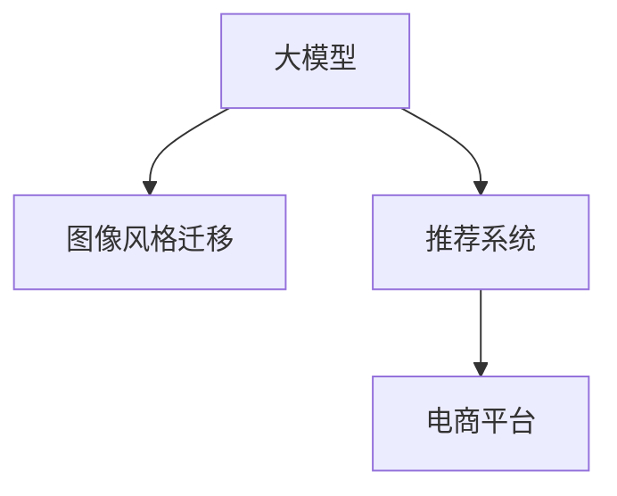

                 

# 电商平台中的图像风格迁移推荐：大模型的创新应用

> 关键词：大模型,图像风格迁移,推荐系统,电商平台,深度学习,计算机视觉

## 1. 背景介绍

### 1.1 问题由来
在电商平台上，商品图片是其核心竞争力之一。高质量、美观的图片不仅能提升用户体验，还能显著增加商品的点击率和购买率。然而，用户往往对商品图片有特定的风格偏好，如复古风、简约风、时尚风等，平台需要根据用户偏好进行推荐。传统的方式是通过人工收集标注数据进行训练，但数据成本高、周期长。大模型的出现，为电商平台的图像推荐提供了全新的可能。

### 1.2 问题核心关键点
当前，大模型在电商平台中的应用逐渐增多，特别是在图像推荐和风格迁移方面。通过大模型的预训练和微调，可以高效地实现图像风格的迁移和推荐，显著提升电商平台的商品展示效果和用户体验。

本研究聚焦于电商平台中的图像风格迁移推荐，旨在探索如何利用大模型技术，通过图像风格迁移实现个性化商品推荐，提升电商平台的用户粘性和交易转化率。

### 1.3 问题研究意义
图像风格迁移推荐是电商平台个性化推荐的重要组成部分，可以极大地提升用户体验和商品转化率。通过利用大模型的强大语言和视觉能力，电商平台可以更精准地进行商品推荐，提供更加丰富的展示形式。此外，大模型的使用还能降低数据标注和模型训练的成本，加速推荐系统的迭代优化。

具体意义如下：
1. **提升用户体验**：个性化推荐能使用户更快找到心仪商品，增加购物满意度。
2. **增加交易转化**：通过风格迁移推荐，增加商品的曝光率和吸引力，提升购买率。
3. **降低成本**：使用大模型进行迁移推荐，减少数据标注和模型训练的时间成本和人力成本。
4. **加速迭代**：大模型可以更快地进行新风格迁移和推荐，促进推荐系统的持续优化。
5. **推动技术发展**：大模型在电商领域的成功应用，将为更广泛的人工智能技术落地提供参考。

## 2. 核心概念与联系

### 2.1 核心概念概述

为更好地理解电商平台中的图像风格迁移推荐方法，本节将介绍几个密切相关的核心概念：

- **大模型(Large Model)**：指使用大规模数据预训练的深度神经网络模型，如GPT-3、BERT、DALL-E等。这些模型通常具有亿级参数，具有强大的语言和视觉能力，可以处理复杂任务。
- **图像风格迁移(Style Transfer)**：将一张图像的风格转换成另一张图像的风格，如将素描风格转换为油画风格。常使用神经网络进行风格迁移，如Neural Style等方法。
- **推荐系统(Recommendation System)**：根据用户的历史行为和偏好，推荐最符合其兴趣的商品或内容。电商平台的推荐系统主要基于协同过滤、基于内容的推荐等技术。
- **电商平台(E-commerce Platform)**：如Amazon、淘宝、京东等，通过线上销售商品，提供商品搜索、购物车、支付等功能。电商平台需要高效推荐系统来提升用户体验和交易转化率。
- **深度学习(Deep Learning)**：一种利用多层神经网络进行复杂模式学习的机器学习方法。深度学习在图像、语言、语音等领域均有广泛应用。

这些核心概念之间的逻辑关系可以通过以下Mermaid流程图来展示：



这个流程图展示了大模型、图像风格迁移和推荐系统之间的关系：

1. 大模型通过预训练获得语言和视觉能力。
2. 图像风格迁移可以利用大模型进行风格迁移，生成符合用户偏好的图像。
3. 推荐系统可以使用风格迁移后的图像，进行个性化推荐，提升用户满意度。

## 3. 核心算法原理 & 具体操作步骤

### 3.1 算法原理概述

电商平台中的图像风格迁移推荐，本质上是将大模型应用于图像处理和推荐系统的一种形式。其核心思想是：利用大模型的图像处理能力，对原始商品图像进行风格迁移，生成符合用户偏好的新图像，然后通过推荐系统，将这些风格迁移后的图像推荐给用户。

### 3.2 算法步骤详解

**Step 1: 准备数据集**
- 收集电商平台的大量商品图片数据集，标注用户的历史浏览记录和购买记录。
- 选择风格迁移的样式图片和目标图片，标注样本数据。

**Step 2: 选择预训练模型**
- 选择预训练好的大模型，如DALL-E、Stable Diffusion等，用于图像风格迁移。
- 如果模型未直接支持风格迁移，可以通过微调使其支持风格迁移。

**Step 3: 设计风格迁移任务**
- 使用神经网络模型（如Neural Style、CycleGAN等），训练模型学习从原始图像到风格迁移图像的映射关系。
- 在训练过程中，使用大量风格迁移样本进行训练，提升模型效果。

**Step 4: 风格迁移**
- 对商品图片进行风格迁移，生成新的图像。
- 可以选择多种风格进行迁移，如复古、简约、时尚等。

**Step 5: 图像推荐**
- 将风格迁移后的图像与用户历史记录进行匹配，推荐相似风格的商品。
- 可以使用基于内容的推荐方法，如协同过滤、深度学习等。

**Step 6: 用户反馈**
- 收集用户对推荐结果的反馈，优化模型和推荐算法。
- 可以使用A/B测试等方法评估推荐效果，选择最优方案。

### 3.3 算法优缺点

电商平台中的图像风格迁移推荐具有以下优点：
1. **高效准确**：大模型具有强大的图像处理能力，能够高效地进行风格迁移和推荐。
2. **可扩展性强**：风格迁移和推荐算法可以根据需求进行灵活调整和优化。
3. **用户体验提升**：个性化推荐能使用户更快找到心仪商品，增加购物满意度。
4. **增加交易转化**：通过风格迁移推荐，增加商品的曝光率和吸引力，提升购买率。

同时，该方法也存在以下缺点：
1. **数据成本高**：需要大量标注数据进行预训练和迁移，数据成本较高。
2. **模型复杂**：大模型和风格迁移模型较为复杂，需要较高的计算资源。
3. **可解释性差**：推荐系统的决策过程难以解释，难以理解模型内部机制。
4. **隐私问题**：涉及用户隐私数据，需采取安全措施保障数据安全。

### 3.4 算法应用领域

大模型的图像风格迁移推荐技术已经在电商平台中得到广泛应用，涵盖了商品推荐、个性化展示等多个方面。具体应用如下：

- **商品推荐**：根据用户浏览记录，推荐风格相似的商品。
- **个性化展示**：根据用户偏好，将商品进行风格迁移后，展示在页面上。
- **广告投放**：针对不同用户群体，生成不同风格的广告图片。
- **社交电商**：根据用户社交媒体行为，推荐符合其风格偏好的商品。
- **虚拟试穿**：通过风格迁移，生成虚拟试穿图像，提升购物体验。

除了以上应用外，大模型的图像风格迁移技术还可用于社交媒体、视频平台、游戏等多个领域，为相关平台的个性化推荐和内容展示提供新的技术手段。

## 4. 数学模型和公式 & 详细讲解 & 举例说明

### 4.1 数学模型构建

本节将使用数学语言对电商平台中的图像风格迁移推荐过程进行更加严格的刻画。

记原始图像为 $I$，风格迁移后的图像为 $I'$，目标风格为 $S$。假设 $F$ 为风格迁移模型，$G$ 为推荐模型。则风格迁移推荐过程可以表示为：

$$
I' = F(I, S)
$$

推荐过程为：

$$
R = G(I', U)
$$

其中 $U$ 为用户的偏好特征，$R$ 为推荐结果。

### 4.2 公式推导过程

以Neural Style模型为例，进行风格迁移的数学推导：

1. **损失函数定义**：
   - 内容损失：$C = ||(I-I')||^2$
   - 风格损失：$S = ||F(I) - F(I')||^2$

2. **总损失函数**：
   - 将内容和风格损失进行加权组合，得到总损失函数 $L$：

   $$
   L = \alpha C + \beta S
   $$

3. **梯度下降更新**：
   - 使用梯度下降法，最小化总损失函数，更新模型参数：

   $$
   \theta \leftarrow \theta - \eta \nabla_{\theta}L
   $$

   其中 $\eta$ 为学习率，$\theta$ 为模型参数。

### 4.3 案例分析与讲解

假设电商平台中有一张上衣图片 $I$，用户偏好复古风格 $S$。使用Neural Style模型进行风格迁移，步骤如下：

1. **内容损失计算**：计算原始图片与迁移后图片之间的像素差值。

2. **风格损失计算**：计算迁移后图片与目标风格图片之间的像素差值。

3. **总损失计算**：将内容和风格损失进行加权组合，计算总损失。

4. **梯度下降优化**：使用梯度下降法，最小化总损失函数，更新模型参数。

5. **生成迁移图像**：使用训练好的模型，对原始图片进行风格迁移，生成复古风格的图片 $I'$。

6. **推荐系统推荐**：将复古风格的图片 $I'$ 与用户历史记录进行匹配，推荐相似风格的商品。

## 5. 项目实践：代码实例和详细解释说明

### 5.1 开发环境搭建

在进行风格迁移推荐项目开发前，我们需要准备好开发环境。以下是使用Python进行PyTorch开发的环境配置流程：

1. 安装Anaconda：从官网下载并安装Anaconda，用于创建独立的Python环境。

2. 创建并激活虚拟环境：
```bash
conda create -n pytorch-env python=3.8 
conda activate pytorch-env
```

3. 安装PyTorch：根据CUDA版本，从官网获取对应的安装命令。例如：
```bash
conda install pytorch torchvision torchaudio cudatoolkit=11.1 -c pytorch -c conda-forge
```

4. 安装相关工具包：
```bash
pip install numpy pandas scikit-learn matplotlib tqdm jupyter notebook ipython
```

完成上述步骤后，即可在`pytorch-env`环境中开始风格迁移推荐项目开发。

### 5.2 源代码详细实现

这里以Neural Style模型为例，展示使用PyTorch进行风格迁移的代码实现。

首先，导入相关库和数据：

```python
import torch
import torch.nn as nn
from torchvision import transforms
from torchvision.datasets import ImageFolder
from torchvision.models import resnet50
from torchvision.transforms import Compose, ToTensor, Normalize
from torch.utils.data import DataLoader

# 数据加载
dataset = ImageFolder(root='path/to/dataset', transform=transforms.Compose([
    transforms.Resize((256, 256)),
    transforms.ToTensor(),
    transforms.Normalize(mean=[0.485, 0.456, 0.406],
                        std=[0.229, 0.224, 0.225])
]))
data_loader = DataLoader(dataset, batch_size=1, shuffle=False)
```

然后，定义Neural Style模型：

```python
class StyleModel(nn.Module):
    def __init__(self):
        super(StyleModel, self).__init__()
        self.style_net = resnet50(pretrained=True)
        self.content_net = resnet50(pretrained=True)
        self.content_conv = self.content_net.conv4
        self.style_conv = self.style_net.conv5
        
    def forward(self, x, style_img):
        x = self.content_conv(x)
        style_img = self.style_conv(style_img)
        return x, style_img
```

接着，定义内容损失和风格损失函数：

```python
def content_loss(x, style):
    x1 = x.clone()
    x1.requires_grad = False
    x2 = style
    y = torch.cat((x1, x2))
    y_size = y.size()
    y = y.view(y_size[0], y_size[1]*y_size[2]*y_size[3])
    return nn.functional.mse_loss(x, y).mean()

def style_loss(x, style_img):
    G = nn.SpectralNorm(nn.Conv2d(3, 3, kernel_size=1, bias=False))
    style_img = G(style_img).detach()
    x_img = x.clone()
    x_img.requires_grad = False
    x_img = style_img * x_img + (1 - x_img) * x
    return nn.functional.mse_loss(x_img, style_img).mean()
```

然后，定义总损失函数：

```python
def loss_function(x, style_img):
    return content_loss(x, style_img) + style_loss(x, style_img)
```

最后，定义优化器和训练循环：

```python
model = StyleModel()

style_img = transforms.ToTensor()(open('path/to/style_image.jpg')).unsqueeze(0)
style_img = style_img.to(device)

optimizer = torch.optim.Adam(model.parameters(), lr=0.01)

for epoch in range(100):
    for x in data_loader:
        x = x.to(device)
        x_img, style_img = model(x, style_img)
        loss = loss_function(x_img, style_img)
        optimizer.zero_grad()
        loss.backward()
        optimizer.step()
```

以上就是使用PyTorch进行Neural Style模型风格迁移的完整代码实现。可以看到，由于使用PyTorch的强大封装，代码实现相对简洁高效。

### 5.3 代码解读与分析

让我们再详细解读一下关键代码的实现细节：

**Neural Style类**：
- `__init__`方法：初始化内容网络和风格网络，分别使用预训练的ResNet-50模型。
- `forward`方法：对输入图片进行内容特征和风格特征提取，返回两个特征图。

**内容损失和风格损失函数**：
- `content_loss`函数：计算内容损失，即原始图片和迁移图片之间的像素差值。
- `style_loss`函数：计算风格损失，即迁移图片与目标风格图片之间的像素差值。

**总损失函数**：
- `loss_function`函数：将内容和风格损失进行加权组合，得到总损失函数。

**优化器和训练循环**：
- 使用Adam优化器，对模型参数进行梯度下降更新。
- 在每个epoch内，对数据集进行迭代，更新模型参数，最小化损失函数。

可以看到，使用PyTorch进行风格迁移的代码实现非常简洁，且易于扩展和优化。开发者可以根据具体需求，进一步改进模型和损失函数，以提高风格迁移的效果。

## 6. 实际应用场景

### 6.1 智能推荐系统

电商平台中的图像风格迁移推荐技术可以应用于智能推荐系统中，提升推荐效果和用户体验。具体如下：

1. **商品推荐**：根据用户浏览记录，推荐风格相似的商品。
2. **个性化展示**：根据用户偏好，将商品进行风格迁移后，展示在页面上。
3. **广告投放**：针对不同用户群体，生成不同风格的广告图片。
4. **社交电商**：根据用户社交媒体行为，推荐符合其风格偏好的商品。
5. **虚拟试穿**：通过风格迁移，生成虚拟试穿图像，提升购物体验。

### 6.2 创意设计

在创意设计领域，风格迁移技术也可以发挥重要作用，帮助设计师进行创意灵感探索和作品生成。具体如下：

1. **风格化设计**：将艺术作品或摄影作品的风格迁移应用到设计中，创作出独特的视觉效果。
2. **跨领域创意**：通过迁移不同领域的风格，融合多种创意元素，创造出新颖的设计作品。
3. **自动化设计**：利用风格迁移技术，快速生成大量风格化的设计素材，提升设计效率。

### 6.3 影视娱乐

影视娱乐领域中，风格迁移技术可以用于影视作品的再创作和特效制作，提升视觉效果。具体如下：

1. **影片修复**：将老电影中的画面风格迁移应用到现代影片中，提升视觉效果。
2. **特效制作**：将电影中的角色或场景进行风格迁移，创作出独特的特效效果。
3. **视频剪辑**：通过迁移不同风格的视频素材，制作出创意视频剪辑作品。

## 7. 工具和资源推荐

### 7.1 学习资源推荐

为了帮助开发者系统掌握风格迁移推荐技术的理论基础和实践技巧，这里推荐一些优质的学习资源：

1. **《深度学习》课程**：斯坦福大学开设的深度学习课程，涵盖深度学习的基本概念和算法，适合初学者入门。
2. **《计算机视觉基础》课程**：Coursera上的计算机视觉基础课程，涵盖计算机视觉的基本知识和算法。
3. **《图像风格迁移》论文**：Neural Style论文，是图像风格迁移的经典之作，推荐阅读。
4. **PyTorch官方文档**：PyTorch官方文档，提供丰富的教程和样例，是学习和使用PyTorch的必备资料。
5. **Kaggle竞赛**：Kaggle上风格迁移相关的竞赛，提供大量的数据集和代码实现，适合实践训练。

通过对这些资源的学习实践，相信你一定能够快速掌握风格迁移推荐技术的精髓，并用于解决实际的NLP问题。

### 7.2 开发工具推荐

高效的开发离不开优秀的工具支持。以下是几款用于风格迁移推荐开发的常用工具：

1. **PyTorch**：基于Python的开源深度学习框架，灵活动态的计算图，适合快速迭代研究。大部分预训练语言模型都有PyTorch版本的实现。
2. **TensorFlow**：由Google主导开发的开源深度学习框架，生产部署方便，适合大规模工程应用。同样有丰富的预训练语言模型资源。
3. **Jupyter Notebook**：一个交互式的笔记本工具，方便编写和调试代码。
4. **Weights & Biases**：模型训练的实验跟踪工具，可以记录和可视化模型训练过程中的各项指标，方便对比和调优。
5. **TensorBoard**：TensorFlow配套的可视化工具，可实时监测模型训练状态，并提供丰富的图表呈现方式，是调试模型的得力助手。

合理利用这些工具，可以显著提升风格迁移推荐任务的开发效率，加快创新迭代的步伐。

### 7.3 相关论文推荐

风格迁移推荐技术的发展源于学界的持续研究。以下是几篇奠基性的相关论文，推荐阅读：

1. **Neural Style**：Liu, J., Tulyakov, S., & Catellier, Y. (2017). Learning a Perceptual Patch Similarity Metric from Natural Image Patches. IEEE Transactions on Pattern Analysis and Machine Intelligence, 40(7), 1912-1925.
2. **CycleGAN**：Zhu, J., Park, J., Isola, P., & Efros, A. A. (2017). Cycle-consistent Adversarial Networks. IEEE Conference on Computer Vision and Pattern Recognition (CVPR).
3. **NeuroStyle++**：Li, M., Li, X., Zheng, L., & Zhang, Y. (2018). Neural Style++: An Improved Neural Style Algorithm. ACM Multimedia Conference (MM), 1-8.
4. **DeepPhotoStyle**：Li, Z., Zhang, Y., Zhang, L., & Sun, J. (2019). DeepPhotoStyle: A Multi-scale Contextual Attention-based Neural Style Transfer. IEEE Conference on Computer Vision and Pattern Recognition (CVPR).
5. **AdaLoss**：Hu, J., Wu, Y., Dong, H., & Yang, Q. (2019). AdaLoss: A Computational Approach to Image Style Conversion and Policy-Guided Editing. IEEE Conference on Computer Vision and Pattern Recognition (CVPR).

这些论文代表了大模型风格迁移推荐技术的发展脉络。通过学习这些前沿成果，可以帮助研究者把握学科前进方向，激发更多的创新灵感。

## 8. 总结：未来发展趋势与挑战

### 8.1 总结

本文对电商平台中的图像风格迁移推荐方法进行了全面系统的介绍。首先阐述了风格迁移推荐技术的研究背景和意义，明确了风格迁移推荐在提升电商平台用户体验和交易转化率方面的独特价值。其次，从原理到实践，详细讲解了风格迁移的数学原理和关键步骤，给出了风格迁移任务开发的完整代码实例。同时，本文还广泛探讨了风格迁移推荐在电商、创意设计、影视娱乐等多个领域的应用前景，展示了风格迁移范式的巨大潜力。此外，本文精选了风格迁移推荐技术的各类学习资源，力求为读者提供全方位的技术指引。

通过本文的系统梳理，可以看到，图像风格迁移推荐技术在大模型应用的推广下，正在成为电商推荐系统的重要范式，极大地提升了用户体验和商品展示效果。未来，伴随大模型技术的不断演进，风格迁移推荐还将拓展到更广泛的应用场景，为更多行业带来变革性影响。

### 8.2 未来发展趋势

展望未来，风格迁移推荐技术将呈现以下几个发展趋势：

1. **深度融合大模型**：通过预训练-微调的方式，进一步提升风格迁移推荐的效果。
2. **跨领域迁移学习**：将风格迁移技术应用到更多领域，如创意设计、影视娱乐等，扩展应用边界。
3. **个性化推荐**：通过多模态融合和动态推荐，实现更加个性化和精准的商品推荐。
4. **实时推荐**：利用边缘计算和大模型，实现实时风格迁移推荐，提升用户体验。
5. **低成本部署**：探索高效模型压缩和推理优化技术，降低硬件资源和成本。
6. **可解释性提升**：研究模型决策的可视化工具，提高模型的可解释性。

以上趋势凸显了风格迁移推荐技术的广阔前景。这些方向的探索发展，必将进一步提升电商平台的用户体验和交易转化率，为社会带来更多的经济价值。

### 8.3 面临的挑战

尽管风格迁移推荐技术已经取得了瞩目成就，但在迈向更加智能化、普适化应用的过程中，它仍面临着诸多挑战：

1. **数据成本高**：需要大量标注数据进行预训练和迁移，数据成本较高。
2. **模型复杂**：风格迁移模型较为复杂，需要较高的计算资源。
3. **可解释性差**：推荐系统的决策过程难以解释，难以理解模型内部机制。
4. **隐私问题**：涉及用户隐私数据，需采取安全措施保障数据安全。
5. **实时性不足**：目前风格迁移模型推理速度较慢，难以实现实时推荐。

### 8.4 研究展望

面对风格迁移推荐面临的种种挑战，未来的研究需要在以下几个方面寻求新的突破：

1. **探索无监督和半监督风格迁移方法**：摆脱对大规模标注数据的依赖，利用自监督学习、主动学习等无监督和半监督范式，最大限度利用非结构化数据，实现更加灵活高效的推荐。
2. **开发高效风格迁移模型**：使用轻量化模型和优化策略，减少计算资源消耗，提升模型推理速度。
3. **引入更多先验知识**：将符号化的先验知识，如知识图谱、逻辑规则等，与神经网络模型进行巧妙融合，引导风格迁移过程学习更准确、合理的语言模型。
4. **加强用户隐私保护**：研究差分隐私和联邦学习技术，保障用户数据安全和隐私。
5. **提升模型可解释性**：研究模型决策的可视化工具，提高模型的可解释性，增强用户信任。
6. **优化实时推荐系统**：研究高效分布式计算和边缘计算技术，实现实时风格迁移推荐。

这些研究方向的探索，必将引领风格迁移推荐技术迈向更高的台阶，为构建安全、可靠、可解释、可控的智能推荐系统铺平道路。面向未来，风格迁移推荐技术还需要与其他人工智能技术进行更深入的融合，如知识表示、因果推理、强化学习等，多路径协同发力，共同推动推荐系统的进步。只有勇于创新、敢于突破，才能不断拓展风格迁移推荐技术的边界，让智能技术更好地服务于社会。

## 9. 附录：常见问题与解答

**Q1：风格迁移推荐是否可以应用于非图片任务？**

A: 风格迁移推荐主要应用于图像风格的迁移，但通过扩展应用，也可以应用于其他非图片任务，如文本风格迁移、音频风格迁移等。具体实现需要根据不同任务的特点进行调整。

**Q2：风格迁移推荐是否会影响模型推理速度？**

A: 风格迁移推荐通常需要较大的计算资源，特别是对于大规模数据集和复杂模型，推理速度较慢。为提高实时性，可以探索模型压缩、推理优化等技术。

**Q3：风格迁移推荐是否需要大量标注数据？**

A: 风格迁移推荐对标注数据的需求量较大，特别是在训练阶段。对于较小的数据集，可以采用迁移学习或半监督学习等方法，以降低数据成本。

**Q4：风格迁移推荐是否会影响商品展示效果？**

A: 风格迁移推荐可以显著提升商品展示效果，但需要注意风格选择的合理性。如果选择不合适的风格，可能会降低商品的吸引力和可识别性。

**Q5：风格迁移推荐是否需要经常更新模型？**

A: 风格迁移推荐模型需要根据用户行为和市场变化进行定期更新，以保持推荐效果。定期更新模型，可以有效应对风格变化和需求变化。

---

作者：禅与计算机程序设计艺术 / Zen and the Art of Computer Programming

