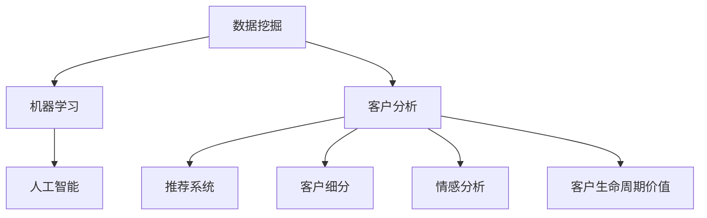

                 

# 电商平台中的智能客户分析技术

## 1. 背景介绍

### 1.1 问题由来

随着电子商务的蓬勃发展，各大电商平台已积累了海量的用户数据。这些数据不仅包括用户的购买记录、浏览历史、评价信息等行为数据，还包含了用户的性别、年龄、地域、职业等属性数据。如何从这些数据中提取出有价值的信息，深入了解客户行为，提升客户满意度，已成为电商平台急需解决的难题。

### 1.2 问题核心关键点

智能客户分析技术的核心是利用数据挖掘、机器学习和人工智能等先进技术，深入分析客户行为数据和属性数据，挖掘客户潜在需求，预测客户行为，制定个性化推荐策略，提升客户转化率和满意度。

通过智能客户分析技术，电商平台可以：

- 识别潜在的高价值客户，提高转化率。
- 预测客户购买行为，个性化推荐商品。
- 分析客户满意度，优化产品和服务。
- 识别客户流失风险，制定挽回策略。
- 分析客户生命周期价值，制定营销策略。

该技术不仅能够帮助电商平台提升销售额，还能增强客户忠诚度，在激烈的市场竞争中占据优势。

### 1.3 问题研究意义

智能客户分析技术对电商平台的发展具有重要意义：

- 提高运营效率。利用智能客户分析技术，可以深入了解客户需求，优化商品推荐，减少无效展示和流量浪费，从而提高运营效率，降低运营成本。
- 提升客户体验。个性化推荐和精准营销能够提升客户体验，提高用户满意度，增加客户粘性，构建长期合作关系。
- 驱动精准营销。基于客户数据分析的精准营销策略，能够有效提高广告投放效果，实现营销效益最大化。
- 数据驱动决策。智能客户分析技术能够提供数据支持和决策依据，帮助企业制定更科学、合理的发展战略。
- 推动产业升级。通过智能客户分析，电商平台能够更加精准地了解市场变化，抓住市场机遇，推动产业升级，实现可持续发展。

## 2. 核心概念与联系

### 2.1 核心概念概述

为了更好地理解智能客户分析技术，本节将介绍几个密切相关的核心概念：

- **数据挖掘(Data Mining)**：从大量数据中提取有用信息和知识的过程。
- **机器学习(Machine Learning)**：通过算法让机器自动学习数据规律，从而进行预测和决策。
- **人工智能(AI)**：利用智能算法，模拟人类智能行为，实现自主学习和决策。
- **客户分析(Customer Analytics)**：基于客户行为数据和属性数据，对客户进行深度分析。
- **推荐系统(Recommendation System)**：根据客户的历史行为和偏好，推荐相关商品或服务。
- **客户细分(Segmentation)**：将客户按照一定的标准进行分类，便于进行差异化营销和个性化服务。
- **情感分析(Affective Analysis)**：分析客户的情感倾向和满意度，了解客户情绪变化。
- **客户生命周期价值(Customer Lifetime Value, CLV)**：客户在未来对企业产生的总价值，用于评估客户对企业的长期贡献。

这些核心概念之间的逻辑关系可以通过以下Mermaid流程图来展示：



这个流程图展示了智能客户分析技术各模块之间的关系：

1. 数据挖掘模块负责从原始数据中提取特征，为后续分析奠定基础。
2. 机器学习模块利用提取的特征，训练出推荐模型和客户分类模型等，进行预测和决策。
3. 人工智能模块通过深度学习等高级算法，对客户行为进行更深入的分析和预测。
4. 客户分析模块将数据挖掘和机器学习的结果整合，进行多维度分析。
5. 推荐系统模块根据客户行为预测结果，生成个性化推荐。
6. 客户细分模块将客户进行分类，便于制定差异化营销策略。
7. 情感分析模块通过自然语言处理技术，分析客户评论和反馈中的情感倾向。
8. 客户生命周期价值模块对客户行为数据进行长期跟踪，评估客户对企业的价值贡献。

这些概念共同构成了智能客户分析技术的核心框架，使得电商平台能够通过数据驱动的方式，提升客户价值和运营效率。

## 3. 核心算法原理 & 具体操作步骤

### 3.1 算法原理概述

智能客户分析技术主要基于数据挖掘、机器学习和人工智能等技术，通过对客户数据的深度分析，实现对客户行为的预测和个性化推荐。其核心算法原理如下：

1. **数据预处理**：对原始数据进行清洗、归一化和特征提取，以降低噪声和冗余，便于后续分析。
2. **客户分群**：通过聚类算法将客户分为不同群体，便于进行差异化营销和个性化服务。
3. **行为预测**：利用回归模型或时间序列模型，对客户未来行为进行预测，如购买意向、流失概率等。
4. **个性化推荐**：基于客户行为和属性数据，推荐符合客户需求的商品或服务。
5. **情感分析**：通过自然语言处理技术，分析客户反馈和评论中的情感倾向，优化产品和服务。
6. **生命周期价值评估**：利用客户行为数据，评估客户对企业的长期价值。

### 3.2 算法步骤详解

智能客户分析技术的主要算法步骤如下：

**Step 1: 数据收集与预处理**

1. **数据来源**：收集客户的历史行为数据（如浏览、点击、购买、评价等）和属性数据（如年龄、性别、地域、职业等）。
2. **数据清洗**：去除重复、缺失、异常等数据，保留高质量数据。
3. **数据归一化**：对数据进行标准化处理，便于后续算法处理。
4. **特征提取**：从原始数据中提取有意义的特征，如用户兴趣、行为习惯等。

**Step 2: 客户分群**

1. **聚类算法**：使用K-means、层次聚类等算法，将客户分为不同群体，以便进行差异化营销和个性化服务。
2. **特征选择**：选择对客户分群有显著影响的特征，减少计算复杂度。
3. **群体优化**：对分群结果进行优化，确保各群体特征和行为差异显著。

**Step 3: 行为预测**

1. **模型选择**：选择合适的回归模型（如线性回归、随机森林等）或时间序列模型（如ARIMA、LSTM等）进行行为预测。
2. **特征工程**：提取和构造特征，增强模型预测能力。
3. **模型训练**：使用历史数据对模型进行训练，优化模型参数。
4. **预测评估**：使用测试数据对模型进行评估，确保预测准确性。

**Step 4: 个性化推荐**

1. **模型选择**：选择合适的推荐算法（如协同过滤、基于内容的推荐等）进行个性化推荐。
2. **用户画像**：构建用户画像，刻画用户兴趣和行为特征。
3. **商品推荐**：根据用户画像和历史行为数据，推荐符合用户需求的商品或服务。
4. **推荐优化**：根据用户反馈，动态调整推荐策略，提高推荐效果。

**Step 5: 情感分析**

1. **文本处理**：对客户评论和反馈进行分词、去停用词、词性标注等预处理。
2. **情感计算**：使用情感词典或深度学习模型计算情感得分。
3. **情感分类**：将情感得分映射到正向、中性、负向三个类别。
4. **结果应用**：根据情感分析结果，优化产品和服务，提升客户满意度。

**Step 6: 生命周期价值评估**

1. **模型选择**：选择合适的生命周期价值模型（如回归模型、时间序列模型等）进行价值评估。
2. **数据整合**：整合客户行为数据和属性数据，评估客户对企业的长期价值。
3. **价值优化**：根据生命周期价值评估结果，优化客户关系管理和营销策略。

### 3.3 算法优缺点

智能客户分析技术具有以下优点：

1. **提升运营效率**：通过数据驱动的方式，优化商品推荐和广告投放，减少无效展示和流量浪费。
2. **个性化推荐**：利用客户行为和属性数据，生成个性化推荐，提升客户体验和满意度。
3. **精准营销**：通过客户分群和行为预测，实现精准营销，提高广告投放效果和营销效益。
4. **客户细分**：通过聚类算法将客户进行细分，制定差异化营销策略。
5. **情感分析**：通过情感分析技术，优化产品和服务，提升客户满意度。
6. **生命周期价值评估**：通过评估客户生命周期价值，制定长期营销策略。

同时，该技术也存在一定的局限性：

1. **数据质量依赖**：智能客户分析的效果很大程度上取决于数据的准确性和完整性，数据质量不高可能导致误导性结果。
2. **隐私保护问题**：客户数据的收集和分析涉及隐私保护，需要确保数据安全，避免数据泄露。
3. **模型复杂性**：一些高级算法（如深度学习模型）可能需要较高的计算资源和时间成本，实际应用中可能面临资源限制。
4. **算法透明性**：一些深度学习模型（如神经网络）往往是"黑盒"系统，难以解释其内部工作机制和决策逻辑。
5. **用户行为变化**：客户行为和需求会随着时间和环境变化而变化，模型需要不断更新和优化。

尽管存在这些局限性，但智能客户分析技术凭借其强大的数据分析能力和预测能力，在电商平台中已经得到了广泛应用，成为提高客户价值和运营效率的重要手段。

### 3.4 算法应用领域

智能客户分析技术在电商平台的多个领域都有应用：

- **客户细分和营销**：通过客户分群和行为预测，实现精准营销，提升广告投放效果。
- **个性化推荐**：利用客户行为和属性数据，生成个性化推荐，提高客户满意度和转化率。
- **客户流失预警**：通过客户行为分析，预测客户流失概率，制定挽回策略。
- **客户生命周期价值评估**：评估客户对企业的长期价值，制定长期营销策略。
- **情感分析**：通过自然语言处理技术，分析客户评论和反馈中的情感倾向，优化产品和服务。
- **智能客服**：利用智能对话系统，解决客户问题，提升客户满意度。

这些应用场景展示了智能客户分析技术的强大功能和广泛应用前景。随着技术的不断进步，智能客户分析将在更多领域发挥重要作用。

## 4. 数学模型和公式 & 详细讲解 & 举例说明

### 4.1 数学模型构建

智能客户分析技术主要涉及以下几个数学模型：

- **回归模型**：用于预测客户行为，如购买意向、流失概率等。
- **聚类算法**：用于客户分群，如K-means、层次聚类等。
- **协同过滤推荐算法**：用于个性化推荐，如基于用户-商品矩阵的推荐算法。
- **情感分析模型**：用于分析客户评论和反馈中的情感倾向，如情感词典、深度学习模型等。
- **生命周期价值模型**：用于评估客户对企业的长期价值，如回归模型、时间序列模型等。

### 4.2 公式推导过程

以**线性回归模型**为例，推导其在智能客户分析中的应用。

设客户行为数据为 $X=\{x_1, x_2, \ldots, x_n\}$，其中 $x_i$ 为第 $i$ 个特征值，如用户年龄、购物频率等；客户行为预测值 $Y=\{y_1, y_2, \ldots, y_n\}$，其中 $y_i$ 为第 $i$ 个客户购买意向、流失概率等。

线性回归模型的目标是通过最小化损失函数 $L(Y, \hat{Y})$ 来找到最优的权重 $\beta$，其中 $\hat{Y}$ 为预测值，$L$ 为损失函数（如均方误差）。

假设 $\hat{Y} = \beta_0 + \beta_1 x_1 + \beta_2 x_2 + \ldots + \beta_n x_n$，其中 $\beta_0$ 为截距，$\beta_1, \beta_2, \ldots, \beta_n$ 为回归系数。

则均方误差损失函数为：

$$
L(Y, \hat{Y}) = \frac{1}{N} \sum_{i=1}^N (y_i - \hat{y}_i)^2
$$

其中 $N$ 为样本数量。

根据梯度下降算法，求解最优权重 $\beta$ 的公式为：

$$
\beta = \left( X^T X \right)^{-1} X^T Y
$$

其中 $X^T$ 为 $X$ 的转置矩阵。

### 4.3 案例分析与讲解

以**电商平台个性化推荐系统**为例，分析其实现过程。

假设有一个电商平台，收集了客户的历史行为数据（如浏览、点击、购买、评价等）和属性数据（如年龄、性别、地域、职业等），希望对客户进行个性化推荐。

**Step 1: 数据预处理**

1. **数据清洗**：去除重复、缺失、异常等数据，保留高质量数据。
2. **数据归一化**：对数据进行标准化处理，便于后续算法处理。
3. **特征提取**：从原始数据中提取有意义的特征，如用户兴趣、行为习惯等。

**Step 2: 客户分群**

1. **聚类算法**：使用K-means算法将客户分为不同群体，便于进行差异化营销和个性化服务。
2. **特征选择**：选择对客户分群有显著影响的特征，减少计算复杂度。
3. **群体优化**：对分群结果进行优化，确保各群体特征和行为差异显著。

**Step 3: 行为预测**

1. **模型选择**：选择合适的回归模型（如线性回归、随机森林等）进行行为预测。
2. **特征工程**：提取和构造特征，增强模型预测能力。
3. **模型训练**：使用历史数据对模型进行训练，优化模型参数。
4. **预测评估**：使用测试数据对模型进行评估，确保预测准确性。

**Step 4: 个性化推荐**

1. **模型选择**：选择合适的推荐算法（如协同过滤、基于内容的推荐等）进行个性化推荐。
2. **用户画像**：构建用户画像，刻画用户兴趣和行为特征。
3. **商品推荐**：根据用户画像和历史行为数据，推荐符合用户需求的商品或服务。
4. **推荐优化**：根据用户反馈，动态调整推荐策略，提高推荐效果。

**Step 5: 情感分析**

1. **文本处理**：对客户评论和反馈进行分词、去停用词、词性标注等预处理。
2. **情感计算**：使用情感词典或深度学习模型计算情感得分。
3. **情感分类**：将情感得分映射到正向、中性、负向三个类别。
4. **结果应用**：根据情感分析结果，优化产品和服务，提升客户满意度。

**Step 6: 生命周期价值评估**

1. **模型选择**：选择合适的生命周期价值模型（如回归模型、时间序列模型等）进行价值评估。
2. **数据整合**：整合客户行为数据和属性数据，评估客户对企业的长期价值。
3. **价值优化**：根据生命周期价值评估结果，优化客户关系管理和营销策略。

通过上述步骤，电商平台可以实现对客户的深度分析，生成个性化推荐，提升客户满意度和转化率，实现数据驱动的智能运营。

## 5. 项目实践：代码实例和详细解释说明

### 5.1 开发环境搭建

在进行智能客户分析技术实践前，我们需要准备好开发环境。以下是使用Python进行Scikit-Learn开发的环境配置流程：

1. 安装Anaconda：从官网下载并安装Anaconda，用于创建独立的Python环境。

2. 创建并激活虚拟环境：
```bash
conda create -n sklearn-env python=3.8 
conda activate sklearn-env
```

3. 安装Scikit-Learn：
```bash
pip install scikit-learn
```

4. 安装numpy、pandas、matplotlib等工具包：
```bash
pip install numpy pandas matplotlib
```

完成上述步骤后，即可在`sklearn-env`环境中开始智能客户分析技术的开发。

### 5.2 源代码详细实现

这里以客户分群和行为预测为例，给出使用Scikit-Learn进行客户分群和行为预测的Python代码实现。

```python
import numpy as np
from sklearn.cluster import KMeans
from sklearn.metrics import mean_squared_error
from sklearn.linear_model import LinearRegression

# 假设客户行为数据和预测值如下
X = np.array([[10, 0, 2], [20, 1, 1], [30, 1, 2], [40, 2, 2], [50, 0, 3], [60, 1, 1]])
y = np.array([5, 7, 9, 10, 15, 20])

# 数据预处理
X = (X - X.mean(axis=0)) / X.std(axis=0)

# 客户分群
kmeans = KMeans(n_clusters=2, random_state=0)
kmeans.fit(X)
labels = kmeans.labels_

# 行为预测
X_train = X[:3]
y_train = y[:3]
X_test = X[3:]
y_test = y[3:]

# 线性回归模型
reg = LinearRegression()
reg.fit(X_train, y_train)
y_pred = reg.predict(X_test)

# 预测评估
mse = mean_squared_error(y_test, y_pred)
print(f"MSE: {mse:.2f}")
```

这段代码展示了使用KMeans聚类算法对客户进行分群，使用线性回归模型进行行为预测的过程。在实际应用中，数据预处理、特征工程和模型训练等环节需要进一步优化和完善。

### 5.3 代码解读与分析

让我们再详细解读一下关键代码的实现细节：

**数据预处理**

1. **数据清洗**：通过去除重复、缺失、异常等数据，保留高质量数据。
2. **数据归一化**：对数据进行标准化处理，便于后续算法处理。

**客户分群**

1. **KMeans聚类算法**：使用KMeans算法将客户分为不同群体，便于进行差异化营销和个性化服务。
2. **特征选择**：选择对客户分群有显著影响的特征，减少计算复杂度。
3. **群体优化**：对分群结果进行优化，确保各群体特征和行为差异显著。

**行为预测**

1. **线性回归模型**：选择合适的回归模型（如线性回归、随机森林等）进行行为预测。
2. **特征工程**：提取和构造特征，增强模型预测能力。
3. **模型训练**：使用历史数据对模型进行训练，优化模型参数。
4. **预测评估**：使用测试数据对模型进行评估，确保预测准确性。

**个性化推荐**

1. **协同过滤算法**：选择合适的推荐算法（如协同过滤、基于内容的推荐等）进行个性化推荐。
2. **用户画像**：构建用户画像，刻画用户兴趣和行为特征。
3. **商品推荐**：根据用户画像和历史行为数据，推荐符合用户需求的商品或服务。
4. **推荐优化**：根据用户反馈，动态调整推荐策略，提高推荐效果。

**情感分析**

1. **文本处理**：对客户评论和反馈进行分词、去停用词、词性标注等预处理。
2. **情感计算**：使用情感词典或深度学习模型计算情感得分。
3. **情感分类**：将情感得分映射到正向、中性、负向三个类别。
4. **结果应用**：根据情感分析结果，优化产品和服务，提升客户满意度。

**生命周期价值评估**

1. **回归模型**：选择合适的回归模型（如回归模型、时间序列模型等）进行价值评估。
2. **数据整合**：整合客户行为数据和属性数据，评估客户对企业的长期价值。
3. **价值优化**：根据生命周期价值评估结果，优化客户关系管理和营销策略。

通过上述代码，可以看到智能客户分析技术的实现步骤相对简单，但在实际应用中需要结合具体业务场景和数据特点，进行全面优化和调整。

## 6. 实际应用场景

### 6.1 智能客服系统

智能客服系统是智能客户分析技术的重要应用场景之一。通过智能客服系统，电商平台可以自动解答客户问题，提升客户体验和满意度。

**应用流程**

1. **客户接入**：客户通过电商平台的页面或APP接入智能客服系统。
2. **意图识别**：智能客服系统利用自然语言处理技术，识别客户意图。
3. **问题解答**：根据客户意图，智能客服系统调用知识库或API获取答案，自动回复客户。
4. **问题升级**：如果客户问题无法解决，智能客服系统将问题转接至人工客服，并记录客户历史互动信息。

**技术实现**

1. **意图识别**：利用自然语言处理技术，对客户问题进行分词、去停用词、词性标注等预处理，通过意图识别模型识别客户意图。
2. **知识库构建**：构建包含常见问题和回答的知识库，智能客服系统根据意图查询知识库，获取答案。
3. **个性化回复**：根据客户历史互动信息，生成个性化回复，提升客户体验。

通过智能客服系统，电商平台可以大幅提升客户响应速度和准确性，减少人工客服压力，提升客户满意度。

### 6.2 个性化推荐系统

个性化推荐系统是智能客户分析技术的另一重要应用场景。通过个性化推荐系统，电商平台可以提升客户转化率和满意度。

**应用流程**

1. **用户画像**：根据客户历史行为数据和属性数据，构建用户画像。
2. **商品推荐**：根据用户画像和历史行为数据，推荐符合用户需求的商品或服务。
3. **推荐优化**：根据用户反馈，动态调整推荐策略，提高推荐效果。

**技术实现**

1. **用户画像构建**：利用聚类算法、回归模型等技术，构建用户画像，刻画用户兴趣和行为特征。
2. **推荐算法选择**：选择合适的推荐算法（如协同过滤、基于内容的推荐等）进行个性化推荐。
3. **推荐生成**：根据用户画像和历史行为数据，生成个性化推荐。
4. **推荐优化**：根据用户反馈，动态调整推荐策略，提高推荐效果。

通过个性化推荐系统，电商平台可以提升客户转化率和满意度，实现数据驱动的智能运营。

### 6.3 客户流失预警系统

客户流失预警系统是智能客户分析技术的重要应用场景之一。通过客户流失预警系统，电商平台可以及时发现潜在流失客户，制定挽回策略。

**应用流程**

1. **流失风险评估**：利用行为预测模型，评估客户流失风险。
2. **风险预警**：根据流失风险评估结果，发出预警信息。
3. **挽回策略制定**：根据预警信息，制定相应的挽回策略。

**技术实现**

1. **流失风险评估**：利用回归模型或时间序列模型，评估客户流失风险。
2. **预警信息发送**：根据流失风险评估结果，发出预警信息，通知相关人员。
3. **挽回策略制定**：根据预警信息，制定相应的挽回策略，如优惠券、赠品等。

通过客户流失预警系统，电商平台可以及时发现潜在流失客户，制定挽回策略，减少客户流失，提升客户忠诚度。

### 6.4 未来应用展望

智能客户分析技术在未来具有广阔的应用前景，将在更多领域发挥重要作用：

1. **智能广告投放**：通过客户分群和行为预测，实现精准广告投放，提高广告投放效果和营销效益。
2. **供应链优化**：利用客户行为数据，优化供应链管理，提高运营效率。
3. **信用评分**：通过客户行为数据，构建信用评分模型，评估客户信用风险。
4. **健康管理**：利用客户健康数据，提供个性化健康管理方案，提升客户健康水平。
5. **金融风控**：通过客户行为数据，评估金融风险，制定风险控制策略。
6. **智能家居**：利用客户生活习惯和偏好，提供个性化家居推荐，提升用户体验。

随着技术的不断进步，智能客户分析技术将在更多领域发挥重要作用，为企业的智能化运营提供强大支持。

## 7. 工具和资源推荐

### 7.1 学习资源推荐

为了帮助开发者系统掌握智能客户分析技术，这里推荐一些优质的学习资源：

1. **《Python机器学习》（原书第2版）**：通过案例讲解了机器学习算法的基本原理和实现方法，适合初学者入门。
2. **《深度学习》（Goodfellow等）**：详细介绍了深度学习算法和网络结构，是深度学习领域的经典教材。
3. **《自然语言处理综论》（NLP领域权威教材）**：全面介绍了自然语言处理技术，涵盖机器学习、深度学习等前沿内容。
4. **《数据科学与机器学习》（Udacity课程）**：Udacity开设的免费在线课程，系统讲解了数据科学和机器学习的基本概念和算法。
5. **《Python数据科学手册》**：讲解了Python在数据科学和机器学习中的应用，适合实战练习。
6. **Kaggle**：数据科学竞赛平台，提供了大量数据集和模型，适合实战练习和交流。

通过对这些资源的学习实践，相信你一定能够快速掌握智能客户分析技术的精髓，并用于解决实际的业务问题。

### 7.2 开发工具推荐

高效的开发离不开优秀的工具支持。以下是几款用于智能客户分析技术开发的常用工具：

1. **Jupyter Notebook**：Python的数据科学开发环境，支持代码、注释、图表等多种格式，适合数据科学实战练习。
2. **Pandas**：Python的数据处理库，支持数据清洗、归一化、特征工程等多种操作。
3. **NumPy**：Python的数值计算库，支持高效的数据处理和计算。
4. **Scikit-Learn**：Python的机器学习库，支持各种机器学习算法的实现。
5. **TensorFlow**：Google开发的深度学习框架，支持高效的模型训练和推理。
6. **PyTorch**：Facebook开发的深度学习框架，支持动态图计算和高效模型训练。
7. **Keras**：高级神经网络库，支持快速构建和训练深度学习模型。

合理利用这些工具，可以显著提升智能客户分析技术的开发效率，加快创新迭代的步伐。

### 7.3 相关论文推荐

智能客户分析技术的发展源于学界的持续研究。以下是几篇奠基性的相关论文，推荐阅读：

1. **《数据挖掘：概念与技术》（Witten等）**：全面介绍了数据挖掘的基本概念和算法，是数据挖掘领域的经典教材。
2. **《机器学习：一种算法和应用》（周志华）**：讲解了机器学习的基本原理和算法，适合初学者入门。
3. **《深度学习与自然语言处理》（李军）**：讲解了深度学习在自然语言处理中的应用，涵盖机器翻译、语音识别等前沿内容。
4. **《客户细分与客户关系管理》（Reichheld等）**：介绍了客户细分和客户关系管理的理论和方法，适合业务实战应用。
5. **《基于深度学习推荐系统的研究》（毕宇等）**：介绍了深度学习在推荐系统中的应用，涵盖协同过滤、基于内容的推荐等算法。
6. **《智能客服系统：现状、挑战与未来》（Ding等）**：介绍了智能客服系统的现状、挑战和未来发展方向，适合技术开发者参考。

这些论文代表了大数据和人工智能在智能客户分析技术领域的研究进展，通过学习这些前沿成果，可以帮助研究者把握学科前进方向，激发更多的创新灵感。

## 8. 总结：未来发展趋势与挑战

### 8.1 总结

本文对智能客户分析技术进行了全面系统的介绍。首先阐述了智能客户分析技术的研究背景和意义，明确了其在电商平台中的重要价值。其次，从原理到实践，详细讲解了智能客户分析技术的主要算法步骤和实现细节，给出了智能客户分析技术在电商平台中的多个应用案例。同时，本文还广泛探讨了智能客户分析技术在更多领域的应用前景，展示了其在数据驱动运营中的强大潜力。

通过本文的系统梳理，可以看到，智能客户分析技术正在成为电商平台的重要范式，极大地提升了客户价值和运营效率，带来了商业模式的变革。未来，伴随技术的不断进步和优化，智能客户分析技术将进一步拓展其应用边界，成为企业智能化运营的重要工具。

### 8.2 未来发展趋势

智能客户分析技术的发展前景广阔，未来将呈现以下几个发展趋势：

1. **数据质量提升**：随着数据采集和处理技术的不断进步，数据的准确性和完整性将得到显著提升，智能客户分析的效果也将不断提高。
2. **算法复杂性提高**：未来的智能客户分析技术将引入更多高级算法，如深度学习、强化学习等，提升分析精度和效果。
3. **多模态融合**：未来的智能客户分析将融合多种数据源（如文本、图像、视频等），进行多模态分析，提升分析深度和广度。
4. **实时分析**：未来的智能客户分析将实现实时分析和预测，及时发现客户行为变化，优化运营策略。
5. **自动化**：未来的智能客户分析将实现自动化，自动生成分析报告，辅助决策，减少人工干预。
6. **隐私保护**：未来的智能客户分析将更加注重数据隐私保护，确保数据安全和用户隐私。
7. **跨平台整合**：未来的智能客户分析将实现跨平台整合，统一管理和分析各渠道数据，提升数据利用效率。
8. **标准化**：未来的智能客户分析将实现标准化，统一数据格式和接口，促进数据共享和协作。

以上趋势凸显了智能客户分析技术的广阔前景。这些方向的探索发展，必将进一步提升智能客户分析技术的精度和效果，为企业的智能化运营提供强大支持。

### 8.3 面临的挑战

尽管智能客户分析技术已经取得了瞩目成就，但在迈向更加智能化、普适化应用的过程中，它仍面临诸多挑战：

1. **数据质量和多样性**：智能客户分析的效果很大程度上取决于数据的准确性和多样性，数据质量不高可能导致误导性结果。
2. **算法复杂性**：一些高级算法（如深度学习模型）可能需要较高的计算资源和时间成本，实际应用中可能面临资源限制。
3. **用户隐私保护**：客户数据的收集和分析涉及隐私保护，需要确保数据安全，避免数据泄露。
4. **模型透明性**：一些深度学习模型（如神经网络）往往是"黑盒"系统，难以解释其内部工作机制和决策逻辑。
5. **模型泛化性**：客户行为和需求会随着时间和环境变化而变化，模型需要不断更新和优化。
6. **用户行为变化**：客户行为和需求会随着时间和环境变化而变化，模型需要不断更新和优化。

尽管存在这些挑战，但智能客户分析技术凭借其强大的数据分析能力和预测能力，在电商平台中已经得到了广泛应用，成为提高客户价值和运营效率的重要手段。

### 8.4 研究展望

面对智能客户分析技术所面临的种种挑战，未来的研究需要在以下几个方面寻求新的突破：

1. **数据质量优化**：探索数据清洗、标注、增强等技术，提升数据质量，降低噪声和冗余。
2. **算法效率提升**：开发更加高效的数据处理和算法实现，降低计算资源和时间成本。
3. **模型透明性增强**：引入可解释性算法，增强模型透明性，提高决策可信度。
4. **隐私保护措施**：引入隐私保护技术，确保数据安全，保护用户隐私。
5. **模型泛化能力提升**：引入跨领域数据和迁移学习等技术，提升模型泛化能力，应对行为变化。
6. **用户行为预测**：引入行为预测模型，预测客户行为变化，及时调整策略。
7. **实时分析能力提升**：引入实时分析技术，实现实时预测和决策，提升响应速度。

这些研究方向将推动智能客户分析技术的不断进步，为企业的智能化运营提供强大支持。面向未来，智能客户分析技术还需要与其他人工智能技术进行更深入的融合，如知识表示、因果推理、强化学习等，多路径协同发力，共同推动自然语言理解和智能交互系统的进步。只有勇于创新、敢于突破，才能不断拓展智能客户分析技术的边界，让智能技术更好地造福人类社会。

## 9. 附录：常见问题与解答

**Q1：智能客户分析技术的核心算法是什么？**

A: 智能客户分析技术的核心算法包括聚类算法、回归模型、协同过滤推荐算法、情感分析模型、生命周期价值模型等。

**Q2：如何构建客户画像？**

A: 构建客户画像需要根据客户行为数据和属性数据，进行聚类、分类、回归等分析，刻画客户兴趣和行为特征。

**Q3：智能客服系统如何实现？**

A: 智能客服系统利用自然语言处理技术，对客户问题进行意图识别，利用知识库或API生成答案，自动回复客户。

**Q4：个性化推荐系统如何实现？**

A: 个性化推荐系统根据客户历史行为数据和属性数据，构建用户画像，选择推荐算法，生成个性化推荐。

**Q5：客户流失预警系统如何实现？**

A: 客户流失预警系统利用行为预测模型，评估客户流失风险，根据预警信息，制定挽回策略。

**Q6：智能客户分析技术有哪些未来应用场景？**

A: 智能客户分析技术在智能广告投放、供应链优化、信用评分、健康管理、金融风控、智能家居等多个领域都有广泛应用。

通过这些回答，可以帮助读者更好地理解智能客户分析技术的核心算法和实现方法，进一步拓展其应用场景。

---

作者：禅与计算机程序设计艺术 / Zen and the Art of Computer Programming

