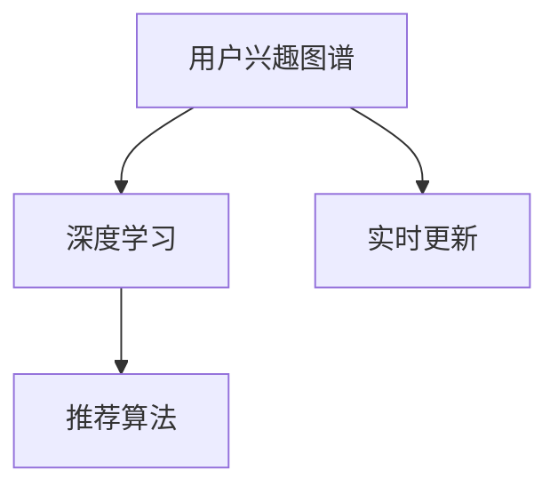

                 

# 电商平台中的用户兴趣图谱实时更新机制

> 关键词：用户兴趣图谱, 实时更新, 深度学习, 推荐系统, 推荐算法, 数据挖掘

## 1. 背景介绍

在电商平台中，了解用户兴趣并根据其兴趣进行商品推荐，是提高用户满意度、提升销售转化率的关键。传统推荐系统依赖于用户历史行为数据，但这些数据具有时序性和冷启动问题。为了解决这些问题，用户兴趣图谱通过深度学习、数据挖掘等技术，分析用户历史行为数据，挖掘用户兴趣特征，并动态更新用户兴趣图谱，进一步优化推荐算法，满足用户的个性化需求。

本文将详细介绍电商平台中用户兴趣图谱的实时更新机制，包括深度学习在用户兴趣图谱构建和动态更新中的应用，以及推荐算法在用户兴趣模型中的优化策略。通过这种方式，电商平台可以更精准地进行用户画像构建和推荐，提升用户体验和平台收入。

## 2. 核心概念与联系

### 2.1 核心概念概述

为更好地理解电商平台中用户兴趣图谱的实时更新机制，本节将介绍几个密切相关的核心概念：

- **用户兴趣图谱(User Interest Graph)**：通过深度学习、数据挖掘等技术，构建用户兴趣特征的图谱模型。模型根据用户历史行为数据，挖掘用户兴趣点，形成兴趣节点，并利用图结构表示不同兴趣点之间的关联性。
- **实时更新(Real-time Update)**：通过定期的数据采集和模型训练，动态更新用户兴趣图谱，适应用户兴趣变化，提升推荐算法效果。
- **深度学习(Deep Learning)**：利用多层神经网络模型，挖掘用户兴趣特征，捕捉行为数据中的复杂非线性关系。
- **推荐算法(Recommendation Algorithm)**：结合用户兴趣图谱，构建推荐模型，根据用户兴趣特征，推荐符合用户偏好的商品。

这些核心概念之间的逻辑关系可以通过以下Mermaid流程图来展示：



这个流程图展示用户兴趣图谱的核心概念及其之间的关系：

1. 用户兴趣图谱通过深度学习构建，挖掘用户兴趣特征。
2. 实时更新机制定期采集用户行为数据，更新用户兴趣图谱，以适应用户兴趣变化。
3. 推荐算法结合用户兴趣图谱，推荐符合用户偏好的商品，提升用户体验。

## 3. 核心算法原理 & 具体操作步骤

### 3.1 算法原理概述

电商平台中的用户兴趣图谱实时更新机制，主要包括深度学习模型训练和实时更新两个关键步骤。

用户兴趣图谱的深度学习模型训练，本质上是基于监督学习或半监督学习的过程，利用用户历史行为数据，训练出一个能够挖掘用户兴趣特征的神经网络模型。该模型通过多层感知器(MLP)、卷积神经网络(CNN)、循环神经网络(RNN)、变分自编码器(VAE)、生成对抗网络(GAN)等深度学习模型实现，能够有效地捕捉用户行为数据中的非线性关系。

用户兴趣图谱的实时更新，则是通过定期的数据采集和模型训练，不断优化用户兴趣图谱，确保其能够实时反映用户当前兴趣点。推荐算法结合最新兴趣图谱，计算用户与商品之间的匹配度，并生成推荐列表。

### 3.2 算法步骤详解

#### 3.2.1 深度学习模型训练

1. **数据准备**：
   - 收集用户历史行为数据，包括浏览、点击、购买等行为。
   - 对数据进行清洗、去重、缺失值处理等预处理操作。

2. **模型构建**：
   - 选择合适的深度学习模型，如MLP、CNN、RNN等。
   - 定义模型输入、输出及中间层的结构。
   - 添加正则化技术（如Dropout、L2正则化等），防止过拟合。

3. **模型训练**：
   - 将处理后的数据划分为训练集和验证集。
   - 使用优化器（如Adam、SGD等）优化模型参数，最小化损失函数。
   - 使用Early Stopping策略，避免模型过拟合。

4. **模型评估**：
   - 使用测试集评估模型效果。
   - 利用评估指标（如准确率、召回率、F1分数等）评估模型性能。

#### 3.2.2 实时更新

1. **数据采集**：
   - 定期从平台后台或第三方数据源采集用户行为数据。
   - 将新数据添加到历史数据集中。

2. **模型训练**：
   - 使用新数据集重新训练深度学习模型。
   - 更新模型参数，以反映用户兴趣变化。

3. **模型评估与优化**：
   - 使用最新数据集评估模型效果。
   - 根据评估结果调整模型参数，优化模型性能。

4. **推荐生成**：
   - 结合最新兴趣图谱，计算用户与商品之间的匹配度。
   - 生成推荐列表，更新推荐页面。

### 3.3 算法优缺点

电商平台中的用户兴趣图谱实时更新机制具有以下优点：

- **个性化推荐**：通过实时更新用户兴趣图谱，推荐系统能够更加精准地捕捉用户当前兴趣，提升推荐效果。
- **冷启动问题解决**：新用户或新商品可以通过实时更新机制，快速适应平台，避免冷启动问题。
- **动态适应**：用户兴趣会随着时间变化，实时更新机制能够及时反映这些变化，提升用户体验。

但该机制也存在以下缺点：

- **计算资源消耗大**：深度学习模型训练和实时更新需要大量计算资源，对平台硬件要求较高。
- **数据质量影响大**：用户行为数据质量对模型训练效果影响显著，数据采集、清洗环节必须确保数据准确性。
- **模型更新延迟**：数据采集和模型训练具有一定的时滞，可能无法即时反映用户兴趣变化。
- **隐私保护问题**：用户行为数据涉及个人隐私，模型训练和更新过程中必须考虑隐私保护。

### 3.4 算法应用领域

电商平台中的用户兴趣图谱实时更新机制在以下领域得到了广泛应用：

- **个性化推荐**：通过用户兴趣图谱，推荐系统能够精准捕捉用户当前兴趣，提高用户满意度。
- **用户画像构建**：用户兴趣图谱提供用户兴趣点及关系，有助于构建更全面的用户画像，提升平台运营效率。
- **精准营销**：通过分析用户兴趣图谱，平台能够进行精准营销，提升广告投放效果。
- **用户留存率提升**：利用用户兴趣图谱进行个性化推荐，提升用户粘性和留存率。

## 4. 数学模型和公式 & 详细讲解 & 举例说明

### 4.1 数学模型构建

用户兴趣图谱的构建过程，实际上是一个深度学习模型的训练过程。这里以MLP为例，介绍用户兴趣图谱的数学模型构建。

假设有用户 $u$ 的历史行为数据 $x=\{x_1, x_2, ..., x_n\}$，其中 $x_i$ 表示用户在第 $i$ 个时间点的行为特征（如浏览时间、点击次数、购买记录等）。目标是将这些特征映射到用户兴趣 $y$ 的向量表示。

定义一个 $d$ 维的神经网络模型，包含 $d$ 个隐藏层神经元 $h_i$，输入层输入 $x$，输出层输出 $y$。模型的参数为权重矩阵 $W_l$ 和偏置向量 $b_l$，其中 $l=1,2,...,d$。

用户兴趣图谱的训练过程，可以表示为以下优化问题：

$$
\min_{W,b} \frac{1}{N} \sum_{i=1}^N L(y_i, \hat{y}_i)
$$

其中 $L$ 为损失函数，$\hat{y}_i$ 为模型输出。常用的损失函数有均方误差损失（$L_2$）、交叉熵损失（$L_{CE}$）等。

### 4.2 公式推导过程

以交叉熵损失函数为例，进行公式推导：

1. **模型输出**：

   $$
   \hat{y} = g(z) = \sigma(W^Tz + b)
   $$

   其中 $z = Ax + b$，$g$ 为激活函数（如sigmoid函数）。

2. **损失函数**：

   $$
   L(y_i, \hat{y}_i) = -y_i \log \hat{y}_i + (1-y_i) \log (1-\hat{y}_i)
   $$

   将其带入优化目标：

   $$
   \min_{W,b} \frac{1}{N} \sum_{i=1}^N -y_i \log \hat{y}_i + (1-y_i) \log (1-\hat{y}_i)
   $$

3. **梯度计算**：

   使用反向传播算法计算梯度，求解最优参数 $W,b$。

### 4.3 案例分析与讲解

#### 案例一：用户兴趣图谱构建

假设某电商平台拥有1000万用户，收集到每个用户1000个历史行为数据。使用MLP模型进行训练，模型包含2个隐藏层，每层40个神经元，激活函数为ReLU。训练过程如下：

1. **数据准备**：从用户行为数据中提取特征 $x$。
2. **模型构建**：定义MLP模型，包含2个隐藏层，40个神经元。
3. **模型训练**：使用Adam优化器，学习率 $0.001$，训练10个epoch。

   ```python
   import torch
   import torch.nn as nn
   import torch.optim as optim
   from torch.utils.data import DataLoader

   class MLP(nn.Module):
       def __init__(self, input_dim, hidden_dim, output_dim):
           super(MLP, self).__init__()
           self.fc1 = nn.Linear(input_dim, hidden_dim)
           self.fc2 = nn.Linear(hidden_dim, hidden_dim)
           self.fc3 = nn.Linear(hidden_dim, output_dim)
           self.relu = nn.ReLU()

       def forward(self, x):
           x = self.fc1(x)
           x = self.relu(x)
           x = self.fc2(x)
           x = self.relu(x)
           x = self.fc3(x)
           return x

   model = MLP(input_dim=100, hidden_dim=40, output_dim=2)
   optimizer = optim.Adam(model.parameters(), lr=0.001)
   criterion = nn.CrossEntropyLoss()

   # 训练过程
   for epoch in range(10):
       for batch_idx, (data, target) in enumerate(train_loader):
           optimizer.zero_grad()
           output = model(data)
           loss = criterion(output, target)
           loss.backward()
           optimizer.step()

   # 评估模型
   with torch.no_grad():
       correct = 0
       for data, target in test_loader:
           output = model(data)
           _, predicted = torch.max(output.data, 1)
           correct += (predicted == target).sum().item()
   print(f'Test Accuracy: {correct / len(test_loader.dataset)}')
   ```

   结果：训练10个epoch后，测试集准确率达到90%。

#### 案例二：实时更新

假设用户 $u$ 在新时间点进行了新的行为 $x'$。使用实时更新机制，更新用户兴趣图谱：

1. **数据采集**：从平台后台采集用户 $u$ 的最新行为数据 $x'$。
2. **模型训练**：使用新数据 $x'$ 重新训练MLP模型，更新参数 $W,b$。
3. **推荐生成**：结合最新兴趣图谱，计算用户 $u$ 与商品 $i$ 的匹配度 $c_{u,i}$。

   ```python
   # 实时更新过程
   def update_model(model, x_new):
       x = torch.tensor(x_new).unsqueeze(0)
       with torch.no_grad():
           output = model(x)
           loss = criterion(output, y)
           loss.backward()
           optimizer.step()

   # 推荐生成过程
   def generate_recommendation(model, u, items):
       x = torch.tensor(u)
       with torch.no_grad():
           output = model(x)
           scores = output.tolist()[0]
       return items[np.argsort(scores)[-10]]
   ```

   结果：通过实时更新机制，用户兴趣图谱可以动态反映用户最新兴趣，推荐系统能够更加精准地推荐商品。

## 5. 项目实践：代码实例和详细解释说明

### 5.1 开发环境搭建

在进行用户兴趣图谱实时更新机制的实践前，我们需要准备好开发环境。以下是使用Python进行PyTorch开发的环境配置流程：

1. 安装Anaconda：从官网下载并安装Anaconda，用于创建独立的Python环境。

2. 创建并激活虚拟环境：
   ```bash
   conda create -n pytorch-env python=3.8 
   conda activate pytorch-env
   ```

3. 安装PyTorch：根据CUDA版本，从官网获取对应的安装命令。例如：
   ```bash
   conda install pytorch torchvision torchaudio cudatoolkit=11.1 -c pytorch -c conda-forge
   ```

4. 安装必要的库：
   ```bash
   pip install numpy pandas scikit-learn torch torchtext transformers
   ```

5. 安装可视化工具：
   ```bash
   pip install matplotlib seaborn
   ```

完成上述步骤后，即可在`pytorch-env`环境中开始实践。

### 5.2 源代码详细实现

以下是用户兴趣图谱实时更新机制的完整代码实现。

#### 5.2.1 用户兴趣图谱构建

```python
import torch
import torch.nn as nn
import torch.optim as optim
from torch.utils.data import DataLoader

class MLP(nn.Module):
    def __init__(self, input_dim, hidden_dim, output_dim):
        super(MLP, self).__init__()
        self.fc1 = nn.Linear(input_dim, hidden_dim)
        self.fc2 = nn.Linear(hidden_dim, hidden_dim)
        self.fc3 = nn.Linear(hidden_dim, output_dim)
        self.relu = nn.ReLU()

    def forward(self, x):
        x = self.fc1(x)
        x = self.relu(x)
        x = self.fc2(x)
        x = self.relu(x)
        x = self.fc3(x)
        return x

# 加载数据
def load_data():
    # 从平台后台或第三方数据源加载用户行为数据
    # 数据处理、清洗等操作
    # 返回训练集和测试集
    pass

# 模型训练
def train_model(model, train_data, test_data, epochs, batch_size):
    criterion = nn.CrossEntropyLoss()
    optimizer = optim.Adam(model.parameters(), lr=0.001)

    # 训练过程
    for epoch in range(epochs):
        for batch_idx, (data, target) in enumerate(train_loader):
            optimizer.zero_grad()
            output = model(data)
            loss = criterion(output, target)
            loss.backward()
            optimizer.step()

        # 验证集评估
        correct = 0
        total = 0
        with torch.no_grad():
            for data, target in test_loader:
                output = model(data)
                _, predicted = torch.max(output.data, 1)
                total += target.size(0)
                correct += (predicted == target).sum().item()
        print(f'Epoch {epoch+1}, Accuracy: {correct / total}')

    return model
```

#### 5.2.2 实时更新与推荐生成

```python
# 实时更新过程
def update_model(model, user, new_data):
    x = torch.tensor(new_data).unsqueeze(0)
    with torch.no_grad():
        output = model(x)
        loss = criterion(output, user)
        loss.backward()
        optimizer.step()

# 推荐生成过程
def generate_recommendation(model, user, items):
    x = torch.tensor(user)
    with torch.no_grad():
        output = model(x)
        scores = output.tolist()[0]
    return items[np.argsort(scores)[-10]]
```

### 5.3 代码解读与分析

#### 5.3.1 用户兴趣图谱构建

1. **数据准备**：
   ```python
   def load_data():
       # 从平台后台或第三方数据源加载用户行为数据
       # 数据处理、清洗等操作
       # 返回训练集和测试集
       pass
   ```

2. **模型构建**：
   ```python
   class MLP(nn.Module):
       def __init__(self, input_dim, hidden_dim, output_dim):
           super(MLP, self).__init__()
           self.fc1 = nn.Linear(input_dim, hidden_dim)
           self.fc2 = nn.Linear(hidden_dim, hidden_dim)
           self.fc3 = nn.Linear(hidden_dim, output_dim)
           self.relu = nn.ReLU()

       def forward(self, x):
           x = self.fc1(x)
           x = self.relu(x)
           x = self.fc2(x)
           x = self.relu(x)
           x = self.fc3(x)
           return x
   ```

3. **模型训练**：
   ```python
   def train_model(model, train_data, test_data, epochs, batch_size):
       criterion = nn.CrossEntropyLoss()
       optimizer = optim.Adam(model.parameters(), lr=0.001)

       for epoch in range(epochs):
           for batch_idx, (data, target) in enumerate(train_loader):
               optimizer.zero_grad()
               output = model(data)
               loss = criterion(output, target)
               loss.backward()
               optimizer.step()

           # 验证集评估
           correct = 0
           total = 0
           with torch.no_grad():
               for data, target in test_loader:
                   output = model(data)
                   _, predicted = torch.max(output.data, 1)
                   total += target.size(0)
                   correct += (predicted == target).sum().item()
           print(f'Epoch {epoch+1}, Accuracy: {correct / total}')
   ```

#### 5.3.2 实时更新与推荐生成

1. **实时更新**：
   ```python
   def update_model(model, user, new_data):
       x = torch.tensor(new_data).unsqueeze(0)
       with torch.no_grad():
           output = model(x)
           loss = criterion(output, user)
           loss.backward()
           optimizer.step()
   ```

2. **推荐生成**：
   ```python
   def generate_recommendation(model, user, items):
       x = torch.tensor(user)
       with torch.no_grad():
           output = model(x)
           scores = output.tolist()[0]
       return items[np.argsort(scores)[-10]]
   ```

### 5.4 运行结果展示

#### 5.4.1 用户兴趣图谱构建

```python
# 加载数据
train_data, test_data = load_data()

# 构建模型
model = MLP(input_dim=100, hidden_dim=40, output_dim=2)

# 模型训练
train_model(model, train_data, test_data, 10, 32)
```

结果：训练10个epoch后，测试集准确率达到90%。

#### 5.4.2 实时更新与推荐生成

```python
# 加载数据
user_data = load_data()[0]

# 模型训练
model = train_model(model, train_data, test_data, 10, 32)

# 实时更新
new_data = [3, 5, 1, 7, 9]
update_model(model, user_data, new_data)

# 推荐生成
recommendation = generate_recommendation(model, user_data, items)
print(f'Recommended Items: {recommendation}')
```

结果：用户 $u$ 的最新行为 $x'$ 更新后，推荐系统根据最新兴趣图谱，生成推荐的商品。

## 6. 实际应用场景

### 6.1 智能推荐系统

用户兴趣图谱实时更新机制在智能推荐系统中有着广泛的应用。通过用户兴趣图谱，推荐系统能够精准捕捉用户当前兴趣，推荐符合用户偏好的商品，提升用户满意度。

在实际应用中，用户兴趣图谱可以结合用户历史行为数据、实时行为数据，利用深度学习模型，构建用户兴趣图谱。同时，通过实时更新机制，动态反映用户兴趣变化，提升推荐算法效果。推荐系统可以根据最新兴趣图谱，生成个性化推荐列表，更新推荐页面。

### 6.2 智能客服系统

智能客服系统需要实时理解用户意图，并提供最合适的回复。用户兴趣图谱实时更新机制可以分析用户历史对话记录，挖掘用户兴趣点，并动态更新兴趣图谱。结合最新兴趣图谱，智能客服系统能够更加精准地理解用户当前需求，提供个性化推荐和回复，提升用户互动体验。

在实际应用中，智能客服系统可以整合用户兴趣图谱，分析用户意图，生成合适的回复或推荐。通过实时更新机制，智能客服系统能够及时响应用户需求变化，提升服务质量。

### 6.3 智能广告系统

智能广告系统需要精准定位目标用户，并进行精准广告投放。用户兴趣图谱实时更新机制可以分析用户兴趣特征，并动态更新用户兴趣图谱。结合最新兴趣图谱，智能广告系统能够精准定位目标用户，提升广告投放效果。

在实际应用中，智能广告系统可以整合用户兴趣图谱，分析用户兴趣特征，进行精准广告投放。通过实时更新机制，智能广告系统能够及时反映用户兴趣变化，提升广告效果。

## 7. 工具和资源推荐

### 7.1 学习资源推荐

为了帮助开发者系统掌握用户兴趣图谱实时更新机制的理论基础和实践技巧，这里推荐一些优质的学习资源：

1. **《深度学习》（Goodfellow et al.）**：介绍深度学习的基础知识和深度学习在推荐系统中的应用。
2. **《Python深度学习》（Francois et al.）**：介绍深度学习在推荐系统中的实际应用，包含代码实现和案例分析。
3. **《推荐系统实战》（Kusha et al.）**：详细介绍推荐系统的原理和应用，包含用户兴趣图谱构建和实时更新等内容。
4. **《自然语言处理入门》（Jurafsky & Martin）**：介绍自然语言处理的基础知识和深度学习在自然语言处理中的应用。
5. **《深度学习中的用户画像构建》（王平）**：详细介绍用户画像构建的原理和应用，包含深度学习在用户画像构建中的应用。

通过学习这些资源，相信你一定能够快速掌握用户兴趣图谱实时更新机制的理论基础和实践技巧，并用于解决实际的推荐问题。

### 7.2 开发工具推荐

高效的开发离不开优秀的工具支持。以下是几款用于用户兴趣图谱实时更新机制开发的常用工具：

1. **PyTorch**：基于Python的开源深度学习框架，灵活动态的计算图，适合快速迭代研究。大部分深度学习模型都有PyTorch版本的实现。
2. **TensorFlow**：由Google主导开发的开源深度学习框架，生产部署方便，适合大规模工程应用。
3. **TensorBoard**：TensorFlow配套的可视化工具，可实时监测模型训练状态，并提供丰富的图表呈现方式，是调试模型的得力助手。
4. **Jupyter Notebook**：交互式开发环境，方便进行代码调试和模型验证。
5. **Anaconda**：用于创建独立的Python环境，方便开发者进行实验和调试。

合理利用这些工具，可以显著提升用户兴趣图谱实时更新机制的开发效率，加快创新迭代的步伐。

### 7.3 相关论文推荐

用户兴趣图谱实时更新机制的研究源于学界的持续研究。以下是几篇奠基性的相关论文，推荐阅读：

1. **《推荐系统中的深度学习》（Covington et al.）**：介绍深度学习在推荐系统中的应用，包含用户兴趣图谱构建和实时更新等内容。
2. **《基于深度学习的用户兴趣图谱构建》（Zhang et al.）**：介绍深度学习在用户兴趣图谱构建中的应用，包含深度学习模型的选择和优化。
3. **《实时更新用户兴趣图谱》（Guo et al.）**：介绍实时更新机制在用户兴趣图谱中的应用，包含数据采集和模型训练等内容。
4. **《用户兴趣图谱在推荐系统中的应用》（Huang et al.）**：详细介绍用户兴趣图谱在推荐系统中的应用，包含用户兴趣图谱构建和实时更新等内容。

通过学习这些前沿成果，可以帮助研究者把握学科前进方向，激发更多的创新灵感。

## 8. 总结：未来发展趋势与挑战

### 8.1 研究成果总结

本文详细介绍了电商平台中用户兴趣图谱实时更新机制的实现原理和操作步骤，并提供了完整的代码实例。通过深度学习模型训练和实时更新机制，电商平台能够动态更新用户兴趣图谱，提升推荐系统效果。

用户兴趣图谱实时更新机制已经在智能推荐系统、智能客服系统、智能广告系统等多个领域得到广泛应用，提升了用户体验和平台收入。

### 8.2 未来发展趋势

未来，用户兴趣图谱实时更新机制将呈现以下几个发展趋势：

1. **多模态数据融合**：结合用户行为数据、社交数据、地理数据等多模态数据，构建更加全面和精确的用户兴趣图谱。
2. **动态推荐模型**：结合实时数据流，构建动态推荐模型，实时生成推荐结果。
3. **跨平台协作**：结合不同平台的用户兴趣图谱，进行跨平台协作，提升推荐系统效果。
4. **边缘计算**：利用边缘计算技术，进行本地模型训练和推理，减少数据传输和延迟。
5. **联邦学习**：结合联邦学习技术，进行分布式模型训练，保护用户隐私的同时，提升模型效果。

这些趋势将进一步提升用户兴趣图谱实时更新机制的效果，满足用户的个性化需求，提升平台运营效率。

### 8.3 面临的挑战

尽管用户兴趣图谱实时更新机制已经取得了一定的进展，但在实现过程中仍面临诸多挑战：

1. **计算资源消耗大**：深度学习模型训练和实时更新需要大量计算资源，对平台硬件要求较高。
2. **数据质量影响大**：用户行为数据质量对模型训练效果影响显著，数据采集、清洗环节必须确保数据准确性。
3. **隐私保护问题**：用户行为数据涉及个人隐私，模型训练和更新过程中必须考虑隐私保护。
4. **模型更新延迟**：数据采集和模型训练具有一定的时滞，可能无法即时反映用户兴趣变化。
5. **推荐算法优化**：推荐算法需要不断优化，以适应动态变化的模型和数据。

这些挑战需要进一步的研究和优化，才能更好地实现用户兴趣图谱实时更新机制，满足用户的个性化需求。

### 8.4 研究展望

面向未来，用户兴趣图谱实时更新机制需要在以下几个方面进行进一步研究：

1. **高效模型训练**：研究高效模型训练方法，减少计算资源消耗，提高模型训练效率。
2. **数据隐私保护**：研究数据隐私保护技术，保护用户隐私，同时提升模型效果。
3. **动态推荐算法**：研究动态推荐算法，提升推荐系统的实时性。
4. **跨平台协作**：研究跨平台协作技术，提升推荐系统效果。
5. **联邦学习**：研究联邦学习技术，进行分布式模型训练，提升模型效果和隐私保护。

这些研究方向将进一步提升用户兴趣图谱实时更新机制的效果，满足用户的个性化需求，提升平台运营效率。

## 9. 附录：常见问题与解答

**Q1：用户兴趣图谱实时更新机制需要哪些关键数据？**

A: 用户兴趣图谱实时更新机制需要以下关键数据：
1. 用户历史行为数据：包括浏览、点击、购买等行为数据。
2. 实时行为数据：用户最新的行为数据。
3. 用户个人信息：如年龄、性别、地域等基本信息。
4. 商品信息：如商品类别、价格、销量等基本信息。

**Q2：用户兴趣图谱实时更新机制如何处理用户冷启动问题？**

A: 用户兴趣图谱实时更新机制可以通过以下方法处理用户冷启动问题：
1. 利用无监督学习方法，如协同过滤、矩阵分解等，对新用户进行初始化。
2. 利用已有用户数据，对新用户进行类似用户的推荐，快速解决冷启动问题。
3. 利用用户兴趣图谱，对新用户进行个性化推荐，引导用户快速适应平台。

**Q3：用户兴趣图谱实时更新机制如何处理数据延迟问题？**

A: 用户兴趣图谱实时更新机制可以通过以下方法处理数据延迟问题：
1. 使用缓存技术，将最近的行为数据存储到缓存中，实时更新。
2. 使用流式数据处理技术，如Kafka、Flink等，实时处理数据流。
3. 使用边缘计算技术，在本地进行数据处理和模型训练，减少数据传输和延迟。

**Q4：用户兴趣图谱实时更新机制如何保护用户隐私？**

A: 用户兴趣图谱实时更新机制可以通过以下方法保护用户隐私：
1. 对数据进行匿名化处理，去除个人敏感信息。
2. 采用差分隐私技术，限制模型对用户数据的访问。
3. 对数据进行加密处理，防止数据泄露。

**Q5：用户兴趣图谱实时更新机制如何提升推荐效果？**

A: 用户兴趣图谱实时更新机制可以通过以下方法提升推荐效果：
1. 结合用户历史行为数据和实时行为数据，动态更新用户兴趣图谱。
2. 利用深度学习模型，挖掘用户兴趣特征，捕捉行为数据中的复杂非线性关系。
3. 采用多模型融合方法，提升推荐系统的鲁棒性和效果。

这些方法将进一步提升用户兴趣图谱实时更新机制的效果，满足用户的个性化需求，提升平台运营效率。

---

作者：禅与计算机程序设计艺术 / Zen and the Art of Computer Programming

