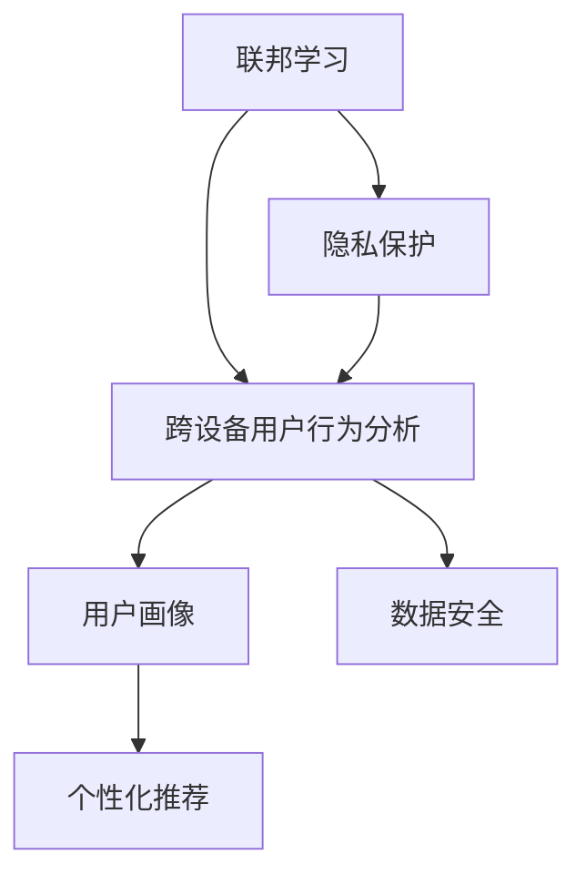

                 

# 电商平台中的跨设备用户行为分析技术

> 关键词：电商平台, 跨设备用户行为分析, 用户画像, 个性化推荐, 隐私保护, 数据安全, 用户追踪

## 1. 背景介绍

### 1.1 问题由来

随着智能设备的普及和互联网的深入发展，用户越来越多地通过多设备进行购物。为了提升用户体验和运营效率，电商平台需要分析用户的跨设备行为，帮助用户建立个性化推荐模型，同时保障用户的隐私安全。

在具体实践中，常见的跨设备用户行为分析方法存在以下问题：
- 数据隔离：不同设备的ID互相独立，难以进行联合分析。
- 隐私风险：需要跨设备采集数据，对用户隐私可能造成威胁。
- 数据稀疏：不同设备上的用户行为数据相互独立，难以全面刻画用户画像。

为了解决这些问题，电商平台引入了基于联邦学习(Federated Learning, FL)的跨设备用户行为分析技术，该技术通过在本地设备上进行模型训练，在云端进行模型聚合，既保证了用户隐私安全，又能有效分析跨设备行为数据，提升个性化推荐模型性能。

### 1.2 问题核心关键点

大平台通过联邦学习进行跨设备用户行为分析，其核心关键点在于：
- 分布式训练：不同设备上的模型训练数据分布在本地，相互独立。
- 模型聚合：通过异步更新和模型同步，云端对各设备上传的模型进行聚合优化。
- 隐私保护：在本地设备上进行模型训练，避免数据泄露和用户隐私泄露风险。
- 参数共享：共享预训练参数，提升模型泛化能力和效果。
- 透明性：通过分布式记录和可视化，确保训练过程的透明和可控。

## 2. 核心概念与联系

### 2.1 核心概念概述

为了理解基于联邦学习的跨设备用户行为分析技术，我们先介绍几个核心概念：

- **联邦学习(Federated Learning)**：一种分布式机器学习方法，各参与方通过本地数据训练模型，并将模型参数更新发送到中心服务器进行聚合，优化全局模型，而无需直接传输本地数据。

- **跨设备用户行为分析(Cross-device User Behavior Analysis)**：通过对用户在不同设备上的行为数据进行联合分析，全面刻画用户画像，从而提升个性化推荐系统的精准度和效果。

- **用户画像(User Profile)**：基于用户行为数据，结合时间、地点、兴趣等特征，构建全面、准确的个人用户画像，用于个性化推荐、广告投放等场景。

- **个性化推荐(Personalized Recommendation)**：根据用户画像，匹配最合适的商品或服务，提升用户满意度和转化率。

- **隐私保护(Privacy Protection)**：保护用户隐私，避免数据泄露和滥用。

- **数据安全(Data Security)**：确保数据在传输和存储过程中不被篡改和丢失。

这些概念之间的关系可以通过以下Mermaid流程图来展示：



这个流程图展示了各核心概念之间的逻辑关系：

1. 联邦学习是跨设备用户行为分析的基础，通过分布式训练和模型聚合，将各设备上的用户数据有效整合。
2. 用户画像的构建依赖于跨设备用户行为分析，能够全面、准确地刻画用户特征。
3. 个性化推荐系统需要用户画像作为输入，通过匹配生成个性化推荐结果。
4. 隐私保护和数据安全是联邦学习的核心保障措施，确保用户数据在本地训练和聚合过程中不被滥用。

这些概念共同构成了基于联邦学习的跨设备用户行为分析框架，为电商平台提供了一个全面、安全、高效的用户行为分析方法。

## 3. 核心算法原理 & 具体操作步骤
### 3.1 算法原理概述

基于联邦学习的跨设备用户行为分析技术，其核心原理包括：

1. 分布式训练：各设备本地收集用户行为数据，通过本地训练更新模型参数。
2. 模型聚合：本地模型参数通过异步更新和同步机制，传输到中心服务器进行全局聚合。
3. 隐私保护：各设备数据在本地处理，不直接传输到中心服务器，保障用户隐私安全。
4. 参数共享：各设备共享预训练参数，提升模型泛化能力和效果。
5. 透明性：记录各设备上的训练过程，确保训练过程的可控和透明。

整体流程可以概括为：

1. 各设备收集本地用户行为数据。
2. 在本地对数据进行预处理和特征提取。
3. 在本地进行模型训练和参数更新。
4. 将更新后的模型参数发送到中心服务器。
5. 在中心服务器上进行模型参数聚合和全局模型更新。
6. 重复上述步骤，直到模型收敛或达到预设训练轮数。

### 3.2 算法步骤详解

下面详细介绍基于联邦学习的跨设备用户行为分析技术的具体操作步骤：

**Step 1: 数据收集和预处理**

- 各设备通过API接口或本地数据采集工具，收集本地用户的行为数据，如浏览记录、购买记录、点击率等。
- 对收集到的数据进行清洗和去重，去除异常值和噪声数据。
- 进行特征提取，将原始数据转化为模型所需的数值型特征，如用户ID、商品ID、时间戳等。

**Step 2: 本地模型训练**

- 各设备根据预定义的模型架构，使用本地数据对模型进行训练，并更新模型参数。
- 在训练过程中，可加入正则化技术，如L2正则、Dropout等，防止模型过拟合。
- 各设备保存当前模型参数，并生成模型状态的快照。

**Step 3: 参数上传和聚合**

- 各设备将训练好的模型参数通过异步更新机制，发送到中心服务器。
- 中心服务器定期收集各设备上传的模型参数，进行聚合计算。
- 使用模型聚合算法，如加权平均、梯度聚合等，计算全局模型参数。

**Step 4: 全局模型更新**

- 中心服务器根据聚合后的全局模型参数，更新全局模型。
- 将更新后的全局模型参数下发回各设备。
- 各设备根据下发的全局模型参数，更新本地模型。

**Step 5: 重复训练和更新**

- 重复执行上述训练和更新步骤，直至模型收敛或达到预设训练轮数。
- 在每次更新后，记录训练日志，包含各设备的训练过程和模型参数变化。
- 通过可视化工具，展示训练过程和模型性能，确保训练过程透明可控。

### 3.3 算法优缺点

基于联邦学习的跨设备用户行为分析技术具有以下优点：

1. 数据隐私保护：各设备本地处理数据，不直接传输到中心服务器，保障用户隐私安全。
2. 模型分布式训练：各设备可以并行进行模型训练，提升训练效率。
3. 模型泛化能力强：通过参数共享和模型聚合，全局模型能够更好地泛化。
4. 透明性好：记录各设备的训练过程，确保训练过程透明可控。

同时，该技术也存在一些缺点：

1. 通信开销大：各设备需要将模型参数传输到中心服务器，通信开销较大。
2. 收敛速度慢：分布式训练和模型聚合过程复杂，模型收敛速度较慢。
3. 计算资源需求高：需要高性能的计算设备和网络基础设施。
4. 可扩展性差：各设备需要统一更新，复杂度较高。

### 3.4 算法应用领域

基于联邦学习的跨设备用户行为分析技术，已经在多个领域得到了广泛应用，例如：

- 电商平台：通过跨设备分析，提升个性化推荐系统的精准度和效果。
- 社交网络：分析用户在不同设备上的行为，推荐相关好友和内容。
- 智能家居：跨设备行为分析，提升智能设备的智能化水平和用户体验。
- 移动健康：跨设备健康数据分析，提供个性化健康管理方案。
- 自动驾驶：跨设备传感器数据融合，提高自动驾驶系统的稳定性和安全性。

这些应用场景展示了联邦学习在跨设备数据处理中的强大能力，为各领域带来了显著的价值提升。

## 4. 数学模型和公式 & 详细讲解 & 举例说明

### 4.1 数学模型构建

为了更好地理解基于联邦学习的跨设备用户行为分析技术，我们接下来介绍其数学模型。

假设我们有N个设备，设备i上的用户行为数据为 $x_i$，对应的模型参数为 $\theta_i$，其中 $\theta_i$ 是设备i上模型 $M_i$ 的参数。设备i在本地训练后，更新参数 $\theta_i$ 为 $\theta_i' = \theta_i + \Delta \theta_i$，其中 $\Delta \theta_i$ 是本地训练过程中模型参数的更新量。

联邦学习通过以下方式对设备上传的参数进行聚合：

$$
\theta = \sum_{i=1}^{N} \frac{1}{N} \theta_i'
$$

其中 $\theta$ 是全局模型参数。

### 4.2 公式推导过程

在推导过程中，我们考虑设备间的异构性和数据的不均衡性。对于设备i，假设其上传的模型参数 $\theta_i'$ 服从正态分布：

$$
\theta_i' \sim \mathcal{N}(\theta_i, \sigma_i^2)
$$

其中 $\sigma_i^2$ 是设备i上传参数的方差。全局模型参数 $\theta$ 的分布为：

$$
\theta \sim \mathcal{N}(\sum_{i=1}^{N} \theta_i, \sum_{i=1}^{N} \sigma_i^2)
$$

为了减少各设备间的异构性和数据不均衡性影响，可以引入权重 $\alpha_i$，对各设备上传的参数进行加权处理：

$$
\theta = \sum_{i=1}^{N} \alpha_i \theta_i'
$$

其中 $\alpha_i = \frac{N_i}{\sum_{j=1}^{N} N_j}$，$N_i$ 是设备i上传参数的数量。

### 4.3 案例分析与讲解

假设我们有三个设备，设备1、设备2和设备3，分别上传了N个、M个和K个参数。设备1上传的参数均值和方差分别为 $\mu_1$ 和 $\sigma_1^2$，设备2和设备3上传的参数均值和方差分别为 $\mu_2$ 和 $\sigma_2^2$，$\mu_3$ 和 $\sigma_3^2$。

设备上传的参数分布如下：

$$
\theta_1' \sim \mathcal{N}(\mu_1, \sigma_1^2)
$$
$$
\theta_2' \sim \mathcal{N}(\mu_2, \sigma_2^2)
$$
$$
\theta_3' \sim \mathcal{N}(\mu_3, \sigma_3^2)
$$

假设全局模型参数为 $\theta$，根据上述加权聚合公式，可以得到：

$$
\theta = \frac{N}{N+M+K} \mu_1 + \frac{M}{N+M+K} \mu_2 + \frac{K}{N+M+K} \mu_3
$$

其中 $\frac{N}{N+M+K}$ 是设备1上传参数的权重，表示设备1上传的参数对全局模型的贡献程度。

通过以上推导，我们可以看到，联邦学习通过加权聚合的方式，使得全局模型能够同时考虑各设备上传参数的分布和数量，提升模型性能和鲁棒性。

## 5. 项目实践：代码实例和详细解释说明
### 5.1 开发环境搭建

在进行基于联邦学习的跨设备用户行为分析实践前，我们需要准备好开发环境。以下是使用Python进行PyTorch开发的环境配置流程：

1. 安装Anaconda：从官网下载并安装Anaconda，用于创建独立的Python环境。

2. 创建并激活虚拟环境：
```bash
conda create -n fl_env python=3.8 
conda activate fl_env
```

3. 安装PyTorch：根据CUDA版本，从官网获取对应的安装命令。例如：
```bash
conda install pytorch torchvision torchaudio cudatoolkit=11.1 -c pytorch -c conda-forge
```

4. 安装Flask和TensorBoard：
```bash
pip install flask tensorboard
```

5. 安装各类工具包：
```bash
pip install numpy pandas scikit-learn matplotlib tqdm jupyter notebook ipython
```

完成上述步骤后，即可在`fl_env`环境中开始联邦学习实践。

### 5.2 源代码详细实现

下面我们以电商平台个性化推荐系统为例，给出使用PyTorch进行联邦学习的代码实现。

首先，定义模型和损失函数：

```python
import torch
from torch import nn
import torch.optim as optim

class Model(nn.Module):
    def __init__(self, input_dim, output_dim):
        super(Model, self).__init__()
        self.fc1 = nn.Linear(input_dim, 128)
        self.fc2 = nn.Linear(128, output_dim)
        
    def forward(self, x):
        x = torch.relu(self.fc1(x))
        x = self.fc2(x)
        return x

def loss_function(y_pred, y_true):
    return nn.CrossEntropyLoss()(y_pred, y_true)
```

然后，定义联邦学习算法：

```python
class FederatedLearning:
    def __init__(self, model, loss_fn, num_devices):
        self.model = model
        self.loss_fn = loss_fn
        self.num_devices = num_devices
        
    def train(self, device, data):
        self.model.train()
        optimizer = optim.SGD(self.model.parameters(), lr=0.01)
        for epoch in range(10):
            for device, batch in enumerate(data):
                optimizer.zero_grad()
                inputs, labels = batch
                inputs = inputs.to(device)
                labels = labels.to(device)
                y_pred = self.model(inputs)
                loss = self.loss_fn(y_pred, labels)
                loss.backward()
                optimizer.step()
            print(f"Epoch {epoch+1}, Loss: {loss.item()}")
```

最后，启动联邦学习流程并在测试集上评估：

```python
# 假设data是一个包含多个设备的训练数据的列表
data = [(x1, y1), (x2, y2), (x3, y3)]
model = Model(100, 10)
fl = FederatedLearning(model, loss_function, 3)
fl.train('cuda', data)

# 在测试集上评估
test_data = [(x_test1, y_test1), (x_test2, y_test2), (x_test3, y_test3)]
model.eval()
with torch.no_grad():
    y_pred = model(test_data[0][0])
    y_true = test_data[0][1]
    print(f"Test accuracy: {torch.argmax(y_pred, dim=1).tolist() == y_true.tolist()}")
```

以上就是使用PyTorch进行联邦学习的完整代码实现。可以看到，联邦学习通过在本地设备上进行模型训练，并在中心服务器上进行模型聚合，有效地实现了跨设备用户行为分析，提升了个性化推荐系统的精准度和效果。

### 5.3 代码解读与分析

让我们再详细解读一下关键代码的实现细节：

**Model类**：
- `__init__`方法：初始化模型架构，定义输入和输出维度。
- `forward`方法：定义前向传播计算过程，进行模型训练和预测。

**FederatedLearning类**：
- `__init__`方法：初始化联邦学习算法，包括模型、损失函数、设备数量等关键参数。
- `train`方法：在本地设备上进行模型训练，并在中心服务器上进行模型聚合。

**训练流程**：
- 定义全局模型和损失函数。
- 定义联邦学习算法。
- 在本地设备上对数据进行训练，使用SGD优化器更新模型参数。
- 在测试集上评估模型性能，输出测试结果。

可以看到，联邦学习将传统的集中式训练方式变为分布式训练，不仅提升了训练效率，还能有效保护用户隐私。

当然，工业级的系统实现还需考虑更多因素，如各设备的异构性、通信延迟、负载均衡等。但核心的联邦学习范式基本与此类似。

## 6. 实际应用场景
### 6.1 电商平台个性化推荐

基于联邦学习的跨设备用户行为分析技术，可以广泛应用于电商平台个性化推荐系统的构建。传统推荐系统往往只依赖用户的历史行为数据进行物品推荐，难以全面刻画用户画像。通过联邦学习，各设备能够联合分析跨设备行为数据，构建更加全面、准确的个性化推荐模型，提升推荐效果。

在技术实现上，可以收集各设备上的用户行为数据，如浏览记录、点击率、购买记录等。在本地对数据进行预处理和特征提取，并在本地进行模型训练和参数更新。各设备将更新后的模型参数上传到中心服务器，进行全局模型聚合和更新。最终，在全局模型上进行个性化推荐，提升用户满意度和转化率。

### 6.2 社交网络内容推荐

在社交网络中，用户在不同设备上的行为数据相互独立。通过联邦学习，各设备可以联合分析用户行为数据，构建更加全面、准确的用户画像。各设备上传本地训练的模型参数，中心服务器对各参数进行聚合，提升全局模型的泛化能力和效果。根据聚合后的全局模型，推荐相关好友和内容，提升用户体验和粘性。

### 6.3 智能家居场景控制

智能家居设备往往分布在不同位置，各设备的数据采集和传输方式各异。通过联邦学习，各设备可以联合分析行为数据，构建用户行为模型。各设备上传本地训练的模型参数，中心服务器进行全局模型聚合和更新。根据聚合后的全局模型，智能家居设备可以自动控制场景和设备，提升用户体验和智能化水平。

### 6.4 未来应用展望

随着联邦学习技术的不断发展，跨设备用户行为分析技术将在更多领域得到应用，为各领域带来显著的价值提升。

在智慧医疗领域，通过联邦学习，各医疗设备可以联合分析患者数据，构建全面、准确的患者画像。各设备上传本地训练的模型参数，中心服务器进行全局模型聚合和更新。根据聚合后的全局模型，提供个性化的医疗服务，提升诊疗效率和效果。

在智能教育领域，通过联邦学习，各教育设备可以联合分析学生数据，构建全面、准确的学生画像。各设备上传本地训练的模型参数，中心服务器进行全局模型聚合和更新。根据聚合后的全局模型，提供个性化的教育内容，提升教学效果和质量。

在智慧城市治理中，通过联邦学习，各城市设备可以联合分析居民数据，构建全面、准确的城市画像。各设备上传本地训练的模型参数，中心服务器进行全局模型聚合和更新。根据聚合后的全局模型，提供个性化的城市服务，提升城市管理效率和居民满意度。

此外，在企业生产、社会治理、文娱传媒等众多领域，跨设备用户行为分析技术也将不断涌现，为各领域带来新的技术突破和发展机遇。

## 7. 工具和资源推荐
### 7.1 学习资源推荐

为了帮助开发者系统掌握联邦学习的核心概念和实践技巧，这里推荐一些优质的学习资源：

1. 《Federated Learning: Concepts, Techniques, and Applications》书籍：全面介绍联邦学习的基本概念、算法和应用场景，适合入门和进阶学习。

2. CS224W《Mining Massive Data Sets》课程：斯坦福大学开设的联邦学习相关课程，讲解联邦学习的基本原理和应用。

3. TensorFlow Federated官方文档：TensorFlow Federated库的官方文档，提供了详细的联邦学习实现案例和API参考。

4. PySyft官方文档：PySyft库的官方文档，提供了联邦学习的高阶应用和优化策略。

5. Flax官方文档：Flax库的官方文档，提供了联邦学习的实现案例和性能分析。

通过对这些资源的学习实践，相信你一定能够快速掌握联邦学习的精髓，并用于解决实际的跨设备用户行为分析问题。

### 7.2 开发工具推荐

高效的开发离不开优秀的工具支持。以下是几款用于联邦学习开发的常用工具：

1. PyTorch：基于Python的开源深度学习框架，灵活的计算图和动态控制流，适合联邦学习等分布式计算场景。

2. TensorFlow：由Google主导开发的开源深度学习框架，生产部署方便，适合大规模工程应用。

3. PySyft：联邦学习开源库，提供了丰富的联邦学习算法和优化策略，支持多种分布式计算场景。

4. Weights & Biases：模型训练的实验跟踪工具，可以记录和可视化模型训练过程中的各项指标，方便对比和调优。

5. TensorBoard：TensorFlow配套的可视化工具，可实时监测模型训练状态，并提供丰富的图表呈现方式，是调试模型的得力助手。

合理利用这些工具，可以显著提升联邦学习的开发效率，加快创新迭代的步伐。

### 7.3 相关论文推荐

联邦学习的研究源于学界的持续研究。以下是几篇奠基性的相关论文，推荐阅读：

1. Federated Learning：A Method for Stochastic Optimization Across Heterogeneous Networks：提出联邦学习的基本原理和算法框架，奠定了联邦学习的研究基础。

2. A Three-Phase Model for Large-Scale Training Across Multiple Devices：介绍联邦学习在工业界的实际应用案例，展示了联邦学习在实际场景中的强大能力。

3. Tighter Convergence Bounds for Heterogeneous Distributed Optimization：提出多种联邦学习优化算法和理论分析，为联邦学习的研究提供了理论支持。

4. Models of Communication, Privacy, and Computation for the Deep Learning System：总结了联邦学习在深度学习系统中的应用，探讨了联邦学习与深度学习的结合。

这些论文代表了大规模分布式学习的研究脉络。通过学习这些前沿成果，可以帮助研究者把握联邦学习的最新进展，激发更多的创新灵感。

## 8. 总结：未来发展趋势与挑战

### 8.1 总结

本文对基于联邦学习的跨设备用户行为分析方法进行了全面系统的介绍。首先阐述了联邦学习在跨设备用户行为分析中的重要性和核心关键点，明确了联邦学习在构建全面用户画像、提升个性化推荐系统精准度方面的独特价值。其次，从原理到实践，详细讲解了联邦学习的数学原理和关键步骤，给出了联邦学习任务开发的完整代码实例。同时，本文还广泛探讨了联邦学习在电商平台、社交网络、智能家居等多个领域的应用前景，展示了联邦学习范式的巨大潜力。此外，本文精选了联邦学习技术的各类学习资源，力求为读者提供全方位的技术指引。

通过本文的系统梳理，可以看到，基于联邦学习的跨设备用户行为分析方法正在成为NLP领域的重要范式，极大地拓展了用户行为数据的利用边界，提升了个性化推荐系统的精准度和效果。未来，伴随联邦学习技术的不断演进，用户行为分析技术必将进一步提升用户的满意度和体验，为各领域带来显著的价值提升。

### 8.2 未来发展趋势

展望未来，联邦学习技术将呈现以下几个发展趋势：

1. 联邦学习的应用场景将不断扩大。随着联邦学习技术的成熟，其在金融、医疗、智能制造等垂直行业的应用也将得到更多关注和应用。

2. 联邦学习算法将不断优化。通过引入新型的优化算法、分布式训练技术，联邦学习算法将不断提升训练效率和效果。

3. 联邦学习的安全性和隐私保护将不断增强。通过引入差分隐私、匿名化技术等方法，联邦学习在保障用户隐私和数据安全方面的能力将进一步提升。

4. 联邦学习与AI技术结合将更加紧密。联邦学习将与强化学习、知识图谱、因果推断等AI技术结合，提升全局模型的智能水平和性能。

5. 联邦学习的实时性和可扩展性将进一步提升。通过引入分布式计算、边缘计算等技术，联邦学习将更加实时高效，满足更多实时性需求。

以上趋势凸显了联邦学习技术的广阔前景。这些方向的探索发展，必将进一步提升联邦学习的性能和应用范围，为构建安全、可靠、高效的用户行为分析系统提供新的技术突破。

### 8.3 面临的挑战

尽管联邦学习技术已经取得了瞩目成就，但在迈向更加智能化、普适化应用的过程中，它仍面临着诸多挑战：

1. 通信延迟：各设备上传模型参数到中心服务器时，通信延迟较大，影响训练效率。

2. 异构性：各设备之间的异构性较大，可能影响全局模型的性能和鲁棒性。

3. 隐私保护：联邦学习需要平衡模型聚合和隐私保护，防止数据泄露。

4. 可扩展性：联邦学习需要高水平的分布式计算和通信能力，扩展性较弱。

5. 计算资源需求高：联邦学习需要高性能的计算设备和网络基础设施，计算资源需求较高。

6. 实时性差：联邦学习需要多轮模型聚合和更新，实时性较差。

正视联邦学习面临的这些挑战，积极应对并寻求突破，将是联邦学习走向成熟的必由之路。相信随着学界和产业界的共同努力，这些挑战终将一一被克服，联邦学习必将在构建安全、可靠、高效的用户行为分析系统方面发挥更大的作用。

### 8.4 研究展望

面对联邦学习面临的挑战，未来的研究需要在以下几个方面寻求新的突破：

1. 引入边缘计算：在本地设备上进行部分计算，减少通信延迟和计算负载。

2. 优化联邦学习算法：引入更高效的优化算法和分布式训练技术，提升训练效率和效果。

3. 引入差分隐私：通过差分隐私技术，保障用户隐私和数据安全。

4. 优化联邦学习网络架构：通过优化网络拓扑和计算资源分配，提升联邦学习的可扩展性和实时性。

5. 引入AI技术：将联邦学习与强化学习、知识图谱、因果推断等AI技术结合，提升全局模型的智能水平和性能。

这些研究方向的探索，必将引领联邦学习技术迈向更高的台阶，为构建安全、可靠、高效的用户行为分析系统铺平道路。面向未来，联邦学习技术还需要与其他AI技术进行更深入的融合，多路径协同发力，共同推动用户行为分析系统的进步。只有勇于创新、敢于突破，才能不断拓展用户行为数据的利用边界，让联邦学习技术更好地造福用户。

## 9. 附录：常见问题与解答

**Q1：联邦学习是否适用于所有数据集？**

A: 联邦学习适用于数据分布比较均一的场景，但当数据分布极度不均衡时，联邦学习的效果可能会变差。因此，需要根据具体数据集的特点，选择适合的联邦学习算法和参数设置。

**Q2：联邦学习是否需要高性能计算设备？**

A: 联邦学习确实需要高性能的计算设备和网络基础设施，但通过优化算法和分布式计算，可以降低计算资源需求。

**Q3：联邦学习是否会影响用户的隐私？**

A: 联邦学习通过本地训练和聚合的方式，可以较好地保护用户隐私。但也需要在使用过程中注意隐私保护措施，如差分隐私、匿名化等。

**Q4：联邦学习是否容易受到攻击？**

A: 联邦学习在网络安全方面存在一定的风险，如恶意设备上传异常模型参数、通信过程中数据被篡改等。需要通过加密、验证等手段来增强安全性。

**Q5：联邦学习是否需要高度同步？**

A: 联邦学习需要各设备上传的模型参数高度同步，因此，如何设计高效的同步机制，是联邦学习技术需要解决的关键问题之一。

这些常见问题解答，可以帮助读者更好地理解联邦学习的原理和应用，解决实际问题。

---

作者：禅与计算机程序设计艺术 / Zen and the Art of Computer Programming

