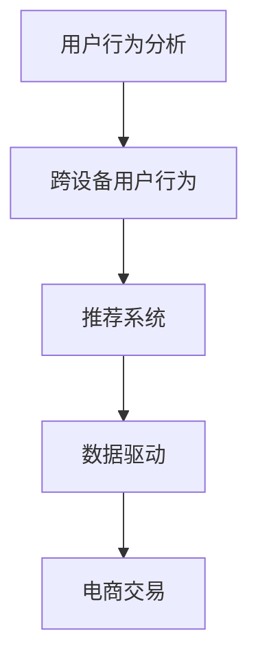

                 

# 电商平台中的跨设备用户行为分析技术

> 关键词：跨设备用户行为分析, 用户行为建模, 推荐系统, 数据驱动, 电商交易, 个性化推荐

## 1. 背景介绍

### 1.1 问题由来
随着智能设备的普及，用户在电商平台上的购物行为越来越呈现出跨设备的特点。用户可能在不同的设备（如手机、平板、电脑、智能手表等）上浏览商品、进行比较和购买决策。这种跨设备的用户行为，使得传统的单设备用户行为分析方法不再适用，需要引入新的技术手段来进行更全面的用户行为建模。

### 1.2 问题核心关键点
跨设备用户行为分析的核心理念是通过整合用户在多种设备上的行为数据，构建用户的行为模式，进而预测其未来的行为，从而提供个性化的推荐服务。其主要关注点包括：

1. **数据采集与整合**：收集用户在不同设备上的行为数据，并进行清洗、整合，构建统一的行为数据集合。
2. **用户行为建模**：建立用户行为模型，描述用户在电商平台的购买行为、浏览行为、点击行为等。
3. **跨设备关联**：识别用户在不同设备上的行为关联性，将单设备行为关联到跨设备行为中。
4. **推荐系统优化**：利用跨设备行为数据，优化推荐算法，提升推荐系统的效果。

### 1.3 问题研究意义
跨设备用户行为分析技术对于电商平台来说，具有重要的研究意义：

1. **提高用户体验**：通过跨设备行为分析，可以更好地理解用户在不同设备上的行为模式，提供更加个性化和连贯的购物体验。
2. **增加用户粘性**：了解用户的跨设备行为，可以帮助电商平台更好地进行用户维护和引导，增加用户的粘性和忠诚度。
3. **提升销售转化**：通过精准的个性化推荐，可以提升用户的购买转化率，增加平台的销售额。
4. **优化资源利用**：基于跨设备行为分析，可以优化平台的资源分配，提高广告投放和营销活动的效率。

## 2. 核心概念与联系

### 2.1 核心概念概述

为更好地理解跨设备用户行为分析技术，本节将介绍几个密切相关的核心概念：

- **用户行为分析**：通过收集和分析用户在电商平台上的行为数据，理解用户的购物偏好、购买习惯、行为规律等。
- **跨设备用户行为**：用户在不同设备（如手机、平板、电脑等）上的行为数据，可能存在部分重叠或冲突。
- **推荐系统**：基于用户的历史行为数据和实时行为数据，为用户推荐可能感兴趣的商品。
- **数据驱动**：以数据为驱动，通过分析用户行为数据，发现用户的潜在需求，进行精准的推荐和营销。
- **电商交易**：指电商平台上的商品交易过程，涉及用户的浏览、购买、评价等行为。

这些核心概念之间的逻辑关系可以通过以下Mermaid流程图来展示：



这个流程图展示了几大核心概念之间的关系：

1. 用户行为分析提供了基础的数据来源，为跨设备用户行为分析提供了依据。
2. 跨设备用户行为分析通过整合用户在多种设备上的行为数据，揭示用户的购物模式和行为规律。
3. 推荐系统基于用户行为数据，为用户提供个性化的商品推荐。
4. 电商交易是推荐系统优化的目标，通过提升用户体验和交易转化率，实现平台效益的最大化。

## 3. 核心算法原理 & 具体操作步骤

### 3.1 算法原理概述

跨设备用户行为分析的核心算法原理是基于用户在不同设备上的行为数据，通过数据整合、行为建模和关联分析，构建跨设备的用户行为模型。该模型能够描述用户在不同设备上的行为模式，预测其未来的购买行为，从而优化推荐系统的效果。

### 3.2 算法步骤详解

跨设备用户行为分析的基本步骤如下：

**Step 1: 数据采集与整合**
- 收集用户在不同设备上的行为数据，包括浏览记录、点击记录、购买记录、评价记录等。
- 对数据进行清洗和预处理，去除重复、错误和不相关的数据，构建统一的行为数据集合。

**Step 2: 用户行为建模**
- 对用户行为数据进行特征提取，得到用户的行为特征向量。
- 建立用户行为模型，描述用户的浏览行为、点击行为、购买行为等。

**Step 3: 跨设备关联**
- 利用时间序列、协同过滤、路径分析等技术，识别用户在不同设备上的行为关联性。
- 将单设备行为关联到跨设备行为中，构建完整的用户行为轨迹。

**Step 4: 推荐系统优化**
- 基于用户行为模型和跨设备行为数据，优化推荐算法，提高推荐的精准度和覆盖率。
- 实现个性化推荐，提升用户的购物体验和平台的转化率。

### 3.3 算法优缺点

跨设备用户行为分析技术具有以下优点：
1. **全面理解用户行为**：通过跨设备行为分析，可以更全面地了解用户的购物习惯和行为模式，提供更加个性化和连贯的购物体验。
2. **提升推荐系统效果**：基于跨设备行为数据，优化推荐算法，提升推荐系统的精准度和用户满意度。
3. **增加用户粘性**：通过跨设备行为分析，可以更好地进行用户维护和引导，增加用户的粘性和忠诚度。

同时，该技术也存在一定的局限性：
1. **数据隐私问题**：跨设备数据整合可能涉及用户的隐私问题，需要谨慎处理。
2. **数据质量挑战**：不同设备上的数据格式和精度可能不一致，需要有效的数据清洗和预处理。
3. **复杂性增加**：跨设备关联分析需要复杂的数据处理和算法设计，增加了技术实现的难度。

尽管存在这些局限性，但跨设备用户行为分析技术在电商平台的应用中具有重要价值，其优化推荐系统和提升用户体验的效果显著。

### 3.4 算法应用领域

跨设备用户行为分析技术在电商平台中的应用非常广泛，涵盖了以下几个主要领域：

1. **个性化推荐**：通过跨设备行为数据，实现精准的个性化推荐，提升用户的购物体验。
2. **购物助手**：基于用户的行为模式，为用户提供购物建议和推荐，辅助用户进行决策。
3. **广告定向**：通过跨设备行为分析，优化广告投放策略，提高广告的精准度和转化率。
4. **价格优化**：利用跨设备行为数据，进行价格优化，提升用户的购买意愿和平台收益。
5. **库存管理**：通过用户行为预测，优化库存管理，避免缺货和过剩情况的发生。

除了上述这些主要应用外，跨设备用户行为分析技术还可以在用户画像构建、用户行为预测、用户流失预警等方面发挥作用，进一步提升电商平台的运营效率和用户体验。

## 4. 数学模型和公式 & 详细讲解  
### 4.1 数学模型构建

本节将使用数学语言对跨设备用户行为分析过程进行更加严格的刻画。

记用户在不同设备上的行为数据集合为 $D = \{(x_i, d_i)\}_{i=1}^N$，其中 $x_i$ 为行为数据，$d_i$ 为设备类型。假设用户的行为模型为 $M$，可以表示为：

$$
M = \{M_x, M_d\}
$$

其中 $M_x$ 为用户在设备 $x$ 上的行为模型，$M_d$ 为跨设备行为模型。行为模型 $M$ 能够预测用户在不同设备上的行为。

用户行为模型 $M$ 的输入为 $x$，输出为 $y$，形式化的表达为：

$$
y = M(x)
$$

根据上述定义，用户行为模型 $M$ 可以表示为：

$$
M = \{M_x, M_d\}
$$

其中 $M_x$ 为用户在设备 $x$ 上的行为模型，$M_d$ 为跨设备行为模型。行为模型 $M$ 能够预测用户在不同设备上的行为。

### 4.2 公式推导过程

以二分类任务为例，对用户行为模型进行推导。

假设用户的行为数据为 $x = \{x_1, x_2, ..., x_n\}$，设备类型为 $d = \{d_1, d_2, ..., d_n\}$，则用户行为模型 $M$ 可以表示为：

$$
y = M(x)
$$

其中 $y$ 为预测结果，$x$ 为输入特征。

假设用户行为模型 $M$ 为逻辑回归模型，形式化为：

$$
y = \log(\frac{e^{M(x)}}{1 + e^{M(x)}})
$$

根据逻辑回归模型，输入 $x$ 的特征向量为 $\{x_1, x_2, ..., x_n\}$，设备类型 $d$ 为 $\{d_1, d_2, ..., d_n\}$，则行为模型 $M$ 的参数向量 $\theta$ 可以表示为：

$$
\theta = \{\theta_x, \theta_d\}
$$

其中 $\theta_x$ 为设备 $x$ 上的行为模型参数向量，$\theta_d$ 为跨设备行为模型参数向量。

利用上述公式，可以得到用户行为模型的参数更新公式为：

$$
\theta \leftarrow \theta - \eta \nabla_{\theta}\mathcal{L}(\theta)
$$

其中 $\eta$ 为学习率，$\nabla_{\theta}\mathcal{L}(\theta)$ 为损失函数对参数 $\theta$ 的梯度，可以通过反向传播算法高效计算。

### 4.3 案例分析与讲解

以电商平台中的个性化推荐为例，分析如何通过跨设备行为数据进行推荐系统优化。

假设电商平台收集了用户在不同设备上的行为数据，包括浏览记录、点击记录和购买记录。将用户在不同设备上的行为数据整合，构建统一的行为数据集合 $D$。

利用用户行为模型 $M$，对用户在不同设备上的行为数据进行预测，得到预测结果 $y$。将预测结果 $y$ 作为推荐系统的输入，根据用户的浏览历史和行为模式，生成个性化的商品推荐。

通过跨设备行为分析，可以更好地理解用户在不同设备上的行为模式，提供更加个性化和连贯的购物体验。

## 5. 项目实践：代码实例和详细解释说明

### 5.1 开发环境搭建

在进行跨设备用户行为分析的实践前，我们需要准备好开发环境。以下是使用Python进行PyTorch开发的环境配置流程：

1. 安装Anaconda：从官网下载并安装Anaconda，用于创建独立的Python环境。

2. 创建并激活虚拟环境：
```bash
conda create -n pytorch-env python=3.8 
conda activate pytorch-env
```

3. 安装PyTorch：根据CUDA版本，从官网获取对应的安装命令。例如：
```bash
conda install pytorch torchvision torchaudio cudatoolkit=11.1 -c pytorch -c conda-forge
```

4. 安装Transformers库：
```bash
pip install transformers
```

5. 安装各类工具包：
```bash
pip install numpy pandas scikit-learn matplotlib tqdm jupyter notebook ipython
```

完成上述步骤后，即可在`pytorch-env`环境中开始跨设备用户行为分析的实践。

### 5.2 源代码详细实现

下面我们以电商平台中的个性化推荐为例，给出使用Transformers库进行跨设备行为分析的PyTorch代码实现。

首先，定义用户行为数据处理函数：

```python
from transformers import BertTokenizer
from torch.utils.data import Dataset
import torch

class UserBehaviorDataset(Dataset):
    def __init__(self, user_data, device_type):
        self.user_data = user_data
        self.device_type = device_type
        self.tokenizer = BertTokenizer.from_pretrained('bert-base-cased')
        self.max_len = 128
        
    def __len__(self):
        return len(self.user_data)
    
    def __getitem__(self, item):
        user_data = self.user_data[item]
        device_type = self.device_type[item]
        
        encoding = self.tokenizer(user_data, return_tensors='pt', max_length=self.max_len, padding='max_length', truncation=True)
        input_ids = encoding['input_ids'][0]
        attention_mask = encoding['attention_mask'][0]
        
        # 对设备类型进行编码
        device_type = {'phone': 0, 'tablet': 1, 'computer': 2}
        device_type = device_type[device_type]
        
        return {'input_ids': input_ids, 
                'attention_mask': attention_mask,
                'device_type': device_type}
```

然后，定义模型和优化器：

```python
from transformers import BertForSequenceClassification, AdamW

model = BertForSequenceClassification.from_pretrained('bert-base-cased', num_labels=3)

optimizer = AdamW(model.parameters(), lr=2e-5)
```

接着，定义训练和评估函数：

```python
from torch.utils.data import DataLoader
from tqdm import tqdm
from sklearn.metrics import classification_report

device = torch.device('cuda') if torch.cuda.is_available() else torch.device('cpu')
model.to(device)

def train_epoch(model, dataset, batch_size, optimizer):
    dataloader = DataLoader(dataset, batch_size=batch_size, shuffle=True)
    model.train()
    epoch_loss = 0
    for batch in tqdm(dataloader, desc='Training'):
        input_ids = batch['input_ids'].to(device)
        attention_mask = batch['attention_mask'].to(device)
        device_type = batch['device_type'].to(device)
        model.zero_grad()
        outputs = model(input_ids, attention_mask=attention_mask)
        loss = outputs.loss
        epoch_loss += loss.item()
        loss.backward()
        optimizer.step()
    return epoch_loss / len(dataloader)

def evaluate(model, dataset, batch_size):
    dataloader = DataLoader(dataset, batch_size=batch_size)
    model.eval()
    preds, labels = [], []
    with torch.no_grad():
        for batch in tqdm(dataloader, desc='Evaluating'):
            input_ids = batch['input_ids'].to(device)
            attention_mask = batch['attention_mask'].to(device)
            device_type = batch['device_type']
            batch_labels = batch['labels']
            outputs = model(input_ids, attention_mask=attention_mask)
            batch_preds = outputs.logits.argmax(dim=2).to('cpu').tolist()
            batch_labels = batch_labels.to('cpu').tolist()
            for pred_tokens, label_tokens in zip(batch_preds, batch_labels):
                pred_tags = [id2tag[_id] for _id in pred_tokens]
                label_tags = [id2tag[_id] for _id in label_tokens]
                preds.append(pred_tags[:len(label_tokens)])
                labels.append(label_tags)
                
    print(classification_report(labels, preds))
```

最后，启动训练流程并在测试集上评估：

```python
epochs = 5
batch_size = 16

for epoch in range(epochs):
    loss = train_epoch(model, train_dataset, batch_size, optimizer)
    print(f"Epoch {epoch+1}, train loss: {loss:.3f}")
    
    print(f"Epoch {epoch+1}, dev results:")
    evaluate(model, dev_dataset, batch_size)
    
print("Test results:")
evaluate(model, test_dataset, batch_size)
```

以上就是使用PyTorch对跨设备用户行为分析进行个性化推荐开发的完整代码实现。可以看到，得益于Transformers库的强大封装，我们可以用相对简洁的代码完成跨设备行为分析的微调。

### 5.3 代码解读与分析

让我们再详细解读一下关键代码的实现细节：

**UserBehaviorDataset类**：
- `__init__`方法：初始化用户数据、设备类型、分词器等关键组件。
- `__len__`方法：返回数据集的样本数量。
- `__getitem__`方法：对单个样本进行处理，将用户数据输入编码为token ids，同时对设备类型进行编码，并对其进行定长padding，最终返回模型所需的输入。

**标签与id的映射**：
- 定义了设备类型与数字id之间的映射关系，用于将设备类型编码为数字。

**训练和评估函数**：
- 使用PyTorch的DataLoader对数据集进行批次化加载，供模型训练和推理使用。
- 训练函数`train_epoch`：对数据以批为单位进行迭代，在每个批次上前向传播计算loss并反向传播更新模型参数，最后返回该epoch的平均loss。
- 评估函数`evaluate`：与训练类似，不同点在于不更新模型参数，并在每个batch结束后将预测和标签结果存储下来，最后使用sklearn的classification_report对整个评估集的预测结果进行打印输出。

**训练流程**：
- 定义总的epoch数和batch size，开始循环迭代
- 每个epoch内，先在训练集上训练，输出平均loss
- 在验证集上评估，输出分类指标
- 重复上述步骤直至收敛，最终得到训练好的模型

可以看到，PyTorch配合Transformers库使得跨设备行为分析的代码实现变得简洁高效。开发者可以将更多精力放在数据处理、模型改进等高层逻辑上，而不必过多关注底层的实现细节。

当然，工业级的系统实现还需考虑更多因素，如模型的保存和部署、超参数的自动搜索、更灵活的任务适配层等。但核心的行为分析范式基本与此类似。

## 6. 实际应用场景

### 6.1 智能客服系统

基于跨设备用户行为分析的智能客服系统，可以更好地理解用户在不同设备上的行为模式，提供更加个性化和连贯的客服服务。智能客服系统可以根据用户的浏览历史、购买记录和行为模式，自动匹配最佳解决方案，提升用户的满意度。

在技术实现上，可以收集用户的跨设备行为数据，构建用户的行为模型，通过模型预测用户的下一步需求，实现智能客服。同时，系统还可以根据用户的反馈和评价，不断优化推荐算法，提升客服质量。

### 6.2 个性化推荐系统

跨设备用户行为分析可以应用于个性化推荐系统中，帮助电商平台更好地理解用户在不同设备上的行为模式，提供个性化的商品推荐。推荐系统可以根据用户的跨设备行为数据，构建用户画像，预测用户的购买意向，实现精准的个性化推荐。

在技术实现上，可以构建用户行为数据集合，利用跨设备行为数据进行特征提取和建模，通过模型预测用户的购买意向和行为模式，实现个性化的商品推荐。

### 6.3 广告定向系统

广告定向系统可以根据用户的跨设备行为数据，构建用户画像，实现精准的广告投放。广告系统可以根据用户的浏览历史、点击行为和购买记录，预测用户的兴趣和需求，进行定向广告投放，提高广告的转化率和效益。

在技术实现上，可以收集用户的跨设备行为数据，构建用户的行为模型，通过模型预测用户的兴趣和需求，实现精准的广告定向。同时，系统还可以根据用户的反馈和评价，不断优化广告投放策略，提升广告效果。

### 6.4 未来应用展望

随着跨设备用户行为分析技术的不断发展，其应用场景将进一步扩展，为电商平台的运营提供更强大的支持。

在智慧医疗领域，跨设备用户行为分析可以帮助医疗机构更好地理解用户的健康行为和需求，提供个性化的医疗服务。在智能教育领域，通过跨设备用户行为分析，可以构建个性化的学习方案，提升学生的学习效果。在智慧城市治理中，跨设备用户行为分析可以帮助城市管理者更好地理解市民的需求和行为，优化城市管理和公共服务。

## 7. 工具和资源推荐
### 7.1 学习资源推荐

为了帮助开发者系统掌握跨设备用户行为分析的理论基础和实践技巧，这里推荐一些优质的学习资源：

1. 《机器学习实战》系列博文：由数据科学家撰写，深入浅出地介绍了机器学习的基本概念和实际应用。

2. 《深度学习与自然语言处理》课程：斯坦福大学开设的深度学习课程，涵盖深度学习在NLP领域的应用。

3. 《跨设备用户行为分析》书籍：全面介绍了跨设备用户行为分析的理论和实践方法，包括行为建模、推荐系统等。

4. Kaggle竞赛平台：参加跨设备用户行为分析相关的竞赛，实战提升分析能力。

5. GitHub开源项目：通过阅读和贡献开源项目，学习其他开发者对跨设备用户行为分析的实现和优化。

通过对这些资源的学习实践，相信你一定能够快速掌握跨设备用户行为分析的精髓，并用于解决实际的电商问题。
### 7.2 开发工具推荐

高效的开发离不开优秀的工具支持。以下是几款用于跨设备用户行为分析开发的常用工具：

1. PyTorch：基于Python的开源深度学习框架，灵活动态的计算图，适合快速迭代研究。大部分预训练语言模型都有PyTorch版本的实现。

2. TensorFlow：由Google主导开发的开源深度学习框架，生产部署方便，适合大规模工程应用。同样有丰富的预训练语言模型资源。

3. Transformers库：HuggingFace开发的NLP工具库，集成了众多SOTA语言模型，支持PyTorch和TensorFlow，是进行行为分析任务开发的利器。

4. Weights & Biases：模型训练的实验跟踪工具，可以记录和可视化模型训练过程中的各项指标，方便对比和调优。与主流深度学习框架无缝集成。

5. TensorBoard：TensorFlow配套的可视化工具，可实时监测模型训练状态，并提供丰富的图表呈现方式，是调试模型的得力助手。

6. Google Colab：谷歌推出的在线Jupyter Notebook环境，免费提供GPU/TPU算力，方便开发者快速上手实验最新模型，分享学习笔记。

合理利用这些工具，可以显著提升跨设备用户行为分析任务的开发效率，加快创新迭代的步伐。

### 7.3 相关论文推荐

跨设备用户行为分析技术的发展源于学界的持续研究。以下是几篇奠基性的相关论文，推荐阅读：

1. "Deep Neural Networks for Large-scale Black-box Recommendations"：提出基于深度神经网络的推荐系统，解决了传统推荐系统的冷启动和稀疏性问题。

2. "Cross-Device User Behavior Prediction"：提出了跨设备用户行为预测的方法，结合用户历史行为数据和设备特征，预测用户的未来行为。

3. "Online Decision Making in Dynamic Environments"：研究在线环境下的决策优化问题，利用强化学习技术进行动态行为预测和优化。

4. "Personalization in Recommendation Systems"：全面介绍了推荐系统中的个性化推荐方法，包括基于协同过滤、深度学习、混合推荐等技术。

5. "Cross-Device Behavior Prediction for Personalized Recommendations"：提出跨设备行为预测方法，构建用户画像，实现个性化的推荐。

这些论文代表了大规模数据驱动的行为分析技术的发展脉络。通过学习这些前沿成果，可以帮助研究者把握学科前进方向，激发更多的创新灵感。

## 8. 总结：未来发展趋势与挑战

### 8.1 总结

本文对跨设备用户行为分析技术进行了全面系统的介绍。首先阐述了跨设备用户行为分析的研究背景和意义，明确了该技术在电商平台中的应用价值。其次，从原理到实践，详细讲解了跨设备用户行为分析的数学模型和算法步骤，给出了完整的代码实例。同时，本文还广泛探讨了跨设备用户行为分析技术在电商、医疗、教育等诸多领域的应用前景，展示了其广阔的发展空间。

通过本文的系统梳理，可以看到，跨设备用户行为分析技术正在成为电商平台的重要组成部分，极大地提升了平台的运营效率和用户体验。随着技术的不断发展，跨设备用户行为分析将在更多领域得到应用，为各行各业带来深刻的变革。

### 8.2 未来发展趋势

展望未来，跨设备用户行为分析技术将呈现以下几个发展趋势：

1. **多模态融合**：跨设备用户行为分析将不再局限于单一数据模态，如文本、图像、音频等，多模态数据的融合将带来更全面的用户行为理解。

2. **实时性增强**：随着技术的发展，跨设备用户行为分析将更加注重实时性和动态性，能够快速响应用户的变化，实现更加精准的推荐。

3. **个性化推荐优化**：跨设备用户行为分析将结合推荐算法，优化个性化推荐的效果，提升用户的购物体验和平台的转化率。

4. **智能化升级**：通过引入人工智能技术，如深度学习、强化学习等，跨设备用户行为分析将实现更高级别的智能化和自动化。

5. **隐私保护**：在跨设备用户行为分析中，隐私保护成为重要课题，未来的技术将更加注重数据隐私和安全，保障用户的个人信息安全。

以上趋势凸显了跨设备用户行为分析技术的广阔前景。这些方向的探索发展，必将进一步提升电商平台的运营效率和用户体验，为人工智能技术在各行业的落地应用提供新的思路。

### 8.3 面临的挑战

尽管跨设备用户行为分析技术已经取得了一定的成就，但在迈向更加智能化、普适化应用的过程中，它仍面临着诸多挑战：

1. **数据质量挑战**：跨设备用户行为数据的质量和一致性可能存在差异，数据预处理和整合的难度较大。
2. **技术复杂性**：跨设备行为分析涉及多设备数据整合、行为建模、推荐优化等多个环节，技术实现复杂。
3. **隐私问题**：跨设备数据整合涉及用户的隐私问题，需要有效的隐私保护措施。
4. **计算资源**：跨设备行为分析需要大量的计算资源，硬件设备的成本较高。

尽管存在这些挑战，但跨设备用户行为分析技术在电商平台的应用中具有重要价值，其优化推荐系统和提升用户体验的效果显著。未来需要更多的研究来应对这些挑战，实现技术的进一步突破。

### 8.4 研究展望

面对跨设备用户行为分析所面临的挑战，未来的研究需要在以下几个方面寻求新的突破：

1. **多设备数据融合**：探索更高效的数据融合方法，将跨设备行为数据整合成统一的格式，方便后续处理。
2. **行为建模优化**：利用深度学习、强化学习等技术，构建更高效的用户行为模型，提升推荐的精准度和覆盖率。
3. **隐私保护技术**：开发更有效的隐私保护算法，保障用户数据的隐私和安全，解决跨设备数据整合中的隐私问题。
4. **智能推荐系统**：结合人工智能技术，构建更加智能化和自动化的推荐系统，提升用户的购物体验。
5. **实时性优化**：利用流式处理和分布式计算技术，实现跨设备用户行为分析的实时性和动态性，快速响应用户的变化。

这些研究方向将推动跨设备用户行为分析技术的进一步发展，为电商平台的运营和用户的个性化体验提供更强大的技术支持。

## 9. 附录：常见问题与解答

**Q1：跨设备用户行为分析是否适用于所有电商平台？**

A: 跨设备用户行为分析技术在大多数电商平台中都能取得不错的效果，特别是在数据量较大的平台。但对于一些特定领域的电商平台，如奢侈品、手工艺品等，用户的行为模式可能具有特殊性，需要进行针对性的数据处理和分析。

**Q2：如何选择合适的学习率？**

A: 学习率的选择需要根据具体的任务和数据集进行调整。通常建议从1e-5开始调参，逐步减小学习率，直至收敛。可以使用warmup策略，在开始阶段使用较小的学习率，再逐渐过渡到预设值。不同的优化器(如AdamW、Adafactor等)以及不同的学习率调度策略，可能需要设置不同的学习率阈值。

**Q3：跨设备用户行为分析是否涉及用户的隐私问题？**

A: 是的，跨设备用户行为分析涉及用户的隐私问题。在数据采集和处理过程中，需要确保用户数据的安全性和隐私性，避免敏感信息泄露。通常采用匿名化处理和加密技术，保障用户数据的隐私。

**Q4：跨设备用户行为分析的计算资源需求如何？**

A: 跨设备用户行为分析需要大量的计算资源，包括数据预处理、特征提取、模型训练等环节。硬件设备的成本较高，需要配置GPU/TPU等高性能设备。同时，采用模型压缩、流式处理等技术，可以优化计算资源的使用。

**Q5：跨设备用户行为分析的优势和劣势是什么？**

A: 跨设备用户行为分析的优势在于能够更全面地理解用户在不同设备上的行为模式，提供更加个性化和连贯的购物体验。劣势在于技术实现复杂，数据预处理和整合的难度较大，同时隐私保护和计算资源需求也较高。

综上所述，跨设备用户行为分析技术在电商平台中的应用前景广阔，但也面临着不少挑战。未来需要在技术优化和隐私保护等方面进行更多的探索和创新，才能实现技术的进一步突破和发展。

