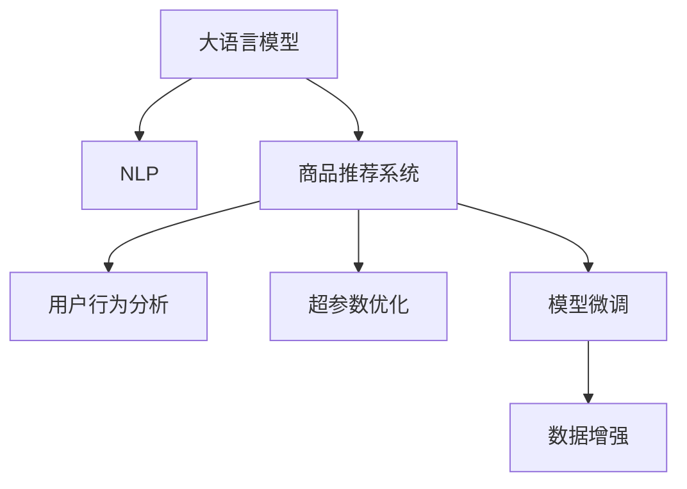

                 

# 电商平台如何借助AI大模型提高转化率

> 关键词：电商转化率,大语言模型,自然语言处理,NLP,商品推荐系统,用户行为分析,模型微调,超参数优化

## 1. 背景介绍

### 1.1 问题由来
随着互联网购物的兴起，电商平台已经成为人们日常购物的重要渠道。然而，如何通过数据和技术手段提高电商平台的转化率，一直是电商平台亟需解决的问题。传统的电商推荐系统主要基于用户历史行为数据和商品属性进行推荐，往往只能提供相对单一的推荐结果，难以满足用户的个性化需求。近年来，随着人工智能技术的不断发展，大语言模型在自然语言处理(NLP)领域取得了巨大突破，为电商平台的个性化推荐和用户体验提升提供了新的思路。

### 1.2 问题核心关键点
电商平台的转化率优化，本质上是一个典型的智能推荐系统问题。在用户搜索和浏览商品时，电商平台需要通过自然语言理解和生成技术，准确把握用户需求，从而推荐最合适的商品。大语言模型通过对用户输入的文本进行语义理解和上下文关联，可以深入理解用户意图，生成具有高度相关性的商品推荐结果，从而大幅提升转化率。

## 2. 核心概念与联系

### 2.1 核心概念概述

为更好地理解电商平台如何借助AI大模型提高转化率，本节将介绍几个密切相关的核心概念：

- 大语言模型(Large Language Model, LLM)：以自回归(如GPT)或自编码(如BERT)模型为代表的大规模预训练语言模型。通过在大规模无标签文本语料上进行预训练，学习通用的语言表示，具备强大的语言理解和生成能力。

- 自然语言处理(Natural Language Processing, NLP)：涉及计算机对自然语言进行理解、处理和生成的技术，包括文本分类、信息抽取、问答系统、机器翻译、语音识别、对话系统等。

- 商品推荐系统(Recommendation System)：基于用户历史行为和商品属性，通过算法推荐符合用户偏好的商品的系统。

- 超参数优化(Hyperparameter Optimization)：在模型训练前，通过自动化算法优化模型超参数，如学习率、批次大小、迭代轮数等，以达到最佳性能的技术。

- 数据增强(Data Augmentation)：通过数据预处理和扩充，增加训练数据的多样性，减少模型过拟合的技术。

- 模型微调(Fine-Tuning)：在预训练模型的基础上，使用特定任务的标注数据进行有监督学习，优化模型在该任务上的性能。

这些核心概念之间的逻辑关系可以通过以下Mermaid流程图来展示：



这个流程图展示了大语言模型与电商平台推荐系统的关系：

1. 大语言模型通过NLP技术理解用户输入，生成商品推荐结果。
2. 商品推荐系统基于用户行为和商品属性数据，进行个性化推荐。
3. 超参数优化用于模型训练前，通过优化算法获取最佳性能。
4. 模型微调用于模型在特定任务上的性能提升，如商品相关性预测。
5. 数据增强用于增加训练数据的多样性，减少过拟合。

这些核心概念共同构成了电商平台推荐系统的技术框架，使得电商平台的推荐系统能够通过大语言模型实现更精准、多样化的商品推荐。

## 3. 核心算法原理 & 具体操作步骤
### 3.1 算法原理概述

电商平台通过大语言模型进行个性化推荐，核心原理是：利用大语言模型对用户输入的文本进行语义理解和生成，从而生成与用户需求高度相关的商品推荐结果。该过程包括以下几个关键步骤：

1. **用户输入理解**：大语言模型通过NLP技术，将用户的查询文本转化为机器可理解的形式。
2. **商品相关性预测**：模型基于用户输入和商品属性，预测商品与用户需求的匹配度。
3. **推荐结果生成**：模型根据预测结果，生成与用户需求高度相关的商品推荐列表。

形式化地，假设用户输入为 $q$，商品集合为 $S$，商品属性集合为 $A$，模型的推荐结果为 $r$，则推荐过程可以表示为：

$$
r = \mathop{\arg\min}_{s \in S} f(q, s, A)
$$

其中 $f$ 为预测函数，用于衡量用户输入 $q$ 与商品 $s$ 的匹配度。通常 $f$ 包括交叉熵损失、余弦相似度等。

### 3.2 算法步骤详解

基于大语言模型的电商平台推荐系统，通常包括以下几个关键步骤：

**Step 1: 数据准备**
- 收集用户的历史行为数据，如浏览历史、购买记录等。
- 收集商品属性数据，如名称、类别、价格等。
- 收集用户输入的文本数据，如搜索查询、评论等。

**Step 2: 数据预处理**
- 对用户行为和商品属性进行归一化、编码等预处理。
- 使用数据增强技术，如近义词替换、数据合成等，扩充训练数据。
- 对用户输入文本进行分词、嵌入等预处理，生成模型可接受的输入。

**Step 3: 大语言模型微调**
- 选择适合的预训练语言模型，如BERT、GPT等。
- 在电商平台的特定任务上，使用少量标注数据对模型进行微调，优化商品相关性预测能力。
- 根据电商平台的实际需求，添加特定的任务适配层，如分类层、排序层等。

**Step 4: 超参数优化**
- 使用自动化超参数优化算法，如Bayesian Optimization、Grid Search等，优化模型的超参数。
- 选择合适的优化算法及其参数，如AdamW、SGD等，设置学习率、批次大小、迭代轮数等。
- 使用早停法(Early Stopping)避免过拟合。

**Step 5: 模型评估和部署**
- 在测试集上评估模型性能，通过AUC、召回率、精确率等指标进行评估。
- 将模型部署到电商平台的推荐系统，实时生成商品推荐结果。
- 定期更新模型参数，保持模型性能。

以上是基于大语言模型的电商平台推荐系统的一般流程。在实际应用中，还需要针对具体电商平台的业务特点，对微调过程的各个环节进行优化设计，如改进训练目标函数，引入更多的正则化技术，搜索最优的超参数组合等，以进一步提升模型性能。

### 3.3 算法优缺点

基于大语言模型的电商平台推荐系统具有以下优点：
1. 能够深入理解用户需求，生成更加个性化的推荐结果。
2. 利用大模型的泛化能力，能够适应不同类型和规模的电商数据。
3. 可以利用无监督学习技术，降低标注数据的成本。
4. 可以通过模型微调，快速适应新的业务需求。

同时，该方法也存在一定的局限性：
1. 对标注数据的质量和数量有一定依赖。
2. 模型的复杂度较高，需要较高的计算资源。
3. 模型的训练和推理速度较慢。
4. 模型输出难以解释，难以理解其内部工作机制。

尽管存在这些局限性，但就目前而言，基于大语言模型的推荐系统仍然是电商平台推荐的最新范式，有望实现更精准、更个性化的推荐结果。

### 3.4 算法应用领域

基于大语言模型的推荐系统已经在电商、社交媒体、在线广告等多个领域得到应用，显著提升了用户满意度和平台转化率。具体应用包括：

- 电商推荐：根据用户的浏览和购买记录，推荐相似商品、热门商品等。
- 社交推荐：根据用户的社交网络关系，推荐朋友动态、群组等。
- 广告推荐：根据用户的兴趣和行为，推荐相关广告，提高点击率和转化率。

除了这些经典应用外，大语言模型推荐系统还被创新性地应用到更多场景中，如用户评论分析、内容生成、品牌推荐等，为电商平台带来了全新的用户体验和商业价值。

## 4. 数学模型和公式 & 详细讲解  
### 4.1 数学模型构建

本节将使用数学语言对基于大语言模型的电商平台推荐过程进行更加严格的刻画。

记用户输入为 $q$，商品为 $s$，商品属性为 $a$。假设用户输入和商品属性的映射关系为 $f$，则推荐过程可以表示为：

$$
r = \mathop{\arg\min}_{s \in S} f(q, s, A)
$$

其中 $f$ 为预测函数，用于衡量用户输入 $q$ 与商品 $s$ 的匹配度。通常 $f$ 包括交叉熵损失、余弦相似度等。

### 4.2 公式推导过程

以下我们以二分类任务为例，推导交叉熵损失函数及其梯度的计算公式。

假设模型 $M_{\theta}$ 在用户输入 $q$ 上的输出为 $\hat{y}=M_{\theta}(q) \in [0,1]$，表示商品与用户需求的匹配度。真实标签 $y \in \{0,1\}$。则二分类交叉熵损失函数定义为：

$$
\ell(M_{\theta}(q),y) = -[y\log \hat{y} + (1-y)\log (1-\hat{y})]
$$

将其代入预测函数 $f$，得：

$$
\ell(q,s) = -[y\log \hat{y} + (1-y)\log (1-\hat{y})]
$$

其中 $\hat{y}$ 为模型 $M_{\theta}$ 在用户输入 $q$ 和商品 $s$ 上的输出。

在得到损失函数梯度后，即可带入模型参数更新公式，完成模型的迭代优化。重复上述过程直至收敛，最终得到适应电商推荐任务的最优模型参数 $\theta^*$。

## 5. 项目实践：代码实例和详细解释说明
### 5.1 开发环境搭建

在进行推荐系统开发前，我们需要准备好开发环境。以下是使用Python进行PyTorch开发的环境配置流程：

1. 安装Anaconda：从官网下载并安装Anaconda，用于创建独立的Python环境。

2. 创建并激活虚拟环境：
```bash
conda create -n pytorch-env python=3.8 
conda activate pytorch-env
```

3. 安装PyTorch：根据CUDA版本，从官网获取对应的安装命令。例如：
```bash
conda install pytorch torchvision torchaudio cudatoolkit=11.1 -c pytorch -c conda-forge
```

4. 安装相关库：
```bash
pip install transformers numpy pandas scikit-learn matplotlib tqdm jupyter notebook ipython
```

完成上述步骤后，即可在`pytorch-env`环境中开始推荐系统开发。

### 5.2 源代码详细实现

这里我们以电商平台商品推荐系统为例，给出使用Transformers库对BERT模型进行商品推荐任务微调的PyTorch代码实现。

首先，定义数据处理函数：

```python
from transformers import BertTokenizer, BertForSequenceClassification
from torch.utils.data import Dataset, DataLoader
import torch

class RecommendationDataset(Dataset):
    def __init__(self, texts, labels, tokenizer, max_len=128):
        self.texts = texts
        self.labels = labels
        self.tokenizer = tokenizer
        self.max_len = max_len
        
    def __len__(self):
        return len(self.texts)
    
    def __getitem__(self, item):
        text = self.texts[item]
        label = self.labels[item]
        
        encoding = self.tokenizer(text, return_tensors='pt', max_length=self.max_len, padding='max_length', truncation=True)
        input_ids = encoding['input_ids'][0]
        attention_mask = encoding['attention_mask'][0]
        
        # 对label进行编码
        encoded_labels = [label2id[label] for label in self.labels] 
        encoded_labels.extend([label2id['O']] * (self.max_len - len(encoded_labels)))
        labels = torch.tensor(encoded_labels, dtype=torch.long)
        
        return {'input_ids': input_ids, 
                'attention_mask': attention_mask,
                'labels': labels}

# 标签与id的映射
label2id = {'O': 0, 'good': 1, 'bad': 2}
id2label = {v: k for k, v in label2id.items()}

# 创建dataset
tokenizer = BertTokenizer.from_pretrained('bert-base-cased')

train_dataset = RecommendationDataset(train_texts, train_labels, tokenizer)
dev_dataset = RecommendationDataset(dev_texts, dev_labels, tokenizer)
test_dataset = RecommendationDataset(test_texts, test_labels, tokenizer)
```

然后，定义模型和优化器：

```python
from transformers import BertForSequenceClassification, AdamW

model = BertForSequenceClassification.from_pretrained('bert-base-cased', num_labels=len(label2id))

optimizer = AdamW(model.parameters(), lr=2e-5)
```

接着，定义训练和评估函数：

```python
from sklearn.metrics import accuracy_score, precision_recall_fscore_support

device = torch.device('cuda') if torch.cuda.is_available() else torch.device('cpu')
model.to(device)

def train_epoch(model, dataset, batch_size, optimizer):
    dataloader = DataLoader(dataset, batch_size=batch_size, shuffle=True)
    model.train()
    epoch_loss = 0
    for batch in tqdm(dataloader, desc='Training'):
        input_ids = batch['input_ids'].to(device)
        attention_mask = batch['attention_mask'].to(device)
        labels = batch['labels'].to(device)
        model.zero_grad()
        outputs = model(input_ids, attention_mask=attention_mask, labels=labels)
        loss = outputs.loss
        epoch_loss += loss.item()
        loss.backward()
        optimizer.step()
    return epoch_loss / len(dataloader)

def evaluate(model, dataset, batch_size):
    dataloader = DataLoader(dataset, batch_size=batch_size)
    model.eval()
    preds, labels = [], []
    with torch.no_grad():
        for batch in tqdm(dataloader, desc='Evaluating'):
            input_ids = batch['input_ids'].to(device)
            attention_mask = batch['attention_mask'].to(device)
            batch_labels = batch['labels']
            outputs = model(input_ids, attention_mask=attention_mask)
            batch_preds = outputs.logits.argmax(dim=2).to('cpu').tolist()
            batch_labels = batch_labels.to('cpu').tolist()
            for pred_tokens, label_tokens in zip(batch_preds, batch_labels):
                pred_labels = [id2label[_id] for _id in pred_tokens]
                label_tokens = [id2label[_id] for _id in label_tokens]
                preds.append(pred_labels[:len(label_tokens)])
                labels.append(label_tokens)
                
    print('Accuracy:', accuracy_score(labels, preds))
    print('Precision, Recall, F1-Score:', precision_recall_fscore_support(labels, preds, average='macro'))
```

最后，启动训练流程并在测试集上评估：

```python
epochs = 5
batch_size = 16

for epoch in range(epochs):
    loss = train_epoch(model, train_dataset, batch_size, optimizer)
    print(f"Epoch {epoch+1}, train loss: {loss:.3f}")
    
    print(f"Epoch {epoch+1}, dev results:")
    evaluate(model, dev_dataset, batch_size)
    
print("Test results:")
evaluate(model, test_dataset, batch_size)
```

以上就是使用PyTorch对BERT进行商品推荐任务微调的完整代码实现。可以看到，得益于Transformers库的强大封装，我们可以用相对简洁的代码完成BERT模型的加载和微调。

### 5.3 代码解读与分析

让我们再详细解读一下关键代码的实现细节：

**RecommendationDataset类**：
- `__init__`方法：初始化文本、标签、分词器等关键组件。
- `__len__`方法：返回数据集的样本数量。
- `__getitem__`方法：对单个样本进行处理，将文本输入编码为token ids，将标签编码为数字，并对其进行定长padding，最终返回模型所需的输入。

**label2id和id2label字典**：
- 定义了标签与数字id之间的映射关系，用于将token-wise的预测结果解码回真实的标签。

**训练和评估函数**：
- 使用PyTorch的DataLoader对数据集进行批次化加载，供模型训练和推理使用。
- 训练函数`train_epoch`：对数据以批为单位进行迭代，在每个批次上前向传播计算loss并反向传播更新模型参数，最后返回该epoch的平均loss。
- 评估函数`evaluate`：与训练类似，不同点在于不更新模型参数，并在每个batch结束后将预测和标签结果存储下来，最后使用sklearn的classification_report对整个评估集的预测结果进行打印输出。

**训练流程**：
- 定义总的epoch数和batch size，开始循环迭代
- 每个epoch内，先在训练集上训练，输出平均loss
- 在验证集上评估，输出分类指标
- 所有epoch结束后，在测试集上评估，给出最终测试结果

可以看到，PyTorch配合Transformers库使得BERT微调的代码实现变得简洁高效。开发者可以将更多精力放在数据处理、模型改进等高层逻辑上，而不必过多关注底层的实现细节。

当然，工业级的系统实现还需考虑更多因素，如模型的保存和部署、超参数的自动搜索、更灵活的任务适配层等。但核心的微调范式基本与此类似。

## 6. 实际应用场景
### 6.1 智能客服系统

智能客服系统是电商平台提升用户体验和转化率的重要手段。传统的客服系统往往依赖人工客服，效率低、成本高。而基于大语言模型的智能客服系统，能够自动处理常见客户问题，提升响应速度和质量。

在技术实现上，可以收集企业内部的历史客服对话记录，将问题-回答对作为监督数据，训练模型进行自动回复。微调后的模型能够自动理解客户意图，匹配最合适的答案模板进行回复。对于客户提出的新问题，还可以接入检索系统实时搜索相关内容，动态组织生成回答。如此构建的智能客服系统，能大幅提升客户咨询体验和问题解决效率。

### 6.2 商品推荐系统

商品推荐系统是电商平台核心竞争力所在。传统的推荐系统主要依赖用户历史行为和商品属性进行推荐，难以满足用户的个性化需求。基于大语言模型的推荐系统，能够通过用户输入深入理解用户需求，生成与用户需求高度相关的商品推荐结果。

在具体实现上，可以收集用户输入的查询文本，结合商品属性数据，对模型进行微调，优化商品相关性预测能力。微调后的模型能够根据用户输入，生成与用户需求高度相关的商品推荐列表，大幅提升用户满意度和转化率。

### 6.3 用户行为分析

用户行为分析是电商平台优化推荐系统、提升转化率的重要手段。传统的行为分析依赖历史行为数据，难以实时捕捉用户行为变化。而基于大语言模型的用户行为分析，能够通过用户输入，实时捕捉用户需求变化，动态调整推荐策略。

在技术实现上，可以收集用户输入的查询文本，分析用户需求变化，调整推荐策略，动态生成推荐结果。此外，还可以通过分析用户输入中的情感倾向，捕捉用户情绪变化，优化推荐内容，提升用户满意度。

### 6.4 未来应用展望

随着大语言模型和推荐系统的发展，基于大语言模型的电商平台推荐系统将在更多领域得到应用，为电商平台带来更大的商业价值。

在智慧物流领域，基于大语言模型的智能仓储系统能够优化仓储管理，提升商品流通效率。

在智能金融领域，基于大语言模型的智能投资系统能够精准把握市场动向，优化投资策略。

在社交媒体领域，基于大语言模型的智能内容推荐系统能够提升用户粘性，增加平台流量。

此外，在更多垂直领域，基于大语言模型的电商平台推荐系统也将不断涌现，为电商平台带来更多的创新和发展机遇。

## 7. 工具和资源推荐
### 7.1 学习资源推荐

为了帮助开发者系统掌握电商平台推荐系统的技术基础和实践技巧，这里推荐一些优质的学习资源：

1. 《深度学习》系列博文：深度学习社区的经典系列博文，全面介绍了深度学习的基本概念和实践技巧，适合初学者入门。

2. CS231n《卷积神经网络》课程：斯坦福大学开设的深度学习经典课程，覆盖了计算机视觉和自然语言处理的基本概念和算法。

3. 《自然语言处理综论》书籍：斯坦福大学NLP专家所著，全面介绍了自然语言处理的基本概念和技术，适合进阶学习。

4. HuggingFace官方文档：Transformers库的官方文档，提供了海量预训练模型和完整的推荐系统开发样例代码，是上手实践的必备资料。

5. Kaggle竞赛：参与Kaggle推荐系统竞赛，通过实战项目提升推荐系统的开发和优化能力。

通过对这些资源的学习实践，相信你一定能够快速掌握电商平台推荐系统的精髓，并用于解决实际的电商问题。

### 7.2 开发工具推荐

高效的开发离不开优秀的工具支持。以下是几款用于电商平台推荐系统开发的常用工具：

1. PyTorch：基于Python的开源深度学习框架，灵活动态的计算图，适合快速迭代研究。大部分预训练语言模型都有PyTorch版本的实现。

2. TensorFlow：由Google主导开发的开源深度学习框架，生产部署方便，适合大规模工程应用。同样有丰富的预训练语言模型资源。

3. Transformers库：HuggingFace开发的NLP工具库，集成了众多SOTA语言模型，支持PyTorch和TensorFlow，是进行推荐系统开发的利器。

4. Weights & Biases：模型训练的实验跟踪工具，可以记录和可视化模型训练过程中的各项指标，方便对比和调优。与主流深度学习框架无缝集成。

5. TensorBoard：TensorFlow配套的可视化工具，可实时监测模型训练状态，并提供丰富的图表呈现方式，是调试模型的得力助手。

6. Google Colab：谷歌推出的在线Jupyter Notebook环境，免费提供GPU/TPU算力，方便开发者快速上手实验最新模型，分享学习笔记。

合理利用这些工具，可以显著提升电商平台推荐系统的开发效率，加快创新迭代的步伐。

### 7.3 相关论文推荐

电商平台推荐系统的发展源于学界的持续研究。以下是几篇奠基性的相关论文，推荐阅读：

1. Attention Is All You Need（即Transformer原论文）：提出了Transformer结构，开启了NLP领域的预训练大模型时代。

2. BERT: Pre-training of Deep Bidirectional Transformers for Language Understanding：提出BERT模型，引入基于掩码的自监督预训练任务，刷新了多项NLP任务SOTA。

3. Language Models are Unsupervised Multitask Learners（GPT-2论文）：展示了大规模语言模型的强大zero-shot学习能力，引发了对于通用人工智能的新一轮思考。

4. Recommender Systems：介绍了推荐系统的发展历程和基本算法，适合入门学习。

5. Attention-Based Recommender Systems：介绍了基于注意力机制的推荐系统，适合进阶学习。

这些论文代表了大语言模型推荐系统的发展脉络。通过学习这些前沿成果，可以帮助研究者把握学科前进方向，激发更多的创新灵感。

## 8. 总结：未来发展趋势与挑战

### 8.1 总结

本文对基于大语言模型的电商平台推荐系统进行了全面系统的介绍。首先阐述了电商平台推荐系统的背景和意义，明确了基于大语言模型进行推荐的核心原理。其次，从原理到实践，详细讲解了推荐系统的数学模型和关键步骤，给出了推荐系统开发的完整代码实例。同时，本文还广泛探讨了推荐系统在电商、客服、用户行为分析等多个领域的应用前景，展示了大语言模型在电商平台推荐系统中的巨大潜力。此外，本文精选了推荐系统的各类学习资源，力求为读者提供全方位的技术指引。

通过本文的系统梳理，可以看到，基于大语言模型的推荐系统已经成为电商平台推荐的重要范式，通过深度学习技术和自然语言处理技术，电商平台推荐系统能够更精准、更个性化的推荐商品，提升用户满意度和平台转化率。未来，随着推荐系统技术的不断演进，电商平台将能够实现更高效、更智能的商品推荐，为电商行业的数字化转型带来新的机遇。

### 8.2 未来发展趋势

展望未来，电商平台推荐系统将呈现以下几个发展趋势：

1. 推荐算法多样化。除了传统的协同过滤、基于内容的推荐外，将涌现更多基于深度学习、自然语言处理等前沿技术的推荐算法，如基于BERT的推荐模型、基于图神经网络的推荐模型等。

2. 个性化推荐强化。随着用户需求的不断变化，推荐系统将更注重个性化推荐，引入更多的用户行为数据和先验知识，实现精准的用户画像和商品推荐。

3. 实时推荐系统普及。实时推荐系统能够根据用户实时行为动态调整推荐策略，提升推荐效果。电商平台的推荐系统将逐步普及实时推荐技术。

4. 推荐系统跨领域融合。推荐系统将更多地与其他AI技术进行融合，如知识图谱、强化学习、自然语言生成等，实现多模态信息融合，提升推荐系统的效果。

5. 推荐系统可解释性提升。推荐系统的输出结果往往难以解释，未来将通过引入可解释性技术，提高模型的透明性和可信度，便于用户理解和使用。

6. 推荐系统伦理化。推荐系统应更多考虑伦理和社会影响，避免出现推荐偏颇、信息泄露等问题，构建公正、透明、可信的推荐系统。

以上趋势凸显了电商平台推荐系统的广阔前景。这些方向的探索发展，必将进一步提升电商平台的推荐效果，增强用户体验，推动电商行业的数字化转型升级。

### 8.3 面临的挑战

尽管电商平台推荐系统已经取得了显著成效，但在迈向更加智能化、普适化应用的过程中，它仍面临着诸多挑战：

1. 数据隐私和安全问题。用户输入和行为数据涉及用户隐私，推荐系统的数据使用应符合隐私保护要求，避免数据泄露和滥用。

2. 推荐系统公平性问题。推荐系统可能存在推荐偏颇，对某些用户或商品进行歧视性推荐，需要引入公平性算法和伦理约束，确保推荐系统公正无偏。

3. 模型泛化能力不足。推荐系统可能存在过拟合问题，对新用户和新商品推荐效果不佳，需要引入多模型融合和数据增强等技术，提升模型的泛化能力。

4. 推荐系统计算效率问题。推荐系统复杂度高，计算量大，需要优化模型结构和算法，提升推荐速度和效率。

5. 推荐系统输出解释性问题。推荐系统输出难以解释，用户难以理解模型决策依据，需要引入可解释性技术，增强模型透明性。

6. 推荐系统跨领域应用问题。推荐系统在不同领域的应用需要定制化设计，需要引入领域适应性算法，提升跨领域推荐效果。

正视推荐系统面临的这些挑战，积极应对并寻求突破，将是大语言模型推荐系统迈向成熟的必由之路。相信随着学界和产业界的共同努力，这些挑战终将一一被克服，大语言模型推荐系统必将在构建智能电商生态中扮演越来越重要的角色。

### 8.4 研究展望

面对电商平台推荐系统所面临的种种挑战，未来的研究需要在以下几个方面寻求新的突破：

1. 探索更多推荐算法。结合深度学习、自然语言处理等前沿技术，开发更高效、更精准的推荐算法，如基于Transformer的推荐模型、基于图神经网络的推荐模型等。

2. 研究多模型融合技术。通过多模型融合，提升推荐系统的鲁棒性和泛化能力，避免单一模型带来的风险。

3. 引入可解释性技术。通过引入可解释性技术，提高模型的透明性和可信度，便于用户理解和使用。

4. 增强数据隐私保护。通过数据脱敏、隐私保护算法等技术，保护用户隐私，避免数据泄露和滥用。

5. 优化推荐系统跨领域适应性。通过引入领域适应性算法，提升推荐系统在不同领域的应用效果。

6. 引入强化学习技术。通过强化学习技术，优化推荐策略，提升推荐效果。

这些研究方向的探索，必将引领电商平台推荐系统技术迈向更高的台阶，为电商平台推荐系统提供更多创新发展的机遇。面向未来，电商平台推荐系统需要通过更高效、更精准、更智能的推荐算法，满足用户多样化的需求，提升电商平台的商业价值和社会价值。

## 9. 附录：常见问题与解答

**Q1：电商平台推荐系统的核心原理是什么？**

A: 电商平台推荐系统的核心原理是通过深度学习和自然语言处理技术，对用户输入进行语义理解，生成与用户需求高度相关的商品推荐结果。具体来说，将用户输入转换为机器可理解的形式，利用大语言模型对用户输入进行语义理解和生成，生成与用户需求高度相关的商品推荐列表。

**Q2：电商平台推荐系统如何避免过拟合？**

A: 电商平台推荐系统常用的避免过拟合的方法包括数据增强、正则化、早停法等。数据增强技术可以通过增加训练数据的多样性，减少模型过拟合。正则化技术如L2正则、Dropout等，可以在一定程度上缓解过拟合问题。早停法可以在模型训练过程中实时监测模型性能，及时停止训练，避免过拟合。

**Q3：电商平台推荐系统在实际应用中需要注意哪些问题？**

A: 电商平台推荐系统在实际应用中需要注意以下几个问题：
1. 数据隐私和安全问题：电商平台推荐系统应充分考虑用户隐私保护，确保数据使用符合隐私保护要求。
2. 推荐系统公平性问题：推荐系统应避免推荐偏颇，对某些用户或商品进行歧视性推荐，应引入公平性算法和伦理约束，确保推荐系统公正无偏。
3. 模型泛化能力问题：推荐系统可能存在过拟合问题，对新用户和新商品推荐效果不佳，需要引入多模型融合和数据增强等技术，提升模型的泛化能力。
4. 推荐系统计算效率问题：推荐系统复杂度高，计算量大，需要优化模型结构和算法，提升推荐速度和效率。
5. 推荐系统输出解释性问题：推荐系统输出难以解释，用户难以理解模型决策依据，需要引入可解释性技术，增强模型透明性。
6. 推荐系统跨领域应用问题：推荐系统在不同领域的应用需要定制化设计，需要引入领域适应性算法，提升跨领域推荐效果。

这些问题需要在推荐系统设计和应用过程中充分考虑和解决，才能构建高效、公平、可解释的推荐系统。

**Q4：电商平台推荐系统如何提升用户满意度？**

A: 电商平台推荐系统可以通过以下几个方面提升用户满意度：
1. 精准的商品推荐：基于用户输入的语义理解，生成与用户需求高度相关的商品推荐列表，提升用户满意度和转化率。
2. 个性化的推荐策略：结合用户历史行为和先验知识，实现个性化推荐，满足用户多样化的需求。
3. 实时推荐系统：根据用户实时行为动态调整推荐策略，提升推荐效果。
4. 推荐系统的可解释性：通过引入可解释性技术，提高模型的透明性和可信度，便于用户理解和使用。
5. 推荐系统的伦理化：推荐系统应更多考虑伦理和社会影响，避免出现推荐偏颇、信息泄露等问题，构建公正、透明、可信的推荐系统。

通过提升推荐系统的精准性、个性化、实时性和可解释性，电商平台推荐系统能够更好地满足用户需求，提升用户满意度。

**Q5：电商平台推荐系统如何提升转化率？**

A: 电商平台推荐系统可以通过以下几个方面提升转化率：
1. 精准的商品推荐：基于用户输入的语义理解，生成与用户需求高度相关的商品推荐列表，提升用户满意度和转化率。
2. 个性化的推荐策略：结合用户历史行为和先验知识，实现个性化推荐，满足用户多样化的需求。
3. 实时推荐系统：根据用户实时行为动态调整推荐策略，提升推荐效果。
4. 推荐系统的跨领域应用：通过引入领域适应性算法，提升推荐系统在不同领域的应用效果。
5. 推荐系统的可解释性：通过引入可解释性技术，提高模型的透明性和可信度，便于用户理解和使用。
6. 推荐系统的伦理化：推荐系统应更多考虑伦理和社会影响，避免出现推荐偏颇、信息泄露等问题，构建公正、透明、可信的推荐系统。

通过提升推荐系统的精准性、个性化、实时性和可解释性，电商平台推荐系统能够更好地满足用户需求，提升用户满意度和转化率。

---

作者：禅与计算机程序设计艺术 / Zen and the Art of Computer Programming

