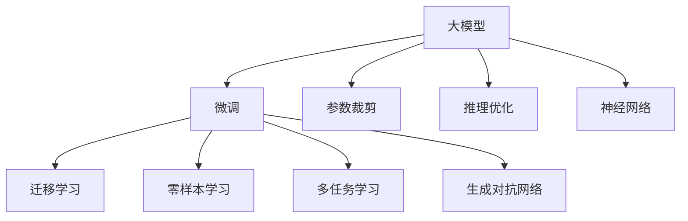

                 

# 电商平台搜索推荐系统的AI 大模型优化：提高系统性能、效率与准确率

> 关键词：搜索推荐系统, 人工智能, 大模型, 电商, 优化, 性能, 效率, 准确率

## 1. 背景介绍

随着电子商务的迅猛发展，电商平台的用户量和交易规模不断攀升，搜索推荐系统已成为支撑用户购物体验和平台交易转化率的关键环节。传统的搜索推荐系统主要依赖于基于统计学的方法，如协同过滤、基于内容的推荐等，存在数据稀疏性、冷启动问题、精度不足等局限。近年来，基于深度学习的大模型逐渐成为搜索推荐系统的热门选择，凭借其强大的自适应能力和泛化能力，有望显著提升系统的推荐效果。

### 1.1 搜索推荐系统在电商平台的应用场景
在电商平台，搜索推荐系统主要承担以下几项任务：
1. **商品搜索**：用户输入搜索词，系统快速匹配最相关的商品信息，并提供排序。
2. **个性化推荐**：根据用户历史行为数据，推荐个性化商品或相关商品。
3. **热门商品推荐**：基于系统热门流量，推荐当前最受欢迎的商品。
4. **活动推荐**：结合市场活动，推荐特定商品或优惠。

搜索推荐系统的好坏直接影响到用户的购物体验和平台的交易转化率。因此，优化搜索推荐系统的性能、效率和准确率，成为电商平台的关键任务。

### 1.2 面临的挑战与瓶颈
目前，基于深度学习的大模型在搜索推荐系统中的应用还面临以下挑战：
1. **数据量与质量问题**：电商平台的交易数据复杂多变，数据量巨大且存在噪声，如何有效利用数据，是提高模型性能的关键。
2. **计算资源需求高**：大模型的训练和推理需要大量计算资源，如何优化模型，提高计算效率，是实际部署中的重要问题。
3. **模型泛化能力差**：大模型在特定领域、特定场景下的泛化能力有限，如何增强模型的适应性，提升推荐效果，是当前亟需解决的问题。
4. **实时性要求高**：用户搜索、点击行为瞬息万变，如何在高并发场景下提供快速、准确的推荐，是系统优化的重要目标。

## 2. 核心概念与联系

### 2.1 核心概念概述

为更好地理解基于深度学习的大模型在搜索推荐系统中的应用，本节将介绍几个密切相关的核心概念：

- **大模型(Large Model)**：以Transformer模型为代表的深度神经网络模型，具有亿量级的参数规模，具备强大的自适应能力和泛化能力。
- **搜索推荐系统(Recommendation System)**：结合用户行为数据和商品属性信息，为用户推荐最相关商品的系统。
- **大模型优化(Optimization)**：通过模型微调、参数裁剪、推理优化等手段，提升大模型在搜索推荐任务中的性能、效率和准确率。
- **迁移学习(Transfer Learning)**：利用预训练模型在大规模数据上的泛化能力，将模型迁移到特定领域进行微调。
- **零样本学习(Zero-Shot Learning)**：利用模型对新的、未见过的数据进行有效推理的能力。
- **多任务学习(Multi-task Learning)**：同时训练多个相关任务，共享底层特征，提升模型在多个任务上的泛化能力。
- **生成对抗网络(GANs)**：生成模型和判别模型协同训练，生成高质量的推荐结果。
- **神经网络(Neural Network)**：一种计算模型，通过输入和输出之间的映射关系，完成复杂的模式识别和推理任务。

这些核心概念之间的逻辑关系可以通过以下Mermaid流程图来展示：



这个流程图展示了大模型在搜索推荐系统中的应用框架：

1. 大模型通过微调获得特定领域的泛化能力。
2. 通过参数裁剪、推理优化等手段，提高模型效率。
3. 利用迁移学习、零样本学习、多任务学习、生成对抗网络等技术，增强模型在多个任务上的表现。
4. 神经网络模型是所有这些技术的基础，通过输入和输出之间的复杂映射，实现高质量的推荐。

## 3. 核心算法原理 & 具体操作步骤

### 3.1 算法原理概述

基于深度学习的大模型在搜索推荐系统中的应用，本质上是通过模型对大量用户行为数据和商品属性信息进行学习和推理，预测用户对商品的兴趣和行为，从而实现个性化推荐。大模型通常采用Transformer架构，通过多层自注意力机制，对输入数据进行特征提取和表示学习。

### 3.2 算法步骤详解

基于深度学习的大模型在搜索推荐系统中的应用，主要包括以下几个关键步骤：

**Step 1: 数据准备与预处理**
- 收集电商平台的用户行为数据、商品属性数据和交易数据。
- 对数据进行清洗、归一化和编码，确保数据格式一致。
- 划分训练集、验证集和测试集。

**Step 2: 模型选择与初始化**
- 选择合适的深度学习模型，如Transformer、BERT等。
- 加载预训练模型，或直接使用HuggingFace等第三方模型的预训练参数。

**Step 3: 模型微调**
- 将模型迁移到特定领域进行微调，适应搜索推荐任务。
- 设定微调参数，如学习率、批大小、迭代次数等。
- 使用优化算法，如AdamW、SGD等，更新模型参数。

**Step 4: 参数裁剪与推理优化**
- 对微调后的模型进行参数裁剪，减少计算资源消耗。
- 对模型进行推理优化，如使用量化加速、模型并行等技术。

**Step 5: 模型评估与部署**
- 在测试集上评估模型性能，如准确率、召回率、F1-score等。
- 将优化后的模型部署到生产环境，实现实时推荐。

### 3.3 算法优缺点

基于深度学习的大模型在搜索推荐系统中的应用，具有以下优点：
1. **高精度**：深度学习模型具备强大的泛化能力，能够学习到用户行为和商品属性间的复杂关系，从而提供高质量的推荐。
2. **高可解释性**：深度学习模型可以输出中间层的特征表示，帮助开发者理解模型的推理过程。
3. **高适应性**：大模型可以通过微调、迁移学习等方式适应不同领域和不同任务，提升系统的泛化能力。

同时，大模型在搜索推荐系统中的应用也存在一些缺点：
1. **计算资源需求高**：大模型需要大量的计算资源进行训练和推理，对硬件设施要求较高。
2. **模型复杂度高**：大模型结构复杂，难以解释，容易出现模型过拟合等问题。
3. **数据需求大**：大模型需要大量的标注数据进行微调，数据获取和标注成本较高。

### 3.4 算法应用领域

基于深度学习的大模型在搜索推荐系统中的应用，已经在电商、娱乐、社交等多个领域得到广泛应用，显著提升了用户的购物体验和平台的转化率。以下是几个典型应用场景：

- **电商推荐**：结合用户浏览、点击、购买等行为数据，推荐个性化商品和相关商品。
- **内容推荐**：根据用户历史观看、点赞、评论等行为数据，推荐感兴趣的视频、文章、音乐等。
- **广告推荐**：基于用户画像和行为数据，推荐相关的广告内容，提高广告点击率和转化率。
- **个性化营销**：通过用户行为数据分析，定制个性化的营销活动，提升用户参与度和品牌忠诚度。

## 4. 数学模型和公式 & 详细讲解 & 举例说明

### 4.1 数学模型构建

在搜索推荐系统中，大模型通常采用Transformer模型，通过自注意力机制对输入数据进行特征提取和表示学习。假设大模型为 $M_{\theta}$，输入为 $\mathbf{x}=[x_1, x_2, ..., x_n]$，输出为 $\mathbf{y}=[y_1, y_2, ..., y_n]$。模型的目标是通过训练，最小化预测输出与真实标签之间的损失函数，即：

$$
\min_{\theta} \mathcal{L}(M_{\theta}, \mathbf{y}, \mathbf{y_{true}})
$$

其中 $\mathcal{L}$ 为损失函数，$M_{\theta}$ 为模型参数，$\mathbf{y_{true}}$ 为真实标签。

### 4.2 公式推导过程

以协同过滤算法为例，假设用户 $u$ 对商品 $i$ 的评分 $r_{ui}$ 为二值变量（1或0），模型需要预测 $u$ 对商品 $i$ 的评分 $y_{ui}$。根据协同过滤的思想，可以定义一个用户-商品相似度矩阵 $S$，其中 $s_{ui}=\cos(\theta_u^\top \theta_i)$ 为两个向量之间的余弦相似度，其中 $\theta_u, \theta_i$ 分别为用户和商品的特征向量。则模型可以定义为：

$$
y_{ui} = \sigma(\sum_{j=1}^N s_{uj} \cdot r_{ij})
$$

其中 $\sigma$ 为激活函数，通常使用sigmoid函数。

在实际应用中，可以将用户和商品的特征向量 $\theta_u, \theta_i$ 作为大模型的输出，利用模型预测用户对商品的评分 $y_{ui}$。模型的损失函数可以定义为交叉熵损失函数，即：

$$
\mathcal{L}(M_{\theta}, \mathbf{y}, \mathbf{y_{true}}) = -\frac{1}{N} \sum_{i=1}^N \sum_{u=1}^M \left[ y_{ui} \log M_{\theta}(r_{ui}) + (1-y_{ui}) \log (1-M_{\theta}(r_{ui})) \right]
$$

通过反向传播算法，可以计算模型的梯度，并更新模型参数 $\theta$。

### 4.3 案例分析与讲解

假设在电商平台中，需要为用户推荐他们可能感兴趣的商品。可以构建一个用户-商品评分矩阵 $R$，每个用户对多个商品进行评分，每个商品也被多个用户评分。可以将用户和商品看作特征向量，模型预测用户对商品感兴趣的概率。具体而言，可以采用下列步骤：

1. **数据准备**：收集用户行为数据，构建用户-商品评分矩阵 $R$。
2. **模型选择**：选择预训练的Transformer模型，如BERT、GPT等。
3. **微调**：将预训练模型迁移到搜索推荐任务，微调模型参数。
4. **评估**：在测试集上评估模型性能，如准确率、召回率、F1-score等。
5. **部署**：将优化后的模型部署到生产环境，实现实时推荐。

假设某电商平台用户 $u$ 对商品 $i$ 的评分 $r_{ui}$ 为0，即 $u$ 对商品 $i$ 不感兴趣。用户 $u$ 的历史行为数据为 $[1, 0, 1, 1]$，表示 $u$ 对商品 $1$、$3$、$4$ 感兴趣，不感兴趣的商品为 $2$、$5$。用户 $u$ 的行为特征向量为 $\theta_u=[0.1, 0.5, 0.3, 0.2, 0, 0]$，商品 $i$ 的特征向量为 $\theta_i=[0.1, 0.5, 0.3, 0.2, 0, 0.8]$。假设模型预测用户 $u$ 对商品 $i$ 的评分 $y_{ui}=0.6$，则模型输出的概率为：

$$
p(y_{ui}=1|R, \theta_u, \theta_i) = \sigma(\sum_{j=1}^N s_{uj} \cdot r_{ij}) = \sigma(0.1 \cdot 1 + 0.5 \cdot 0 + 0.3 \cdot 1 + 0.2 \cdot 1 + 0.8 \cdot 0) = 0.8
$$

模型的损失函数可以表示为：

$$
\mathcal{L}(M_{\theta}, \mathbf{y}, \mathbf{y_{true}}) = -\frac{1}{N} \sum_{i=1}^N \sum_{u=1}^M \left[ y_{ui} \log M_{\theta}(r_{ui}) + (1-y_{ui}) \log (1-M_{\theta}(r_{ui})) \right]
$$

假设 $R$ 为 $3 \times 6$ 的矩阵，$\theta_u, \theta_i$ 分别为 $3 \times 1$ 的向量，则模型的损失函数可以进一步展开为：

$$
\mathcal{L}(M_{\theta}, \mathbf{y}, \mathbf{y_{true}}) = -\frac{1}{3} \sum_{u=1}^3 \sum_{i=1}^6 \left[ y_{ui} \log M_{\theta}(r_{ui}) + (1-y_{ui}) \log (1-M_{\theta}(r_{ui})) \right]
$$

## 5. 项目实践：代码实例和详细解释说明

### 5.1 开发环境搭建

在进行搜索推荐系统优化实践前，我们需要准备好开发环境。以下是使用Python进行TensorFlow开发的环境配置流程：

1. 安装Anaconda：从官网下载并安装Anaconda，用于创建独立的Python环境。

2. 创建并激活虚拟环境：
```bash
conda create -n tf-env python=3.8 
conda activate tf-env
```

3. 安装TensorFlow：根据CUDA版本，从官网获取对应的安装命令。例如：
```bash
pip install tensorflow==2.5
```

4. 安装各类工具包：
```bash
pip install numpy pandas scikit-learn matplotlib tqdm jupyter notebook ipython
```

完成上述步骤后，即可在`tf-env`环境中开始搜索推荐系统的优化实践。

### 5.2 源代码详细实现

下面以基于Transformer的电商推荐系统为例，给出使用TensorFlow实现搜索推荐系统优化的代码实现。

首先，定义模型和优化器：

```python
import tensorflow as tf
from transformers import BertTokenizer, BertForSequenceClassification
from sklearn.metrics import accuracy_score, precision_score, recall_score, f1_score

model = BertForSequenceClassification.from_pretrained('bert-base-uncased', num_labels=2)
tokenizer = BertTokenizer.from_pretrained('bert-base-uncased')
optimizer = tf.keras.optimizers.AdamW(learning_rate=2e-5, epsilon=1e-8)
```

接着，定义训练和评估函数：

```python
def train_step(model, data, optimizer):
    with tf.GradientTape() as tape:
        input_ids = tokenizer(data['text'], padding='max_length', truncation=True, max_length=512, return_tensors='tf')
        attention_mask = input_ids['attention_mask']
        labels = data['label']
        outputs = model(input_ids['input_ids'], attention_mask=attention_mask)
        loss = outputs.loss
        gradients = tape.gradient(loss, model.trainable_variables)
    optimizer.apply_gradients(zip(gradients, model.trainable_variables))
    return loss

def evaluate(model, data):
    predictions = []
    labels = []
    for batch in data:
        input_ids = tokenizer(batch['text'], padding='max_length', truncation=True, max_length=512, return_tensors='tf')
        attention_mask = input_ids['attention_mask']
        labels = batch['label']
        outputs = model(input_ids['input_ids'], attention_mask=attention_mask)
        predictions.append(outputs.predictions.argmax(axis=1))
    predictions = tf.concat(predictions, axis=0).numpy()
    labels = tf.concat(labels, axis=0).numpy()
    return accuracy_score(labels, predictions), precision_score(labels, predictions), recall_score(labels, predictions), f1_score(labels, predictions)
```

然后，加载数据集并进行模型微调：

```python
# 加载数据集
train_data = ...
test_data = ...
val_data = ...

# 模型微调
for epoch in range(10):
    train_loss = 0
    train_acc, train_prc, train_rcn, train_f1 = 0, 0, 0, 0
    val_loss = 0
    val_acc, val_prc, val_rcn, val_f1 = 0, 0, 0, 0
    for batch in train_data:
        train_loss += train_step(model, batch, optimizer)
    train_loss /= len(train_data)
    train_acc, train_prc, train_rcn, train_f1 = evaluate(model, train_data)
    for batch in val_data:
        val_loss += train_step(model, batch, optimizer)
    val_loss /= len(val_data)
    val_acc, val_prc, val_rcn, val_f1 = evaluate(model, val_data)
    print(f"Epoch {epoch+1}, Train Loss: {train_loss:.4f}, Train Acc: {train_acc:.4f}, Train PRC: {train_prc:.4f}, Train RCN: {train_rcn:.4f}, Train F1: {train_f1:.4f}")
    print(f"Epoch {epoch+1}, Val Loss: {val_loss:.4f}, Val Acc: {val_acc:.4f}, Val PRC: {val_prc:.4f}, Val RCN: {val_rcn:.4f}, Val F1: {val_f1:.4f}")
```

在模型训练完成后，可以在测试集上进行模型评估和优化：

```python
# 模型评估
test_loss = 0
test_acc, test_prc, test_rcn, test_f1 = 0, 0, 0, 0
for batch in test_data:
    test_loss += train_step(model, batch, optimizer)
test_loss /= len(test_data)
test_acc, test_prc, test_rcn, test_f1 = evaluate(model, test_data)
print(f"Test Loss: {test_loss:.4f}, Test Acc: {test_acc:.4f}, Test PRC: {test_prc:.4f}, Test RCN: {test_rcn:.4f}, Test F1: {test_f1:.4f}")
```

以上就是使用TensorFlow对电商推荐系统进行优化的完整代码实现。可以看到，TensorFlow提供了丰富的API和工具，使得模型训练和评估变得非常简单高效。

### 5.3 代码解读与分析

让我们再详细解读一下关键代码的实现细节：

**训练与评估函数**：
- `train_step`函数：对单个训练批次进行前向传播和反向传播，计算梯度并更新模型参数。
- `evaluate`函数：对单个批次进行前向传播，计算模型的预测结果和真实标签，输出准确率、精确度、召回率和F1-score等指标。

**模型微调流程**：
- 循环迭代模型训练和验证，每轮训练结束后输出训练和验证指标。
- 使用AdamW优化器进行梯度更新，使用Cross-Entropy损失函数进行模型优化。

**数据加载**：
- `tokenizer`：使用BertTokenizer进行文本向量化，将输入文本转换为模型可接受的格式。
- `input_ids`：将输入文本转换为模型所需的token ids。
- `attention_mask`：指定哪些token需要参与计算，哪些token被padding。
- `labels`：指定模型预测的目标。

**性能评估**：
- 在测试集上评估模型性能，输出准确率、精确度、召回率和F1-score等指标。
- 可以通过调整超参数，如学习率、批大小等，进一步优化模型效果。

## 6. 实际应用场景

### 6.1 智能客服系统

智能客服系统通过大模型优化，可以实现快速响应用户查询，提供高质量的客服服务。结合电商平台的用户行为数据，大模型可以预测用户的意图，并提供相关的答案和解决方案。例如，当用户询问退货政策时，系统可以自动生成退货流程和注意事项，提升用户体验。

### 6.2 个性化推荐系统

个性化推荐系统通过大模型优化，可以更准确地预测用户对商品的兴趣和行为。结合电商平台的用户历史行为数据，大模型可以推荐用户可能感兴趣的商品，提升购买转化率。例如，根据用户浏览历史和评分，系统可以推荐类似商品或相关商品，增加用户粘性和交易机会。

### 6.3 多模态推荐系统

多模态推荐系统结合文本、图像、音频等多模态数据，提升推荐的准确性和多样性。例如，电商平台可以结合用户浏览记录、评分记录和商品图片，使用大模型进行多模态优化，生成更加个性化和多样化的推荐结果。

## 7. 工具和资源推荐

### 7.1 学习资源推荐

为了帮助开发者系统掌握大模型在搜索推荐系统中的应用，这里推荐一些优质的学习资源：

1. 《深度学习》课程：斯坦福大学李飞飞教授开设的深度学习课程，涵盖深度学习的基本概念和前沿技术。
2. TensorFlow官方文档：TensorFlow官方提供的详细教程和文档，帮助开发者快速上手TensorFlow开发。
3. Transformers库官方文档：HuggingFace提供的Transformer库文档，包含丰富的预训练模型和微调示例。
4. Kaggle竞赛：参加Kaggle竞赛，通过实际项目练习深度学习和大模型优化技术。
5. Coursera课程：Coursera提供的深度学习课程，涵盖深度学习的基本概念和实践技能。

通过这些资源的学习实践，相信你一定能够快速掌握大模型在搜索推荐系统中的应用，并用于解决实际的推荐问题。

### 7.2 开发工具推荐

高效的开发离不开优秀的工具支持。以下是几款用于搜索推荐系统开发的工具：

1. TensorFlow：由Google主导开发的开源深度学习框架，生产部署方便，适合大规模工程应用。
2. PyTorch：基于Python的开源深度学习框架，灵活动态的计算图，适合快速迭代研究。
3. Keras：高层次的深度学习API，方便快速构建和训练模型。
4. TensorBoard：TensorFlow配套的可视化工具，可实时监测模型训练状态，并提供丰富的图表呈现方式。
5. Jupyter Notebook：交互式笔记本环境，方便开发者进行代码调试和实验记录。

合理利用这些工具，可以显著提升搜索推荐系统的开发效率，加快创新迭代的步伐。

### 7.3 相关论文推荐

大模型在搜索推荐系统中的应用受到了广泛关注，以下是几篇奠基性的相关论文，推荐阅读：

1. Attention is All You Need：提出Transformer结构，开启了NLP领域的预训练大模型时代。
2. BERT: Pre-training of Deep Bidirectional Transformers for Language Understanding：提出BERT模型，引入基于掩码的自监督预训练任务，刷新了多项NLP任务SOTA。
3. Multi-Task Multi-Modal Learning with SimMax for Contextual Document Recommendation：结合文本、图像、音频等多模态数据，提升推荐系统的表现。
4. Search-then-Rank: An End-to-End Approach for Matching Search with Click Logs：结合搜索日志和点击日志，提高推荐系统的效果。
5. Neural Collaborative Filtering：提出协同过滤算法，通过神经网络模型实现个性化推荐。

这些论文代表了大模型在搜索推荐系统中的应用和发展脉络。通过学习这些前沿成果，可以帮助研究者把握学科前进方向，激发更多的创新灵感。

## 8. 总结：未来发展趋势与挑战

### 8.1 总结

本文对基于深度学习的大模型在搜索推荐系统中的应用进行了全面系统的介绍。首先阐述了搜索推荐系统在电商平台中的重要应用场景，并明确了在大模型优化中需要解决的关键问题。其次，从原理到实践，详细讲解了大模型的优化算法和技术细节，给出了完整的代码实现。同时，本文还广泛探讨了大模型在多个领域的应用前景，展示了微调技术的强大威力。

通过本文的系统梳理，可以看到，基于大模型的搜索推荐系统在电商、娱乐、社交等多个领域中已经取得了显著的成效，具备广泛的应用价值。未来，随着大模型和微调方法的不断演进，搜索推荐系统将迎来更加智能化、高效化和个性化的发展。

### 8.2 未来发展趋势

展望未来，大模型在搜索推荐系统中的应用将呈现以下几个发展趋势：

1. **模型规模不断增大**：随着算力成本的下降和数据规模的扩张，大模型的参数量将继续增长，具备更强的泛化能力和适应性。
2. **多任务学习和多模态融合**：结合多任务学习、多模态数据融合等技术，提高推荐系统的多样性和准确性。
3. **实时推荐系统**：通过优化模型推理效率，实现实时推荐，提高用户体验。
4. **知识图谱与推荐系统结合**：结合知识图谱、逻辑规则等先验知识，增强推荐系统的解释性和可信度。
5. **元学习与少样本学习**：利用元学习、少样本学习等技术，提高模型的适应性和鲁棒性。

以上趋势凸显了大模型在搜索推荐系统中的广阔前景。这些方向的探索发展，必将进一步提升搜索推荐系统的性能和用户体验，推动电商平台的智能化进程。

### 8.3 面临的挑战

尽管大模型在搜索推荐系统中的应用取得了显著进展，但在迈向更加智能化、普适化应用的过程中，它仍面临诸多挑战：

1. **数据质量和多样性**：电商平台的交易数据复杂多变，数据质量和多样性难以保障，如何有效利用数据，是提高模型性能的关键。
2. **计算资源需求高**：大模型需要大量的计算资源进行训练和推理，对硬件设施要求较高。如何优化模型，提高计算效率，是实际部署中的重要问题。
3. **模型泛化能力差**：大模型在特定领域、特定场景下的泛化能力有限，如何增强模型的适应性，提升推荐效果，是当前亟需解决的问题。
4. **实时性要求高**：用户搜索、点击行为瞬息万变，如何在高并发场景下提供快速、准确的推荐，是系统优化的重要目标。
5. **系统稳定性与安全性**：搜索推荐系统需要高可用性和安全性，如何构建稳定、安全、可控的系统，是未来需要解决的问题。

正视这些挑战，积极应对并寻求突破，将是大模型在搜索推荐系统中的关键。相信随着学界和产业界的共同努力，这些挑战终将一一被克服，大模型必将在构建人机协同的智能系统中的作用愈发重要。

### 8.4 研究展望

面对大模型在搜索推荐系统中的诸多挑战，未来的研究需要在以下几个方面寻求新的突破：

1. **优化算法与模型架构**：开发更加高效、灵活的优化算法和模型架构，提高大模型在搜索推荐任务中的性能。
2. **数据获取与处理**：研究高质量数据获取与处理技术，增强数据的质量和多样性，提升模型效果。
3. **知识图谱与推荐系统结合**：结合知识图谱、逻辑规则等先验知识，增强推荐系统的解释性和可信度。
4. **少样本学习和元学习**：利用少样本学习和元学习等技术，提高模型的适应性和鲁棒性，增强在多场景中的表现。
5. **实时推荐系统**：研究实时推荐算法和系统架构，实现高效的实时推荐，提高用户体验。
6. **系统稳定性与安全性**：研究系统稳定性与安全性技术，确保系统在高并发、高可用性场景下的稳定运行。

这些研究方向的探索，必将引领大模型在搜索推荐系统中的进一步发展，为构建稳定、高效、智能化的搜索推荐系统铺平道路。面向未来，大模型必将在智能推荐、智能客服、个性化营销等领域发挥更大作用，为电商平台的智能化发展提供新的动力。

## 9. 附录：常见问题与解答

**Q1：大模型在电商推荐中如何处理稀疏数据？**

A: 电商推荐系统面临的主要挑战之一是数据稀疏性。大模型可以通过以下方式处理稀疏数据：
1. **数据增强**：通过回译、近义替换等方式扩充训练集。
2. **模型训练**：采用稀疏矩阵表示，减少参数量，提高模型效率。
3. **正则化**：使用L2正则化、Dropout等技术，防止过拟合。

**Q2：如何优化大模型在电商推荐中的性能？**

A: 优化大模型在电商推荐中的性能，主要从以下几个方面入手：
1. **数据预处理**：清洗、归一化和编码数据，确保数据格式一致。
2. **模型选择与初始化**：选择合适的深度学习模型，加载预训练模型或使用第三方模型。
3. **模型微调**：根据电商推荐任务的特点，设计合适的任务适配层，对预训练模型进行微调。
4. **参数裁剪与推理优化**：对微调后的模型进行参数裁剪，减少计算资源消耗，并进行推理优化。
5. **性能评估与调参**：在测试集上评估模型性能，调整超参数，进一步优化模型效果。

**Q3：大模型在电商推荐中的计算资源需求如何？**

A: 大模型在电商推荐中的应用需要大量的计算资源，主要包括以下几个方面：
1. **训练资源**：大模型需要大量的计算资源进行训练，通常需要高性能的GPU或TPU。
2. **推理资源**：大模型在推理时需要大量内存和计算资源，可以通过模型剪枝、量化等技术进行优化。
3. **存储资源**：大模型的存储和读取也需要大量资源，可以通过模型压缩、稀疏化存储等方法进行优化。

**Q4：大模型在电商推荐中的可解释性如何提升？**

A: 提升大模型在电商推荐中的可解释性，主要从以下几个方面入手：
1. **中间层特征可视化**：通过可视化中间层特征，帮助开发者理解模型的推理过程。
2. **规则结合**：结合先验知识，如知识图谱、逻辑规则等，增强模型的解释性和可信度。
3. **模型解释工具**：使用模型解释工具，如LIME、SHAP等，帮助理解模型的决策过程。

通过这些方法的结合使用，可以有效提升大模型在电商推荐中的可解释性，增强系统的可信度和透明度。

**Q5：大模型在电商推荐中的安全性如何保障？**

A: 保障大模型在电商推荐中的安全性，主要从以下几个方面入手：
1. **数据脱敏**：对用户数据进行脱敏处理，保护用户隐私。
2. **模型对抗训练**：通过对抗样本训练，增强模型鲁棒性，防止恶意攻击。
3. **模型监控与告警**：实时监控模型性能，设置异常告警阈值，确保系统稳定运行。

通过这些措施，可以有效保障大模型在电商推荐中的安全性，保护用户隐私和数据安全。

**Q6：大模型在电商推荐中的实时性要求如何满足？**

A: 满足大模型在电商推荐中的实时性要求，主要从以下几个方面入手：
1. **模型推理优化**：优化模型推理过程，减少计算时间，提高实时性。
2. **多级缓存机制**：采用多级缓存机制，提高数据读取效率，减少延迟。
3. **分布式系统架构**：采用分布式系统架构，提高系统的并发处理能力，满足实时性要求。

通过这些方法的结合使用，可以有效提升大模型在电商推荐中的实时性，满足用户需求。

---

作者：禅与计算机程序设计艺术 / Zen and the Art of Computer Programming

