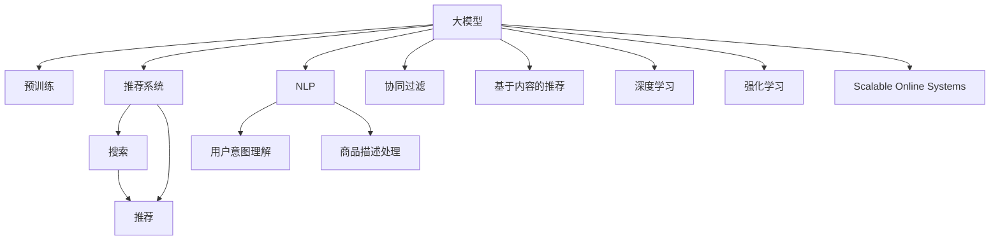

                 

# 电商平台搜索推荐系统的AI 大模型优化：提高系统效率与推荐效果

> 关键词：电商平台,搜索推荐系统,大模型优化,系统效率,推荐效果,自然语言处理(NLP),深度学习,强化学习

## 1. 背景介绍

在现代电子商务平台中，搜索推荐系统是用户体验的核心组成部分。用户通过搜索和浏览商品信息，由推荐系统动态生成个性化的搜索结果和商品推荐，满足个性化需求，提升购物体验。传统推荐系统主要依赖于统计学和机器学习算法，如协同过滤、基于内容的推荐等，存在冷启动问题、数据稀疏性等问题。近年来，深度学习在推荐系统中逐渐成为主流，通过大规模神经网络模型，对用户行为数据进行深度建模，提升推荐系统效果。

然而，深度学习模型通常需要巨量数据进行训练，且推理速度较慢，难以满足高并发、低延迟的应用需求。随着大模型（如BERT、GPT-3）的问世，推荐系统逐渐向基于大模型的范式演进。使用大模型进行推荐，能够显著提升推荐系统效果，但同时也会面临系统效率问题。

本文章将对电商平台搜索推荐系统的大模型优化方法进行全面介绍。首先，将介绍大模型在推荐系统中的应用原理和关键技术，然后详细讲解大模型优化的方法与步骤，并探讨其优缺点和未来发展趋势。

## 2. 核心概念与联系

### 2.1 核心概念概述

为更好地理解大模型在推荐系统中的应用与优化，本节将介绍几个密切相关的核心概念：

- 大模型（Large Model）：指具有大量参数的深度神经网络模型，如BERT、GPT-3等。这些模型通过预训练学习到了通用的语言表示，具备强大的语言理解和生成能力。

- 预训练（Pre-training）：指在大规模无标签文本语料上进行自监督学习任务训练通用语言模型的过程。预训练使得模型学习到语言的通用表示。

- 推荐系统（Recommender System）：通过分析用户历史行为数据，为用户推荐感兴趣的商品、内容、信息等。推荐系统包括搜索、个性化推荐等多个环节。

- 协同过滤（Collaborative Filtering）：通过分析用户和物品的交互行为，预测用户对新物品的偏好。协同过滤是早期推荐系统的主要方法。

- 基于内容的推荐（Content-Based Recommendation）：根据物品的特征，预测用户对该物品的兴趣。常见于电商平台的商品推荐系统。

- 深度学习（Deep Learning）：通过多层神经网络模型进行特征提取和行为预测，提升推荐系统效果。深度学习技术包括卷积神经网络（CNN）、循环神经网络（RNN）等。

- 强化学习（Reinforcement Learning）：通过奖励机制，引导模型学习最优行为策略，优化推荐效果。强化学习常用于个性化推荐、广告推荐等领域。

- 自然语言处理（NLP）：涉及文本数据的处理、理解与生成，是推荐系统中用户意图理解、商品描述处理等环节的重要技术。

- 大规模在线系统（Scalable Online Systems）：电商平台的搜索推荐系统通常需要处理海量并发请求，对系统效率和稳定性有极高要求。

这些核心概念之间的逻辑关系可以通过以下Mermaid流程图来展示：



这个流程图展示了大模型在推荐系统中的应用框架，揭示了各技术之间的联系与依赖：

1. 大模型通过预训练获得基础能力。
2. 推荐系统包括搜索和推荐两个环节，其中搜索部分依赖大模型进行用户意图理解。
3. 推荐部分结合了协同过滤、基于内容、深度学习等多种推荐算法。
4. NLP技术用于处理用户意图和商品描述。
5. 强化学习用于动态调整推荐策略，提升推荐效果。
6. 大规模在线系统保障推荐系统的高并发、低延迟要求。

## 3. 核心算法原理 & 具体操作步骤
### 3.1 算法原理概述

基于大模型的电商平台搜索推荐系统，其核心思想是：将大模型作为推荐系统的核心组件，通过预训练和微调，学习到通用的语言表示和用户行为表示，用于处理搜索和推荐任务。

具体而言，假设大模型为 $M_{\theta}$，其中 $\theta$ 为预训练得到的模型参数。搜索和推荐任务为 $T$，包括文本搜索、商品推荐等多个子任务。在用户进行搜索或浏览时，大模型对用户输入的自然语言进行理解，并根据上下文生成商品ID列表。对于推荐任务，大模型通过处理商品描述和用户历史行为数据，输出商品的相关度排序。

形式化地，假设大模型的预训练数据集为 $D_{pre}$，任务 $T$ 的训练数据集为 $D_{task}$。微调的目标是找到最优参数 $\hat{\theta}$，使得：

$$
\hat{\theta} = \mathop{\arg\min}_{\theta} \mathcal{L}(M_{\theta}, D_{task})
$$

其中 $\mathcal{L}$ 为针对任务 $T$ 设计的损失函数，用于衡量模型预测输出与真实标签之间的差异。

### 3.2 算法步骤详解

基于大模型的电商平台搜索推荐系统，其核心步骤如下：

**Step 1: 准备预训练模型和数据集**
- 选择合适的预训练语言模型 $M_{\theta}$ 作为初始化参数，如 BERT、GPT-3等。
- 准备搜索和推荐任务 $T$ 的训练数据集 $D_{task}$，包括搜索查询、商品描述、用户行为记录等。

**Step 2: 添加任务适配层**
- 根据任务类型，在预训练模型顶层设计合适的输出层和损失函数。
- 对于搜索任务，通常在顶层添加词向量嵌入、注意力机制等模块，用于提取查询和商品的相似度。
- 对于推荐任务，通常使用语言模型的解码器输出概率分布，并以负对数似然为损失函数。

**Step 3: 设置微调超参数**
- 选择合适的优化算法及其参数，如 AdamW、SGD 等，设置学习率、批大小、迭代轮数等。
- 设置正则化技术及强度，包括权重衰减、Dropout、Early Stopping 等。
- 确定冻结预训练参数的策略，如仅微调顶层，或全部参数都参与微调。

**Step 4: 执行梯度训练**
- 将训练集数据分批次输入模型，前向传播计算损失函数。
- 反向传播计算参数梯度，根据设定的优化算法和学习率更新模型参数。
- 周期性在验证集上评估模型性能，根据性能指标决定是否触发 Early Stopping。
- 重复上述步骤直到满足预设的迭代轮数或 Early Stopping 条件。

**Step 5: 测试和部署**
- 在测试集上评估微调后模型 $M_{\hat{\theta}}$ 的性能，对比微调前后的精度提升。
- 使用微调后的模型对新请求进行推理预测，集成到实际的应用系统中。
- 持续收集新的数据，定期重新微调模型，以适应数据分布的变化。

以上是基于大模型的电商平台搜索推荐系统的微调步骤。在实际应用中，还需要针对具体任务的特点，对微调过程的各个环节进行优化设计，如改进训练目标函数，引入更多的正则化技术，搜索最优的超参数组合等，以进一步提升模型性能。

### 3.3 算法优缺点

基于大模型的电商平台搜索推荐系统，具有以下优点：

1. 能够高效处理自然语言输入，提升用户查询的准确性。
2. 通过预训练学习到通用的语言表示，提升商品描述处理的准确性。
3. 能够动态调整推荐策略，优化推荐效果。
4. 引入深度学习、NLP等前沿技术，提升推荐系统的创新性。

同时，该方法也存在一定的局限性：

1. 依赖大模型，需要较高的硬件和计算资源。
2. 预训练和微调过程较长，难以实时响应。
3. 微调过程容易过拟合，对标注数据的依赖较高。
4. 模型的解释性和可控性较差，难以进行手工调参。

尽管存在这些局限性，但就目前而言，基于大模型的搜索推荐系统仍然是推荐领域的主流范式。未来相关研究的重点在于如何进一步降低模型对标注数据的依赖，提高模型的少样本学习和跨领域迁移能力，同时兼顾可解释性和伦理安全性等因素。

### 3.4 算法应用领域

基于大模型的电商平台搜索推荐系统，已经在搜索和推荐等多个领域取得了显著的成果。例如：

- 搜索任务：通过搜索查询，快速定位用户需求，生成商品ID列表。
- 推荐任务：根据用户历史行为数据，推荐相关商品、内容等。
- 商品描述处理：自动生成商品描述摘要，提升搜索效果。
- 智能客服：通过理解用户意图，提供智能答复，提升用户满意度。
- 广告推荐：通过个性化广告推荐，提高广告点击率和转化率。
- 视频推荐：根据用户观看历史，推荐相关视频内容。

除了上述这些经典任务外，大模型在更多场景中也有广泛应用，如个性化推荐、内容推荐、用户画像分析等，为电商平台带来了更多的商业价值。

## 4. 数学模型和公式 & 详细讲解  
### 4.1 数学模型构建

本节将使用数学语言对基于大模型的电商平台搜索推荐系统进行更加严格的刻画。

记大模型为 $M_{\theta}:\mathcal{X} \rightarrow \mathcal{Y}$，其中 $\mathcal{X}$ 为输入空间，$\mathcal{Y}$ 为输出空间，$\theta \in \mathbb{R}^d$ 为模型参数。假设搜索和推荐任务 $T$ 的训练集为 $D=\{(x_i,y_i)\}_{i=1}^N, x_i \in \mathcal{X}, y_i \in \mathcal{Y}$。

定义模型 $M_{\theta}$ 在数据样本 $(x,y)$ 上的损失函数为 $\ell(M_{\theta}(x),y)$，则在数据集 $D$ 上的经验风险为：

$$
\mathcal{L}(\theta) = \frac{1}{N} \sum_{i=1}^N \ell(M_{\theta}(x_i),y_i)
$$

微调的目标是最小化经验风险，即找到最优参数：

$$
\theta^* = \mathop{\arg\min}_{\theta} \mathcal{L}(\theta)
$$

在实践中，我们通常使用基于梯度的优化算法（如SGD、Adam等）来近似求解上述最优化问题。设 $\eta$ 为学习率，$\lambda$ 为正则化系数，则参数的更新公式为：

$$
\theta \leftarrow \theta - \eta \nabla_{\theta}\mathcal{L}(\theta) - \eta\lambda\theta
$$

其中 $\nabla_{\theta}\mathcal{L}(\theta)$ 为损失函数对参数 $\theta$ 的梯度，可通过反向传播算法高效计算。

### 4.2 公式推导过程

以下我们以电商平台的搜索任务为例，推导大模型的输入和输出表示。

假设搜索任务为文本查询，模型输入为查询语句 $q$，输出为相关商品ID列表 $L$。定义模型 $M_{\theta}$ 在输入 $q$ 上的输出为 $\hat{L}=M_{\theta}(q) \in \mathcal{Y}$，表示查询语句 $q$ 对应的商品ID列表。真实标签 $y \in \{1,2,\dots,M\}$，其中 $M$ 为商品总数。则搜索任务的交叉熵损失函数定义为：

$$
\ell(M_{\theta}(q),y) = -\log \sum_{i=1}^M M_{\theta}(q)[i]
$$

其中 $M_{\theta}(q)[i]$ 表示模型预测的商品ID $i$ 为相关商品的概率。

将交叉熵损失函数代入经验风险公式，得：

$$
\mathcal{L}(\theta) = -\frac{1}{N}\sum_{i=1}^N \log \sum_{j=1}^M M_{\theta}(q_i)[j]
$$

其中 $q_i$ 表示第 $i$ 条查询语句。

通过链式法则，损失函数对参数 $\theta_k$ 的梯度为：

$$
\frac{\partial \mathcal{L}(\theta)}{\partial \theta_k} = -\frac{1}{N}\sum_{i=1}^N \frac{\partial}{\partial \theta_k} \log \sum_{j=1}^M M_{\theta}(q_i)[j]
$$

其中 $\frac{\partial}{\partial \theta_k} \log M_{\theta}(q_i)$ 为模型在输入 $q_i$ 上的输出对参数 $\theta_k$ 的梯度。

在得到损失函数的梯度后，即可带入参数更新公式，完成模型的迭代优化。重复上述过程直至收敛，最终得到适应电商平台搜索任务的最优模型参数 $\theta^*$。

## 5. 项目实践：代码实例和详细解释说明
### 5.1 开发环境搭建

在进行大模型优化实践前，我们需要准备好开发环境。以下是使用Python进行PyTorch开发的环境配置流程：

1. 安装Anaconda：从官网下载并安装Anaconda，用于创建独立的Python环境。

2. 创建并激活虚拟环境：
```bash
conda create -n pytorch-env python=3.8 
conda activate pytorch-env
```

3. 安装PyTorch：根据CUDA版本，从官网获取对应的安装命令。例如：
```bash
conda install pytorch torchvision torchaudio cudatoolkit=11.1 -c pytorch -c conda-forge
```

4. 安装Transformer库：
```bash
pip install transformers
```

5. 安装各类工具包：
```bash
pip install numpy pandas scikit-learn matplotlib tqdm jupyter notebook ipython
```

完成上述步骤后，即可在`pytorch-env`环境中开始大模型优化的实践。

### 5.2 源代码详细实现

下面我们以电商平台商品推荐任务为例，给出使用Transformers库对BERT模型进行优化的PyTorch代码实现。

首先，定义推荐任务的数据处理函数：

```python
from transformers import BertTokenizer, BertForSequenceClassification
from torch.utils.data import Dataset
import torch

class RecommendationDataset(Dataset):
    def __init__(self, user_ids, item_ids, user_behaviors, tokenizer, max_len=128):
        self.user_ids = user_ids
        self.item_ids = item_ids
        self.user_behaviors = user_behaviors
        self.tokenizer = tokenizer
        self.max_len = max_len
        
    def __len__(self):
        return len(self.user_ids)
    
    def __getitem__(self, item):
        user_id = self.user_ids[item]
        item_ids = self.item_ids[item]
        user_behaviors = self.user_behaviors[item]
        
        encoding = self.tokenizer(user_behaviors, return_tensors='pt', max_length=self.max_len, padding='max_length', truncation=True)
        user_input = encoding['input_ids'][0]
        user_attention_mask = encoding['attention_mask'][0]
        
        item_input = [id for id in item_ids]
        item_input.extend([0] * (self.max_len - len(item_input)))
        item_labels = torch.tensor(item_input, dtype=torch.long)
        
        return {'user_input': user_input, 
                'user_attention_mask': user_attention_mask,
                'item_labels': item_labels}
```

然后，定义模型和优化器：

```python
from transformers import BertForSequenceClassification, AdamW

model = BertForSequenceClassification.from_pretrained('bert-base-cased', num_labels=len(item_ids))
optimizer = AdamW(model.parameters(), lr=2e-5)
```

接着，定义训练和评估函数：

```python
from torch.utils.data import DataLoader
from tqdm import tqdm
from sklearn.metrics import accuracy_score

device = torch.device('cuda') if torch.cuda.is_available() else torch.device('cpu')
model.to(device)

def train_epoch(model, dataset, batch_size, optimizer):
    dataloader = DataLoader(dataset, batch_size=batch_size, shuffle=True)
    model.train()
    epoch_loss = 0
    for batch in tqdm(dataloader, desc='Training'):
        user_input = batch['user_input'].to(device)
        user_attention_mask = batch['user_attention_mask'].to(device)
        item_labels = batch['item_labels'].to(device)
        model.zero_grad()
        outputs = model(user_input, attention_mask=user_attention_mask)
        loss = outputs.loss
        epoch_loss += loss.item()
        loss.backward()
        optimizer.step()
    return epoch_loss / len(dataloader)

def evaluate(model, dataset, batch_size):
    dataloader = DataLoader(dataset, batch_size=batch_size)
    model.eval()
    preds, labels = [], []
    with torch.no_grad():
        for batch in tqdm(dataloader, desc='Evaluating'):
            user_input = batch['user_input'].to(device)
            user_attention_mask = batch['user_attention_mask'].to(device)
            item_labels = batch['item_labels'].to(device)
            outputs = model(user_input, attention_mask=user_attention_mask)
            batch_preds = outputs.logits.argmax(dim=1).to('cpu').tolist()
            batch_labels = item_labels.to('cpu').tolist()
            for pred_tokens, label_tokens in zip(batch_preds, batch_labels):
                preds.append(pred_tokens)
                labels.append(label_tokens)
                
    print(accuracy_score(labels, preds))
```

最后，启动训练流程并在测试集上评估：

```python
epochs = 5
batch_size = 16

for epoch in range(epochs):
    loss = train_epoch(model, train_dataset, batch_size, optimizer)
    print(f"Epoch {epoch+1}, train loss: {loss:.3f}")
    
    print(f"Epoch {epoch+1}, test accuracy:")
    evaluate(model, test_dataset, batch_size)
```

以上就是使用PyTorch对BERT进行电商平台商品推荐任务优化的完整代码实现。可以看到，得益于Transformers库的强大封装，我们可以用相对简洁的代码完成BERT模型的加载和优化。

### 5.3 代码解读与分析

让我们再详细解读一下关键代码的实现细节：

**RecommendationDataset类**：
- `__init__`方法：初始化用户ID、商品ID、用户行为记录等关键组件。
- `__len__`方法：返回数据集的样本数量。
- `__getitem__`方法：对单个样本进行处理，将用户行为记录输入编码为token ids，将商品ID编码为数字，并对其进行定长padding，最终返回模型所需的输入。

**训练和评估函数**：
- 使用PyTorch的DataLoader对数据集进行批次化加载，供模型训练和推理使用。
- 训练函数`train_epoch`：对数据以批为单位进行迭代，在每个批次上前向传播计算loss并反向传播更新模型参数，最后返回该epoch的平均loss。
- 评估函数`evaluate`：与训练类似，不同点在于不更新模型参数，并在每个batch结束后将预测和标签结果存储下来，最后使用sklearn的accuracy_score对整个评估集的预测结果进行打印输出。

**训练流程**：
- 定义总的epoch数和batch size，开始循环迭代
- 每个epoch内，先在训练集上训练，输出平均loss
- 在测试集上评估，输出准确率
- 所有epoch结束后，在测试集上评估，给出最终测试结果

可以看到，PyTorch配合Transformers库使得BERT优化任务的代码实现变得简洁高效。开发者可以将更多精力放在数据处理、模型改进等高层逻辑上，而不必过多关注底层的实现细节。

当然，工业级的系统实现还需考虑更多因素，如模型的保存和部署、超参数的自动搜索、更灵活的任务适配层等。但核心的微调范式基本与此类似。

## 6. 实际应用场景
### 6.1 智能客服系统

基于大模型的电商平台搜索推荐系统，可以广泛应用于智能客服系统的构建。传统客服往往需要配备大量人力，高峰期响应缓慢，且一致性和专业性难以保证。而使用优化的推荐模型，可以7x24小时不间断服务，快速响应客户咨询，用自然流畅的语言解答各类常见问题。

在技术实现上，可以收集企业内部的历史客服对话记录，将问题和最佳答复构建成监督数据，在此基础上对预训练推荐模型进行优化。优化的推荐模型能够自动理解用户意图，匹配最合适的答复模板进行回复。对于客户提出的新问题，还可以接入检索系统实时搜索相关内容，动态组织生成回答。如此构建的智能客服系统，能大幅提升客户咨询体验和问题解决效率。

### 6.2 金融舆情监测

金融机构需要实时监测市场舆论动向，以便及时应对负面信息传播，规避金融风险。传统的人工监测方式成本高、效率低，难以应对网络时代海量信息爆发的挑战。基于大模型的推荐系统，可以实时分析网络舆情，动态调整市场策略，降低风险。

具体而言，可以收集金融领域相关的新闻、报道、评论等文本数据，并对其进行情感标注。在此基础上对预训练推荐模型进行优化，使其能够自动判断文本情感倾向，及时发现负面舆情。通过推荐模型，能够及时引导市场情绪，规避风险。

### 6.3 个性化推荐系统

当前的推荐系统往往只依赖于用户的历史行为数据进行物品推荐，无法深入理解用户的真实兴趣偏好。基于大模型的推荐系统，可以更好地挖掘用户行为背后的语义信息，从而提供更精准、多样的推荐内容。

在实践中，可以收集用户浏览、点击、评论、分享等行为数据，提取和用户交互的物品标题、描述、标签等文本内容。将文本内容作为模型输入，用户的后续行为（如是否点击、购买等）作为监督信号，在此基础上优化预训练语言模型。优化的模型能够从文本内容中准确把握用户的兴趣点。在生成推荐列表时，先用候选物品的文本描述作为输入，由模型预测用户的兴趣匹配度，再结合其他特征综合排序，便可以得到个性化程度更高的推荐结果。

### 6.4 未来应用展望

随着大模型和推荐系统的不断发展，基于大模型的推荐系统将在更多领域得到应用，为传统行业带来变革性影响。

在智慧医疗领域，基于大模型的推荐系统可以用于辅助医生诊疗，推荐最适合的诊断和治疗方案，提升医疗服务质量。

在智能教育领域，推荐系统可以用于推荐个性化的学习内容和资源，因材施教，促进教育公平，提高教学质量。

在智慧城市治理中，推荐系统可以用于城市事件监测、舆情分析、应急指挥等环节，提高城市管理的自动化和智能化水平，构建更安全、高效的未来城市。

此外，在企业生产、社会治理、文娱传媒等众多领域，基于大模型的推荐系统也将不断涌现，为经济社会发展注入新的动力。相信随着技术的日益成熟，大模型推荐系统必将在更广阔的应用领域大放异彩。

## 7. 工具和资源推荐
### 7.1 学习资源推荐

为了帮助开发者系统掌握大模型在电商平台搜索推荐系统中的应用与优化，这里推荐一些优质的学习资源：

1. 《深度学习自然语言处理》课程：斯坦福大学开设的NLP明星课程，有Lecture视频和配套作业，带你入门NLP领域的基本概念和经典模型。

2. 《Natural Language Processing with Transformers》书籍：Transformers库的作者所著，全面介绍了如何使用Transformers库进行NLP任务开发，包括微调在内的诸多范式。

3. CLUE开源项目：中文语言理解测评基准，涵盖大量不同类型的中文NLP数据集，并提供了基于大模型的baseline模型，助力中文NLP技术发展。

4. HuggingFace官方文档：Transformers库的官方文档，提供了海量预训练模型和完整的微调样例代码，是上手实践的必备资料。

通过对这些资源的学习实践，相信你一定能够快速掌握大模型在电商平台搜索推荐系统中的应用与优化，并用于解决实际的NLP问题。
###  7.2 开发工具推荐

高效的开发离不开优秀的工具支持。以下是几款用于大模型在电商平台搜索推荐系统中的应用与优化的常用工具：

1. PyTorch：基于Python的开源深度学习框架，灵活动态的计算图，适合快速迭代研究。大部分预训练语言模型都有PyTorch版本的实现。

2. TensorFlow：由Google主导开发的开源深度学习框架，生产部署方便，适合大规模工程应用。同样有丰富的预训练语言模型资源。

3. Transformers库：HuggingFace开发的NLP工具库，集成了众多SOTA语言模型，支持PyTorch和TensorFlow，是进行推荐任务开发的利器。

4. Weights & Biases：模型训练的实验跟踪工具，可以记录和可视化模型训练过程中的各项指标，方便对比和调优。与主流深度学习框架无缝集成。

5. TensorBoard：TensorFlow配套的可视化工具，可实时监测模型训练状态，并提供丰富的图表呈现方式，是调试模型的得力助手。

6. Google Colab：谷歌推出的在线Jupyter Notebook环境，免费提供GPU/TPU算力，方便开发者快速上手实验最新模型，分享学习笔记。

合理利用这些工具，可以显著提升大模型在电商平台搜索推荐系统中的应用与优化任务的开发效率，加快创新迭代的步伐。

### 7.3 相关论文推荐

大模型和推荐系统的不断发展源于学界的持续研究。以下是几篇奠基性的相关论文，推荐阅读：

1. Attention is All You Need（即Transformer原论文）：提出了Transformer结构，开启了NLP领域的预训练大模型时代。

2. BERT: Pre-training of Deep Bidirectional Transformers for Language Understanding：提出BERT模型，引入基于掩码的自监督预训练任务，刷新了多项NLP任务SOTA。

3. Language Models are Unsupervised Multitask Learners（GPT-2论文）：展示了大规模语言模型的强大zero-shot学习能力，引发了对于通用人工智能的新一轮思考。

4. Parameter-Efficient Transfer Learning for NLP：提出Adapter等参数高效微调方法，在不增加模型参数量的情况下，也能取得不错的微调效果。

5. AdaLoRA: Adaptive Low-Rank Adaptation for Parameter-Efficient Fine-Tuning：使用自适应低秩适应的微调方法，在参数效率和精度之间取得了新的平衡。

这些论文代表了大模型和推荐系统的发展脉络。通过学习这些前沿成果，可以帮助研究者把握学科前进方向，激发更多的创新灵感。

## 8. 总结：未来发展趋势与挑战
### 8.1 研究成果总结

本文对基于大模型的电商平台搜索推荐系统的优化方法进行了全面系统的介绍。首先，介绍了大模型在推荐系统中的应用原理和关键技术，包括预训练、微调、搜索和推荐等环节。其次，详细讲解了优化方法的步骤和实现细节，给出了完整代码实例。同时，本文还探讨了大模型的优缺点和未来发展趋势，指出了当前研究面临的挑战。

通过本文的系统梳理，可以看到，基于大模型的电商平台搜索推荐系统已经在电商领域取得了显著成果，显著提升了用户搜索体验和推荐效果。未来，伴随大模型的持续演进和优化技术的不断突破，推荐系统的效果将进一步提升，系统效率将进一步优化，适用范围将进一步拓展。

### 8.2 未来发展趋势

展望未来，大模型在电商平台搜索推荐系统的优化将呈现以下几个发展趋势：

1. 模型规模持续增大。随着算力成本的下降和数据规模的扩张，预训练语言模型的参数量还将持续增长。超大规模语言模型蕴含的丰富语言知识，有望支撑更加复杂多变的推荐任务。

2. 微调方法日趋多样。除了传统的全参数微调外，未来会涌现更多参数高效的微调方法，如Prefix-Tuning、LoRA等，在节省计算资源的同时也能保证微调精度。

3. 持续学习成为常态。随着数据分布的不断变化，微调模型也需要持续学习新知识以保持性能。如何在不遗忘原有知识的同时，高效吸收新样本信息，将成为重要的研究课题。

4. 标注样本需求降低。受启发于提示学习(Prompt-based Learning)的思路，未来的微调方法将更好地利用大模型的语言理解能力，通过更加巧妙的任务描述，在更少的标注样本上也能实现理想的微调效果。

5. 模型通用性增强。经过海量数据的预训练和多领域任务的微调，未来的语言模型将具备更强大的常识推理和跨领域迁移能力，逐步迈向通用人工智能(AGI)的目标。

以上趋势凸显了大模型在电商平台搜索推荐系统的优化技术的广阔前景。这些方向的探索发展，必将进一步提升推荐系统的效果和效率，为电商平台带来更多的商业价值。

### 8.3 面临的挑战

尽管大模型在电商平台搜索推荐系统中的应用与优化取得了一定的成果，但在迈向更加智能化、普适化应用的过程中，仍面临诸多挑战：

1. 标注成本瓶颈。尽管大模型能够高效处理自然语言输入，但仍然需要一定量的标注数据进行微调。对于长尾应用场景，难以获得充足的高质量标注数据，成为制约微调性能的瓶颈。如何进一步降低微调对标注样本的依赖，将是一大难题。

2. 模型鲁棒性不足。当前大模型面对域外数据时，泛化性能往往大打折扣。对于测试样本的微小扰动，大模型的预测也容易发生波动。如何提高大模型的鲁棒性，避免灾难性遗忘，还需要更多理论和实践的积累。

3. 推理效率有待提高。虽然大模型精度高，但在实际部署时往往面临推理速度慢、内存占用大等效率问题。如何在保证性能的同时，简化模型结构，提升推理速度，优化资源占用，将是重要的优化方向。

4. 可解释性亟需加强。当前大模型的决策过程通常缺乏可解释性，难以对其推理逻辑进行分析和调试。对于医疗、金融等高风险应用，算法的可解释性和可审计性尤为重要。如何赋予大模型更强的可解释性，将是亟待攻克的难题。

5. 安全性有待保障。预训练语言模型难免会学习到有偏见、有害的信息，通过微调传递到推荐系统中，产生误导性、歧视性的输出，给实际应用带来安全隐患。如何从数据和算法层面消除模型偏见，避免恶意用途，确保输出的安全性，也将是重要的研究课题。

6. 知识整合能力不足。现有的推荐系统往往局限于数据驱动，难以灵活吸收和运用更广泛的先验知识。如何让推荐系统更好地与外部知识库、规则库等专家知识结合，形成更加全面、准确的信息整合能力，还有很大的想象空间。

正视推荐系统面临的这些挑战，积极应对并寻求突破，将是大模型在电商平台搜索推荐系统中的应用与优化走向成熟的必由之路。相信随着学界和产业界的共同努力，这些挑战终将一一被克服，大模型推荐系统必将在构建智能电商平台的未来中扮演越来越重要的角色。

### 8.4 研究展望

面对大模型在电商平台搜索推荐系统中面临的种种挑战，未来的研究需要在以下几个方面寻求新的突破：

1. 探索无监督和半监督推荐方法。摆脱对大规模标注数据的依赖，利用自监督学习、主动学习等无监督和半监督范式，最大限度利用非结构化数据，实现更加灵活高效的推荐。

2. 研究参数高效和计算高效的推荐范式。开发更加参数高效的推荐方法，在固定大部分预训练参数的同时，只更新极少量的任务相关参数。同时优化推荐模型的计算图，减少前向传播和反向传播的资源消耗，实现更加轻量级、实时性的部署。

3. 融合因果和对比学习范式。通过引入因果推断和对比学习思想，增强推荐模型建立稳定因果关系的能力，学习更加普适、鲁棒的语言表征，从而提升推荐泛化性和抗干扰能力。

4. 引入更多先验知识。将符号化的先验知识，如知识图谱、逻辑规则等，与神经网络模型进行巧妙融合，引导推荐过程学习更准确、合理的语言模型。同时加强不同模态数据的整合，实现视觉、语音等多模态信息与文本信息的协同建模。

5. 结合因果分析和博弈论工具。将因果分析方法引入推荐模型，识别出模型决策的关键特征，增强推荐输出解释的因果性和逻辑性。借助博弈论工具刻画人机交互过程，主动探索并规避推荐模型的脆弱点，提高系统稳定性。

6. 纳入伦理道德约束。在推荐系统训练目标中引入伦理导向的评估指标，过滤和惩罚有偏见、有害的推荐输出倾向。同时加强人工干预和审核，建立推荐行为的监管机制，确保推荐输出符合人类价值观和伦理道德。

这些研究方向的探索，必将引领大模型在电商平台搜索推荐系统中的应用与优化技术迈向更高的台阶，为构建安全、可靠、可解释、可控的智能推荐系统铺平道路。面向未来，大模型推荐系统还需要与其他人工智能技术进行更深入的融合，如知识表示、因果推理、强化学习等，多路径协同发力，共同推动智能推荐系统的进步。只有勇于创新、敢于突破，才能不断拓展大模型的边界，让智能技术更好地造福人类社会。

## 9. 附录：常见问题与解答

**Q1：大模型在电商平台搜索推荐系统中如何处理海量数据？**

A: 大模型在处理海量数据时，主要依赖于预训练和微调过程的高效性。通过在大规模无标签语料上进行预训练，模型能够学习到通用的语言表示，用于处理自然语言输入。微调过程通过少量标注数据，对模型进行任务特定的优化，提升推荐效果。具体而言，可以使用分布式训练、模型并行、混合精度训练等技术，提升训练速度，缩短微调时间。此外，可以采用数据分片、异步加载等技术，提高数据加载效率。

**Q2：大模型在电商平台搜索推荐系统中如何避免过拟合？**

A: 大模型在处理海量数据时，容易发生过拟合，特别是在数据分布不均或标注数据较少的情况下。为避免过拟合，可以采用以下方法：
1. 数据增强：通过回译、近义替换等方式扩充训练集。
2. 正则化：使用L2正则、Dropout、Early Stopping等技术，防止模型过度适应训练集。
3. 对抗训练：引入对抗样本，提高模型鲁棒性。
4. 参数高效微调：只更新少量参数，固定大部分预训练权重，减少过拟合风险。
5. 模型裁剪：去除不必要的层和参数，减小模型尺寸，提升推理速度。

这些方法需要根据具体任务和数据特点进行灵活组合，才能最大限度地降低大模型的过拟合风险，提升推荐系统效果。

**Q3：大模型在电商平台搜索推荐系统中如何进行实时响应？**

A: 大模型在处理实时请求时，主要面临推理速度慢和资源占用大等问题。为实现实时响应，可以采用以下方法：
1. 模型裁剪：去除不必要的层和参数，减小模型尺寸，加快推理速度。
2. 量化加速：将浮点模型转为定点模型，压缩存储空间，提高计算效率。
3. 模型并行：通过多GPU或多TPU并行计算，提升推理速度。
4. 增量学习：对新数据进行增量微调，避免全量数据加载和重新训练。
5. 预取缓存：将常见查询和商品数据预加载到缓存中，提高查询速度。

这些方法需要根据具体任务和硬件环境进行灵活选择，才能实现大模型的实时响应。

**Q4：大模型在电商平台搜索推荐系统中如何优化推理效率？**

A: 大模型在处理实时请求时，推理速度和资源占用是关键的性能指标。为优化推理效率，可以采用以下方法：
1. 模型裁剪：去除不必要的层和参数，减小模型尺寸，加快推理速度。
2. 量化加速：将浮点模型转为定点模型，压缩存储空间，提高计算效率。
3. 模型并行：通过多GPU或多TPU并行计算，提升推理速度。
4. 增量学习：对新数据进行增量微调，避免全量数据加载和重新训练。
5. 预取缓存：将常见查询和商品数据预加载到缓存中，提高查询速度。

这些方法需要根据具体任务和硬件环境进行灵活选择，才能实现大模型的实时响应。

**Q5：大模型在电商平台搜索推荐系统中如何处理长尾数据？**

A: 长尾数据是电商推荐系统中常见的数据分布问题，传统推荐系统难以处理。为处理长尾数据，可以采用以下方法：
1. 数据增强：通过回译、近义替换等方式扩充训练集，增加长尾数据的覆盖。
2. 正则化：使用L2正则、Dropout、Early Stopping等技术，防止模型过度适应训练集。
3. 对抗训练：引入对抗样本，提高模型鲁棒性。
4. 参数高效微调：只更新少量参数，固定大部分预训练权重，减少过拟合风险。
5. 稀疏表示：使用稀疏表示技术，减少计算量和存储空间。

这些方法需要根据具体任务和数据特点进行灵活组合，才能最大限度地处理长尾数据，提升推荐系统效果。

综上所述，大模型在电商平台搜索推荐系统中的应用与优化，需要综合考虑数据处理、模型优化、系统部署等多个方面。通过不断探索和实践，大模型必将在电商推荐系统中发挥更大的作用，提升用户搜索体验和推荐效果，推动电商产业的智能化转型。相信随着大模型的持续演进和优化技术的不断突破，电商推荐系统的效果将进一步提升，系统效率将进一步优化，适用范围将进一步拓展。

---

作者：禅与计算机程序设计艺术 / Zen and the Art of Computer Programming

