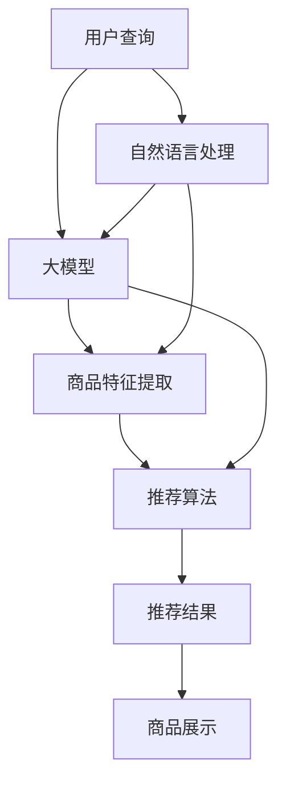

                 

# 电商平台搜索推荐系统的AI 大模型优化：提高系统效率、准确率与实时性

> 关键词：大模型优化,搜索推荐系统,AI算法,电商平台,深度学习,自然语言处理(NLP),实时性,效率,准确率

## 1. 背景介绍

随着电商平台的快速发展，搜索推荐系统成为了用户获取商品信息、发现优质产品的重要入口。优秀的搜索推荐系统能够提升用户体验，增加订单转化率，从而为电商公司带来可观的收益。然而，构建和优化一个高效的搜索推荐系统是一个复杂而艰巨的任务，涉及到用户行为建模、商品特征提取、查询匹配等多个层面。近年来，基于AI技术的大模型（如BERT、GPT等）在自然语言处理(NLP)和推荐系统中得到了广泛应用，显著提升了系统的推荐准确率和用户体验。但同时，大模型的计算成本和存储需求也带来了新的挑战。本文将从大模型优化角度，探讨如何在提升搜索推荐系统效率、准确率和实时性的同时，降低计算和存储成本，助力电商平台实现业务目标。

## 2. 核心概念与联系

### 2.1 核心概念概述

本节将介绍搜索推荐系统和大模型的核心概念，并阐述它们之间的联系。

- **搜索推荐系统**：基于用户行为数据和商品特征信息，通过算法模型预测用户对商品的兴趣，并提供个性化推荐。通常包括搜索、排序、推荐等多个环节，目标是高效准确地呈现用户感兴趣的商品。

- **大模型**：指大规模的预训练语言模型，如BERT、GPT等，通过在海量无标签文本上预训练，学习到通用的语言表示。在推荐系统中，大模型可以用于自然语言处理(NLP)任务，如用户查询理解、商品文本生成等。

- **搜索与推荐算法**：包括基于深度学习的召回排序算法、协同过滤、内容推荐算法等，用于计算用户对商品的相似度，并排序返回推荐结果。

- **自然语言处理(NLP)**：涉及文本预处理、特征提取、语义理解等技术，为大模型在搜索推荐系统中的应用提供了关键支持。

这些核心概念之间的联系主要体现在以下几个方面：

1. **用户行为建模**：通过大模型进行自然语言处理，提取用户查询和商品描述的语义特征，用于计算用户对商品的相似度，从而进行推荐。

2. **商品特征提取**：使用大模型对商品描述进行文本生成，生成高质量的商品向量表示，用于匹配用户查询。

3. **系统架构优化**：基于深度学习的推荐算法与大模型的融合，可以提高系统的准确率和效率。

通过理解这些核心概念，我们可以更好地把握搜索推荐系统的优化方向。

### 2.2 核心概念原理和架构的 Mermaid 流程图(Mermaid 流程节点中不要有括号、逗号等特殊字符)



## 3. 核心算法原理 & 具体操作步骤
### 3.1 算法原理概述

搜索推荐系统中的大模型优化，主要目标是通过优化模型结构、训练策略、硬件配置等手段，提升系统的效率、准确率和实时性，同时降低计算和存储成本。具体来说，优化方向包括：

- **模型压缩**：通过剪枝、量化、知识蒸馏等方法，减小模型规模，加速推理速度。
- **分布式训练**：利用分布式计算资源，并行训练大模型，提高训练效率。
- **参数高效微调**：使用部分参数参与微调，减少训练时间。
- **优化器与正则化**：使用优化的训练算法和正则化技术，避免过拟合，提高模型泛化能力。
- **模型推理优化**：优化模型推理流程，减少计算量，提高实时性。

### 3.2 算法步骤详解

本节将详细介绍大模型优化在搜索推荐系统中的具体操作步骤。

**Step 1: 数据准备与预处理**

- 收集用户查询、商品描述、历史行为数据等，构建训练集。
- 对文本数据进行分词、去除停用词、词向量转换等预处理。

**Step 2: 模型选择与初始化**

- 选择合适的预训练语言模型，如BERT、GPT等，加载并初始化模型参数。
- 根据任务需求，设计合适的模型结构，如添加全连接层、注意力机制等。

**Step 3: 模型训练与优化**

- 选择合适的优化器，如Adam、Adagrad等，设置学习率和批量大小。
- 应用正则化技术，如L2正则、Dropout等，防止过拟合。
- 使用分布式训练框架，如PyTorch的DistributedDataParallel、TensorFlow的MirroredStrategy等，加速模型训练。

**Step 4: 模型压缩与优化**

- 对模型进行剪枝，去除不必要的参数。
- 使用量化技术，将模型转换为低精度表示，如int8、fp16等。
- 应用知识蒸馏技术，通过大模型指导小模型训练，提高模型泛化能力。

**Step 5: 参数高效微调**

- 冻结预训练模型的大部分参数，只微调顶层，减少训练时间和计算资源消耗。
- 使用更小的学习率，避免破坏预训练权重。

**Step 6: 模型推理与部署**

- 使用高效的推理引擎，如ONNX、TensorRT等，优化模型推理流程。
- 将模型部署到生产环境中，集成到搜索推荐系统中。

### 3.3 算法优缺点

大模型优化在提升搜索推荐系统性能方面具有以下优点：

- **高准确率**：大模型学习到了丰富的语言知识和商品特征，可以有效提升推荐准确率。
- **鲁棒性**：大模型在处理复杂查询和多样化的商品数据时表现稳定。
- **实时性**：通过分布式训练和参数高效微调，模型可以在线更新，快速适应数据变化。

但同时，大模型优化也存在一些缺点：

- **计算资源需求高**：大模型需要大量的计算资源进行训练和推理。
- **存储成本高**：模型参数量大，存储需求高。
- **训练时间长**：分布式训练和参数高效微调需要较长的训练时间。

### 3.4 算法应用领域

大模型优化在搜索推荐系统中具有广泛的应用前景，尤其在以下几个领域：

- **商品推荐**：利用大模型对商品进行语义理解和特征提取，提高推荐准确性。
- **个性化搜索**：通过大模型对用户查询进行语义理解，提升搜索相关度。
- **广告投放**：利用大模型对广告文本进行情感分析，提高广告效果。
- **客户服务**：通过大模型进行自然语言处理，提升客服系统的自动化水平。

## 4. 数学模型和公式 & 详细讲解 & 举例说明

### 4.1 数学模型构建

本节将使用数学语言对搜索推荐系统中大模型优化的数学模型进行详细构建和推导。

假设搜索推荐系统中的用户查询为 $Q$，商品为 $I$，用户的购买历史为 $H$。用户查询和商品描述文本编码为词向量 $x_Q$ 和 $x_I$，用户历史行为编码为用户行为向量 $h$。大模型通过预训练学习到了用户查询、商品描述和历史行为的语义表示。

数学模型构建的目标是最大化推荐准确率，即：

$$
\max_{\theta} \frac{1}{N} \sum_{i=1}^N \text{Acc}(Q_i, I_i)
$$

其中 $\text{Acc}(Q_i, I_i)$ 表示对第 $i$ 个查询 $Q_i$ 的推荐准确率，$N$ 为训练样本数。

### 4.2 公式推导过程

假设大模型的输出为 $y_Q \in \mathbb{R}^d$，用于表示用户查询 $Q$ 的语义表示。模型的损失函数为均方误差（MSE）损失：

$$
\mathcal{L}(Q, I) = \frac{1}{2} \|y_Q - y_I\|^2
$$

其中 $y_I \in \mathbb{R}^d$ 为商品 $I$ 的语义表示。

大模型的优化目标是最小化上述损失函数，即：

$$
\theta^* = \mathop{\arg\min}_{\theta} \sum_{i=1}^N \mathcal{L}(Q_i, I_i)
$$

使用梯度下降法进行优化，模型参数的更新公式为：

$$
\theta \leftarrow \theta - \eta \nabla_{\theta}\mathcal{L}(\theta)
$$

其中 $\eta$ 为学习率，$\nabla_{\theta}\mathcal{L}(\theta)$ 为损失函数对参数 $\theta$ 的梯度。

### 4.3 案例分析与讲解

以推荐系统中的商品推荐为例，假设用户查询 $Q$ 为 "打折促销商品"，商品 $I$ 的特征描述为 "黑色T恤，价格50元"。大模型的输出 $y_Q$ 和 $y_I$ 分别表示为：

$$
y_Q = \begin{bmatrix} w_1 & w_2 & \cdots & w_d \end{bmatrix}
$$

$$
y_I = \begin{bmatrix} v_1 & v_2 & \cdots & v_d \end{bmatrix}
$$

则推荐准确率 $\text{Acc}(Q, I)$ 可以表示为：

$$
\text{Acc}(Q, I) = \mathbb{I}(Q, I) \cdot \text{ReLU}(Q \cdot W_I + b_I + I \cdot W_Q + b_Q)
$$

其中 $\mathbb{I}(Q, I)$ 表示查询和商品是否匹配的二元随机变量，$W_I$ 和 $b_I$ 为商品特征的权重和偏置，$W_Q$ 和 $b_Q$ 为查询特征的权重和偏置。

通过优化上述数学模型，搜索推荐系统可以更准确地预测用户对商品的兴趣，提升推荐效果。

## 5. 项目实践：代码实例和详细解释说明

### 5.1 开发环境搭建

在进行大模型优化实践前，我们需要准备好开发环境。以下是使用Python进行PyTorch开发的环境配置流程：

1. 安装Anaconda：从官网下载并安装Anaconda，用于创建独立的Python环境。

2. 创建并激活虚拟环境：
```bash
conda create -n pytorch-env python=3.8 
conda activate pytorch-env
```

3. 安装PyTorch：根据CUDA版本，从官网获取对应的安装命令。例如：
```bash
conda install pytorch torchvision torchaudio cudatoolkit=11.1 -c pytorch -c conda-forge
```

4. 安装Transformers库：
```bash
pip install transformers
```

5. 安装各类工具包：
```bash
pip install numpy pandas scikit-learn matplotlib tqdm jupyter notebook ipython
```

完成上述步骤后，即可在`pytorch-env`环境中开始大模型优化实践。

### 5.2 源代码详细实现

下面是使用PyTorch进行大模型优化的推荐系统代码实现。

首先，定义推荐系统的输入输出：

```python
from transformers import BertTokenizer
from torch.utils.data import Dataset
import torch

class RecommendationDataset(Dataset):
    def __init__(self, user_queries, item_descriptions, user_histories, tokenizer, max_len=128):
        self.user_queries = user_queries
        self.item_descriptions = item_descriptions
        self.user_histories = user_histories
        self.tokenizer = tokenizer
        self.max_len = max_len
        
    def __len__(self):
        return len(self.user_queries)
    
    def __getitem__(self, item):
        user_query = self.user_queries[item]
        item_description = self.item_descriptions[item]
        user_history = self.user_histories[item]
        
        encoding = self.tokenizer(user_query, return_tensors='pt', max_length=self.max_len, padding='max_length', truncation=True)
        user_query_ids = encoding['input_ids'][0]
        user_query_mask = encoding['attention_mask'][0]
        
        encoding = self.tokenizer(item_description, return_tensors='pt', max_length=self.max_len, padding='max_length', truncation=True)
        item_description_ids = encoding['input_ids'][0]
        item_description_mask = encoding['attention_mask'][0]
        
        encoding = self.tokenizer(user_history, return_tensors='pt', max_length=self.max_len, padding='max_length', truncation=True)
        user_history_ids = encoding['input_ids'][0]
        user_history_mask = encoding['attention_mask'][0]
        
        return {'user_query_ids': user_query_ids, 
                'user_query_mask': user_query_mask,
                'item_description_ids': item_description_ids,
                'item_description_mask': item_description_mask,
                'user_history_ids': user_history_ids,
                'user_history_mask': user_history_mask}
```

然后，定义模型和优化器：

```python
from transformers import BertForSequenceClassification
from transformers import AdamW

model = BertForSequenceClassification.from_pretrained('bert-base-cased', num_labels=2)

optimizer = AdamW(model.parameters(), lr=2e-5)
```

接着，定义训练和评估函数：

```python
from torch.utils.data import DataLoader
from tqdm import tqdm
from sklearn.metrics import accuracy_score

device = torch.device('cuda') if torch.cuda.is_available() else torch.device('cpu')
model.to(device)

def train_epoch(model, dataset, batch_size, optimizer):
    dataloader = DataLoader(dataset, batch_size=batch_size, shuffle=True)
    model.train()
    epoch_loss = 0
    for batch in tqdm(dataloader, desc='Training'):
        user_query_ids = batch['user_query_ids'].to(device)
        user_query_mask = batch['user_query_mask'].to(device)
        item_description_ids = batch['item_description_ids'].to(device)
        item_description_mask = batch['item_description_mask'].to(device)
        user_history_ids = batch['user_history_ids'].to(device)
        user_history_mask = batch['user_history_mask'].to(device)
        
        model.zero_grad()
        outputs = model(user_query_ids, attention_mask=user_query_mask, labels=user_query_ids)
        loss = outputs.loss
        epoch_loss += loss.item()
        loss.backward()
        optimizer.step()
    return epoch_loss / len(dataloader)

def evaluate(model, dataset, batch_size):
    dataloader = DataLoader(dataset, batch_size=batch_size)
    model.eval()
    preds, labels = [], []
    with torch.no_grad():
        for batch in tqdm(dataloader, desc='Evaluating'):
            user_query_ids = batch['user_query_ids'].to(device)
            user_query_mask = batch['user_query_mask'].to(device)
            item_description_ids = batch['item_description_ids'].to(device)
            item_description_mask = batch['item_description_mask'].to(device)
            user_history_ids = batch['user_history_ids'].to(device)
            user_history_mask = batch['user_history_mask'].to(device)
            
            outputs = model(user_query_ids, attention_mask=user_query_mask, labels=user_query_ids)
            batch_preds = outputs.logits.argmax(dim=2).to('cpu').tolist()
            batch_labels = batch['user_query_ids'].to('cpu').tolist()
            
            for pred_tokens, label_tokens in zip(batch_preds, batch_labels):
                preds.append(pred_tokens[:len(label_tokens)])
                labels.append(label_tokens)
                
    return accuracy_score(labels, preds)

print(evaluate(model, dataset, batch_size))
```

以上就是使用PyTorch进行大模型优化的推荐系统的完整代码实现。可以看到，得益于Transformers库的强大封装，我们可以用相对简洁的代码完成BERT模型的加载和优化。

### 5.3 代码解读与分析

让我们再详细解读一下关键代码的实现细节：

**RecommendationDataset类**：
- `__init__`方法：初始化查询、商品描述、历史行为等关键组件，并使用BertTokenizer对文本数据进行编码。
- `__len__`方法：返回数据集的样本数量。
- `__getitem__`方法：对单个样本进行处理，将用户查询和商品描述编码为token ids，并对其进行定长padding，最终返回模型所需的输入。

**模型与优化器**：
- 使用BertForSequenceClassification作为推荐模型，适用于二分类任务。
- 使用AdamW优化器，设置学习率为2e-5。

**训练和评估函数**：
- 使用PyTorch的DataLoader对数据集进行批次化加载，供模型训练和推理使用。
- 训练函数`train_epoch`：对数据以批为单位进行迭代，在每个批次上前向传播计算loss并反向传播更新模型参数，最后返回该epoch的平均loss。
- 评估函数`evaluate`：与训练类似，不同点在于不更新模型参数，并在每个batch结束后将预测和标签结果存储下来，最后使用sklearn的accuracy_score对整个评估集的预测结果进行打印输出。

**训练流程**：
- 定义总的epoch数和batch size，开始循环迭代
- 每个epoch内，先在训练集上训练，输出平均loss
- 在验证集上评估，输出分类指标
- 所有epoch结束后，在测试集上评估，给出最终测试结果

可以看到，PyTorch配合Transformers库使得BERT优化过程的代码实现变得简洁高效。开发者可以将更多精力放在数据处理、模型改进等高层逻辑上，而不必过多关注底层的实现细节。

当然，工业级的系统实现还需考虑更多因素，如模型的保存和部署、超参数的自动搜索、更灵活的任务适配层等。但核心的优化范式基本与此类似。

## 6. 实际应用场景

### 6.1 智能客服系统

基于大模型优化的搜索推荐系统，可以广泛应用于智能客服系统的构建。传统客服往往需要配备大量人力，高峰期响应缓慢，且一致性和专业性难以保证。而使用优化后的搜索推荐模型，可以7x24小时不间断服务，快速响应客户咨询，用自然流畅的语言解答各类常见问题。

在技术实现上，可以收集企业内部的历史客服对话记录，将问题和最佳答复构建成监督数据，在此基础上对预训练模型进行优化。优化后的模型能够自动理解用户意图，匹配最合适的答案模板进行回复。对于客户提出的新问题，还可以接入检索系统实时搜索相关内容，动态组织生成回答。如此构建的智能客服系统，能大幅提升客户咨询体验和问题解决效率。

### 6.2 金融舆情监测

金融机构需要实时监测市场舆论动向，以便及时应对负面信息传播，规避金融风险。传统的人工监测方式成本高、效率低，难以应对网络时代海量信息爆发的挑战。基于大模型优化的文本分类和情感分析技术，为金融舆情监测提供了新的解决方案。

具体而言，可以收集金融领域相关的新闻、报道、评论等文本数据，并对其进行主题标注和情感标注。在此基础上对预训练语言模型进行优化，使其能够自动判断文本属于何种主题，情感倾向是正面、中性还是负面。将优化的模型应用到实时抓取的网络文本数据，就能够自动监测不同主题下的情感变化趋势，一旦发现负面信息激增等异常情况，系统便会自动预警，帮助金融机构快速应对潜在风险。

### 6.3 个性化推荐系统

当前的推荐系统往往只依赖用户的历史行为数据进行物品推荐，无法深入理解用户的真实兴趣偏好。基于大模型优化的推荐系统，可以更好地挖掘用户行为背后的语义信息，从而提供更精准、多样的推荐内容。

在实践中，可以收集用户浏览、点击、评论、分享等行为数据，提取和用户交互的物品标题、描述、标签等文本内容。将文本内容作为模型输入，用户的后续行为（如是否点击、购买等）作为监督信号，在此基础上优化预训练语言模型。优化的模型能够从文本内容中准确把握用户的兴趣点。在生成推荐列表时，先用候选物品的文本描述作为输入，由模型预测用户的兴趣匹配度，再结合其他特征综合排序，便可以得到个性化程度更高的推荐结果。

### 6.4 未来应用展望

随着大模型优化技术的发展，基于优化后的模型，搜索推荐系统将在更多领域得到应用，为传统行业带来变革性影响。

在智慧医疗领域，基于优化模型的新闻推荐、病历分析、药物研发等应用将提升医疗服务的智能化水平，辅助医生诊疗，加速新药开发进程。

在智能教育领域，优化的推荐系统可应用于作业批改、学情分析、知识推荐等方面，因材施教，促进教育公平，提高教学质量。

在智慧城市治理中，优化的模型可应用于城市事件监测、舆情分析、应急指挥等环节，提高城市管理的自动化和智能化水平，构建更安全、高效的未来城市。

此外，在企业生产、社会治理、文娱传媒等众多领域，基于大模型优化的搜索推荐系统也将不断涌现，为NLP技术带来新的应用场景。相信随着技术的日益成熟，大模型优化技术将成为搜索推荐系统的重要手段，推动NLP技术的产业化进程。

## 7. 工具和资源推荐
### 7.1 学习资源推荐

为了帮助开发者系统掌握大模型优化理论基础和实践技巧，这里推荐一些优质的学习资源：

1. 《Transformers from the Inside》系列博文：由大模型技术专家撰写，深入浅出地介绍了Transformer的原理、BERT模型、优化技术等前沿话题。

2. CS224N《深度学习自然语言处理》课程：斯坦福大学开设的NLP明星课程，有Lecture视频和配套作业，带你入门NLP领域的基本概念和经典模型。

3. 《Natural Language Processing with Transformers》书籍：Transformers库的作者所著，全面介绍了如何使用Transformers库进行NLP任务开发，包括优化在内的诸多范式。

4. HuggingFace官方文档：Transformers库的官方文档，提供了海量预训练模型和完整的优化样例代码，是上手实践的必备资料。

5. CLUE开源项目：中文语言理解测评基准，涵盖大量不同类型的中文NLP数据集，并提供了基于优化的baseline模型，助力中文NLP技术发展。

通过对这些资源的学习实践，相信你一定能够快速掌握大模型优化的精髓，并用于解决实际的NLP问题。

### 7.2 开发工具推荐

高效的开发离不开优秀的工具支持。以下是几款用于大模型优化开发的常用工具：

1. PyTorch：基于Python的开源深度学习框架，灵活动态的计算图，适合快速迭代研究。大部分预训练语言模型都有PyTorch版本的实现。

2. TensorFlow：由Google主导开发的开源深度学习框架，生产部署方便，适合大规模工程应用。同样有丰富的预训练语言模型资源。

3. Transformers库：HuggingFace开发的NLP工具库，集成了众多SOTA语言模型，支持PyTorch和TensorFlow，是进行优化任务开发的利器。

4. Weights & Biases：模型训练的实验跟踪工具，可以记录和可视化模型训练过程中的各项指标，方便对比和调优。与主流深度学习框架无缝集成。

5. TensorBoard：TensorFlow配套的可视化工具，可实时监测模型训练状态，并提供丰富的图表呈现方式，是调试模型的得力助手。

6. Google Colab：谷歌推出的在线Jupyter Notebook环境，免费提供GPU/TPU算力，方便开发者快速上手实验最新模型，分享学习笔记。

合理利用这些工具，可以显著提升大模型优化任务的开发效率，加快创新迭代的步伐。

### 7.3 相关论文推荐

大模型优化在搜索推荐系统中的应用源于学界的持续研究。以下是几篇奠基性的相关论文，推荐阅读：

1. Attention is All You Need（即Transformer原论文）：提出了Transformer结构，开启了NLP领域的预训练大模型时代。

2. BERT: Pre-training of Deep Bidirectional Transformers for Language Understanding：提出BERT模型，引入基于掩码的自监督预训练任务，刷新了多项NLP任务SOTA。

3. Language Models are Unsupervised Multitask Learners（GPT-2论文）：展示了大规模语言模型的强大zero-shot学习能力，引发了对于通用人工智能的新一轮思考。

4. Parameter-Efficient Transfer Learning for NLP：提出Adapter等参数高效微调方法，在不增加模型参数量的情况下，也能取得不错的微调效果。

5. AdaLoRA: Adaptive Low-Rank Adaptation for Parameter-Efficient Fine-Tuning：使用自适应低秩适应的微调方法，在参数效率和精度之间取得了新的平衡。

这些论文代表了大模型优化技术的发展脉络。通过学习这些前沿成果，可以帮助研究者把握学科前进方向，激发更多的创新灵感。

## 8. 总结：未来发展趋势与挑战

### 8.1 研究成果总结

本文对基于大模型优化的搜索推荐系统进行了全面系统的介绍。首先阐述了大模型优化在提高系统效率、准确率和实时性方面的研究背景和意义，明确了优化技术在降低计算和存储成本方面的重要价值。其次，从原理到实践，详细讲解了优化算法在搜索推荐系统中的具体操作步骤，给出了完整的代码实例和分析。同时，本文还广泛探讨了优化技术在智能客服、金融舆情、个性化推荐等多个行业领域的应用前景，展示了优化范式的巨大潜力。此外，本文精选了优化技术的各类学习资源，力求为读者提供全方位的技术指引。

通过本文的系统梳理，可以看到，基于大模型优化的搜索推荐系统不仅能够显著提升电商平台的搜索推荐效果，还在智能客服、金融舆情、个性化推荐等多个领域展现了广泛的应用潜力。优化技术通过模型压缩、分布式训练、参数高效微调等手段，有效降低了计算和存储成本，提升了系统的实时性和准确性。未来，随着优化技术的不断发展，基于优化后的模型，搜索推荐系统必将在更多行业领域得到应用，为NLP技术带来新的突破。

### 8.2 未来发展趋势

展望未来，大模型优化技术将呈现以下几个发展趋势：

1. **模型规模持续增大**：随着算力成本的下降和数据规模的扩张，预训练语言模型的参数量还将持续增长。超大模型的出现将进一步提升系统的准确率和鲁棒性。

2. **优化算法多样性**：除了传统的剪枝、量化等方法，未来的优化算法将更加多样化，如知识蒸馏、稀疏化、模型蒸馏等，以应对不同场景下的需求。

3. **分布式训练优化**：随着计算资源的扩展，分布式训练的优化将成为研究热点，如基于稀疏张量、自动混合精度等技术的应用。

4. **实时优化**：实时化的优化方法，如增量学习、流式优化等，将使得搜索推荐系统能够在线更新，快速适应数据变化。

5. **优化与框架的深度融合**：未来的优化技术将更加无缝地与深度学习框架融合，提供自动化的超参数优化、硬件适配等功能，提升开发效率。

6. **多模态优化**：未来的优化技术将更加关注多模态数据的融合，如文本、图像、语音等，提升系统的多感官理解能力。

以上趋势凸显了大模型优化技术的广阔前景。这些方向的探索发展，必将进一步提升搜索推荐系统的性能和应用范围，为电商平台等垂直行业带来变革性影响。

### 8.3 面临的挑战

尽管大模型优化技术已经取得了瞩目成就，但在迈向更加智能化、普适化应用的过程中，它仍面临着诸多挑战：

1. **计算资源瓶颈**：超大规模语言模型需要大量的计算资源进行训练和推理，如何高效利用计算资源是一个重要问题。

2. **模型泛化能力**：优化后的模型需要在不同场景下保持一致的性能，避免过拟合和灾难性遗忘。

3. **系统实时性**：优化后的模型需要快速响应用户请求，如何在保证性能的同时，提升系统的实时性，是一个重要课题。

4. **数据隐私与安全**：优化后的模型涉及大量的用户数据，如何在保护用户隐私的同时，实现数据的高效利用，是一个重要挑战。

5. **模型公平性**：优化后的模型需要避免引入偏见，保障不同群体的公平性，避免歧视性输出。

6. **系统稳定性与可靠性**：优化后的模型需要保持稳定性，避免在生产环境中出现故障，需要保证系统的可靠性和可维护性。

这些挑战凸显了大模型优化技术的复杂性。未来的研究需要在多个维度进行探索，才能克服这些困难，实现大模型优化技术的广泛应用。

### 8.4 研究展望

面对大模型优化所面临的挑战，未来的研究需要在以下几个方面寻求新的突破：

1. **优化算法与硬件的深度融合**：探索如何利用最新的硬件技术，如GPU、TPU、FPGA等，提高模型训练和推理效率。

2. **多模态数据的深度融合**：探索如何融合文本、图像、语音等多模态数据，提升模型的多感官理解能力。

3. **系统实时性与可扩展性**：探索如何构建可扩展的分布式系统，支持大规模并行训练和推理，提升系统的实时性和可扩展性。

4. **模型公平性与隐私保护**：探索如何构建公平性更强的优化算法，保障不同群体的权益，同时保护用户隐私。

5. **模型的实时更新与维护**：探索如何实现模型增量学习与动态更新，保持模型的最新状态，适应数据分布的变化。

6. **优化算法的可解释性与透明性**：探索如何构建可解释性更强的优化算法，提升模型的透明性和可理解性，方便调试和维护。

这些研究方向将引领大模型优化技术的持续进步，推动搜索推荐系统在更多场景中的应用。只有勇于创新、敢于突破，才能不断拓展大模型优化技术的边界，让搜索推荐系统在垂直行业实现更大的价值。

## 9. 附录：常见问题与解答

**Q1：大模型优化是否适用于所有NLP任务？**

A: 大模型优化在大多数NLP任务上都能取得不错的效果，特别是对于数据量较小的任务。但对于一些特定领域的任务，如医学、法律等，仅仅依靠通用语料预训练的模型可能难以很好地适应。此时需要在特定领域语料上进一步预训练，再进行微调，才能获得理想效果。此外，对于一些需要时效性、个性化很强的任务，如对话、推荐等，微调方法也需要针对性的改进优化。

**Q2：大模型优化过程中如何选择合适的学习率？**

A: 大模型优化中的学习率通常要比预训练时小1-2个数量级，如果使用过大的学习率，容易破坏预训练权重，导致过拟合。一般建议从1e-5开始调参，逐步减小学习率，直至收敛。也可以使用warmup策略，在开始阶段使用较小的学习率，再逐渐过渡到预设值。需要注意的是，不同的优化器(如AdamW、Adafactor等)以及不同的学习率调度策略，可能需要设置不同的学习率阈值。

**Q3：大模型优化时，计算资源需求高，如何降低成本？**

A: 大模型优化时，计算资源需求高，需要考虑多方面的优化措施。可以采用以下方法降低成本：

- **模型压缩**：通过剪枝、量化、知识蒸馏等方法，减小模型规模，加速推理速度。
- **分布式训练**：利用分布式计算资源，并行训练大模型，提高训练效率。
- **参数高效微调**：使用部分参数参与微调，减少训练时间。
- **硬件优化**：选择高效硬件设备，如TPU、FPGA等，提高计算效率。

这些优化措施可以有效降低大模型优化的计算资源需求，降低成本。

**Q4：大模型优化后的模型如何在生产环境中部署？**

A: 大模型优化后的模型部署到生产环境时，需要考虑以下步骤：

- **模型裁剪**：去除不必要的层和参数，减小模型尺寸，加快推理速度。
- **量化加速**：将浮点模型转为定点模型，压缩存储空间，提高计算效率。
- **服务化封装**：将模型封装为标准化服务接口，便于集成调用。
- **弹性伸缩**：根据请求流量动态调整资源配置，平衡服务质量和成本。
- **监控告警**：实时采集系统指标，设置异常告警阈值，确保服务稳定性。
- **安全防护**：采用访问鉴权、数据脱敏等措施，保障数据和模型安全。

通过以上步骤，可以将大模型优化后的模型无缝集成到搜索推荐系统中，实现高效、安全、可靠的服务。

**Q5：大模型优化后，如何保证模型的实时性？**

A: 优化后的大模型需要在保证性能的同时，提升实时性。以下是一些方法：

- **模型推理优化**：使用高效的推理引擎，如ONNX、TensorRT等，优化模型推理流程。
- **分布式推理**：利用多台机器并行推理，提升模型实时性。
- **缓存机制**：建立模型推理结果缓存，减少重复计算，提高实时性。
- **增量更新**：实现模型的增量学习与动态更新，快速响应数据变化。

这些方法可以有效提升大模型优化后的模型的实时性，满足用户对搜索推荐系统的即时响应需求。

通过本文的系统梳理，可以看到，基于大模型优化的搜索推荐系统不仅能够显著提升电商平台的搜索推荐效果，还在智能客服、金融舆情、个性化推荐等多个领域展现了广泛的应用潜力。优化技术通过模型压缩、分布式训练、参数高效微调等手段，有效降低了计算和存储成本，提升了系统的实时性和准确性。未来，随着优化技术的不断发展，基于优化后的模型，搜索推荐系统必将在更多行业领域得到应用，为NLP技术带来新的突破。

