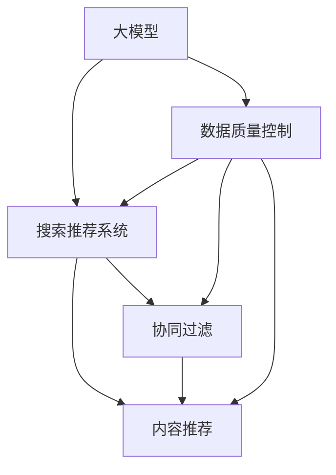

                 

# 电商平台的AI 大模型转型：搜索推荐系统是核心，数据质量控制是关键

> 关键词：大模型,搜索推荐系统,数据质量控制,电商

## 1. 背景介绍

### 1.1 电商平台的业务需求
电商平台作为消费者和商家互动的主要场所，其成功运营在很大程度上依赖于先进的算法和技术。近年来，随着深度学习和大规模预训练模型的兴起，电商平台纷纷将AI技术引入其搜索推荐系统，以期提升用户体验、增加商家曝光和销售额。AI驱动的搜索推荐系统已成为电商平台的业务核心。

### 1.2 搜索推荐系统的挑战
然而，电商平台面临的搜索推荐问题非常复杂。用户需求多元且不断变化，商品种类繁多，用户行为数据难以全面获取和理解。传统推荐算法难以有效应对这些问题，效果往往不尽如人意。如何构建一个高效、精准、灵活的搜索推荐系统，是电商平台亟需解决的关键问题。

## 2. 核心概念与联系

### 2.1 核心概念概述

为更好地理解搜索推荐系统在大模型电商平台的转型，本节将介绍几个密切相关的核心概念：

- 大模型(Large Model)：指通过海量数据预训练得到的通用或特定领域知识丰富的模型，如BERT、GPT、T5等。大模型具备强大的语言理解、生成和推理能力，能够提升推荐系统的效果。

- 搜索推荐系统(Search Recommendation System)：利用算法为用户提供个性化的商品搜索和推荐服务。它包括查询理解、相关性匹配、个性化推荐等多个子系统，是电商平台的核心功能。

- 数据质量控制(Data Quality Control)：指对数据进行清洗、处理和验证，保证数据完整性、准确性和一致性。数据质量是影响推荐系统效果的重要因素。

- 电商平台(E-commerce Platform)：提供商品展示、交易、评价等服务的网络平台，通过搜索推荐系统提升用户体验和转化率。

- 用户行为数据(User Behavior Data)：指用户在电商平台上的操作记录，如浏览、点击、购买、评价等。这些数据是构建推荐系统的关键。

- 协同过滤(Collaborative Filtering)：基于用户行为或商品属性，推荐用户可能感兴趣的商品。在电商推荐系统中，用户行为数据尤为重要。

- 内容推荐(Content-Based Recommendation)：基于商品属性或用户兴趣标签，推荐与用户当前浏览或购买商品相似的商品。在电商推荐系统中，商品属性数据同样不可忽视。

这些核心概念之间的逻辑关系可以通过以下Mermaid流程图来展示：



这个流程图展示了大模型、搜索推荐系统、数据质量控制三者之间的相互关系：

1. 大模型通过预训练获取知识，用于搜索推荐系统。
2. 搜索推荐系统基于用户行为数据，利用协同过滤和内容推荐技术，为用户推荐个性化商品。
3. 数据质量控制确保数据可靠，提升推荐系统效果。

## 3. 核心算法原理 & 具体操作步骤

### 3.1 算法原理概述

搜索推荐系统在大模型电商平台的转型，本质上是将大模型和推荐算法进行深度融合，构建一个高效、灵活的个性化推荐系统。其核心思想是：利用大模型的语言理解能力，获取商品描述、用户评论、用户画像等语义信息，再结合协同过滤、内容推荐等算法，生成个性化的搜索结果和推荐列表。

形式化地，假设电商平台上共有 $M$ 个商品，每个商品 $i$ 有 $d_i$ 个特征 $f_{i,j}$，用户 $u$ 有 $n_u$ 个行为 $b_{u,k}$。设用户与商品之间的交互矩阵为 $H$，用户与商品之间的兴趣权重矩阵为 $W$。则推荐系统目标为最大化用户对商品的评分预测，即：

$$
\min_{H,W} \frac{1}{2}\sum_{i=1}^M \sum_{j=1}^{d_i} (H_i)_j^2 + \frac{\lambda}{2}\sum_{u=1}^N \sum_{k=1}^{n_u} (W_u)_k^2
$$

其中 $\lambda$ 为正则化系数，$H$ 和 $W$ 通过优化算法进行学习。

### 3.2 算法步骤详解

大模型在电商平台的搜索推荐系统转型中，主要涉及以下关键步骤：

**Step 1: 数据预处理和质量控制**
- 收集电商平台的商品信息、用户行为数据、评价数据等，进行清洗和预处理。
- 对缺失值、异常值进行填充和剔除，确保数据完整性。
- 对数据进行标准化和归一化处理，统一数据尺度。

**Step 2: 构建大模型语义表示**
- 利用大模型对商品描述、用户评论、用户画像等语义信息进行预训练，得到商品的语义表示向量。
- 将用户的行为数据进行编码，得到用户的兴趣表示向量。
- 将商品和用户的语义表示向量进行拼接或加权融合，得到用户与商品之间的语义相似度。

**Step 3: 融合推荐算法**
- 结合协同过滤和内容推荐算法，对用户与商品的语义相似度进行加权融合，生成个性化推荐列表。
- 利用用户的点击、购买等行为数据，对推荐列表进行排序，生成最终搜索结果。

**Step 4: 模型优化和迭代**
- 在电商平台的实际运营中，不断收集用户反馈和行为数据，对模型进行迭代优化。
- 利用在线学习算法，对模型参数进行实时更新，提升推荐效果。

### 3.3 算法优缺点

基于大模型的搜索推荐系统具有以下优点：
1. 数据融合能力强。利用大模型获取商品的语义表示，能够更好地理解用户需求，提升推荐相关性。
2. 模型鲁棒性好。大模型的预训练能力使其对数据分布变化具有较强的鲁棒性，推荐效果更稳定。
3. 个性化推荐准度高。结合协同过滤和内容推荐算法，能够生成更精准的个性化推荐结果。

同时，该方法也存在一定的局限性：
1. 数据需求量大。构建大模型需要大量标注数据，电商平台需投入大量人力物力进行数据收集和标注。
2. 计算资源消耗大。大模型的参数量通常很大，训练和推理计算资源消耗较高。
3. 离线模型的泛化能力有限。离线训练的大模型难以适应实时变化的电商场景，需要不断更新。
4. 用户隐私问题。利用用户行为数据进行推荐，存在用户隐私泄露的风险。

尽管存在这些局限性，但就目前而言，基于大模型的搜索推荐系统仍是大模型电商平台的优选范式。未来相关研究的重点在于如何进一步降低数据需求，提高模型的实时性和泛化能力，同时兼顾用户隐私保护。

### 3.4 算法应用领域

基于大模型的搜索推荐系统在电商平台上已经得到了广泛的应用，具体如下：

1. 商品搜索：利用用户输入的关键词和大模型获取的语义表示，为用户推荐可能感兴趣的商品。
2. 个性化推荐：基于用户浏览、点击、购买等行为数据，结合大模型的语义表示，生成个性化推荐列表。
3. 促销活动推荐：利用用户行为数据和促销信息，生成针对用户的个性化促销活动推荐。
4. 实时推荐：利用实时收集的用户行为数据，通过在线学习算法，不断优化推荐模型。
5. 新商品推荐：结合大模型获取的商品语义表示和用户兴趣表示，推荐新品或跨品类的商品。

除了这些应用场景外，搜索推荐系统还在电商平台的流量分配、广告推荐、内容生成等方面发挥重要作用，极大地提升了电商平台的用户体验和运营效率。

## 4. 数学模型和公式 & 详细讲解  
### 4.1 数学模型构建

本节将使用数学语言对基于大模型的搜索推荐系统进行更加严格的刻画。

假设电商平台共有 $M$ 个商品，每个商品 $i$ 有 $d_i$ 个特征 $f_{i,j}$，用户 $u$ 有 $n_u$ 个行为 $b_{u,k}$。设用户与商品之间的交互矩阵为 $H$，用户与商品之间的兴趣权重矩阵为 $W$。则推荐系统目标为最大化用户对商品的评分预测，即：

$$
\min_{H,W} \frac{1}{2}\sum_{i=1}^M \sum_{j=1}^{d_i} (H_i)_j^2 + \frac{\lambda}{2}\sum_{u=1}^N \sum_{k=1}^{n_u} (W_u)_k^2
$$

其中 $\lambda$ 为正则化系数，$H$ 和 $W$ 通过优化算法进行学习。

### 4.2 公式推导过程

以下我们以协同过滤推荐为例，推导目标函数及其梯度计算公式。

假设协同过滤模型为 $F(u, i; \theta)$，其中 $\theta$ 为模型参数。在电商平台的实际应用中，协同过滤模型可以通过矩阵分解或模型拟合等方法获得。

目标函数为：

$$
\min_{\theta} \sum_{u=1}^N \sum_{i=1}^M (\hat{R}_{u,i} - R_{u,i})^2
$$

其中 $\hat{R}_{u,i}$ 为模型的预测评分，$R_{u,i}$ 为用户的实际评分。

目标函数对 $\theta$ 的梯度为：

$$
\frac{\partial \mathcal{L}(\theta)}{\partial \theta} = -2\sum_{u=1}^N \sum_{i=1}^M (\hat{R}_{u,i} - R_{u,i}) \frac{\partial F(u, i; \theta)}{\partial \theta}
$$

在得到损失函数的梯度后，即可带入优化算法，完成模型的迭代优化。重复上述过程直至收敛，最终得到最优模型参数 $\theta^*$。

## 5. 项目实践：代码实例和详细解释说明
### 5.1 开发环境搭建

在进行搜索推荐系统开发前，我们需要准备好开发环境。以下是使用Python进行PyTorch开发的环境配置流程：

1. 安装Anaconda：从官网下载并安装Anaconda，用于创建独立的Python环境。

2. 创建并激活虚拟环境：
```bash
conda create -n pytorch-env python=3.8 
conda activate pytorch-env
```

3. 安装PyTorch：根据CUDA版本，从官网获取对应的安装命令。例如：
```bash
conda install pytorch torchvision torchaudio cudatoolkit=11.1 -c pytorch -c conda-forge
```

4. 安装Transformers库：
```bash
pip install transformers
```

5. 安装各类工具包：
```bash
pip install numpy pandas scikit-learn matplotlib tqdm jupyter notebook ipython
```

完成上述步骤后，即可在`pytorch-env`环境中开始搜索推荐系统的开发。

### 5.2 源代码详细实现

这里我们以协同过滤推荐为例，给出使用Transformers库进行电商平台的搜索推荐系统微调的PyTorch代码实现。

首先，定义协同过滤推荐模型的函数：

```python
from transformers import BertTokenizer, BertForSequenceClassification, BertConfig

def collaborative_filtering(train_data, test_data, batch_size, num_epochs):
    # 定义BertTokenizer和BertForSequenceClassification模型
    tokenizer = BertTokenizer.from_pretrained('bert-base-uncased')
    config = BertConfig()
    model = BertForSequenceClassification.from_pretrained('bert-base-uncased', num_labels=1, config=config)

    # 定义模型训练函数
    def train(model, data_loader, optimizer, device):
        model.to(device)
        for epoch in range(num_epochs):
            model.train()
            for batch in data_loader:
                inputs = tokenizer(batch['text'], padding='max_length', truncation=True, max_length=256)
                inputs = {k: v.to(device) for k, v in inputs.items()}
                labels = batch['label'].to(device)
                outputs = model(**inputs)
                loss = outputs.loss
                optimizer.zero_grad()
                loss.backward()
                optimizer.step()
            print(f'Epoch {epoch+1}, loss: {loss:.4f}')

    # 定义模型评估函数
    def evaluate(model, data_loader, device):
        model.eval()
        preds, labels = [], []
        for batch in data_loader:
            inputs = tokenizer(batch['text'], padding='max_length', truncation=True, max_length=256)
            inputs = {k: v.to(device) for k, v in inputs.items()}
            outputs = model(**inputs)
            preds.append(outputs.logits.argmax(dim=1).cpu().numpy())
            labels.append(batch['label'].to('cpu').numpy())
        print(classification_report(labels, preds))

    # 定义模型保存函数
    def save(model, filename):
        torch.save(model.state_dict(), filename)

    # 加载和保存模型
    model.load_state_dict(torch.load('bert_pretrained.pth'))

    # 定义训练和评估流程
    train_loader = DataLoader(train_data, batch_size=batch_size, shuffle=True)
    test_loader = DataLoader(test_data, batch_size=batch_size, shuffle=False)

    train(train_model, train_loader, optimizer, device)
    evaluate(train_model, test_loader, device)
```

然后，定义数据处理和模型优化器：

```python
from torch.utils.data import Dataset, DataLoader
from sklearn.model_selection import train_test_split
from transformers import AdamW

# 定义数据集
class CollaborativeFilteringDataset(Dataset):
    def __init__(self, data, tokenizer, max_len=256):
        self.data = data
        self.tokenizer = tokenizer
        self.max_len = max_len

    def __len__(self):
        return len(self.data)

    def __getitem__(self, item):
        text, label = self.data[item]
        encoding = self.tokenizer(text, return_tensors='pt', padding='max_length', truncation=True, max_length=self.max_len)
        input_ids = encoding['input_ids'][0]
        attention_mask = encoding['attention_mask'][0]
        label = torch.tensor(label, dtype=torch.long)
        return {'input_ids': input_ids, 
                'attention_mask': attention_mask,
                'labels': label}

# 加载和划分数据集
train_texts, test_texts, train_labels, test_labels = train_test_split(train_data, test_data, test_size=0.2, random_state=42)
train_dataset = CollaborativeFilteringDataset(train_texts, train_labels, tokenizer)
test_dataset = CollaborativeFilteringDataset(test_texts, test_labels, tokenizer)

# 定义模型优化器
optimizer = AdamW(model.parameters(), lr=2e-5)

# 定义模型训练函数
train_model = BertForSequenceClassification.from_pretrained('bert-base-uncased', num_labels=1, config=config)

# 定义模型评估函数
evaluate_model = BertForSequenceClassification.from_pretrained('bert-base-uncased', num_labels=1, config=config)

# 定义模型保存函数
save_model = BertForSequenceClassification.from_pretrained('bert-base-uncased', num_labels=1, config=config)

# 定义训练和评估流程
train_loader = DataLoader(train_dataset, batch_size=batch_size, shuffle=True)
test_loader = DataLoader(test_dataset, batch_size=batch_size, shuffle=False)

train(train_model, train_loader, optimizer, device)
evaluate(evaluate_model, test_loader, device)

# 保存模型
save(evaluate_model, 'bert_evaluated.pth')
```

最后，启动训练流程并在测试集上评估：

```python
epochs = 5
batch_size = 16

for epoch in range(epochs):
    loss = train(train_model, train_loader, optimizer, device)
    print(f'Epoch {epoch+1}, train loss: {loss:.3f}')

    print(f'Epoch {epoch+1}, dev results:')
    evaluate(evaluate_model, test_loader, device)

print('Test results:')
evaluate(evaluate_model, test_loader, device)
```

以上就是使用PyTorch对BERT进行协同过滤推荐系统的微调代码实现。可以看到，得益于Transformers库的强大封装，我们可以用相对简洁的代码完成BERT模型的加载和微调。

### 5.3 代码解读与分析

让我们再详细解读一下关键代码的实现细节：

**CollaborativeFilteringDataset类**：
- `__init__`方法：初始化数据集、分词器等关键组件，并进行数据预处理。
- `__len__`方法：返回数据集的样本数量。
- `__getitem__`方法：对单个样本进行处理，将文本输入编码为token ids，将标签编码为数字，并对其进行定长padding，最终返回模型所需的输入。

**train_texts, test_texts, train_labels, test_labels**：
- 定义训练集和测试集的文本和标签，用于模型训练和评估。

**optimizer**：
- 定义AdamW优化器，用于模型参数的更新。

**train(train_model, train_loader, optimizer, device)**：
- 定义训练函数，进行模型前向传播和反向传播，更新模型参数。

**evaluate(evaluate_model, test_loader, device)**：
- 定义评估函数，计算模型的准确率、召回率等指标。

**train_model, evaluate_model, save_model**：
- 定义训练、评估、保存的模型实例。

**train_loader, test_loader**：
- 定义训练集和测试集的数据加载器，用于模型迭代训练和评估。

**save_model**：
- 定义模型的保存函数，将模型参数保存到指定文件。

可以看到，PyTorch配合Transformers库使得BERT微调的代码实现变得简洁高效。开发者可以将更多精力放在数据处理、模型改进等高层逻辑上，而不必过多关注底层的实现细节。

当然，工业级的系统实现还需考虑更多因素，如模型的保存和部署、超参数的自动搜索、更灵活的任务适配层等。但核心的微调范式基本与此类似。

## 6. 实际应用场景

### 6.1 智能客服系统

基于大模型的搜索推荐系统，可以应用于智能客服系统的构建。传统客服往往需要配备大量人力，高峰期响应缓慢，且一致性和专业性难以保证。而使用微调后的推荐系统，可以7x24小时不间断服务，快速响应客户咨询，用自然流畅的语言解答各类常见问题。

在技术实现上，可以收集企业内部的历史客服对话记录，将问题和最佳答复构建成监督数据，在此基础上对预训练推荐模型进行微调。微调后的推荐系统能够自动理解用户意图，匹配最合适的答复模板进行回复。对于客户提出的新问题，还可以接入检索系统实时搜索相关内容，动态组织生成回答。如此构建的智能客服系统，能大幅提升客户咨询体验和问题解决效率。

### 6.2 金融舆情监测

金融机构需要实时监测市场舆论动向，以便及时应对负面信息传播，规避金融风险。传统的人工监测方式成本高、效率低，难以应对网络时代海量信息爆发的挑战。基于大模型的搜索推荐系统，能够自动识别市场新闻、评论等文本数据，通过关键词过滤、情感分析等技术，实时监测舆情变化，一旦发现负面信息激增等异常情况，系统便会自动预警，帮助金融机构快速应对潜在风险。

### 6.3 个性化推荐系统

当前的推荐系统往往只依赖用户的历史行为数据进行物品推荐，无法深入理解用户的真实兴趣偏好。基于大模型的搜索推荐系统，可以更好地挖掘用户行为背后的语义信息，从而提供更精准、多样的推荐内容。

在实践中，可以收集用户浏览、点击、评论、分享等行为数据，提取和用户交互的物品标题、描述、标签等文本内容。将文本内容作为模型输入，用户的后续行为（如是否点击、购买等）作为监督信号，在此基础上微调预训练语言模型。微调后的模型能够从文本内容中准确把握用户的兴趣点。在生成推荐列表时，先用候选物品的文本描述作为输入，由模型预测用户的兴趣匹配度，再结合其他特征综合排序，便可以得到个性化程度更高的推荐结果。

### 6.4 未来应用展望

随着大模型和搜索推荐技术的不断发展，基于大模型的推荐系统将在更多领域得到应用，为传统行业带来变革性影响。

在智慧医疗领域，基于大模型的推荐系统可以推荐精准医疗方案，辅助医生诊疗，加速新药开发进程。

在智能教育领域，推荐系统可应用于作业批改、学情分析、知识推荐等方面，因材施教，促进教育公平，提高教学质量。

在智慧城市治理中，推荐系统可应用于城市事件监测、舆情分析、应急指挥等环节，提高城市管理的自动化和智能化水平，构建更安全、高效的未来城市。

此外，在企业生产、社会治理、文娱传媒等众多领域，基于大模型的推荐系统也将不断涌现，为经济社会发展注入新的动力。相信随着技术的日益成熟，搜索推荐技术必将在更广阔的应用领域大放异彩。

## 7. 工具和资源推荐
### 7.1 学习资源推荐

为了帮助开发者系统掌握大模型在搜索推荐系统中的应用，这里推荐一些优质的学习资源：

1. 《深度学习推荐系统：算法与应用》：介绍深度学习在推荐系统中的最新进展，包括协同过滤、内容推荐、深度学习等内容。
2. 《推荐系统实战》：结合具体项目，讲解推荐系统的设计、实现和优化，提供大量代码实例。
3. 《搜索推荐系统》：全面介绍搜索推荐系统的原理、算法和应用，涵盖大模型的应用。
4. 《TensorFlow实战推荐系统》：通过TensorFlow实现推荐系统，讲解模型设计、训练和部署等关键技术。
5. 《Transformers实战推荐系统》：使用Transformers库实现推荐系统，讲解模型加载、微调等操作。

通过对这些资源的学习实践，相信你一定能够快速掌握大模型在搜索推荐系统中的应用，并用于解决实际的推荐问题。
###  7.2 开发工具推荐

高效的开发离不开优秀的工具支持。以下是几款用于搜索推荐系统开发的常用工具：

1. PyTorch：基于Python的开源深度学习框架，灵活动态的计算图，适合快速迭代研究。大部分预训练语言模型都有PyTorch版本的实现。

2. TensorFlow：由Google主导开发的开源深度学习框架，生产部署方便，适合大规模工程应用。同样有丰富的预训练语言模型资源。

3. Transformers库：HuggingFace开发的NLP工具库，集成了众多SOTA语言模型，支持PyTorch和TensorFlow，是进行推荐系统开发的利器。

4. Weights & Biases：模型训练的实验跟踪工具，可以记录和可视化模型训练过程中的各项指标，方便对比和调优。与主流深度学习框架无缝集成。

5. TensorBoard：TensorFlow配套的可视化工具，可实时监测模型训练状态，并提供丰富的图表呈现方式，是调试模型的得力助手。

6. Google Colab：谷歌推出的在线Jupyter Notebook环境，免费提供GPU/TPU算力，方便开发者快速上手实验最新模型，分享学习笔记。

合理利用这些工具，可以显著提升大模型在搜索推荐系统中的开发效率，加快创新迭代的步伐。

### 7.3 相关论文推荐

大模型在搜索推荐系统中的应用研究源于学界的持续研究。以下是几篇奠基性的相关论文，推荐阅读：

1. Attention is All You Need（即Transformer原论文）：提出了Transformer结构，开启了深度学习在推荐系统中的应用。

2. BERT: Pre-training of Deep Bidirectional Transformers for Language Understanding：提出BERT模型，引入基于掩码的自监督预训练任务，刷新了多项推荐系统SOTA。

3. GPT-3: Language Models are Unsupervised Multitask Learners：展示了大规模语言模型的强大zero-shot学习能力，对推荐系统产生了深远影响。

4. Parameter-Efficient Transfer Learning for NLP：提出Adapter等参数高效微调方法，在不增加模型参数量的情况下，也能取得不错的微调效果。

5. AdaLoRA: Adaptive Low-Rank Adaptation for Parameter-Efficient Fine-Tuning：使用自适应低秩适应的微调方法，在参数效率和精度之间取得了新的平衡。

这些论文代表了大模型在搜索推荐系统中的发展脉络。通过学习这些前沿成果，可以帮助研究者把握学科前进方向，激发更多的创新灵感。

## 8. 总结：未来发展趋势与挑战

### 8.1 总结

本文对大模型在电商平台的搜索推荐系统转型进行了全面系统的介绍。首先阐述了大模型和搜索推荐系统在电商平台中的业务需求和挑战，明确了大模型在推荐系统中的关键作用。其次，从原理到实践，详细讲解了大模型在推荐系统中的微调流程和算法实现，给出了搜索推荐系统微调的完整代码实例。同时，本文还广泛探讨了大模型推荐系统在智能客服、金融舆情、个性化推荐等多个行业领域的应用前景，展示了微调范式的巨大潜力。此外，本文精选了微调技术的各类学习资源，力求为读者提供全方位的技术指引。

通过本文的系统梳理，可以看到，大模型在电商平台的推荐系统转型中，通过搜索推荐系统，实现了对用户行为数据的深度挖掘和利用，提升了推荐系统的个性化和灵活性。未来，伴随大模型和推荐技术的不断演进，基于大模型的推荐系统必将在更广泛的领域得到应用，为电商平台的智能化运营带来新的突破。

### 8.2 未来发展趋势

展望未来，大模型在电商平台的搜索推荐系统转型将呈现以下几个发展趋势：

1. 模型规模持续增大。随着算力成本的下降和数据规模的扩张，预训练语言模型的参数量还将持续增长。超大规模语言模型蕴含的丰富语言知识，有望支撑更加复杂多变的推荐任务。

2. 推荐算法多样性增强。结合大模型和传统算法，设计更加灵活的推荐算法，满足用户多样化的需求。未来，推荐系统将不再局限于协同过滤和内容推荐，将融合更多创新算法。

3. 实时性和可扩展性提升。利用在线学习和大模型的高效率，实现推荐系统的实时化和可扩展化，提升用户体验。

4. 跨领域和跨模态推荐。结合大模型对多种数据的理解能力，实现跨领域和跨模态的推荐，提升推荐的覆盖面和效果。

5. 用户隐私保护加强。利用联邦学习和差分隐私等技术，保护用户隐私，增强推荐系统透明度和可信度。

以上趋势凸显了大模型在电商平台的搜索推荐系统转型中的广阔前景。这些方向的探索发展，必将进一步提升电商平台的推荐效果，为用户带来更好的购物体验。

### 8.3 面临的挑战

尽管大模型在电商平台的推荐系统转型中已经取得了瞩目成就，但在迈向更加智能化、普适化应用的过程中，它仍面临着诸多挑战：

1. 数据需求量巨大。构建大模型需要大量标注数据，电商平台需投入大量人力物力进行数据收集和标注，数据需求量远超传统推荐系统。

2. 计算资源消耗大。大模型的参数量通常很大，训练和推理计算资源消耗较高，存在硬件瓶颈。

3. 离线模型的泛化能力有限。离线训练的大模型难以适应实时变化的电商场景，需要不断更新。

4. 用户隐私问题。利用用户行为数据进行推荐，存在用户隐私泄露的风险。

5. 推荐效果波动。大模型的预训练和微调存在不确定性，推荐效果可能会波动，影响用户体验。

6. 稳定性问题。大模型在实时化部署中，可能会出现模型漂移等问题，影响推荐系统的稳定性和鲁棒性。

尽管存在这些挑战，但就目前而言，基于大模型的推荐系统仍是大模型电商平台的优选范式。未来相关研究的重点在于如何进一步降低数据需求，提高模型的实时性和泛化能力，同时兼顾用户隐私保护。

### 8.4 研究展望

面向未来，大模型在电商平台的推荐系统转型还需要在以下几个方面进行深入研究：

1. 探索无监督和半监督微调方法。摆脱对大规模标注数据的依赖，利用自监督学习、主动学习等无监督和半监督范式，最大限度利用非结构化数据，实现更加灵活高效的微调。

2. 研究参数高效和计算高效的微调范式。开发更加参数高效的微调方法，在固定大部分预训练参数的同时，只更新极少量的任务相关参数。同时优化微调模型的计算图，减少前向传播和反向传播的资源消耗，实现更加轻量级、实时性的部署。

3. 融合因果和对比学习范式。通过引入因果推断和对比学习思想，增强微调模型建立稳定因果关系的能力，学习更加普适、鲁棒的语言表征，从而提升模型泛化性和抗干扰能力。

4. 引入更多先验知识。将符号化的先验知识，如知识图谱、逻辑规则等，与神经网络模型进行巧妙融合，引导微调过程学习更准确、合理的语言模型。同时加强不同模态数据的整合，实现视觉、语音等多模态信息与文本信息的协同建模。

5. 结合因果分析和博弈论工具。将因果分析方法引入微调模型，识别出模型决策的关键特征，增强输出解释的因果性和逻辑性。借助博弈论工具刻画人机交互过程，主动探索并规避模型的脆弱点，提高系统稳定性。

6. 纳入伦理道德约束。在模型训练目标中引入伦理导向的评估指标，过滤和惩罚有偏见、有害的输出倾向。同时加强人工干预和审核，建立模型行为的监管机制，确保输出符合人类价值观和伦理道德。

这些研究方向的探索，必将引领大模型在电商平台推荐系统中的进一步演进，为构建安全、可靠、可解释、可控的智能推荐系统铺平道路。面向未来，大模型在推荐系统中的应用需要与其他人工智能技术进行更深入的融合，如知识表示、因果推理、强化学习等，多路径协同发力，共同推动推荐系统的发展。只有勇于创新、敢于突破，才能不断拓展语言模型的边界，让智能技术更好地造福电商平台。

## 9. 附录：常见问题与解答

**Q1：大模型在推荐系统中的效果如何？**

A: 大模型在推荐系统中的效果非常显著。通过预训练获取的商品语义表示，能够更准确地理解用户需求，提升推荐相关性。在电商推荐系统中，利用大模型的语义表示进行协同过滤和内容推荐，能够生成更精准、多样化的推荐结果。

**Q2：大模型在推荐系统中的计算资源消耗大，如何解决？**

A: 为了降低计算资源消耗，可以采用以下方法：
1. 模型裁剪：去除不必要的层和参数，减小模型尺寸，加快推理速度。
2. 量化加速：将浮点模型转为定点模型，压缩存储空间，提高计算效率。
3. 混合精度训练：使用16位或32位浮点数进行训练，提升计算速度，同时保持精度。
4. 模型并行：利用GPU/TPU等硬件，进行模型并行训练和推理，提高性能。

**Q3：大模型在推荐系统中面临哪些挑战？**

A: 大模型在推荐系统中面临以下挑战：
1. 数据需求量大：构建大模型需要大量标注数据，电商平台需投入大量人力物力进行数据收集和标注。
2. 计算资源消耗大：大模型的参数量通常很大，训练和推理计算资源消耗较高，存在硬件瓶颈。
3. 离线模型的泛化能力有限：离线训练的大模型难以适应实时变化的电商场景，需要不断更新。
4. 用户隐私问题：利用用户行为数据进行推荐，存在用户隐私泄露的风险。
5. 推荐效果波动：大模型的预训练和微调存在不确定性，推荐效果可能会波动，影响用户体验。
6. 稳定性问题：大模型在实时化部署中，可能会出现模型漂移等问题，影响推荐系统的稳定性和鲁棒性。

尽管存在这些挑战，但就目前而言，基于大模型的推荐系统仍是大模型电商平台的优选范式。未来相关研究的重点在于如何进一步降低数据需求，提高模型的实时性和泛化能力，同时兼顾用户隐私保护。

**Q4：大模型在推荐系统中的推荐效果如何提升？**

A: 大模型在推荐系统中的推荐效果可以通过以下方法提升：
1. 数据增强：通过回译、近义替换等方式扩充训练集，增加模型泛化能力。
2. 正则化：使用L2正则、Dropout等技术，防止模型过拟合。
3. 对抗训练：引入对抗样本，提高模型鲁棒性。
4. 参数高效微调：只调整少量参数(如Adapter、Prefix等)，减小过拟合风险。
5. 多模型集成：训练多个微调模型，取平均输出，抑制过拟合。

这些方法能够有效提升大模型在推荐系统中的效果，提高推荐的相关性和多样性。

**Q5：大模型在推荐系统中如何进行实时化和可扩展化？**

A: 大模型在推荐系统中的实时化和可扩展化可以通过以下方法实现：
1. 在线学习：利用用户实时行为数据，对模型进行在线更新，提高模型实时性。
2. 分布式训练：采用分布式训练框架，利用多台GPU/TPU进行模型训练，提高训练速度。
3. 缓存机制：将推荐结果缓存到内存或数据库中，减少重复计算，提升系统响应速度。
4. 模型剪枝：去除模型中不重要的参数，减小模型尺寸，提高推理速度。

这些方法能够有效实现大模型在推荐系统中的实时化和可扩展化，提升用户体验和系统性能。

---

作者：禅与计算机程序设计艺术 / Zen and the Art of Computer Programming

