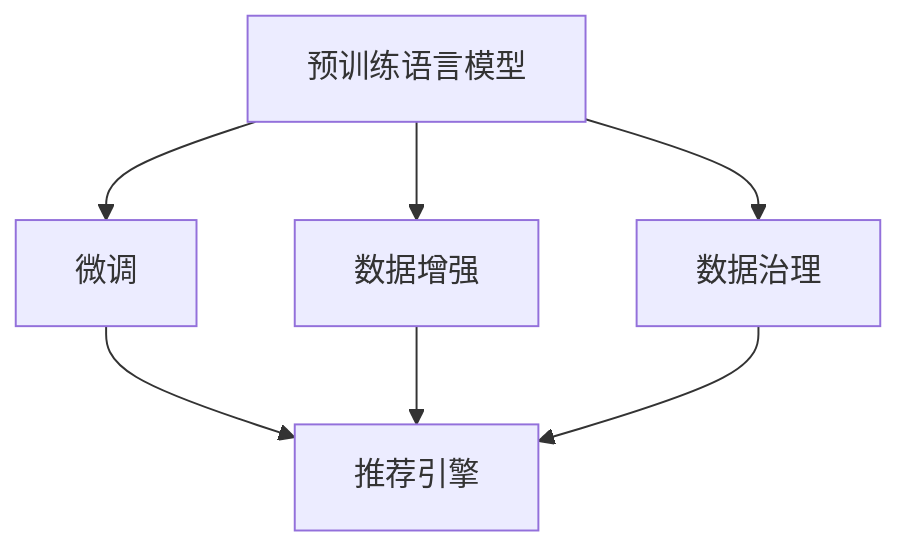

                 

# 电商平台的AI 大模型转型：搜索推荐系统是核心，数据质量是关键

> 关键词：人工智能, 电商平台, 大模型, 搜索推荐系统, 数据质量, 数据增强, 数据治理, 深度学习, 自然语言处理, 机器学习

## 1. 背景介绍

### 1.1 问题由来
随着电商平台的迅猛发展，用户对购物体验的要求越来越高，个性化推荐系统逐渐成为电商技术升级的核心驱动力。传统的推荐算法以用户行为数据为基础，具有准确性高、扩展性好等优点，但在处理长尾商品和新兴用户需求方面存在局限。而大模型技术的引入，有望将推荐系统的能力提升到一个新的高度。

基于预训练语言模型的大模型推荐技术，通过在大规模无标签文本数据上预训练，然后利用用户行为数据进行微调，生成个性化的推荐结果。相比于传统推荐算法，大模型推荐系统具有更强的泛化能力和适应性，能够更好地处理稀疏数据和复杂的用户需求。

### 1.2 问题核心关键点
大模型推荐系统的核心关键点在于：
- **搜索推荐系统**：利用深度学习模型处理搜索和推荐两个关键环节，提升用户体验和满意度。
- **数据质量**：高质量的数据是模型性能的保障，数据的准确性、多样性和时效性将直接影响模型效果。
- **模型微调**：在预训练语言模型基础上，通过微调优化模型，使其适应电商平台的特定需求。
- **数据增强**：利用数据增强技术提升模型的泛化能力，更好地适应多样化的用户行为。
- **数据治理**：通过数据治理手段，确保数据合规性，提高数据质量。

本文将深入探讨这些关键问题，系统地介绍大模型推荐系统的实现方法和优化策略。

## 2. 核心概念与联系

### 2.1 核心概念概述

为了更好地理解大模型推荐系统，首先需要明确几个核心概念：

- **大模型推荐系统**：基于深度学习的大规模预训练语言模型，通过微调生成的推荐系统。
- **预训练语言模型**：如BERT、GPT等，在大规模无标签文本数据上进行自监督预训练，学习通用的语言表示。
- **微调**：在预训练模型的基础上，使用用户行为数据进行有监督优化，适应特定电商平台的推荐需求。
- **数据增强**：通过数据扩充、数据合成等方式提升模型的泛化能力，更好地适应实际应用场景。
- **数据治理**：通过数据清洗、去重、加密等手段，确保数据的质量和安全性。

这些概念之间的逻辑关系可以通过以下Mermaid流程图来展示：



这个流程图展示了大模型推荐系统的核心概念及其之间的关系：

1. 预训练语言模型在大规模无标签文本数据上进行自监督预训练，学习通用的语言表示。
2. 微调在预训练模型的基础上，使用用户行为数据进行有监督优化，适应特定电商平台的推荐需求。
3. 数据增强通过数据扩充、数据合成等方式提升模型的泛化能力，更好地适应实际应用场景。
4. 数据治理通过数据清洗、去重、加密等手段，确保数据的质量和安全性。

这些概念共同构成了大模型推荐系统的学习和应用框架，使其能够在电商平台上高效运行，为用户提供个性化的购物体验。

## 3. 核心算法原理 & 具体操作步骤
### 3.1 算法原理概述

大模型推荐系统通过预训练语言模型的能力，利用用户行为数据进行微调，生成个性化的推荐结果。其核心思想是：将预训练的语言模型视作一个强大的"特征提取器"，通过微调优化模型，使其适应电商平台的特定需求。

形式化地，假设预训练语言模型为 $M_{\theta}$，其中 $\theta$ 为预训练得到的模型参数。给定电商平台的用户行为数据集 $D=\{(x_i,y_i)\}_{i=1}^N$，微调的目标是找到新的模型参数 $\hat{\theta}$，使得：

$$
\hat{\theta}=\mathop{\arg\min}_{\theta} \mathcal{L}(M_{\theta},D)
$$

其中 $\mathcal{L}$ 为针对电商平台推荐任务设计的损失函数，用于衡量模型预测输出与真实标签之间的差异。常见的损失函数包括交叉熵损失、均方误差损失等。

通过梯度下降等优化算法，微调过程不断更新模型参数 $\theta$，最小化损失函数 $\mathcal{L}$，使得模型输出逼近真实标签。由于 $\theta$ 已经通过预训练获得了较好的初始化，因此即便在用户行为数据集 $D$ 上进行微调，也能较快收敛到理想的模型参数 $\hat{\theta}$。

### 3.2 算法步骤详解

大模型推荐系统的实现主要包括以下几个关键步骤：

**Step 1: 准备预训练模型和数据集**
- 选择合适的预训练语言模型 $M_{\theta}$ 作为初始化参数，如 BERT、GPT等。
- 准备电商平台的用户行为数据集 $D$，包括用户的浏览记录、购买历史、评分反馈等。

**Step 2: 添加推荐层**
- 根据电商平台的推荐需求，在预训练模型顶层设计合适的推荐层和损失函数。
- 对于推荐任务，通常使用交叉熵损失函数。
- 推荐层可以采用点积、全连接、注意力机制等，根据任务特点进行选择。

**Step 3: 设置微调超参数**
- 选择合适的优化算法及其参数，如 AdamW、SGD 等，设置学习率、批大小、迭代轮数等。
- 设置正则化技术及强度，包括权重衰减、Dropout、Early Stopping等。
- 确定冻结预训练参数的策略，如仅微调顶层，或全部参数都参与微调。

**Step 4: 执行梯度训练**
- 将用户行为数据分批次输入模型，前向传播计算损失函数。
- 反向传播计算参数梯度，根据设定的优化算法和学习率更新模型参数。
- 周期性在验证集上评估模型性能，根据性能指标决定是否触发 Early Stopping。
- 重复上述步骤直到满足预设的迭代轮数或 Early Stopping 条件。

**Step 5: 测试和部署**
- 在测试集上评估微调后模型 $M_{\hat{\theta}}$ 的性能，对比微调前后的精度提升。
- 使用微调后的模型对新样本进行推理预测，集成到实际的应用系统中。
- 持续收集新的用户行为数据，定期重新微调模型，以适应数据分布的变化。

以上是基于深度学习的大模型推荐系统的基本流程。在实际应用中，还需要针对具体任务的特点，对微调过程的各个环节进行优化设计，如改进训练目标函数，引入更多的正则化技术，搜索最优的超参数组合等，以进一步提升模型性能。

### 3.3 算法优缺点

大模型推荐系统具有以下优点：
1. 精确性高。通过深度学习模型，能够充分利用用户行为数据，生成高质量的推荐结果。
2. 扩展性好。大规模预训练语言模型可以适应多种推荐场景，具有良好的泛化能力。
3. 用户满意度高。通过个性化推荐，能够满足用户的多样化需求，提升购物体验。

同时，该方法也存在一定的局限性：
1. 数据需求高。大规模的预训练和微调需要大量的高质量数据，数据获取成本高。
2. 计算资源消耗大。大规模模型的计算量较大，需要高性能计算资源支持。
3. 模型复杂度大。大规模模型的结构复杂，不易调试和优化。
4. 数据隐私问题。电商平台的用户行为数据涉及隐私，需要采取有效措施保护数据安全。

尽管存在这些局限性，但就目前而言，基于深度学习的大模型推荐方法仍然是电商平台推荐技术的主流范式。未来相关研究的重点在于如何进一步降低数据需求，提高模型的推理效率，同时兼顾数据隐私和安全等因素。

### 3.4 算法应用领域

大模型推荐系统已经在电商平台的搜索推荐等众多场景中得到了广泛应用，具体包括：

- **搜索推荐系统**：利用预训练语言模型处理用户搜索行为，生成个性化推荐结果。通过微调优化模型，更好地适应平台特定需求。
- **商品匹配系统**：根据用户行为数据，匹配最合适的商品，提升用户购物体验。
- **内容推荐系统**：推荐商品之外，也可以推荐其他内容，如文章、视频等。
- **个性化广告系统**：根据用户行为数据，推荐个性化的广告内容，提高广告效果。
- **库存管理**：通过推荐系统预测热门商品，优化库存管理，减少库存积压。

除了这些经典应用外，大模型推荐技术还被创新性地应用于个性化营销、用户画像生成、智能客服等多个领域，为电商平台带来了新的商业价值。

## 4. 数学模型和公式 & 详细讲解  
### 4.1 数学模型构建

本节将使用数学语言对大模型推荐系统的微调过程进行更加严格的刻画。

记预训练语言模型为 $M_{\theta}$，其中 $\theta$ 为预训练得到的模型参数。假设电商平台的用户行为数据集为 $D=\{(x_i,y_i)\}_{i=1}^N, x_i \in \mathcal{X}, y_i \in \mathcal{Y}$，其中 $\mathcal{X}$ 为输入空间，$\mathcal{Y}$ 为输出空间。

定义模型 $M_{\theta}$ 在输入 $x$ 上的输出为 $\hat{y}=M_{\theta}(x)$，表示模型预测结果。真实标签 $y \in \{1,0\}$，表示用户是否点击了推荐结果。

推荐任务的目标是最小化预测错误率，即：

$$
\min_{\theta} \frac{1}{N}\sum_{i=1}^N \ell(\hat{y}_i, y_i)
$$

其中 $\ell$ 为预测错误率的损失函数，通常采用二元交叉熵损失函数：

$$
\ell(\hat{y}_i, y_i) = -y_i\log\hat{y}_i - (1-y_i)\log(1-\hat{y}_i)
$$

在模型微调过程中，我们将用户行为数据集 $D$ 分成训练集、验证集和测试集，分别用于模型训练、验证和测试。训练集用于模型的优化，验证集用于超参数调优，测试集用于评估模型性能。

### 4.2 公式推导过程

以下我们以推荐任务为例，推导交叉熵损失函数及其梯度的计算公式。

假设模型 $M_{\theta}$ 在输入 $x_i$ 上的输出为 $\hat{y}_i=M_{\theta}(x_i)$，表示模型预测用户点击的概率。真实标签 $y_i \in \{1,0\}$。则二分类交叉熵损失函数定义为：

$$
\ell(\hat{y}_i, y_i) = -y_i\log\hat{y}_i - (1-y_i)\log(1-\hat{y}_i)
$$

将其代入经验风险公式，得：

$$
\mathcal{L}(\theta) = -\frac{1}{N}\sum_{i=1}^N [y_i\log \hat{y}_i + (1-y_i)\log(1-\hat{y}_i)]
$$

根据链式法则，损失函数对参数 $\theta_k$ 的梯度为：

$$
\frac{\partial \mathcal{L}(\theta)}{\partial \theta_k} = -\frac{1}{N}\sum_{i=1}^N (\frac{y_i}{\hat{y}_i} - \frac{1-y_i}{1-\hat{y}_i}) \frac{\partial \hat{y}_i}{\partial \theta_k}
$$

其中 $\frac{\partial \hat{y}_i}{\partial \theta_k}$ 可进一步递归展开，利用自动微分技术完成计算。

在得到损失函数的梯度后，即可带入参数更新公式，完成模型的迭代优化。重复上述过程直至收敛，最终得到适应电商平台推荐任务的最优模型参数 $\theta^*$。

## 5. 项目实践：代码实例和详细解释说明
### 5.1 开发环境搭建

在进行大模型推荐系统开发前，我们需要准备好开发环境。以下是使用Python进行TensorFlow开发的环境配置流程：

1. 安装Anaconda：从官网下载并安装Anaconda，用于创建独立的Python环境。

2. 创建并激活虚拟环境：
```bash
conda create -n tensorflow-env python=3.8 
conda activate tensorflow-env
```

3. 安装TensorFlow：根据CUDA版本，从官网获取对应的安装命令。例如：
```bash
conda install tensorflow -c tf -c conda-forge
```

4. 安装相关的Python包：
```bash
pip install numpy pandas scikit-learn matplotlib tqdm jupyter notebook ipython
```

完成上述步骤后，即可在`tensorflow-env`环境中开始推荐系统开发。

### 5.2 源代码详细实现

下面我们以电商平台商品推荐系统为例，给出使用TensorFlow对BERT模型进行推荐系统微调的代码实现。

首先，定义推荐任务的数据处理函数：

```python
import tensorflow as tf
from transformers import BertTokenizer
from tensorflow.keras.layers import Dense, Input, Embedding, Dropout
from tensorflow.keras.models import Model
from tensorflow.keras.optimizers import Adam

class RecommendationDataset(tf.keras.preprocessing.dataset.Dataset):
    def __init__(self, texts, labels, tokenizer, max_len=128):
        self.texts = texts
        self.labels = labels
        self.tokenizer = tokenizer
        self.max_len = max_len
        
    def __len__(self):
        return len(self.texts)
    
    def __getitem__(self, item):
        text = self.texts[item]
        label = self.labels[item]
        
        encoding = self.tokenizer(text, return_tensors='tf', max_length=self.max_len, padding='max_length', truncation=True)
        input_ids = tf.expand_dims(encoding['input_ids'], axis=-1)
        attention_mask = tf.expand_dims(encoding['attention_mask'], axis=-1)
        
        # 对token-wise的标签进行编码
        encoded_labels = [label2id[label] for label in label] 
        encoded_labels.extend([label2id['0']] * (self.max_len - len(encoded_labels)))
        labels = tf.keras.utils.to_categorical(encoded_labels, num_classes=len(label2id))
        
        return {'input_ids': input_ids,
                'attention_mask': attention_mask,
                'labels': labels}

# 标签与id的映射
label2id = {'1': 0, '0': 1}
id2label = {v: k for k, v in label2id.items()}

# 创建dataset
tokenizer = BertTokenizer.from_pretrained('bert-base-cased')

train_dataset = RecommendationDataset(train_texts, train_labels, tokenizer)
val_dataset = RecommendationDataset(val_texts, val_labels, tokenizer)
test_dataset = RecommendationDataset(test_texts, test_labels, tokenizer)
```

然后，定义模型和优化器：

```python
from transformers import BertForSequenceClassification

model = BertForSequenceClassification.from_pretrained('bert-base-cased', num_labels=len(label2id))

optimizer = Adam(model.parameters(), lr=2e-5)
```

接着，定义训练和评估函数：

```python
from tensorflow.keras.metrics import CategoricalAccuracy

device = tf.device('/cpu:0') if tf.test.is_gpu_available() else tf.device('/cpu:0')
model.to(device)

def train_epoch(model, dataset, batch_size, optimizer):
    dataloader = tf.data.Dataset.from_tensor_slices((dataset))
    model.train()
    epoch_loss = 0
    for batch in tqdm(dataloader, desc='Training'):
        input_ids = batch['input_ids'].to(device)
        attention_mask = batch['attention_mask'].to(device)
        labels = batch['labels'].to(device)
        model.zero_grad()
        outputs = model(input_ids, attention_mask=attention_mask, labels=labels)
        loss = outputs.loss
        epoch_loss += loss
        loss.backward()
        optimizer.step()
    return epoch_loss / len(dataloader)

def evaluate(model, dataset, batch_size):
    dataloader = tf.data.Dataset.from_tensor_slices((dataset))
    model.eval()
    preds, labels = [], []
    with tf.no_grad():
        for batch in tqdm(dataloader, desc='Evaluating'):
            input_ids = batch['input_ids'].to(device)
            attention_mask = batch['attention_mask'].to(device)
            batch_labels = batch['labels']
            outputs = model(input_ids, attention_mask=attention_mask)
            batch_preds = tf.argmax(outputs.logits, axis=-1)
            batch_labels = tf.cast(batch_labels, dtype=tf.int64)
            preds.append(batch_preds.numpy())
            labels.append(batch_labels.numpy())
    return tf.keras.metrics.CategoricalAccuracy()(labels, preds)
```

最后，启动训练流程并在测试集上评估：

```python
epochs = 5
batch_size = 32

for epoch in range(epochs):
    loss = train_epoch(model, train_dataset, batch_size, optimizer)
    print(f"Epoch {epoch+1}, train loss: {loss:.3f}")
    
    print(f"Epoch {epoch+1}, val results:")
    val_acc = evaluate(model, val_dataset, batch_size)
    print(f"Val accuracy: {val_acc:.3f}")
    
print("Test results:")
test_acc = evaluate(model, test_dataset, batch_size)
print(f"Test accuracy: {test_acc:.3f}")
```

以上就是使用TensorFlow对BERT进行商品推荐系统微调的完整代码实现。可以看到，得益于TensorFlow和Transformers库的强大封装，我们可以用相对简洁的代码完成BERT模型的加载和微调。

### 5.3 代码解读与分析

让我们再详细解读一下关键代码的实现细节：

**RecommendationDataset类**：
- `__init__`方法：初始化文本、标签、分词器等关键组件。
- `__len__`方法：返回数据集的样本数量。
- `__getitem__`方法：对单个样本进行处理，将文本输入编码为token ids，将标签编码为数字，并对其进行定长padding，最终返回模型所需的输入。

**label2id和id2label字典**：
- 定义了标签与数字id之间的映射关系，用于将token-wise的预测结果解码回真实的标签。

**训练和评估函数**：
- 使用TensorFlow的DataLoader对数据集进行批次化加载，供模型训练和推理使用。
- 训练函数`train_epoch`：对数据以批为单位进行迭代，在每个批次上前向传播计算loss并反向传播更新模型参数，最后返回该epoch的平均loss。
- 评估函数`evaluate`：与训练类似，不同点在于不更新模型参数，并在每个batch结束后将预测和标签结果存储下来，最后使用CategoricalAccuracy计算模型性能。

**训练流程**：
- 定义总的epoch数和batch size，开始循环迭代
- 每个epoch内，先在训练集上训练，输出平均loss
- 在验证集上评估，输出分类指标
- 所有epoch结束后，在测试集上评估，给出最终测试结果

可以看到，TensorFlow配合Transformers库使得BERT微调的代码实现变得简洁高效。开发者可以将更多精力放在数据处理、模型改进等高层逻辑上，而不必过多关注底层的实现细节。

当然，工业级的系统实现还需考虑更多因素，如模型的保存和部署、超参数的自动搜索、更灵活的任务适配层等。但核心的微调范式基本与此类似。

## 6. 实际应用场景
### 6.1 智能客服系统

基于大模型推荐系统的对话技术，可以广泛应用于智能客服系统的构建。传统客服往往需要配备大量人力，高峰期响应缓慢，且一致性和专业性难以保证。而使用推荐系统生成的回复，可以7x24小时不间断服务，快速响应客户咨询，用自然流畅的语言解答各类常见问题。

在技术实现上，可以收集企业内部的历史客服对话记录，将问题和最佳答复构建成监督数据，在此基础上对预训练推荐系统进行微调。微调后的推荐系统能够自动理解用户意图，匹配最合适的答复模板进行回复。对于客户提出的新问题，还可以接入检索系统实时搜索相关内容，动态组织生成回答。如此构建的智能客服系统，能大幅提升客户咨询体验和问题解决效率。

### 6.2 金融舆情监测

金融机构需要实时监测市场舆论动向，以便及时应对负面信息传播，规避金融风险。传统的人工监测方式成本高、效率低，难以应对网络时代海量信息爆发的挑战。基于大模型推荐系统的文本分类和情感分析技术，为金融舆情监测提供了新的解决方案。

具体而言，可以收集金融领域相关的新闻、报道、评论等文本数据，并对其进行主题标注和情感标注。在此基础上对预训练推荐系统进行微调，使其能够自动判断文本属于何种主题，情感倾向是正面、中性还是负面。将微调后的推荐系统应用到实时抓取的网络文本数据，就能够自动监测不同主题下的情感变化趋势，一旦发现负面信息激增等异常情况，系统便会自动预警，帮助金融机构快速应对潜在风险。

### 6.3 个性化推荐系统

当前的推荐系统往往只依赖用户的历史行为数据进行物品推荐，无法深入理解用户的真实兴趣偏好。基于大模型推荐系统的个性化推荐系统，可以更好地挖掘用户行为背后的语义信息，从而提供更精准、多样的推荐内容。

在实践中，可以收集用户浏览、点击、评论、分享等行为数据，提取和用户交互的物品标题、描述、标签等文本内容。将文本内容作为模型输入，用户的后续行为（如是否点击、购买等）作为监督信号，在此基础上微调预训练推荐系统。微调后的推荐系统能够从文本内容中准确把握用户的兴趣点。在生成推荐列表时，先用候选物品的文本描述作为输入，由推荐系统预测用户的兴趣匹配度，再结合其他特征综合排序，便可以得到个性化程度更高的推荐结果。

### 6.4 未来应用展望

随着大模型推荐系统和大数据技术的不断发展，其在电商平台的推荐能力将进一步提升，成为电商平台的核心竞争力。未来，大模型推荐系统将在以下方面得到更多应用：

- **智能客服**：基于推荐系统的对话生成，提供全天候、高效率、个性化服务，提升客户满意度。
- **商品推荐**：实时生成个性化的商品推荐，提高用户购物体验，提升销售转化率。
- **金融舆情**：自动监测市场舆情，及时预警风险，辅助金融机构做出快速决策。
- **知识推荐**：基于推荐系统的文章、视频、代码等内容推荐，满足用户的学习需求。
- **游戏推荐**：根据用户行为数据，生成个性化的游戏推荐，提升用户粘性。

以上应用场景展示了大模型推荐系统的广阔前景。随着技术的不断成熟和完善，大模型推荐系统必将在更多领域大放异彩，为电商平台的业务升级和数字化转型提供强大的技术支撑。

## 7. 工具和资源推荐
### 7.1 学习资源推荐

为了帮助开发者系统掌握大模型推荐系统的理论基础和实践技巧，这里推荐一些优质的学习资源：

1. 《深度学习》课程：斯坦福大学开设的深度学习课程，涵盖深度学习的基本原理和算法，适合初学者学习。

2. 《Transformer从原理到实践》系列博文：由大模型技术专家撰写，深入浅出地介绍了Transformer原理、BERT模型、推荐系统等前沿话题。

3. 《深度学习与自然语言处理》书籍：斯坦福大学与谷歌联合开发的深度学习与NLP著作，系统介绍了深度学习在NLP领域的应用。

4. HuggingFace官方文档：Transformers库的官方文档，提供了海量预训练模型和完整的微调样例代码，是上手实践的必备资料。

5. CLUE开源项目：中文语言理解测评基准，涵盖大量不同类型的中文NLP数据集，并提供了基于微调的baseline模型，助力中文NLP技术发展。

通过对这些资源的学习实践，相信你一定能够快速掌握大模型推荐系统的精髓，并用于解决实际的NLP问题。
###  7.2 开发工具推荐

高效的开发离不开优秀的工具支持。以下是几款用于大模型推荐系统开发的常用工具：

1. TensorFlow：基于Python的开源深度学习框架，生产部署方便，适合大规模工程应用。

2. PyTorch：基于Python的开源深度学习框架，灵活动态的计算图，适合快速迭代研究。

3. Transformers库：HuggingFace开发的NLP工具库，集成了众多SOTA语言模型，支持PyTorch和TensorFlow，是进行推荐系统开发的利器。

4. Weights & Biases：模型训练的实验跟踪工具，可以记录和可视化模型训练过程中的各项指标，方便对比和调优。

5. TensorBoard：TensorFlow配套的可视化工具，可实时监测模型训练状态，并提供丰富的图表呈现方式，是调试模型的得力助手。

6. Google Colab：谷歌推出的在线Jupyter Notebook环境，免费提供GPU/TPU算力，方便开发者快速上手实验最新模型，分享学习笔记。

合理利用这些工具，可以显著提升大模型推荐系统的开发效率，加快创新迭代的步伐。

### 7.3 相关论文推荐

大模型推荐系统的研究源于学界的持续研究。以下是几篇奠基性的相关论文，推荐阅读：

1. Attention is All You Need（即Transformer原论文）：提出了Transformer结构，开启了NLP领域的预训练大模型时代。

2. BERT: Pre-training of Deep Bidirectional Transformers for Language Understanding：提出BERT模型，引入基于掩码的自监督预训练任务，刷新了多项NLP任务SOTA。

3. Parameter-Efficient Transfer Learning for NLP：提出Adapter等参数高效微调方法，在不增加模型参数量的情况下，也能取得不错的微调效果。

4. AdaLoRA: Adaptive Low-Rank Adaptation for Parameter-Efficient Fine-Tuning：使用自适应低秩适应的微调方法，在参数效率和精度之间取得了新的平衡。

5. Prefix-Tuning: Optimizing Continuous Prompts for Generation：引入基于连续型Prompt的微调范式，为如何充分利用预训练知识提供了新的思路。

这些论文代表了大模型推荐系统的发展脉络。通过学习这些前沿成果，可以帮助研究者把握学科前进方向，激发更多的创新灵感。

## 8. 总结：未来发展趋势与挑战

### 8.1 总结

本文对基于深度学习的大模型推荐系统进行了全面系统的介绍。首先阐述了大模型推荐系统的研究背景和意义，明确了推荐系统在大数据时代的变革性价值。其次，从原理到实践，详细讲解了深度学习模型的微调过程，给出了推荐系统开发的完整代码实例。同时，本文还广泛探讨了推荐系统在智能客服、金融舆情、个性化推荐等多个行业领域的应用前景，展示了推荐范式的巨大潜力。此外，本文精选了推荐系统的各类学习资源，力求为读者提供全方位的技术指引。

通过本文的系统梳理，可以看到，基于深度学习的大模型推荐系统正在成为电商推荐技术的主流范式，极大地提升了推荐系统的性能和应用范围，为电商平台的业务升级和数字化转型提供了强大的技术支撑。未来，伴随深度学习技术和数据技术的不懈探索，推荐系统必将进一步突破边界，为电商平台的商业价值创造新的增长点。

### 8.2 未来发展趋势

展望未来，大模型推荐系统的发展趋势主要体现在以下几个方面：

1. **推荐模型的复杂度提升**：随着计算资源的丰富和大模型的发展，推荐系统的复杂度将进一步提升，能够处理更加多样化和复杂化的用户需求。

2. **跨领域推荐**：推荐系统将跨越电商、社交、金融等多个领域，形成更加综合性的推荐能力，提升用户的整体体验。

3. **实时推荐**：基于流式数据处理和大模型技术，推荐系统将能够实现实时推荐，即时响应用户需求。

4. **多模态推荐**：推荐系统将融合视觉、语音、文本等多种模态信息，提升推荐结果的准确性和丰富性。

5. **个性化推荐引擎**：通过深度学习模型的不断优化和微调，推荐引擎将更加智能，能够根据用户的多维度特征进行个性化推荐。

6. **跨领域知识融合**：推荐系统将能够更好地融合多领域知识，提升推荐的准确性和广度。

以上趋势凸显了大模型推荐系统的广阔前景。这些方向的探索发展，必将进一步提升推荐系统的性能和应用范围，为电商平台的业务升级和数字化转型提供强大的技术支撑。

### 8.3 面临的挑战

尽管大模型推荐系统已经取得了瞩目成就，但在迈向更加智能化、普适化应用的过程中，它仍面临着诸多挑战：

1. **数据获取和处理**：高质量、多样化的数据获取和处理仍然是推荐系统的瓶颈，需要投入大量人力物力。

2. **模型规模和计算资源**：大规模模型的训练和推理需要高性能计算资源，带来了高成本和维护难度。

3. **模型泛化能力**：推荐模型在大规模无标签数据上进行预训练，如何保证模型在实际应用中的泛化能力，仍然是一个挑战。

4. **用户隐私保护**：电商平台的用户行为数据涉及隐私，需要采取有效措施保护数据安全，同时避免算法偏见。

5. **模型可解释性**：推荐系统通常被视为"黑盒"系统，难以解释其内部工作机制和决策逻辑。

6. **算法偏见和公平性**：推荐系统可能会放大用户行为偏差，导致不公平推荐，需要采取措施避免算法偏见。

这些挑战需要通过技术创新和跨学科合作来解决。只有通过持续的探索和优化，才能使大模型推荐系统真正成为电商平台的核心竞争力。

### 8.4 研究展望

面对大模型推荐系统所面临的挑战，未来的研究需要在以下几个方面寻求新的突破：

1. **无监督和半监督推荐**：探索无监督和半监督推荐方法，降低对标注数据的依赖，利用更多的非结构化数据进行推荐。

2. **跨领域知识整合**：将专家知识、规则库等融合到推荐系统，提升推荐结果的准确性和鲁棒性。

3. **多模态信息融合**：将视觉、语音、文本等多种模态信息融合，提升推荐结果的全面性和准确性。

4. **公平推荐**：研究如何避免推荐系统的偏见，确保推荐结果的公平性和公正性。

5. **隐私保护和安全性**：研究如何保护用户隐私，避免数据泄露和算法偏见，提高推荐系统的安全性。

6. **实时推荐系统**：研究如何构建实时推荐系统，实现推荐结果的即时化。

这些研究方向的探索，必将引领大模型推荐系统迈向更高的台阶，为电商平台的业务升级和数字化转型提供更加强大的技术支撑。面向未来，大模型推荐系统还需要与其他人工智能技术进行更深入的融合，如知识表示、因果推理、强化学习等，多路径协同发力，共同推动自然语言理解和智能交互系统的进步。只有勇于创新、敢于突破，才能不断拓展语言模型的边界，让智能技术更好地造福人类社会。

## 9. 附录：常见问题与解答

**Q1：大模型推荐系统是否适用于所有电商场景？**

A: 大模型推荐系统在大多数电商场景中都能取得不错的效果，特别是对于数据量较大的商品推荐和搜索任务。但对于一些特定领域的电商场景，如医疗、食品等，需要进一步在特定领域语料上预训练和微调，才能获得理想效果。

**Q2：推荐系统应该如何选择模型和优化器？**

A: 推荐系统的模型选择应根据具体业务场景和数据特征进行优化。一般来说，可以使用BERT、GPT等预训练模型，并根据任务特点选择不同的优化器（如Adam、SGD等）和超参数。同时，需要结合正则化技术（如Dropout、L2正则等）来防止过拟合。

**Q3：推荐系统如何处理长尾商品和新兴用户？**

A: 长尾商品和新兴用户是推荐系统面临的挑战。推荐系统可以采用冷启动技术，如基于用户行为数据的嵌入向量表示，对新用户和新商品进行推荐。同时，可以通过多模态数据融合、知识图谱等方式提升推荐系统的覆盖面。

**Q4：推荐系统如何平衡推荐结果的多样性和准确性？**

A: 推荐系统通常需要在多样性和准确性之间进行平衡。可以通过多样性损失函数（如负熵损失）来提升推荐结果的多样性，同时结合准确性损失函数（如交叉熵损失）来提升推荐结果的准确性。同时，可以通过调整模型参数，如增加解码器层数、调整学习率等来优化推荐结果。

**Q5：推荐系统如何处理多语言推荐？**

A: 多语言推荐系统需要分别在不同语言环境下进行预训练和微调。可以利用多语言数据集进行预训练，同时在微调时分别处理不同语言的推荐结果。此外，可以使用翻译模型将不同语言的数据进行转换，提升推荐系统的泛化能力。

通过本文的系统梳理，可以看到，基于深度学习的大模型推荐系统正在成为电商推荐技术的主流范式，极大地提升了推荐系统的性能和应用范围，为电商平台的业务升级和数字化转型提供了强大的技术支撑。未来，伴随深度学习技术和数据技术的不懈探索，推荐系统必将进一步突破边界，为电商平台的商业价值创造新的增长点。相信随着技术的不断成熟和完善，大模型推荐系统必将在更多领域大放异彩，为电商平台的业务升级和数字化转型提供更加强大的技术支撑。

