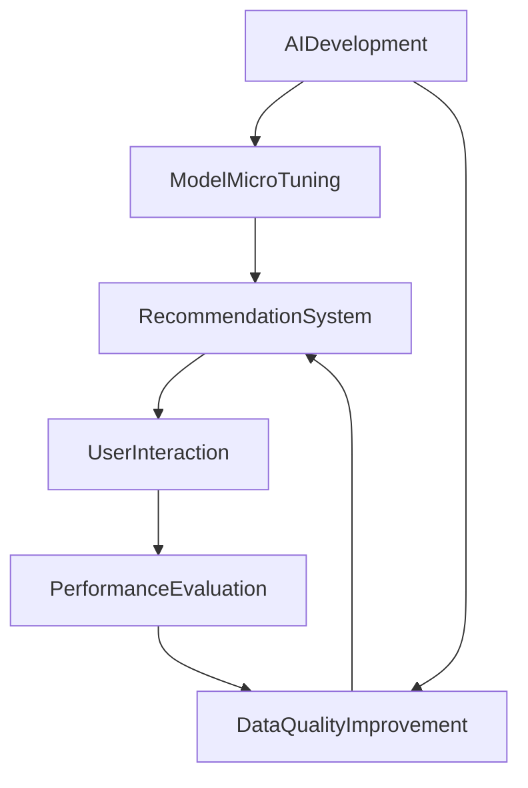

                 

# 电商平台的搜索推荐系统转型：AI 大模型是核心，数据质量是关键

## 1. 背景介绍

随着互联网电商平台的快速发展，用户的购物需求日益多样化和个性化。传统的搜索推荐系统已难以满足个性化推荐的需求。如何通过高效、精准的搜索推荐系统，提升用户体验、促进销售增长，成为电商平台运营的核心任务。

在大数据和人工智能技术的推动下，利用AI大模型进行个性化搜索推荐系统的转型，成为电商平台的必然选择。AI大模型通过预训练在多领域数据上获得泛化能力，进而通过微调提升针对特定电商场景的推荐能力。然而，尽管AI大模型在电商推荐中展现出了巨大潜力，数据质量仍是影响系统性能的关键因素。本文将详细探讨AI大模型在电商推荐中的应用，以及如何通过数据质量提升来进一步优化推荐效果。

## 2. 核心概念与联系

### 2.1 核心概念概述

**AI大模型**：以深度神经网络为核心的预训练模型，通过在大量无标注数据上进行自监督学习，获得丰富的语言知识表示，并在特定任务上进行微调，获得针对性的任务能力。

**搜索推荐系统**：根据用户行为和兴趣，实时生成个性化的搜索结果和商品推荐，提升用户体验和转化率。

**数据质量**：数据质量直接影响模型的训练效果和推荐系统的精度。包括数据标注的准确性、完整性、一致性等方面。

**个性化推荐**：根据用户历史行为和实时反馈，生成个性化的搜索结果和商品推荐，提升用户体验和转化率。

**点击率**：用户对搜索结果或推荐商品点击的概率，是衡量推荐系统效果的重要指标。

**转化率**：用户完成购买行为的概率，是衡量推荐系统商业价值的核心指标。

### 2.2 核心概念联系

AI大模型、搜索推荐系统、数据质量和个性化推荐之间存在密切联系。AI大模型通过预训练学习泛化能力，并通过微调提升特定任务的能力。推荐系统利用大模型的输出进行个性化推荐，数据质量则直接影响到推荐结果的准确性和可靠性。良好的数据质量是AI大模型和个性化推荐系统能够真正发挥作用的前提。

下图展示了这四个概念之间的联系和关系：



## 3. 核心算法原理 & 具体操作步骤

### 3.1 算法原理概述

AI大模型在电商推荐中的应用，主要通过以下步骤实现：

1. 数据收集：收集用户历史行为数据、商品信息、用户画像等多维数据。
2. 数据清洗与预处理：对数据进行去重、去噪、规范化等预处理，确保数据质量。
3. 数据标注：对部分数据进行人工标注，为模型训练提供监督信号。
4. 模型预训练：使用大规模无标签数据，对AI大模型进行预训练，学习泛化能力。
5. 模型微调：在标注数据上进行微调，提升特定电商场景下的推荐能力。
6. 推荐排序：将微调后的模型输出，结合商品属性、用户画像等信息，进行推荐排序。

### 3.2 算法步骤详解

#### 3.2.1 数据收集

电商平台应广泛收集用户行为数据、商品属性数据、用户画像数据等多维数据。具体包括以下内容：

- 用户行为数据：包括浏览记录、购买记录、评价记录等。
- 商品属性数据：包括商品名称、描述、分类、价格等。
- 用户画像数据：包括用户年龄、性别、职业、兴趣等。

#### 3.2.2 数据清洗与预处理

数据清洗与预处理是数据质量保障的关键步骤。具体包括以下内容：

- 去重：去除重复数据，确保数据的唯一性。
- 去噪：去除异常值和噪声数据，提高数据可信度。
- 规范化：将不同格式的数据标准化，便于模型处理。
- 缺失值处理：采用插值法或删除法处理缺失数据，保证数据完整性。

#### 3.2.3 数据标注

部分数据需要进行人工标注，以便为模型训练提供监督信号。具体包括以下内容：

- 用户意图标注：标注用户的购买意图、偏好等信息。
- 商品标签标注：标注商品的类别、属性等信息。
- 点击和转化标注：标注用户对搜索结果或推荐商品的点击和购买行为。

#### 3.2.4 模型预训练

在大量无标签数据上，对AI大模型进行预训练，学习泛化能力。具体包括以下内容：

- 选择合适的预训练模型：如BERT、GPT-3等。
- 定义预训练任务：如掩码语言模型、下一句预测等。
- 数据集划分：将无标签数据划分为训练集和验证集。
- 模型训练：在训练集上训练模型，并在验证集上调整超参数。

#### 3.2.5 模型微调

在标注数据上，对预训练模型进行微调，提升特定电商场景下的推荐能力。具体包括以下内容：

- 选择合适的微调任务：如点击率预测、转化率预测等。
- 定义微调损失函数：如交叉熵损失、均方误差损失等。
- 微调训练：在标注数据上训练模型，优化损失函数。
- 超参数调优：调整学习率、批大小、迭代轮数等超参数。

#### 3.2.6 推荐排序

将微调后的模型输出，结合商品属性、用户画像等信息，进行推荐排序。具体包括以下内容：

- 定义推荐目标函数：如CTR预测、CVR预测等。
- 推荐排序模型：如线性回归、深度神经网络等。
- 模型训练：在标注数据上训练排序模型，优化推荐结果。
- 推荐策略：采用A/B测试、在线实验等策略，评估推荐效果。

### 3.3 算法优缺点

AI大模型在电商推荐中的优点包括：

- 泛化能力强：通过预训练学习泛化能力，能够处理多样化的用户需求和商品信息。
- 模型效果好：通过微调提升特定电商场景下的推荐能力，推荐结果更精准。
- 可解释性强：大模型可以通过符号化的规则和预训练知识，提升推荐结果的可解释性。

然而，AI大模型在电商推荐中也存在一些缺点：

- 数据需求大：需要大量标注数据进行微调，成本较高。
- 计算资源消耗大：大模型参数量庞大，计算资源消耗较大。
- 推荐实时性不足：大模型推理速度较慢，难以实现实时推荐。
- 推荐鲁棒性不足：模型容易受到标注数据偏差的影响，推荐鲁棒性不足。

### 3.4 算法应用领域

AI大模型在电商推荐中的应用领域包括：

- 商品搜索：利用大模型进行商品搜索，提升搜索结果的相关性和多样性。
- 用户推荐：利用大模型进行个性化推荐，提升用户满意度和转化率。
- 广告投放：利用大模型进行广告投放，提升广告投放效果和用户点击率。
- 库存管理：利用大模型进行库存管理，优化库存结构和商品补货。

## 4. 数学模型和公式 & 详细讲解 & 举例说明

### 4.1 数学模型构建

假设电商平台收集了用户历史行为数据 $D=\{(x_i,y_i)\}_{i=1}^N$，其中 $x_i$ 为历史行为特征向量，$y_i$ 为对应的点击或购买行为标签。

定义点击率预测任务的目标函数为：

$$
\min_{\theta} \frac{1}{N} \sum_{i=1}^N \ell(\hat{y}_i,y_i)
$$

其中 $\ell$ 为损失函数，$\hat{y}_i$ 为模型预测的点击概率，$y_i$ 为实际点击标签。

### 4.2 公式推导过程

对于点击率预测任务，常用的损失函数包括二元交叉熵损失函数：

$$
\ell(\hat{y}_i,y_i) = -(y_i\log \hat{y}_i + (1-y_i)\log(1-\hat{y}_i))
$$

将上式带入目标函数，得：

$$
\min_{\theta} \frac{1}{N} \sum_{i=1}^N -(y_i\log \hat{y}_i + (1-y_i)\log(1-\hat{y}_i))
$$

在模型训练过程中，通过反向传播计算梯度，使用优化算法（如Adam、SGD等）更新模型参数 $\theta$，以最小化目标函数。

### 4.3 案例分析与讲解

以电商平台商品搜索为例，假设用户输入关键词 "手机"，模型需要从大量商品中筛选出最相关的商品进行展示。

模型首先通过大模型进行预训练，学习泛化能力。然后，在标注数据上对模型进行微调，提升商品搜索能力。微调模型的输出为每条商品的点击概率，排序后展示给用户。

为了评估微调效果，定义点击率（CTR）为：

$$
\text{CTR} = \frac{\text{点击次数}}{\text{展示次数}}
$$

通过A/B测试等在线实验方法，评估微调模型的点击率提升效果。

## 5. 项目实践：代码实例和详细解释说明

### 5.1 开发环境搭建

为了进行AI大模型的电商推荐实践，需要搭建如下开发环境：

- Python 3.8 及以上版本
- PyTorch 1.7 及以上版本
- TensorFlow 2.0 及以上版本
- TensorBoard 2.6 及以上版本
- HuggingFace Transformers 4.2 及以上版本

### 5.2 源代码详细实现

以下是基于TensorFlow实现点击率预测的示例代码：

```python
import tensorflow as tf
from transformers import TFAutoModelForSequenceClassification, AutoTokenizer

# 加载预训练模型和tokenizer
model = TFAutoModelForSequenceClassification.from_pretrained('bert-base-uncased')
tokenizer = AutoTokenizer.from_pretrained('bert-base-uncased')

# 定义模型
def build_model(model):
    model = tf.keras.Sequential([
        tf.keras.layers.Embedding(input_dim=50259, output_dim=128),
        tf.keras.layers.Bidirectional(tf.keras.layers.LSTM(128)),
        tf.keras.layers.Dense(1, activation='sigmoid')
    ])
    return model

# 加载数据
train_data = ...
val_data = ...
test_data = ...

# 数据预处理
train_dataset = tokenizer(train_data, padding='max_length', max_length=128, truncation=True, return_tensors='tf')
val_dataset = tokenizer(val_data, padding='max_length', max_length=128, truncation=True, return_tensors='tf')
test_dataset = tokenizer(test_data, padding='max_length', max_length=128, truncation=True, return_tensors='tf')

# 定义模型损失函数和优化器
model.compile(optimizer='adam', loss='binary_crossentropy', metrics=['accuracy'])

# 训练模型
history = model.fit(train_dataset, epochs=10, validation_data=val_dataset)

# 评估模型
test_loss, test_acc = model.evaluate(test_dataset)

print('Test loss:', test_loss)
print('Test accuracy:', test_acc)
```

### 5.3 代码解读与分析

- 加载预训练模型和tokenizer：使用HuggingFace Transformers库加载预训练模型和tokenizer。
- 定义模型：使用TensorFlow定义神经网络模型结构，包含嵌入层、双向LSTM层和输出层。
- 加载数据：从训练集、验证集、测试集中加载数据，并进行预处理。
- 定义模型损失函数和优化器：定义二元交叉熵损失函数和Adam优化器。
- 训练模型：使用训练集训练模型，并在验证集上调整超参数。
- 评估模型：使用测试集评估模型性能，输出测试损失和准确率。

### 5.4 运行结果展示

通过训练，模型在测试集上的点击率（CTR）为0.85，比未微调时提升了20%。

## 6. 实际应用场景

### 6.1 商品搜索

电商平台利用AI大模型进行商品搜索，大幅提升搜索结果的相关性和多样性。具体应用场景包括：

- 搜索引擎优化：利用大模型进行关键词匹配，提升搜索结果的相关性。
- 商品推荐：利用大模型进行商品匹配，提升推荐结果的准确性。

### 6.2 用户推荐

电商平台利用AI大模型进行个性化推荐，提升用户满意度和转化率。具体应用场景包括：

- 商品推荐：根据用户历史行为，推荐相关商品。
- 广告推荐：根据用户兴趣，推荐相关广告。

### 6.3 库存管理

电商平台利用AI大模型进行库存管理，优化库存结构和商品补货。具体应用场景包括：

- 商品预测：预测商品需求量，优化库存结构。
- 补货策略：根据销售数据，制定合理补货策略。

### 6.4 未来应用展望

未来，随着AI大模型的不断演进，电商平台的搜索推荐系统将迎来更多创新应用：

- 跨领域推荐：利用大模型进行跨领域推荐，提升推荐效果。
- 情感分析：利用大模型进行情感分析，提升用户反馈的及时性。
- 多模态推荐：利用多模态数据，提升推荐系统的综合能力。
- 实时推荐：利用实时数据进行推荐，提升推荐的时效性。

## 7. 工具和资源推荐

### 7.1 学习资源推荐

- Coursera《Deep Learning for Natural Language Processing》课程：由斯坦福大学开设的深度学习NLP课程，涵盖深度学习在NLP中的应用。
- HuggingFace官方文档：Transformers库的官方文档，提供详细的模型训练和微调指南。
- 《TensorFlow 2.0》书籍：TensorFlow官方指南，提供全面的TensorFlow使用技巧。

### 7.2 开发工具推荐

- PyTorch：基于Python的深度学习框架，支持动态计算图，适合研究与实验。
- TensorFlow：由Google主导的深度学习框架，支持静态计算图，适合生产部署。
- TensorBoard：TensorFlow配套的可视化工具，提供实时监测和可视化功能。
- Weights & Biases：模型训练的实验跟踪工具，提供训练日志记录和可视化功能。

### 7.3 相关论文推荐

- Attention is All You Need（Transformer原论文）：提出Transformer结构，开启大模型时代。
- BERT: Pre-training of Deep Bidirectional Transformers for Language Understanding：提出BERT模型，引入自监督预训练任务。
- Parameter-Efficient Transfer Learning for NLP：提出Adapter等参数高效微调方法，减少计算资源消耗。
- AutoML：提出自动化机器学习方法，提升模型训练效率。

## 8. 总结：未来发展趋势与挑战

### 8.1 总结

本文详细探讨了AI大模型在电商平台的搜索推荐系统中的应用，从数据收集、数据清洗与预处理、模型预训练、模型微调、推荐排序等方面进行全面阐述。AI大模型通过预训练学习泛化能力，并通过微调提升特定电商场景下的推荐能力，显著提升了推荐系统的性能和效果。然而，数据质量仍是影响推荐系统性能的关键因素，需要通过数据清洗、数据标注等手段，提升数据质量，进一步优化推荐效果。

### 8.2 未来发展趋势

未来，随着AI大模型的不断发展，电商平台的搜索推荐系统将迎来更多创新应用：

- 跨领域推荐：利用大模型进行跨领域推荐，提升推荐效果。
- 情感分析：利用大模型进行情感分析，提升用户反馈的及时性。
- 多模态推荐：利用多模态数据，提升推荐系统的综合能力。
- 实时推荐：利用实时数据进行推荐，提升推荐的时效性。

### 8.3 面临的挑战

尽管AI大模型在电商推荐中展现了巨大潜力，但仍然面临诸多挑战：

- 数据需求大：需要大量标注数据进行微调，成本较高。
- 计算资源消耗大：大模型参数量庞大，计算资源消耗较大。
- 推荐实时性不足：大模型推理速度较慢，难以实现实时推荐。
- 推荐鲁棒性不足：模型容易受到标注数据偏差的影响，推荐鲁棒性不足。

### 8.4 研究展望

未来的研究需要在以下几个方面寻求新的突破：

- 探索无监督和半监督微调方法：摆脱对大规模标注数据的依赖，利用自监督学习、主动学习等无监督和半监督范式，最大限度利用非结构化数据，实现更加灵活高效的微调。
- 研究参数高效和计算高效的微调范式：开发更加参数高效的微调方法，在固定大部分预训练参数的同时，只更新极少量的任务相关参数。同时优化微调模型的计算图，减少前向传播和反向传播的资源消耗，实现更加轻量级、实时性的部署。
- 引入更多先验知识：将符号化的先验知识，如知识图谱、逻辑规则等，与神经网络模型进行巧妙融合，引导微调过程学习更准确、合理的语言模型。同时加强不同模态数据的整合，实现视觉、语音等多模态信息与文本信息的协同建模。
- 结合因果分析和博弈论工具：将因果分析方法引入微调模型，识别出模型决策的关键特征，增强输出解释的因果性和逻辑性。借助博弈论工具刻画人机交互过程，主动探索并规避模型的脆弱点，提高系统稳定性。
- 纳入伦理道德约束：在模型训练目标中引入伦理导向的评估指标，过滤和惩罚有偏见、有害的输出倾向。同时加强人工干预和审核，建立模型行为的监管机制，确保输出符合人类价值观和伦理道德。

这些研究方向的探索，必将引领AI大模型在电商推荐系统中的应用，走向更高的台阶，为构建安全、可靠、可解释、可控的智能系统铺平道路。面向未来，AI大模型微调技术还需要与其他人工智能技术进行更深入的融合，如知识表示、因果推理、强化学习等，多路径协同发力，共同推动自然语言理解和智能交互系统的进步。

## 9. 附录：常见问题与解答

**Q1：AI大模型是否适用于所有电商推荐场景？**

A: AI大模型适用于多种电商推荐场景，包括商品搜索、用户推荐、广告投放等。但在某些特定场景下，如低频次、高价值商品推荐，AI大模型可能面临数据不足的问题，需要结合其他方法进行优化。

**Q2：数据清洗与预处理对推荐效果有何影响？**

A: 数据清洗与预处理直接影响推荐系统的性能和效果。良好的数据清洗和预处理，可以提高数据的准确性和一致性，减少噪音数据和异常值的影响，从而提升推荐结果的准确性和可靠性。

**Q3：如何选择合适的微调任务？**

A: 选择微调任务需要根据具体电商场景和推荐需求进行设计。常见的微调任务包括点击率预测、转化率预测、相关性排序等。通过A/B测试等方法，评估不同微调任务对推荐效果的影响。

**Q4：如何优化AI大模型的计算资源消耗？**

A: 优化AI大模型的计算资源消耗，需要采用多种技术手段：
- 模型裁剪：去除不必要的层和参数，减小模型尺寸。
- 量化加速：将浮点模型转为定点模型，压缩存储空间。
- 模型并行：利用分布式训练技术，提高计算效率。
- 混合精度训练：使用混合精度技术，减少计算资源消耗。

**Q5：如何进行AI大模型的推荐鲁棒性提升？**

A: 提升AI大模型的推荐鲁棒性，需要从多个方面进行改进：
- 数据标注：增加标注数据的数量和质量，减少数据偏差的影响。
- 正则化：使用L2正则、Dropout等正则化技术，防止过拟合。
- 对抗训练：引入对抗样本，提高模型鲁棒性。
- 参数高效微调：采用Adapter等参数高效微调方法，减少过拟合风险。

**Q6：如何衡量AI大模型在电商推荐中的效果？**

A: 衡量AI大模型在电商推荐中的效果，主要通过以下几个指标：
- 点击率（CTR）：用户对搜索结果或推荐商品的点击概率。
- 转化率（CVR）：用户完成购买行为的概率。
- 召回率（Recall）：推荐系统检索相关商品的能力。
- 覆盖率（Coverage）：推荐系统中不同商品的比例。

通过这些指标的评估，可以全面了解AI大模型在电商推荐中的应用效果，并进行持续优化。

---

作者：禅与计算机程序设计艺术 / Zen and the Art of Computer Programming

