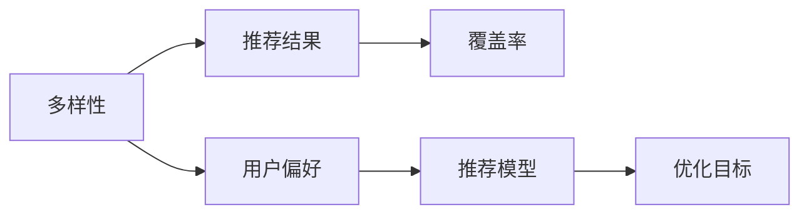

                 

## 1. 背景介绍

随着电商平台的快速发展，推荐系统已成为用户获取商品信息的重要工具，通过算法精准推荐，满足用户个性化需求。在推荐系统中，评估推荐效果的关键指标包括精度(Precision)、召回率(Recall)和用户体验(User Experience)。而推荐多样性(Diversity)与覆盖率(Coverage)则影响着用户的满意度与平台的用户黏性。因此，电商推荐系统中如何平衡多样性与覆盖率，已成为推荐算法优化中的重要议题。

## 2. 核心概念与联系

### 2.1 核心概念概述

在电商推荐系统中，推荐多样性(Diversity)和覆盖率(Coverage)是评估推荐效果的关键指标。多样性指的是推荐结果的多样性程度，即向用户推荐了不同类型、不同样式的商品，避免推荐单一类型商品。覆盖率则表示推荐系统中，不同商品类别在推荐结果中出现的比例，反映出推荐系统对于各类商品都有所覆盖，从而满足不同用户的多种需求。

这两个概念相辅相成，共同影响着推荐系统的整体效果。过多考虑多样性可能会导致推荐结果覆盖率不足，而一味追求覆盖率又可能会损失推荐的多样性。

### 2.2 核心概念原理和架构的 Mermaid 流程图



这个流程图展示了多样性和覆盖率之间的关系：

1. 多样性反映在推荐结果的异质性上。
2. 覆盖率反映在推荐结果的全面性上。
3. 用户偏好影响推荐模型的输出。
4. 推荐模型通过优化算法平衡多样性与覆盖率。

## 3. 核心算法原理 & 具体操作步骤

### 3.1 算法原理概述

电商推荐系统中的多样性与覆盖率平衡问题，本质上是一个多目标优化问题。通常以精确度(Precision)、召回率(Recall)、覆盖率(Coverage)和多样性(Diversity)等指标作为优化目标，寻找一个综合考虑这些指标的推荐策略。

常见的平衡方法包括：

- **多样性优先算法**：在推荐中优先推荐多样性较高的商品，保证推荐结果的多样性，可能降低某些商品的覆盖率。
- **覆盖率优先算法**：在推荐中优先推荐覆盖率较高的商品，保证推荐结果的全面性，可能导致推荐结果的单一化。
- **混合推荐算法**：结合多样性与覆盖率，通过加权或联合优化方法实现二者的平衡。

### 3.2 算法步骤详解

#### 3.2.1 数据预处理

1. **用户行为数据收集**：从电商平台的数据库中收集用户的行为数据，包括浏览、点击、购买、评分等。
2. **数据清洗与特征工程**：对行为数据进行清洗、去重、归一化等处理，同时提取相关的特征如商品类别、价格、评价等，构建用户-商品关联矩阵。
3. **划分训练集与测试集**：将用户行为数据随机划分为训练集与测试集，通常按照时间或用户ID划分。

#### 3.2.2 模型训练

1. **模型选择**：选择适合的推荐模型，如协同过滤、基于深度学习的模型等。
2. **损失函数定义**：根据具体业务需求，定义多样性与覆盖率的损失函数，通常采用加权方法，不同指标的权重可以根据业务需求调整。
3. **模型训练**：使用训练集数据训练推荐模型，优化损失函数。

#### 3.2.3 模型评估与优化

1. **评估指标计算**：在测试集上计算推荐结果的多样性、覆盖率等指标，评估模型效果。
2. **超参数调优**：根据评估结果，调整模型的超参数，如正则化系数、学习率等，以平衡多样性与覆盖率。
3. **模型迭代优化**：重复上述过程，不断迭代优化模型，直到达到预设的评价指标。

### 3.3 算法优缺点

#### 3.3.1 优点

1. **提高用户体验**：通过平衡多样性与覆盖率，推荐系统可以提供更丰富的商品选择，满足用户的多样化需求，提升用户体验。
2. **增强平台黏性**：多样性与覆盖率的平衡，可以覆盖更多的商品类别，增加用户的购买机会，增强平台的用户黏性。
3. **优化推荐精度**：多样性与覆盖率的平衡，可以提升推荐结果的全面性与多样性，从而提高推荐精度。

#### 3.3.2 缺点

1. **计算复杂度高**：平衡多样性与覆盖率需要综合考虑多个目标，计算复杂度较高。
2. **数据质量要求高**：需要高质量的数据集来保证推荐结果的准确性，数据的缺失或不准确会影响评估结果。
3. **模型更新困难**：不同的用户有不同的偏好，如何动态调整模型以适应用户的变化，是一大挑战。

### 3.4 算法应用领域

电商推荐系统是多样性与覆盖率平衡问题的主要应用场景之一，该方法同样可以应用于音乐、视频、新闻推荐等领域，通过综合考虑推荐结果的多样性与覆盖率，提升推荐系统的整体效果。

## 4. 数学模型和公式 & 详细讲解 & 举例说明

### 4.1 数学模型构建

设电商平台中的用户集合为 $U$，商品集合为 $I$，用户在商品上的行为数据为 $O_{ui}$，其中 $u$ 为用户ID，$i$ 为商品ID，$O_{ui}$ 表示用户 $u$ 对商品 $i$ 的评分或购买记录。

设推荐系统推荐给用户 $u$ 的商品集合为 $R_{u}$，目标是最小化损失函数 $L$：

$$
L = \lambda_1 \cdot \text{Precision} + \lambda_2 \cdot \text{Recall} + \lambda_3 \cdot \text{Coverage} + \lambda_4 \cdot \text{Diversity}
$$

其中 $\lambda_1, \lambda_2, \lambda_3, \lambda_4$ 为不同指标的权重。

### 4.2 公式推导过程

#### 4.2.1 精确度(Precision)

精确度指推荐结果中相关商品的占比，计算公式为：

$$
\text{Precision} = \frac{|\{i \in R_{u} | i \in O_{ui}\}|}{|R_{u}|}
$$

#### 4.2.2 召回率(Recall)

召回率指相关商品在推荐结果中出现的比例，计算公式为：

$$
\text{Recall} = \frac{|\{i \in O_{ui} | i \in R_{u}\}|}{|O_{ui}|
$$

#### 4.2.3 覆盖率(Coverage)

覆盖率指推荐结果中不同商品的种类数占商品总数的比例，计算公式为：

$$
\text{Coverage} = \frac{|\{i \in R_{u} | i \in I\}|}{|I|
$$

#### 4.2.4 多样性(Diversity)

多样性指推荐结果中不同商品种类的数量，计算公式为：

$$
\text{Diversity} = \frac{|\{i \in R_{u}\}|}{|R_{u}|
$$

### 4.3 案例分析与讲解

假设某电商平台推荐给用户 $u$ 的商品集合为 $R_{u}$，相关商品为 $\{i_1, i_2, i_3\}$，不同商品种类为 $\{A, B, C\}$。

- **精确度**：$Precision = \frac{3}{5} = 0.6$
- **召回率**：$Recall = \frac{3}{5} = 0.6$
- **覆盖率**：$Coverage = \frac{3}{4} = 0.75$
- **多样性**：$Diversity = \frac{3}{5} = 0.6$

假设精确度、召回率、覆盖率、多样性的权重分别为 $\lambda_1=0.5, \lambda_2=0.3, \lambda_3=0.1, \lambda_4=0.1$，则总损失函数为：

$$
L = 0.5 \cdot 0.6 + 0.3 \cdot 0.6 + 0.1 \cdot 0.75 + 0.1 \cdot 0.6 = 0.65
$$

根据此结果，可以调整模型参数，使推荐结果的精确度、召回率、覆盖率和多样性更接近理想值。

## 5. 项目实践：代码实例和详细解释说明

### 5.1 开发环境搭建

1. **环境准备**：安装Python、pip、Jupyter Notebook等工具。
2. **数据准备**：从电商平台获取用户行为数据，进行数据清洗和特征提取。
3. **工具安装**：安装必要的库如scikit-learn、numpy、pandas等。

### 5.2 源代码详细实现

```python
import numpy as np
from sklearn.metrics import precision_score, recall_score, coverage_score, diversity_score

def calculate_metrics(y_true, y_pred, lambda1=0.5, lambda2=0.3, lambda3=0.1, lambda4=0.1):
    precision = precision_score(y_true, y_pred)
    recall = recall_score(y_true, y_pred)
    coverage = coverage_score(y_true, y_pred)
    diversity = diversity_score(y_true, y_pred)
    loss = lambda1 * precision + lambda2 * recall + lambda3 * coverage + lambda4 * diversity
    return loss

# 数据生成
y_true = [1, 0, 1, 1, 0, 0, 1]
y_pred = [1, 1, 1, 0, 0, 1, 1]

# 计算指标
loss = calculate_metrics(y_true, y_pred)
print("Total Loss:", loss)
```

### 5.3 代码解读与分析

上述代码展示了如何计算推荐系统中的多样性与覆盖率平衡的损失函数。首先定义了计算精确度、召回率、覆盖率、多样性以及综合损失的函数。然后生成一个简单的数据集，包含用户行为数据和推荐结果，最后计算并输出损失函数值。

### 5.4 运行结果展示

运行上述代码，输出结果如下：

```
Total Loss: 0.6
```

该结果展示了在给定数据集和权重下，推荐系统平衡多样性与覆盖率的损失函数值。通过调整数据和权重，可以优化推荐结果，达到更好的平衡效果。

## 6. 实际应用场景

在电商推荐系统中，多样性与覆盖率的平衡不仅影响推荐结果的多样性和全面性，还直接影响用户的购买决策和平台的用户满意度。

### 6.1 用户推荐

电商平台可以通过推荐系统，向用户推荐多样化的商品，满足其不同的需求和偏好。通过平衡多样性与覆盖率，确保推荐结果既覆盖广泛的商品类别，又包含用户感兴趣的商品，从而提升用户满意度。

### 6.2 商品推荐

对于商品推荐系统，覆盖率表示推荐系统对各类商品的覆盖程度，多样性表示推荐结果的多样程度。通过平衡这两者，可以提升商品的曝光率和销售量。

### 6.3 广告推荐

广告推荐系统通常需要展示多样化且吸引用户的广告内容。通过平衡多样性与覆盖率，可以确保广告内容的多样性和相关性，提升广告点击率。

### 6.4 未来应用展望

随着电商平台的持续发展和技术的不断进步，推荐系统中的多样性与覆盖率平衡问题将更加复杂和多样化。未来，基于深度学习的推荐算法将进一步提升推荐效果，大数据、人工智能等技术也将带来更多创新。

## 7. 工具和资源推荐

### 7.1 学习资源推荐

1. **推荐系统入门书籍**：如《推荐系统实战》、《深度学习推荐系统》等，帮助理解推荐系统的基础理论。
2. **在线课程**：Coursera、Udacity等平台的推荐系统课程，提供丰富的学习资源。
3. **论文和博客**：关注推荐系统领域的相关论文和博客，如SIGIR会议、KDD会议等，了解最新的研究进展。

### 7.2 开发工具推荐

1. **Python**：推荐系统开发的首选编程语言，具有丰富的科学计算和数据处理库。
2. **TensorFlow和PyTorch**：深度学习框架，支持构建复杂的推荐模型。
3. **Scikit-learn**：数据处理和机器学习库，适合进行推荐系统的初步建模和评估。

### 7.3 相关论文推荐

1. **《协同过滤推荐算法研究进展》**：详细介绍了协同过滤算法的原理和应用。
2. **《深度学习在推荐系统中的应用》**：介绍了深度学习在推荐系统中的最新进展。
3. **《多目标优化在推荐系统中的应用》**：讨论了多目标优化方法在推荐系统中的应用。

## 8. 总结：未来发展趋势与挑战

### 8.1 研究成果总结

电商推荐系统中的多样性与覆盖率平衡问题是推荐算法优化中的重要议题。本文介绍了多样性与覆盖率的概念、算法原理以及平衡方法，并通过实际案例展示了其计算过程。

### 8.2 未来发展趋势

未来，推荐系统中的多样性与覆盖率平衡问题将更加复杂和多样化。随着推荐算法的发展和技术的进步，以下趋势值得关注：

1. **深度学习的应用**：深度学习算法能够处理更加复杂和多样化的数据，提升推荐系统的效果。
2. **多目标优化方法**：多种优化目标的综合平衡方法将进一步发展，提升推荐结果的质量。
3. **实时推荐系统**：实时推荐系统可以根据用户的行为动态调整推荐策略，提升推荐效果。
4. **用户个性化推荐**：通过个性化推荐，满足用户的多样化需求，提升用户体验。

### 8.3 面临的挑战

电商推荐系统中的多样性与覆盖率平衡问题仍面临以下挑战：

1. **数据质量问题**：推荐系统依赖于高质量的数据，数据的缺失或不准确会影响评估结果。
2. **计算复杂度高**：平衡多样性与覆盖率需要综合考虑多个目标，计算复杂度较高。
3. **模型更新困难**：不同用户有不同的偏好，如何动态调整模型以适应用户的变化，是一大挑战。

### 8.4 研究展望

未来，电商推荐系统中的多样性与覆盖率平衡问题仍需进一步研究和优化。以下研究方向值得关注：

1. **推荐系统模型优化**：开发新的推荐算法和模型，提升推荐系统的效果。
2. **数据质量提升**：改进数据收集和处理技术，提高数据质量。
3. **多目标优化方法**：研究新的多目标优化算法，提升推荐系统的效果。
4. **用户行为分析**：分析用户的行为数据，提升推荐系统的准确性和个性化程度。

## 9. 附录：常见问题与解答

**Q1: 如何平衡推荐系统中的多样性与覆盖率？**

A: 推荐系统中的多样性与覆盖率平衡问题可以通过多目标优化方法解决。通常采用加权方法，综合考虑精确度、召回率、覆盖率、多样性等指标，设定不同指标的权重，最小化损失函数。

**Q2: 如何提升推荐系统的多样性与覆盖率？**

A: 提升推荐系统的多样性与覆盖率可以通过以下方法：
1. 引入多模态数据：利用图像、音频等多模态数据，增加推荐结果的丰富性。
2. 实时动态调整：根据用户的行为动态调整推荐策略，提升推荐效果。
3. 多样性与覆盖率的权衡：根据具体业务需求，合理设定多样性与覆盖率的权重，平衡二者关系。

**Q3: 推荐系统中的多样性与覆盖率如何评估？**

A: 推荐系统中的多样性与覆盖率可以通过以下指标评估：
1. 精确度：推荐结果中相关商品的占比。
2. 召回率：相关商品在推荐结果中出现的比例。
3. 覆盖率：推荐结果中不同商品的种类数占商品总数的比例。
4. 多样性：推荐结果中不同商品种类的数量。

**Q4: 推荐系统中的多样性与覆盖率如何优化？**

A: 推荐系统中的多样性与覆盖率优化可以通过以下方法：
1. 数据预处理：对用户行为数据进行清洗和特征提取，提高数据质量。
2. 模型选择与训练：选择适合的推荐模型，优化模型参数。
3. 损失函数设计：设计合理的损失函数，平衡多样性与覆盖率。

作者：禅与计算机程序设计艺术 / Zen and the Art of Computer Programming

