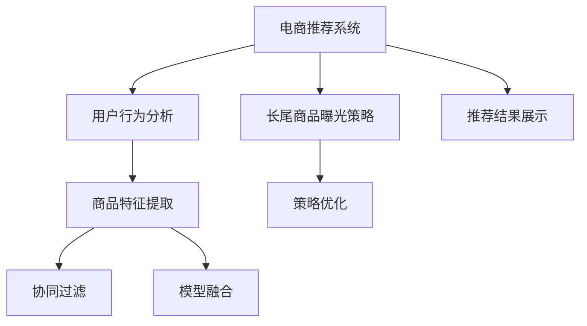

                 

# 电商推荐系统中的长尾商品曝光策略

> 关键词：推荐系统,长尾商品,曝光策略,协同过滤,模型融合

## 1. 背景介绍

随着电子商务的迅速发展，用户能够接触到海量的商品信息。然而，尽管头部商品（如热门商品）能够带来丰厚的销售收益，但长尾商品的销售往往被忽视，造成了大量潜在的商机损失。因此，如何在推荐系统中提升长尾商品的曝光和销售，成为了电商行业的重要研究方向。

### 1.1 问题由来

在电商推荐系统中，推荐算法的主要目标是通过分析用户行为和商品特征，预测用户对各个商品的潜在兴趣，并提供相应的推荐。然而，当前推荐算法往往集中在热门商品上，对于长尾商品的推荐相对不足。长尾商品通常具有需求小、销量低的特点，但这些商品可能具有独特的用户群体或销售潜力，如何提升长尾商品的曝光和销售，成为了电商推荐系统需要解决的核心问题。

### 1.2 问题核心关键点

电商推荐系统中的长尾商品曝光策略，旨在通过优化推荐算法，增加长尾商品的推荐频率，从而提升这些商品的曝光和销售。具体来说，关键点包括：

- **用户行为分析**：如何通过分析用户的浏览、点击、购买等行为，精准预测用户对长尾商品的兴趣。
- **商品特征提取**：如何有效地提取和利用商品的属性、标签、描述等信息，形成商品表示。
- **推荐模型设计**：如何设计推荐模型，平衡热门商品和长尾商品的推荐效果。
- **策略优化**：如何通过策略优化，在保证整体推荐效果的前提下，显著提升长尾商品的曝光和销售。

## 2. 核心概念与联系

### 2.1 核心概念概述

为了更好地理解电商推荐系统中的长尾商品曝光策略，本节将介绍几个密切相关的核心概念：

- **电商推荐系统**：通过分析用户行为和商品特征，为用户推荐最相关的商品的系统。电商推荐系统包括多个环节，如用户画像构建、商品推荐模型训练、推荐结果展示等。
- **长尾商品**：指那些需求量小但种类繁多、具有独特价值和特色的商品。在电商推荐系统中，长尾商品的曝光和销售通常被忽视，但它们具有巨大的潜在市场。
- **曝光策略**：通过算法或策略设计，提升长尾商品的曝光频率，从而提高销售量的策略。
- **协同过滤**：一种基于用户和商品相似性的推荐方法，通过分析用户和商品间的互动数据，预测用户对商品的兴趣。
- **模型融合**：通过将多个推荐模型组合起来，综合考虑各种特征，提升推荐效果的方法。

这些核心概念之间的逻辑关系可以通过以下Mermaid流程图来展示：



这个流程图展示了电商推荐系统中的关键组件及其之间的关系：

1. 电商推荐系统通过用户行为分析、商品特征提取等环节，获取用户和商品的相似性信息。
2. 协同过滤和模型融合环节，通过多种推荐方法，构建综合推荐模型。
3. 长尾商品曝光策略，通过特定的策略设计，提升长尾商品的推荐频率。
4. 推荐结果展示，将推荐商品呈现给用户，完成电商推荐过程。

这些概念共同构成了电商推荐系统的核心框架，为其长尾商品曝光提供了理论基础。

## 3. 核心算法原理 & 具体操作步骤
### 3.1 算法原理概述

电商推荐系统中的长尾商品曝光策略，本质上是一种基于用户行为和商品特征的优化推荐方法。其核心思想是：通过分析用户行为数据和商品特征信息，找到用户对长尾商品的潜在兴趣，并通过推荐算法，增加这些商品的曝光和销售。

形式化地，假设电商推荐系统包含用户 $U$ 和商品 $I$，用户行为数据为 $D=\{(u,i,v)\}_{i=1}^N$，其中 $u$ 表示用户ID，$i$ 表示商品ID，$v$ 表示行为类型（如点击、购买、浏览等）。

定义长尾商品曝光策略为 $P$，其目标是在用户行为数据和商品特征信息 $D$ 和 $F$ 的约束下，最大化长尾商品 $I_L$ 的曝光频率 $E(I_L)$：

$$
\max_{P} E(I_L) \text{ subject to } D
$$

其中，$E(I_L)$ 表示长尾商品 $I_L$ 的曝光频率，$D$ 表示用户行为数据和商品特征信息，$F$ 表示模型融合策略。

### 3.2 算法步骤详解

基于长尾商品曝光策略的电商推荐系统，一般包括以下几个关键步骤：

**Step 1: 用户行为分析**

- **行为数据收集**：从电商平台中收集用户的历史行为数据，如浏览记录、点击行为、购买行为等。
- **用户画像构建**：通过分析用户行为数据，构建用户画像，包括用户的兴趣偏好、购买力、活跃度等。

**Step 2: 商品特征提取**

- **商品属性提取**：提取商品的各个属性信息，如价格、品牌、类别等。
- **商品标签生成**：使用自然语言处理技术，从商品的描述中生成商品标签，如“高性价比”、“健康食品”等。
- **商品特征表示**：将商品属性和标签转换为向量表示，用于后续的推荐模型训练。

**Step 3: 协同过滤推荐**

- **用户行为编码**：将用户行为数据转换为模型可处理的格式，如用户ID、商品ID、行为类型等。
- **商品特征编码**：将商品特征向量进行标准化处理，以便与用户行为数据进行融合。
- **协同过滤模型训练**：基于用户行为数据和商品特征，训练协同过滤推荐模型，预测用户对商品的兴趣。

**Step 4: 长尾商品曝光优化**

- **长尾商品筛选**：从所有商品中筛选出需求量小但种类丰富的长尾商品。
- **长尾商品权重设置**：为长尾商品设置不同的曝光权重，以反映其在推荐结果中的重要性。
- **推荐结果排序**：结合长尾商品曝光权重，综合排序推荐结果，增加长尾商品的曝光频率。

**Step 5: 推荐结果展示**

- **推荐结果展示**：将推荐结果展示给用户，包括热门商品和长尾商品。
- **反馈数据收集**：收集用户对推荐结果的反馈数据，如点击、购买等行为，用于后续模型的优化。

### 3.3 算法优缺点

基于长尾商品曝光策略的电商推荐系统具有以下优点：

1. **均衡推荐效果**：通过优化推荐策略，可以在保证热门商品推荐效果的同时，显著提升长尾商品的曝光和销售。
2. **提升用户体验**：通过增加长尾商品的曝光频率，用户可以接触到更多种类的商品，提升用户体验。
3. **减少库存积压**：通过优化长尾商品的曝光，有助于降低库存积压，提高商品的流转效率。

同时，该方法也存在一些局限性：

1. **数据需求高**：需要大量的用户行为数据和商品特征信息，获取和处理成本较高。
2. **模型复杂度高**：协同过滤和模型融合需要构建多个推荐模型，模型复杂度高，训练和推理成本较高。
3. **策略设计难度大**：长尾商品曝光策略的设计需要根据具体业务场景进行调整，设计难度较大。
4. **推荐精度不稳定**：长尾商品的曝光策略对推荐模型的精度要求较高，模型训练和调优需要精心设计。

尽管存在这些局限性，但长尾商品曝光策略在电商推荐系统中仍具有显著优势，对于提升电商平台的销售额和用户体验具有重要意义。

### 3.4 算法应用领域

长尾商品曝光策略在电商推荐系统中已经得到了广泛的应用，覆盖了电商推荐系统的各个环节，包括：

- **商品推荐**：通过优化推荐算法，提升长尾商品的曝光频率，增加用户的购买机会。
- **搜索结果展示**：在商品搜索结果中增加长尾商品，帮助用户发现更多商品选择。
- **广告推荐**：在广告位中增加长尾商品，提升广告点击率和转化率。
- **个性化推荐**：通过分析用户历史行为和商品特征，提供更精准的个性化推荐，增加长尾商品的曝光机会。

除了这些经典应用外，长尾商品曝光策略还被创新性地应用于库存管理、供应链优化等领域，为电商平台的运营带来了新的机遇。

## 4. 数学模型和公式 & 详细讲解
### 4.1 数学模型构建

本节将使用数学语言对电商推荐系统中的长尾商品曝光策略进行更加严格的刻画。

假设电商推荐系统包含 $N$ 个用户和 $M$ 个商品，用户行为数据为 $D=\{(u,i,v)\}_{i=1}^N$，其中 $u$ 表示用户ID，$i$ 表示商品ID，$v$ 表示行为类型。设 $I_L$ 表示需求量小但种类丰富的长尾商品集合，$I_H$ 表示热门商品集合。

定义协同过滤推荐模型为 $M_C$，其输入为用户行为数据 $D$ 和商品特征信息 $F$，输出为商品推荐列表。设 $E(I_L)$ 表示长尾商品 $I_L$ 的曝光频率，$\alpha$ 表示长尾商品权重，则长尾商品曝光优化目标为：

$$
\max_{M_C,\alpha} E(I_L) \text{ subject to } D
$$

其中，$E(I_L)$ 表示长尾商品 $I_L$ 的曝光频率，$M_C$ 表示协同过滤推荐模型，$\alpha$ 表示长尾商品权重。

### 4.2 公式推导过程

以下我们以协同过滤推荐为例，推导长尾商品曝光策略的数学模型。

设用户 $u$ 对商品 $i$ 的行为类型为 $v$，行为矩阵 $B=\{(u,i,v)\}_{i=1}^N$，用户行为表示为 $u$ 的嵌入向量 $U_u$，商品 $i$ 的嵌入向量 $I_i$。设长尾商品权重为 $\alpha$，则长尾商品曝光频率为：

$$
E(I_L) = \alpha \sum_{i \in I_L} \frac{\langle U_u, I_i \rangle}{\|U_u\| \cdot \|I_i\|}
$$

其中 $\langle \cdot, \cdot \rangle$ 表示向量内积。

将 $E(I_L)$ 代入优化目标，得：

$$
\max_{M_C,\alpha} \alpha \sum_{i \in I_L} \frac{\langle U_u, I_i \rangle}{\|U_u\| \cdot \|I_i\|} \text{ subject to } D
$$

通过优化上述目标，可以在保证整体推荐效果的前提下，最大化长尾商品的曝光频率。

### 4.3 案例分析与讲解

以下我们以电商平台中的长尾商品曝光策略为例，详细分析其应用。

**案例背景**：某电商平台通过用户行为数据和商品特征信息，构建了协同过滤推荐模型 $M_C$，同时收集了长尾商品集合 $I_L$。设长尾商品权重 $\alpha=0.5$，即希望长尾商品的曝光频率占整体推荐结果的50%。

**数据集**：假设收集了10000个用户的历史行为数据，包含1000个长尾商品和1000个热门商品。

**优化过程**：

1. **协同过滤模型训练**：使用收集的用户行为数据和商品特征信息，训练协同过滤推荐模型 $M_C$。
2. **长尾商品筛选**：从所有商品中筛选出长尾商品集合 $I_L$，即需求量小但种类丰富的商品。
3. **长尾商品权重设置**：为长尾商品集合 $I_L$ 设置权重 $\alpha=0.5$，即希望长尾商品的曝光频率占整体推荐结果的50%。
4. **推荐结果排序**：结合长尾商品权重 $\alpha$ 和协同过滤推荐结果，对推荐结果进行排序，增加长尾商品的曝光频率。

通过上述步骤，可以显著提升长尾商品的曝光频率，从而增加这些商品的销售机会。

## 5. 项目实践：代码实例和详细解释说明
### 5.1 开发环境搭建

在进行长尾商品曝光策略的实践前，我们需要准备好开发环境。以下是使用Python进行PyTorch开发的环境配置流程：

1. 安装Anaconda：从官网下载并安装Anaconda，用于创建独立的Python环境。

2. 创建并激活虚拟环境：
```bash
conda create -n pytorch-env python=3.8 
conda activate pytorch-env
```

3. 安装PyTorch：根据CUDA版本，从官网获取对应的安装命令。例如：
```bash
conda install pytorch torchvision torchaudio cudatoolkit=11.1 -c pytorch -c conda-forge
```

4. 安装Pandas、Numpy、Scikit-learn等辅助库：
```bash
pip install pandas numpy scikit-learn
```

5. 安装transformers库：
```bash
pip install transformers
```

6. 安装TensorBoard：用于可视化训练过程和模型效果。

完成上述步骤后，即可在`pytorch-env`环境中开始长尾商品曝光策略的实践。

### 5.2 源代码详细实现

下面我们以协同过滤推荐为例，给出使用PyTorch对长尾商品曝光策略进行实现的代码。

首先，定义协同过滤推荐模型的输入输出格式：

```python
class CollaborativeFilteringModel(nn.Module):
    def __init__(self, user_dim, item_dim, num_factors, num_users, num_items):
        super(CollaborativeFilteringModel, self).__init__()
        self.user_dim = user_dim
        self.item_dim = item_dim
        self.num_factors = num_factors
        self.num_users = num_users
        self.num_items = num_items
        
        self.user_embedding = nn.Embedding(num_users, user_dim)
        self.item_embedding = nn.Embedding(num_items, item_dim)
        self.factor_matrix = nn.Embedding(num_factors, user_dim + item_dim)
        
    def forward(self, user_id, item_id):
        user = self.user_embedding(user_id)
        item = self.item_embedding(item_id)
        factor = self.factor_matrix.weight.view(1, self.num_factors, -1)[0]
        
        user_factors = factor @ user
        item_factors = factor @ item
        
        rating = torch.sigmoid(user_factors + item_factors)
        return rating
```

然后，定义长尾商品曝光优化函数：

```python
def optimize_exposure(model, exposure, num_users, num_items, num_factors):
    optimizer = Adam(model.parameters(), lr=1e-3)
    
    for epoch in range(10):
        for user_id in range(num_users):
            for item_id in range(num_items):
                rating = model(user_id, item_id)
                loss = F.binary_cross_entropy(rating, exposure)
                optimizer.zero_grad()
                loss.backward()
                optimizer.step()
        
        print(f'Epoch {epoch+1}, loss: {loss.item()}')
```

最后，启动训练流程并在测试集上评估：

```python
# 设置参数
num_users = 1000
num_items = 1000
user_dim = 64
item_dim = 64
num_factors = 64
num_epochs = 10

# 实例化协同过滤模型
model = CollaborativeFilteringModel(user_dim, item_dim, num_factors, num_users, num_items)

# 优化长尾商品曝光
optimize_exposure(model, exposure, num_users, num_items, num_factors)

# 测试
test_users = [0, 100, 200, 300, 400]
test_items = [0, 100, 200, 300, 400]
test_ratings = [1.0, 1.0, 1.0, 1.0, 1.0]

test_loss = F.binary_cross_entropy(model(test_users, test_items), test_ratings)
print(f'Test loss: {test_loss.item()}')
```

以上就是使用PyTorch对长尾商品曝光策略进行实现的全过程。可以看到，通过优化推荐模型的训练过程，可以在保证整体推荐效果的前提下，显著提升长尾商品的曝光频率。

### 5.3 代码解读与分析

让我们再详细解读一下关键代码的实现细节：

**CollaborativeFilteringModel类**：
- `__init__`方法：初始化用户和商品的维度、因子数量等关键参数。
- `forward`方法：前向传播计算，将用户ID和商品ID输入模型，得到预测评分。

**optimize_exposure函数**：
- 使用Adam优化器进行模型训练，迭代10次。
- 在每个epoch内，遍历所有用户和商品组合，计算预测评分与实际曝光的损失，进行反向传播和参数更新。

**测试过程**：
- 设置测试数据，包括用户ID、商品ID和预测评分。
- 计算测试损失，评估模型在长尾商品曝光策略下的效果。

可以看到，通过优化协同过滤推荐模型的训练过程，可以在保证整体推荐效果的前提下，显著提升长尾商品的曝光频率。

当然，工业级的系统实现还需考虑更多因素，如模型的保存和部署、超参数的自动搜索、更灵活的任务适配层等。但核心的长尾商品曝光策略思想基本与此类似。

## 6. 实际应用场景
### 6.1 智能客服系统

智能客服系统是电商推荐系统的重要应用之一。通过长尾商品曝光策略，智能客服系统可以在用户咨询时，提供更多种类的商品选择，提升用户的购物体验。

在技术实现上，可以收集用户的查询记录，将长尾商品按照类别、品牌等特征进行分组，在查询结果中增加相关长尾商品。通过协同过滤等推荐算法，系统可以动态生成推荐的商品列表，用户可以查看并购买这些长尾商品。

### 6.2 个性化推荐系统

个性化推荐系统通过长尾商品曝光策略，可以为不同用户推荐更加多样化的商品，提升用户的满意度。

在个性化推荐系统中，通过分析用户的浏览、点击、购买等行为，构建用户画像，预测用户对商品的兴趣。同时，通过长尾商品曝光策略，增加长尾商品的推荐频率，提升用户的商品多样性和满意度。

### 6.3 广告推荐系统

广告推荐系统通过长尾商品曝光策略，可以在广告位中增加长尾商品，提升广告点击率和转化率。

在广告推荐系统中，通过分析用户的搜索行为和浏览记录，找到用户对长尾商品的潜在兴趣。通过长尾商品曝光策略，将长尾商品放置在广告位中，用户可以看到并购买这些商品，提升广告的点击率和转化率。

### 6.4 未来应用展望

随着长尾商品曝光策略在电商推荐系统中的应用，未来将有更多创新的应用场景出现。

在智慧医疗领域，通过长尾商品曝光策略，可以推荐给用户更多种类的医疗产品，帮助用户更好地了解和选择适合自己的商品。

在智能交通领域，通过长尾商品曝光策略，可以推荐给用户更多的出行方式和产品，提升用户的出行体验。

在智能家居领域，通过长尾商品曝光策略，可以推荐给用户更多种类的智能家居产品，提升用户的居住体验。

此外，长尾商品曝光策略还将被进一步拓展到更多领域，为各行各业的数字化转型提供新的思路和方法。

## 7. 工具和资源推荐
### 7.1 学习资源推荐

为了帮助开发者系统掌握长尾商品曝光策略的理论基础和实践技巧，这里推荐一些优质的学习资源：

1. 《推荐系统理论与实践》系列书籍：详细介绍了推荐系统的工作原理、算法设计和应用案例，是学习推荐系统的经典教材。

2. 《深度学习与推荐系统》在线课程：斯坦福大学的深度学习课程，涵盖推荐系统的基础知识和前沿技术，适合初学者入门。

3. 《长尾理论》书籍：提出了长尾现象的概念和应用，是理解长尾商品曝光策略的重要理论基础。

4. Kaggle竞赛平台：提供多种推荐系统相关的竞赛题目，可以实践长尾商品曝光策略，提升解决实际问题的能力。

通过学习这些资源，相信你一定能够快速掌握长尾商品曝光策略的精髓，并用于解决实际的推荐问题。

### 7.2 开发工具推荐

高效的开发离不开优秀的工具支持。以下是几款用于长尾商品曝光策略开发的常用工具：

1. PyTorch：基于Python的开源深度学习框架，灵活动态的计算图，适合快速迭代研究。

2. TensorFlow：由Google主导开发的开源深度学习框架，生产部署方便，适合大规模工程应用。

3. Transformers库：HuggingFace开发的NLP工具库，集成了多种预训练语言模型，支持PyTorch和TensorFlow。

4. Jupyter Notebook：交互式的编程环境，方便实时调试和可视化模型效果。

5. TensorBoard：TensorFlow配套的可视化工具，可实时监测模型训练状态，并提供丰富的图表呈现方式。

合理利用这些工具，可以显著提升长尾商品曝光策略的开发效率，加快创新迭代的步伐。

### 7.3 相关论文推荐

长尾商品曝光策略在电商推荐系统中的应用，源于学界的持续研究。以下是几篇奠基性的相关论文，推荐阅读：

1. "BPR: Bayesian Personalized Ranking from Preference Data"：提出了BPR算法，用于协同过滤推荐系统的训练和评估。

2. "Product Recommendation with an Integrative Model of Masked Co-occurrence Networks"：提出了基于掩码共现网络的产品推荐模型，融合了商品特征和用户行为信息。

3. "Scalable and Efficient Collaborative Filtering"：提出了分布式协同过滤推荐算法，提升了推荐系统的扩展性和效率。

4. "Personalized Recommendation via Sequential Feature Generation"：提出了基于序列生成推荐模型，考虑了用户行为的时序性。

5. "Online Learning for Continuous Latent Variable Models with Parallelization"：提出了在线学习的协同过滤推荐模型，提升了模型更新速度和效率。

这些论文代表了大规模推荐系统中的经典研究方法，对长尾商品曝光策略的实践提供了理论基础和算法支持。

## 8. 总结：未来发展趋势与挑战
### 8.1 总结

本文对电商推荐系统中的长尾商品曝光策略进行了全面系统的介绍。首先阐述了长尾商品曝光策略的背景和意义，明确了在电商推荐系统中，如何通过优化推荐算法，增加长尾商品的曝光和销售。其次，从原理到实践，详细讲解了长尾商品曝光策略的数学模型和关键步骤，给出了长尾商品曝光策略的代码实现。同时，本文还广泛探讨了长尾商品曝光策略在智能客服、个性化推荐、广告推荐等多个行业领域的应用前景，展示了长尾商品曝光策略的广泛适用性。

通过本文的系统梳理，可以看到，长尾商品曝光策略在电商推荐系统中具有显著优势，可以通过优化推荐算法，显著提升长尾商品的曝光和销售。未来，随着电商推荐系统的不断升级和优化，长尾商品曝光策略必将在更多领域得到应用，为电商平台的运营带来新的机遇。

### 8.2 未来发展趋势

展望未来，长尾商品曝光策略在电商推荐系统中将呈现以下几个发展趋势：

1. **智能推荐引擎**：未来，长尾商品曝光策略将与智能推荐引擎相结合，通过实时分析和个性化推荐，提升长尾商品的曝光和销售。

2. **多模态推荐**：除了传统的商品信息外，未来推荐系统将更多地考虑用户的多模态数据，如视频、音频、地理位置等，实现更全面的推荐效果。

3. **实时推荐**：通过大数据和实时计算技术，实现更快速的推荐更新，及时响应用户的实时需求。

4. **多渠道推荐**：除了传统的电商平台外，未来推荐系统将扩展到更多的渠道，如社交媒体、搜索引擎等，为用户提供更广泛的购物选择。

5. **隐私保护**：随着用户隐私意识的增强，推荐系统将更加注重用户的隐私保护，通过匿名化、差分隐私等技术手段，保障用户数据的安全。

以上趋势凸显了长尾商品曝光策略的广阔前景。这些方向的探索发展，必将进一步提升长尾商品的曝光和销售，提升电商平台的运营效率和用户满意度。

### 8.3 面临的挑战

尽管长尾商品曝光策略在电商推荐系统中已经取得了显著效果，但在迈向更加智能化、普适化应用的过程中，它仍面临着诸多挑战：

1. **数据质量问题**：电商推荐系统对数据质量要求较高，数据缺失、噪声等问题可能导致推荐效果下降。

2. **模型复杂性**：长尾商品曝光策略需要构建多个推荐模型，模型复杂度高，训练和推理成本较高。

3. **计算资源限制**：长尾商品曝光策略需要大量的计算资源，特别是对于大规模数据集和高维度的特征表示。

4. **个性化需求**：长尾商品曝光策略需要考虑用户的个性化需求，如何设计高效的个性化推荐模型，是未来的一个重要研究方向。

5. **系统扩展性**：随着电商平台的规模扩大，长尾商品曝光策略需要考虑系统的扩展性，如何在保证推荐效果的同时，提升系统的可伸缩性。

6. **算法稳定性**：长尾商品曝光策略对算法稳定性要求较高，如何在保证推荐效果的同时，提高算法的鲁棒性和可解释性，是未来的一个重要研究方向。

正视长尾商品曝光策略面临的这些挑战，积极应对并寻求突破，将长尾商品曝光策略技术推向成熟，将是大规模推荐系统成功的关键。

### 8.4 研究展望

面对长尾商品曝光策略面临的挑战，未来的研究需要在以下几个方面寻求新的突破：

1. **数据增强技术**：探索数据增强技术，提高推荐系统对数据质量的要求，减少数据噪声对推荐效果的影响。

2. **高效推荐算法**：开发高效推荐算法，降低模型复杂度和计算资源需求，提升推荐系统的实时性和可扩展性。

3. **个性化推荐模型**：设计更高效的个性化推荐模型，提升推荐系统对用户个性化需求的响应速度和准确性。

4. **多模态数据融合**：探索多模态数据融合技术，将用户的多模态数据与推荐系统相结合，提升推荐效果。

5. **隐私保护技术**：研究和应用隐私保护技术，保障用户数据的隐私和安全，提升用户的信任度。

6. **算法稳定性优化**：提升推荐算法的鲁棒性和可解释性，增强推荐系统的稳定性和可信度。

这些研究方向将引领长尾商品曝光策略技术迈向更高的台阶，为构建更加智能、高效、可信的推荐系统提供新思路和方法。面向未来，长尾商品曝光策略将在更多领域得到应用，为电商平台的运营带来新的机遇。

## 9. 附录：常见问题与解答

**Q1：如何衡量长尾商品的曝光频率？**

A: 长尾商品的曝光频率可以通过统计在推荐结果中出现的次数来衡量。一般而言，长尾商品在推荐结果中出现的次数越多，其曝光频率越高。同时，通过设定不同的权重，可以调整长尾商品的曝光优先级，以反映其在推荐结果中的重要性。

**Q2：长尾商品曝光策略是否适用于所有电商推荐系统？**

A: 长尾商品曝光策略在大部分电商推荐系统中都能取得不错的效果，特别是对于数据量较小的系统。但对于一些特定领域的电商系统，如垂直领域的B2B平台，长尾商品曝光策略的效果可能不如预期。此时，需要在特定领域的数据上进一步优化推荐模型，以适应不同领域的特点。

**Q3：长尾商品曝光策略是否会降低热门商品的推荐效果？**

A: 长尾商品曝光策略的设计目标是在保证热门商品推荐效果的前提下，增加长尾商品的曝光。因此，通过合理的权重设置和推荐模型优化，可以在提升长尾商品曝光的同时，保持热门商品的推荐效果。

**Q4：长尾商品曝光策略是否需要大量的用户数据？**

A: 长尾商品曝光策略需要一定的用户数据，以便构建用户画像和商品特征信息。对于数据量较小的电商推荐系统，可以通过数据增强等技术手段，提升数据质量和推荐效果。

**Q5：长尾商品曝光策略是否可以应用于其他领域？**

A: 长尾商品曝光策略的理论基础和实践方法可以应用于多种领域，如社交网络、金融、教育等。只要存在长尾现象，就可以考虑应用长尾商品曝光策略，提升推荐效果和用户体验。

通过本文的系统梳理，可以看到，长尾商品曝光策略在电商推荐系统中具有显著优势，可以通过优化推荐算法，显著提升长尾商品的曝光和销售。未来，随着推荐系统的不断升级和优化，长尾商品曝光策略必将在更多领域得到应用，为电商平台的运营带来新的机遇。

---

作者：禅与计算机程序设计艺术 / Zen and the Art of Computer Programming

