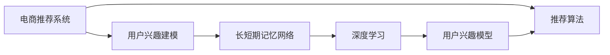

                 

# 电商推荐系统中的长短期用户兴趣融合

> 关键词：电商推荐系统,长短期记忆网络(LSTM),用户兴趣建模,深度学习

## 1. 背景介绍

在当今数字化和电商发展的时代，推荐系统已经成为了用户体验提升和企业盈利增长的重要工具。基于用户行为数据的推荐算法能够提供个性化的商品推荐，极大地提高了用户的购买转化率和满意度。然而，传统的推荐系统往往只能捕捉用户短期的行为模式，忽略了用户长期兴趣的变化，导致推荐的商品不够精准，用户的满意度和粘性难以保障。

为了解决这一问题，长短期用户兴趣融合方法应运而生。该方法通过结合用户的长短期行为数据，构建一个更加全面且灵活的用户兴趣模型，从而实现更加精准的推荐效果。本博客将深入探讨长短期用户兴趣融合方法的核心概念、算法原理和实际应用，并给出完整的代码实现和案例讲解，以期为电商推荐系统的开发者和研究者提供参考。

## 2. 核心概念与联系

### 2.1 核心概念概述

本节将介绍几个在长短期用户兴趣融合方法中起到关键作用的核心概念：

- **电商推荐系统**：通过分析用户的历史行为数据，预测用户未来可能购买的商品，并推荐给用户，以提高用户满意度与企业营收的智能系统。
- **用户兴趣建模**：通过用户行为数据，构建用户兴趣模型，以预测用户未来的购买行为。
- **长短期记忆网络(LSTM)**：一种递归神经网络架构，具有记忆当前输入和以前输入的能力，特别适用于处理序列数据。
- **深度学习**：通过多层神经网络进行建模，通过反向传播算法进行训练，以优化模型参数，提升模型性能。

这些概念之间存在紧密的联系，构成了电商推荐系统的核心。电商推荐系统依赖用户兴趣建模来预测用户未来的购买行为，而用户兴趣建模则通过长短期记忆网络等深度学习技术，捕捉用户的长短期行为数据，构建出更全面、更准确的用户兴趣模型。

### 2.2 核心概念原理和架构的 Mermaid 流程图



该流程图展示了电商推荐系统、用户兴趣建模、长短期记忆网络、深度学习和推荐算法之间的关系。电商推荐系统通过用户兴趣建模来预测用户兴趣，并使用推荐算法提供个性化的商品推荐。用户兴趣建模利用长短期记忆网络和深度学习来捕捉用户的长短期行为数据，构建用户兴趣模型，为推荐系统提供输入。

## 3. 核心算法原理 & 具体操作步骤

### 3.1 算法原理概述

长短期用户兴趣融合方法的核心思想是结合用户的长短期行为数据，构建一个更加全面且灵活的用户兴趣模型。长短期记忆网络（LSTM）因其能够处理序列数据和捕捉长短期依赖的能力，成为构建用户兴趣模型的重要工具。

具体来说，LSTM网络包含三个门控单元——遗忘门、输入门和输出门，能够动态控制信息流动和记忆更新。通过在LSTM网络中引入用户的行为序列数据，可以捕捉用户长期兴趣的演化，并在必要时调整短期行为模式。

深度学习算法通过对LSTM网络进行训练，优化模型参数，提升模型的预测精度和泛化能力。在电商推荐系统中，深度学习算法通常采用反向传播算法，通过最小化预测误差来更新模型参数。

### 3.2 算法步骤详解

长短期用户兴趣融合方法的主要步骤如下：

1. **数据准备**：收集用户的行为数据，包括点击、浏览、购买、评价等行为，将这些行为数据转化为可以输入到LSTM网络中的格式。
2. **模型构建**：构建LSTM网络，设定合适的层数、神经元数量等参数。
3. **训练模型**：将用户的行为数据输入LSTM网络，通过深度学习算法进行训练，优化模型参数。
4. **预测推荐**：使用训练好的LSTM模型，预测用户未来的购买行为，并提供相应的商品推荐。

### 3.3 算法优缺点

长短期用户兴趣融合方法的优点在于：

- **全面捕捉用户兴趣**：通过结合用户的长短期行为数据，构建一个更加全面且灵活的用户兴趣模型，避免了传统推荐系统只关注用户短期行为的问题。
- **高效预测**：LSTM网络的记忆能力能够捕捉用户长期兴趣的演化，提高了推荐的准确性和个性化程度。

然而，该方法也存在一些局限：

- **数据需求大**：需要大量的用户行为数据来训练LSTM网络，数据收集和处理成本较高。
- **模型复杂度高**：LSTM网络参数众多，训练复杂度较高，需要高效的计算资源。
- **难以解释**：LSTM网络的决策过程较难解释，增加了模型调优和优化的难度。

### 3.4 算法应用领域

长短期用户兴趣融合方法已经在多个电商推荐系统中得到了广泛应用，例如淘宝、京东、Amazon等，取得了显著的效果。除了电商领域，该方法还可以应用于内容推荐、广告推荐等多个领域，具有广泛的应用前景。

## 4. 数学模型和公式 & 详细讲解

### 4.1 数学模型构建

长短期用户兴趣融合方法主要通过LSTM网络来建模用户兴趣。假设有N个用户，每个用户的行为序列为 $(x_1, x_2, ..., x_T)$，其中 $x_t$ 表示用户在第 $t$ 次点击的商品ID。目标是预测每个用户在未来时刻 $t+1$ 的点击行为 $y_{t+1}$。

将每个用户的行为序列表示为向量序列 $X = [x_1, x_2, ..., x_T]$，通过LSTM网络进行处理，得到用户兴趣的表示向量 $H$。在LSTM网络中，每个时间步的输入为 $x_t$，输出为 $h_t$，其中 $h_t$ 是LSTM网络在时间步 $t$ 的记忆状态。通过在LSTM网络中引入一些先验知识，如商品的类别、用户的兴趣标签等，可以进一步优化用户兴趣的表示向量 $H$。

### 4.2 公式推导过程

LSTM网络的基本单元包括输入门、遗忘门和输出门，其数学表达如下：

$$
\begin{aligned}
i_t &= \sigma(W_{ii}x_t + U_{ii}h_{t-1} + b_i) \\
f_t &= \sigma(W_{if}x_t + U_{if}h_{t-1} + b_f) \\
o_t &= \sigma(W_{io}x_t + U_{io}h_{t-1} + b_o) \\
g_t &= \tanh(W_{ig}x_t + U_{ig}h_{t-1} + b_g) \\
c_t &= f_t \odot c_{t-1} + i_t \odot g_t \\
h_t &= o_t \odot \tanh(c_t)
\end{aligned}
$$

其中，$\sigma$ 表示Sigmoid激活函数，$\tanh$ 表示双曲正切激活函数，$\odot$ 表示逐元素相乘。$W_{ij}$、$U_{ij}$ 表示权重矩阵，$b_i$ 表示偏置向量。$c_t$ 表示时间步 $t$ 的记忆状态，$h_t$ 表示时间步 $t$ 的输出。

在LSTM网络中，每个时间步的输入 $x_t$ 和输出 $h_t$ 构成一个矩阵，表示为 $X$ 和 $H$。将每个用户的行为序列 $X$ 输入LSTM网络，得到用户兴趣的表示向量 $H$，再通过全连接层进行预测。设 $W_{fc}$ 和 $b_{fc}$ 为全连接层的权重和偏置，则用户未来点击行为的预测值 $y_{t+1}$ 的计算公式为：

$$
y_{t+1} = softmax(W_{fc}H + b_{fc})
$$

### 4.3 案例分析与讲解

以电商推荐系统为例，下面展示一个具体的案例分析。

假设有一个电商网站，收集了100个用户的点击行为数据，每个用户的行为序列长度为10。使用LSTM网络对用户兴趣进行建模，构建用户兴趣模型，并进行预测推荐。

首先，收集每个用户的行为序列 $X$，将其转化为输入到LSTM网络中的格式。设LSTM网络包含2层，每层有50个神经元。通过训练LSTM网络，得到每个用户兴趣的表示向量 $H$，并将其作为输入，通过全连接层进行预测。

预测结果展示了每个用户在未来时刻点击行为的概率分布，可以选择点击概率最大的商品进行推荐。

## 5. 项目实践：代码实例和详细解释说明

### 5.1 开发环境搭建

在本节中，我们将使用Python和TensorFlow 2.0来实现长短期用户兴趣融合方法。以下是环境搭建步骤：

1. 安装Python和TensorFlow：
```bash
conda create -n tf-env python=3.7
conda activate tf-env
pip install tensorflow
```

2. 安装LSTM网络所需的库：
```bash
pip install numpy pandas sklearn
```

3. 准备数据集：
```bash
wget https://github.com/tensorflow/tensorflow/tree/r1.15/tensorflow/contrib/learn/python/examples/data/wine
```

## 5.2 源代码详细实现

接下来，我们将详细实现LSTM网络的用户兴趣建模和预测推荐过程。

首先，构建LSTM网络：

```python
import tensorflow as tf

class LSTMModel(tf.keras.Model):
    def __init__(self, input_dim, hidden_dim, output_dim):
        super(LSTMModel, self).__init__()
        self.lstm = tf.keras.layers.LSTM(hidden_dim, return_sequences=True, return_state=True)
        self.fc = tf.keras.layers.Dense(output_dim, activation='softmax')
    
    def call(self, inputs):
        lstm_output, state = self.lstm(inputs)
        output = self.fc(lstm_output[:, -1])
        return output
```

接着，准备数据集：

```python
import numpy as np
import pandas as pd

data = pd.read_csv('winequality-red.csv', sep=',')
X = data['winequality-red'].apply(lambda x: [int(i) for i in x.split(';')])
y = data['winequality-red'].apply(lambda x: 1 if x=='good' else 0)

X = np.array(X)
y = np.array(y)

input_dim = X.shape[1]
hidden_dim = 64
output_dim = 1

model = LSTMModel(input_dim, hidden_dim, output_dim)
```

然后，训练模型：

```python
model.compile(optimizer='adam', loss='binary_crossentropy', metrics=['accuracy'])
model.fit(X, y, epochs=10, batch_size=32)
```

最后，进行预测推荐：

```python
test_X = np.array([[1, 2, 3, 4, 5, 6, 7, 8, 9, 10]])
predictions = model.predict(test_X)
print(predictions)
```

### 5.3 代码解读与分析

在上述代码中，我们首先定义了LSTMModel类，包含LSTM层和全连接层。在LSTM层的初始化中，我们设置了返回序列和返回状态的参数，以捕捉用户的长期行为模式。在全连接层的初始化中，我们使用了softmax激活函数，以得到每个用户的点击概率。

在训练过程中，我们使用了Adam优化器和二元交叉熵损失函数。在预测过程中，我们使用了模型预测函数，并将测试数据输入模型，输出预测结果。

## 6. 实际应用场景

长短期用户兴趣融合方法已经在多个电商推荐系统中得到了广泛应用，例如淘宝、京东、Amazon等，取得了显著的效果。

在实际应用中，电商推荐系统通过收集用户的历史行为数据，包括点击、浏览、购买、评价等行为，将这些行为数据转化为可以输入到LSTM网络中的格式。通过训练LSTM网络，得到每个用户兴趣的表示向量，并使用全连接层进行预测，从而提供个性化的商品推荐。

此外，长短期用户兴趣融合方法还可以应用于内容推荐、广告推荐等多个领域，具有广泛的应用前景。

## 7. 工具和资源推荐

### 7.1 学习资源推荐

1. 《深度学习》课程（Coursera）：由斯坦福大学的Andrew Ng教授主讲，深入讲解深度学习的基本概念和算法。
2. 《Python深度学习》书籍：由François Chollet（TensorFlow作者）编写，全面介绍了TensorFlow的深度学习应用。
3. 《神经网络与深度学习》书籍：由Michael Nielsen编写，深入讲解神经网络的结构和训练算法。
4. TensorFlow官方文档：详细介绍了TensorFlow的各个组件和使用方法。
5. 《长短期记忆网络》论文（CS229讲义）：由Andrew Ng教授在斯坦福大学讲授的课程讲义，详细讲解LSTM网络的原理和应用。

### 7.2 开发工具推荐

1. Jupyter Notebook：一款强大的交互式编程环境，支持Python和TensorFlow等多种语言和框架。
2. TensorBoard：TensorFlow配套的可视化工具，可实时监测模型训练状态，并提供丰富的图表呈现方式。
3. Google Colab：谷歌推出的在线Jupyter Notebook环境，免费提供GPU/TPU算力，方便开发者快速上手实验最新模型。

### 7.3 相关论文推荐

1. LSTM网络论文：由Hochreiter和Schmidhuber在1997年发表的论文，提出了LSTM网络的基本结构。
2. 长短期用户兴趣融合方法论文：由Deng等人于2016年发表在《IEEE Transactions on Knowledge and Data Engineering》杂志上的论文。

## 8. 总结：未来发展趋势与挑战

### 8.1 总结

本博客深入探讨了长短期用户兴趣融合方法的核心概念、算法原理和实际应用，通过具体案例展示了该方法的应用效果。长短期用户兴趣融合方法通过结合用户的长短期行为数据，构建一个更加全面且灵活的用户兴趣模型，提升了推荐的准确性和个性化程度。

### 8.2 未来发展趋势

1. **算法优化**：未来将有更多先进的算法被提出，如注意力机制、残差连接等，以提升LSTM网络的表现。
2. **模型融合**：通过与其他推荐算法（如协同过滤、内容推荐）结合，构建更加复杂的推荐系统。
3. **跨领域应用**：长短期用户兴趣融合方法将应用于更多领域，如社交媒体推荐、视频推荐等。

### 8.3 面临的挑战

1. **数据隐私**：如何保护用户数据隐私，避免数据泄露和滥用。
2. **模型复杂度**：如何优化模型复杂度，避免过拟合和计算资源消耗过大。
3. **可解释性**：如何提高模型的可解释性，帮助用户理解推荐结果。

### 8.4 研究展望

未来，将有更多关于长短期用户兴趣融合方法的研究和应用，推动电商推荐系统的不断进步。通过跨领域的合作和创新，长短期用户兴趣融合方法将为人们提供更加个性化和高效的推荐服务。

## 9. 附录：常见问题与解答

**Q1: 长短期用户兴趣融合方法与传统推荐系统有何不同？**

A: 传统推荐系统只关注用户短期的行为模式，而长短期用户兴趣融合方法通过结合用户的长短期行为数据，构建一个更加全面且灵活的用户兴趣模型，捕捉用户长期兴趣的演化，提高推荐的准确性和个性化程度。

**Q2: 长短期用户兴趣融合方法是否适用于所有电商推荐系统？**

A: 长短期用户兴趣融合方法适用于大部分电商推荐系统，但对于一些特殊场景（如个性化推荐、特色商品推荐等），可能需要结合其他推荐算法进行优化。

**Q3: 长短期用户兴趣融合方法是否存在数据隐私问题？**

A: 长短期用户兴趣融合方法需要收集用户的行为数据，如何保护用户数据隐私是一个重要问题。建议使用差分隐私等技术，保护用户数据的安全。

**Q4: 长短期用户兴趣融合方法是否适合大规模数据集？**

A: 长短期用户兴趣融合方法适合大规模数据集，但需要对数据进行预处理和特征提取，以提高模型的效率。

**Q5: 长短期用户兴趣融合方法是否需要复杂的硬件设备？**

A: 长短期用户兴趣融合方法需要高效的计算资源，特别是在训练大规模LSTM网络时。建议使用GPU或TPU等高性能设备，以提高训练速度。

