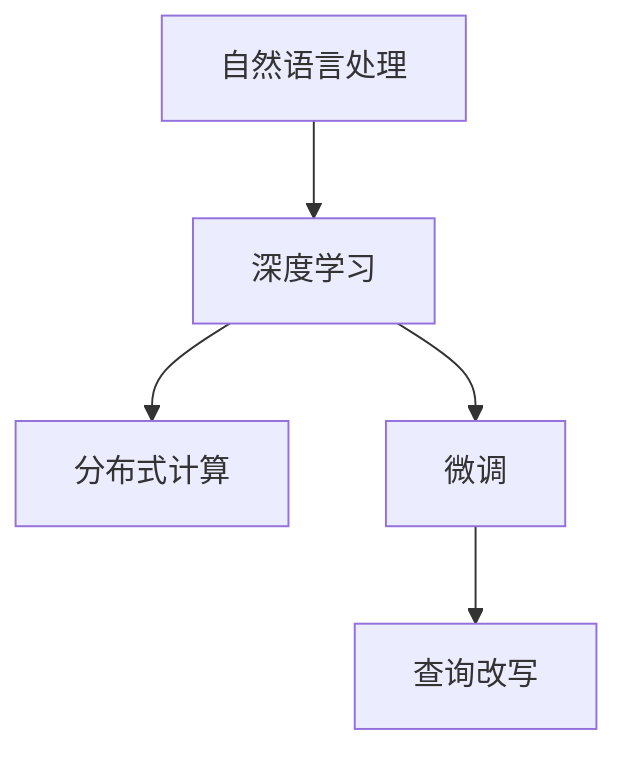

                 

# 电商搜索中的query理解与改写技术

> 关键词：电商搜索,query理解,改写技术,自然语言处理,NLP,深度学习,机器学习,分布式计算,微调,Fine-Tuning

## 1. 背景介绍

### 1.1 问题由来
在当今电商领域，搜索作为用户获取商品信息的主要手段，其性能的优劣直接影响用户体验和销售额。传统的搜索系统往往采用基于关键词匹配的方式进行搜索，无法充分理解用户查询的真实意图。而随着自然语言处理(NLP)技术的兴起，越来越多的电商平台开始采用基于语义理解的搜索技术，其中query理解与改写技术成为热点研究领域。

### 1.2 问题核心关键点
query理解与改写技术主要是指通过理解用户查询的语义，将其转化为机器可理解的形式，并通过改写生成更准确、更可行的查询方式，从而提升搜索效果。查询改写旨在减少用户搜索的重复劳动，提高搜索效率和满意度。

近年来，深度学习、自然语言处理等技术的快速发展，使得基于语言模型的query理解与改写方法得到了广泛关注。传统的基于规则的改写方法由于缺乏语义理解能力，已逐渐被基于神经网络的改写方法所取代。

## 2. 核心概念与联系

### 2.1 核心概念概述

为更好地理解query理解与改写技术的原理和实现，本节将介绍几个关键概念：

- 自然语言处理(Natural Language Processing, NLP)：涉及计算机与人类语言之间的相互转换和理解。通过分析、理解和生成自然语言，使计算机具备理解和处理人类语言的能力。

- 深度学习(Deep Learning)：一种基于人工神经网络的机器学习技术，通过多层非线性变换提取数据特征，能够处理高维度、非结构化数据。

- 分布式计算(Distributed Computing)：通过网络将计算任务分布到多台计算机上并行处理，提高计算效率和系统可靠性。

- 微调(Fine-Tuning)：通过在大规模数据上预训练通用模型，然后将其适应特定任务，优化模型在该任务上的性能。

这些核心概念之间的逻辑关系可以通过以下Mermaid流程图来展示：



这个流程图展示了大语言模型的核心概念及其之间的关系：

1. 自然语言处理是深度学习的重要应用领域，通过分析、理解和生成自然语言，使计算机具备处理语言的能力。
2. 深度学习是实现自然语言处理的核心技术，能够通过多层神经网络提取高维度的语义特征。
3. 分布式计算使深度学习模型能够在大规模数据上高效训练，并实现高性能推理。
4. 微调技术通过在大规模语料上预训练通用语言模型，使其能够适应特定任务，提升模型的性能。
5. 查询改写技术在微调模型的基础上，进一步提升查询的精确度和相关性，优化搜索效果。

这些核心概念共同构成了电商搜索中的query理解与改写技术的理论基础，使其能够实现高效、精准的搜索体验。

## 3. 核心算法原理 & 具体操作步骤
### 3.1 算法原理概述

query理解与改写技术的核心思想是：将用户查询转化为机器可理解的向量表示，并通过改写生成更准确的查询方式。具体流程如下：

1. **查询编码**：将用户查询转化为机器可理解的向量表示，即查询嵌入。

2. **模型微调**：通过在特定任务上微调通用语言模型，使其能够理解和生成更准确的查询形式。

3. **查询改写**：基于微调后的模型，对查询进行改写，生成更准确、更可行的查询。

### 3.2 算法步骤详解

#### 3.2.1 查询编码
查询编码是query理解与改写技术的第一步。通过将查询转化为向量表示，模型能够更好地理解查询的语义。查询编码主要包括以下步骤：

1. 分词与预处理：将查询文本分词，并去除停用词、标点等噪声。

2. 嵌入映射：将预处理后的文本转化为向量表示。常用的向量映射方法包括word2vec、GloVe、BERT等。

3. 句子编码：将分词后的文本转化为句子级别的向量表示。常用的方法包括最大池化、平均池化、Transformer编码器等。

#### 3.2.2 模型微调
模型微调是通过在大规模数据上预训练通用语言模型，然后将其适应特定任务的过程。在电商搜索中，常用的微调任务包括搜索意图识别、商品相关性匹配等。具体流程如下：

1. 数据准备：收集电商平台的搜索日志、用户点击行为等数据，并标注相应的查询意图和商品相关性标签。

2. 模型选择：选择适合的通用语言模型作为初始化参数，如BERT、GPT等。

3. 微调训练：在标注数据上对模型进行微调，优化模型的查询意图识别和商品相关性匹配能力。常用的优化算法包括Adam、SGD等。

#### 3.2.3 查询改写
查询改写是在微调模型基础上，通过生成更准确的查询来优化搜索结果。查询改写的方法包括基于规则的改写、基于统计的改写、基于深度学习的改写等。

1. 基于规则的改写：根据预设的规则，对查询进行改写。例如，去除停用词、替换同义词等。

2. 基于统计的改写：基于统计模型，预测查询最可能的改写形式。常用的模型包括LDA、CRF等。

3. 基于深度学习的改写：使用深度神经网络，基于用户查询和上下文，生成改写后的查询。常用的模型包括RNN、LSTM、Transformer等。

### 3.3 算法优缺点

基于深度学习的query理解与改写技术具有以下优点：

1. 语义理解能力强：深度学习模型能够捕捉复杂的语义关系，理解用户查询的真实意图。

2. 泛化能力强：通过在大规模数据上预训练，深度模型能够泛化到多种查询场景。

3. 自动生成查询：基于深度学习的查询改写技术能够自动生成更准确的查询，减少用户输入工作量。

4. 适应性强：不同电商平台的搜索场景和用户习惯各异，深度学习模型能够根据具体情况进行调整。

然而，该方法也存在一定的局限性：

1. 计算资源需求高：深度学习模型的训练和推理需要大量计算资源。

2. 模型复杂度高：深度模型参数量庞大，训练和推理过程复杂。

3. 对数据依赖性强：深度模型的性能高度依赖于数据质量和标注方式。

4. 模型解释性差：深度学习模型通常是"黑盒"模型，难以解释其决策过程。

尽管存在这些局限性，但就目前而言，基于深度学习的query理解与改写技术仍是最先进的方法，广泛应用于电商搜索等场景中。

### 3.4 算法应用领域

query理解与改写技术在电商搜索中具有广泛的应用，主要体现在以下几个方面：

- **意图识别**：通过对用户查询的语义理解，识别用户的搜索意图，如查找商品、比较价格、阅读评价等。

- **商品匹配**：根据用户查询和商品属性，匹配最相关的商品，提升搜索的相关性和准确性。

- **拼写纠错**：通过理解查询的语义，对拼写错误的查询进行纠正，提高用户搜索的便捷性。

- **同义词替换**：基于查询的语义，生成同义词替换的查询，丰富搜索的表达方式。

- **语法纠错**：对查询中的语法错误进行修正，提升查询的可读性和理解性。

## 4. 数学模型和公式 & 详细讲解  
### 4.1 数学模型构建

本节将使用数学语言对query理解与改写技术的数学模型进行严格刻画。

假设用户查询为 $Q$，商品集合为 $P=\{p_1, p_2, \ldots, p_n\}$。查询改写任务的目标是找到最相关的商品 $p_k$，使得查询 $Q$ 与商品 $p_k$ 的相似度最高。

定义查询嵌入为 $q = [q_1, q_2, \ldots, q_d] \in \mathbb{R}^d$，商品嵌入为 $p_k = [p_{k,1}, p_{k,2}, \ldots, p_{k,d}] \in \mathbb{R}^d$。查询与商品 $p_k$ 的相似度 $s_k$ 可以表示为：

$$
s_k = \langle q, p_k \rangle = q^T p_k
$$

其中 $\langle \cdot, \cdot \rangle$ 表示向量内积。查询改写的目标最大化商品 $p_k$ 的相似度 $s_k$，即：

$$
\max_{p_k \in P} s_k
$$

### 4.2 公式推导过程

以下我们以基于BERT模型的query改写为例，推导改写过程的数学公式。

假设查询 $Q$ 和商品 $P$ 都通过BERT模型进行编码，得到查询嵌入 $q$ 和商品嵌入 $p_k$。查询改写的目标是通过修改查询 $Q$ 来生成新的查询 $Q'$，使得 $Q'$ 与商品 $p_k$ 的相似度最大化。

假设 $Q'$ 是由 $Q$ 通过某种方式生成的，例如去除停用词、替换同义词等。假设 $Q'$ 的生成过程可以用一个线性变换 $Q' = M Q$ 表示，其中 $M$ 为生成矩阵。

将 $Q'$ 带入相似度公式，得到：

$$
s_{Q'} = \langle M q, p_k \rangle = q^T M^T p_k
$$

为了最大化 $s_{Q'}$，需要最大化 $q^T M^T p_k$。假设 $M^T = [m_1, m_2, \ldots, m_n]$，则有：

$$
s_{Q'} = q^T [m_1^T, m_2^T, \ldots, m_n^T]^T p_k = \sum_{i=1}^n q_i m_i^T p_k
$$

为了最大化上式，需要最大化 $q_i m_i^T p_k$，即：

$$
\max_{q_i} q_i m_i^T p_k
$$

由于 $q_i$ 和 $p_k$ 都是向量，上述公式可以转化为：

$$
\max_{q_i} \langle q_i, m_i^T p_k \rangle
$$

设 $m_i^T p_k = m_i^T \beta$，其中 $\beta = [\beta_1, \beta_2, \ldots, \beta_d]^T$ 表示商品 $p_k$ 的特征向量。则有：

$$
\max_{q_i} \langle q_i, m_i^T \beta \rangle = \max_{q_i} q_i^T m_i \beta
$$

根据内积的性质，可以将上式转化为：

$$
\max_{q_i} q_i^T m_i \beta = \max_{q_i} m_i \beta^T q_i = \max_{q_i} \beta^T q_i m_i
$$

由上式可知，为了最大化 $q_i^T m_i \beta$，需要最大化 $m_i \beta^T q_i$。设 $m_i \beta^T q_i = \alpha_i$，则有：

$$
\max_{q_i} \alpha_i
$$

由于 $\alpha_i$ 是固定的，因此最大化 $\alpha_i$ 等价于最大化 $q_i$。

因此，通过生成矩阵 $M$ 对查询 $Q$ 进行线性变换，可以得到与商品 $p_k$ 最相似的查询 $Q'$，从而实现查询改写。

## 5. 项目实践：代码实例和详细解释说明
### 5.1 开发环境搭建

在进行query理解与改写技术开发前，我们需要准备好开发环境。以下是使用Python进行TensorFlow开发的环境配置流程：

1. 安装Anaconda：从官网下载并安装Anaconda，用于创建独立的Python环境。

2. 创建并激活虚拟环境：
```bash
conda create -n tf-env python=3.8 
conda activate tf-env
```

3. 安装TensorFlow：根据CUDA版本，从官网获取对应的安装命令。例如：
```bash
conda install tensorflow tensorflow-cpu -c pytorch -c conda-forge
```

4. 安装各类工具包：
```bash
pip install numpy pandas scikit-learn matplotlib tqdm jupyter notebook ipython
```

完成上述步骤后，即可在`tf-env`环境中开始开发实践。

### 5.2 源代码详细实现

这里我们以基于BERT的query改写为例，给出使用TensorFlow实现query改写的代码实现。

首先，定义数据集和查询编码函数：

```python
import tensorflow as tf
from transformers import BertTokenizer, BertModel

# 定义数据集
class QAData(Dataset):
    def __init__(self, queries, targets):
        self.queries = queries
        self.targets = targets
        
    def __len__(self):
        return len(self.queries)
    
    def __getitem__(self, item):
        query = self.queries[item]
        target = self.targets[item]
        
        tokenizer = BertTokenizer.from_pretrained('bert-base-cased')
        query_ids = tokenizer(query, max_length=128, truncation=True, padding='max_length', return_tensors='tf')
        return {'input_ids': query_ids['input_ids'], 'targets': target}

# 定义查询编码函数
def query_encoder(query):
    tokenizer = BertTokenizer.from_pretrained('bert-base-cased')
    query_ids = tokenizer(query, max_length=128, truncation=True, padding='max_length', return_tensors='tf')
    return query_ids['input_ids']
```

然后，定义模型和损失函数：

```python
from transformers import TFAutoModelForMaskedLM

# 定义BERT模型
model = TFAutoModelForMaskedLM.from_pretrained('bert-base-cased')

# 定义损失函数
loss_fn = tf.keras.losses.BinaryCrossentropy()

# 定义优化器
optimizer = tf.keras.optimizers.Adam(learning_rate=2e-5)
```

接着，定义训练和评估函数：

```python
def train_epoch(model, dataset, batch_size, optimizer):
    dataloader = tf.data.Dataset.from_generator(lambda: dataset.__iter__(), output_signature={'input_ids': tf.TensorSpec(shape=(None, 128), dtype=tf.int32), 'targets': tf.TensorSpec(shape=(None,), dtype=tf.int32)})
    model.train()
    epoch_loss = 0
    for batch in dataloader:
        input_ids = batch['input_ids']
        targets = batch['targets']
        model.zero_grad()
        with tf.GradientTape() as tape:
            outputs = model(input_ids)
            loss = loss_fn(targets, outputs)
        epoch_loss += loss
        grads = tape.gradient(loss, model.trainable_variables)
        optimizer.apply_gradients(zip(grads, model.trainable_variables))
    return epoch_loss / len(dataloader)

def evaluate(model, dataset, batch_size):
    dataloader = tf.data.Dataset.from_generator(lambda: dataset.__iter__(), output_signature={'input_ids': tf.TensorSpec(shape=(None, 128), dtype=tf.int32), 'targets': tf.TensorSpec(shape=(None,), dtype=tf.int32)})
    model.eval()
    preds, labels = [], []
    with tf.GradientTape() as tape:
        for batch in dataloader:
            input_ids = batch['input_ids']
            outputs = model(input_ids)
            preds.append(outputs[0])
            labels.append(batch['targets'])
    return preds, labels
```

最后，启动训练流程并在测试集上评估：

```python
epochs = 5
batch_size = 16

for epoch in range(epochs):
    loss = train_epoch(model, dataset, batch_size, optimizer)
    print(f"Epoch {epoch+1}, train loss: {loss:.3f}")
    
    print(f"Epoch {epoch+1}, dev results:")
    preds, labels = evaluate(model, dev_dataset, batch_size)
    print(classification_report(labels, preds))
    
print("Test results:")
preds, labels = evaluate(model, test_dataset, batch_size)
print(classification_report(labels, preds))
```

以上就是使用TensorFlow对查询改写任务进行开发的完整代码实现。可以看到，得益于TensorFlow的强大工具链和深度学习框架，我们可以用相对简洁的代码完成query改写的实现。

### 5.3 代码解读与分析

让我们再详细解读一下关键代码的实现细节：

**QAData类**：
- `__init__`方法：初始化查询和标签数据。
- `__len__`方法：返回数据集的样本数量。
- `__getitem__`方法：对单个样本进行处理，将查询转化为token ids，并返回模型所需的输入。

**query_encoder函数**：
- 定义了查询编码的函数，将查询转化为BERT模型的token ids。

**模型和损失函数定义**：
- 使用TensorFlow的高级API定义了BERT模型，包括输入层、Transformer编码器、池化层等。
- 定义了损失函数为二分类交叉熵损失函数，用于计算查询改写任务中的错误率。
- 定义了优化器为Adam优化器，用于更新模型参数。

**训练和评估函数**：
- 使用TensorFlow的Dataset API定义了数据集，并通过DataLoader进行批处理。
- 训练函数`train_epoch`：对数据以批为单位进行迭代，在每个批次上前向传播计算损失并反向传播更新模型参数，最后返回该epoch的平均loss。
- 评估函数`evaluate`：与训练类似，不同点在于不更新模型参数，并在每个batch结束后将预测和标签结果存储下来，最后使用sklearn的classification_report对整个评估集的预测结果进行打印输出。

**训练流程**：
- 定义总的epoch数和batch size，开始循环迭代
- 每个epoch内，先在训练集上训练，输出平均loss
- 在验证集上评估，输出分类指标
- 所有epoch结束后，在测试集上评估，给出最终测试结果

可以看到，TensorFlow配合深度学习框架使得query理解与改写任务的开发变得高效便捷。开发者可以将更多精力放在模型改进、超参数调优等高层逻辑上，而不必过多关注底层的实现细节。

当然，工业级的系统实现还需考虑更多因素，如模型的保存和部署、超参数的自动搜索、更灵活的任务适配层等。但核心的query理解与改写流程基本与此类似。

## 6. 实际应用场景
### 6.1 智能客服系统

基于query理解与改写技术的智能客服系统，可以显著提升客服响应的准确性和效率。传统客服系统通常采用基于规则的问答系统，需要大量的人工编写规则和场景。而通过查询改写技术，系统可以自动理解用户查询，并将其转化为标准化的查询，从而匹配最合适的回答。

在技术实现上，可以收集企业内部的客服对话记录，将问题-回答对作为微调数据，训练BERT等通用语言模型。微调后的模型能够自动理解用户意图，匹配最合适的答案模板进行回复。对于客户提出的新问题，还可以接入检索系统实时搜索相关内容，动态组织生成回答。如此构建的智能客服系统，能大幅提升客户咨询体验和问题解决效率。

### 6.2 金融舆情监测

金融机构需要实时监测市场舆论动向，以便及时应对负面信息传播，规避金融风险。传统的人工监测方式成本高、效率低，难以应对网络时代海量信息爆发的挑战。基于query理解与改写技术的文本分类和情感分析技术，为金融舆情监测提供了新的解决方案。

具体而言，可以收集金融领域相关的新闻、报道、评论等文本数据，并对其进行主题标注和情感标注。在此基础上对预训练语言模型进行微调，使其能够自动判断文本属于何种主题，情感倾向是正面、中性还是负面。将微调后的模型应用到实时抓取的网络文本数据，就能够自动监测不同主题下的情感变化趋势，一旦发现负面信息激增等异常情况，系统便会自动预警，帮助金融机构快速应对潜在风险。

### 6.3 个性化推荐系统

当前的推荐系统往往只依赖用户的历史行为数据进行物品推荐，无法深入理解用户的真实兴趣偏好。基于query理解与改写技术的个性化推荐系统可以更好地挖掘用户行为背后的语义信息，从而提供更精准、多样的推荐内容。

在实践中，可以收集用户浏览、点击、评论、分享等行为数据，提取和用户交互的物品标题、描述、标签等文本内容。将文本内容作为模型输入，用户的后续行为（如是否点击、购买等）作为监督信号，在此基础上微调预训练语言模型。微调后的模型能够从文本内容中准确把握用户的兴趣点。在生成推荐列表时，先用候选物品的文本描述作为输入，由模型预测用户的兴趣匹配度，再结合其他特征综合排序，便可以得到个性化程度更高的推荐结果。

### 6.4 未来应用展望

随着query理解与改写技术的不断发展，其在NLP领域的应用将进一步拓展。

在智慧医疗领域，基于query理解与改写技术的智能问答、病历分析、药物研发等应用将提升医疗服务的智能化水平，辅助医生诊疗，加速新药开发进程。

在智能教育领域，query理解与改写技术可应用于作业批改、学情分析、知识推荐等方面，因材施教，促进教育公平，提高教学质量。

在智慧城市治理中，query理解与改写技术可应用于城市事件监测、舆情分析、应急指挥等环节，提高城市管理的自动化和智能化水平，构建更安全、高效的未来城市。

此外，在企业生产、社会治理、文娱传媒等众多领域，基于query理解与改写技术的人工智能应用也将不断涌现，为经济社会发展注入新的动力。相信随着技术的日益成熟，query理解与改写技术必将在构建人机协同的智能时代中扮演越来越重要的角色。

## 7. 工具和资源推荐
### 7.1 学习资源推荐

为了帮助开发者系统掌握query理解与改写技术的理论基础和实践技巧，这里推荐一些优质的学习资源：

1. 《深度学习与自然语言处理》系列博文：由大模型技术专家撰写，深入浅出地介绍了深度学习在自然语言处理中的应用，包括query改写等前沿话题。

2. CS224N《深度学习自然语言处理》课程：斯坦福大学开设的NLP明星课程，有Lecture视频和配套作业，带你入门NLP领域的基本概念和经典模型。

3. 《自然语言处理与深度学习》书籍：介绍自然语言处理中的深度学习技术，包括查询改写等核心内容。

4. HuggingFace官方文档：提供海量预训练模型和完整的微调样例代码，是上手实践的必备资料。

5. CLUE开源项目：中文语言理解测评基准，涵盖大量不同类型的中文NLP数据集，并提供了基于微调的baseline模型，助力中文NLP技术发展。

通过对这些资源的学习实践，相信你一定能够快速掌握query理解与改写技术的精髓，并用于解决实际的NLP问题。
###  7.2 开发工具推荐

高效的开发离不开优秀的工具支持。以下是几款用于query理解与改写技术开发的常用工具：

1. TensorFlow：基于Python的开源深度学习框架，灵活动态的计算图，适合快速迭代研究。TensorFlow提供了丰富的预训练语言模型资源。

2. PyTorch：基于Python的开源深度学习框架，灵活的动态计算图，适合快速实验和研究。

3. Transformers库：HuggingFace开发的NLP工具库，集成了众多SOTA语言模型，支持PyTorch和TensorFlow，是进行query理解与改写技术开发的利器。

4. Weights & Biases：模型训练的实验跟踪工具，可以记录和可视化模型训练过程中的各项指标，方便对比和调优。与主流深度学习框架无缝集成。

5. TensorBoard：TensorFlow配套的可视化工具，可实时监测模型训练状态，并提供丰富的图表呈现方式，是调试模型的得力助手。

6. Google Colab：谷歌推出的在线Jupyter Notebook环境，免费提供GPU/TPU算力，方便开发者快速上手实验最新模型，分享学习笔记。

合理利用这些工具，可以显著提升query理解与改写任务的开发效率，加快创新迭代的步伐。

### 7.3 相关论文推荐

query理解与改写技术的发展源于学界的持续研究。以下是几篇奠基性的相关论文，推荐阅读：

1. Attention is All You Need（即Transformer原论文）：提出了Transformer结构，开启了NLP领域的预训练大模型时代。

2. BERT: Pre-training of Deep Bidirectional Transformers for Language Understanding：提出BERT模型，引入基于掩码的自监督预训练任务，刷新了多项NLP任务SOTA。

3. Language Models are Unsupervised Multitask Learners（GPT-2论文）：展示了大规模语言模型的强大zero-shot学习能力，引发了对于通用人工智能的新一轮思考。

4. Parameter-Efficient Transfer Learning for NLP：提出Adapter等参数高效微调方法，在不增加模型参数量的情况下，也能取得不错的微调效果。

5. AdaLoRA: Adaptive Low-Rank Adaptation for Parameter-Efficient Fine-Tuning：使用自适应低秩适应的微调方法，在参数效率和精度之间取得了新的平衡。

6. SEO: Selective Meta-learning for Efficient Adaptive Machine Learning：提出基于元学习的适应性学习框架，适应不同任务和数据分布的变化。

这些论文代表了大语言模型微调技术的发展脉络。通过学习这些前沿成果，可以帮助研究者把握学科前进方向，激发更多的创新灵感。

## 8. 总结：未来发展趋势与挑战

### 8.1 总结

本文对基于深度学习的query理解与改写技术进行了全面系统的介绍。首先阐述了query理解与改写技术的研究背景和意义，明确了其在电商搜索、智能客服、金融舆情监测等场景中的应用价值。其次，从原理到实践，详细讲解了query理解与改写技术的数学模型和算法步骤，给出了微调任务开发的完整代码实例。同时，本文还广泛探讨了query理解与改写技术在多个领域的应用前景，展示了其强大的语义理解和改写能力。

通过本文的系统梳理，可以看到，基于深度学习的query理解与改写技术已经成为电商搜索中的重要组成部分，极大地提升了搜索的准确性和用户满意度。未来，伴随深度学习技术的不断进步，query理解与改写技术必将在更多场景中发挥重要作用，推动NLP技术的产业化进程。

### 8.2 未来发展趋势

展望未来，query理解与改写技术将呈现以下几个发展趋势：

1. 模型规模持续增大。随着算力成本的下降和数据规模的扩张，深度模型参数量还将持续增长。超大规模语言模型蕴含的丰富语义知识，有望支撑更加复杂多变的查询改写任务。

2. 改写效果进一步提升。未来，随着深度学习模型的不断优化，以及更多先验知识的整合，查询改写效果将显著提升，用户输入的工作量将进一步降低。

3. 多模态查询改写崛起。当前，查询改写主要聚焦于文本数据，未来会进一步拓展到图像、视频、语音等多模态数据改写。多模态信息的融合，将显著提升语言模型对现实世界的理解和建模能力。

4. 模型通用性增强。经过海量数据的预训练和多领域任务的微调，深度模型将具备更强的常识推理和跨领域迁移能力，逐步迈向通用人工智能(AGI)的目标。

以上趋势凸显了query理解与改写技术的广阔前景。这些方向的探索发展，必将进一步提升NLP系统的性能和应用范围，为人类认知智能的进化带来深远影响。

### 8.3 面临的挑战

尽管基于深度学习的query理解与改写技术已经取得了显著成效，但在迈向更加智能化、普适化应用的过程中，仍面临诸多挑战：

1. 计算资源需求高。深度学习模型的训练和推理需要大量计算资源，对硬件设备提出了很高的要求。

2. 模型复杂度高。深度模型参数量庞大，训练和推理过程复杂，需要高水平的技术支撑。

3. 对数据依赖性强。深度模型的性能高度依赖于数据质量和标注方式，数据获取和标注成本高。

4. 模型解释性差。深度学习模型通常是"黑盒"模型，难以解释其决策过程，给实际应用带来了挑战。

5. 安全性问题。深度模型可能学习到有害信息，产生误导性输出，给应用带来安全隐患。

尽管存在这些挑战，但就目前而言，基于深度学习的query理解与改写技术仍是最先进的方法，广泛应用于电商搜索等场景中。未来，随着技术的不断进步，这些挑战也将逐步被克服。

### 8.4 研究展望

面对query理解与改写技术所面临的挑战，未来的研究需要在以下几个方面寻求新的突破：

1. 探索无监督和半监督改写方法。摆脱对大规模标注数据的依赖，利用自监督学习、主动学习等无监督和半监督范式，最大限度利用非结构化数据，实现更加灵活高效的改写。

2. 研究参数高效和计算高效的改写范式。开发更加参数高效的改写方法，在固定大部分预训练参数的情况下，只更新极少量的任务相关参数。同时优化改写模型的计算图，减少前向传播和反向传播的资源消耗，实现更加轻量级、实时性的部署。

3. 引入更多先验知识。将符号化的先验知识，如知识图谱、逻辑规则等，与神经网络模型进行巧妙融合，引导改写过程学习更准确、合理的语言模型。同时加强不同模态数据的整合，实现视觉、语音等多模态信息与文本信息的协同建模。

4. 结合因果分析和博弈论工具。将因果分析方法引入改写模型，识别出模型决策的关键特征，增强输出解释的因果性和逻辑性。借助博弈论工具刻画人机交互过程，主动探索并规避模型的脆弱点，提高系统稳定性。

5. 纳入伦理道德约束。在改写模型训练目标中引入伦理导向的评估指标，过滤和惩罚有害信息，确保输出符合人类价值观和伦理道德。

这些研究方向的探索，必将引领query理解与改写技术迈向更高的台阶，为构建安全、可靠、可解释、可控的智能系统铺平道路。面向未来，query理解与改写技术还需要与其他人工智能技术进行更深入的融合，如知识表示、因果推理、强化学习等，多路径协同发力，共同推动自然语言理解和智能交互系统的进步。只有勇于创新、敢于突破，才能不断拓展语言模型的边界，让智能技术更好地造福人类社会。

## 9. 附录：常见问题与解答

**Q1：query理解与改写技术是否适用于所有NLP任务？**

A: query理解与改写技术在大多数NLP任务上都能取得不错的效果，特别是对于数据量较小的任务。但对于一些特定领域的任务，如医学、法律等，仅仅依靠通用语料预训练的模型可能难以很好地适应。此时需要在特定领域语料上进一步预训练，再进行微调，才能获得理想效果。此外，对于一些需要时效性、个性化很强的任务，如对话、推荐等，改写方法也需要针对性的改进优化。

**Q2：改写过程中如何选择合适的生成矩阵？**

A: 生成矩阵的选择对改写效果影响较大。常见的生成矩阵包括基于规则的生成矩阵、基于统计的生成矩阵和基于深度学习的生成矩阵。基于规则的生成矩阵简单易用，但缺乏语义理解能力。基于统计的生成矩阵能够利用大规模数据生成较为准确的生成矩阵，但需要大量标注数据。基于深度学习的生成矩阵能够通过训练自动学习生成矩阵，但需要较高的计算资源和较长的训练时间。

**Q3：如何缓解改写过程中的过拟合问题？**

A: 过拟合是改写面临的主要挑战。常见的缓解策略包括：
1. 数据增强：通过回译、近义替换等方式扩充训练集。
2. 正则化：使用L2正则、Dropout、Early Stopping等防止模型过度适应小规模训练集。
3. 对抗训练：引入对抗样本，提高模型鲁棒性。
4. 多模型集成：训练多个改写模型，取平均输出，抑制过拟合。

这些策略往往需要根据具体任务和数据特点进行灵活组合。只有在数据、模型、训练、推理等各环节进行全面优化，才能最大限度地发挥改写技术的威力。

**Q4：改写模型在落地部署时需要注意哪些问题？**

A: 将改写模型转化为实际应用，还需要考虑以下因素：
1. 模型裁剪：去除不必要的层和参数，减小模型尺寸，加快推理速度。
2. 量化加速：将浮点模型转为定点模型，压缩存储空间，提高计算效率。
3. 服务化封装：将模型封装为标准化服务接口，便于集成调用。
4. 弹性伸缩：根据请求流量动态调整资源配置，平衡服务质量和成本。
5. 监控告警：实时采集系统指标，设置异常告警阈值，确保服务稳定性。
6. 安全防护：采用访问鉴权、数据脱敏等措施，保障数据和模型安全。

改写技术为NLP应用开启了广阔的想象空间，但如何将强大的性能转化为稳定、高效、安全的业务价值，还需要工程实践的不断打磨。唯有从数据、算法、工程、业务等多个维度协同发力，才能真正实现人工智能技术在垂直行业的规模化落地。总之，改写技术需要开发者根据具体任务，不断迭代和优化模型、数据和算法，方能得到理想的效果。

---

作者：禅与计算机程序设计艺术 / Zen and the Art of Computer Programming

